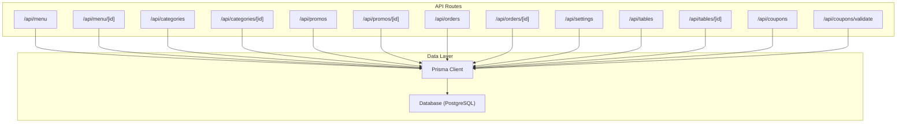
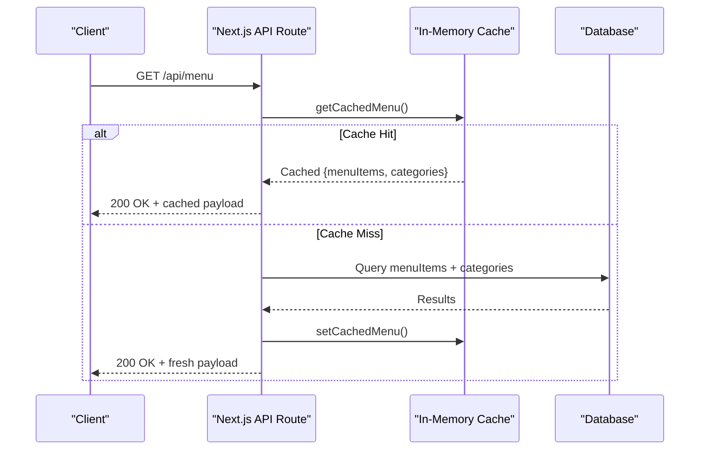
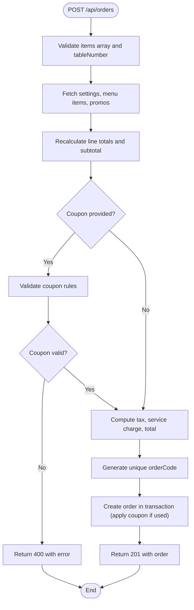
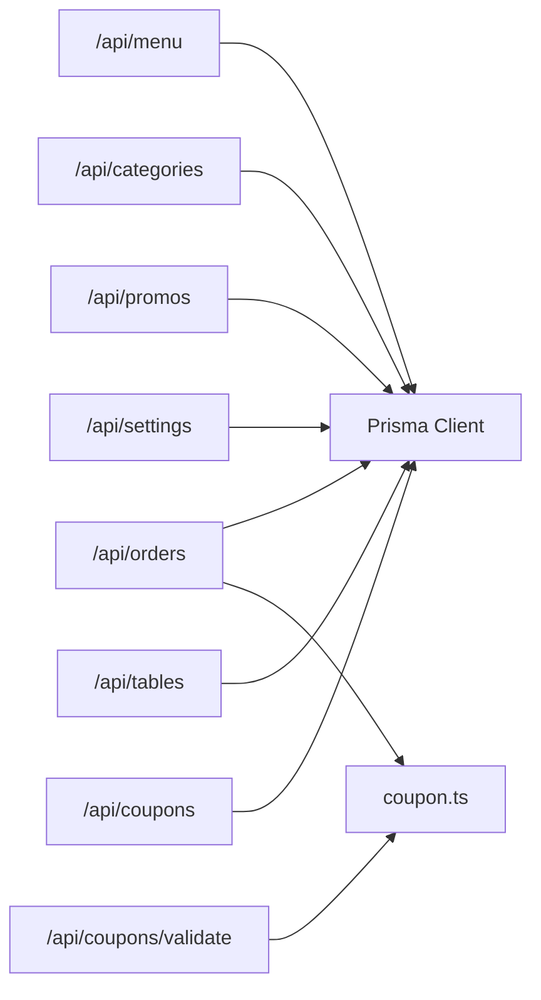

# API Reference

<cite>
**Referenced Files in This Document**
- [README.md](file://README.md)
- [types.ts](file://lib/types.ts)
- [schema.prisma](file://prisma/schema.prisma)
- [menu route.ts](file://app\api\menu\route.ts)
- [menu [id] route.ts](file://app\api\menu\[id]\route.ts)
- [categories route.ts](file://app\api\categories\route.ts)
- [categories [id] route.ts](file://app\api\categories\[id]\route.ts)
- [promos route.ts](file://app\api\promos\route.ts)
- [promos [id] route.ts](file://app\api\promos\[id]\route.ts)
- [orders route.ts](file://app\api\orders\route.ts)
- [orders [id] route.ts](file://app\api\orders\[id]\route.ts)
- [settings route.ts](file://app\api\settings\route.ts)
- [tables route.ts](file://app\api\tables\route.ts)
- [tables [id] route.ts](file://app\api\tables\[id]\route.ts)
- [coupons route.ts](file://app\api\coupons\route.ts)
- [coupons validate route.ts](file://app\api\coupons\validate\route.ts)
- [coupon.ts](file://lib/coupon.ts)
</cite>

## Table of Contents
1. Introduction
2. Project Structure
3. Core Components
4. Architecture Overview
5. Detailed Component Analysis
6. Dependency Analysis
7. Performance Considerations
8. Troubleshooting Guide
9. Conclusion

## Introduction
This document provides comprehensive API documentation for the Warkop Betawa system’s RESTful endpoints. It covers menu management, order processing, category administration, promotion management, settings configuration, table operations, and coupon validation. For each endpoint, you will find HTTP methods, URL patterns, request/response schemas, authentication requirements, error handling, status codes, and practical usage examples.

The application is a Next.js 14 restaurant ordering app backed by a database (PostgreSQL via Prisma). The README also documents additional routes for the web UI and lists the API routes exposed under /api.

**Section sources**
- [README.md:53-81](file://README.md#L53-L81)

## Project Structure
The API is implemented as Next.js App Router route handlers under app/api. Each resource has a directory with route files for collection and item-level operations. Shared types are defined in lib/types.ts, and the data model is defined in prisma/schema.prisma.

**Diagram sources**
- [menu route.ts:1-109](file://app\api\menu\route.ts#L1-L109)
- [menu [id] route.ts:1-81](file://app\api\menu\[id]\route.ts#L1-L81)
- [categories route.ts:1-47](file://app\api\categories\route.ts#L1-L47)
- [categories [id] route.ts:1-53](file://app\api\categories\[id]\route.ts#L1-L53)
- [promos route.ts:1-38](file://app\api\promos\route.ts#L1-L38)
- [promos [id] route.ts:1-52](file://app\api\promos\[id]\route.ts#L1-L52)
- [orders route.ts:1-245](file://app\api\orders\route.ts#L1-L245)
- [orders [id] route.ts:1-97](file://app\api\orders\[id]\route.ts#L1-L97)
- [settings route.ts:1-68](file://app\api\settings\route.ts#L1-L68)
- [tables route.ts:1-34](file://app\api\tables\route.ts#L1-L34)
- [tables [id] route.ts:1-23](file://app\api\tables\[id]\route.ts#L1-L23)
- [coupons route.ts:1-33](file://app\api\coupons\route.ts#L1-L33)
- [coupons validate route.ts:1-58](file://app\api\coupons\validate\route.ts#L1-L58)

**Section sources**
- [schema.prisma:11-106](file://prisma/schema.prisma#L11-L106)
- [types.ts:6-117](file://lib/types.ts#L6-L117)

## Core Components
- Menu Management: List active items and categories; create, update, delete individual items.
- Category Administration: List, create, update, delete categories.
- Promotion Management: List active promotions; create, update, delete promotions.
- Order Processing: Create orders with server-side price recalculation and optional coupon application; list, get, update status, delete orders.
- Settings Configuration: Get or update tax/service rates and restaurant info.
- Table Operations: List tables; create tables with QR token generation; delete tables.
- Coupon Management: List available coupons; validate coupon code against cart subtotal.

Authentication:
- No explicit authentication middleware is present in the API route handlers. Access control is not enforced at the API layer.

Versioning:
- No versioned base path (e.g., /api/v1) is used. All endpoints are under /api.

Rate Limiting:
- No rate limiting is implemented in the API routes.

Security Notes:
- Order creation recalculates monetary values server-side to prevent client tampering.
- Coupon validation enforces business rules on the server.

**Section sources**
- [README.md:66-81](file://README.md#L66-L81)
- [orders route.ts:23-28](file://app\api\orders\route.ts#L23-L28)
- [coupon.ts:77-132](file://lib/coupon.ts#L77-L132)

## Architecture Overview
The API follows a straightforward pattern:
- Route handlers parse requests, validate inputs, interact with Prisma, and return JSON responses.
- Some endpoints use an in-memory cache for performance (menu listing).
- Orders are created within a transaction to ensure consistency when applying coupons.

**Diagram sources**
- [menu route.ts:7-64](file://app\api\menu\route.ts#L7-L64)

## Detailed Component Analysis

### Menu Endpoints
- GET /api/menu
  - Purpose: List all active menu items plus all categories. Supports ?all=true to include inactive items.
  - Authentication: None.
  - Response: { menuItems: MenuItem[], categories: Category[] }
  - Status Codes: 200, 500
  - Headers: X-Cache indicates cache hit/miss; Cache-Control for public caching on hits.
  - Error Handling: Returns generic error message on failure.

- POST /api/menu
  - Purpose: Create a new menu item.
  - Authentication: None.
  - Request Body: name (string), description (string), price (number >= 0), category (string), photoUrl (string), badge (enum), spiceLevels (array), addOns (array), isActive (boolean).
  - Response: { item: MenuItem }
  - Status Codes: 201, 400 (validation errors), 500
  - Error Handling: Validates required fields and numeric constraints.

- GET /api/menu/[id]
  - Purpose: Retrieve a single menu item by id.
  - Authentication: None.
  - Response: { item: MenuItem }
  - Status Codes: 200, 404, 500

- PUT /api/menu/[id]
  - Purpose: Update a menu item.
  - Authentication: None.
  - Request Body: Partial fields allowed; validates price and name if provided.
  - Response: { item: MenuItem }
  - Status Codes: 200, 400, 404, 500

- DELETE /api/menu/[id]
  - Purpose: Delete a menu item.
  - Authentication: None.
  - Response: { success: boolean }
  - Status Codes: 200, 404, 500

Example Usage:
- GET /api/menu
  - Response Example: { "menuItems": [...], "categories": [...] }
- POST /api/menu
  - Request Example: { "name": "Nasi Goreng", "price": 25000, "category": "makanan", "photoUrl": "...", "badge": "best_seller", "spiceLevels": [], "addOns": [] }
  - Response Example: { "item": { ... } }

**Section sources**
- [menu route.ts:7-108](file://app\api\menu\route.ts#L7-L108)
- [menu [id] route.ts:6-80](file://app\api\menu\[id]\route.ts#L6-L80)
- [types.ts:24-38](file://lib/types.ts#L24-L38)

### Category Endpoints
- GET /api/categories
  - Purpose: List all categories sorted by sortOrder.
  - Authentication: None.
  - Response: { categories: Category[] }
  - Status Codes: 200, 500

- POST /api/categories
  - Purpose: Create a new category. Auto-generates slug if not provided.
  - Authentication: None.
  - Request Body: name (string), slug (optional string), sortOrder (optional number).
  - Response: { category: Category }
  - Status Codes: 201, 400, 500

- PUT /api/categories/[id]
  - Purpose: Update a category.
  - Authentication: None.
  - Request Body: name, slug, sortOrder (partial updates).
  - Response: { category: Category }
  - Status Codes: 200, 404, 500

- DELETE /api/categories/[id]
  - Purpose: Delete a category.
  - Authentication: None.
  - Response: { success: boolean }
  - Status Codes: 200, 404, 500

Example Usage:
- POST /api/categories
  - Request Example: { "name": "Minuman", "sortOrder": 2 }
  - Response Example: { "category": { "id": "...", "name": "Minuman", "slug": "minuman", "sortOrder": 2 } }

**Section sources**
- [categories route.ts:7-46](file://app\api\categories\route.ts#L7-L46)
- [categories [id] route.ts:7-52](file://app\api\categories\[id]\route.ts#L7-L52)
- [types.ts:6-12](file://lib/types.ts#L6-L12)

### Promotion Endpoints
- GET /api/promos
  - Purpose: List promotions. Supports ?all=true to include inactive promos.
  - Authentication: None.
  - Response: { promos: Promo[] }
  - Status Codes: 200, 500

- POST /api/promos
  - Purpose: Create a new promotion.
  - Authentication: None.
  - Request Body: title (string), description (string), originalPrice (number), discountedPrice (number), isActive (boolean).
  - Response: { promo: Promo }
  - Status Codes: 201, 500

- PUT /api/promos/[id]
  - Purpose: Update a promotion.
  - Authentication: None.
  - Request Body: Partial fields allowed.
  - Response: { promo: Promo }
  - Status Codes: 200, 404, 500

- DELETE /api/promos/[id]
  - Purpose: Delete a promotion.
  - Authentication: None.
  - Response: { success: boolean }
  - Status Codes: 200, 404, 500

Example Usage:
- POST /api/promos
  - Request Example: { "title": "Weekend Special", "description": "Buy one get one free", "originalPrice": 50000, "discountedPrice": 35000, "isActive": true }
  - Response Example: { "promo": { ... } }

**Section sources**
- [promos route.ts:6-37](file://app\api\promos\route.ts#L6-L37)
- [promos [id] route.ts:6-51](file://app\api\promos\[id]\route.ts#L6-L51)
- [types.ts:47-55](file://lib/types.ts#L47-L55)

### Order Endpoints
- GET /api/orders
  - Purpose: List all orders, newest first.
  - Authentication: None.
  - Response: { orders: Order[] }
  - Status Codes: 200, 500

- POST /api/orders
  - Purpose: Create a new order from customer checkout. Server recalculates prices and applies coupons securely.
  - Authentication: None.
  - Request Body:
    - items: array of { menuItemId, name, qty, price, spiceLevel?, addOns[] }
    - tableNumber: positive integer
    - notes?: string (truncated to 500 chars)
    - couponCode?: string (optional)
  - Response: { order: Order }
  - Status Codes: 201, 400 (validation/business rule errors), 500
  - Security: Monetary totals are recalculated server-side; browser-supplied totals are ignored.

- GET /api/orders/[id]
  - Purpose: Fetch a single order by orderCode.
  - Authentication: None.
  - Response: { order: Order }
  - Status Codes: 200, 404, 500

- PATCH /api/orders/[id]
  - Purpose: Update order status and/or items (admin use). Recalculates totals when items change.
  - Authentication: None.
  - Request Body: { status?, items? }
  - Response: { order: Order }
  - Status Codes: 200, 404, 500

- DELETE /api/orders/[id]
  - Purpose: Delete an order by orderCode.
  - Authentication: None.
  - Response: { success: boolean }
  - Status Codes: 200, 404, 500

Example Usage:
- POST /api/orders
  - Request Example: { "items": [{ "menuItemId": "abc123", "name": "Nasi Goreng", "qty": 2, "price": 25000, "spiceLevel": "Pedas", "addOns": [{ "label": "Extra Telur", "price": 3000 }] }], "tableNumber": 3, "notes": "Less spicy please", "couponCode": "WELCOME10" }
  - Response Example: { "order": { "orderCode": "ARU-4821", "status": "received", "subtotal": 56000, "taxAmount": 5600, "serviceChargeAmount": 2800, "total": 64400 } }

**Diagram sources**
- [orders route.ts:28-236](file://app\api\orders\route.ts#L28-L236)
- [coupon.ts:77-132](file://lib/coupon.ts#L77-L132)

**Section sources**
- [orders route.ts:12-245](file://app\api\orders\route.ts#L12-L245)
- [orders [id] route.ts:6-96](file://app\api\orders\[id]\route.ts#L6-L96)
- [types.ts:57-83](file://lib/types.ts#L57-L83)

### Settings Endpoints
- GET /api/settings
  - Purpose: Get current settings (tax/service rates and restaurant info). Falls back to static defaults if none exist.
  - Authentication: None.
  - Response: { settings: Settings }
  - Status Codes: 200, 500

- PUT /api/settings
  - Purpose: Update settings (tax/service rates and restaurant info). Creates singleton record if missing.
  - Authentication: None.
  - Request Body: taxRatePercent (number 0–100), serviceChargeRatePercent (number 0–100), restaurantInfo (object).
  - Response: { settings: Settings }
  - Status Codes: 200, 400, 500

Example Usage:
- PUT /api/settings
  - Request Example: { "taxRatePercent": 11, "serviceChargeRatePercent": 6, "restaurantInfo": { "name": "Warkop Betawa", "address": "Jl. Contoh No.1", "whatsapp": "+6281234567890", "instagram": "@warkopbetawa", "email": "info@warkopbetawa.com" } }
  - Response Example: { "settings": { "id": "...", "taxRatePercent": 11, "serviceChargeRatePercent": 6, "restaurantInfo": { ... } } }

**Section sources**
- [settings route.ts:7-67](file://app\api\settings\route.ts#L7-L67)
- [types.ts:104-117](file://lib/types.ts#L104-L117)

### Table Endpoints
- GET /api/tables
  - Purpose: List all tables ordered by tableNumber.
  - Authentication: None.
  - Response: { tables: RestaurantTable[] }
  - Status Codes: 200, 500

- POST /api/tables
  - Purpose: Create a new table and generate a QR token.
  - Authentication: None.
  - Request Body: tableNumber (integer).
  - Response: { table: RestaurantTable }
  - Status Codes: 201, 500

- DELETE /api/tables/[id]
  - Purpose: Delete a table by its internal id.
  - Authentication: None.
  - Response: { success: boolean }
  - Status Codes: 200, 404, 500

Example Usage:
- POST /api/tables
  - Request Example: { "tableNumber": 11 }
  - Response Example: { "table": { "id": "...", "tableNumber": 11, "qrToken": "...", "isActive": true } }

**Section sources**
- [tables route.ts:7-33](file://app\api\tables\route.ts#L7-L33)
- [tables [id] route.ts:6-22](file://app\api\tables\[id]\route.ts#L6-L22)
- [schema.prisma:38-45](file://prisma/schema.prisma#L38-L45)

### Coupon Endpoints
- GET /api/coupons
  - Purpose: List active coupons currently within their date range and available today.
  - Authentication: None.
  - Response: { coupons: Coupon[] }
  - Status Codes: 200, 500

- POST /api/coupons/validate
  - Purpose: Validate a coupon code against a given subtotal.
  - Authentication: None.
  - Request Body: code (string), subtotal (number >= 0).
  - Response: { valid: boolean, coupon?: CouponSummary, discountAmount?: number, error?: string }
  - Status Codes: 200, 400, 500

Example Usage:
- POST /api/coupons/validate
  - Request Example: { "code": "WELCOME10", "subtotal": 100000 }
  - Response Example: { "valid": true, "coupon": { "id": "...", "code": "WELCOME10", "title": "Welcome Discount", "description": "10% off", "discountType": "PERCENTAGE", "discountValue": 10, "minOrderAmount": 50000, "maxDiscountAmount": null }, "discountAmount": 10000 }

**Section sources**
- [coupons route.ts:7-32](file://app\api\coupons\route.ts#L7-L32)
- [coupons validate route.ts:8-57](file://app\api\coupons\validate\route.ts#L8-L57)
- [coupon.ts:1-132](file://lib/coupon.ts#L1-L132)
- [types.ts:85-102](file://lib/types.ts#L85-L102)

## Dependency Analysis
The API routes depend on:
- Prisma Client for database access.
- Shared utilities such as coupon validation logic.
- Optional in-memory cache for menu listing.

**Diagram sources**
- [menu route.ts:1-109](file://app\api\menu\route.ts#L1-L109)
- [categories route.ts:1-47](file://app\api\categories\route.ts#L1-L47)
- [promos route.ts:1-38](file://app\api\promos\route.ts#L1-L38)
- [orders route.ts:1-245](file://app\api\orders\route.ts#L1-L245)
- [settings route.ts:1-68](file://app\api\settings\route.ts#L1-L68)
- [tables route.ts:1-34](file://app\api\tables\route.ts#L1-L34)
- [coupons route.ts:1-33](file://app\api\coupons\route.ts#L1-L33)
- [coupons validate route.ts:1-58](file://app\api\coupons\validate\route.ts#L1-L58)
- [coupon.ts:1-132](file://lib/coupon.ts#L1-L132)

**Section sources**
- [schema.prisma:11-106](file://prisma/schema.prisma#L11-L106)

## Performance Considerations
- Menu Listing Caching:
  - GET /api/menu uses an in-memory cache to serve active menu data quickly. Cache headers indicate HIT/MISS and enable public caching with short TTLs.
- Database Queries:
  - Batch fetching is used where appropriate (e.g., fetching settings, menu items, and promos in parallel during order creation).
- Indexes:
  - Prisma schema defines indexes for frequently queried fields (e.g., menu_items.isActive+category, orders.status+createdAt, coupons.code+isActive).

Recommendations:
- Add rate limiting at the gateway or edge layer to protect endpoints.
- Consider pagination for large collections (orders, menu items).
- Use CDN caching for read-only endpoints like /api/menu and /api/promos.

[No sources needed since this section provides general guidance]

## Troubleshooting Guide
Common Errors and Responses:
- Validation Errors (400):
  - Missing or invalid fields (e.g., empty name, negative price).
  - Invalid coupon rules (expired, not yet started, minimum order amount not met, already used today).
- Not Found (404):
  - Resource not found (menu item, category, promo, order, table).
- Server Errors (500):
  - Unexpected failures in route handlers or database operations.

Debugging Tips:
- Inspect response bodies for error messages.
- Verify input payloads match expected schemas.
- Ensure database connectivity and correct environment variables.

**Section sources**
- [menu route.ts:73-84](file://app\api\menu\route.ts#L73-L84)
- [menu [id] route.ts:31-40](file://app\api\menu\[id]\route.ts#L31-L40)
- [categories route.ts:26-28](file://app\api\categories\route.ts#L26-L28)
- [promos route.ts:23-31](file://app\api\promos\route.ts#L23-L31)
- [orders route.ts:33-48](file://app\api\orders\route.ts#L33-L48)
- [orders route.ts:167-180](file://app\api\orders\route.ts#L167-L180)
- [settings route.ts:25-43](file://app\api\settings\route.ts#L25-L43)

## Conclusion
The Warkop Betawa API provides a complete set of endpoints for managing menus, categories, promotions, orders, settings, tables, and coupons. While there is no built-in authentication or rate limiting, the implementation emphasizes security through server-side recalculation of monetary values and robust coupon validation. For production deployments, consider adding authentication, authorization, rate limiting, and pagination to enhance security and scalability.

[No sources needed since this section summarizes without analyzing specific files]