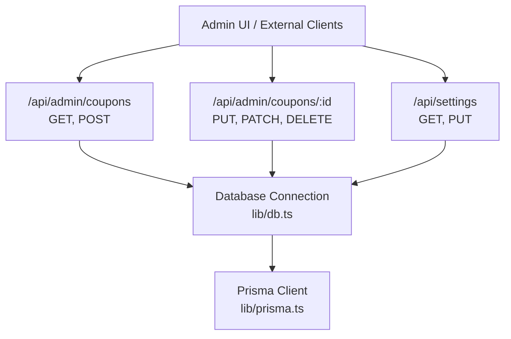
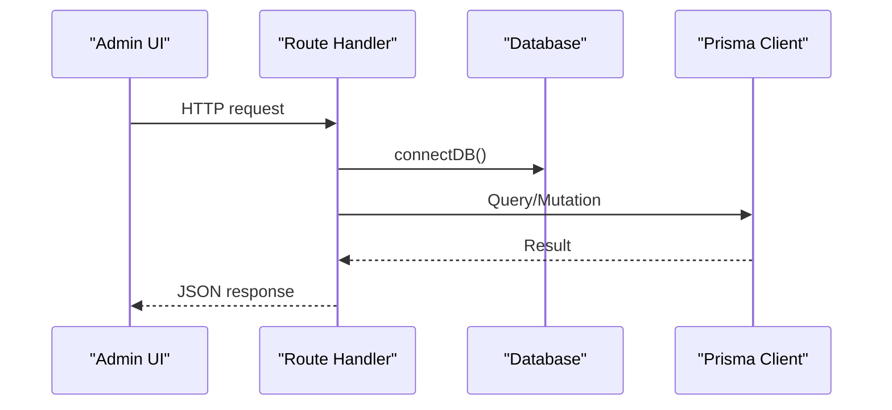
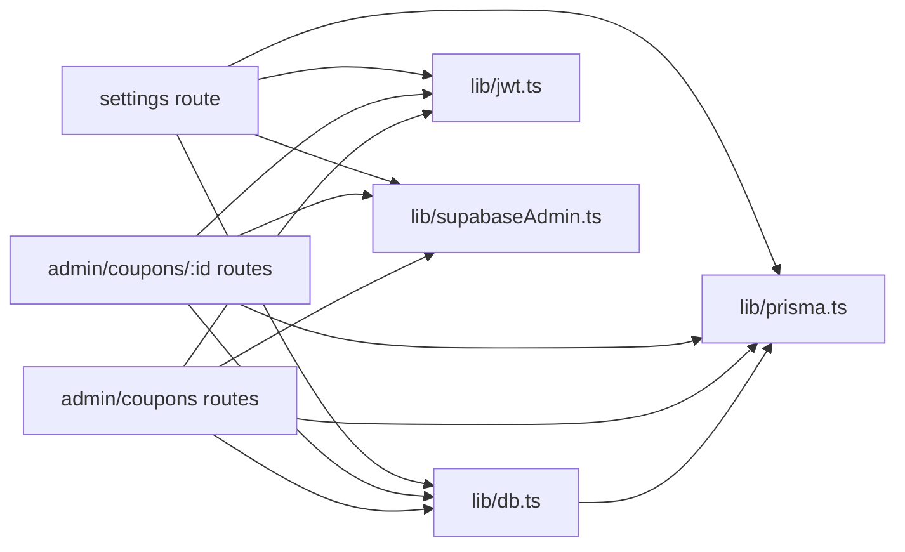

# Admin API

<cite>
**Referenced Files in This Document**
- [app/api/admin/coupons/route.ts](file://app/api/admin/coupons/route.ts)
- [app/api/admin/coupons/[id]/route.ts](file://app/api/admin/coupons/[id]/route.ts)
- [app/api/settings/route.ts](file://app/api/settings/route.ts)
- [lib/db.ts](file://lib/db.ts)
- [lib/prisma.ts](file://lib/prisma.ts)
- [lib/jwt.ts](file://lib/jwt.ts)
- [lib/supabaseAdmin.ts](file://lib/supabaseAdmin.ts)
- [app/api/coupons/route.ts](file://app/api/coupons/route.ts)
- [app/admin/page.tsx](file://app/admin/page.tsx)
</cite>

## Table of Contents
1. [Introduction](#introduction)
2. [Project Structure](#project-structure)
3. [Core Components](#core-components)
4. [Architecture Overview](#architecture-overview)
5. [Detailed Component Analysis](#detailed-component-analysis)
6. [Dependency Analysis](#dependency-analysis)
7. [Performance Considerations](#performance-considerations)
8. [Troubleshooting Guide](#troubleshooting-guide)
9. [Conclusion](#conclusion)

## Introduction
This document specifies the administrative API surface for managing coupons and system configuration, with guidance on authentication, authorization, audit logging, bulk operations, rate limiting, and monitoring. The current implementation exposes admin endpoints under /api/admin and a settings endpoint under /api/settings. Coupon administration includes listing, creating, updating, toggling, and soft-deleting coupons. System configuration supports reading and updating tax/service charge rates and restaurant profile data.

Important: The current admin coupon endpoints do not enforce JWT-based admin privileges or role checks at the route level. They rely on network-level protection (for example, restricting access to the admin UI). For production, add explicit middleware that validates an admin JWT and enforces elevated permissions before processing requests.

## Project Structure
The administrative API is implemented as Next.js Route Handlers:
- Admin coupon management: app/api/admin/coupons
  - GET/POST list and create
  - PUT/PATCH/DELETE per-coupon operations
- System configuration: app/api/settings
  - GET/PUT read and update application settings
- Shared infrastructure:
  - Database connection via lib/db.ts
  - Prisma client singleton via lib/prisma.ts
  - JWT utilities via lib/jwt.ts
  - Supabase admin client via lib/supabaseAdmin.ts

**Diagram sources**
- [app/api/admin/coupons/route.ts:1-129](file://app/api/admin/coupons/route.ts#L1-L129)
- [app/api/admin/coupons/[id]/route.ts:1-102](file://app/api/admin/coupons/[id]/route.ts#L1-L102)
- [app/api/settings/route.ts:1-68](file://app/api/settings/route.ts#L1-L68)
- [lib/db.ts:1-200](file://lib/db.ts#L1-L200)
- [lib/prisma.ts:1-40](file://lib/prisma.ts#L1-L40)

**Section sources**
- [app/api/admin/coupons/route.ts:1-129](file://app/api/admin/coupons/route.ts#L1-L129)
- [app/api/admin/coupons/[id]/route.ts:1-102](file://app/api/admin/coupons/[id]/route.ts#L1-L102)
- [app/api/settings/route.ts:1-68](file://app/api/settings/route.ts#L1-L68)
- [lib/db.ts:1-200](file://lib/db.ts#L1-L200)
- [lib/prisma.ts:1-40](file://lib/prisma.ts#L1-L40)

## Core Components
- Admin Coupon Management
  - List all coupons with availability enrichment
  - Create new coupons with validation
  - Update fields selectively
  - Toggle active status
  - Soft delete by deactivating
- System Configuration
  - Read current settings (with fallback defaults)
  - Update tax/service charge percentages and restaurant info
- Shared Infrastructure
  - Database connectivity
  - Prisma client with query logging in development
  - JWT helpers for table tokens
  - Supabase admin client for privileged server-side operations

Key responsibilities:
- Input validation and sanitization are performed inside each handler.
- Business rules include date range validation, discount caps, and duplicate code checks.
- Soft delete is implemented by setting isActive to false rather than removing rows.

**Section sources**
- [app/api/admin/coupons/route.ts:1-129](file://app/api/admin/coupons/route.ts#L1-L129)
- [app/api/admin/coupons/[id]/route.ts:1-102](file://app/api/admin/coupons/[id]/route.ts#L1-L102)
- [app/api/settings/route.ts:1-68](file://app/api/settings/route.ts#L1-L68)
- [lib/prisma.ts:1-40](file://lib/prisma.ts#L1-L40)
- [lib/jwt.ts:1-29](file://lib/jwt.ts#L1-L29)
- [lib/supabaseAdmin.ts:1-22](file://lib/supabaseAdmin.ts#L1-L22)

## Architecture Overview
The admin API follows a straightforward request-to-database flow through Next.js Route Handlers. Each handler connects to the database, performs Prisma operations, and returns JSON responses. There is no built-in middleware enforcing JWT admin roles in these handlers; security relies on deployment boundaries and UI restrictions.

**Diagram sources**
- [app/api/admin/coupons/route.ts:1-129](file://app/api/admin/coupons/route.ts#L1-L129)
- [app/api/admin/coupons/[id]/route.ts:1-102](file://app/api/admin/coupons/[id]/route.ts#L1-L102)
- [app/api/settings/route.ts:1-68](file://app/api/settings/route.ts#L1-L68)
- [lib/db.ts:1-200](file://lib/db.ts#L1-L200)
- [lib/prisma.ts:1-40](file://lib/prisma.ts#L1-L40)

## Detailed Component Analysis

### Authentication and Authorization Model
Current state:
- Admin coupon endpoints do not validate JWTs or check admin roles.
- Settings endpoints do not validate JWTs or check admin roles.
- JWT utilities exist for generating and verifying table tokens, not for admin authorization.
- Supabase admin client exists for privileged server-side operations but is not used by these endpoints.

Recommendations:
- Add middleware that validates a JWT token carrying an admin claim.
- Reject requests without valid admin privileges.
- Log failed authorization attempts for audit purposes.
- Enforce least privilege: only allow necessary mutations for admin roles.

Security considerations:
- Do not expose admin endpoints publicly.
- Use HTTPS and restrict IPs if possible.
- Rotate secrets and avoid hardcoding sensitive values.

**Section sources**
- [lib/jwt.ts:1-29](file://lib/jwt.ts#L1-L29)
- [lib/supabaseAdmin.ts:1-22](file://lib/supabaseAdmin.ts#L1-L22)

### Admin Coupon Endpoints

#### List Coupons
- Method: GET
- Path: /api/admin/coupons
- Description: Returns all coupons with an additional field indicating whether the coupon is available today.
- Response schema:
  - coupons: array of coupon objects
    - id: string
    - code: string
    - title: string
    - description: string
    - discountType: "FIXED" | "PERCENTAGE"
    - discountValue: number
    - minOrderAmount: number
    - maxDiscountAmount: number | null
    - startDate: ISO date string
    - endDate: ISO date string
    - isActive: boolean
    - createdAt: ISO date string
    - isAvailableToday: boolean

Error responses:
- 500: Internal error with error message.

**Section sources**
- [app/api/admin/coupons/route.ts:7-27](file://app/api/admin/coupons/route.ts#L7-L27)

#### Create Coupon
- Method: POST
- Path: /api/admin/coupons
- Description: Creates a new coupon after validating required fields and business rules.
- Request body:
  - code: string (required, trimmed, uppercased)
  - title: string (required, trimmed)
  - description: string (optional, trimmed)
  - discountType: "FIXED" | "PERCENTAGE" (defaulted to "PERCENTAGE" if not provided)
  - discountValue: number (required, > 0, capped at 100 for percentage)
  - minOrderAmount: number (>= 0)
  - maxDiscountAmount: number | null (only for percentage discounts)
  - startDate: ISO date string (required)
  - endDate: ISO date string (required, >= startDate)
  - isActive: boolean (optional, defaults to true)
- Success response:
  - coupon: created coupon object
- Error responses:
  - 400: Validation errors (missing fields, invalid dates, duplicate code, invalid discount value)
  - 500: Internal error

Validation highlights:
- Duplicate code check against existing coupons.
- Date range validation.
- Percentage discount cap at 100%.
- Non-negative numeric fields.

**Section sources**
- [app/api/admin/coupons/route.ts:29-129](file://app/api/admin/coupons/route.ts#L29-L129)

#### Update Coupon
- Method: PUT
- Path: /api/admin/coupons/:id
- Description: Updates selected fields of an existing coupon.
- Request body: Any subset of coupon fields; omitted fields remain unchanged.
- Success response:
  - coupon: updated coupon object
- Error responses:
  - 404: Coupon not found
  - 400: Validation errors (empty code, duplicate code, invalid numeric/date fields)
  - 500: Internal error

**Section sources**
- [app/api/admin/coupons/[id]/route.ts:9-68](file://app/api/admin/coupons/[id]/route.ts#L9-L68)

#### Toggle Active Status
- Method: PATCH
- Path: /api/admin/coupons/:id
- Description: Delegates to the update handler; typically used to toggle isActive.
- Behavior: Same as PUT.

**Section sources**
- [app/api/admin/coupons/[id]/route.ts:70-73](file://app/api/admin/coupons/[id]/route.ts#L70-L73)

#### Soft Delete Coupon
- Method: DELETE
- Path: /api/admin/coupons/:id
- Description: Sets isActive to false instead of deleting the row.
- Success response:
  - success: boolean
  - message: confirmation message
  - coupon: deactivated coupon object
- Error responses:
  - 404: Coupon not found
  - 500: Internal error

**Section sources**
- [app/api/admin/coupons/[id]/route.ts:75-101](file://app/api/admin/coupons/[id]/route.ts#L75-L101)

### System Configuration Endpoints

#### Get Settings
- Method: GET
- Path: /api/settings
- Description: Retrieves current settings; falls back to static defaults if none exist.
- Response schema:
  - settings: object containing:
    - id: string
    - taxRatePercent: number
    - serviceChargeRatePercent: number
    - restaurantInfo: object
- Error responses:
  - 500: Internal error

**Section sources**
- [app/api/settings/route.ts:6-17](file://app/api/settings/route.ts#L6-L17)

#### Update Settings
- Method: PUT
- Path: /api/settings
- Description: Updates tax/service charge percentages and/or restaurant info.
- Request body:
  - taxRatePercent: number (optional, must be between 0 and 100)
  - serviceChargeRatePercent: number (optional, must be between 0 and 100)
  - restaurantInfo: object (optional)
- Success response:
  - settings: updated settings object
- Error responses:
  - 400: Invalid percentage values
  - 500: Internal error

**Section sources**
- [app/api/settings/route.ts:19-68](file://app/api/settings/route.ts#L19-L68)

### Public Coupon Endpoint (Context)
- Method: GET
- Path: /api/coupons
- Description: Returns active coupons currently valid and available today.
- Response schema:
  - coupons: array of coupon objects filtered by isActive, date range, and daily usage limits.

Note: This endpoint is public and does not require admin privileges. It complements the admin endpoints by exposing only usable coupons to end users.

**Section sources**
- [app/api/coupons/route.ts:1-32](file://app/api/coupons/route.ts#L1-L32)

### Admin UI Integration
The admin UI calls the admin coupon endpoints to manage coupons and uses the settings endpoint to configure application settings. It also manages local admin state and displays notifications.

**Section sources**
- [app/admin/page.tsx:1016-1177](file://app/admin/page.tsx#L1016-L1177)
- [app/admin/page.tsx:1253-1326](file://app/admin/page.tsx#L1253-L1326)

## Dependency Analysis
Administrative endpoints depend on shared modules:
- Database connection: lib/db.ts
- Prisma client: lib/prisma.ts
- JWT utilities: lib/jwt.ts
- Supabase admin client: lib/supabaseAdmin.ts

**Diagram sources**
- [app/api/admin/coupons/route.ts:1-129](file://app/api/admin/coupons/route.ts#L1-L129)
- [app/api/admin/coupons/[id]/route.ts:1-102](file://app/api/admin/coupons/[id]/route.ts#L1-L102)
- [app/api/settings/route.ts:1-68](file://app/api/settings/route.ts#L1-L68)
- [lib/db.ts:1-200](file://lib/db.ts#L1-L200)
- [lib/prisma.ts:1-40](file://lib/prisma.ts#L1-L40)
- [lib/jwt.ts:1-29](file://lib/jwt.ts#L1-L29)
- [lib/supabaseAdmin.ts:1-22](file://lib/supabaseAdmin.ts#L1-L22)

**Section sources**
- [app/api/admin/coupons/route.ts:1-129](file://app/api/admin/coupons/route.ts#L1-L129)
- [app/api/admin/coupons/[id]/route.ts:1-102](file://app/api/admin/coupons/[id]/route.ts#L1-L102)
- [app/api/settings/route.ts:1-68](file://app/api/settings/route.ts#L1-L68)
- [lib/db.ts:1-200](file://lib/db.ts#L1-L200)
- [lib/prisma.ts:1-40](file://lib/prisma.ts#L1-L40)
- [lib/jwt.ts:1-29](file://lib/jwt.ts#L1-L29)
- [lib/supabaseAdmin.ts:1-22](file://lib/supabaseAdmin.ts#L1-L22)

## Performance Considerations
- Prisma client is a singleton to prevent connection pool exhaustion during hot reloads.
- Development logs query execution times to aid performance monitoring.
- Avoid unnecessary full-table scans; ensure indexes on frequently queried fields such as code and isActive.
- Batch operations should use transactions where appropriate to maintain consistency.

[No sources needed since this section provides general guidance]

## Troubleshooting Guide
Common issues and resolutions:
- Database connection failures:
  - Ensure environment variables for database connectivity are set correctly.
  - Verify credentials and network access.
- Prisma query errors:
  - Check schema alignment and migration status.
  - Review development logs for query details.
- Validation errors:
  - Confirm required fields are present and within allowed ranges.
  - Validate date formats and relationships (startDate <= endDate).
- Duplicate code conflicts:
  - Ensure unique codes across coupons.
- Soft delete behavior:
  - Remember that DELETE sets isActive to false; it does not remove records.

Operational tips:
- Centralize error messages and standardize response shapes.
- Add structured logging for audit trails.
- Implement rate limiting for admin endpoints to mitigate abuse.
- Introduce middleware for JWT validation and admin role checks.

**Section sources**
- [lib/prisma.ts:1-40](file://lib/prisma.ts#L1-L40)
- [app/api/admin/coupons/route.ts:29-129](file://app/api/admin/coupons/route.ts#L29-L129)
- [app/api/admin/coupons/[id]/route.ts:9-101](file://app/api/admin/coupons/[id]/route.ts#L9-L101)
- [app/api/settings/route.ts:19-68](file://app/api/settings/route.ts#L19-L68)

## Conclusion
The administrative API provides essential coupon management and system configuration capabilities. While functional, it lacks explicit JWT-based admin authorization and audit logging. To meet production-grade security requirements:
- Add middleware to validate admin JWTs and enforce elevated permissions.
- Standardize request/response schemas and error handling.
- Implement audit logging for all administrative mutations.
- Apply rate limiting and monitoring for admin endpoints.
- Follow least privilege principles and secure secret management.

These enhancements will strengthen security posture, improve observability, and provide a robust foundation for bulk operations and advanced administrative workflows.