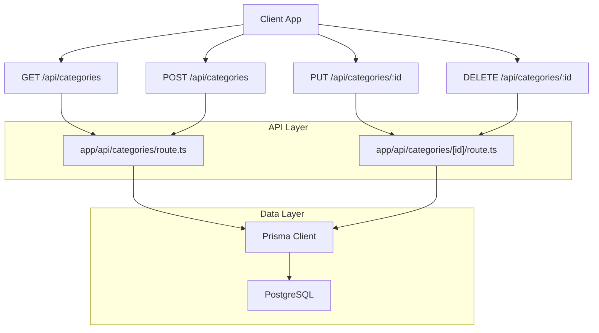
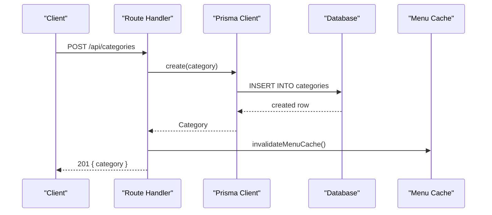
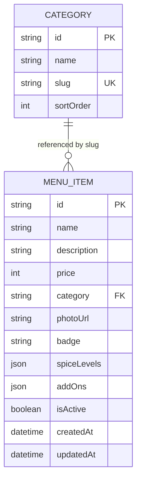
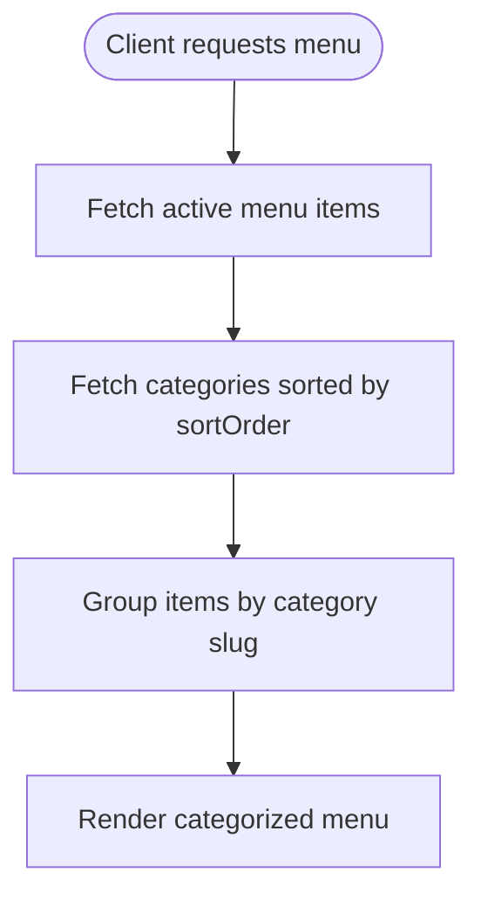

# Categories API

<cite>
**Referenced Files in This Document**
- [route.ts](file://app/api/categories/route.ts)
- [route.ts](file://app/api/categories/[id]/route.ts)
- [schema.prisma](file://prisma/schema.prisma)
- [types.ts](file://lib/types.ts)
- [route.ts](file://app/api/menu/route.ts)
</cite>

## Table of Contents
1. [Introduction](#introduction)
2. [Project Structure](#project-structure)
3. [Core Components](#core-components)
4. [Architecture Overview](#architecture-overview)
5. [Detailed Component Analysis](#detailed-component-analysis)
6. [Dependency Analysis](#dependency-analysis)
7. [Performance Considerations](#performance-considerations)
8. [Troubleshooting Guide](#troubleshooting-guide)
9. [Conclusion](#conclusion)

## Introduction
This document describes the Category Management API used to organize menu structure. It covers HTTP endpoints for creating, reading, updating, and deleting categories, including request/response schemas, validation rules, sorting behavior, and how categories relate to menu items.

The current implementation focuses on flat categories with a display order field. There is no parent-child hierarchy or active status field at the category level in this codebase.

## Project Structure
Category endpoints are implemented as Next.js Route Handlers under `app/api/categories`. The data model is defined in Prisma schema, and shared TypeScript types define the client-facing shape.

**Diagram sources**
- [route.ts:7-18](file://app/api/categories/route.ts#L7-L18)
- [route.ts:20-46](file://app/api/categories/route.ts#L20-L46)
- [route.ts:7-32](file://app/api/categories/[id]/route.ts#L7-L32)
- [route.ts:34-52](file://app/api/categories/[id]/route.ts#L34-L52)

**Section sources**
- [route.ts:7-46](file://app/api/categories/route.ts#L7-L46)
- [route.ts:7-52](file://app/api/categories/[id]/route.ts#L7-L52)

## Core Components
- Category entity fields: id, name, slug, sortOrder.
- Menu item references categories by a string field (category slug).
- Sorting is controlled by sortOrder; list endpoints return categories sorted ascending by sortOrder.
- No parent/child relationship or isActive flag exists for categories in the current schema.

Key data model and types:
- Category model: id, name, slug (unique), sortOrder (default 0).
- MenuItem model: includes a category string field that links to a category slug.
- Shared type ICategory: id, name, slug, sortOrder.

**Section sources**
- [schema.prisma:11-18](file://prisma/schema.prisma#L11-L18)
- [schema.prisma:20-36](file://prisma/schema.prisma#L20-L36)
- [types.ts:6-12](file://lib/types.ts#L6-L12)

## Architecture Overview
The API follows a simple REST pattern backed by Prisma and PostgreSQL. All mutating operations invalidate an in-memory menu cache so that consumers see updated categories promptly.

**Diagram sources**
- [route.ts:20-46](file://app/api/categories/route.ts#L20-L46)

## Detailed Component Analysis

### GET /api/categories
- Purpose: List all categories ordered by display order.
- Method: GET
- Path: /api/categories
- Query parameters: none
- Success response: 200 OK
  - Body: { categories: Category[] }
- Error responses:
  - 500 Internal Server Error: { error: "Gagal memuat kategori" }

Behavior details:
- Returns categories sorted by sortOrder ascending.
- Does not filter by active status (no such field).
- Does not include hierarchical children (no parent field).

Example response shape:
- categories: array of objects with id, name, slug, sortOrder.

**Section sources**
- [route.ts:7-18](file://app/api/categories/route.ts#L7-L18)

### POST /api/categories
- Purpose: Create a new category.
- Method: POST
- Path: /api/categories
- Request body:
  - name: string (required, non-empty after trimming)
  - slug: string (optional; auto-generated if omitted)
  - sortOrder: number (optional; defaults to current count of categories)
- Success response: 201 Created
  - Body: { category: Category }
- Validation errors:
  - 400 Bad Request: { error: "Nama kategori wajib diisi" } when name is missing, not a string, or empty after trim.
- Error responses:
  - 500 Internal Server Error: { error: "Gagal menambah kategori" }

Slug generation:
- If slug is not provided, it is derived from name: lowercased, spaces replaced with hyphens, and non-alphanumeric characters except hyphens removed.

Sort order assignment:
- If sortOrder is not provided, it is set to the current number of categories (effectively appending at the end).

Cache invalidation:
- On success, the menu cache is invalidated to reflect the new category.

**Section sources**
- [route.ts:20-46](file://app/api/categories/route.ts#L20-L46)

### PUT /api/categories/:id
- Purpose: Update an existing category.
- Method: PUT
- Path: /api/categories/:id
- URL parameter:
  - id: string (category id)
- Request body (all fields optional):
  - name: string
  - slug: string
  - sortOrder: number
- Success response: 200 OK
  - Body: { category: Category }
- Not found:
  - 404 Not Found: { error: "Kategori tidak ditemukan" } when the id does not exist.
- Error responses:
  - 500 Internal Server Error: { error: "Gagal memperbarui kategori" }

Partial updates:
- Only provided fields are updated; unspecified fields remain unchanged.

Cache invalidation:
- On success, the menu cache is invalidated.

**Section sources**
- [route.ts:7-32](file://app/api/categories/[id]/route.ts#L7-L32)

### DELETE /api/categories/:id
- Purpose: Delete a category.
- Method: DELETE
- Path: /api/categories/:id
- URL parameter:
  - id: string (category id)
- Success response: 200 OK
  - Body: { success: true }
- Not found:
  - 404 Not Found: { error: "Kategori tidak ditemukan" } when the id does not exist.
- Error responses:
  - 500 Internal Server Error: { error: "Gagal menghapus kategori" }

Cache invalidation:
- On success, the menu cache is invalidated.

Note:
- Deletion does not check for referenced menu items; referential integrity depends on database constraints or application logic elsewhere.

**Section sources**
- [route.ts:34-52](file://app/api/categories/[id]/route.ts#L34-L52)

## Data Models and Schemas

### Category Model
- id: string (primary key)
- name: string
- slug: string (unique)
- sortOrder: integer (default 0)

### MenuItem Model (relationship)
- category: string (links to Category.slug)
- isActive: boolean (menu-level active status; not applicable to categories)

### Shared Type
- ICategory: id, name, slug, sortOrder

**Diagram sources**
- [schema.prisma:11-18](file://prisma/schema.prisma#L11-L18)
- [schema.prisma:20-36](file://prisma/schema.prisma#L20-L36)

**Section sources**
- [schema.prisma:11-36](file://prisma/schema.prisma#L11-L36)
- [types.ts:6-12](file://lib/types.ts#L6-L12)

## Request/Response Schemas

### GET /api/categories
- Response 200:
  - categories: Category[]
    - id: string
    - name: string
    - slug: string
    - sortOrder: number

### POST /api/categories
- Request:
  - name: string (required)
  - slug: string (optional)
  - sortOrder: number (optional)
- Response 201:
  - category: Category

### PUT /api/categories/:id
- Request:
  - name: string (optional)
  - slug: string (optional)
  - sortOrder: number (optional)
- Response 200:
  - category: Category

### DELETE /api/categories/:id
- Response 200:
  - success: boolean

**Section sources**
- [route.ts:7-46](file://app/api/categories/route.ts#L7-L46)
- [route.ts:7-52](file://app/api/categories/[id]/route.ts#L7-L52)

## Business Rules and Constraints
- Name validation:
  - Required for creation.
  - Must be a non-empty string after trimming whitespace.
- Slug uniqueness:
  - Enforced at the database level (unique constraint).
- Sort order:
  - Defaults to 0 on creation if not provided.
  - When not provided during creation, assigned as the current count of categories (append at end).
- Display order:
  - Categories are returned sorted by sortOrder ascending.
- Hierarchy:
  - No parent/child relationships are modeled for categories.
- Active status:
  - No isActive field for categories; only menu items have isActive.

**Section sources**
- [route.ts:26-35](file://app/api/categories/route.ts#L26-L35)
- [schema.prisma:11-18](file://prisma/schema.prisma#L11-L18)

## Integration With Menu Items
- Menu items reference categories via the category field (slug).
- The public menu endpoint returns both active menu items and categories, enabling clients to group items by category slug.

**Diagram sources**
- [route.ts:23-42](file://app/api/menu/route.ts#L23-L42)

**Section sources**
- [route.ts:23-42](file://app/api/menu/route.ts#L23-L42)

## Common Usage Patterns
- Creating a top-level category:
  - Provide name; optionally provide slug and sortOrder.
  - Omitting slug triggers automatic generation from name.
- Reordering categories:
  - Use sortOrder to control display order; update via PUT.
- Linking menu items:
  - Set menu item category to the target category slug.
- Listing categories for admin UI:
  - Use GET /api/categories to populate dropdowns and tables.

[No sources needed since this section provides general guidance]

## Performance Considerations
- Sorting:
  - Queries use sortOrder ordering; ensure appropriate indexing if performance becomes critical.
- Caching:
  - Mutating endpoints call invalidateMenuCache to keep the menu cache consistent.
- Database connection:
  - Each handler connects to the database before executing queries.

**Section sources**
- [route.ts:7-18](file://app/api/categories/route.ts#L7-L18)
- [route.ts:20-46](file://app/api/categories/route.ts#L20-L46)
- [route.ts:7-32](file://app/api/categories/[id]/route.ts#L7-L32)
- [route.ts:34-52](file://app/api/categories/[id]/route.ts#L34-L52)

## Troubleshooting Guide
- 400 Bad Request on creation:
  - Occurs when name is missing, not a string, or empty after trimming.
  - Fix: Ensure name is present and non-empty.
- 404 Not Found on update/delete:
  - Occurs when the specified id does not exist.
  - Fix: Verify the id matches an existing category.
- 500 Internal Server Error:
  - Indicates server-side failures (database or unexpected exceptions).
  - Check logs and database connectivity.

**Section sources**
- [route.ts:26-28](file://app/api/categories/route.ts#L26-L28)
- [route.ts:25-31](file://app/api/categories/[id]/route.ts#L25-L31)
- [route.ts:45-51](file://app/api/categories/[id]/route.ts#L45-L51)

## Conclusion
The Category Management API provides straightforward CRUD operations for organizing menu structure using flat categories and a sortOrder-based display order. Categories integrate with menu items through a slug reference. For advanced features like hierarchical categories or per-category visibility toggles, additional schema changes and endpoint logic would be required.

[No sources needed since this section summarizes without analyzing specific files]