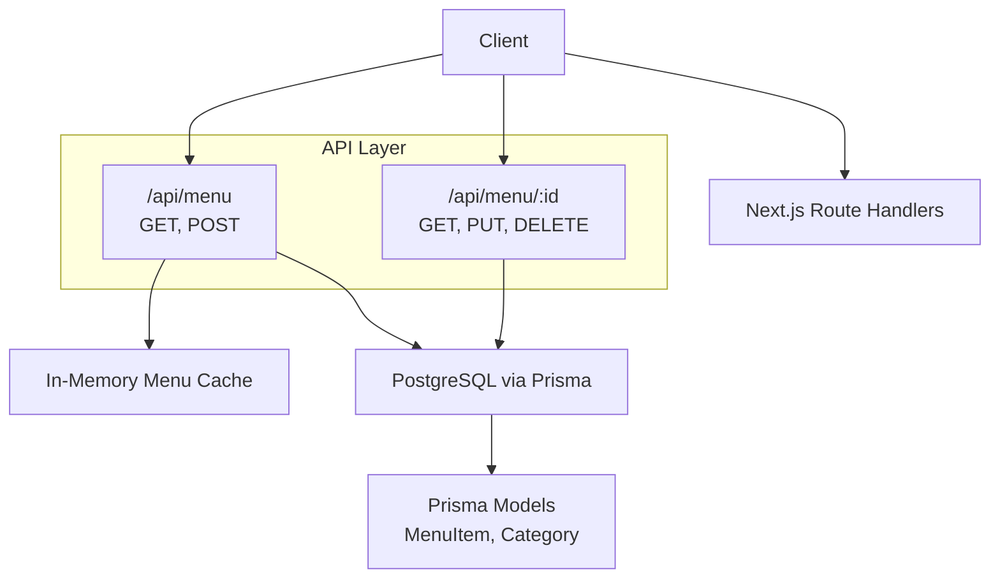
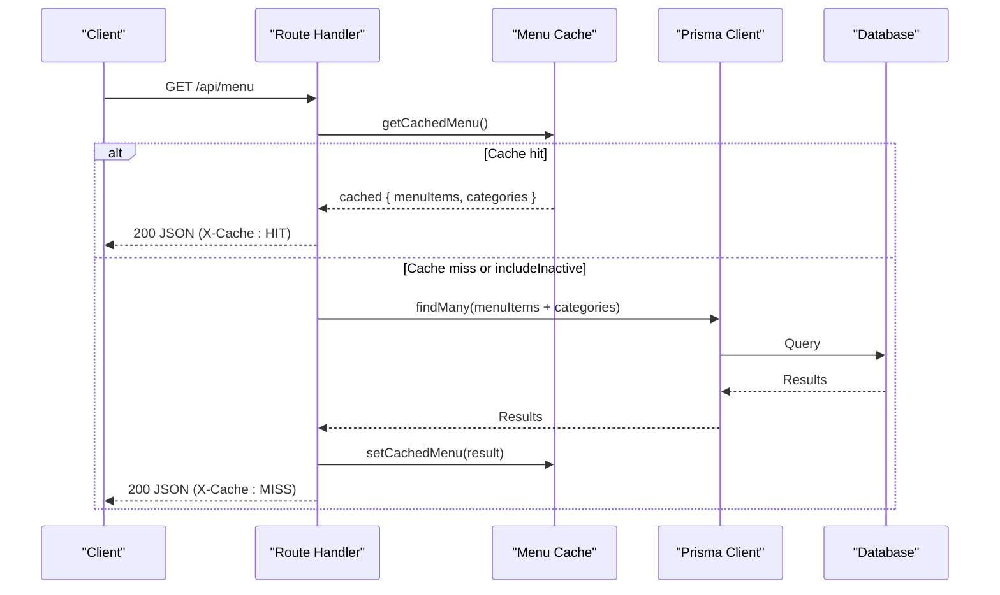
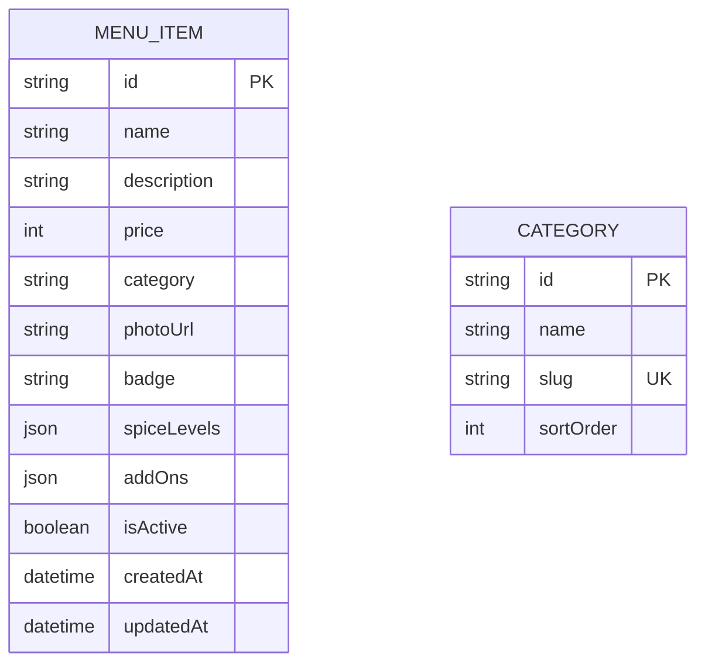
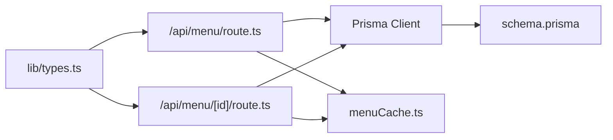

# Menu API

<cite>
**Referenced Files in This Document**
- [route.ts](file://app/api/menu/route.ts)
- [route.ts](file://app/api/menu/[id]/route.ts)
- [types.ts](file://lib/types.ts)
- [schema.prisma](file://prisma/schema.prisma)
- [menuCache.ts](file://lib/menuCache.ts)
- [db.ts](file://lib/db.ts)
</cite>

## Table of Contents
1. [Introduction](#introduction)
2. [Project Structure](#project-structure)
3. [Core Components](#core-components)
4. [Architecture Overview](#architecture-overview)
5. [Detailed Component Analysis](#detailed-component-analysis)
6. [Dependency Analysis](#dependency-analysis)
7. [Performance Considerations](#performance-considerations)
8. [Troubleshooting Guide](#troubleshooting-guide)
9. [Conclusion](#conclusion)

## Introduction
This document provides comprehensive API documentation for menu management endpoints. It covers HTTP methods (GET, POST, PUT, DELETE), request/response schemas, authentication requirements, error handling patterns, and practical examples for common operations such as adding new items, updating prices, and managing menu visibility. The API is implemented using Next.js App Router route handlers with Prisma data access and an in-memory cache for high-performance public reads.

## Project Structure
The menu API is exposed through two route handlers:
- Collection endpoint: GET/POST /api/menu
- Item endpoint: GET/PUT/DELETE /api/menu/:id

**Diagram sources**
- [route.ts:7-65](file://app/api/menu/route.ts#L7-L65)
- [route.ts:6-80](file://app/api/menu/[id]/route.ts#L6-L80)
- [schema.prisma:11-36](file://prisma/schema.prisma#L11-L36)
- [menuCache.ts:24-46](file://lib/menuCache.ts#L24-L46)

**Section sources**
- [route.ts:1-109](file://app/api/menu/route.ts#L1-L109)
- [route.ts:1-81](file://app/api/menu/[id]/route.ts#L1-L81)

## Core Components
- Route handlers implement CRUD operations for menu items and return categories alongside the list endpoint.
- Data models are defined in Prisma schema and shared TypeScript interfaces.
- An in-memory cache accelerates public reads and is invalidated on mutations.

Key responsibilities:
- GET /api/menu: Returns active menu items and all categories; supports optional inclusion of inactive items.
- POST /api/menu: Creates a new menu item with validation and cache invalidation.
- GET /api/menu/:id: Retrieves a single menu item by ID.
- PUT /api/menu/:id: Partially updates a menu item with field-level validation and cache invalidation.
- DELETE /api/menu/:id: Deletes a menu item by ID with cache invalidation.

**Section sources**
- [route.ts:7-109](file://app/api/menu/route.ts#L7-L109)
- [route.ts:6-80](file://app/api/menu/[id]/route.ts#L6-L80)
- [types.ts:24-38](file://lib/types.ts#L24-L38)
- [schema.prisma:20-36](file://prisma/schema.prisma#L20-L36)

## Architecture Overview
The API follows a straightforward layered architecture:
- HTTP layer: Next.js route handlers parse requests, validate inputs, and format responses.
- Service layer: Prisma client performs database queries and mutations.
- Cache layer: In-memory cache serves fast responses for public reads and is invalidated on writes.

**Diagram sources**
- [route.ts:7-65](file://app/api/menu/route.ts#L7-L65)
- [menuCache.ts:24-46](file://lib/menuCache.ts#L24-L46)

## Detailed Component Analysis

### Authentication Requirements
- No explicit authentication middleware is applied to the menu endpoints in the current implementation.
- All endpoints are publicly accessible unless additional middleware is added later.
- For production, consider adding role-based checks (e.g., admin-only for POST/PUT/DELETE).

**Section sources**
- [route.ts:7-109](file://app/api/menu/route.ts#L7-L109)
- [route.ts:6-80](file://app/api/menu/[id]/route.ts#L6-L80)

### Endpoints

#### GET /api/menu
- Purpose: List menu items and categories.
- Query parameters:
  - all: boolean string "true" to include inactive items; default excludes inactive items.
- Response fields:
  - menuItems: array of menu items
  - categories: array of categories
- Headers:
  - X-Cache: HIT or MISS
  - Cache-Control: public, s-maxage=30, stale-while-revalidate=60 (on cache hits)
- Status codes:
  - 200: Success
  - 500: Server error

Request example:
- GET /api/menu
- GET /api/menu?all=true

Response schema:
- menuItems: array of IMenuItem
- categories: array of ICategory

**Section sources**
- [route.ts:7-65](file://app/api/menu/route.ts#L7-L65)
- [types.ts:6-12](file://lib/types.ts#L6-L12)
- [types.ts:24-38](file://lib/types.ts#L24-L38)

#### POST /api/menu
- Purpose: Create a new menu item.
- Request body fields:
  - name: string (required, non-empty)
  - description: string (optional)
  - price: number (required, non-negative)
  - category: string (required, non-empty)
  - photoUrl: string (optional)
  - badge: enum-like string (optional; defaults to "none")
  - spiceLevels: array (optional; defaults to [])
  - addOns: array (optional; defaults to [])
  - isActive: boolean (optional; defaults to true)
- Validation rules:
  - name must be a non-empty string
  - price must be a non-negative number
  - category must be a non-empty string
- Response:
  - item: created IMenuItem
- Status codes:
  - 201: Created
  - 400: Validation error
  - 500: Server error

Request example:
- POST /api/menu
- Body: { name, description, price, category, photoUrl, badge, spiceLevels, addOns, isActive }

Response schema:
- item: IMenuItem

**Section sources**
- [route.ts:67-109](file://app/api/menu/route.ts#L67-L109)
- [types.ts:24-38](file://lib/types.ts#L24-L38)

#### GET /api/menu/:id
- Purpose: Retrieve a single menu item by ID.
- Path parameter:
  - id: string
- Response:
  - item: IMenuItem if found
- Status codes:
  - 200: Success
  - 404: Not found
  - 500: Server error

Request example:
- GET /api/menu/{id}

Response schema:
- item: IMenuItem

**Section sources**
- [route.ts:6-20](file://app/api/menu/[id]/route.ts#L6-L20)
- [types.ts:24-38](file://lib/types.ts#L24-L38)

#### PUT /api/menu/:id
- Purpose: Partially update a menu item.
- Path parameter:
  - id: string
- Request body fields (all optional):
  - name: string (non-empty when provided)
  - description: string
  - price: number (non-negative when provided)
  - category: string
  - photoUrl: string
  - badge: string
  - spiceLevels: array
  - addOns: array
  - isActive: boolean
- Validation rules:
  - If name is provided, it must be a non-empty string
  - If price is provided, it must be a non-negative number
- Response:
  - item: updated IMenuItem
- Status codes:
  - 200: Success
  - 400: Validation error
  - 404: Not found
  - 500: Server error

Request example:
- PUT /api/menu/{id}
- Body: { price, isActive, ... }

Response schema:
- item: IMenuItem

**Section sources**
- [route.ts:22-63](file://app/api/menu/[id]/route.ts#L22-L63)
- [types.ts:24-38](file://lib/types.ts#L24-L38)

#### DELETE /api/menu/:id
- Purpose: Delete a menu item by ID.
- Path parameter:
  - id: string
- Response:
  - success: boolean
- Status codes:
  - 200: Success
  - 404: Not found
  - 500: Server error

Request example:
- DELETE /api/menu/{id}

Response schema:
- success: boolean

**Section sources**
- [route.ts:65-80](file://app/api/menu/[id]/route.ts#L65-L80)

### Data Models and Schemas

#### MenuItem Model
- Fields:
  - id: string (primary key)
  - name: string
  - description: string
  - price: integer
  - category: string
  - photoUrl: string
  - badge: string (default "none")
  - spiceLevels: JSON array
  - addOns: JSON array
  - isActive: boolean (default true)
  - createdAt: datetime
  - updatedAt: datetime
- Indexes:
  - Composite index on (isActive, category)

#### Category Model
- Fields:
  - id: string (primary key)
  - name: string
  - slug: string (unique)
  - sortOrder: integer (default 0)

#### Shared TypeScript Interfaces
- IMenuItem: mirrors MenuItem model fields with optional compatibility fields.
- ICategory: mirrors Category model fields with optional compatibility fields.

**Diagram sources**
- [schema.prisma:11-36](file://prisma/schema.prisma#L11-L36)
- [types.ts:6-12](file://lib/types.ts#L6-L12)
- [types.ts:24-38](file://lib/types.ts#L24-L38)

**Section sources**
- [schema.prisma:11-36](file://prisma/schema.prisma#L11-L36)
- [types.ts:6-12](file://lib/types.ts#L6-L12)
- [types.ts:24-38](file://lib/types.ts#L24-L38)

### Search and Filtering
- Current behavior:
  - GET /api/menu returns active items by default; use ?all=true to include inactive items.
  - Categories are always returned sorted by sortOrder.
- Category filtering:
  - Not implemented at the API level currently. Clients can filter results locally based on the returned category field.
- Search functionality:
  - Not implemented at the API level currently. Clients can perform local search over returned items.

Recommendations:
- Add query parameters for category filtering (e.g., ?category=...).
- Add text search parameters (e.g., ?q=...) with server-side indexing or full-text search.

**Section sources**
- [route.ts:7-65](file://app/api/menu/route.ts#L7-L65)

### Error Handling Patterns
- Validation errors:
  - 400 Bad Request with a descriptive error message for missing or invalid fields.
- Not found:
  - 404 Not Found when a requested item does not exist.
- Server errors:
  - 500 Internal Server Error with generic error messages.
- Database-specific errors:
  - Prisma error code P2025 mapped to 404 Not Found for update/delete operations.

Common response envelope:
- On success: payload object (e.g., { item }, { success })
- On error: { error: string }

**Section sources**
- [route.ts:73-84](file://app/api/menu/route.ts#L73-L84)
- [route.ts:31-40](file://app/api/menu/[id]/route.ts#L31-L40)
- [route.ts:58-62](file://app/api/menu/[id]/route.ts#L58-L62)
- [route.ts:75-79](file://app/api/menu/[id]/route.ts#L75-L79)

### Practical Examples

#### Adding a New Menu Item
- Method: POST
- Endpoint: /api/menu
- Body: Provide required fields name, price, category; optional fields include description, photoUrl, badge, spiceLevels, addOns, isActive.
- Expected response: 201 Created with the created item.

Validation notes:
- name must be a non-empty string
- price must be a non-negative number
- category must be a non-empty string

**Section sources**
- [route.ts:67-109](file://app/api/menu/route.ts#L67-L109)

#### Updating Prices
- Method: PUT
- Endpoint: /api/menu/{id}
- Body: Provide price field with a non-negative number.
- Expected response: 200 OK with updated item.

Validation notes:
- price must be a non-negative number when provided

**Section sources**
- [route.ts:22-63](file://app/api/menu/[id]/route.ts#L22-L63)

#### Managing Menu Visibility
- Method: PUT
- Endpoint: /api/menu/{id}
- Body: Set isActive to true or false to control visibility.
- Expected response: 200 OK with updated item.

**Section sources**
- [route.ts:22-63](file://app/api/menu/[id]/route.ts#L22-L63)

## Dependency Analysis
The menu API depends on:
- Next.js route handlers for HTTP processing
- Prisma client for database operations
- In-memory cache for performance optimization
- Shared types for consistent data contracts

**Diagram sources**
- [route.ts:1-109](file://app/api/menu/route.ts#L1-L109)
- [route.ts:1-81](file://app/api/menu/[id]/route.ts#L1-L81)
- [menuCache.ts:1-46](file://lib/menuCache.ts#L1-L46)
- [schema.prisma:1-107](file://prisma/schema.prisma#L1-L107)
- [types.ts:1-119](file://lib/types.ts#L1-L119)

**Section sources**
- [route.ts:1-109](file://app/api/menu/route.ts#L1-L109)
- [route.ts:1-81](file://app/api/menu/[id]/route.ts#L1-L81)
- [menuCache.ts:1-46](file://lib/menuCache.ts#L1-L46)
- [schema.prisma:1-107](file://prisma/schema.prisma#L1-L107)
- [types.ts:1-119](file://lib/types.ts#L1-L119)

## Performance Considerations
- Public reads are served from an in-memory cache to reduce latency (<10ms) and database load.
- Cache TTL is 60 seconds; any mutation invalidates the cache immediately.
- Responses include caching headers to enable CDN or browser caching strategies.
- Database queries are optimized with Prisma select projections and composite indexes where applicable.

Recommendations:
- Monitor cache hit rates and adjust TTL if needed.
- Consider pagination for large menus.
- Add server-side search and filtering to reduce client-side processing.

**Section sources**
- [menuCache.ts:1-46](file://lib/menuCache.ts#L1-L46)
- [route.ts:11-19](file://app/api/menu/route.ts#L11-L19)
- [schema.prisma:34-35](file://prisma/schema.prisma#L34-L35)

## Troubleshooting Guide
Common issues and resolutions:
- Validation errors (400):
  - Ensure name is a non-empty string.
  - Ensure price is a non-negative number.
  - Ensure category is a non-empty string.
- Not found (404):
  - Verify the item ID exists before update/delete.
- Server errors (500):
  - Check database connectivity and Prisma configuration.
  - Review logs for stack traces and specific error codes.

Operational tips:
- Use X-Cache header to verify cache behavior.
- Invalidate cache after mutations (handled automatically).
- Test with both active and inactive items using ?all=true.

**Section sources**
- [route.ts:73-84](file://app/api/menu/route.ts#L73-L84)
- [route.ts:31-40](file://app/api/menu/[id]/route.ts#L31-L40)
- [route.ts:58-62](file://app/api/menu/[id]/route.ts#L58-L62)
- [route.ts:75-79](file://app/api/menu/[id]/route.ts#L75-L79)

## Conclusion
The Menu API provides a clear and efficient interface for managing menu items and categories. It leverages Next.js route handlers, Prisma for data persistence, and an in-memory cache for high-performance public reads. While authentication is not enforced in the current implementation, the API is structured to support future enhancements such as role-based access, advanced search, and category filtering. Proper validation and error handling ensure robustness, while caching headers and cache invalidation optimize performance.