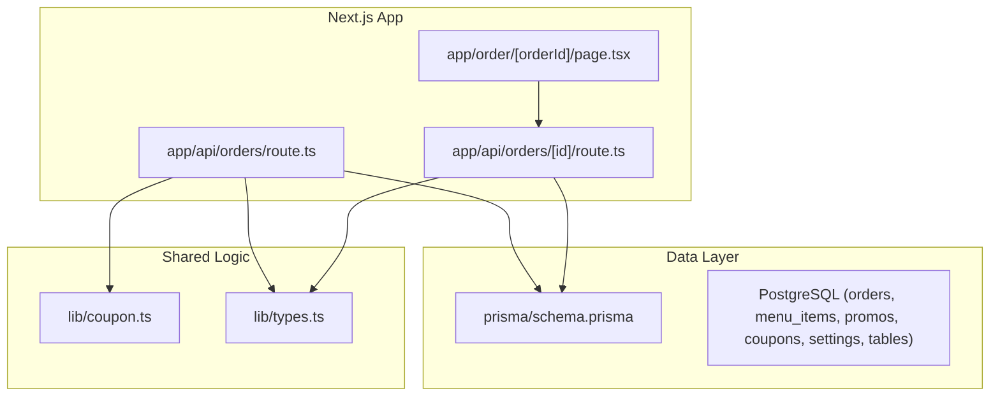
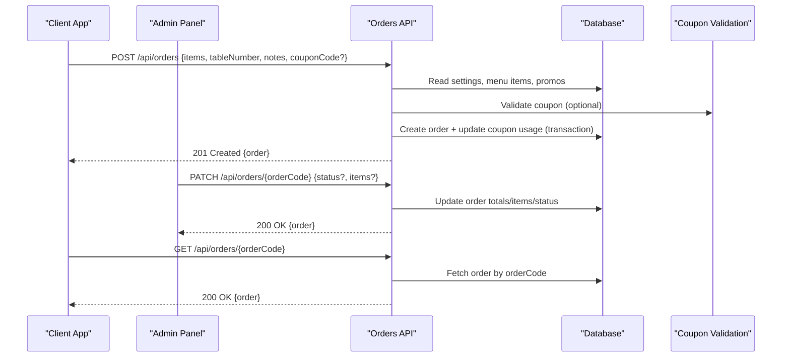
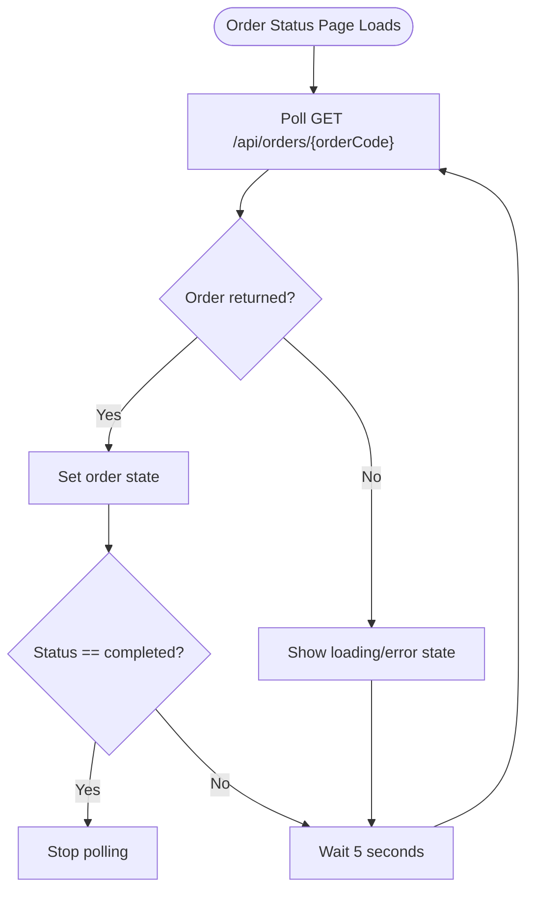
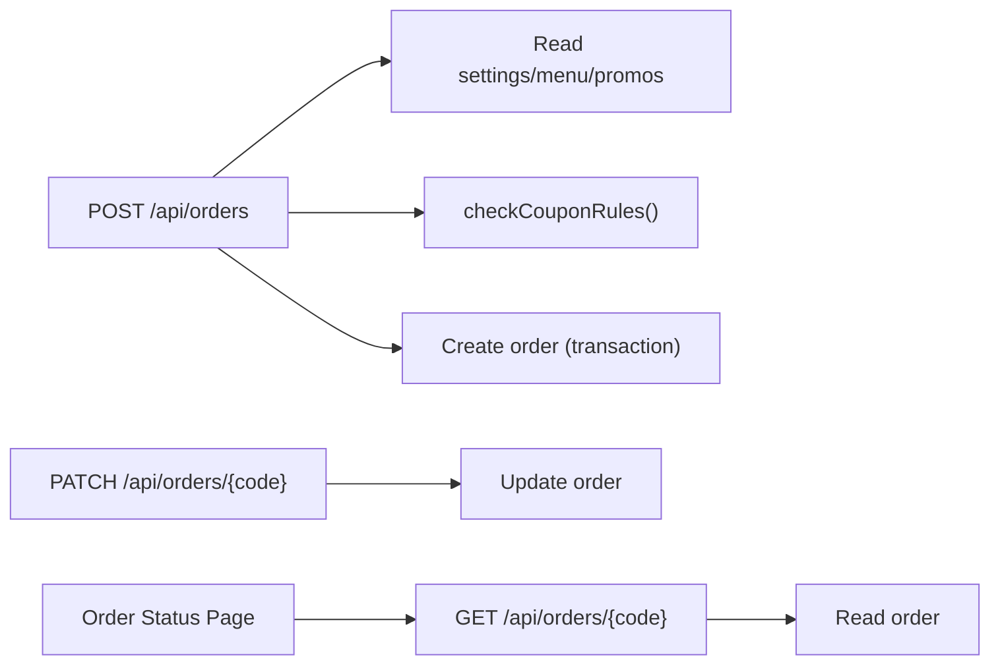

# Orders API

<cite>
**Referenced Files in This Document**
- [route.ts](file://app/api/orders/route.ts)
- [route.ts](file://app/api/orders/[id]/route.ts)
- [schema.prisma](file://prisma/schema.prisma)
- [coupon.ts](file://lib/coupon.ts)
- [types.ts](file://lib/types.ts)
- [page.tsx](file://app/order/[orderId]/page.tsx)
</cite>

## Table of Contents
1. [Introduction](#introduction)
2. [Project Structure](#project-structure)
3. [Core Components](#core-components)
4. [Architecture Overview](#architecture-overview)
5. [Detailed Component Analysis](#detailed-component-analysis)
6. [Dependency Analysis](#dependency-analysis)
7. [Performance Considerations](#performance-considerations)
8. [Troubleshooting Guide](#troubleshooting-guide)
9. [Conclusion](#conclusion)

## Introduction
This document provides detailed API documentation for the Orders endpoints that power the order lifecycle: creation, status updates, and history retrieval. It also documents request/response schemas for orders including customer table assignment, order items, pricing calculations, tax handling, coupon discounts, and delivery options. Authentication requirements, real-time status polling, error handling, and integration patterns with external payment systems are included to guide safe and robust implementation.

## Project Structure
The Orders API is implemented as Next.js App Router server routes under app/api/orders. Data persistence uses Prisma with a PostgreSQL database. Shared types and coupon validation logic live in lib/. The customer-facing order status page polls the API to show real-time updates.

**Diagram sources**
- [route.ts:1-245](file://app/api/orders/route.ts#L1-L245)
- [route.ts:1-97](file://app/api/orders/[id]/route.ts#L1-L97)
- [page.tsx:1-41](file://app/order/[orderId]/page.tsx#L1-L41)
- [schema.prisma:58-76](file://prisma/schema.prisma#L58-L76)
- [coupon.ts:1-133](file://lib/coupon.ts#L1-L133)
- [types.ts:57-83](file://lib/types.ts#L57-L83)

**Section sources**
- [route.ts:1-245](file://app/api/orders/route.ts#L1-L245)
- [route.ts:1-97](file://app/api/orders/[id]/route.ts#L1-L97)
- [schema.prisma:58-76](file://prisma/schema.prisma#L58-L76)
- [coupon.ts:1-133](file://lib/coupon.ts#L1-L133)
- [types.ts:57-83](file://lib/types.ts#L57-L83)
- [page.tsx:1-41](file://app/order/[orderId]/page.tsx#L1-L41)

## Core Components
- Order creation endpoint: POST /api/orders
- Order list endpoint: GET /api/orders
- Order detail endpoint: GET /api/orders/{orderCode}
- Order update endpoint: PATCH /api/orders/{orderCode}
- Order delete endpoint: DELETE /api/orders/{orderCode}
- Real-time status polling: Client-side polling via GET /api/orders/{orderCode}
- Pricing engine: Server-side recalculation of subtotal, tax, service charge, discount, and total
- Coupon validation: Business rules enforced before order creation

**Section sources**
- [route.ts:11-21](file://app/api/orders/route.ts#L11-L21)
- [route.ts:23-245](file://app/api/orders/route.ts#L23-L245)
- [route.ts:5-23](file://app/api/orders/[id]/route.ts#L5-L23)
- [route.ts:25-75](file://app/api/orders/[id]/route.ts#L25-L75)
- [route.ts:77-96](file://app/api/orders/[id]/route.ts#L77-L96)
- [page.tsx:19-40](file://app/order/[orderId]/page.tsx#L19-L40)

## Architecture Overview
The Orders API follows a secure-by-default design where all monetary values are recalculated on the server from authoritative data in the database. Clients cannot manipulate prices. Order creation validates items, promotions, add-ons, and optional coupons, then persists an order atomically within a transaction. Status updates are performed by admin operations. Customers poll the order detail endpoint to see real-time status changes.

**Diagram sources**
- [route.ts:23-245](file://app/api/orders/route.ts#L23-L245)
- [route.ts:25-75](file://app/api/orders/[id]/route.ts#L25-L75)
- [route.ts:5-23](file://app/api/orders/[id]/route.ts#L5-L23)
- [coupon.ts:80-132](file://lib/coupon.ts#L80-L132)

## Detailed Component Analysis

### Endpoint Reference

#### Create Order
- Method: POST
- Path: /api/orders
- Purpose: Create a new order from customer checkout
- Authentication: Not required for customers; intended for authenticated customer sessions at the application layer
- Request body fields:
  - items: array of order items (see Order Item schema)
  - tableNumber: positive integer representing the assigned table
  - notes: optional string (max length enforced server-side)
  - couponCode: optional string (validated against business rules)
- Response:
  - 201 Created: { order }
  - 400 Bad Request: validation errors (empty items, invalid table number, unavailable menu/promo/add-on, invalid coupon)
  - 500 Internal Server Error: unexpected server failure

Key behaviors:
- All monetary values are recalculated server-side from database prices
- Promotions and regular menu items are validated against active records
- Add-ons must match defined labels and prices
- Coupons are validated and applied atomically with order creation
- Order code is generated and guaranteed unique

**Section sources**
- [route.ts:23-245](file://app/api/orders/route.ts#L23-L245)
- [schema.prisma:58-76](file://prisma/schema.prisma#L58-L76)
- [types.ts:57-83](file://lib/types.ts#L57-L83)

#### List Orders
- Method: GET
- Path: /api/orders
- Purpose: Retrieve all orders sorted newest first
- Authentication: Not required by route; intended for internal/admin use at the application layer
- Response:
  - 200 OK: { orders }
  - 500 Internal Server Error: unexpected server failure

**Section sources**
- [route.ts:11-21](file://app/api/orders/route.ts#L11-L21)

#### Get Order by Code
- Method: GET
- Path: /api/orders/{orderCode}
- Purpose: Retrieve a single order by its orderCode
- Authentication: Not required by route; intended for customer-facing pages
- Response:
  - 200 OK: { order }
  - 404 Not Found: order not found
  - 500 Internal Server Error: unexpected server failure

Real-time updates:
- The client polls this endpoint every 5 seconds to reflect status changes until completion

**Section sources**
- [route.ts:5-23](file://app/api/orders/[id]/route.ts#L5-L23)
- [page.tsx:19-40](file://app/order/[orderId]/page.tsx#L19-L40)

#### Update Order
- Method: PATCH
- Path: /api/orders/{orderCode}
- Purpose: Update order status and/or items (admin operation)
- Authentication: Not enforced at route level; intended for admin panel
- Request body fields:
  - status: optional string (e.g., received, preparing, ready, completed)
  - items: optional array of updated items; if provided, totals are recalculated
- Response:
  - 200 OK: { order }
  - 404 Not Found: order not found
  - 500 Internal Server Error: unexpected server failure

Pricing behavior when updating items:
- Subtotal is recomputed from provided items
- Tax and service charge are recomputed using current settings
- Total is recomputed accordingly

**Section sources**
- [route.ts:25-75](file://app/api/orders/[id]/route.ts#L25-L75)

#### Delete Order
- Method: DELETE
- Path: /api/orders/{orderCode}
- Purpose: Delete an order (admin operation)
- Authentication: Not enforced at route level; intended for admin panel
- Response:
  - 200 OK: { success: true }
  - 404 Not Found: order not found
  - 500 Internal Server Error: unexpected server failure

**Section sources**
- [route.ts:77-96](file://app/api/orders/[id]/route.ts#L77-L96)

### Request/Response Schemas

#### Order Item Schema
- menuItemId: string (required; promo items use prefix promo_{promoId})
- name: string (display name)
- qty: number (minimum 1)
- price: number (unit price after add-ons or promo discounted price)
- spiceLevel: string (optional)
- addOns: array of { label: string; price: number } (must match DB-defined add-ons)
- lineTotal: number (price × qty)

Notes:
- For promo items, menuItemId starts with promo_ and refers to a valid active promotion
- Add-ons are validated against DB-defined labels and prices; browser-supplied prices are ignored

**Section sources**
- [types.ts:57-65](file://lib/types.ts#L57-L65)
- [route.ts:95-158](file://app/api/orders/route.ts#L95-L158)

#### Order Schema
- id: string
- orderCode: string (unique identifier)
- tableNumber: number (positive integer)
- items: array of OrderItem
- notes: string (optional, max length enforced)
- subtotal: number
- taxAmount: number
- serviceChargeAmount: number
- couponCode: string | null
- discountAmount: number
- total: number
- status: enum (received, preparing, ready, completed)
- createdAt: timestamp
- updatedAt: timestamp

**Section sources**
- [types.ts:67-83](file://lib/types.ts#L67-L83)
- [schema.prisma:58-76](file://prisma/schema.prisma#L58-L76)

#### Customer Information
- The current API does not include explicit customer identity fields in the order payload.
- If customer identification is required, extend the Order model and request schema to include fields such as customerId, customerName, phone, email, and delivery address.

Recommendation:
- Add a customerId field linked to a User model
- Capture delivery details for delivery orders (address, instructions)
- Enforce role-based access control at the application layer to protect sensitive fields

[No sources needed since this section proposes extensions beyond current implementation]

#### Table Assignment
- tableNumber: positive integer indicating the assigned table
- Validated during order creation; rejected if missing or non-positive

**Section sources**
- [route.ts:41-48](file://app/api/orders/route.ts#L41-L48)
- [schema.prisma:38-45](file://prisma/schema.prisma#L38-L45)

#### Pricing Calculations and Tax Handling
- Subtotal: sum of line totals across items
- Tax amount: calculated from subtotal using configured taxRatePercent
- Service charge: calculated from subtotal using configured serviceChargeRatePercent
- Discount: applied from validated coupon (percentage or fixed), capped by maxDiscountAmount if present
- Total: max(0, subtotal - discountAmount + taxAmount + serviceChargeAmount)

All monetary values are computed server-side from authoritative data.

**Section sources**
- [route.ts:182-185](file://app/api/orders/route.ts#L182-L185)
- [coupon.ts:38-61](file://lib/coupon.ts#L38-L61)
- [schema.prisma:99-106](file://prisma/schema.prisma#L99-L106)

#### Delivery Options
- The current order model supports dine-in via tableNumber.
- To support delivery, extend the Order model with fields like deliveryAddress, deliveryInstructions, deliveryFee, and deliveryMethod.
- Adjust pricing logic to include delivery fees and adjust tax/service charge rules as needed.

[No sources needed since this section proposes extensions beyond current implementation]

### Authentication and Authorization
- Route-level authentication is not enforced for these endpoints.
- Intended roles:
  - Customer: create orders, view own order status
  - Admin: list orders, update order status/items, delete orders
- Recommendation:
  - Implement JWT or session-based authentication at the application layer
  - Protect admin endpoints with middleware that checks user roles
  - Ensure customers can only read their own orders unless explicitly allowed

[No sources needed since this section provides general guidance]

### Real-Time Status Updates
- The client polls GET /api/orders/{orderCode} every 5 seconds to display live status.
- Status transitions: received → preparing → ready → completed.
- The UI stops polling once the order reaches completed.

**Diagram sources**
- [page.tsx:19-40](file://app/order/[orderId]/page.tsx#L19-L40)
- [route.ts:5-23](file://app/api/orders/[id]/route.ts#L5-L23)

**Section sources**
- [page.tsx:19-40](file://app/order/[orderId]/page.tsx#L19-L40)
- [route.ts:5-23](file://app/api/orders/[id]/route.ts#L5-L23)

### Error Handling
Common error responses:
- 400 Bad Request:
  - Empty items array
  - Invalid tableNumber
  - Unavailable menu item or promo
  - Invalid add-on label or price
  - Invalid coupon (inactive, expired, daily limit reached, minimum order not met)
- 404 Not Found:
  - Order not found
- 500 Internal Server Error:
  - Unexpected server failures

Error payloads:
- { error: string }

Best practices:
- Log server-side errors for diagnostics
- Return user-friendly messages in production
- Avoid exposing stack traces

**Section sources**
- [route.ts:33-48](file://app/api/orders/route.ts#L33-L48)
- [route.ts:99-128](file://app/api/orders/route.ts#L99-L128)
- [route.ts:167-180](file://app/api/orders/route.ts#L167-L180)
- [route.ts:237-243](file://app/api/orders/route.ts#L237-L243)
- [route.ts:15-22](file://app/api/orders/[id]/route.ts#L15-L22)
- [route.ts:68-74](file://app/api/orders/[id]/route.ts#L68-L74)
- [route.ts:89-95](file://app/api/orders/[id]/route.ts#L89-L95)

### Integration Patterns with Payment Systems
- The current order creation flow does not integrate with a payment gateway.
- Recommended pattern:
  - After successful order creation, initiate a payment session with the provider
  - Store paymentIntentId or equivalent in the Order model
  - On webhook confirmation, update order status to paid/completed
  - Handle partial payments, refunds, and cancellations via dedicated endpoints
- Security considerations:
  - Never trust client-provided amounts; always reconcile with backend calculations
  - Use idempotency keys to prevent duplicate charges
  - Securely store payment provider secrets and validate webhooks

[No sources needed since this section provides general guidance]

## Dependency Analysis
The Orders API depends on:
- Database models: Order, MenuItem, Promo, Coupon, Settings, RestaurantTable
- Shared logic: coupon validation and type definitions
- Client components: order status polling

**Diagram sources**
- [route.ts:23-245](file://app/api/orders/route.ts#L23-L245)
- [route.ts:25-75](file://app/api/orders/[id]/route.ts#L25-L75)
- [route.ts:5-23](file://app/api/orders/[id]/route.ts#L5-L23)
- [coupon.ts:80-132](file://lib/coupon.ts#L80-L132)
- [page.tsx:19-40](file://app/order/[orderId]/page.tsx#L19-L40)

**Section sources**
- [route.ts:23-245](file://app/api/orders/route.ts#L23-L245)
- [route.ts:25-75](file://app/api/orders/[id]/route.ts#L25-L75)
- [route.ts:5-23](file://app/api/orders/[id]/route.ts#L5-L23)
- [coupon.ts:80-132](file://lib/coupon.ts#L80-L132)
- [page.tsx:19-40](file://app/order/[orderId]/page.tsx#L19-L40)

## Performance Considerations
- Batch reads: The order creation endpoint fetches settings, menu items, and promos in parallel to reduce latency.
- Transactions: Order creation and coupon usage updates are wrapped in a transaction to ensure consistency.
- Polling interval: The client polls every 5 seconds; consider adaptive polling or WebSockets for high-throughput environments.
- Indexing: The Order model includes indexes on status and createdAt to optimize queries.

Optimization opportunities:
- Cache frequently accessed settings and menu data
- Implement pagination for order listing
- Use background jobs for heavy processing (e.g., analytics, notifications)

**Section sources**
- [route.ts:50-75](file://app/api/orders/route.ts#L50-L75)
- [route.ts:197-234](file://app/api/orders/route.ts#L197-L234)
- [schema.prisma:74-75](file://prisma/schema.prisma#L74-L75)
- [page.tsx:19-40](file://app/order/[orderId]/page.tsx#L19-L40)

## Troubleshooting Guide
Common issues and resolutions:
- Empty order submission:
  - Ensure items array is non-empty and each item has a valid menuItemId and qty >= 1
- Invalid table number:
  - Provide a positive integer for tableNumber
- Menu or promo unavailable:
  - Verify menu items and promos are active and exist in the database
- Add-on mismatch:
  - Ensure add-on labels match DB-defined add-ons; do not send custom prices
- Coupon validation failure:
  - Check coupon activation, date range, daily usage limits, and minimum order amount
- Order not found:
  - Confirm the orderCode passed to GET/PATCH/DELETE is correct and URL-encoded properly

Operational tips:
- Inspect server logs for error messages
- Validate inputs on the client side to provide immediate feedback
- Use consistent currency units (integers representing smallest currency unit)

**Section sources**
- [route.ts:33-48](file://app/api/orders/route.ts#L33-L48)
- [route.ts:99-128](file://app/api/orders/route.ts#L99-L128)
- [route.ts:167-180](file://app/api/orders/route.ts#L167-L180)
- [route.ts:15-22](file://app/api/orders/[id]/route.ts#L15-L22)
- [route.ts:68-74](file://app/api/orders/[id]/route.ts#L68-L74)
- [route.ts:89-95](file://app/api/orders/[id]/route.ts#L89-L95)

## Conclusion
The Orders API provides a secure and robust foundation for managing the complete order lifecycle. It enforces server-side pricing, validates promotions and coupons, and supports real-time status updates through simple polling. To extend functionality, consider adding customer identification, delivery options, and payment integrations while maintaining strict server-side validation and appropriate authentication controls.