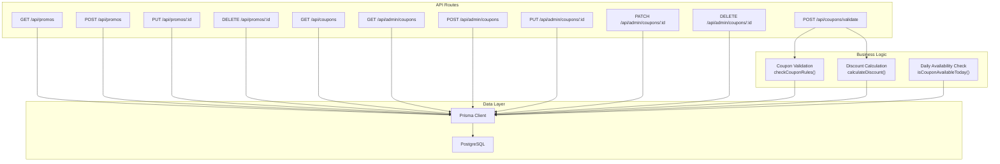
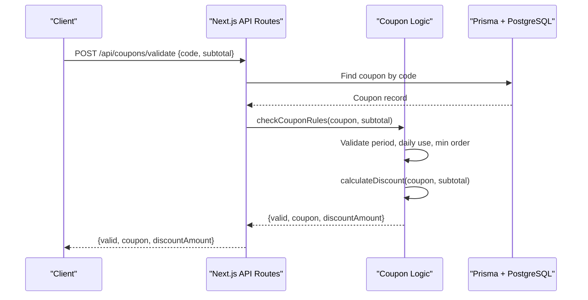
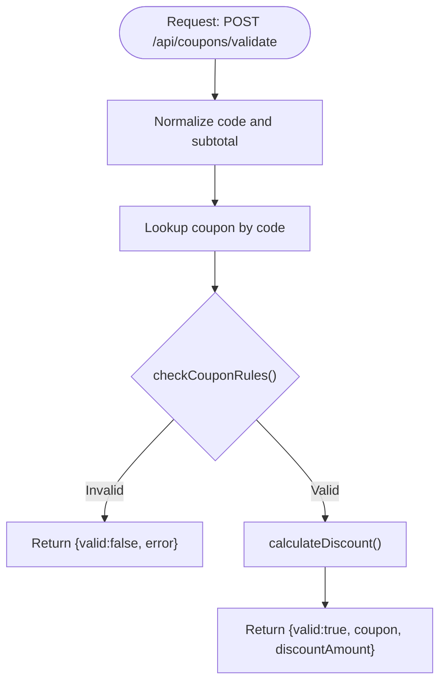
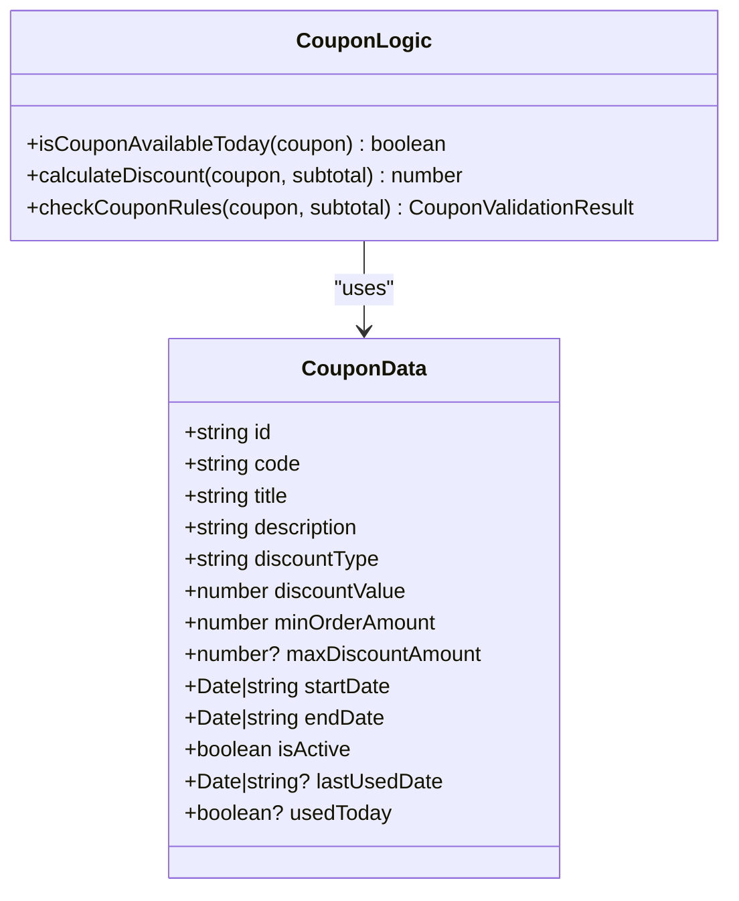
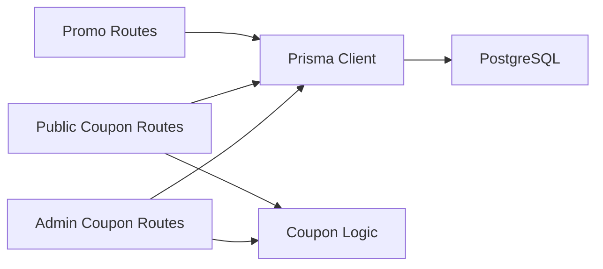
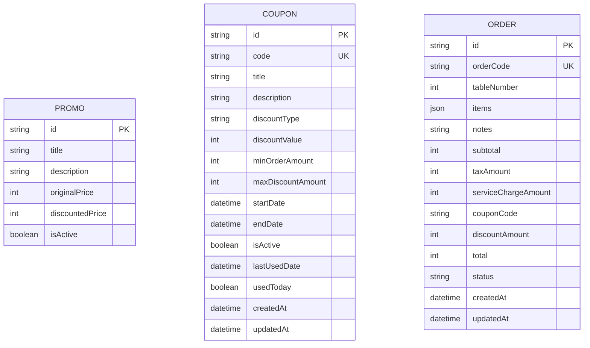

# Promotions & Coupons API

<cite>
**Referenced Files in This Document**
- [route.ts](file://app/api/promos/route.ts)
- [route.ts](file://app/api/promos/[id]/route.ts)
- [route.ts](file://app/api/coupons/route.ts)
- [route.ts](file://app/api/coupons/validate/route.ts)
- [route.ts](file://app/api/admin/coupons/route.ts)
- [route.ts](file://app/api/admin/coupons/[id]/route.ts)
- [coupon.ts](file://lib/coupon.ts)
- [schema.prisma](file://prisma/schema.prisma)
</cite>

## Table of Contents
1. [Introduction](#introduction)
2. [Project Structure](#project-structure)
3. [Core Components](#core-components)
4. [Architecture Overview](#architecture-overview)
5. [Detailed Component Analysis](#detailed-component-analysis)
6. [Dependency Analysis](#dependency-analysis)
7. [Performance Considerations](#performance-considerations)
8. [Troubleshooting Guide](#troubleshooting-guide)
9. [Conclusion](#conclusion)
10. [Appendices](#appendices)

## Introduction
This document provides comprehensive API documentation for promotion and coupon management endpoints. It covers:
- Creating, listing, updating, and deleting promotional campaigns
- Managing discount codes (coupons), including creation, listing, updates, and soft deletion
- Validating coupons against business rules such as validity periods, usage limits, and minimum order amounts
- Calculating promotional pricing and discount amounts
- Security considerations for coupon validation and fraud prevention

The implementation uses Next.js App Router API routes backed by Prisma with a PostgreSQL database.

## Project Structure
Promotions and coupons are implemented as RESTful endpoints under the Next.js app directory. Core logic is centralized in a shared library module for coupon validation and discount calculation. Database models are defined in the Prisma schema.

**Diagram sources**
- [route.ts:6-16](file://app/api/promos/route.ts#L6-L16)
- [route.ts:18-37](file://app/api/promos/route.ts#L18-L37)
- [route.ts:6-31](file://app/api/promos/[id]/route.ts#L6-L31)
- [route.ts:34-51](file://app/api/promos/[id]/route.ts#L34-L51)
- [route.ts:7-32](file://app/api/coupons/route.ts#L7-L32)
- [route.ts:8-57](file://app/api/coupons/validate/route.ts#L8-L57)
- [route.ts:7-27](file://app/api/admin/coupons/route.ts#L7-L27)
- [route.ts:29-128](file://app/api/admin/coupons/route.ts#L29-L128)
- [route.ts:10-67](file://app/api/admin/coupons/[id]/route.ts#L10-L67)
- [route.ts:71-73](file://app/api/admin/coupons/[id]/route.ts#L71-L73)
- [route.ts:75-101](file://app/api/admin/coupons/[id]/route.ts#L75-L101)
- [coupon.ts:19-33](file://lib/coupon.ts#L19-L33)
- [coupon.ts:35-61](file://lib/coupon.ts#L35-L61)
- [coupon.ts:77-132](file://lib/coupon.ts#L77-L132)

**Section sources**
- [route.ts:6-37](file://app/api/promos/route.ts#L6-L37)
- [route.ts:6-51](file://app/api/promos/[id]/route.ts#L6-L51)
- [route.ts:7-32](file://app/api/coupons/route.ts#L7-L32)
- [route.ts:8-57](file://app/api/coupons/validate/route.ts#L8-L57)
- [route.ts:7-128](file://app/api/admin/coupons/route.ts#L7-L128)
- [route.ts:10-101](file://app/api/admin/coupons/[id]/route.ts#L10-L101)
- [coupon.ts:1-133](file://lib/coupon.ts#L1-L133)
- [schema.prisma:47-97](file://prisma/schema.prisma#L47-L97)

## Core Components
- Promotions API: CRUD operations for promotional campaigns that map to a simple price-off model.
- Coupons API: Public listing of active coupons valid today; validation endpoint to compute discounts.
- Admin Coupons API: Administrative endpoints to create, update, toggle, and soft-delete coupons.
- Coupon Business Logic: Shared functions for daily availability checks, discount calculations, and rule validation.

Key responsibilities:
- Route handlers parse requests, enforce basic input normalization, and delegate to Prisma or shared logic.
- Shared coupon logic centralizes validation and discount math to ensure consistent behavior across endpoints.
- Data models define constraints and indexes for efficient queries.

**Section sources**
- [route.ts:6-37](file://app/api/promos/route.ts#L6-L37)
- [route.ts:6-51](file://app/api/promos/[id]/route.ts#L6-L51)
- [route.ts:7-32](file://app/api/coupons/route.ts#L7-L32)
- [route.ts:8-57](file://app/api/coupons/validate/route.ts#L8-L57)
- [route.ts:7-128](file://app/api/admin/coupons/route.ts#L7-L128)
- [route.ts:10-101](file://app/api/admin/coupons/[id]/route.ts#L10-L101)
- [coupon.ts:19-132](file://lib/coupon.ts#L19-L132)
- [schema.prisma:47-97](file://prisma/schema.prisma#L47-L97)

## Architecture Overview
The system follows a layered architecture:
- Presentation/API layer: Next.js route handlers process HTTP requests and return JSON responses.
- Business logic layer: Reusable functions encapsulate coupon validation and discount computation.
- Data access layer: Prisma client abstracts database interactions with PostgreSQL.

**Diagram sources**
- [route.ts:8-57](file://app/api/coupons/validate/route.ts#L8-L57)
- [coupon.ts:77-132](file://lib/coupon.ts#L77-L132)

## Detailed Component Analysis

### Promotions API
Endpoints:
- GET /api/promos
  - Purpose: List promotions; optionally include inactive ones via query parameter all=true.
  - Query parameters:
    - all: boolean string; when true, returns both active and inactive promotions.
  - Response:
    - promos: array of promotion objects.
  - Errors:
    - 500 on server errors.

- POST /api/promos
  - Purpose: Create a new promotion.
  - Request body fields:
    - title: string
    - description: string
    - originalPrice: integer
    - discountedPrice: integer
    - isActive: boolean (optional; defaults to true)
  - Response:
    - promo: created promotion object
  - Status codes:
    - 201 Created on success
    - 500 on server errors

- PUT /api/promos/:id
  - Purpose: Update an existing promotion.
  - Path parameters:
    - id: string
  - Request body fields (all optional):
    - title, description, originalPrice, discountedPrice, isActive
  - Response:
    - promo: updated promotion object
  - Status codes:
    - 404 if not found
    - 500 on server errors

- DELETE /api/promos/:id
  - Purpose: Delete a promotion.
  - Path parameters:
    - id: string
  - Response:
    - success: boolean
  - Status codes:
    - 404 if not found
    - 500 on server errors

Notes:
- The promotions model represents a simple price-off campaign without advanced discount types or applicability filters.

**Section sources**
- [route.ts:6-16](file://app/api/promos/route.ts#L6-L16)
- [route.ts:18-37](file://app/api/promos/route.ts#L18-L37)
- [route.ts:6-31](file://app/api/promos/[id]/route.ts#L6-L31)
- [route.ts:34-51](file://app/api/promos/[id]/route.ts#L34-L51)
- [schema.prisma:47-56](file://prisma/schema.prisma#L47-L56)

### Coupons API (Public)
Endpoints:
- GET /api/coupons
  - Purpose: Return active coupons currently valid and available today.
  - Behavior:
    - Filters by isActive=true and current date within startDate..endDate.
    - Further filters out coupons already used today using daily availability logic.
  - Response:
    - coupons: array of coupon objects available today.
  - Errors:
    - 500 on server errors.

- POST /api/coupons/validate
  - Purpose: Validate a coupon code against cart subtotal and business rules.
  - Request body fields:
    - code: string (required; normalized to uppercase)
    - subtotal: integer (non-negative; default 0)
  - Response:
    - If valid:
      - valid: true
      - coupon: object containing id, code, title, description, discountType, discountValue, minOrderAmount, maxDiscountAmount
      - discountAmount: number
    - If invalid:
      - valid: false
      - error: human-readable message
  - Status codes:
    - 400 for validation failures
    - 500 on server errors

Validation and discount calculation flow:
- Normalizes inputs.
- Looks up coupon by code.
- Applies business rules:
  - Active status
  - Validity period
  - Daily usage limit
  - Minimum order amount
- Computes discount amount based on discount type and caps.

**Diagram sources**
- [route.ts:8-57](file://app/api/coupons/validate/route.ts#L8-L57)
- [coupon.ts:77-132](file://lib/coupon.ts#L77-L132)

**Section sources**
- [route.ts:7-32](file://app/api/coupons/route.ts#L7-L32)
- [route.ts:8-57](file://app/api/coupons/validate/route.ts#L8-L57)
- [coupon.ts:19-132](file://lib/coupon.ts#L19-L132)

### Admin Coupons API
Endpoints:
- GET /api/admin/coupons
  - Purpose: List all coupons for administrative purposes.
  - Response:
    - coupons: enriched array including isAvailableToday flag computed from daily availability logic.
  - Errors:
    - 500 on server errors.

- POST /api/admin/coupons
  - Purpose: Create a new coupon with validation.
  - Request body fields:
    - code: string (required; normalized to uppercase)
    - title: string (required)
    - description: string (optional)
    - discountType: string ("FIXED" or "PERCENTAGE"; coerced)
    - discountValue: integer (required; >0; <=100 for percentage)
    - minOrderAmount: integer (>=0)
    - maxDiscountAmount: integer (optional; only meaningful for PERCENTAGE)
    - startDate: ISO date string (required)
    - endDate: ISO date string (required; >= startDate)
    - isActive: boolean (optional; defaults to true)
  - Response:
    - coupon: created coupon object
  - Status codes:
    - 201 Created on success
    - 400 for validation errors (e.g., duplicate code, invalid dates, percentage >100%)
    - 500 on server errors

- PUT /api/admin/coupons/:id
  - Purpose: Update coupon details with validations.
  - Path parameters:
    - id: string
  - Request body fields (all optional):
    - code, title, description, discountType, discountValue, minOrderAmount, maxDiscountAmount, startDate, endDate, isActive
  - Response:
    - coupon: updated coupon object
  - Status codes:
    - 400 for validation errors (e.g., duplicate code)
    - 404 if not found
    - 500 on server errors

- PATCH /api/admin/coupons/:id
  - Purpose: Alias to PUT for quick toggles or partial updates.
  - Behavior: Delegates to PUT handler.

- DELETE /api/admin/coupons/:id
  - Purpose: Soft delete by setting isActive=false.
  - Path parameters:
    - id: string
  - Response:
    - success: boolean
    - message: confirmation message
    - coupon: updated coupon object
  - Status codes:
    - 404 if not found
    - 500 on server errors

**Section sources**
- [route.ts:7-27](file://app/api/admin/coupons/route.ts#L7-L27)
- [route.ts:29-128](file://app/api/admin/coupons/route.ts#L29-L128)
- [route.ts:10-67](file://app/api/admin/coupons/[id]/route.ts#L10-L67)
- [route.ts:71-73](file://app/api/admin/coupons/[id]/route.ts#L71-L73)
- [route.ts:75-101](file://app/api/admin/coupons/[id]/route.ts#L75-L101)

### Coupon Business Logic
Shared functions:
- isCouponAvailableToday(coupon)
  - Determines whether a coupon can be used today based on lastUsedDate.
  - Resets automatically each calendar day without background jobs.

- calculateDiscount(coupon, subtotal)
  - Computes discount amount:
    - For PERCENTAGE: applies percentage and optional maxDiscountAmount cap.
    - For FIXED: uses fixed value.
  - Ensures discount does not exceed subtotal and is non-negative.

- checkCouponRules(coupon, subtotal)
  - Validates:
    - Coupon exists and is active
    - Current time within validity period
    - Daily usage limit
    - Minimum order amount
  - Returns structured result with either valid state and discount amount or error message.

**Diagram sources**
- [coupon.ts:3-17](file://lib/coupon.ts#L3-L17)
- [coupon.ts:19-33](file://lib/coupon.ts#L19-L33)
- [coupon.ts:35-61](file://lib/coupon.ts#L35-L61)
- [coupon.ts:77-132](file://lib/coupon.ts#L77-L132)

**Section sources**
- [coupon.ts:1-133](file://lib/coupon.ts#L1-L133)

## Dependency Analysis
Coupling and cohesion:
- API routes depend on Prisma client for data access and on shared coupon logic for validation and discount calculation.
- Shared coupon logic is cohesive and reusable across public and admin endpoints.
- Database models define clear boundaries between entities (Promo, Coupon, Order).

External dependencies:
- Prisma client abstracts PostgreSQL interactions.
- Date handling relies on JavaScript Date objects.

Potential circular dependencies:
- None observed; routes import logic and Prisma, but logic does not import routes.

**Diagram sources**
- [route.ts:6-37](file://app/api/promos/route.ts#L6-L37)
- [route.ts:6-51](file://app/api/promos/[id]/route.ts#L6-L51)
- [route.ts:7-32](file://app/api/coupons/route.ts#L7-L32)
- [route.ts:8-57](file://app/api/coupons/validate/route.ts#L8-L57)
- [route.ts:7-128](file://app/api/admin/coupons/route.ts#L7-L128)
- [route.ts:10-101](file://app/api/admin/coupons/[id]/route.ts#L10-L101)
- [coupon.ts:19-132](file://lib/coupon.ts#L19-L132)

**Section sources**
- [route.ts:6-51](file://app/api/promos/route.ts#L6-L51)
- [route.ts:6-51](file://app/api/promos/[id]/route.ts#L6-L51)
- [route.ts:7-32](file://app/api/coupons/route.ts#L7-L32)
- [route.ts:8-57](file://app/api/coupons/validate/route.ts#L8-L57)
- [route.ts:7-128](file://app/api/admin/coupons/route.ts#L7-L128)
- [route.ts:10-101](file://app/api/admin/coupons/[id]/route.ts#L10-L101)
- [coupon.ts:19-132](file://lib/coupon.ts#L19-L132)

## Performance Considerations
- Indexing:
  - Coupon index on (code, isActive) improves lookup performance during validation and listing.
  - Menu items index on (isActive, category) supports menu-related queries.
- Query optimization:
  - Public coupon listing filters by active status and date range at the database level before applying daily availability filtering in memory.
- Discount calculation:
  - Simple arithmetic operations; negligible overhead.
- Recommendations:
  - Consider caching frequently accessed promotions and coupons if read-heavy.
  - Add rate limiting on validation endpoint to prevent abuse.
  - Use pagination for large coupon lists in admin UI.

[No sources needed since this section provides general guidance]

## Troubleshooting Guide
Common issues and resolutions:
- Promotion not found:
  - Occurs when updating or deleting a promotion with a non-existent ID.
  - Resolution: Verify ID and ensure promotion exists.

- Coupon validation fails:
  - Reasons include inactive coupon, outside validity period, already used today, or subtotal below minimum.
  - Resolution: Adjust coupon settings or increase order subtotal.

- Duplicate coupon code:
  - Creation or update rejects duplicate codes.
  - Resolution: Use a unique code.

- Invalid date ranges:
  - End date must not precede start date; both must be valid ISO dates.
  - Resolution: Correct date formats and ordering.

- Server errors:
  - 500 responses indicate internal errors; inspect logs for stack traces.
  - Resolution: Review environment configuration and database connectivity.

**Section sources**
- [route.ts:25-31](file://app/api/promos/[id]/route.ts#L25-L31)
- [route.ts:44-50](file://app/api/promos/[id]/route.ts#L44-L50)
- [route.ts:29-128](file://app/api/admin/coupons/route.ts#L29-L128)
- [route.ts:10-67](file://app/api/admin/coupons/[id]/route.ts#L10-L67)
- [route.ts:75-101](file://app/api/admin/coupons/[id]/route.ts#L75-L101)

## Conclusion
The Promotions & Coupons API provides straightforward endpoints to manage promotional campaigns and discount codes. Validation and discount calculation are centralized in shared logic to ensure consistency. The design emphasizes simplicity and correctness, with clear error handling and database indexing for performance. Future enhancements may include richer promotion models, advanced applicability rules, and stronger security controls around coupon validation.

[No sources needed since this section summarizes without analyzing specific files]

## Appendices

### Data Models
Promotion and Coupon schemas define core attributes and constraints.

**Diagram sources**
- [schema.prisma:47-56](file://prisma/schema.prisma#L47-L56)
- [schema.prisma:78-97](file://prisma/schema.prisma#L78-L97)
- [schema.prisma:58-76](file://prisma/schema.prisma#L58-L76)

### Security Considerations and Fraud Prevention
- Input normalization:
  - Coupon codes are trimmed and uppercased to avoid case-sensitivity issues.
  - Subtotals are clamped to non-negative values.
- Rate limiting:
  - Implement rate limiting on validation endpoint to mitigate brute-force attempts.
- Authorization:
  - Admin endpoints should be protected with authentication and authorization middleware.
- Audit logging:
  - Log validation attempts and outcomes for monitoring and anomaly detection.
- Tokenization:
  - Consider issuing short-lived, signed tokens for coupon redemption to prevent replay attacks.
- Minimize information leakage:
  - Avoid exposing sensitive internal details in error messages; provide generic messages to clients while logging specifics server-side.

[No sources needed since this section provides general guidance]