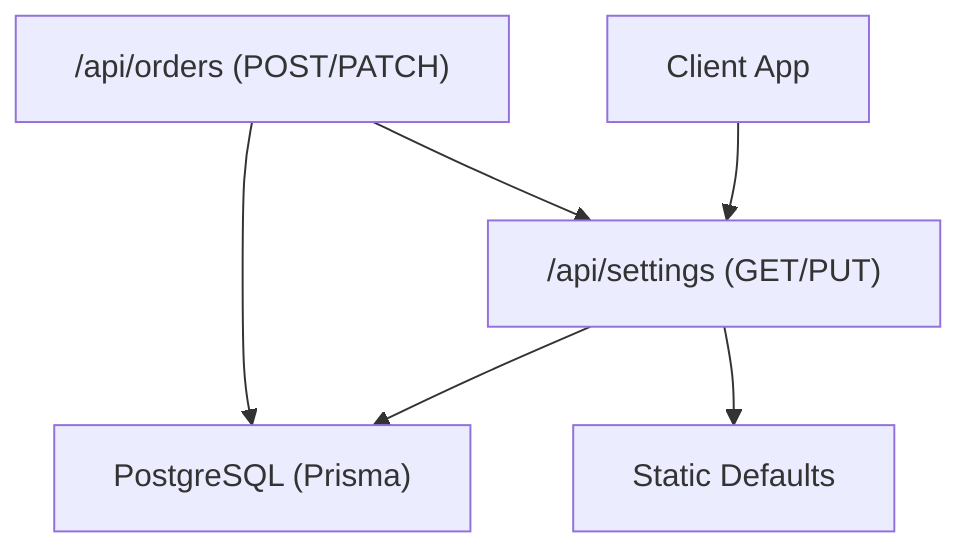
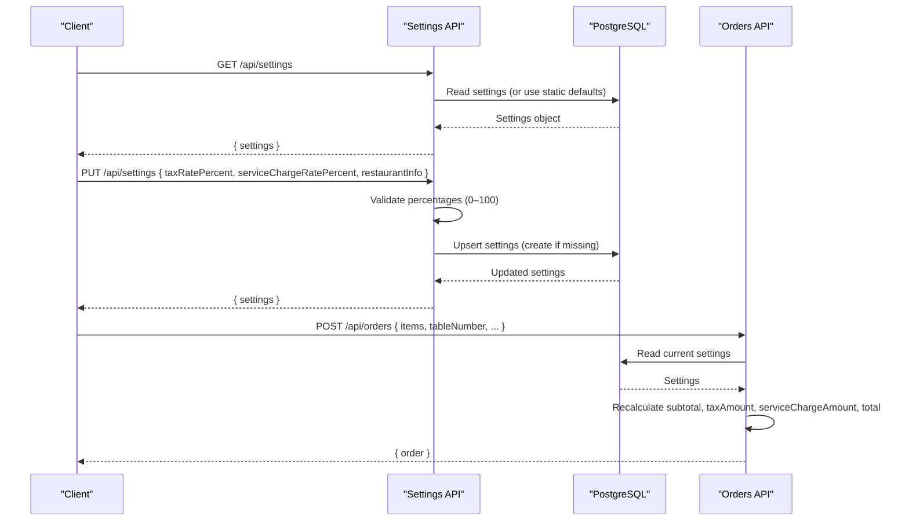
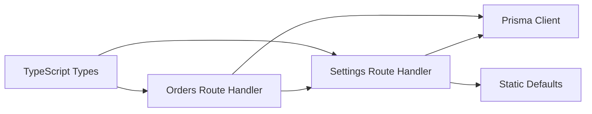

# Settings API

<cite>
**Referenced Files in This Document**
- [route.ts](file://app/api/settings/route.ts)
- [schema.prisma](file://prisma/schema.prisma)
- [staticData.ts](file://lib/staticData.ts)
- [db.ts](file://lib/db.ts)
- [types.ts](file://lib/types.ts)
- [route.ts](file://app/api/orders/route.ts)
- [route.ts](file://app/api/orders/[id]/route.ts)
</cite>

## Table of Contents
1. [Introduction](#introduction)
2. [Project Structure](#project-structure)
3. [Core Components](#core-components)
4. [Architecture Overview](#architecture-overview)
5. [Detailed Component Analysis](#detailed-component-analysis)
6. [Dependency Analysis](#dependency-analysis)
7. [Performance Considerations](#performance-considerations)
8. [Troubleshooting Guide](#troubleshooting-guide)
9. [Conclusion](#conclusion)

## Introduction
This document describes the Settings API for managing restaurant configuration, including tax rates, service charge rates, and restaurant profile information. It also explains how these settings influence order calculations and data persistence. The API is implemented as a Next.js Route Handler with Prisma-backed PostgreSQL storage and static defaults for fallback behavior.

## Project Structure
The Settings API is exposed via a single route handler under the app directory and uses shared libraries for database access, static defaults, and type definitions.

**Diagram sources**
- [route.ts:6-17](file://app/api/settings/route.ts#L6-L17)
- [route.ts:19-67](file://app/api/settings/route.ts#L19-L67)
- [route.ts:23-236](file://app/api/orders/route.ts#L23-L236)
- [route.ts:25-75](file://app/api/orders/[id]/route.ts#L25-L75)

**Section sources**
- [route.ts:6-67](file://app/api/settings/route.ts#L6-L67)
- [route.ts:23-236](file://app/api/orders/route.ts#L23-L236)
- [route.ts:25-75](file://app/api/orders/[id]/route.ts#L25-L75)

## Core Components
- Settings API endpoint: GET and PUT handlers for retrieving and updating restaurant settings.
- Data model: Prisma schema defines the Settings table with fields for tax rate, service charge rate, and restaurant info.
- Static defaults: Default values used when no persisted settings exist or during seeding.
- Order calculation integration: Order endpoints read current settings to compute taxes and service charges server-side.

Key responsibilities:
- Validate numeric percentage inputs for tax and service charge.
- Persist settings as a singleton record.
- Provide default settings when none exist.
- Ensure order totals are recalculated using current settings.

**Section sources**
- [route.ts:6-67](file://app/api/settings/route.ts#L6-L67)
- [schema.prisma:99-106](file://prisma/schema.prisma#L99-L106)
- [staticData.ts:155-165](file://lib/staticData.ts#L155-L165)
- [route.ts:67-81](file://app/api/orders/route.ts#L67-L81)
- [route.ts:45-60](file://app/api/orders/[id]/route.ts#L45-L60)

## Architecture Overview
The Settings API follows a simple client-server pattern backed by PostgreSQL through Prisma. When settings do not exist, the API returns static defaults. On update, it validates input and persists changes. Order endpoints consume the latest settings to calculate taxes and service charges deterministically on the server.

**Diagram sources**
- [route.ts:6-17](file://app/api/settings/route.ts#L6-L17)
- [route.ts:19-67](file://app/api/settings/route.ts#L19-L67)
- [route.ts:67-81](file://app/api/orders/route.ts#L67-L81)
- [route.ts:182-185](file://app/api/orders/route.ts#L182-L185)

## Detailed Component Analysis

### Settings API Endpoints

#### GET /api/settings
- Purpose: Retrieve current restaurant settings. If none exist, returns static defaults.
- Response: JSON object containing a settings field.
- Behavior:
  - Connects to the database.
  - Reads the first settings record.
  - Falls back to static defaults when no record exists.
  - Returns error response on failure.

Request
- Method: GET
- Headers: None required
- Body: None

Response
- Success: 200 OK
  - Body: `{ settings: SettingsObject }`
- Failure: 500 Internal Server Error
  - Body: `{ error: string }`

Validation Rules
- No input validation needed.

Default Values
- If no persisted settings exist, static defaults are returned.

Example Response
- See [route.ts:6-17](file://app/api/settings/route.ts#L6-L17)

**Section sources**
- [route.ts:6-17](file://app/api/settings/route.ts#L6-L17)

#### PUT /api/settings
- Purpose: Update tax rate, service charge rate, and/or restaurant profile information.
- Request Body Fields:
  - `taxRatePercent`: number (optional). Must be between 0 and 100 inclusive.
  - `serviceChargeRatePercent`: number (optional). Must be between 0 and 100 inclusive.
  - `restaurantInfo`: object (optional). Contains restaurant profile details.
- Behavior:
  - Validates provided percentages.
  - Updates existing settings or creates a new one if missing.
  - Uses static defaults for fields not provided during creation.
  - Returns updated settings or error response.

Request
- Method: PUT
- Headers: Content-Type: application/json
- Body: Partial SettingsObject

Response
- Success: 200 OK
  - Body: `{ settings: SettingsObject }`
- Validation Error: 400 Bad Request
  - Body: `{ error: string }`
- Failure: 500 Internal Server Error
  - Body: `{ error: string }`

Validation Rules
- `taxRatePercent`: must be a number within [0, 100].
- `serviceChargeRatePercent`: must be a number within [0, 100].
- `restaurantInfo`: optional; when provided, replaces the stored object.

Default Values
- During creation, fields omitted from the request fall back to static defaults.

Example Requests
- Update tax rate only:
  - Body: `{ taxRatePercent: 12 }`
- Update service charge and restaurant info:
  - Body: `{ serviceChargeRatePercent: 7, restaurantInfo: { name: "...", address: "...", whatsapp: "...", instagram: "...", email: "..." } }`

Example Responses
- See [route.ts:19-67](file://app/api/settings/route.ts#L19-L67)

**Section sources**
- [route.ts:19-67](file://app/api/settings/route.ts#L19-L67)

### Data Model and Types

#### Prisma Schema: Settings
- Fields:
  - `id`: unique identifier
  - `taxRatePercent`: integer percentage (default 10)
  - `serviceChargeRatePercent`: integer percentage (default 5)
  - `restaurantInfo`: JSON object storing restaurant profile details

Constraints and Defaults
- Percentages default to 10 and 5 respectively.
- Restaurant info defaults to an empty JSON object.

**Section sources**
- [schema.prisma:99-106](file://prisma/schema.prisma#L99-L106)

#### TypeScript Types: ISettings and IRestaurantInfo
- `IRestaurantInfo`:
  - `name`: string
  - `address`: string
  - `whatsapp`: string
  - `instagram`: string
  - `email`: string
- `ISettings`:
  - `id?`: string
  - `taxRatePercent`: number
  - `serviceChargeRatePercent`: number
  - `restaurantInfo`: IRestaurantInfo

These types define the shape of settings objects exchanged between client and server.

**Section sources**
- [types.ts:104-117](file://lib/types.ts#L104-L117)

### Static Defaults and Seeding

#### Static Defaults
- Default tax rate: 10%
- Default service charge rate: 5%
- Default restaurant info includes name, address, contact details.

Behavior
- Used when no settings record exists in the database.
- Used during initial seeding to populate the database.

**Section sources**
- [staticData.ts:155-165](file://lib/staticData.ts#L155-L165)
- [db.ts:137-144](file://lib/db.ts#L137-L144)

#### Database Seeding
- On first run, the system seeds categories, menu items, promos, settings, and tables.
- Settings are created with static defaults if absent.

**Section sources**
- [db.ts:92-159](file://lib/db.ts#L92-L159)

### Order Calculation Integration

#### POST /api/orders
- Reads current settings to determine tax and service charge rates.
- Recalculates all monetary values server-side to prevent manipulation.
- Computes:
  - `subtotal`: sum of validated item line totals
  - `taxAmount`: based on `taxRatePercent`
  - `serviceChargeAmount`: based on `serviceChargeRatePercent`
  - `total`: subtotal minus discount plus tax and service charge

Behavior
- Fetches settings along with menu items and promos in parallel.
- Applies coupon rules and discounts where applicable.
- Persists order atomically within a transaction.

**Section sources**
- [route.ts:67-81](file://app/api/orders/route.ts#L67-L81)
- [route.ts:182-185](file://app/api/orders/route.ts#L182-L185)
- [route.ts:197-234](file://app/api/orders/route.ts#L197-L234)

#### PATCH /api/orders/[id]
- When items are updated, recalculates totals using current settings.
- Updates order status and/or items.

**Section sources**
- [route.ts:45-60](file://app/api/orders/[id]/route.ts#L45-L60)

## Dependency Analysis

**Diagram sources**
- [route.ts:6-67](file://app/api/settings/route.ts#L6-L67)
- [route.ts:23-236](file://app/api/orders/route.ts#L23-L236)
- [types.ts:104-117](file://lib/types.ts#L104-L117)

**Section sources**
- [route.ts:6-67](file://app/api/settings/route.ts#L6-L67)
- [route.ts:23-236](file://app/api/orders/route.ts#L23-L236)
- [types.ts:104-117](file://lib/types.ts#L104-L117)

## Performance Considerations
- Settings retrieval is lightweight: single row lookup with fallback to static defaults.
- Order creation batches fetching of settings, menu items, and promos to minimize round trips.
- All monetary calculations are performed server-side to ensure accuracy and security.
- Avoid unnecessary updates to settings; batch changes where possible.

[No sources needed since this section provides general guidance]

## Troubleshooting Guide

Common Issues
- Invalid percentage values:
  - Symptom: 400 Bad Request with error message indicating invalid percentage range.
  - Cause: Provided `taxRatePercent` or `serviceChargeRatePercent` outside [0, 100].
  - Resolution: Ensure values are numbers within the allowed range.

- Missing settings record:
  - Symptom: GET returns static defaults instead of persisted values.
  - Cause: Database has not been seeded or settings were deleted.
  - Resolution: Run database seeding or create settings via PUT.

- Database connection failures:
  - Symptom: 500 Internal Server Error with generic error messages.
  - Cause: Database unavailable or misconfigured environment variables.
  - Resolution: Verify DATABASE_URL and DIRECT_URL environment variables and connectivity.

Error Handling Patterns
- Input validation errors return 400 with descriptive messages.
- Database or unexpected errors return 500 with generic messages.
- Use logging to diagnose issues during development.

**Section sources**
- [route.ts:25-43](file://app/api/settings/route.ts#L25-L43)
- [route.ts:13-16](file://app/api/settings/route.ts#L13-L16)
- [route.ts:63-66](file://app/api/settings/route.ts#L63-L66)

## Conclusion
The Settings API provides a robust mechanism for managing restaurant configuration, ensuring that tax and service charge rates, along with restaurant profile information, are consistently applied across the application. Order endpoints rely on these settings to compute accurate totals server-side, maintaining integrity and preventing client-side manipulation. Static defaults and seeding ensure reliable operation even in fresh environments.

[No sources needed since this section summarizes without analyzing specific files]