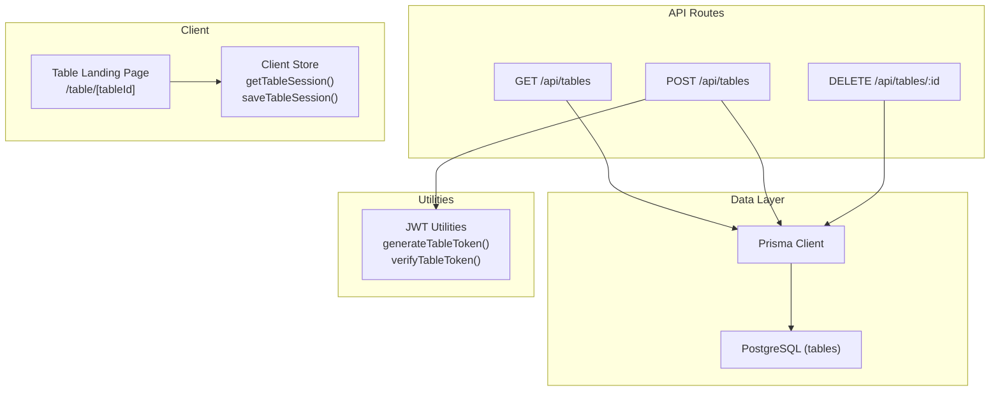
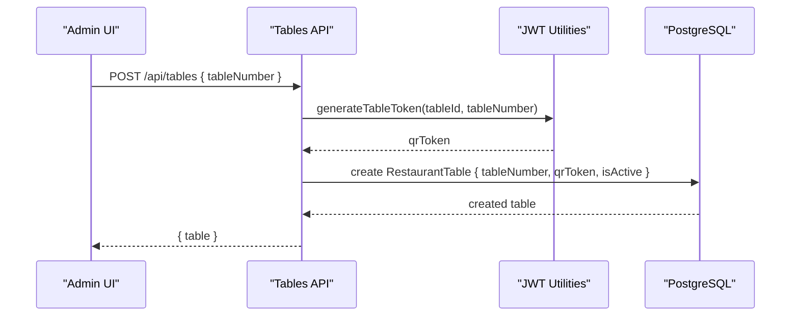
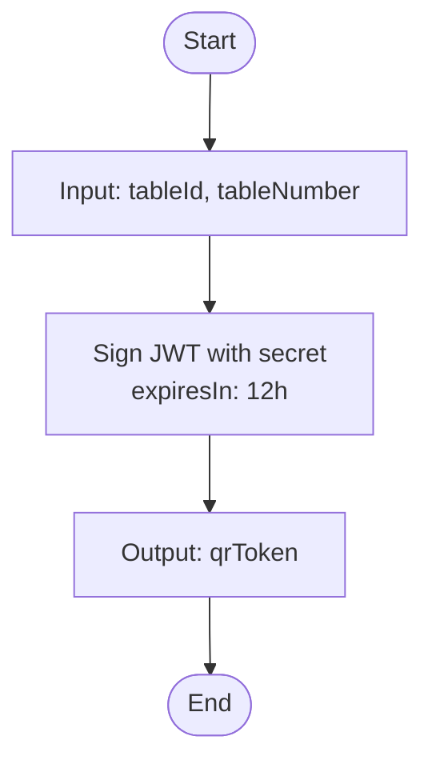
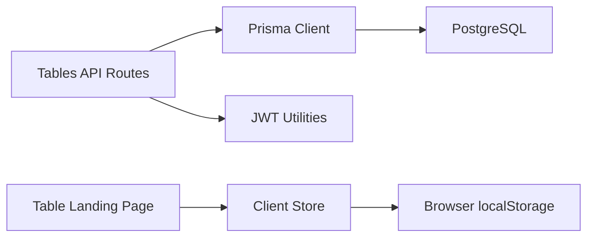

# Tables API

<cite>
**Referenced Files in This Document**
- [route.ts](file://app/api/tables/route.ts)
- [route.ts](file://app/api/tables/[id]/route.ts)
- [schema.prisma](file://prisma/schema.prisma)
- [jwt.ts](file://lib/jwt.ts)
- [store.ts](file://lib/store.ts)
- [page.tsx](file://app/table/[tableId]/page.tsx)
</cite>

## Table of Contents
1. [Introduction](#introduction)
2. [Project Structure](#project-structure)
3. [Core Components](#core-components)
4. [Architecture Overview](#architecture-overview)
5. [Detailed Component Analysis](#detailed-component-analysis)
6. [Dependency Analysis](#dependency-analysis)
7. [Performance Considerations](#performance-considerations)
8. [Troubleshooting Guide](#troubleshooting-guide)
9. [Conclusion](#conclusion)

## Introduction
This document describes the table management and QR code generation endpoints for the restaurant ordering system. It covers:
- Creating tables and generating QR tokens
- Listing and deleting tables
- Data model for tables, including identifiers, capacity-related fields, location mapping, and session state
- QR code token generation and verification logic
- Client-side table session handling
- Security considerations for table access and session management

The implementation uses Next.js App Router API routes backed by Prisma and PostgreSQL.

## Project Structure
The relevant parts of the project structure for this documentation are:
- API routes for tables under `app/api/tables`
- Database schema under `prisma/schema.prisma`
- JWT utilities for QR token generation and verification under `lib/jwt.ts`
- Client-side store for table sessions under `lib/store.ts`
- Table landing page under `app/table/[tableId]/page.tsx`

**Diagram sources**
- [route.ts:7-16](file://app/api/tables/route.ts#L7-L16)
- [route.ts:18-33](file://app/api/tables/route.ts#L18-L33)
- [route.ts:6-22](file://app/api/tables/[id]/route.ts#L6-L22)
- [schema.prisma:38-45](file://prisma/schema.prisma#L38-L45)
- [jwt.ts:15-27](file://lib/jwt.ts#L15-L27)
- [store.ts:180-216](file://lib/store.ts#L180-L216)
- [page.tsx:9-17](file://app/table/[tableId]/page.tsx#L9-L17)

**Section sources**
- [route.ts:7-33](file://app/api/tables/route.ts#L7-L33)
- [route.ts:6-22](file://app/api/tables/[id]/route.ts#L6-L22)
- [schema.prisma:38-45](file://prisma/schema.prisma#L38-L45)
- [jwt.ts:1-28](file://lib/jwt.ts#L1-L28)
- [store.ts:180-216](file://lib/store.ts#L180-L216)
- [page.tsx:9-17](file://app/table/[tableId]/page.tsx#L9-L17)

## Core Components
- Table listing endpoint returns all tables ordered by table number.
- Table creation endpoint creates a table with a unique table number, generates a signed QR token, and persists it.
- Table deletion endpoint removes a table by its internal id.
- JWT utilities generate and verify QR tokens for tables.
- Client-side store manages table session data locally.
- Table landing page pre-fills the table number from the URL path without validating per-table tokens.

Key responsibilities:
- API routes handle HTTP requests and database operations.
- JWT utilities provide secure token generation and verification.
- Client store provides local persistence for table sessions.
- Schema defines the persistent table model.

**Section sources**
- [route.ts:7-33](file://app/api/tables/route.ts#L7-L33)
- [route.ts:6-22](file://app/api/tables/[id]/route.ts#L6-L22)
- [jwt.ts:15-27](file://lib/jwt.ts#L15-L27)
- [store.ts:180-216](file://lib/store.ts#L180-L216)
- [schema.prisma:38-45](file://prisma/schema.prisma#L38-L45)

## Architecture Overview
The table management flow integrates API routes, Prisma, PostgreSQL, and client-side storage. QR tokens are generated server-side and stored with each table record. The client can optionally use these tokens to identify the table during a session.

**Diagram sources**
- [route.ts:18-33](file://app/api/tables/route.ts#L18-L33)
- [jwt.ts:15-17](file://lib/jwt.ts#L15-L17)
- [schema.prisma:38-45](file://prisma/schema.prisma#L38-L45)

## Detailed Component Analysis

### Endpoints

#### List Tables
- Method: GET
- Path: /api/tables
- Description: Returns all tables sorted by table number ascending.
- Response:
  - Success: JSON object containing an array of tables.
  - Error: JSON error message with status 500 on failure.

Request:
- No body required.

Response schema:
- tables: Array of table objects with fields defined in the schema.

Error handling:
- Logs errors and returns a generic error response.

**Section sources**
- [route.ts:7-16](file://app/api/tables/route.ts#L7-L16)

#### Create Table
- Method: POST
- Path: /api/tables
- Description: Creates a new table with a unique table number and generates a signed QR token.
- Request body:
  - tableNumber: integer (required).
- Response:
  - Success: Created table object with status 201.
  - Error: JSON error message with status 500 on failure.

Processing steps:
- Connect to the database.
- Parse request body.
- Generate a stable table id based on table number.
- Generate a signed QR token using JWT utilities.
- Persist table with isActive set to true.

Security note:
- The QR token is signed and includes table identifier and number.

**Section sources**
- [route.ts:18-33](file://app/api/tables/route.ts#L18-L33)
- [jwt.ts:15-17](file://lib/jwt.ts#L15-L17)

#### Delete Table
- Method: DELETE
- Path: /api/tables/:id
- Description: Deletes a table by its internal id.
- Response:
  - Success: JSON success indicator.
  - Not found: JSON error indicating table not found with status 404.
  - Error: JSON error message with status 500 on failure.

Error handling:
- Handles Prisma not-found error codes and returns appropriate responses.

**Section sources**
- [route.ts:6-22](file://app/api/tables/[id]/route.ts#L6-L22)

### Data Model

#### RestaurantTable
Fields:
- id: string, primary key, auto-generated cuid.
- tableNumber: integer, unique.
- qrToken: string, signed token used for QR-based identification.
- isActive: boolean, default true.

Notes:
- Capacity and location mapping fields are not present in the current schema. If needed, extend the schema accordingly.

Complexity:
- CRUD operations are O(1) for single-row operations; listing is O(n) over rows.

Indexes:
- tableNumber is unique.

**Section sources**
- [schema.prisma:38-45](file://prisma/schema.prisma#L38-L45)

### QR Code Generation Logic

#### Token Generation
- Function: generateTableToken(tableId, tableNumber)
- Output: Signed JWT string valid for 12 hours.
- Payload includes tableId and tableNumber.

Usage:
- Called when creating a table to produce a qrToken stored in the database.

#### Token Verification
- Function: verifyTableToken(token)
- Output: Parsed payload or null if invalid.

Security considerations:
- Use environment variable for secret; fallback provided for development.
- Tokens expire after 12 hours.

**Diagram sources**
- [jwt.ts:15-17](file://lib/jwt.ts#L15-L17)

**Section sources**
- [jwt.ts:1-28](file://lib/jwt.ts#L1-L28)

### Client-Side Table Session Management

#### Table Session Storage
- Interface: TableSession
  - tableId: string
  - tableNumber: number
  - qrToken?: string (optional)

Functions:
- getTableSession(): retrieves the current session from localStorage.
- saveTableSession(session): persists the session to localStorage.
- getManualTableNumber(): retrieves manually entered table number.
- saveManualTableNumber(num): saves manual table number.

Behavior:
- All functions guard against server-side execution.
- Events are emitted to notify subscribers of changes.

**Section sources**
- [store.ts:13-17](file://lib/store.ts#L13-L17)
- [store.ts:180-216](file://lib/store.ts#L180-L216)

### Table Landing Page Behavior

- Purpose: Universal entry point for table scanning.
- Behavior: Extracts numeric table id from URL path and pre-fills the manual table number in the client store.
- Security: No per-table token validation occurs on this page; table number is self-declared at checkout.

Implications:
- QR codes can point to a shared menu URL or a cosmetic table route.
- For stronger security, consider validating the token on subsequent order endpoints.

**Section sources**
- [page.tsx:9-17](file://app/table/[tableId]/page.tsx#L9-L17)
- [store.ts:201-210](file://lib/store.ts#L201-L210)

## Dependency Analysis

**Diagram sources**
- [route.ts:7-33](file://app/api/tables/route.ts#L7-L33)
- [route.ts:6-22](file://app/api/tables/[id]/route.ts#L6-L22)
- [jwt.ts:15-27](file://lib/jwt.ts#L15-L27)
- [store.ts:180-216](file://lib/store.ts#L180-L216)
- [page.tsx:9-17](file://app/table/[tableId]/page.tsx#L9-L17)

Coupling and cohesion:
- API routes depend on Prisma and JWT utilities.
- Client store is independent of server APIs but interacts with browser storage.
- Table landing page depends on client store for pre-filling table numbers.

Potential circular dependencies:
- None observed between modules analyzed.

External integrations:
- PostgreSQL via Prisma.
- JSON Web Tokens library for signing and verifying tokens.

**Section sources**
- [route.ts:7-33](file://app/api/tables/route.ts#L7-L33)
- [route.ts:6-22](file://app/api/tables/[id]/route.ts#L6-L22)
- [jwt.ts:1-28](file://lib/jwt.ts#L1-L28)
- [store.ts:180-216](file://lib/store.ts#L180-L216)
- [page.tsx:9-17](file://app/table/[tableId]/page.tsx#L9-L17)

## Performance Considerations
- Database queries:
  - Listing tables orders by tableNumber; ensure index on tableNumber if dataset grows large.
- Connection management:
  - Ensure connection pooling is configured for PostgreSQL to handle concurrent requests efficiently.
- Token operations:
  - JWT sign/verify are lightweight; avoid unnecessary repeated calls in hot paths.
- Client storage:
  - localStorage operations are synchronous and fast; keep payloads small.

[No sources needed since this section provides general guidance]

## Troubleshooting Guide
Common issues and resolutions:
- Table creation fails:
  - Check database connectivity and constraints (unique tableNumber).
  - Verify JWT secret configuration.
- Table deletion returns not found:
  - Confirm the id passed matches the internal Prisma id, not tableNumber.
- QR token verification fails:
  - Validate token signature and expiration.
  - Ensure secret matches between generation and verification.
- Client table session not updating:
  - Verify localStorage availability and permissions.
  - Ensure event subscribers are registered before saving sessions.

Operational tips:
- Log detailed errors in API routes for debugging.
- Monitor database connection pool metrics.
- Rotate JWT secrets periodically and invalidate old tokens as needed.

**Section sources**
- [route.ts:12-15](file://app/api/tables/route.ts#L12-L15)
- [route.ts:29-32](file://app/api/tables/route.ts#L29-L32)
- [route.ts:15-21](file://app/api/tables/[id]/route.ts#L15-L21)
- [jwt.ts:22-27](file://lib/jwt.ts#L22-L27)

## Conclusion
The Tables API provides essential functionality for managing restaurant tables and generating secure QR tokens. While the current schema does not include capacity or location mapping fields, the design supports extension. Client-side session management enables convenient table identification, and JWT-based tokens add a layer of security. For production deployments, consider adding explicit capacity and location fields, enforcing token validation on sensitive endpoints, and implementing real-time occupancy tracking through events or websockets.

[No sources needed since this section summarizes without analyzing specific files]