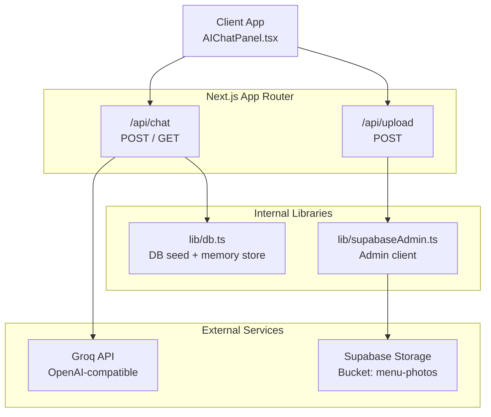
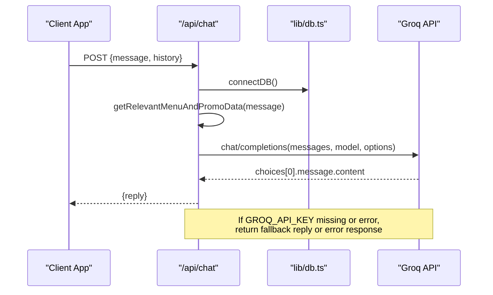
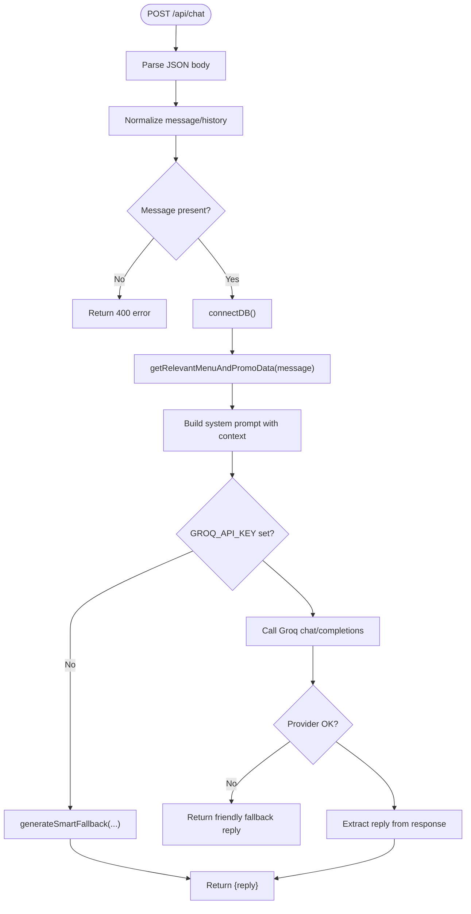
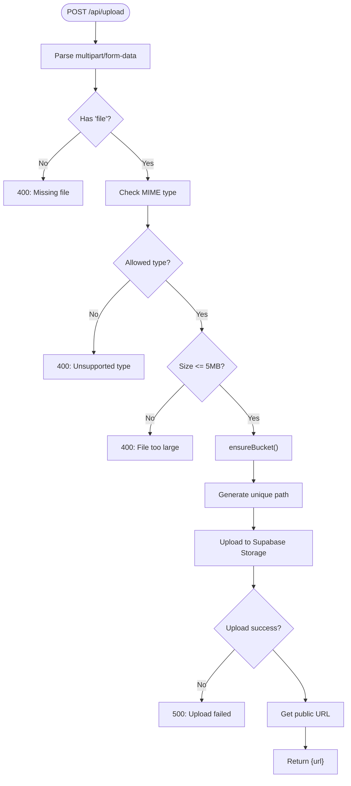
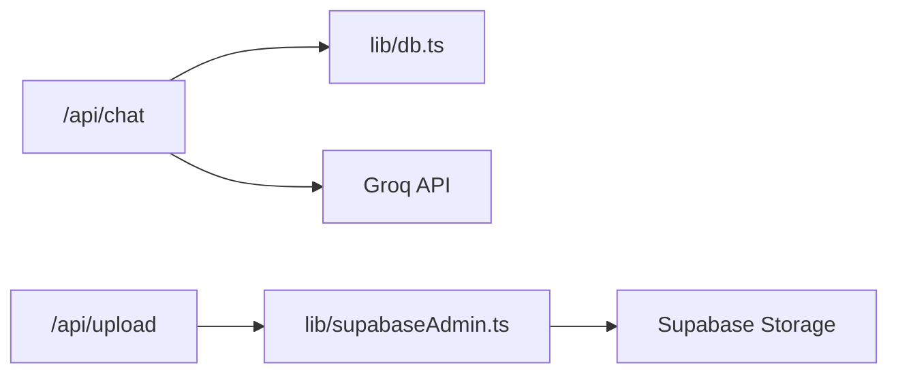

# Utility Endpoints

<cite>
**Referenced Files in This Document**
- [route.ts](file://app\api\chat\route.ts)
- [route.ts](file://app\api\upload\route.ts)
- [db.ts](file://lib\db.ts)
- [supabaseAdmin.ts](file://lib\supabaseAdmin.ts)
- [AIChatPanel.tsx](file://components\AIChatPanel.tsx)
</cite>

## Table of Contents
1. [Introduction](#introduction)
2. [Project Structure](#project-structure)
3. [Core Components](#core-components)
4. [Architecture Overview](#architecture-overview)
5. [Detailed Component Analysis](#detailed-component-analysis)
6. [Dependency Analysis](#dependency-analysis)
7. [Performance Considerations](#performance-considerations)
8. [Troubleshooting Guide](#troubleshooting-guide)
9. [Conclusion](#conclusion)

## Introduction
This document provides API documentation for the utility and support endpoints exposed by the application:
- AI chat integration endpoint for message handling, context management, and diagnostics.
- File upload endpoint for image processing, storage management, and file validation.

The chat endpoint integrates with an external AI provider (Groq) to generate contextual replies based on menu, promotions, and coupons data. The upload endpoint stores images into a public Supabase Storage bucket after validating content type and size.

## Project Structure
The relevant API routes are implemented as Next.js App Router route handlers under `app/api`:
- Chat integration: `app/api/chat/route.ts`
- File upload: `app/api/upload/route.ts`

Supporting libraries:
- Database seeding and memory fallback: `lib/db.ts`
- Supabase admin client: `lib/supabaseAdmin.ts`
- Client-side chat UI that calls `/api/chat`: `components/AIChatPanel.tsx`

**Diagram sources**
- [route.ts:316-409](file://app\api\chat\route.ts#L316-L409)
- [route.ts:33-73](file://app\api\upload\route.ts#L33-L73)
- [db.ts:40-50](file://lib\db.ts#L40-L50)
- [supabaseAdmin.ts:6-21](file://lib\supabaseAdmin.ts#L6-L21)
- [AIChatPanel.tsx:96-125](file://components\AIChatPanel.tsx#L96-L125)

**Section sources**
- [route.ts:316-409](file://app\api\chat\route.ts#L316-L409)
- [route.ts:33-73](file://app\api\upload\route.ts#L33-L73)
- [db.ts:40-50](file://lib\db.ts#L40-L50)
- [supabaseAdmin.ts:6-21](file://lib\supabaseAdmin.ts#L6-L21)
- [AIChatPanel.tsx:96-125](file://components\AIChatPanel.tsx#L96-L125)

## Core Components
- Chat Integration Endpoint (`/api/chat`)
  - POST: Accepts a user message and optional conversation history; returns a single reply.
  - GET: Diagnostics endpoint to verify AI provider configuration and connectivity.
- File Upload Endpoint (`/api/upload`)
  - POST: Validates and uploads an image file to Supabase Storage; returns a public URL.

Key responsibilities:
- Context enrichment for AI responses using menu, promo, and coupon data.
- Secure server-side proxying of AI requests to Groq.
- Image validation (type and size), safe path generation, and storage operations.

**Section sources**
- [route.ts:316-409](file://app\api\chat\route.ts#L316-L409)
- [route.ts:33-73](file://app\api\upload\route.ts#L33-L73)

## Architecture Overview
The chat endpoint enriches user queries with business data before calling the AI provider. It supports both legacy and current request formats and includes a fallback responder when the AI key is missing or the provider fails. The upload endpoint enforces strict validation and uses a server-only Supabase admin client to create or ensure a public bucket exists before uploading files.

**Diagram sources**
- [route.ts:316-409](file://app\api\chat\route.ts#L316-L409)
- [db.ts:40-50](file://lib\db.ts#L40-L50)

## Detailed Component Analysis

### Chat Integration API (`/api/chat`)
- Purpose: Provide an AI-powered assistant that answers questions about menu items, promotions, coupons, ordering process, hours, and location.
- Methods:
  - POST `/api/chat`
  - GET `/api/chat` (diagnostics)

#### Request Schemas

- POST `/api/chat`
  - Content-Type: `application/json`
  - Body fields:
    - `message` (string, required): User’s latest message.
    - `history` (array of objects, optional): Conversation history used to build context.
      - Each object:
        - `role` (enum: "user" | "assistant"): Role of the message.
        - `content` (string): Message text.
  - Legacy format supported:
    - `messages` (array of objects): If present, the last item is treated as the current user message; preceding items become history.

- GET `/api/chat`
  - No body. Returns diagnostic status about the AI provider configuration and connectivity.

#### Response Schemas

- POST `/api/chat`
  - Success:
    - `reply` (string): Assistant’s response.
  - Error:
    - `error` (string): Validation error (e.g., missing message).
    - HTTP status codes:
      - 400: Missing or empty message.
      - 500: Provider error or unexpected failure.

- GET `/api/chat`
  - Success:
    - `status` (string): "connected" when provider responds successfully.
    - `connected` (boolean): True if connected.
    - `model` (string): Model identifier used.
    - `provider` (string): Provider name ("Groq").
    - `message` (string): Human-readable status.
  - Failure:
    - `status` (string): "no_api_key", "api_error", or "network_error".
    - `connected` (boolean): False.
    - Additional fields vary by error (e.g., `httpStatus`, `detail`, `fix`).

#### Processing Logic
- Input normalization:
  - Supports both `{ message, history }` and legacy `{ messages }`.
  - Trims whitespace from the user message.
- Context enrichment:
  - Queries database for active menu items, promos, and coupons.
  - Falls back to in-memory static data if database access fails.
- System prompt injection:
  - Builds a system prompt with enriched context data.
- AI provider call:
  - Uses server-side environment variable for API key.
  - Sends OpenAI-compatible payload to Groq.
  - Applies timeout and temperature settings.
- Fallback behavior:
  - If API key is missing, returns a smart local fallback response.
  - On provider errors or timeouts, returns friendly fallback replies.

**Diagram sources**
- [route.ts:316-409](file://app\api\chat\route.ts#L316-L409)

#### Security Considerations
- API key exposure:
  - The Groq API key is read from server-side environment variables and never sent to clients.
- Input validation:
  - Requires non-empty message.
  - History roles are normalized to "user"/"assistant".
- Error handling:
  - Provider errors and timeouts return safe fallback replies rather than raw error details.

**Section sources**
- [route.ts:316-409](file://app\api\chat\route.ts#L316-L409)
- [db.ts:40-50](file://lib\db.ts#L40-L50)

### File Upload API (`/api/upload`)
- Purpose: Accept image uploads, validate them, and store them in a public Supabase Storage bucket.
- Method:
  - POST `/api/upload`

#### Request Schema
- Content-Type: `multipart/form-data`
- Form field:
  - `file` (File, required): Image file to upload.
- Allowed MIME types:
  - `image/jpeg`, `image/jpg`, `image/png`, `image/webp`, `image/gif`
- Size limit:
  - Maximum 5 MB per file.

#### Response Schema
- Success:
  - `url` (string): Public URL of the uploaded image.
- Error:
  - `error` (string): Descriptive error message.
  - HTTP status codes:
    - 400: Missing file, unsupported type, or file too large.
    - 500: Storage upload failure or unexpected error.

#### Processing Logic
- Form parsing:
  - Reads `file` from form data.
- Validation:
  - Ensures the uploaded value is a File instance.
  - Checks MIME type against allowed list.
  - Enforces maximum file size.
- Storage setup:
  - Ensures the target bucket exists; creates it with public access and configured limits if needed.
- Upload:
  - Generates a unique path using timestamp and UUID.
  - Converts file to buffer and uploads via Supabase admin client.
- Response:
  - Retrieves and returns the public URL.

**Diagram sources**
- [route.ts:33-73](file://app\api\upload\route.ts#L33-L73)

#### Security Considerations
- Strict MIME type allowlist prevents execution of non-image content.
- Server-side size enforcement protects against resource exhaustion.
- Bucket creation sets public access intentionally; ensure this aligns with privacy requirements.
- Admin client uses secret credentials; never expose these keys to the client.

**Section sources**
- [route.ts:33-73](file://app\api\upload\route.ts#L33-L73)
- [supabaseAdmin.ts:6-21](file://lib\supabaseAdmin.ts#L6-L21)

## Dependency Analysis
- Chat endpoint dependencies:
  - Database utilities for seeding and memory fallback.
  - External AI provider (Groq) via HTTP fetch.
- Upload endpoint dependencies:
  - Supabase admin client for storage operations.
  - Environment variables for Supabase URL and secret key.

**Diagram sources**
- [route.ts:316-409](file://app\api\chat\route.ts#L316-L409)
- [route.ts:33-73](file://app\api\upload\route.ts#L33-L73)
- [db.ts:40-50](file://lib\db.ts#L40-L50)
- [supabaseAdmin.ts:6-21](file://lib\supabaseAdmin.ts#L6-L21)

**Section sources**
- [route.ts:316-409](file://app\api\chat\route.ts#L316-L409)
- [route.ts:33-73](file://app\api\upload\route.ts#L33-L73)
- [db.ts:40-50](file://lib\db.ts#L40-L50)
- [supabaseAdmin.ts:6-21](file://lib\supabaseAdmin.ts#L6-L21)

## Performance Considerations
- Chat endpoint:
  - Context enrichment queries may be expensive; consider caching frequently accessed menu/promo/coupon data.
  - Provider calls include timeouts to prevent long-running requests.
  - History trimming limits context size to reduce token usage and latency.
- Upload endpoint:
  - In-memory flag avoids repeated bucket existence checks within a process lifetime.
  - Buffer conversion ensures compatibility with storage APIs but increases memory usage; consider streaming for very large files if limits increase.

[No sources needed since this section provides general guidance]

## Troubleshooting Guide
- Chat endpoint issues:
  - Missing API key: Use GET `/api/chat` to diagnose; follow the provided fix instructions.
  - Provider errors: Check rate limits, quotas, and network connectivity; fallback replies are returned instead of raw errors.
  - Timeouts: Requests to the provider have a timeout; retry or simplify prompts.
- Upload endpoint issues:
  - Invalid MIME type: Ensure the client sends one of the allowed image types.
  - File too large: Enforce 5 MB limit on the client side to avoid unnecessary server errors.
  - Storage failures: Verify Supabase credentials and bucket permissions; check logs for detailed errors.

**Section sources**
- [route.ts:415-474](file://app\api\chat\route.ts#L415-L474)
- [route.ts:33-73](file://app\api\upload\route.ts#L33-L73)

## Conclusion
The utility endpoints provide essential capabilities for AI-assisted customer interactions and secure image storage:
- `/api/chat` offers a robust, context-aware chat interface with fallbacks and diagnostics.
- `/api/upload` enforces strict validation and integrates safely with Supabase Storage.

For production deployments, consider adding rate limiting, enhanced input sanitization, and more granular error reporting while maintaining security best practices for secrets and public assets.

[No sources needed since this section summarizes without analyzing specific files]