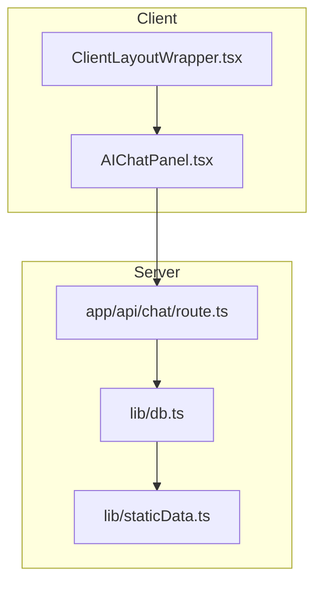
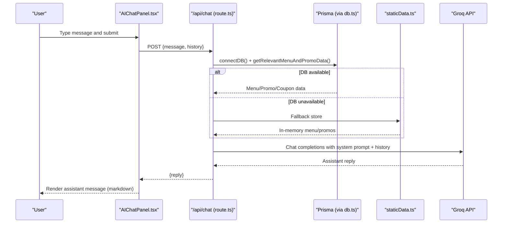
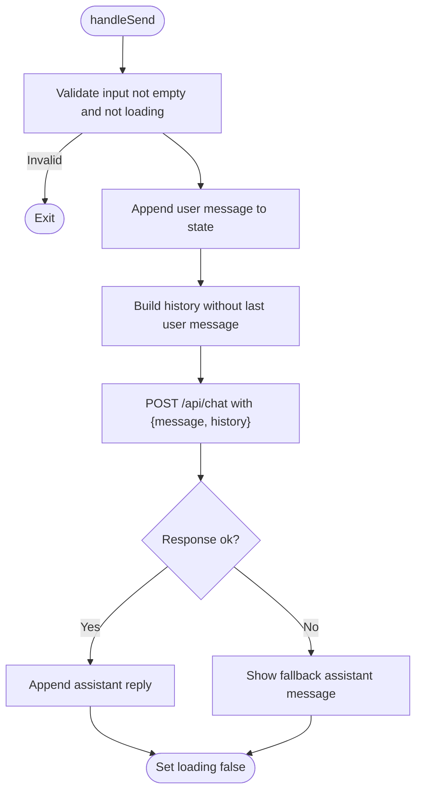
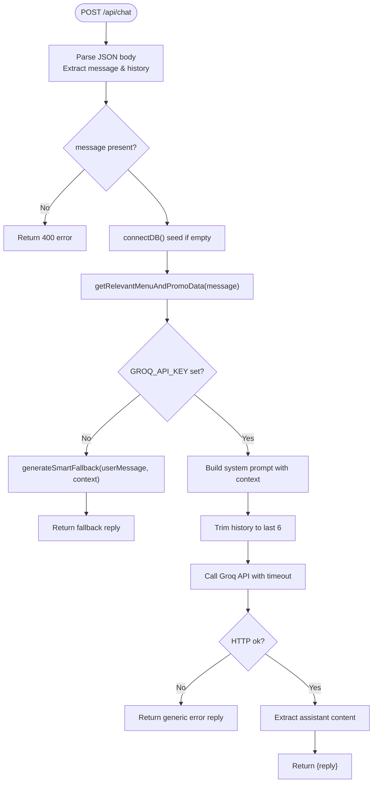
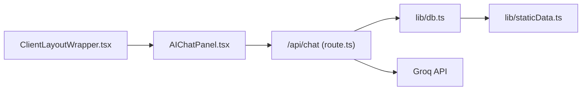

# AI Chat Integration

<cite>
**Referenced Files in This Document**
- [AIChatPanel.tsx](file://components/AIChatPanel.tsx)
- [ClientLayoutWrapper.tsx](file://components/ClientLayoutWrapper.tsx)
- [route.ts](file://app/api/chat/route.ts)
- [db.ts](file://lib/db.ts)
- [staticData.ts](file://lib/staticData.ts)
</cite>

## Table of Contents
1. [Introduction](#introduction)
2. [Project Structure](#project-structure)
3. [Core Components](#core-components)
4. [Architecture Overview](#architecture-overview)
5. [Detailed Component Analysis](#detailed-component-analysis)
6. [Dependency Analysis](#dependency-analysis)
7. [Performance Considerations](#performance-considerations)
8. [Troubleshooting Guide](#troubleshooting-guide)
9. [Conclusion](#conclusion)

## Introduction
This document explains the AI chat integration for a customer support chatbot used by a restaurant ordering system. It covers:
- The slide-over chat interface (AIChatPanel) and its message handling flow
- The server-side API endpoint that processes messages, maintains conversation history, and generates context-aware responses
- Context retrieval from database or static data, prompt construction, and fallback mechanisms when AI services are unavailable
- Markdown rendering for formatted assistant responses
- Error handling strategies, user experience considerations, and performance optimizations

Note: While the repository includes Google Generative AI packages, the active runtime uses Groq’s OpenAI-compatible API with a system prompt to constrain responses to restaurant-specific data.

## Project Structure
The AI chat feature spans client components, layout wiring, and a Next.js API route:
- Client UI: Slide-over panel with message list, input, and markdown rendering
- Layout integration: Toggles panel visibility and mounts it on public pages
- Server API: Processes messages, builds context, calls external AI provider, and returns replies
- Data layer: Prisma-based menu/promo/coupon data with an in-memory fallback

**Diagram sources**
- [ClientLayoutWrapper.tsx:11-40](file://components/ClientLayoutWrapper.tsx#L11-L40)
- [AIChatPanel.tsx:57-128](file://components/AIChatPanel.tsx#L57-L128)
- [route.ts:316-409](file://app/api/chat/route.ts#L316-L409)
- [db.ts:22-50](file://lib/db.ts#L22-L50)
- [staticData.ts:17-141](file://lib/staticData.ts#L17-L141)

**Section sources**
- [ClientLayoutWrapper.tsx:11-40](file://components/ClientLayoutWrapper.tsx#L11-L40)
- [AIChatPanel.tsx:57-128](file://components/AIChatPanel.tsx#L57-L128)
- [route.ts:316-409](file://app/api/chat/route.ts#L316-L409)
- [db.ts:22-50](file://lib/db.ts#L22-L50)
- [staticData.ts:17-141](file://lib/staticData.ts#L17-L141)

## Core Components
- AIChatPanel (client): Manages open/close state, message history, input, loading indicator, auto-scroll, focus behavior, and renders assistant messages with lightweight markdown.
- ClientLayoutWrapper (client): Mounts AIChatPanel on non-admin routes and toggles visibility via header interaction.
- /api/chat (server): Validates input, seeds DB if needed, fetches relevant menu/promo/coupon data, constructs a system prompt, calls Groq API, and returns a reply with robust fallbacks.

Key responsibilities:
- UI: Real-time conversation management, slide-over panel UX, markdown formatting
- API: Context-aware response generation, conversation history trimming, error/fallback handling
- Data: Dynamic context injection from Prisma with static fallback

**Section sources**
- [AIChatPanel.tsx:57-128](file://components/AIChatPanel.tsx#L57-L128)
- [ClientLayoutWrapper.tsx:11-40](file://components/ClientLayoutWrapper.tsx#L11-L40)
- [route.ts:316-409](file://app/api/chat/route.ts#L316-L409)

## Architecture Overview
End-to-end flow from user input to assistant reply:

**Diagram sources**
- [AIChatPanel.tsx:84-128](file://components/AIChatPanel.tsx#L84-L128)
- [route.ts:316-409](file://app/api/chat/route.ts#L316-L409)
- [db.ts:40-50](file://lib/db.ts#L40-L50)
- [staticData.ts:17-141](file://lib/staticData.ts#L17-L141)

## Detailed Component Analysis

### AIChatPanel Component
Responsibilities:
- State: messages array, input text, loading flag
- Effects: auto-scroll to latest message; focus input on open
- Send flow: append user message, build history, call /api/chat, append assistant reply, handle errors
- Rendering: slide-over panel, backdrop, message bubbles, typing indicator, markdown renderer for bold and bullet lists

UX highlights:
- Slide-in animation and backdrop click-to-close
- Auto-scrolling and focus management
- Typing indicator while waiting for server
- Lightweight markdown: supports bold (**text**) and bullet lists (- item)

Error handling:
- Network or server errors show a friendly fallback message
- Loading disabled during requests to prevent duplicate submissions

**Diagram sources**
- [AIChatPanel.tsx:84-128](file://components/AIChatPanel.tsx#L84-L128)

**Section sources**
- [AIChatPanel.tsx:16-55](file://components/AIChatPanel.tsx#L16-L55)
- [AIChatPanel.tsx:57-128](file://components/AIChatPanel.tsx#L57-L128)
- [AIChatPanel.tsx:132-232](file://components/AIChatPanel.tsx#L132-L232)

### ClientLayoutWrapper Integration
Responsibilities:
- Maintain isAiOpen state and mount AIChatPanel only after client hydration
- Hide AI panel on admin routes
- Wire header toggle to open/close the chat panel

Behavior:
- Renders AIChatPanel conditionally based on isMounted and isAiOpen
- Prevents server/client mismatch by deferring mount until after first render

**Section sources**
- [ClientLayoutWrapper.tsx:11-40](file://components/ClientLayoutWrapper.tsx#L11-L40)

### API Endpoint (/api/chat)
Responsibilities:
- Input validation and legacy format support
- Database seeding and connection
- Context retrieval: dynamic Prisma queries with keyword matching, then fallback to in-memory static data
- System prompt construction with injected context
- External AI provider call (Groq) with timeout and error handling
- Smart fallback responder when API key missing or provider fails

Processing logic:
- Extract userMessage and history from request body
- Ensure DB seeded via connectDB()
- Fetch relevant menu/promo/coupon data using getRelevantMenuAndPromoData()
- Inject context into SYSTEM_PROMPT_TEMPLATE
- If GROQ_API_KEY missing, return smart fallback response
- Trim history to last 6 messages, build messages array with system role
- Call Groq API with model, temperature, max_tokens, and AbortSignal timeout
- Handle HTTP errors and timeouts gracefully

**Diagram sources**
- [route.ts:316-409](file://app/api/chat/route.ts#L316-L409)
- [route.ts:54-205](file://app/api/chat/route.ts#L54-L205)
- [route.ts:209-314](file://app/api/chat/route.ts#L209-L314)

**Section sources**
- [route.ts:316-409](file://app/api/chat/route.ts#L316-L409)
- [route.ts:54-205](file://app/api/chat/route.ts#L54-L205)
- [route.ts:209-314](file://app/api/chat/route.ts#L209-L314)

### Context Retrieval and Prompt Engineering
Context retrieval:
- Keyword extraction from user message
- Prisma search across name, description, category with OR conditions
- Fallback to all active items if no matches
- Active promos and coupons filtered by validity period
- On DB failure, use in-memory static store snapshot

Prompt engineering:
- System prompt defines persona, rules, and constraints for restaurant Q&A
- Context data injected as structured JSON containing menu, promos, and coupons
- Smart fallback responder provides deterministic answers for common intents (recommendations, promos, coupons, menu overview, spice levels, ordering steps, hours/location)

Examples of prompt-driven behaviors:
- Restaurant-specific queries: Uses system rules to answer about hours, location, ordering process
- Menu recommendations: Highlights best sellers/chef’s choice or top items
- Promotional information: Lists active promos with savings and instructions
- Coupon guidance: Shows active coupons with discount type and usage instructions

**Section sources**
- [route.ts:16-51](file://app/api/chat/route.ts#L16-L51)
- [route.ts:54-205](file://app/api/chat/route.ts#L54-L205)
- [route.ts:209-314](file://app/api/chat/route.ts#L209-L314)

### Data Layer and Fallbacks
Database utilities:
- connectDB ensures initial seeding once per process lifetime
- getMemoryStore returns a static snapshot of categories, menu items, promos, settings

Static data:
- Initial menu items include categories, descriptions, prices, badges, spice levels, add-ons
- Promos and settings provide baseline data for fallback scenarios

Failing over to static data:
- When Prisma queries fail, the API falls back to in-memory store to construct context and generate smart fallback responses

**Section sources**
- [db.ts:22-50](file://lib/db.ts#L22-L50)
- [staticData.ts:17-141](file://lib/staticData.ts#L17-L141)

## Dependency Analysis
Component relationships:
- ClientLayoutWrapper depends on AIChatPanel to render the chat UI
- AIChatPanel depends on /api/chat for message processing
- /api/chat depends on lib/db for DB seeding and static fallback
- /api/chat depends on lib/staticData for in-memory data when DB is unavailable
- External dependency: Groq API for LLM inference

**Diagram sources**
- [ClientLayoutWrapper.tsx:11-40](file://components/ClientLayoutWrapper.tsx#L11-L40)
- [AIChatPanel.tsx:57-128](file://components/AIChatPanel.tsx#L57-L128)
- [route.ts:316-409](file://app/api/chat/route.ts#L316-L409)
- [db.ts:22-50](file://lib/db.ts#L22-L50)
- [staticData.ts:17-141](file://lib/staticData.ts#L17-L141)

**Section sources**
- [ClientLayoutWrapper.tsx:11-40](file://components/ClientLayoutWrapper.tsx#L11-L40)
- [AIChatPanel.tsx:57-128](file://components/AIChatPanel.tsx#L57-L128)
- [route.ts:316-409](file://app/api/chat/route.ts#L316-L409)
- [db.ts:22-50](file://lib/db.ts#L22-L50)
- [staticData.ts:17-141](file://lib/staticData.ts#L17-L141)

## Performance Considerations
- History trimming: Only the last 6 messages are sent to the provider to reduce payload size and token costs
- Timeout protection: AbortSignal.timeout prevents long-running requests from hanging the UI
- Context minimization: Keyword-based Prisma queries limit returned rows; fallback to small static snapshots when necessary
- Client-side rendering: Lightweight markdown avoids heavy libraries; only bold and bullets are supported
- Debouncing/throttling: Not implemented; consider adding debounce on input to avoid excessive re-renders
- Caching: No explicit caching of AI responses; consider server-side memoization for repeated queries

[No sources needed since this section provides general guidance]

## Troubleshooting Guide
Common issues and resolutions:
- Missing API key:
  - Symptom: Smart fallback responder is used instead of LLM-generated replies
  - Resolution: Set GROQ_API_KEY in environment variables and restart the dev server
- Provider errors:
  - Symptom: Generic error reply shown to users
  - Resolution: Check provider status, rate limits, and quota; verify network connectivity
- Timeouts:
  - Symptom: Timeout error reply displayed
  - Resolution: Investigate provider latency; consider increasing timeout or optimizing prompts
- DB seeding failures:
  - Symptom: Fallback to static data; limited coupon info
  - Resolution: Verify database connection and permissions; check seed logs

Diagnostic endpoint:
- GET /api/chat provides connection diagnostics including API key presence and provider ping results

**Section sources**
- [route.ts:345-350](file://app/api/chat/route.ts#L345-L350)
- [route.ts:385-408](file://app/api/chat/route.ts#L385-L408)
- [route.ts:415-474](file://app/api/chat/route.ts#L415-L474)

## Conclusion
The AI chat integration combines a responsive slide-over UI with a robust server-side pipeline that injects real-time restaurant context into prompts, calls an external LLM provider, and handles failures gracefully. The design emphasizes clarity, safety, and resilience:
- Clear UX with markdown rendering and typing indicators
- Deterministic fallbacks when AI services are unavailable
- Context-aware responses grounded in current menu, promo, and coupon data
- Practical performance safeguards like history trimming and timeouts

This architecture can be extended to support additional providers, richer markdown, caching, and analytics while maintaining a consistent user experience.