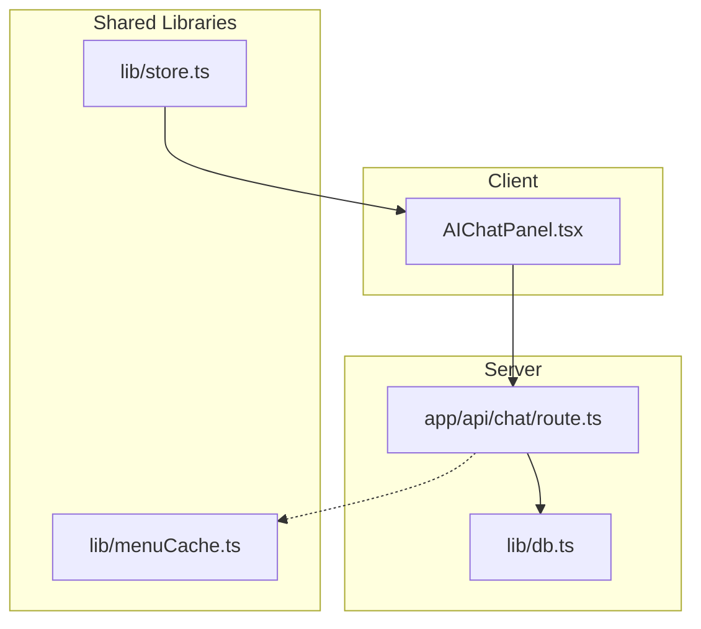
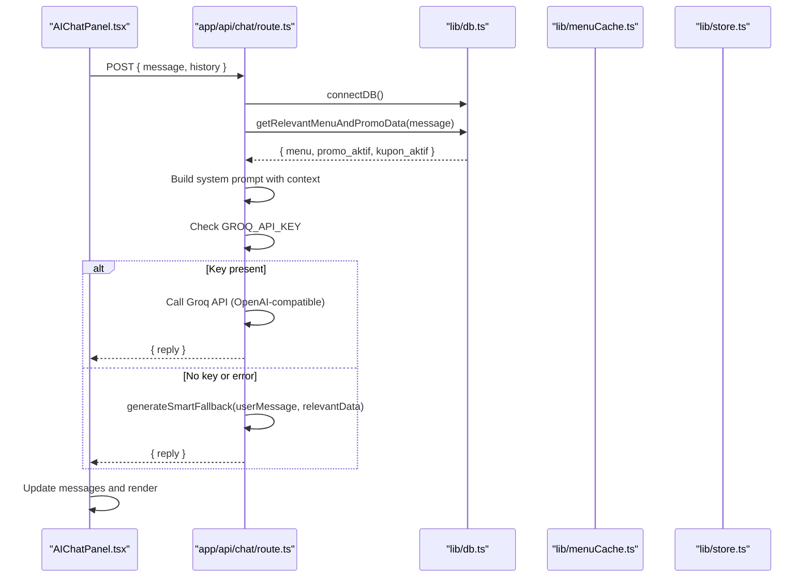
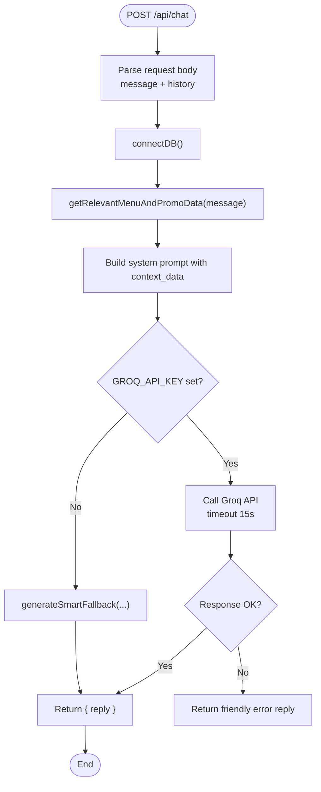
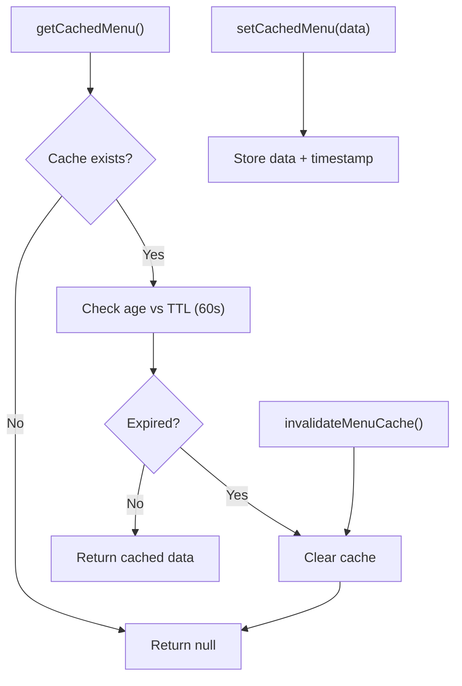
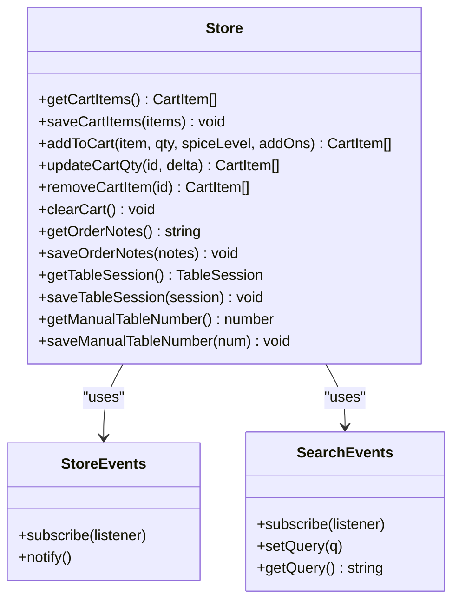
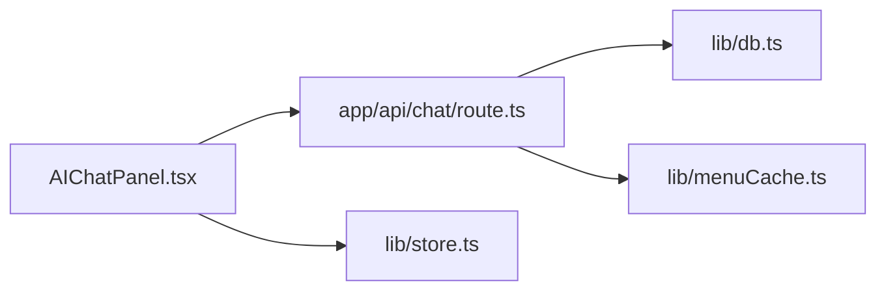

# Advanced Features

<cite>
**Referenced Files in This Document**
- [AIChatPanel.tsx](file://components/AIChatPanel.tsx)
- [route.ts](file://app/api/chat/route.ts)
- [menuCache.ts](file://lib/menuCache.ts)
- [store.ts](file://lib/store.ts)
- [db.ts](file://lib/db.ts)
- [package.json](file://package.json)
</cite>

## Table of Contents
1. [Introduction](#introduction)
2. [Project Structure](#project-structure)
3. [Core Components](#core-components)
4. [Architecture Overview](#architecture-overview)
5. [Detailed Component Analysis](#detailed-component-analysis)
6. [Dependency Analysis](#dependency-analysis)
7. [Performance Considerations](#performance-considerations)
8. [Troubleshooting Guide](#troubleshooting-guide)
9. [Conclusion](#conclusion)

## Introduction
This document explains the advanced features implemented in the application with a focus on:
- AI chat integration for customer support using Groq (OpenAI-compatible API), including context-aware responses and fallback mechanisms.
- In-memory caching for menu data, cache invalidation policies, and performance optimization techniques.
- Event-driven state management via custom event emitters for cross-component communication and local storage persistence patterns.

These capabilities are designed to improve responsiveness, reliability, and user experience across the restaurant ordering system.

## Project Structure
The advanced features span client components, server routes, and shared libraries:
- Client-side chat UI: components/AIChatPanel.tsx
- Server-side chat route: app/api/chat/route.ts
- Menu caching layer: lib/menuCache.ts
- State management and persistence: lib/store.ts
- Database utilities and static fallbacks: lib/db.ts
- Dependencies indicating Google Generative AI SDK availability: package.json

**Diagram sources**
- [AIChatPanel.tsx:103-110](file://components/AIChatPanel.tsx#L103-L110)
- [route.ts:316-408](file://app/api/chat/route.ts#L316-L408)
- [db.ts:22-30](file://lib/db.ts#L22-L30)
- [menuCache.ts:24-46](file://lib/menuCache.ts#L24-L46)
- [store.ts:26-41](file://lib/store.ts#L26-L41)

**Section sources**
- [AIChatPanel.tsx:1-237](file://components/AIChatPanel.tsx#L1-L237)
- [route.ts:1-477](file://app/api/chat/route.ts#L1-L477)
- [menuCache.ts:1-47](file://lib/menuCache.ts#L1-L47)
- [store.ts:1-217](file://lib/store.ts#L1-L217)
- [db.ts:1-161](file://lib/db.ts#L1-L161)
- [package.json:1-42](file://package.json#L1-L42)

## Core Components
- AI Chat Panel (client): Manages conversation UI, sends messages to /api/chat, renders assistant replies, and handles loading states and errors.
- Chat Route (server): Builds context from database or static fallback, constructs prompts, calls Groq API, and returns safe replies with robust error handling.
- Menu Cache (server process-level): Provides an in-memory TTL-based cache for menu and categories to reduce DB roundtrips.
- Store (client): Implements event emitters for cart and search state, persists cart, notes, table session, and manual table number to localStorage.

**Section sources**
- [AIChatPanel.tsx:57-128](file://components/AIChatPanel.tsx#L57-L128)
- [route.ts:54-205](file://app/api/chat/route.ts#L54-L205)
- [menuCache.ts:9-46](file://lib/menuCache.ts#L9-L46)
- [store.ts:26-41](file://lib/store.ts#L26-L41)

## Architecture Overview
The AI chat flow integrates a React component with a Next.js API route that enriches prompts with live menu/promo/coupon data and falls back to static data when needed. The route uses Groq’s OpenAI-compatible endpoint and includes timeouts and error handling.

**Diagram sources**
- [AIChatPanel.tsx:103-125](file://components/AIChatPanel.tsx#L103-L125)
- [route.ts:316-408](file://app/api/chat/route.ts#L316-L408)
- [db.ts:40-50](file://lib/db.ts#L40-L50)

## Detailed Component Analysis

### AI Chat Integration (Groq/OpenAI-Compatible)
- Context-aware response handling:
  - Extracts keywords from the user message and queries active menu items, promos, and coupons.
  - If no keyword matches, retrieves all active menu items to ensure sufficient context.
  - Formats data into a structured payload injected into the system prompt.
- Fallback mechanisms:
  - If GROQ_API_KEY is missing, returns a deterministic smart fallback tailored to common intents (recommendations, promos, coupons, menu overview, spice levels, ordering steps, hours/location).
  - On network/API errors or timeouts, returns friendly messages guiding users to ask staff.
- Conversation history:
  - Sends trimmed history (last 6 messages) to maintain context while controlling token usage.
- Diagnostics:
  - GET /api/chat provides connection status and guidance for configuring the API key.

**Diagram sources**
- [route.ts:316-408](file://app/api/chat/route.ts#L316-L408)
- [route.ts:209-314](file://app/api/chat/route.ts#L209-L314)

**Section sources**
- [route.ts:54-205](file://app/api/chat/route.ts#L54-L205)
- [route.ts:316-408](file://app/api/chat/route.ts#L316-L408)
- [route.ts:415-474](file://app/api/chat/route.ts#L415-L474)

### In-Memory Caching for Menu Data
- Purpose: Reduce redundant database reads for high-frequency public menu/category endpoints by serving cached data within a short TTL.
- Implementation:
  - Stores menuItems and categories with a timestamp.
  - TTL of 60 seconds; stale entries are cleared automatically.
  - Exposes functions to read, write, and invalidate cache.
- Invalidations:
  - Intended to be invalidated on any menu or category mutation to keep cache consistent.
- Performance:
  - Expected latency reduction from ~300ms to <10ms for repeated reads during stable periods.

**Diagram sources**
- [menuCache.ts:24-46](file://lib/menuCache.ts#L24-L46)

**Section sources**
- [menuCache.ts:1-47](file://lib/menuCache.ts#L1-L47)

### Event-Driven State Management and Local Storage Persistence
- Custom event emitters:
  - StoreEvents: Simple pub/sub for reactive updates across components (e.g., cart changes).
  - SearchEvents: Emits current search query to subscribers and supports setting/getting query state.
- Local storage persistence:
  - Cart items, order notes, table session, and manually entered table number are persisted to localStorage.
  - All mutations notify listeners to trigger UI updates without prop drilling.
- Safety and validation:
  - Cart retrieval performs strict sanitization to avoid runtime errors from malformed data.
  - Graceful fallbacks for undefined window environment (SSR safety).

**Diagram sources**
- [store.ts:26-65](file://lib/store.ts#L26-L65)
- [store.ts:67-217](file://lib/store.ts#L67-L217)

**Section sources**
- [store.ts:1-217](file://lib/store.ts#L1-L217)

### Google Generative AI SDK Presence
- The project includes @google/genai and @google/generative-ai dependencies, indicating readiness to integrate Google Generative AI if desired.
- Current implementation uses Groq’s OpenAI-compatible endpoint; switching providers would involve updating the server route’s HTTP call and configuration.

**Section sources**
- [package.json:14-15](file://package.json#L14-L15)

## Dependency Analysis
- Client-to-server:
  - AIChatPanel.tsx calls /api/chat with message and history.
- Server-side logic:
  - app/api/chat/route.ts orchestrates DB seeding, context retrieval, prompt construction, provider call, and fallbacks.
  - lib/db.ts provides database connectivity and static fallback store via getMemoryStore().
- Shared libraries:
  - lib/menuCache.ts provides process-scoped cache for menu data.
  - lib/store.ts manages client-side state and persistence.

**Diagram sources**
- [AIChatPanel.tsx:103-110](file://components/AIChatPanel.tsx#L103-L110)
- [route.ts:316-408](file://app/api/chat/route.ts#L316-L408)
- [db.ts:22-30](file://lib/db.ts#L22-L30)
- [menuCache.ts:24-46](file://lib/menuCache.ts#L24-L46)
- [store.ts:26-41](file://lib/store.ts#L26-L41)

**Section sources**
- [AIChatPanel.tsx:103-125](file://components/AIChatPanel.tsx#L103-L125)
- [route.ts:316-408](file://app/api/chat/route.ts#L316-L408)
- [db.ts:22-30](file://lib/db.ts#L22-L30)
- [menuCache.ts:24-46](file://lib/menuCache.ts#L24-L46)
- [store.ts:26-41](file://lib/store.ts#L26-L41)

## Performance Considerations
- AI Chat:
  - Trimmed conversation history reduces token usage and latency.
  - Timeout protection prevents hanging requests.
  - Deterministic fallback ensures responsiveness even when external APIs are unavailable.
- Menu Cache:
  - Short TTL balances freshness and performance.
  - Immediate invalidation on mutations avoids stale data.
- State Management:
  - Event-driven updates decouple components and minimize re-renders.
  - Local storage persistence avoids unnecessary recomputation and improves perceived performance.

[No sources needed since this section provides general guidance]

## Troubleshooting Guide
- AI Chat not responding:
  - Verify GROQ_API_KEY is configured; use GET /api/chat diagnostics to check connectivity.
  - If key is missing, expect smart fallback responses.
  - Network errors or timeouts return friendly messages; retry after a moment.
- Menu cache inconsistencies:
  - Ensure cache invalidation is triggered on menu/category mutations.
  - Confirm TTL settings align with update frequency.
- Cart state issues:
  - Check localStorage keys for corruption; store functions include sanitization.
  - Use store events to debug cross-component updates.

**Section sources**
- [route.ts:415-474](file://app/api/chat/route.ts#L415-L474)
- [menuCache.ts:24-46](file://lib/menuCache.ts#L24-L46)
- [store.ts:67-91](file://lib/store.ts#L67-L91)

## Conclusion
The application implements a robust AI chat feature with context-aware responses and resilient fallbacks, an efficient in-memory cache for menu data with clear invalidation strategies, and a clean event-driven state management layer backed by local storage. These components collectively enhance responsiveness, reliability, and user experience while maintaining clear separation of concerns and extensibility for future integrations such as Google Generative AI.

[No sources needed since this section summarizes without analyzing specific files]