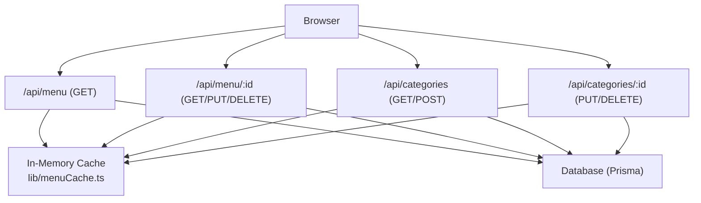
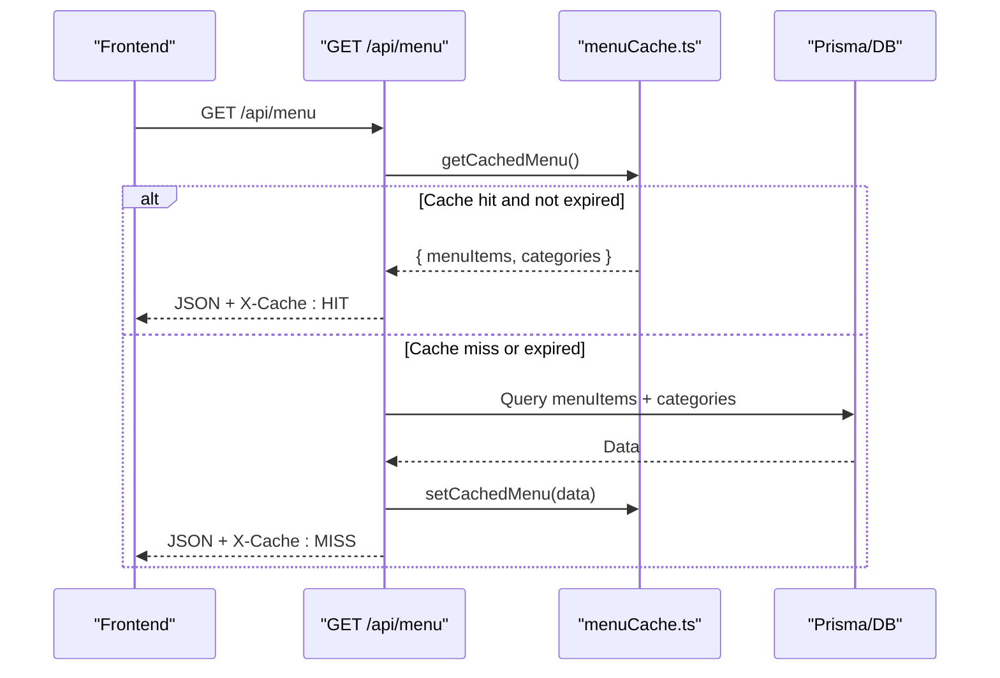
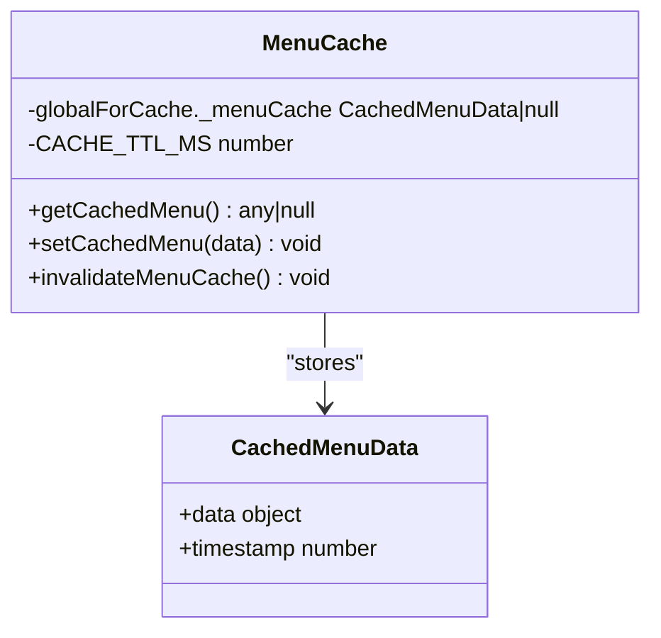
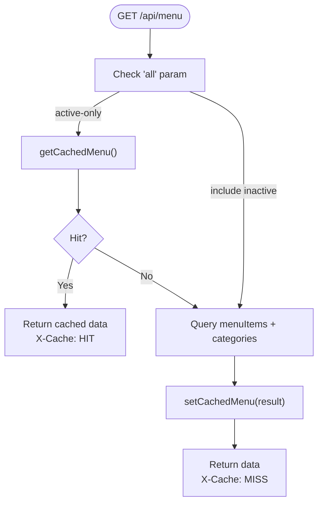
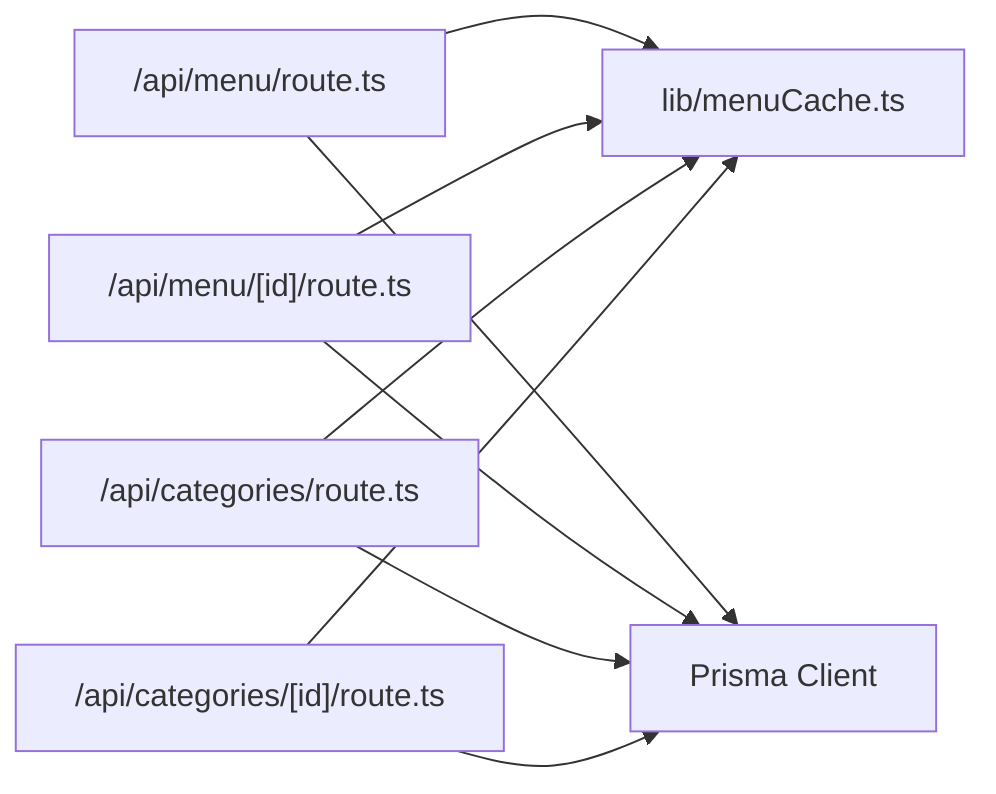

# Caching Strategy

<cite>
**Referenced Files in This Document**
- [menuCache.ts](file://lib/menuCache.ts)
- [route.ts](file://app/api/menu/route.ts)
- [route.ts](file://app/api/menu/[id]/route.ts)
- [route.ts](file://app/api/categories/route.ts)
- [route.ts](file://app/api/categories/[id]/route.ts)
- [page.tsx](file://app/menu/page.tsx)
</cite>

## Table of Contents
1. [Introduction](#introduction)
2. [Project Structure](#project-structure)
3. [Core Components](#core-components)
4. [Architecture Overview](#architecture-overview)
5. [Detailed Component Analysis](#detailed-component-analysis)
6. [Dependency Analysis](#dependency-analysis)
7. [Performance Considerations](#performance-considerations)
8. [Troubleshooting Guide](#troubleshooting-guide)
9. [Conclusion](#conclusion)

## Introduction
This document explains the in-memory caching strategy used to accelerate public menu and category reads. The cache is a process-scoped, time-bounded store that reduces database roundtrips for high-frequency GET requests. It is integrated into the Next.js API routes for menu and categories, with automatic invalidation on mutations.

Key goals:
- Reduce latency for public menu listing by serving from memory when possible.
- Keep data fresh via TTL and immediate invalidation on writes.
- Provide clear integration points between API routes, cache, and database layers.

## Project Structure
The caching implementation spans a small set of files:
- Cache module: lib/menuCache.ts
- Menu API route: app/api/menu/route.ts
- Single-item menu API route: app/api/menu/[id]/route.ts
- Category API routes: app/api/categories/route.ts and app/api/categories/[id]/route.ts
- Frontend consumer: app/menu/page.tsx (calls /api/menu)

**Diagram sources**
- [route.ts:1-109](file://app/api/menu/route.ts#L1-L109)
- [route.ts:1-81](file://app/api/menu/[id]/route.ts#L1-L81)
- [route.ts:1-47](file://app/api/categories/route.ts#L1-L47)
- [route.ts:1-53](file://app/api/categories/[id]/route.ts#L1-L53)
- [menuCache.ts:1-47](file://lib/menuCache.ts#L1-L47)

**Section sources**
- [menuCache.ts:1-47](file://lib/menuCache.ts#L1-L47)
- [route.ts:1-109](file://app/api/menu/route.ts#L1-L109)
- [route.ts:1-81](file://app/api/menu/[id]/route.ts#L1-L81)
- [route.ts:1-47](file://app/api/categories/route.ts#L1-L47)
- [route.ts:1-53](file://app/api/categories/[id]/route.ts#L1-L53)

## Core Components
- In-memory cache module:
  - Provides get, set, and invalidate operations for menu and categories.
  - Uses a process-global variable to hold cached data.
  - Enforces a TTL of 60 seconds; expired entries are treated as misses.
- API route integration:
  - GET /api/menu checks the cache first for active-only views.
  - On cache miss or when including inactive items, it queries the database and caches the result for active-only views.
  - Mutations (create/update/delete) on menu and categories call the cache invalidation function.

Responsibilities:
- menuCache.ts: pure cache logic and TTL enforcement.
- API routes: orchestrate cache usage and database access.
- Frontend: consumes /api/menu and benefits from cache hits transparently.

**Section sources**
- [menuCache.ts:9-46](file://lib/menuCache.ts#L9-L46)
- [route.ts:7-65](file://app/api/menu/route.ts#L7-L65)
- [route.ts:67-108](file://app/api/menu/route.ts#L67-L108)
- [route.ts:22-63](file://app/api/menu/[id]/route.ts#L22-L63)
- [route.ts:65-80](file://app/api/menu/[id]/route.ts#L65-L80)
- [route.ts:20-46](file://app/api/categories/route.ts#L20-L46)
- [route.ts:6-32](file://app/api/categories/[id]/route.ts#L6-L32)
- [route.ts:34-52](file://app/api/categories/[id]/route.ts#L34-L52)

## Architecture Overview
The cache sits between the API layer and the database. Public GET /api/menu attempts to serve from memory first. If unavailable or stale, it falls back to Prisma queries and then populates the cache for subsequent requests. All write endpoints invalidate the cache so consumers see updated data quickly.

**Diagram sources**
- [route.ts:7-65](file://app/api/menu/route.ts#L7-L65)
- [menuCache.ts:24-42](file://lib/menuCache.ts#L24-L42)

## Detailed Component Analysis

### Cache Module: lib/menuCache.ts
Design:
- A simple interface defines the shape of cached data: an object containing menuItems and categories arrays, plus a timestamp.
- A global variable holds the current cache entry.
- TTL is enforced at read time: if the age exceeds 60 seconds, the entry is cleared and treated as a miss.
- Exposed functions:
  - getCachedMenu(): returns cached data or null.
  - setCachedMenu(data): stores data with current timestamp.
  - invalidateMenuCache(): clears the cache.

Memory management:
- Process-scoped storage means one cache instance per Node.js process.
- No explicit size limit or eviction policy beyond TTL and manual invalidation.
- Data references are held in memory until replaced or invalidated.

Complexity:
- Read/write/invalidate are O(1).
- Memory usage grows with the size of the cached payload; typical payloads are small lists of menu items and categories.

Error handling:
- No exceptions thrown by cache methods; they return null on miss/expiry.

**Diagram sources**
- [menuCache.ts:9-46](file://lib/menuCache.ts#L9-L46)

**Section sources**
- [menuCache.ts:1-47](file://lib/menuCache.ts#L1-L47)

### Menu List API: app/api/menu/route.ts
Behavior:
- GET /api/menu:
  - Reads optional query parameter all=true to include inactive items.
  - For active-only view, checks the cache first.
  - On cache hit, responds immediately with X-Cache: HIT and sets CDN-friendly headers.
  - On cache miss, queries both menuItems and categories concurrently using Prisma, then caches the result for active-only view.
  - Responds with X-Cache: MISS on database-backed responses.
- POST /api/menu:
  - Validates input fields and creates a new menu item.
  - Invalidates the cache after successful creation.

Integration:
- Uses connectDB before DB access.
- Leverages getCachedMenu/setCachedMenu/invalidateMenuCache from the cache module.

**Diagram sources**
- [route.ts:7-65](file://app/api/menu/route.ts#L7-L65)

**Section sources**
- [route.ts:7-65](file://app/api/menu/route.ts#L7-L65)
- [route.ts:67-108](file://app/api/menu/route.ts#L67-L108)

### Single Item Menu API: app/api/menu/[id]/route.ts
Behavior:
- GET /api/menu/:id: fetches a single menu item by id.
- PUT /api/menu/:id: updates a menu item with partial fields; validates price and name.
- DELETE /api/menu/:id: deletes a menu item.
- Both PUT and DELETE call invalidateMenuCache() to ensure list views reflect changes.

Error handling:
- Returns 404 when Prisma reports entity not found.
- Logs errors and returns generic server error messages.

**Section sources**
- [route.ts:6-20](file://app/api/menu/[id]/route.ts#L6-L20)
- [route.ts:22-63](file://app/api/menu/[id]/route.ts#L22-L63)
- [route.ts:65-80](file://app/api/menu/[id]/route.ts#L65-L80)

### Category APIs: app/api/categories/route.ts and app/api/categories/[id]/route.ts
Behavior:
- GET /api/categories: returns all categories sorted by sortOrder.
- POST /api/categories: creates a category, auto-generates slug if missing, computes default sortOrder.
- PUT /api/categories/:id: updates name, slug, sortOrder.
- DELETE /api/categories/:id: deletes a category.
- All mutation endpoints call invalidateMenuCache() to keep menu list cache consistent.

**Section sources**
- [route.ts:1-47](file://app/api/categories/route.ts#L1-L47)
- [route.ts:1-53](file://app/api/categories/[id]/route.ts#L1-L53)

### Frontend Integration: app/menu/page.tsx
Behavior:
- Calls GET /api/menu on mount to populate menu items and categories.
- Relies on the backend cache to reduce latency and database load.

Note:
- The frontend does not directly interact with the cache; it benefits from reduced latency and cache headers returned by the API.

**Section sources**
- [page.tsx:25-40](file://app/menu/page.tsx#L25-L40)

## Dependency Analysis
Coupling and cohesion:
- The cache module is cohesive and independent, exposing minimal surface area.
- API routes depend on the cache module for performance optimization and consistency.
- Database access remains isolated behind Prisma; the cache does not bypass validation or business rules.

External dependencies:
- Next.js runtime for API routes.
- Prisma client for database access.
- Node.js globalThis for process-scoped storage.

Potential risks:
- Process-scoped cache is not shared across multiple server processes or edge deployments without additional coordination.
- No built-in serialization or compression; large payloads consume more memory.

**Diagram sources**
- [route.ts:1-109](file://app/api/menu/route.ts#L1-L109)
- [route.ts:1-81](file://app/api/menu/[id]/route.ts#L1-L81)
- [route.ts:1-47](file://app/api/categories/route.ts#L1-L47)
- [route.ts:1-53](file://app/api/categories/[id]/route.ts#L1-L53)
- [menuCache.ts:1-47](file://lib/menuCache.ts#L1-L47)

**Section sources**
- [route.ts:1-109](file://app/api/menu/route.ts#L1-L109)
- [route.ts:1-81](file://app/api/menu/[id]/route.ts#L1-L81)
- [route.ts:1-47](file://app/api/categories/route.ts#L1-L47)
- [route.ts:1-53](file://app/api/categories/[id]/route.ts#L1-L53)
- [menuCache.ts:1-47](file://lib/menuCache.ts#L1-L47)

## Performance Considerations
- Latency reduction:
  - Cache hits avoid database roundtrips and network overhead, targeting sub-10ms responses for active-only menu listings.
- Concurrency:
  - Menu and categories are queried in parallel to minimize total response time on cache misses.
- TTL strategy:
  - 60-second TTL provides a balance between freshness and performance. Immediate invalidation on writes further ensures near-real-time consistency.
- Memory usage:
  - The cache holds references to arrays of menu items and categories. Monitor payload sizes and consider trimming unused fields if needed.
- CDN and browser caching:
  - Cache hits include Cache-Control headers suitable for CDN caching and stale-while-revalidate patterns.

Optimization opportunities:
- Add metrics collection for cache hits/misses and TTL expirations.
- Implement a size-based eviction policy or LRU behavior if payloads grow significantly.
- Serialize/deserialize cache entries to free memory during idle periods if necessary.

[No sources needed since this section provides general guidance]

## Troubleshooting Guide
Common issues and resolutions:
- Stale data after updates:
  - Ensure all mutation endpoints call invalidateMenuCache(). Verify that PUT/DELETE on menu and categories are invoked.
- Unexpected cache misses:
  - Check whether requests include all=true; such requests bypass caching intentionally.
  - Confirm TTL has not expired; the cache treats entries older than 60 seconds as invalid.
- High memory usage:
  - Inspect the size of menuItems and categories arrays. Consider reducing selected fields or compressing payloads.
- Multi-process environments:
  - Since the cache is process-scoped, changes made in one process may not be visible in others. Use a distributed cache or broadcast invalidation if running multiple instances.

Monitoring suggestions:
- Track X-Cache header values (HIT vs MISS) in logs or analytics to estimate hit rates.
- Instrument getCachedMenu and setCachedMenu to record hit/miss counts and average TTL usage.

**Section sources**
- [route.ts:11-19](file://app/api/menu/route.ts#L11-L19)
- [route.ts:54-60](file://app/api/menu/route.ts#L54-L60)
- [menuCache.ts:24-42](file://lib/menuCache.ts#L24-L42)

## Conclusion
The application uses a lightweight, process-scoped in-memory cache to accelerate public menu and category reads. It integrates cleanly with Next.js API routes, enforces a 60-second TTL, and invalidates on mutations to maintain consistency. While effective for single-process deployments, scaling considerations include multi-process visibility and memory growth. Adding metrics and optional eviction policies can further improve observability and resource efficiency.

[No sources needed since this section summarizes without analyzing specific files]