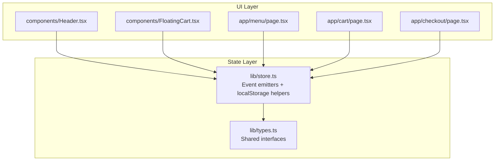
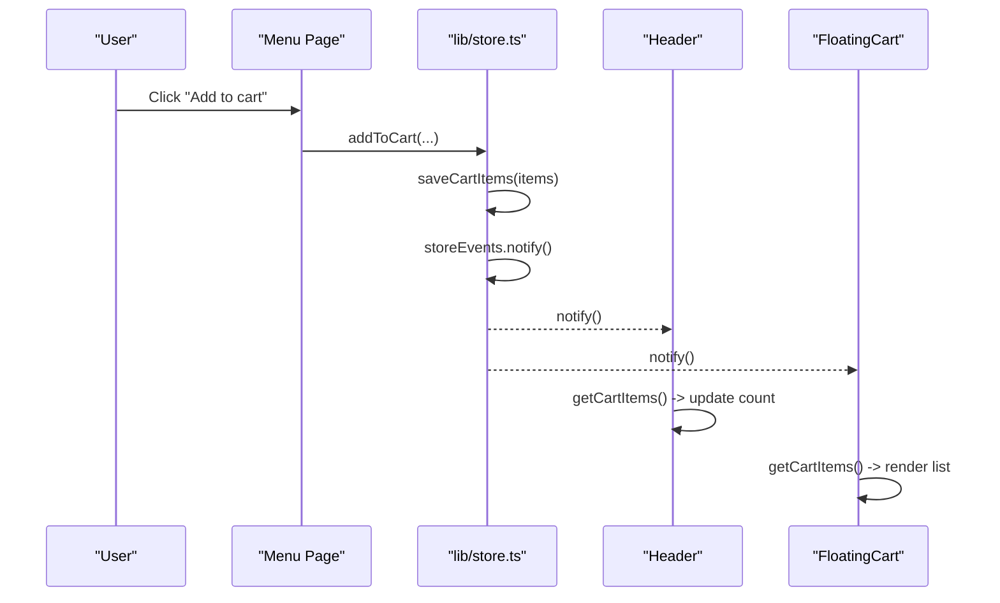
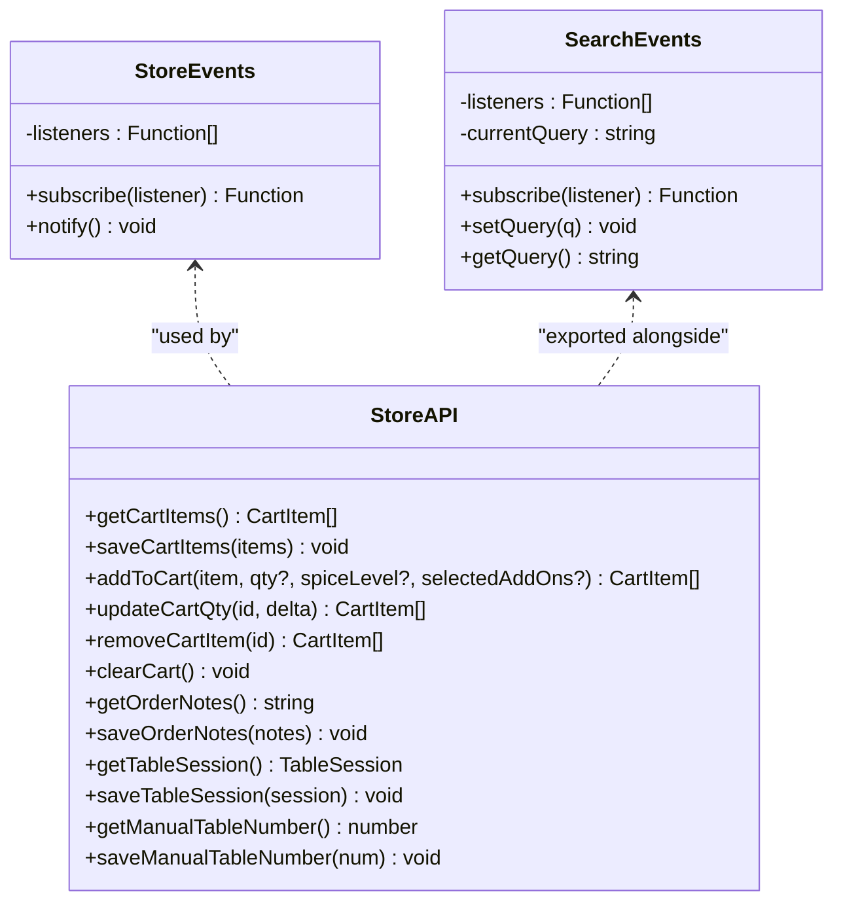
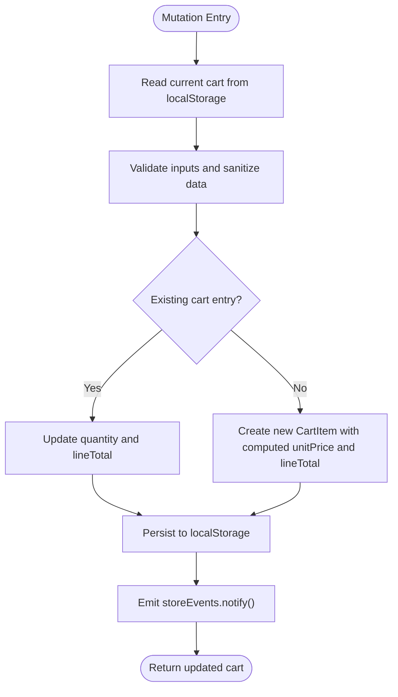
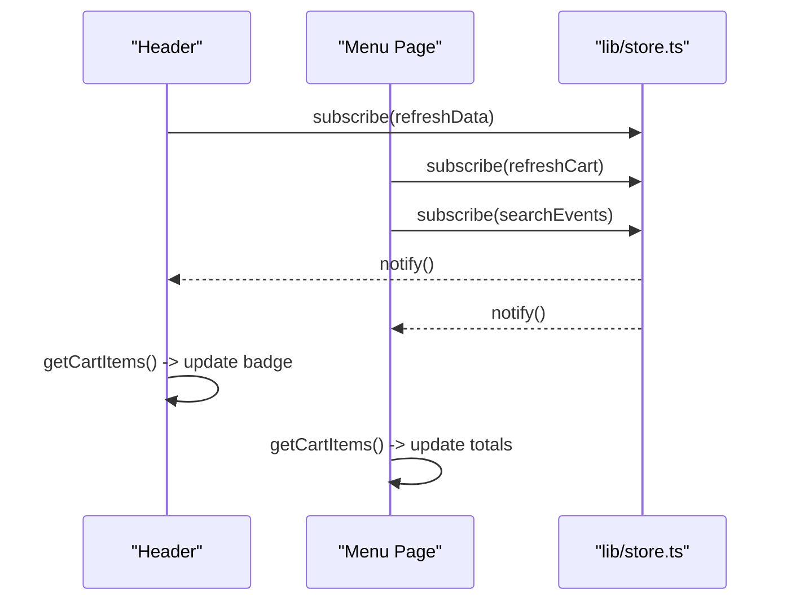
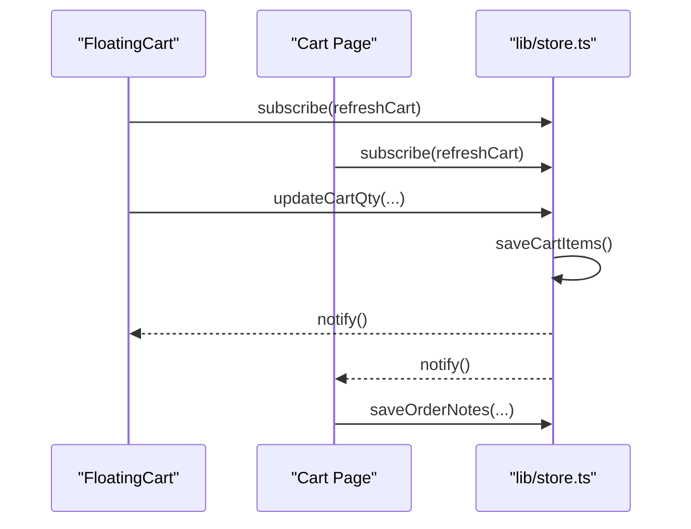
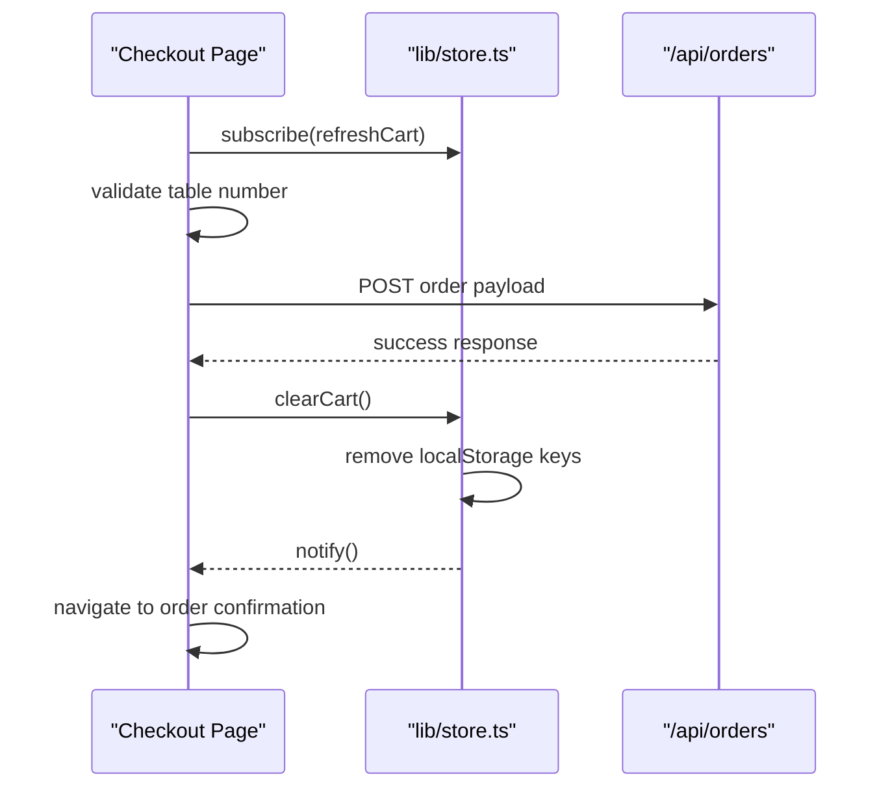
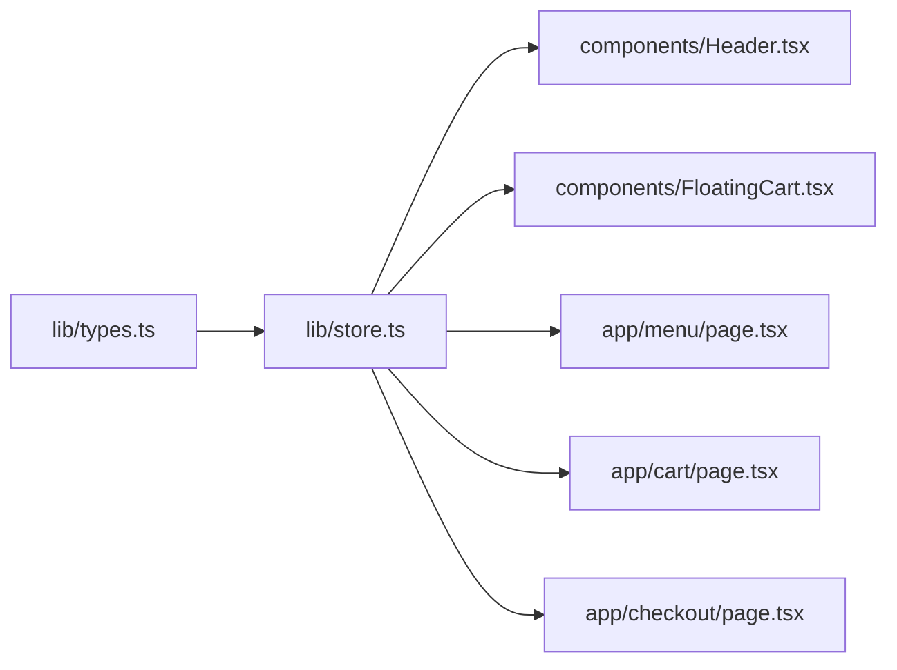

# State Management

<cite>
**Referenced Files in This Document**   
- [lib/store.ts](file://lib/store.ts)
- [lib/types.ts](file://lib/types.ts)
- [components/Header.tsx](file://components/Header.tsx)
- [components/FloatingCart.tsx](file://components/FloatingCart.tsx)
- [app/menu/page.tsx](file://app/menu/page.tsx)
- [app/cart/page.tsx](file://app/cart/page.tsx)
- [app/checkout/page.tsx](file://app/checkout/page.tsx)
</cite>

## Table of Contents
1. [Introduction](#introduction)
2. [Project Structure](#project-structure)
3. [Core Components](#core-components)
4. [Architecture Overview](#architecture-overview)
5. [Detailed Component Analysis](#detailed-component-analysis)
6. [Dependency Analysis](#dependency-analysis)
7. [Performance Considerations](#performance-considerations)
8. [Troubleshooting Guide](#troubleshooting-guide)
9. [Conclusion](#conclusion)

## Introduction
This document explains the event-driven state management system used across the application’s shopping experience. The system centers on a lightweight, custom event emitter that synchronizes UI components with a local storage-backed store. It covers:

- Custom event emitters for cross-component communication
- Local storage persistence for cart items, order notes, table session, and manual table number
- Store API for managing shopping cart items and related state
- How pages and components subscribe to state changes
- Examples of state synchronization, updates, and consistency patterns
- Best practices for organizing state, naming events, and debugging
- Performance considerations for large datasets and complex hierarchies

## Project Structure
The state layer is implemented as a small module that exposes:

- A generic event emitter (`StoreEvents`) for reactive updates
- A typed search query emitter (`SearchEvents`) for global search state
- Local storage helpers for cart, notes, table session, and manual table number
- Cart mutation functions that persist data and notify subscribers

**Diagram sources**
- [lib/store.ts:25-65](file://lib/store.ts#L25-L65)
- [lib/types.ts:1-119](file://lib/types.ts#L1-L119)
- [components/Header.tsx:1-121](file://components/Header.tsx#L1-L121)
- [components/FloatingCart.tsx:1-326](file://components/FloatingCart.tsx#L1-L326)
- [app/menu/page.tsx:1-320](file://app/menu/page.tsx#L1-L320)
- [app/cart/page.tsx:1-227](file://app/cart/page.tsx#L1-L227)
- [app/checkout/page.tsx:1-542](file://app/checkout/page.tsx#L1-L542)

**Section sources**
- [lib/store.ts:1-217](file://lib/store.ts#L1-L217)
- [lib/types.ts:1-119](file://lib/types.ts#L1-L119)

## Core Components
This section documents the core pieces of the state management system.

### Event Emitters
- `StoreEvents`: A simple pub/sub bus used to notify all subscribers when cart or session-related state changes. Subscribers receive no payload; they must re-read from the store.
- `SearchEvents`: A typed emitter that holds the current search query and notifies subscribers whenever it changes.

Key behaviors:
- Subscribe returns an unsubscribe function to prevent memory leaks.
- `notify` triggers all listeners synchronously.
- `SearchEvents.setQuery` updates the current query and broadcasts it immediately.

**Section sources**
- [lib/store.ts:25-65](file://lib/store.ts#L25-L65)

### Local Storage Persistence Layer
The store persists several keys in `localStorage`:

- Cart items: `selera_sambal_cart`
- Order notes: `selera_sambal_order_notes`
- Manual table number: `selera_sambal_manual_table`
- Table session (QR-based): `selera_sambal_table_session`

Readers are defensive:
- They guard against server-side rendering by checking `typeof window`.
- They sanitize parsed arrays and reject malformed entries.
- They return safe defaults when data is missing or invalid.

**Section sources**
- [lib/store.ts:19-23](file://lib/store.ts#L19-L23)
- [lib/store.ts:67-97](file://lib/store.ts#L67-L97)
- [lib/store.ts:170-216](file://lib/store.ts#L170-L216)

### Store API for Shopping Cart
The store exposes functions to read and mutate cart state:

- `getCartItems()`: Reads and sanitizes cart items from local storage.
- `saveCartItems(items)`: Persists items and emits a store update.
- `addToCart(item, qty?, spiceLevel?, selectedAddOns?)`: Adds or merges a cart item instance based on a composite key (item ID, spice level, add-ons).
- `updateCartQty(id, delta)`: Adjusts quantity and removes the item if quantity drops to zero or below.
- `removeCartItem(id)`: Removes a specific cart item.
- `clearCart()`: Clears cart, notes, and manual table number, then emits an update.

Data model:
- `CartItem` includes a unique instance id, menu item reference, quantity, optional spice level, selected add-ons, unit price, and line total.

**Section sources**
- [lib/store.ts:3-11](file://lib/store.ts#L3-L11)
- [lib/store.ts:93-168](file://lib/store.ts#L93-L168)
- [lib/types.ts:19-38](file://lib/types.ts#L19-L38)

### Session and Preferences
- `getTableSession()` / `saveTableSession(session)`: Stores QR-derived table session info.
- `getManualTableNumber()` / `saveManualTableNumber(num)`: Stores the customer-entered table number for the current order session.
- `getOrderNotes()` / `saveOrderNotes(notes)`: Stores free-text order notes.

These operations also emit store updates where appropriate so UI components can refresh automatically.

**Section sources**
- [lib/store.ts:180-216](file://lib/store.ts#L180-L216)

## Architecture Overview
The architecture follows a unidirectional flow:

1. User actions trigger store mutations (e.g., adding to cart, changing quantity).
2. Store writes to `localStorage` and calls `storeEvents.notify()`.
3. All subscribed components re-read the latest state from the store.
4. UI reflects the updated state.

**Diagram sources**
- [app/menu/page.tsx:71-82](file://app/menu/page.tsx#L71-L82)
- [lib/store.ts:99-137](file://lib/store.ts#L99-L137)
- [lib/store.ts:93-97](file://lib/store.ts#L93-L97)
- [components/Header.tsx:18-33](file://components/Header.tsx#L18-L33)
- [components/FloatingCart.tsx:29-39](file://components/FloatingCart.tsx#L29-L39)

## Detailed Component Analysis

### Store Events Class Diagram

**Diagram sources**
- [lib/store.ts:25-65](file://lib/store.ts#L25-L65)
- [lib/store.ts:67-216](file://lib/store.ts#L67-L216)

### Cart Mutation Flow

**Diagram sources**
- [lib/store.ts:99-137](file://lib/store.ts#L99-L137)
- [lib/store.ts:140-153](file://lib/store.ts#L140-L153)
- [lib/store.ts:93-97](file://lib/store.ts#L93-L97)

### Cross-Component Synchronization Patterns

#### Header and Menu Page
- Header subscribes to both `storeEvents` and `searchEvents`, keeping the cart badge and search input in sync.
- Menu page subscribes to both emitters to reflect cart totals and apply global search filtering.

**Diagram sources**
- [components/Header.tsx:18-39](file://components/Header.tsx#L18-L39)
- [app/menu/page.tsx:42-55](file://app/menu/page.tsx#L42-L55)
- [lib/store.ts:25-65](file://lib/store.ts#L25-L65)

**Section sources**
- [components/Header.tsx:1-121](file://components/Header.tsx#L1-L121)
- [app/menu/page.tsx:1-320](file://app/menu/page.tsx#L1-L320)

#### FloatingCart and Cart Page
- Both subscribe to `storeEvents` to keep their lists consistent.
- FloatingCart reads the manual table number to display a table badge.
- Cart page reads and writes order notes via the store.

**Diagram sources**
- [components/FloatingCart.tsx:29-58](file://components/FloatingCart.tsx#L29-L58)
- [app/cart/page.tsx:39-54](file://app/cart/page.tsx#L39-L54)
- [lib/store.ts:93-97](file://lib/store.ts#L93-L97)

**Section sources**
- [components/FloatingCart.tsx:1-326](file://components/FloatingCart.tsx#L1-L326)
- [app/cart/page.tsx:1-227](file://app/cart/page.tsx#L1-L227)

#### Checkout Page and Order Creation
- Checkout subscribes to `storeEvents` to stay in sync with cart changes.
- It validates the manual table number before creating an order.
- On successful order creation, it clears the cart and navigates to the order confirmation page.

**Diagram sources**
- [app/checkout/page.tsx:46-73](file://app/checkout/page.tsx#L46-L73)
- [app/checkout/page.tsx:186-245](file://app/checkout/page.tsx#L186-L245)
- [lib/store.ts:162-168](file://lib/store.ts#L162-L168)

**Section sources**
- [app/checkout/page.tsx:1-542](file://app/checkout/page.tsx#L1-L542)

## Dependency Analysis
The following diagram shows how components depend on the store and types:

**Diagram sources**
- [lib/types.ts:1-119](file://lib/types.ts#L1-L119)
- [lib/store.ts:1-217](file://lib/store.ts#L1-L217)
- [components/Header.tsx:1-121](file://components/Header.tsx#L1-L121)
- [components/FloatingCart.tsx:1-326](file://components/FloatingCart.tsx#L1-L326)
- [app/menu/page.tsx:1-320](file://app/menu/page.tsx#L1-L320)
- [app/cart/page.tsx:1-227](file://app/cart/page.tsx#L1-L227)
- [app/checkout/page.tsx:1-542](file://app/checkout/page.tsx#L1-L542)

**Section sources**
- [lib/store.ts:1-217](file://lib/store.ts#L1-L217)
- [lib/types.ts:1-119](file://lib/types.ts#L1-L119)

## Performance Considerations
- Avoid heavy computations inside event listeners. Re-read only what you need and compute derived values locally using memoization where possible.
- Keep cart items lean. If the catalog grows large, consider pagination or virtualization at the UI layer while keeping the cart minimal.
- Batch updates: Prefer mutating once per user action rather than multiple small writes.
- Debounce expensive operations like network requests triggered by state changes.
- Use stable identifiers for list rendering to minimize re-renders.
- Be cautious with deeply nested objects in `localStorage`; serialize carefully and validate on read.

[No sources needed since this section provides general guidance]

## Troubleshooting Guide
Common issues and resolutions:

- **Cart not updating in some components**: Ensure each component subscribes to `storeEvents` and calls `getCartItems()` in its refresh handler. Verify that the unsubscribe function is returned and called on cleanup.
- **Stale search query**: Confirm that the search input calls `searchEvents.setQuery` and that consumers subscribe to `searchEvents`.
- **Corrupted cart data**: The store sanitizes cart entries on read. If items disappear unexpectedly, inspect stored JSON for malformed structures.
- **Table number not persisted**: Check that `saveManualTableNumber` is called on input change and that `getManualTableNumber` is used to initialize state.
- **Order notes lost after checkout**: Notes are cleared along with the cart on successful order submission. If you need to preserve them, adjust the clearing logic accordingly.

**Section sources**
- [lib/store.ts:67-97](file://lib/store.ts#L67-L97)
- [lib/store.ts:162-178](file://lib/store.ts#L162-L178)
- [components/Header.tsx:18-39](file://components/Header.tsx#L18-L39)
- [app/menu/page.tsx:42-55](file://app/menu/page.tsx#L42-L55)

## Conclusion
The application uses a simple but effective event-driven state management pattern:

- A single source of truth lives in `localStorage`, accessed through a typed store API.
- A lightweight event emitter decouples components while ensuring they stay synchronized.
- Pages and shared components subscribe to store updates and re-read state reactively.
- Clear boundaries between persistence, mutation, and UI make the system maintainable and testable.

Adhering to the recommended patterns—explicit subscriptions, defensive reads, and focused mutations—helps keep the shopping experience consistent, performant, and easy to debug.

[No sources needed since this section summarizes without analyzing specific files]