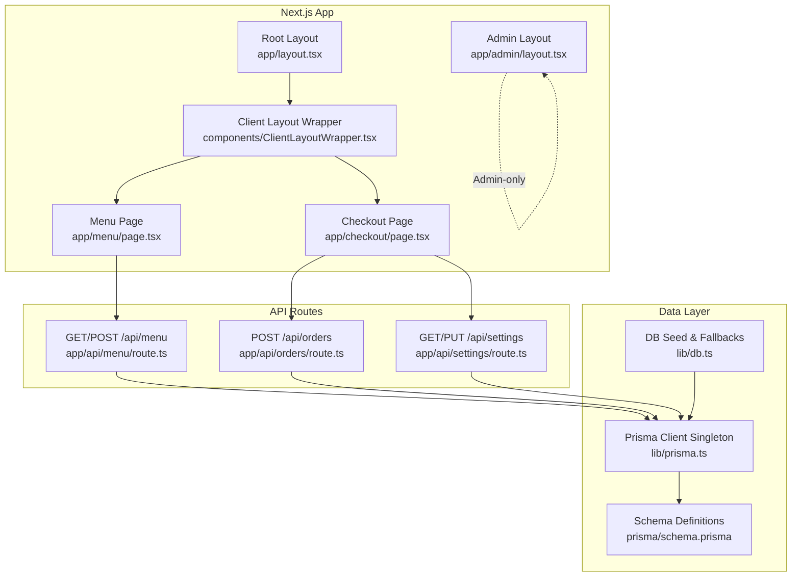
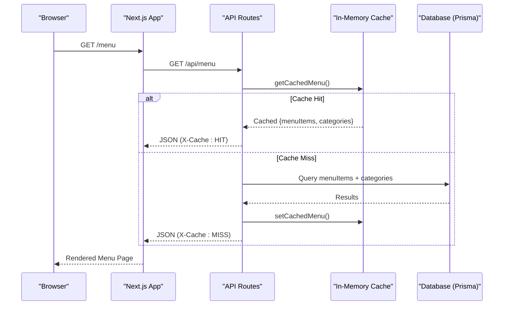
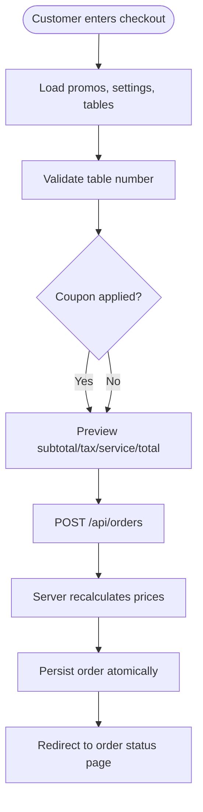
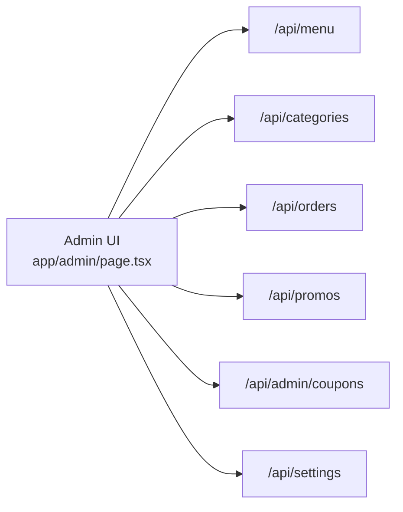
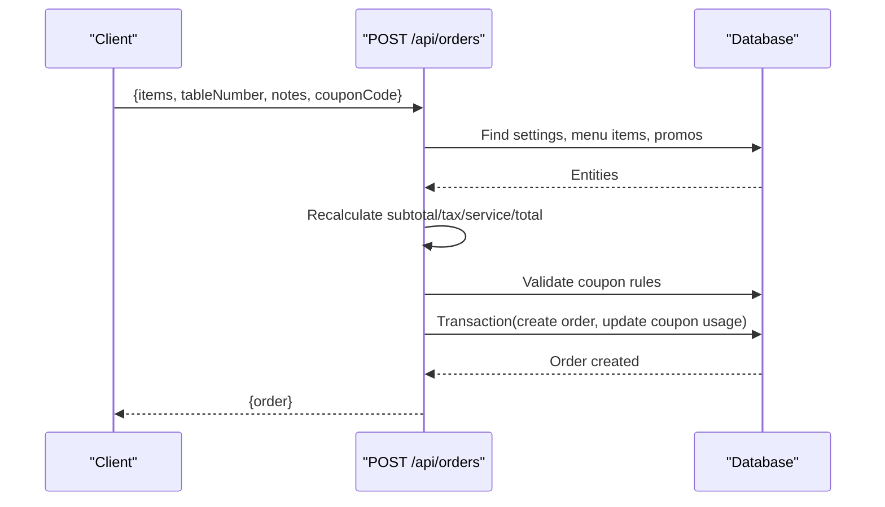
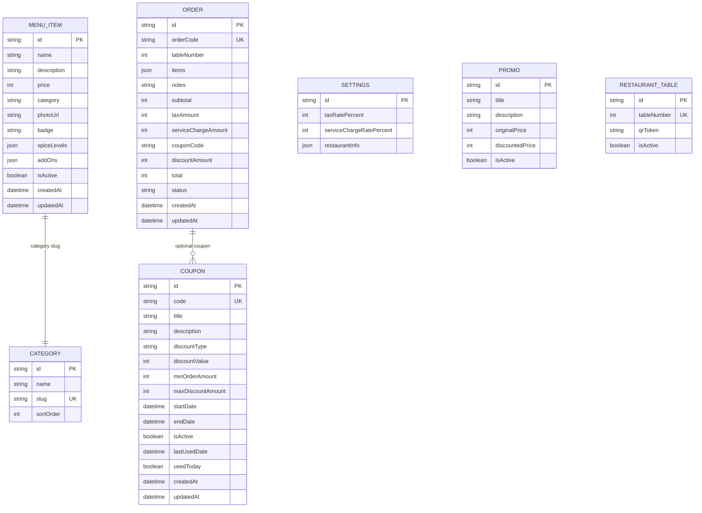
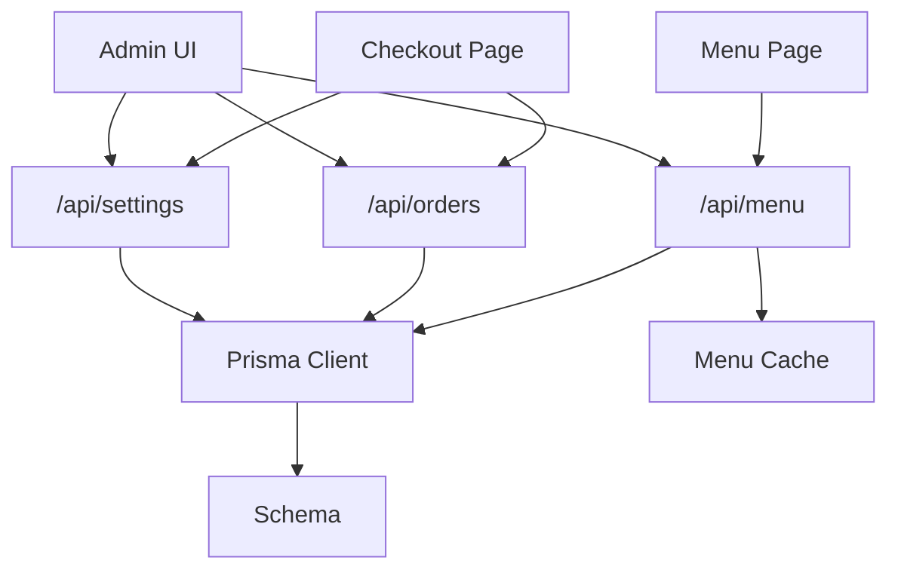

# Architecture Overview

<cite>
**Referenced Files in This Document**
- [README.md](file://README.md)
- [package.json](file://package.json)
- [next.config.js](file://next.config.js)
- [app/layout.tsx](file://app/layout.tsx)
- [components/ClientLayoutWrapper.tsx](file://components/ClientLayoutWrapper.tsx)
- [app/admin/layout.tsx](file://app/admin/layout.tsx)
- [app/menu/page.tsx](file://app/menu/page.tsx)
- [app/checkout/page.tsx](file://app/checkout/page.tsx)
- [app/api/menu/route.ts](file://app/api/menu/route.ts)
- [app/api/orders/route.ts](file://app/api/orders/route.ts)
- [app/api/settings/route.ts](file://app/api/settings/route.ts)
- [lib/db.ts](file://lib/db.ts)
- [lib/prisma.ts](file://lib/prisma.ts)
- [lib/menuCache.ts](file://lib/menuCache.ts)
- [prisma/schema.prisma](file://prisma/schema.prisma)
</cite>

## Table of Contents
1. [Introduction](#introduction)
2. [Project Structure](#project-structure)
3. [Core Components](#core-components)
4. [Architecture Overview](#architecture-overview)
5. [Detailed Component Analysis](#detailed-component-analysis)
6. [Dependency Analysis](#dependency-analysis)
7. [Performance Considerations](#performance-considerations)
8. [Troubleshooting Guide](#troubleshooting-guide)
9. [Conclusion](#conclusion)

## Introduction
Warkop Betawa is a Next.js 14 restaurant ordering application with a full backend for menu, orders, categories, promos, coupons, settings, and tables. The system uses the Next.js App Router with server-side rendering and API routes, backed by Prisma and a relational database (PostgreSQL). It separates customer-facing pages from an admin dashboard, provides caching for high-frequency reads, and enforces secure order pricing on the server.

Key characteristics:
- Customer-facing UI for browsing menus, adding items to cart, applying coupons, and placing orders.
- Admin dashboard for managing menu items, categories, promotions, coupons, orders, and settings.
- Server-side data access via Next.js API routes using Prisma.
- In-memory cache for public menu reads to reduce database load.
- Human-readable order codes and string-based category slugs for UI simplicity.

**Section sources**
- [README.md:1-105](file://README.md#L1-L105)

## Project Structure
The project follows a feature-oriented structure under the Next.js App Router:
- `app/` contains page components and route handlers.
- `components/` holds shared client-side UI components.
- `lib/` contains database utilities, caching, types, and helpers.
- `prisma/` defines the schema used by Prisma Client.

**Diagram sources**
- [app/layout.tsx:1-24](file://app/layout.tsx#L1-L24)
- [components/ClientLayoutWrapper.tsx:1-45](file://components/ClientLayoutWrapper.tsx#L1-L45)
- [app/admin/layout.tsx:1-12](file://app/admin/layout.tsx#L1-L12)
- [app/menu/page.tsx:1-320](file://app/menu/page.tsx#L1-L320)
- [app/checkout/page.tsx:1-542](file://app/checkout/page.tsx#L1-L542)
- [app/api/menu/route.ts:1-109](file://app/api/menu/route.ts#L1-L109)
- [app/api/orders/route.ts:1-245](file://app/api/orders/route.ts#L1-L245)
- [app/api/settings/route.ts:1-68](file://app/api/settings/route.ts#L1-L68)
- [lib/prisma.ts:1-40](file://lib/prisma.ts#L1-L40)
- [lib/db.ts:1-161](file://lib/db.ts#L1-L161)
- [prisma/schema.prisma:1-107](file://prisma/schema.prisma#L1-L107)

**Section sources**
- [package.json:1-42](file://package.json#L1-L42)
- [next.config.js:1-15](file://next.config.js#L1-L15)

## Core Components
- Root layout and client wrapper:
  - Root layout sets metadata and wraps content with a client layout that conditionally renders header/footer/AI chat for non-admin routes.
  - Admin layout isolates the admin section without public chrome.
- Customer pages:
  - Menu page fetches active menu items and categories from `/api/menu`, supports filtering by slug-based categories, and integrates with local cart state.
  - Checkout page collects table number, optional notes, applies coupons, and submits orders to `/api/orders`.
- API routes:
  - `/api/menu`: Reads active menu items and categories; caches results for fast responses; invalidates cache on mutations.
  - `/api/orders`: Validates inputs, recalculates prices server-side, validates coupons, and persists orders atomically.
  - `/api/settings`: Returns or updates tax/service rates and restaurant info.
- Data layer:
  - Prisma Client singleton ensures connection pooling and development logging.
  - DB seed utility initializes default data and coupons if empty.
  - Schema defines entities: Category, MenuItem, RestaurantTable, Promo, Order, Coupon, Settings.

**Section sources**
- [app/layout.tsx:1-24](file://app/layout.tsx#L1-L24)
- [components/ClientLayoutWrapper.tsx:1-45](file://components/ClientLayoutWrapper.tsx#L1-L45)
- [app/admin/layout.tsx:1-12](file://app/admin/layout.tsx#L1-L12)
- [app/menu/page.tsx:1-320](file://app/menu/page.tsx#L1-L320)
- [app/checkout/page.tsx:1-542](file://app/checkout/page.tsx#L1-L542)
- [app/api/menu/route.ts:1-109](file://app/api/menu/route.ts#L1-L109)
- [app/api/orders/route.ts:1-245](file://app/api/orders/route.ts#L1-L245)
- [app/api/settings/route.ts:1-68](file://app/api/settings/route.ts#L1-L68)
- [lib/prisma.ts:1-40](file://lib/prisma.ts#L1-L40)
- [lib/db.ts:1-161](file://lib/db.ts#L1-L161)
- [prisma/schema.prisma:1-107](file://prisma/schema.prisma#L1-L107)

## Architecture Overview
High-level architecture:
- Frontend: Next.js App Router pages render server-side and hydrate client-side components.
- API layer: Route handlers validate requests, enforce business rules, and interact with the database.
- Database layer: Prisma Client queries a PostgreSQL database defined by the schema.
- Caching: In-memory cache serves frequent menu reads quickly and is invalidated on writes.

**Diagram sources**
- [app/api/menu/route.ts:1-109](file://app/api/menu/route.ts#L1-L109)
- [lib/menuCache.ts:1-47](file://lib/menuCache.ts#L1-L47)

**Section sources**
- [README.md:53-94](file://README.md#L53-L94)

## Detailed Component Analysis

### Customer-Facing Pages
- Menu page:
  - Fetches menu and categories from `/api/menu`.
  - Filters by slug-based categories and search query.
  - Integrates with local cart store and shows quick-add feedback.
- Checkout page:
  - Loads promos, settings, and known tables in parallel.
  - Applies coupon validation via `/api/coupons/validate`.
  - Submits order payload to `/api/orders`; server recalculates totals securely.

**Diagram sources**
- [app/checkout/page.tsx:1-542](file://app/checkout/page.tsx#L1-L542)
- [app/api/orders/route.ts:1-245](file://app/api/orders/route.ts#L1-L245)

**Section sources**
- [app/menu/page.tsx:1-320](file://app/menu/page.tsx#L1-L320)
- [app/checkout/page.tsx:1-542](file://app/checkout/page.tsx#L1-L542)

### Admin Dashboard
- Admin layout isolates admin UI without public header/footer.
- Admin page manages products, categories, orders, promotions, coupons, inventory, reviews, notifications, and settings.
- Interacts with API routes for CRUD operations and displays real-time order lists.

**Diagram sources**
- [app/admin/layout.tsx:1-12](file://app/admin/layout.tsx#L1-L12)
- [app/admin/page.tsx:1-800](file://app/admin/page.tsx#L1-L800)

**Section sources**
- [app/admin/layout.tsx:1-12](file://app/admin/layout.tsx#L1-L12)
- [app/admin/page.tsx:1-800](file://app/admin/page.tsx#L1-L800)

### API Routes and Data Flow
- `/api/menu`:
  - GET: Serves cached menu when available; otherwise queries DB and caches result.
  - POST: Creates menu item and invalidates cache.
- `/api/orders`:
  - POST: Validates items, table number, promo/menu references, add-ons, and coupons; recalculates totals; persists order atomically.
- `/api/settings`:
  - GET: Returns settings or static fallback.
  - PUT: Updates tax/service rates and restaurant info with validation.

**Diagram sources**
- [app/api/orders/route.ts:1-245](file://app/api/orders/route.ts#L1-L245)

**Section sources**
- [app/api/menu/route.ts:1-109](file://app/api/menu/route.ts#L1-L109)
- [app/api/orders/route.ts:1-245](file://app/api/orders/route.ts#L1-L245)
- [app/api/settings/route.ts:1-68](file://app/api/settings/route.ts#L1-L68)

### Data Model Decisions
- String-based category slugs vs ObjectId references:
  - MenuItem.category stores a slug string to match UI filters directly, avoiding complex joins and UI rewrite.
  - Category collection remains source of truth for slugs; admin panel uses slugs when creating/editing menu items.
- Tax rates as single source of truth:
  - Settings document holds taxRatePercent and serviceChargeRatePercent; customers fetch these at runtime.
- Order codes:
  - Human-readable codes like ARU-XXXX are generated and stored for customer visibility and staff communication.

**Diagram sources**
- [prisma/schema.prisma:1-107](file://prisma/schema.prisma#L1-L107)

**Section sources**
- [README.md:85-94](file://README.md#L85-L94)
- [prisma/schema.prisma:1-107](file://prisma/schema.prisma#L1-L107)

## Dependency Analysis
Component dependencies and relationships:
- Pages depend on API routes for data.
- API routes depend on Prisma Client and DB seed utilities.
- Menu cache depends on mutation endpoints to invalidate entries.
- Admin UI depends on multiple API routes for management tasks.

**Diagram sources**
- [app/menu/page.tsx:1-320](file://app/menu/page.tsx#L1-L320)
- [app/checkout/page.tsx:1-542](file://app/checkout/page.tsx#L1-L542)
- [app/api/menu/route.ts:1-109](file://app/api/menu/route.ts#L1-L109)
- [app/api/orders/route.ts:1-245](file://app/api/orders/route.ts#L1-L245)
- [app/api/settings/route.ts:1-68](file://app/api/settings/route.ts#L1-L68)
- [lib/prisma.ts:1-40](file://lib/prisma.ts#L1-L40)
- [lib/menuCache.ts:1-47](file://lib/menuCache.ts#L1-L47)
- [prisma/schema.prisma:1-107](file://prisma/schema.prisma#L1-L107)

**Section sources**
- [lib/prisma.ts:1-40](file://lib/prisma.ts#L1-L40)
- [lib/db.ts:1-161](file://lib/db.ts#L1-L161)

## Performance Considerations
- In-memory menu cache:
  - Reduces latency for public menu reads to under 10ms.
  - TTL-based expiration and immediate invalidation on mutations ensure freshness.
- Parallel data fetching:
  - Checkout loads promos, settings, and tables concurrently to minimize round-trips.
- Server-side price recalculation:
  - Prevents client manipulation and ensures consistent totals.
- Prisma logging:
  - Development logs query durations for performance monitoring.

Recommendations:
- Consider CDN caching for static assets and images.
- Add pagination for large datasets (orders, menu items).
- Introduce rate limiting on write-heavy endpoints.
- Use background jobs for heavy analytics or report generation.

**Section sources**
- [lib/menuCache.ts:1-47](file://lib/menuCache.ts#L1-L47)
- [app/checkout/page.tsx:1-542](file://app/checkout/page.tsx#L1-L542)
- [lib/prisma.ts:1-40](file://lib/prisma.ts#L1-L40)

## Troubleshooting Guide
Common issues and resolutions:
- Database seeding failures:
  - Check seed functions and retry logic; review error logs for connection issues.
- Menu cache not updating:
  - Ensure mutations call cache invalidation; verify TTL behavior.
- Order creation errors:
  - Validate input payloads; check coupon rules and availability; inspect transaction outcomes.
- Settings updates failing:
  - Validate numeric ranges for tax/service rates; confirm existing settings record exists.

Debugging tips:
- Use Prisma query logs in development to identify slow queries.
- Inspect API route error responses for detailed messages.
- Verify environment variables for database connectivity.

**Section sources**
- [lib/db.ts:1-161](file://lib/db.ts#L1-L161)
- [app/api/menu/route.ts:1-109](file://app/api/menu/route.ts#L1-L109)
- [app/api/orders/route.ts:1-245](file://app/api/orders/route.ts#L1-L245)
- [app/api/settings/route.ts:1-68](file://app/api/settings/route.ts#L1-L68)

## Conclusion
Warkop Betawa’s architecture leverages Next.js App Router for SSR and API routes, Prisma for robust database interactions, and an in-memory cache for performance-critical reads. The separation between customer-facing interfaces and the admin dashboard simplifies user experiences while enabling comprehensive operational control. Design choices such as string-based category slugs and human-readable order codes prioritize usability and maintainability. Scalability can be enhanced through pagination, CDN caching, rate limiting, and background processing. Deployment topology should consider environment configuration for database connections and production-grade security measures beyond local auth.