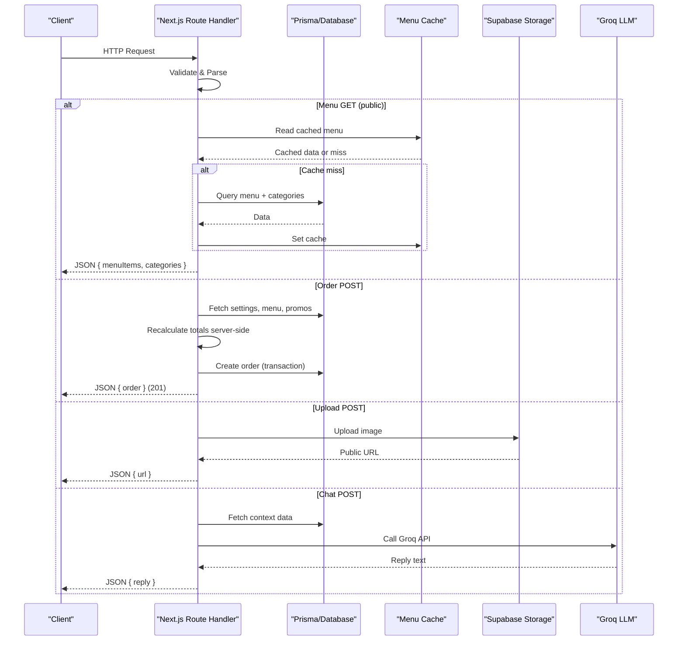
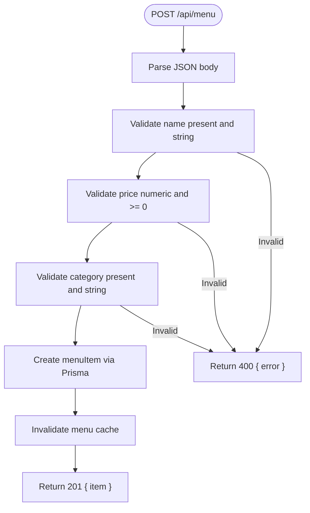
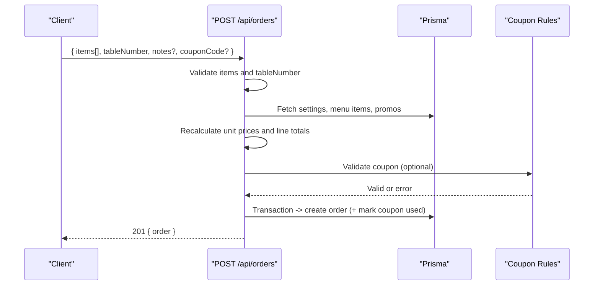
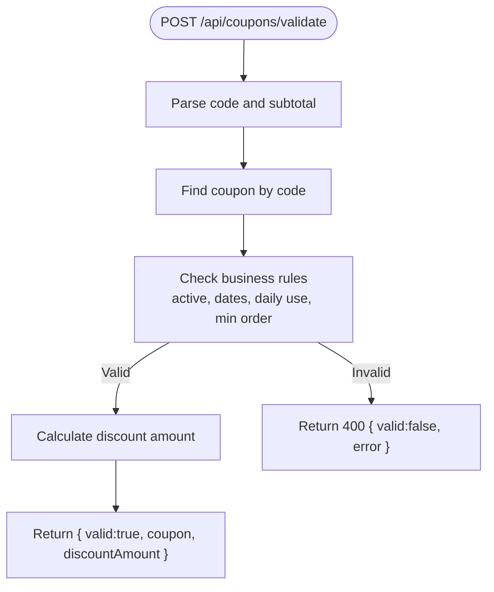
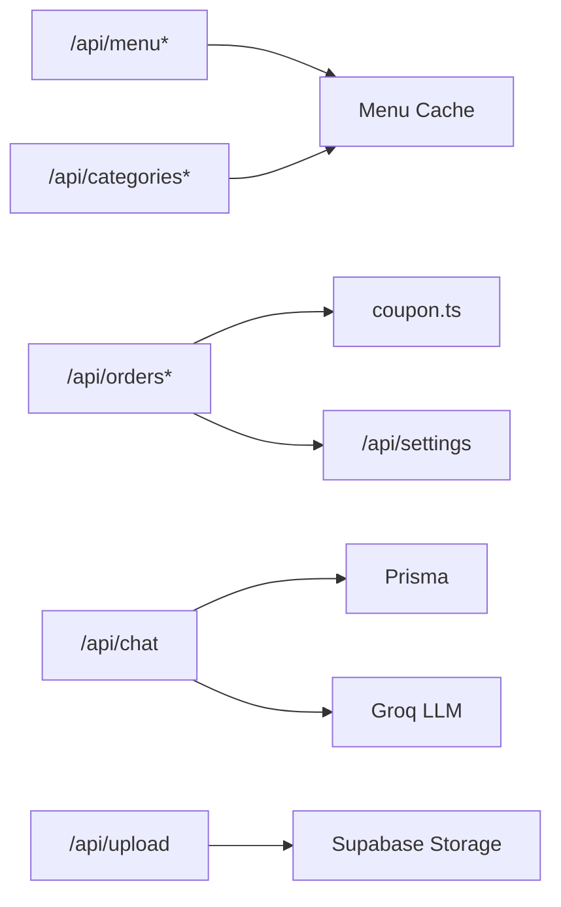

# API Layer

<cite>
**Referenced Files in This Document**
- [app/api/menu/route.ts](file://app/api/menu/route.ts)
- [app/api/menu/[id]/route.ts](file://app/api/menu/[id]/route.ts)
- [app/api/orders/route.ts](file://app/api/orders/route.ts)
- [app/api/orders/[id]/route.ts](file://app/api/orders/[id]/route.ts)
- [app/api/categories/route.ts](file://app/api/categories/route.ts)
- [app/api/categories/[id]/route.ts](file://app/api/categories/[id]/route.ts)
- [app/api/coupons/route.ts](file://app/api/coupons/route.ts)
- [app/api/coupons/validate/route.ts](file://app/api/coupons/validate/route.ts)
- [app/api/admin/coupons/route.ts](file://app/api/admin/coupons/route.ts)
- [app/api/admin/coupons/[id]/route.ts](file://app/api/admin/coupons/[id]/route.ts)
- [app/api/promos/route.ts](file://app/api/promos/route.ts)
- [app/api/promos/[id]/route.ts](file://app/api/promos/[id]/route.ts)
- [app/api/settings/route.ts](file://app/api/settings/route.ts)
- [app/api/tables/route.ts](file://app/api/tables/route.ts)
- [app/api/tables/[id]/route.ts](file://app/api/tables/[id]/route.ts)
- [app/api/upload/route.ts](file://app/api/upload/route.ts)
- [app/api/chat/route.ts](file://app/api/chat/route.ts)
- [lib/coupon.ts](file://lib/coupon.ts)
</cite>

## Table of Contents
1. Introduction
2. Project Structure
3. Core Components
4. Architecture Overview
5. Detailed Component Analysis
6. Dependency Analysis
7. Performance Considerations
8. Troubleshooting Guide
9. Conclusion

## Introduction
This document explains the RESTful API layer of the Warkop Betawa system built with Next.js App Router under app/api/. It covers endpoint organization, HTTP methods, parameter handling, query validation, response formatting, and common patterns for CRUD operations across menu items, orders, categories, coupons, and promotions. It also documents error handling strategies, status codes, and performance considerations such as caching and server-side price recalculation.

## Project Structure
The API is organized by domain resources under app/api/:
- Resource routes: /api/menu, /api/orders, /api/categories, /api/promos, /api/tables
- Admin-scoped routes: /api/admin/coupons
- Public coupon endpoints: /api/coupons and /api/coupons/validate
- Utility endpoints: /api/settings, /api/upload, /api/chat

```mermaid
graph TB
subgraph "API Routes"
M["/api/menu"]
MI["/api/menu/[id]"]
O["/api/orders"]
OID["/api/orders/[id]"]
C["/api/categories"]
CID["/api/categories/[id]"]
P["/api/promos"]
PID["/api/promos/[id]"]
T["/api/tables"]
TID["/api/tables/[id]"]
S["/api/settings"]
U["/api/upload"]
CH["/api/chat"]
AC["/api/admin/coupons"]
ACID["/api/admin/coupons/[id]"]
CV["/api/coupons/validate"]
CL["/api/coupons"]
end
DB["Database (Prisma)"]
Cache["In-memory Menu Cache"]
Storage["Supabase Storage"]
AI["Groq LLM"]
M --> DB
MI --> DB
O --> DB
OID --> DB
C --> DB
CID --> DB
P --> DB
PID --> DB
T --> DB
TID --> DB
S --> DB
U --> Storage
CH --> DB
CH --> AI
AC --> DB
ACID --> DB
CV --> DB
CL --> DB
M -.-> Cache
```

**Diagram sources**
- [app/api/menu/route.ts:1-109](file://app/api/menu/route.ts#L1-L109)
- [app/api/orders/route.ts:1-245](file://app/api/orders/route.ts#L1-L245)
- [app/api/categories/route.ts:1-47](file://app/api/categories/route.ts#L1-L47)
- [app/api/promos/route.ts:1-38](file://app/api/promos/route.ts#L1-L38)
- [app/api/tables/route.ts:1-34](file://app/api/tables/route.ts#L1-L34)
- [app/api/settings/route.ts:1-68](file://app/api/settings/route.ts#L1-L68)
- [app/api/upload/route.ts:1-74](file://app/api/upload/route.ts#L1-L74)
- [app/api/chat/route.ts:1-477](file://app/api/chat/route.ts#L1-L477)
- [app/api/coupons/route.ts:1-33](file://app/api/coupons/route.ts#L1-L33)
- [app/api/coupons/validate/route.ts:1-58](file://app/api/coupons/validate/route.ts#L1-L58)
- [app/api/admin/coupons/route.ts:1-129](file://app/api/admin/coupons/route.ts#L1-L129)
- [app/api/admin/coupons/[id]/route.ts:1-102](file://app/api/admin/coupons/[id]/route.ts#L1-L102)

**Section sources**
- [app/api/menu/route.ts:1-109](file://app/api/menu/route.ts#L1-L109)
- [app/api/orders/route.ts:1-245](file://app/api/orders/route.ts#L1-L245)
- [app/api/categories/route.ts:1-47](file://app/api/categories/route.ts#L1-L47)
- [app/api/promos/route.ts:1-38](file://app/api/promos/route.ts#L1-L38)
- [app/api/tables/route.ts:1-34](file://app/api/tables/route.ts#L1-L34)
- [app/api/settings/route.ts:1-68](file://app/api/settings/route.ts#L1-L68)
- [app/api/upload/route.ts:1-74](file://app/api/upload/route.ts#L1-L74)
- [app/api/chat/route.ts:1-477](file://app/api/chat/route.ts#L1-L477)
- [app/api/coupons/route.ts:1-33](file://app/api/coupons/route.ts#L1-L33)
- [app/api/coupons/validate/route.ts:1-58](file://app/api/coupons/validate/route.ts#L1-L58)
- [app/api/admin/coupons/route.ts:1-129](file://app/api/admin/coupons/route.ts#L1-L129)
- [app/api/admin/coupons/[id]/route.ts:1-102](file://app/api/admin/coupons/[id]/route.ts#L1-L102)

## Core Components
- Menu endpoints: list with optional inactive inclusion, create, get/update/delete by id; includes cache invalidation on writes.
- Orders endpoints: list, create with strict validation and server-side price recalculation, get by orderCode, update status/items via PATCH, delete by orderCode.
- Categories endpoints: list, create, update, delete; cache invalidation on writes.
- Promos endpoints: list (with optional inactive), create, update, delete.
- Tables endpoints: list, create with QR token generation, delete by Prisma id.
- Settings endpoint: read and update tax/service rates and restaurant info.
- Upload endpoint: secure image upload to Supabase storage with type/size checks.
- Chat endpoint: AI-assisted assistant using Groq with fallback logic and diagnostics.
- Coupons endpoints: public listing and validation; admin CRUD with soft delete semantics.

Key patterns:
- Consistent JSON responses with { data } or { error }.
- Input validation returns 400 with descriptive messages.
- Not found returns 404; internal errors return 500.
- Database connection established per request via connectDB.
- Cache invalidation after mutating menu/category data.

**Section sources**
- [app/api/menu/route.ts:1-109](file://app/api/menu/route.ts#L1-L109)
- [app/api/menu/[id]/route.ts:1-81](file://app/api/menu/[id]/route.ts#L1-L81)
- [app/api/orders/route.ts:1-245](file://app/api/orders/route.ts#L1-L245)
- [app/api/orders/[id]/route.ts:1-97](file://app/api/orders/[id]/route.ts#L1-L97)
- [app/api/categories/route.ts:1-47](file://app/api/categories/route.ts#L1-L47)
- [app/api/categories/[id]/route.ts:1-53](file://app/api/categories/[id]/route.ts#L1-L53)
- [app/api/promos/route.ts:1-38](file://app/api/promos/route.ts#L1-L38)
- [app/api/promos/[id]/route.ts:1-52](file://app/api/promos/[id]/route.ts#L1-L52)
- [app/api/tables/route.ts:1-34](file://app/api/tables/route.ts#L1-L34)
- [app/api/tables/[id]/route.ts:1-23](file://app/api/tables/[id]/route.ts#L1-L23)
- [app/api/settings/route.ts:1-68](file://app/api/settings/route.ts#L1-L68)
- [app/api/upload/route.ts:1-74](file://app/api/upload/route.ts#L1-L74)
- [app/api/chat/route.ts:1-477](file://app/api/chat/route.ts#L1-L477)
- [app/api/coupons/route.ts:1-33](file://app/api/coupons/route.ts#L1-L33)
- [app/api/coupons/validate/route.ts:1-58](file://app/api/coupons/validate/route.ts#L1-L58)
- [app/api/admin/coupons/route.ts:1-129](file://app/api/admin/coupons/route.ts#L1-L129)
- [app/api/admin/coupons/[id]/route.ts:1-102](file://app/api/admin/coupons/[id]/route.ts#L1-L102)

## Architecture Overview
The API follows a resource-oriented design with Next.js App Router file-based routing. Each route handler performs:
- Request parsing and validation
- Database access via Prisma
- Business rule enforcement (e.g., coupon rules, pricing recalculation)
- Response formatting with consistent structure
- Error handling with appropriate HTTP status codes

**Diagram sources**
- [app/api/menu/route.ts:1-109](file://app/api/menu/route.ts#L1-L109)
- [app/api/orders/route.ts:1-245](file://app/api/orders/route.ts#L1-L245)
- [app/api/upload/route.ts:1-74](file://app/api/upload/route.ts#L1-L74)
- [app/api/chat/route.ts:1-477](file://app/api/chat/route.ts#L1-L477)

## Detailed Component Analysis

### Menu Endpoints
- GET /api/menu
  - Query params: all=true to include inactive items
  - Response: { menuItems, categories }
  - Caching: In-memory cache for public view; X-Cache headers indicate HIT/MISS
- POST /api/menu
  - Validates name, price, category; creates menuItem; invalidates cache
  - Response: { item } (201)
- GET /api/menu/[id]
  - Returns { item } or 404
- PUT /api/menu/[id]
  - Partial updates with field-level validation; invalidates cache
  - Response: { item }
- DELETE /api/menu/[id]
  - Deletes menuItem; invalidates cache
  - Response: { success: true }

**Diagram sources**
- [app/api/menu/route.ts:67-108](file://app/api/menu/route.ts#L67-L108)

**Section sources**
- [app/api/menu/route.ts:1-109](file://app/api/menu/route.ts#L1-L109)
- [app/api/menu/[id]/route.ts:1-81](file://app/api/menu/[id]/route.ts#L1-L81)

### Orders Endpoints
- GET /api/orders
  - Lists orders newest first
- POST /api/orders
  - Validates items array and tableNumber
  - Batch fetches settings, menu items, and promos
  - Server-side recalculation of line totals, subtotal, tax, service charge, total
  - Optional coupon validation and atomic transactional creation
  - Response: { order } (201)
- GET /api/orders/[id]
  - Lookup by orderCode (URL-decoded)
- PATCH /api/orders/[id]
  - Updates status and/or items; recalculates totals if items change
- DELETE /api/orders/[id]
  - Deletes by orderCode

**Diagram sources**
- [app/api/orders/route.ts:23-236](file://app/api/orders/route.ts#L23-L236)
- [lib/coupon.ts:77-132](file://lib/coupon.ts#L77-L132)

**Section sources**
- [app/api/orders/route.ts:1-245](file://app/api/orders/route.ts#L1-L245)
- [app/api/orders/[id]/route.ts:1-97](file://app/api/orders/[id]/route.ts#L1-L97)
- [lib/coupon.ts:1-133](file://lib/coupon.ts#L1-L133)

### Category Endpoints
- GET /api/categories
  - Returns sorted categories
- POST /api/categories
  - Validates name; auto-generates slug if missing; sets sortOrder
  - Invalidates menu cache
- PUT /api/categories/[id]
  - Partial updates for name, slug, sortOrder
- DELETE /api/categories/[id]
  - Deletes category

**Section sources**
- [app/api/categories/route.ts:1-47](file://app/api/categories/route.ts#L1-L47)
- [app/api/categories/[id]/route.ts:1-53](file://app/api/categories/[id]/route.ts#L1-L53)

### Coupon Endpoints
Public:
- GET /api/coupons
  - Returns active coupons valid today
- POST /api/coupons/validate
  - Validates code against subtotal; returns discount amount and coupon details

Admin:
- GET /api/admin/coupons
  - Lists all coupons with availability flag
- POST /api/admin/coupons
  - Creates coupon with comprehensive validation (dates, values, uniqueness)
- PUT/PATCH /api/admin/coupons/[id]
  - Updates fields with duplicate code checks
- DELETE /api/admin/coupons/[id]
  - Soft delete by setting isActive=false

**Diagram sources**
- [app/api/coupons/validate/route.ts:6-58](file://app/api/coupons/validate/route.ts#L6-L58)
- [lib/coupon.ts:77-132](file://lib/coupon.ts#L77-L132)

**Section sources**
- [app/api/coupons/route.ts:1-33](file://app/api/coupons/route.ts#L1-L33)
- [app/api/coupons/validate/route.ts:1-58](file://app/api/coupons/validate/route.ts#L1-L58)
- [app/api/admin/coupons/route.ts:1-129](file://app/api/admin/coupons/route.ts#L1-L129)
- [app/api/admin/coupons/[id]/route.ts:1-102](file://app/api/admin/coupons/[id]/route.ts#L1-L102)
- [lib/coupon.ts:1-133](file://lib/coupon.ts#L1-L133)

### Promo Endpoints
- GET /api/promos
  - Optional all=true to include inactive
- POST /api/promos
  - Creates promo with title, description, original/discounted price, isActive
- PUT /api/promos/[id]
  - Partial updates
- DELETE /api/promos/[id]
  - Deletes promo

**Section sources**
- [app/api/promos/route.ts:1-38](file://app/api/promos/route.ts#L1-L38)
- [app/api/promos/[id]/route.ts:1-52](file://app/api/promos/[id]/route.ts#L1-L52)

### Tables Endpoints
- GET /api/tables
  - Lists tables ordered by tableNumber
- POST /api/tables
  - Creates table with generated QR token
- DELETE /api/tables/[id]
  - Deletes by Prisma cuid

**Section sources**
- [app/api/tables/route.ts:1-34](file://app/api/tables/route.ts#L1-L34)
- [app/api/tables/[id]/route.ts:1-23](file://app/api/tables/[id]/route.ts#L1-L23)

### Settings Endpoint
- GET /api/settings
  - Returns persisted settings or static defaults
- PUT /api/settings
  - Validates taxRatePercent and serviceChargeRatePercent ranges; upserts settings

**Section sources**
- [app/api/settings/route.ts:1-68](file://app/api/settings/route.ts#L1-L68)

### Upload Endpoint
- POST /api/upload
  - Accepts multipart form with file
  - Validates MIME type and size (max 5MB)
  - Ensures bucket exists; uploads to Supabase storage
  - Returns public URL

**Section sources**
- [app/api/upload/route.ts:1-74](file://app/api/upload/route.ts#L1-L74)

### Chat Endpoint
- POST /api/chat
  - Accepts message and optional history
  - Builds context from DB (menu, promos, coupons)
  - Calls Groq LLM with timeout; falls back to smart responder if key missing
  - Returns { reply }
- GET /api/chat
  - Diagnostics: checks API key and pings Groq

**Section sources**
- [app/api/chat/route.ts:1-477](file://app/api/chat/route.ts#L1-L477)

## Dependency Analysis
- All route handlers depend on:
  - Database via Prisma (prisma client)
  - Shared utilities: connectDB, format helpers, JWT utilities
  - External services: Supabase storage, Groq LLM
- Coupling:
  - Menu and Category routes invalidate shared menu cache on mutations
  - Orders route depends on coupon validation logic and settings for tax/service calculations
  - Chat route composes multiple data sources and external LLM calls

**Diagram sources**
- [app/api/menu/route.ts:1-109](file://app/api/menu/route.ts#L1-L109)
- [app/api/categories/route.ts:1-47](file://app/api/categories/route.ts#L1-L47)
- [app/api/orders/route.ts:1-245](file://app/api/orders/route.ts#L1-L245)
- [app/api/chat/route.ts:1-477](file://app/api/chat/route.ts#L1-L477)
- [app/api/upload/route.ts:1-74](file://app/api/upload/route.ts#L1-L74)
- [lib/coupon.ts:1-133](file://lib/coupon.ts#L1-L133)

**Section sources**
- [app/api/menu/route.ts:1-109](file://app/api/menu/route.ts#L1-L109)
- [app/api/categories/route.ts:1-47](file://app/api/categories/route.ts#L1-L47)
- [app/api/orders/route.ts:1-245](file://app/api/orders/route.ts#L1-L245)
- [app/api/chat/route.ts:1-477](file://app/api/chat/route.ts#L1-L477)
- [app/api/upload/route.ts:1-74](file://app/api/upload/route.ts#L1-L74)
- [lib/coupon.ts:1-133](file://lib/coupon.ts#L1-L133)

## Performance Considerations
- Menu GET uses in-memory cache to serve public requests quickly; cache invalidated on mutations.
- Orders POST batch-fetches related data and recalculates totals server-side to prevent tampering.
- Use of transactions ensures consistency when applying coupon usage and creating orders.
- Image upload validates types and sizes upfront to avoid unnecessary processing.
- Chat endpoint has timeouts and fallbacks to maintain responsiveness.

[No sources needed since this section provides general guidance]

## Troubleshooting Guide
Common issues and resolutions:
- Validation errors (400): Ensure required fields are present and correctly typed; check numeric ranges and date validity.
- Not found (404): Verify IDs/orderCodes exist; some routes map Prisma not-found errors to 404.
- Internal errors (500): Check database connectivity, environment variables (e.g., GROQ_API_KEY), and external service availability.
- Coupon validation failures: Confirm coupon is active, within date range, not used today, and meets minimum order amount.
- Upload failures: Ensure file type is allowed and size <= 5MB; verify Supabase storage bucket configuration.

**Section sources**
- [app/api/menu/[id]/route.ts:58-62](file://app/api/menu/[id]/route.ts#L58-L62)
- [app/api/orders/route.ts:237-243](file://app/api/orders/route.ts#L237-L243)
- [app/api/coupons/validate/route.ts:50-56](file://app/api/coupons/validate/route.ts#L50-L56)
- [app/api/upload/route.ts:62-72](file://app/api/upload/route.ts#L62-L72)
- [app/api/chat/route.ts:398-408](file://app/api/chat/route.ts#L398-L408)

## Conclusion
The Warkop Betawa API implements a clean, resource-oriented REST design using Next.js App Router. It emphasizes input validation, server-side business rule enforcement, consistent error handling, and performance optimizations like caching and batched queries. The architecture supports both customer-facing and administrative operations while maintaining security through server-side price recalculation and robust coupon validation.

[No sources needed since this section summarizes without analyzing specific files]