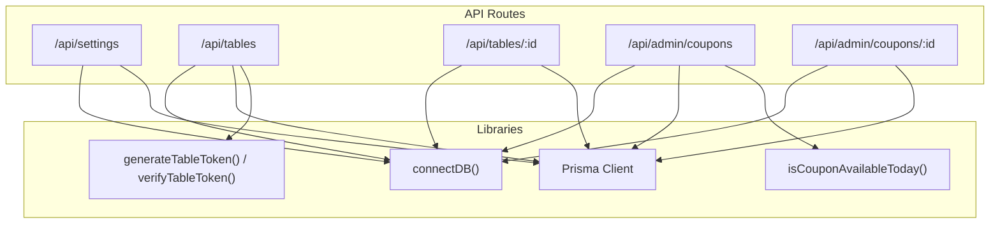
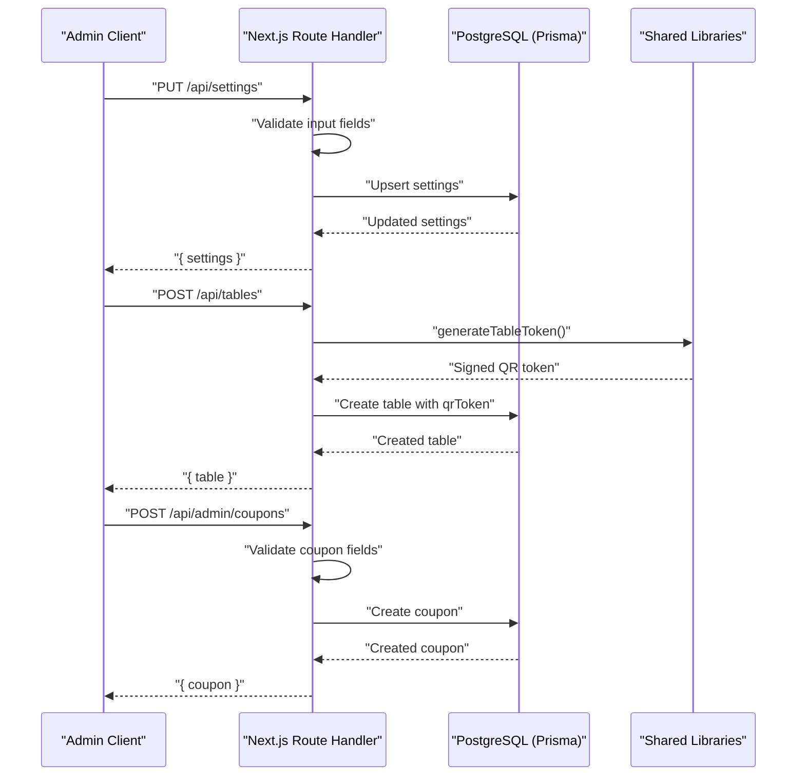
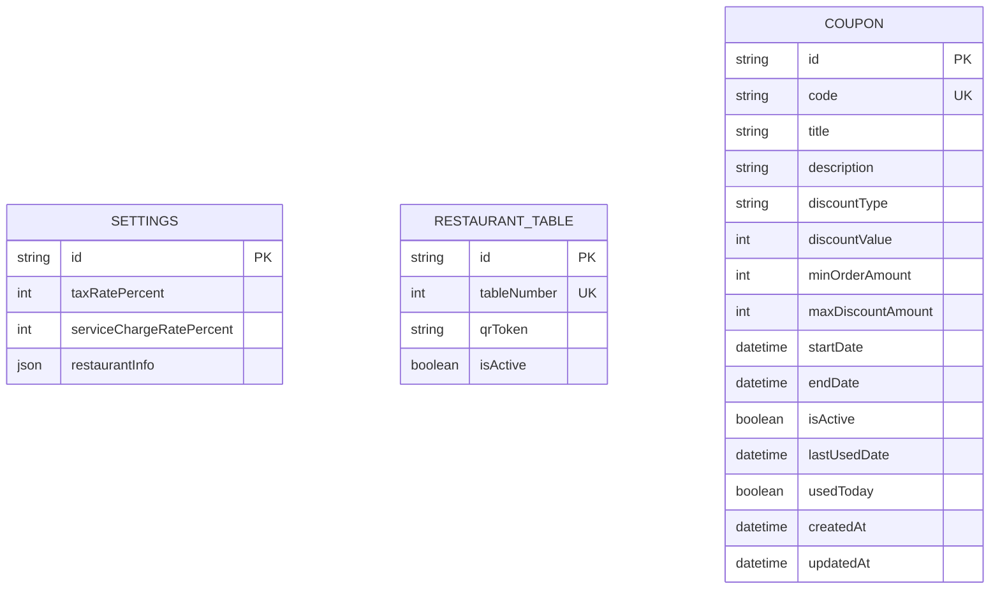
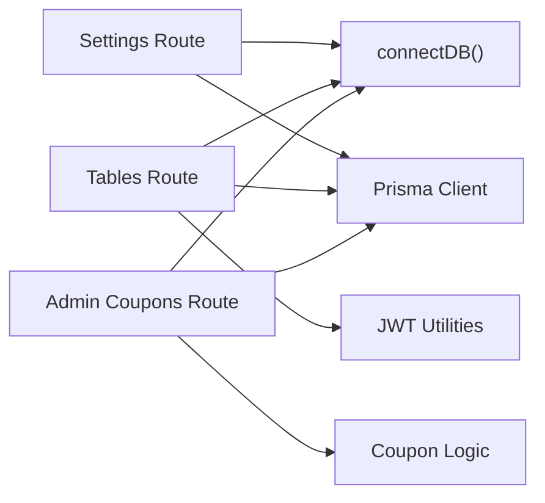

# Admin System API

<cite>
**Referenced Files in This Document**
- [route.ts](file://app/api/settings/route.ts)
- [route.ts](file://app/api/tables/route.ts)
- [route.ts](file://app/api/tables/[id]/route.ts)
- [route.ts](file://app/api/admin/coupons/route.ts)
- [route.ts](file://app/api/admin/coupons/[id]/route.ts)
- [jwt.ts](file://lib/jwt.ts)
- [coupon.ts](file://lib/coupon.ts)
- [schema.prisma](file://prisma/schema.prisma)
</cite>

## Table of Contents
1. [Introduction](#introduction)
2. [Project Structure](#project-structure)
3. [Core Components](#core-components)
4. [Architecture Overview](#architecture-overview)
5. [Detailed Component Analysis](#detailed-component-analysis)
6. [Dependency Analysis](#dependency-analysis)
7. [Performance Considerations](#performance-considerations)
8. [Troubleshooting Guide](#troubleshooting-guide)
9. [Conclusion](#conclusion)

## Introduction
This document describes the Admin System API endpoints that support administrative operations for settings management, table management, and admin-specific coupon operations. It explains request/response schemas, authentication and authorization considerations, and provides practical examples for updating restaurant settings, managing table configurations, and performing administrative tasks through the API.

The API is implemented as Next.js Route Handlers backed by Prisma and a PostgreSQL database. Some endpoints are public-facing (for example, listing tables), while others are intended for administrative use (for example, creating or updating coupons). Security guidance is provided to ensure these endpoints are protected appropriately in production.

## Project Structure
The Admin System API spans several route handlers under app/api:
- Settings management: app/api/settings
- Table management: app/api/tables and app/api/tables/[id]
- Admin coupon management: app/api/admin/coupons and app/api/admin/coupons/[id]

**Diagram sources**
- [route.ts:1-68](file://app/api/settings/route.ts#L1-L68)
- [route.ts:1-34](file://app/api/tables/route.ts#L1-L34)
- [route.ts:1-23](file://app/api/tables/[id]/route.ts#L1-L23)
- [route.ts:1-129](file://app/api/admin/coupons/route.ts#L1-L129)
- [route.ts:1-102](file://app/api/admin/coupons/[id]/route.ts#L1-L102)
- [jwt.ts:1-29](file://lib/jwt.ts#L1-L29)
- [coupon.ts:1-133](file://lib/coupon.ts#L1-L133)

**Section sources**
- [route.ts:1-68](file://app/api/settings/route.ts#L1-L68)
- [route.ts:1-34](file://app/api/tables/route.ts#L1-L34)
- [route.ts:1-23](file://app/api/tables/[id]/route.ts#L1-L23)
- [route.ts:1-129](file://app/api/admin/coupons/route.ts#L1-L129)
- [route.ts:1-102](file://app/api/admin/coupons/[id]/route.ts#L1-L102)

## Core Components
- Settings Management: Retrieve and update restaurant-wide settings such as tax rate, service charge rate, and restaurant info.
- Table Management: List all tables, create new tables with QR tokens, and delete tables by ID.
- Admin Coupon Operations: Create, list, update, toggle, and soft-delete coupons with validation and availability checks.

Key libraries:
- Database access via connectDB() and Prisma Client.
- JWT utilities for generating and verifying table QR tokens.
- Coupon business logic for availability and discount calculations.

**Section sources**
- [route.ts:1-68](file://app/api/settings/route.ts#L1-L68)
- [route.ts:1-34](file://app/api/tables/route.ts#L1-L34)
- [route.ts:1-23](file://app/api/tables/[id]/route.ts#L1-L23)
- [route.ts:1-129](file://app/api/admin/coupons/route.ts#L1-L129)
- [route.ts:1-102](file://app/api/admin/coupons/[id]/route.ts#L1-L102)
- [jwt.ts:1-29](file://lib/jwt.ts#L1-L29)
- [coupon.ts:1-133](file://lib/coupon.ts#L1-L133)

## Architecture Overview
The Admin System API follows a straightforward server-side architecture:
- HTTP requests arrive at Next.js Route Handlers.
- Handlers validate inputs, enforce business rules, and interact with the database using Prisma.
- For table creation, a signed QR token is generated using JWT utilities.
- For coupon operations, availability and discount calculations are performed using shared coupon logic.

**Diagram sources**
- [route.ts:19-67](file://app/api/settings/route.ts#L19-L67)
- [route.ts:18-33](file://app/api/tables/route.ts#L18-L33)
- [route.ts:29-128](file://app/api/admin/coupons/route.ts#L29-L128)
- [jwt.ts:15-17](file://lib/jwt.ts#L15-L17)

## Detailed Component Analysis

### Settings Management (/api/settings)
Purpose:
- GET: Retrieve current restaurant settings. If none exist, return static defaults.
- PUT: Update tax rate, service charge rate, and restaurant info with validation.

Request/Response Schemas:
- GET /api/settings
  - Response: { settings: object }
- PUT /api/settings
  - Request body (partial updates allowed):
    - taxRatePercent: number (0–100)
    - serviceChargeRatePercent: number (0–100)
    - restaurantInfo: object
  - Response: { settings: object }

Validation Rules:
- taxRatePercent must be a number between 0 and 100 if provided.
- serviceChargeRatePercent must be a number between 0 and 100 if provided.

Error Handling:
- Returns 400 for invalid numeric ranges.
- Returns 500 on unexpected errors.

Example Usage:
- Update restaurant settings:
  - Method: PUT
  - Endpoint: /api/settings
  - Body: { taxRatePercent: 12, serviceChargeRatePercent: 6, restaurantInfo: { name: "Sambal Restaurant", address: "Jakarta" } }
  - Expected response: { settings: { ...updated fields... } }

Security Considerations:
- These endpoints perform write operations and should be protected by an admin authentication mechanism (see Authentication & Authorization section).

**Section sources**
- [route.ts:6-17](file://app/api/settings/route.ts#L6-L17)
- [route.ts:19-67](file://app/api/settings/route.ts#L19-L67)

### Table Management (/api/tables, /api/tables/:id)
Purpose:
- GET /api/tables: List all tables ordered by tableNumber.
- POST /api/tables: Create a new table and generate a signed QR token.
- DELETE /api/tables/:id: Delete a table by its Prisma id.

Request/Response Schemas:
- GET /api/tables
  - Response: { tables: Array<{ id, tableNumber, qrToken, isActive }> }
- POST /api/tables
  - Request body: { tableNumber: number }
  - Response: { table: { id, tableNumber, qrToken, isActive } } with status 201
- DELETE /api/tables/:id
  - Path parameter: id (Prisma cuid)
  - Response: { success: boolean }

Business Logic:
- Creating a table generates a JWT-based QR token tied to the table’s id and number.
- Deleting a table returns 404 if not found; otherwise returns success.

Example Usage:
- Create a table:
  - Method: POST
  - Endpoint: /api/tables
  - Body: { tableNumber: 5 }
  - Expected response: { table: { id: "...", tableNumber: 5, qrToken: "...", isActive: true } }
- Delete a table:
  - Method: DELETE
  - Endpoint: /api/tables/{tableId}
  - Expected response: { success: true }

Security Considerations:
- Listing tables may be public depending on your application flow.
- Creating and deleting tables should be restricted to admins.

**Section sources**
- [route.ts:6-16](file://app/api/tables/route.ts#L6-L16)
- [route.ts:18-33](file://app/api/tables/route.ts#L18-L33)
- [route.ts:5-22](file://app/api/tables/[id]/route.ts#L5-L22)
- [jwt.ts:15-17](file://lib/jwt.ts#L15-L17)

### Admin Coupon Operations (/api/admin/coupons, /api/admin/coupons/:id)
Purpose:
- GET /api/admin/coupons: List all coupons with enrichment indicating availability today.
- POST /api/admin/coupons: Create a new coupon with comprehensive validation.
- PUT /api/admin/coupons/:id: Update coupon details with duplicate code checks and field validations.
- PATCH /api/admin/coupons/:id: Alias to PUT for toggling active state or quick updates.
- DELETE /api/admin/coupons/:id: Soft delete by setting isActive to false.

Request/Response Schemas:
- GET /api/admin/coupons
  - Response: { coupons: Array<{ ...fields, isAvailableToday: boolean }> }
- POST /api/admin/coupons
  - Request body:
    - code: string (required, unique, uppercase)
    - title: string (required)
    - description: string (optional)
    - discountType: "FIXED" | "PERCENTAGE"
    - discountValue: number (>0; <=100 for PERCENTAGE)
    - minOrderAmount: number (>=0)
    - maxDiscountAmount: number|null (only for PERCENTAGE)
    - startDate: date (ISO string)
    - endDate: date (ISO string; >= startDate)
    - isActive: boolean (optional, default true)
  - Response: { coupon: object } with status 201
- PUT /api/admin/coupons/:id
  - Request body: Partial fields from above
  - Response: { coupon: object }
- PATCH /api/admin/coupons/:id
  - Same behavior as PUT
- DELETE /api/admin/coupons/:id
  - Response: { success: boolean, message: string, coupon: object }

Validation Rules:
- Code uniqueness enforced.
- Title required.
- Discount value > 0; percentage capped at 100.
- Start/end dates required and valid; end date cannot precede start date.
- Numeric fields sanitized and clamped to non-negative values.

Availability Enrichment:
- isCouponAvailableToday uses lastUsedDate to determine if the coupon can be used again on the current calendar day.

Example Usage:
- Create a coupon:
  - Method: POST
  - Endpoint: /api/admin/coupons
  - Body: { code: "SUMMER2026", title: "Summer Promo", discountType: "PERCENTAGE", discountValue: 15, minOrderAmount: 100000, maxDiscountAmount: 50000, startDate: "2026-06-01T00:00:00Z", endDate: "2026-06-30T23:59:59Z" }
  - Expected response: { coupon: { ...created fields, isActive: true } }
- Update a coupon:
  - Method: PUT
  - Endpoint: /api/admin/coupons/{couponId}
  - Body: { isActive: false }
  - Expected response: { coupon: { ...updated fields } }
- Soft-delete a coupon:
  - Method: DELETE
  - Endpoint: /api/admin/coupons/{couponId}
  - Expected response: { success: true, message: "Kupon dinonaktifkan (soft delete).", coupon: { ... } }

Security Considerations:
- All admin coupon endpoints should be protected by admin authentication and authorization.

**Section sources**
- [route.ts:6-27](file://app/api/admin/coupons/route.ts#L6-L27)
- [route.ts:29-128](file://app/api/admin/coupons/route.ts#L29-L128)
- [route.ts:9-68](file://app/api/admin/coupons/[id]/route.ts#L9-L68)
- [route.ts:70-73](file://app/api/admin/coupons/[id]/route.ts#L70-L73)
- [route.ts:75-101](file://app/api/admin/coupons/[id]/route.ts#L75-L101)
- [coupon.ts:23-33](file://lib/coupon.ts#L23-L33)

### Data Models
The following models are relevant to the Admin System API:

**Diagram sources**
- [schema.prisma:78-106](file://prisma/schema.prisma#L78-L106)

**Section sources**
- [schema.prisma:38-45](file://prisma/schema.prisma#L38-L45)
- [schema.prisma:78-106](file://prisma/schema.prisma#L78-L106)

## Dependency Analysis
The Admin System API depends on:
- Database connectivity via connectDB().
- Prisma Client for data access.
- JWT utilities for table QR token generation and verification.
- Coupon business logic for availability checks and discount calculations.

**Diagram sources**
- [route.ts:1-68](file://app/api/settings/route.ts#L1-L68)
- [route.ts:1-34](file://app/api/tables/route.ts#L1-L34)
- [route.ts:1-129](file://app/api/admin/coupons/route.ts#L1-L129)
- [jwt.ts:1-29](file://lib/jwt.ts#L1-L29)
- [coupon.ts:1-133](file://lib/coupon.ts#L1-L133)

**Section sources**
- [route.ts:1-68](file://app/api/settings/route.ts#L1-L68)
- [route.ts:1-34](file://app/api/tables/route.ts#L1-L34)
- [route.ts:1-129](file://app/api/admin/coupons/route.ts#L1-L129)
- [jwt.ts:1-29](file://lib/jwt.ts#L1-L29)
- [coupon.ts:1-133](file://lib/coupon.ts#L1-L133)

## Performance Considerations
- Database connections: Ensure connectDB() establishes efficient connections and avoids unnecessary reconnections per request.
- Query optimization: Use Prisma relations and indexes where appropriate (for example, indexing frequently queried fields like isActive and code).
- Token generation: JWT signing is lightweight but should be avoided in tight loops; batch operations should minimize repeated calls.
- Input validation: Early validation reduces unnecessary database writes and improves throughput.

[No sources needed since this section provides general guidance]

## Troubleshooting Guide
Common issues and resolutions:
- Invalid numeric ranges for settings:
  - Symptom: 400 error when updating taxRatePercent or serviceChargeRatePercent outside 0–100.
  - Resolution: Validate inputs before sending requests.
- Missing or invalid dates for coupons:
  - Symptom: 400 error when startDate or endDate are missing, invalid, or endDate < startDate.
  - Resolution: Provide valid ISO date strings and ensure correct ordering.
- Duplicate coupon codes:
  - Symptom: 400 error indicating code already exists.
  - Resolution: Choose a unique code or update existing coupon instead of creating a new one.
- Table not found during deletion:
  - Symptom: 404 error when deleting a table by id.
  - Resolution: Verify the id corresponds to an existing record.

**Section sources**
- [route.ts:25-43](file://app/api/settings/route.ts#L25-L43)
- [route.ts:70-92](file://app/api/admin/coupons/route.ts#L70-L92)
- [route.ts:94-103](file://app/api/admin/coupons/route.ts#L94-L103)
- [route.ts:15-21](file://app/api/tables/[id]/route.ts#L15-L21)

## Conclusion
The Admin System API provides essential administrative capabilities for managing restaurant settings, tables, and coupons. Endpoints implement robust input validation, business rule enforcement, and clear error responses. To secure administrative operations, integrate an authentication and authorization layer that restricts access to authorized admin users or services. Following the examples and guidelines in this document will help you confidently manage configuration, table layouts, and promotional campaigns through the API.

[No sources needed since this section summarizes without analyzing specific files]