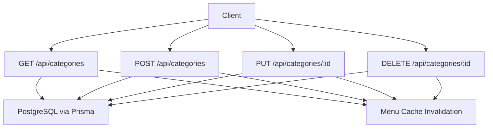
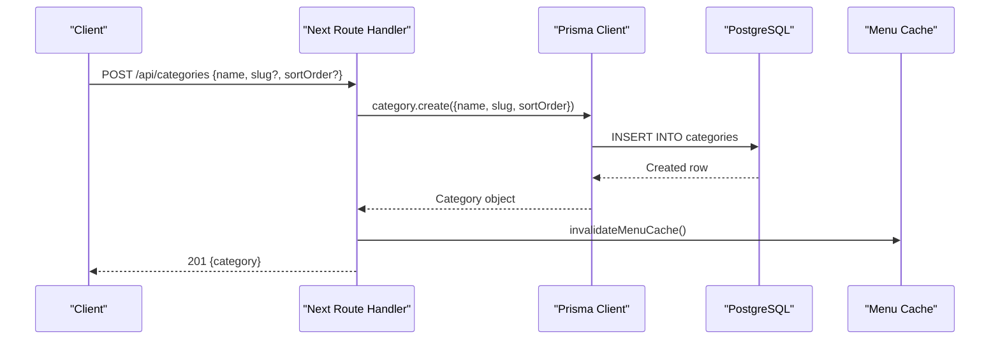
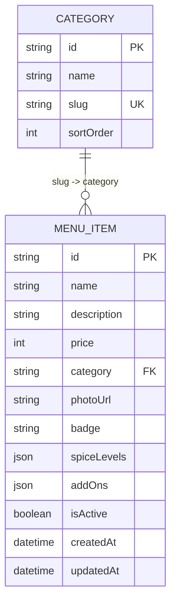
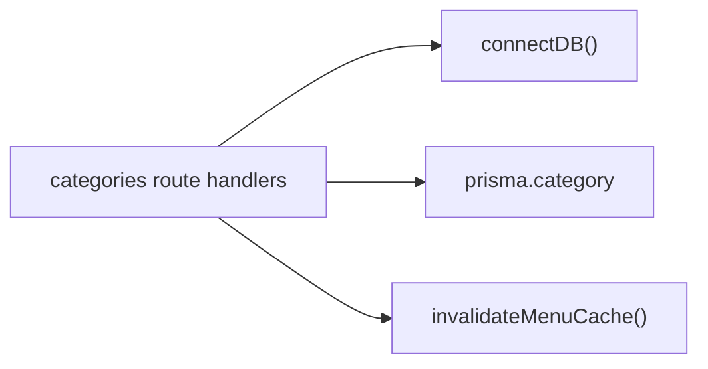

# Categories API Endpoints

<cite>
**Referenced Files in This Document**
- [route.ts](file://app/api/categories/route.ts)
- [route.ts](file://app/api/categories/[id]/route.ts)
- [schema.prisma](file://prisma/schema.prisma)
- [route.ts](file://app/api/menu/route.ts)
- [types.ts](file://lib/types.ts)
</cite>

## Table of Contents
1. [Introduction](#introduction)
2. [Project Structure](#project-structure)
3. [Core Components](#core-components)
4. [Architecture Overview](#architecture-overview)
5. [Detailed Component Analysis](#detailed-component-analysis)
6. [Dependency Analysis](#dependency-analysis)
7. [Performance Considerations](#performance-considerations)
8. [Troubleshooting Guide](#troubleshooting-guide)
9. [Conclusion](#conclusion)

## Introduction
This document describes the Categories API endpoints that manage menu categories. It covers CRUD operations (create, read, update, delete), request/response schemas, sorting behavior, and how categories relate to menu items for organizing menus. It also includes practical examples for managing category hierarchies, updating metadata, and querying categories for menu organization.

## Project Structure
The Categories API is implemented as Next.js Route Handlers under app/api/categories:
- GET/POST /api/categories — list all categories and create a new category
- PUT/DELETE /api/categories/:id — update or delete a specific category

**Diagram sources**
- [route.ts:7-18](file://app/api/categories/route.ts#L7-L18)
- [route.ts:20-46](file://app/api/categories/route.ts#L20-L46)
- [route.ts:7-32](file://app/api/categories/[id]/route.ts#L7-L32)
- [route.ts:34-52](file://app/api/categories/[id]/route.ts#L34-L52)

**Section sources**
- [route.ts:7-46](file://app/api/categories/route.ts#L7-L46)
- [route.ts:7-52](file://app/api/categories/[id]/route.ts#L7-L52)

## Core Components
- Category model fields: id, name, slug, sortOrder
- Menu item relationship: MenuItem.category stores the category slug; categories are ordered by sortOrder
- Sorting: All category lists are returned sorted ascending by sortOrder
- Cache invalidation: Any mutation triggers cache invalidation to keep menu data fresh

**Section sources**
- [schema.prisma:11-18](file://prisma/schema.prisma#L11-L18)
- [schema.prisma:20-36](file://prisma/schema.prisma#L20-L36)
- [route.ts:10-12](file://app/api/categories/route.ts#L10-L12)
- [route.ts:35-40](file://app/api/categories/route.ts#L35-L40)
- [route.ts:15-24](file://app/api/categories/[id]/route.ts#L15-L24)

## Architecture Overview
The Categories API follows a simple REST pattern backed by Prisma ORM and PostgreSQL. Mutations invalidate an in-memory menu cache so downstream consumers see updated categories immediately.

**Diagram sources**
- [route.ts:20-46](file://app/api/categories/route.ts#L20-L46)

## Detailed Component Analysis

### GET /api/categories
- Purpose: Retrieve all categories sorted by sortOrder ascending
- Request: None
- Response: JSON with a categories array
- Error handling: Returns a generic error response on failure

Request
- Method: GET
- Path: /api/categories
- Headers: None required

Response
- Status: 200 OK
- Body:
  - categories: Array of category objects

Category object fields
- id: string
- name: string
- slug: string
- sortOrder: number

Example response structure
- { categories: [{ id, name, slug, sortOrder }, ...] }

Notes
- Ordering is always ascending by sortOrder
- No pagination or filtering parameters are supported

**Section sources**
- [route.ts:7-18](file://app/api/categories/route.ts#L7-L18)
- [schema.prisma:11-18](file://prisma/schema.prisma#L11-L18)

### POST /api/categories
- Purpose: Create a new category
- Validation: name is required and must be a non-empty string
- Slug generation: If not provided, slug is auto-generated from name
- Sort order: If not provided, defaults to current count of categories

Request
- Method: POST
- Path: /api/categories
- Headers: Content-Type: application/json
- Body:
  - name: string (required)
  - slug: string (optional)
  - sortOrder: number (optional)

Validation rules
- name must be present and a non-empty string
- slug is optional; if omitted, it will be derived from name
- sortOrder is optional; if omitted, it defaults to the existing category count

Response
- Success: 201 Created
  - Body: { category: Category }
- Validation error: 400 Bad Request
  - Body: { error: string }
- Server error: 500 Internal Server Error
  - Body: { error: string }

Example request body
- { name: "Appetizers", slug: "appetizers", sortOrder: 1 }

Example success response
- { category: { id, name, slug, sortOrder } }

Behavior notes
- Auto-generated slug uses lowercase and removes non-alphanumeric characters except hyphens
- After creation, menu cache is invalidated

**Section sources**
- [route.ts:20-46](file://app/api/categories/route.ts#L20-L46)
- [schema.prisma:11-18](file://prisma/schema.prisma#L11-L18)

### PUT /api/categories/:id
- Purpose: Update an existing category’s metadata
- Supported fields: name, slug, sortOrder (all optional)
- Not found handling: Returns 404 when the category does not exist

Request
- Method: PUT
- Path: /api/categories/:id
- Headers: Content-Type: application/json
- Body:
  - name: string (optional)
  - slug: string (optional)
  - sortOrder: number (optional)

Response
- Success: 200 OK
  - Body: { category: Category }
- Not found: 404 Not Found
  - Body: { error: string }
- Server error: 500 Internal Server Error
  - Body: { error: string }

Example request body
- { name: "Main Courses", sortOrder: 2 }

Behavior notes
- Only provided fields are updated
- After update, menu cache is invalidated

**Section sources**
- [route.ts:7-32](file://app/api/categories/[id]/route.ts#L7-L32)
- [schema.prisma:11-18](file://prisma/schema.prisma#L11-L18)

### DELETE /api/categories/:id
- Purpose: Delete a category by id
- Not found handling: Returns 404 when the category does not exist

Request
- Method: DELETE
- Path: /api/categories/:id
- Headers: None required

Response
- Success: 200 OK
  - Body: { success: true }
- Not found: 404 Not Found
  - Body: { error: string }
- Server error: 500 Internal Server Error
  - Body: { error: string }

Behavior notes
- After deletion, menu cache is invalidated

**Section sources**
- [route.ts:34-52](file://app/api/categories/[id]/route.ts#L34-L52)

### Data Model and Relationships
- Category fields: id, name, slug, sortOrder
- MenuItem.category stores the category slug, linking menu items to categories
- Menu listing endpoint returns both active menu items and categories, enabling client-side grouping by category slug

**Diagram sources**
- [schema.prisma:11-18](file://prisma/schema.prisma#L11-L18)
- [schema.prisma:20-36](file://prisma/schema.prisma#L20-L36)

**Section sources**
- [schema.prisma:11-36](file://prisma/schema.prisma#L11-L36)
- [route.ts:23-47](file://app/api/menu/route.ts#L23-L47)

### Sorting Options
- Categories are always returned sorted by sortOrder ascending
- sortOrder can be set during creation or updated later via PUT
- Default sortOrder on creation is the current count of categories if not provided

Usage patterns
- To place a category first, set sortOrder to a low value (e.g., 0 or 1)
- To reorder categories, update sortOrder values accordingly

**Section sources**
- [route.ts:10-12](file://app/api/categories/route.ts#L10-L12)
- [route.ts:35-40](file://app/api/categories/route.ts#L35-L40)
- [route.ts:15-24](file://app/api/categories/[id]/route.ts#L15-L24)

### Managing Category Hierarchies
Categories are flat entities with no parent-child relationships. Hierarchy is achieved through ordering using sortOrder and grouping menu items by category slug.

Recommended approach
- Use sortOrder to define top-level groupings
- Group menu items by category.slug on the client side
- Keep slugs stable and unique to maintain consistent references across menu items

**Section sources**
- [schema.prisma:11-18](file://prisma/schema.prisma#L11-L18)
- [schema.prisma:20-36](file://prisma/schema.prisma#L20-L36)

### Updating Category Metadata
You can update any combination of name, slug, and sortOrder via PUT /api/categories/:id.

Examples
- Rename a category: { name: "Beverages" }
- Change sort position: { sortOrder: 3 }
- Update slug safely: { slug: "beverages" }

After any update, the menu cache is invalidated to reflect changes immediately.

**Section sources**
- [route.ts:15-24](file://app/api/categories/[id]/route.ts#L15-L24)

### Querying Categories for Menu Organization
- Use GET /api/categories to retrieve all categories in display order
- Use GET /api/menu to retrieve active menu items along with categories for grouping
- The menu endpoint selects relevant fields and orders categories by sortOrder

Typical workflow
- Fetch categories to build navigation or filters
- Fetch menu items to populate listings grouped by category.slug

**Section sources**
- [route.ts:7-18](file://app/api/categories/route.ts#L7-L18)
- [route.ts:6-47](file://app/api/menu/route.ts#L6-L47)

## Dependency Analysis
The Categories API depends on:
- Database connection initialization
- Prisma ORM for data access
- Menu cache invalidation utility to keep related data consistent

**Diagram sources**
- [route.ts:1-4](file://app/api/categories/route.ts#L1-L4)
- [route.ts:1-4](file://app/api/categories/[id]/route.ts#L1-L4)

**Section sources**
- [route.ts:1-4](file://app/api/categories/route.ts#L1-L4)
- [route.ts:1-4](file://app/api/categories/[id]/route.ts#L1-L4)

## Performance Considerations
- Reading categories is lightweight and sorted at the database level
- Mutations trigger cache invalidation to ensure subsequent reads return fresh data
- Avoid frequent reordering updates unless necessary to minimize cache churn

[No sources needed since this section provides general guidance]

## Troubleshooting Guide
Common issues and resolutions:
- Missing or empty name on create: Ensure name is a non-empty string
- Unexpected slug: Provide slug explicitly if you need a specific value
- Category not found on update/delete: Verify the id exists before mutating
- Stale menu data after mutations: Confirm cache invalidation is triggered (it is automatically)

Error responses
- 400: Validation errors (e.g., missing name)
- 404: Resource not found (update/delete)
- 500: Server errors with a descriptive message

**Section sources**
- [route.ts:26-28](file://app/api/categories/route.ts#L26-L28)
- [route.ts:25-31](file://app/api/categories/[id]/route.ts#L25-L31)
- [route.ts:45-51](file://app/api/categories/[id]/route.ts#L45-L51)

## Conclusion
The Categories API provides straightforward CRUD operations for menu categories with deterministic ordering via sortOrder. Categories link to menu items through the category slug field, enabling flexible menu organization. Mutations automatically invalidate the menu cache to keep the system consistent.

[No sources needed since this section summarizes without analyzing specific files]