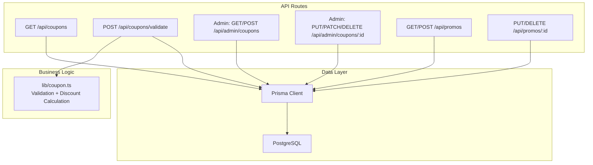
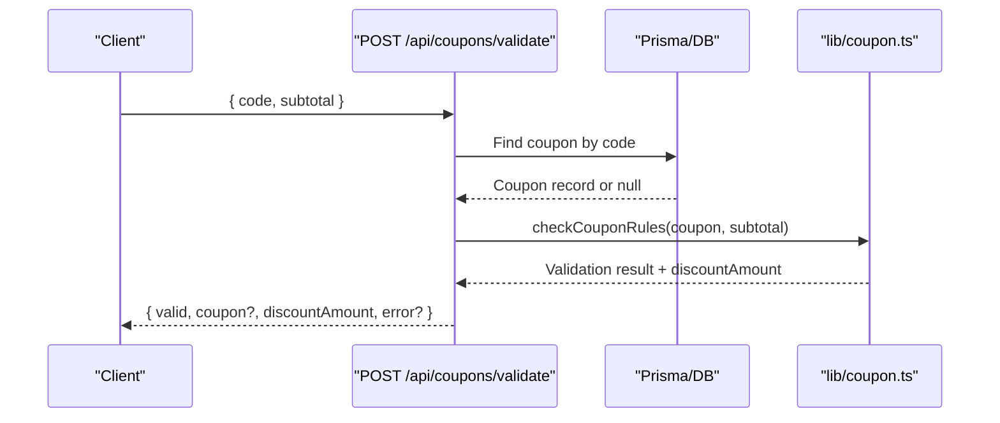
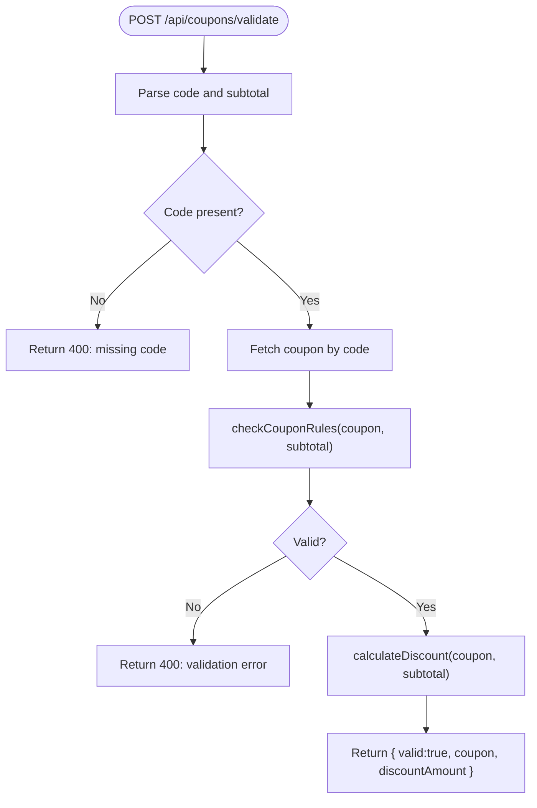
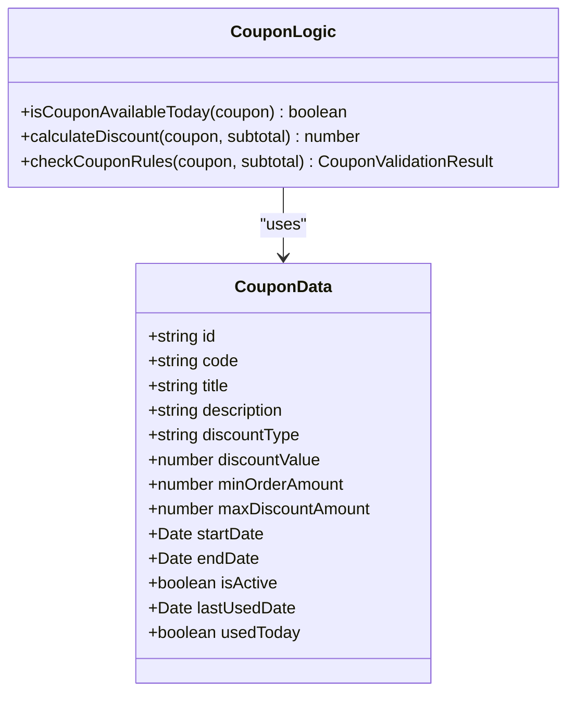
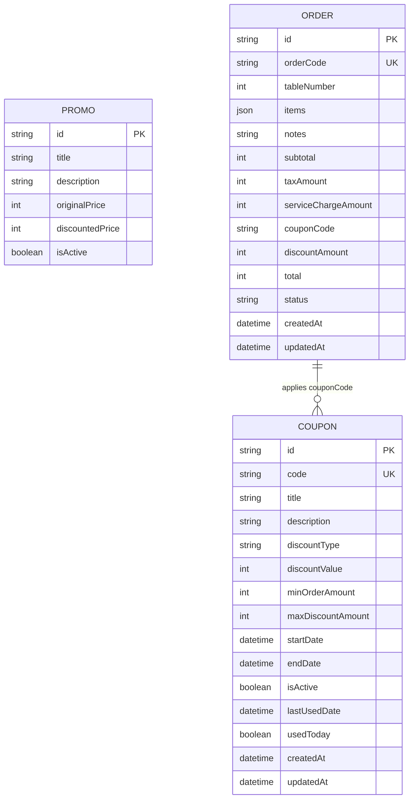
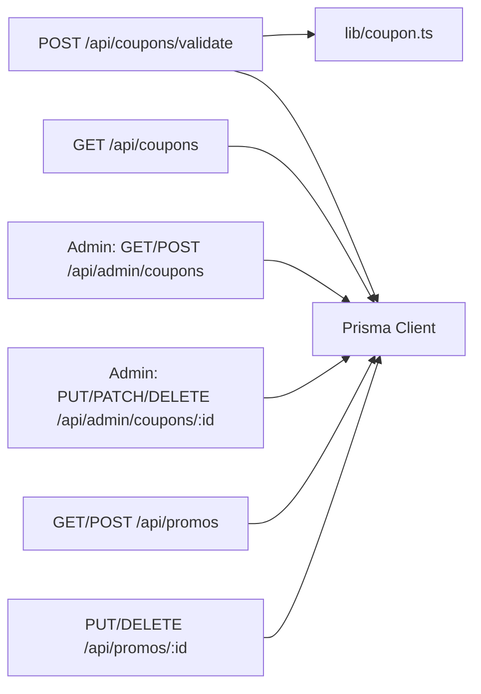

# Coupons & Promotions API

<cite>
**Referenced Files in This Document**
- [coupon.ts](file://lib/coupon.ts)
- [route.ts (coupons list)](file://app/api/coupons/route.ts)
- [route.ts (coupon validation)](file://app/api/coupons/validate/route.ts)
- [route.ts (admin coupons)](file://app/api/admin/coupons/route.ts)
- [route.ts (admin coupon by id)](file://app/api/admin/coupons/[id]/route.ts)
- [route.ts (promos list and create)](file://app/api/promos/route.ts)
- [route.ts (promo by id)](file://app/api/promos/[id]/route.ts)
- [schema.prisma](file://prisma/schema.prisma)
</cite>

## Table of Contents
1. [Introduction](#introduction)
2. [Project Structure](#project-structure)
3. [Core Components](#core-components)
4. [Architecture Overview](#architecture-overview)
5. [Detailed Component Analysis](#detailed-component-analysis)
6. [Dependency Analysis](#dependency-analysis)
7. [Performance Considerations](#performance-considerations)
8. [Troubleshooting Guide](#troubleshooting-guide)
9. [Conclusion](#conclusion)

## Introduction
This document describes the Coupons and Promotions API endpoints, including coupon validation, discount calculation, and promotional pricing systems. It explains request/response schemas for coupon codes, promotion rules, and discount application logic. It also documents business rules such as usage limits, expiration handling, and eligibility criteria.

The system supports:
- Listing active coupons available today
- Validating a coupon code against cart subtotal and business rules
- Admin CRUD operations for coupons with soft delete
- Managing promotional items with original and discounted prices

## Project Structure
The relevant implementation is organized into:
- Business logic for coupons and discounts under lib
- Next.js App Router API routes for public and admin endpoints
- Prisma schema defining database models

**Diagram sources**
- [route.ts (coupons list):1-33](file://app/api/coupons/route.ts#L1-L33)
- [route.ts (coupon validation):1-57](file://app/api/coupons/validate/route.ts#L1-L57)
- [route.ts (admin coupons):1-129](file://app/api/admin/coupons/route.ts#L1-L129)
- [route.ts (admin coupon by id):1-102](file://app/api/admin/coupons/[id]/route.ts#L1-L102)
- [route.ts (promos list and create):1-38](file://app/api/promos/route.ts#L1-L38)
- [route.ts (promo by id):1-52](file://app/api/promos/[id]/route.ts#L1-L52)
- [coupon.ts:1-133](file://lib/coupon.ts#L1-L133)

**Section sources**
- [route.ts (coupons list):1-33](file://app/api/coupons/route.ts#L1-L33)
- [route.ts (coupon validation):1-57](file://app/api/coupons/validate/route.ts#L1-L57)
- [route.ts (admin coupons):1-129](file://app/api/admin/coupons/route.ts#L1-L129)
- [route.ts (admin coupon by id):1-102](file://app/api/admin/coupons/[id]/route.ts#L1-L102)
- [route.ts (promos list and create):1-38](file://app/api/promos/route.ts#L1-L38)
- [route.ts (promo by id):1-52](file://app/api/promos/[id]/route.ts#L1-L52)
- [coupon.ts:1-133](file://lib/coupon.ts#L1-L133)

## Core Components
- Coupon validation and discount calculation are implemented in lib/coupon.ts.
- Public endpoints expose listing and validation of coupons.
- Admin endpoints manage coupon lifecycle and visibility.
- Promos endpoints manage promotional pricing records.

Key responsibilities:
- Validate coupon codes against activation status, date range, daily usage, and minimum order amount.
- Compute discount amounts for percentage or fixed discounts with optional caps.
- Provide admin controls to create, update, toggle, and soft-delete coupons.
- Manage promotional items with original and discounted prices.

**Section sources**
- [coupon.ts:1-133](file://lib/coupon.ts#L1-L133)
- [route.ts (coupons list):1-33](file://app/api/coupons/route.ts#L1-L33)
- [route.ts (coupon validation):1-57](file://app/api/coupons/validate/route.ts#L1-L57)
- [route.ts (admin coupons):1-129](file://app/api/admin/coupons/route.ts#L1-L129)
- [route.ts (admin coupon by id):1-102](file://app/api/admin/coupons/[id]/route.ts#L1-L102)
- [route.ts (promos list and create):1-38](file://app/api/promos/route.ts#L1-L38)
- [route.ts (promo by id):1-52](file://app/api/promos/[id]/route.ts#L1-L52)

## Architecture Overview
The API follows a layered approach:
- API routes handle HTTP requests, parse inputs, and return JSON responses.
- Business logic encapsulates validation and discount calculations.
- Data access uses Prisma to interact with PostgreSQL.

**Diagram sources**
- [route.ts (coupon validation):1-57](file://app/api/coupons/validate/route.ts#L1-L57)
- [coupon.ts:77-132](file://lib/coupon.ts#L77-L132)

## Detailed Component Analysis

### Coupon Validation Endpoint
Endpoint: POST /api/coupons/validate
Purpose: Validate a coupon code against the current cart subtotal and return the applicable discount.

Request body:
- code: string (required; trimmed and uppercased)
- subtotal: number (required; non-negative integer)

Response on success:
- valid: true
- coupon: object with id, code, title, description, discountType, discountValue, minOrderAmount, maxDiscountAmount
- discountAmount: number

Response on failure:
- valid: false
- error: string describing why validation failed

Business rules enforced:
- Coupon must exist and be active
- Current time must be within startDate and endDate
- Coupon cannot be used more than once per calendar day (based on lastUsedDate)
- Subtotal must meet minOrderAmount
- Discount computed via calculateDiscount

Error handling:
- Missing code returns 400
- Validation failures return 400
- Server errors return 500

**Diagram sources**
- [route.ts (coupon validation):1-57](file://app/api/coupons/validate/route.ts#L1-L57)
- [coupon.ts:77-132](file://lib/coupon.ts#L77-L132)

**Section sources**
- [route.ts (coupon validation):1-57](file://app/api/coupons/validate/route.ts#L1-L57)
- [coupon.ts:77-132](file://lib/coupon.ts#L77-L132)

### Coupon Listing Endpoint
Endpoint: GET /api/coupons
Purpose: Return active coupons that are currently within their validity period and available today.

Query parameters: none
Response:
- coupons: array of coupon objects filtered by isActive, startDate <= now <= endDate, and not used today

Notes:
- Uses isCouponAvailableToday to exclude coupons already used today
- Orders by createdAt descending

**Section sources**
- [route.ts (coupons list):1-33](file://app/api/coupons/route.ts#L1-L33)
- [coupon.ts:19-33](file://lib/coupon.ts#L19-L33)

### Admin Coupon Management Endpoints
Endpoints:
- GET /api/admin/coupons
- POST /api/admin/coupons
- PUT /api/admin/coupons/:id
- PATCH /api/admin/coupons/:id
- DELETE /api/admin/coupons/:id

Responsibilities:
- List all coupons with an additional isAvailableToday flag
- Create new coupons with validation for required fields, date ranges, duplicate codes, and discount constraints
- Update coupon details with field-level validation and duplicate code checks
- Toggle active state via PATCH (delegates to PUT)
- Soft delete via DELETE (sets isActive = false)

Validation highlights:
- Code and title required
- discountValue > 0
- For PERCENTAGE, discountValue <= 100
- startDate and endDate required and endDate >= startDate
- Duplicate code detection

Responses:
- Success returns created/updated coupon
- Validation errors return 400 with descriptive messages
- Not found returns 404 for updates/deletes
- Server errors return 500

**Section sources**
- [route.ts (admin coupons):1-129](file://app/api/admin/coupons/route.ts#L1-L129)
- [route.ts (admin coupon by id):1-102](file://app/api/admin/coupons/[id]/route.ts#L1-L102)

### Promotional Pricing Endpoints
Endpoints:
- GET /api/promos
- POST /api/promos
- PUT /api/promos/:id
- DELETE /api/promos/:id

Responsibilities:
- List promos; optionally include inactive promos via query parameter all=true
- Create promo with title, description, originalPrice, discountedPrice, and isActive
- Update promo fields partially
- Delete promo

Responses:
- Success returns promo object(s)
- Not found returns 404 for updates/deletes
- Server errors return 500

**Section sources**
- [route.ts (promos list and create):1-38](file://app/api/promos/route.ts#L1-L38)
- [route.ts (promo by id):1-52](file://app/api/promos/[id]/route.ts#L1-L52)

### Business Logic: Coupon Validation and Discount Calculation
Functions:
- isCouponAvailableToday(coupon): Determines if a coupon can be used today based on lastUsedDate. Resets automatically each calendar day.
- calculateDiscount(coupon, subtotal): Computes discount amount based on discountType (PERCENTAGE or FIXED), discountValue, and optional maxDiscountAmount. Ensures discount does not exceed subtotal and is non-negative.
- checkCouponRules(coupon, subtotal): Validates coupon against business rules and returns a typed result with either valid coupon data and discountAmount or an error message.

Business rules:
- Activation: coupon must be active
- Date range: current time must be between startDate and endDate
- Daily usage limit: one use per calendar day
- Minimum order amount: subtotal must meet minOrderAmount
- Discount cap: for percentage discounts, maxDiscountAmount may cap the discount

Complexity:
- All functions operate in O(1) time relative to input size.

**Diagram sources**
- [coupon.ts:3-17](file://lib/coupon.ts#L3-L17)
- [coupon.ts:19-132](file://lib/coupon.ts#L19-L132)

**Section sources**
- [coupon.ts:1-133](file://lib/coupon.ts#L1-L133)

### Database Models
Models relevant to coupons and promotions:
- Coupon: stores coupon metadata, discount configuration, validity window, and usage tracking
- Promo: stores promotional item pricing
- Order: includes coupon-related fields for recording applied discounts

**Diagram sources**
- [schema.prisma:47-97](file://prisma/schema.prisma#L47-L97)
- [schema.prisma:58-76](file://prisma/schema.prisma#L58-L76)

**Section sources**
- [schema.prisma:47-97](file://prisma/schema.prisma#L47-L97)
- [schema.prisma:58-76](file://prisma/schema.prisma#L58-L76)

## Dependency Analysis
- API routes depend on Prisma client for data access.
- Coupon validation endpoint depends on lib/coupon.ts for business rules.
- Admin endpoints perform additional validations before persisting changes.
- Promos endpoints are independent of coupon logic but share the same data layer.

**Diagram sources**
- [route.ts (coupon validation):1-57](file://app/api/coupons/validate/route.ts#L1-L57)
- [route.ts (coupons list):1-33](file://app/api/coupons/route.ts#L1-L33)
- [route.ts (admin coupons):1-129](file://app/api/admin/coupons/route.ts#L1-L129)
- [route.ts (admin coupon by id):1-102](file://app/api/admin/coupons/[id]/route.ts#L1-L102)
- [route.ts (promos list and create):1-38](file://app/api/promos/route.ts#L1-L38)
- [route.ts (promo by id):1-52](file://app/api/promos/[id]/route.ts#L1-L52)

**Section sources**
- [route.ts (coupon validation):1-57](file://app/api/coupons/validate/route.ts#L1-L57)
- [route.ts (coupons list):1-33](file://app/api/coupons/route.ts#L1-L33)
- [route.ts (admin coupons):1-129](file://app/api/admin/coupons/route.ts#L1-L129)
- [route.ts (admin coupon by id):1-102](file://app/api/admin/coupons/[id]/route.ts#L1-L102)
- [route.ts (promos list and create):1-38](file://app/api/promos/route.ts#L1-L38)
- [route.ts (promo by id):1-52](file://app/api/promos/[id]/route.ts#L1-L52)

## Performance Considerations
- Coupon validation performs a single database lookup followed by constant-time business rule checks.
- Listing coupons filters by active status and date range at the database level, then applies a lightweight in-memory filter for daily availability.
- Admin endpoints should consider pagination for large coupon catalogs to reduce payload sizes.
- Promos endpoints are simple CRUD operations; indexing on isActive can improve list performance when filtering active promos.

[No sources needed since this section provides general guidance]

## Troubleshooting Guide
Common issues and resolutions:
- Missing coupon code: Ensure the request includes a non-empty code field. The endpoint trims and uppercases the code before lookup.
- Invalid date formats: Admin creation/update requires valid ISO date strings; invalid dates return 400.
- Duplicate coupon code: The server checks uniqueness; ensure the code is unique across existing coupons.
- Expiration or pre-start dates: Validation rejects coupons outside their startDate and endDate windows.
- Daily usage limit: If a coupon was used earlier on the same calendar day, it will be rejected until the next day.
- Minimum order amount: Subtotal must meet or exceed minOrderAmount; otherwise, validation fails with a descriptive error.
- Percentage discount over 100%: Admin creation/update enforces discountValue <= 100 for PERCENTAGE type.

Server-side error handling:
- Validation failures return 400 with human-readable error messages.
- Not found conditions return 404 for specific resource updates/deletes.
- Unexpected errors return 500 with generic messages.

**Section sources**
- [route.ts (coupon validation):1-57](file://app/api/coupons/validate/route.ts#L1-L57)
- [route.ts (admin coupons):1-129](file://app/api/admin/coupons/route.ts#L1-L129)
- [route.ts (admin coupon by id):1-102](file://app/api/admin/coupons/[id]/route.ts#L1-L102)
- [route.ts (promo by id):1-52](file://app/api/promos/[id]/route.ts#L1-L52)

## Conclusion
The Coupons and Promotions API provides robust validation and discount calculation for coupon-based promotions, along with administrative controls for managing coupon campaigns and promotional pricing. The design separates concerns between API routing, business logic, and data persistence, enabling clear maintenance and extensibility. Clients should adhere to the documented request/response schemas and business rules to ensure correct integration.

[No sources needed since this section summarizes without analyzing specific files]