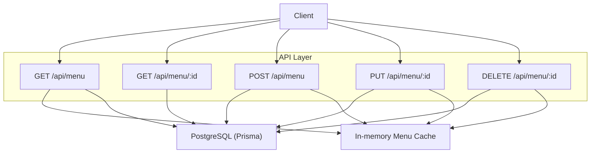
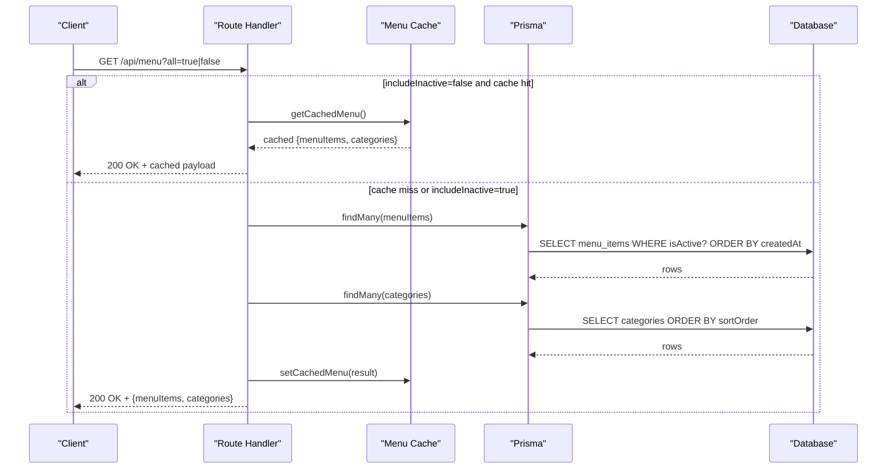
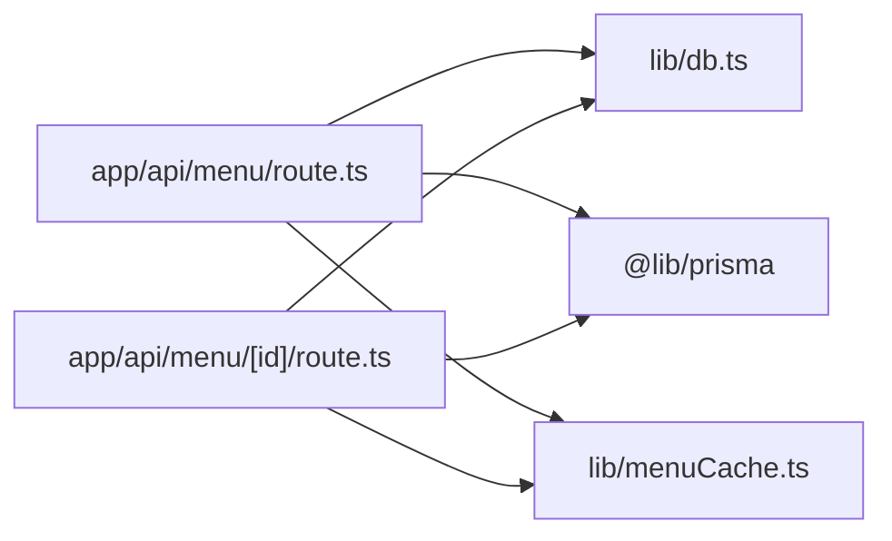

# Menu API Endpoints

<cite>
**Referenced Files in This Document**
- [route.ts](file://app/api/menu/route.ts)
- [route.ts](file://app/api/menu/[id]/route.ts)
- [types.ts](file://lib/types.ts)
- [menuCache.ts](file://lib/menuCache.ts)
- [schema.prisma](file://prisma/schema.prisma)
</cite>

## Table of Contents
1. [Introduction](#introduction)
2. [Project Structure](#project-structure)
3. [Core Components](#core-components)
4. [Architecture Overview](#architecture-overview)
5. [Detailed Component Analysis](#detailed-component-analysis)
6. [Dependency Analysis](#dependency-analysis)
7. [Performance Considerations](#performance-considerations)
8. [Troubleshooting Guide](#troubleshooting-guide)
9. [Conclusion](#conclusion)

## Introduction
This document describes the Menu API endpoints for managing menu items and categories. It covers all supported HTTP methods, request/response schemas, parameter validation, error handling patterns, caching behavior, and practical usage examples. The API supports:
- Listing active menu items and categories
- Fetching a single menu item by ID
- Creating new menu items
- Updating existing menu items
- Deleting menu items
- Filtering by availability status via query parameters
- Category filtering is provided through the returned category list; client-side filtering is used in the UI

## Project Structure
The Menu API is implemented as Next.js App Router route handlers under `app/api/menu`. There are two files:
- `app/api/menu/route.ts` — handles GET (list) and POST (create)
- `app/api/menu/[id]/route.ts` — handles GET (by ID), PUT (update), DELETE (remove)



**Diagram sources**
- [route.ts:7-65](file://app/api/menu/route.ts#L7-L65)
- [route.ts:67-108](file://app/api/menu/route.ts#L67-L108)
- [route.ts:6-20](file://app/api/menu/[id]/route.ts#L6-L20)
- [route.ts:22-63](file://app/api/menu/[id]/route.ts#L22-L63)
- [route.ts:65-80](file://app/api/menu/[id]/route.ts#L65-L80)
- [menuCache.ts:24-46](file://lib/menuCache.ts#L24-L46)

**Section sources**
- [route.ts:1-109](file://app/api/menu/route.ts#L1-L109)
- [route.ts:1-81](file://app/api/menu/[id]/route.ts#L1-L81)

## Core Components
- Route handlers implement RESTful operations for menu items and categories.
- Data models are defined in Prisma schema and TypeScript interfaces.
- An in-memory cache speeds up public reads and is invalidated on mutations.

Key data structures:
- Menu Item: id, name, description, price, category, photoUrl, badge, spiceLevels, addOns, isActive, createdAt/updatedAt
- Category: id, name, slug, sortOrder

**Section sources**
- [types.ts:6-38](file://lib/types.ts#L6-L38)
- [schema.prisma:11-36](file://prisma/schema.prisma#L11-L36)

## Architecture Overview
The Menu API follows a simple layered architecture:
- HTTP layer: Next.js route handlers parse requests, validate inputs, and return JSON responses.
- Service/data layer: Prisma queries against PostgreSQL.
- Cache layer: In-memory cache stores recent menu lists to reduce database load.



**Diagram sources**
- [route.ts:7-65](file://app/api/menu/route.ts#L7-L65)
- [menuCache.ts:24-42](file://lib/menuCache.ts#L24-L42)

## Detailed Component Analysis

### GET /api/menu
Lists menu items and categories. Supports optional query parameter:
- `all` (boolean string): When set to `true`, includes inactive items; otherwise returns only active items.

Behavior:
- If `all=false` (default), attempts to serve from in-memory cache first.
- On cache miss or when `all=true`, queries both `menuItem` and `category` tables concurrently.
- Returns `{ menuItems, categories }`.
- Sets `X-Cache` header to indicate cache HIT or MISS.

Request
- Method: GET
- Path: `/api/menu`
- Query Parameters:
  - `all`: boolean string (`true` or other). Default behavior excludes inactive items.

Response
- 200 OK: JSON object with fields:
  - `menuItems`: array of menu items (selected fields)
  - `categories`: array of categories (selected fields)
- Headers:
  - `X-Cache`: HIT or MISS
  - `Cache-Control`: public, s-maxage=30, stale-while-revalidate=60 (on cache HIT)

Error Handling
- 500 Internal Server Error: generic error response when an exception occurs.

Examples
- Fetch active menu and categories:
  - `GET /api/menu`
- Include inactive items:
  - `GET /api/menu?all=true`

**Section sources**
- [route.ts:7-65](file://app/api/menu/route.ts#L7-L65)
- [menuCache.ts:24-42](file://lib/menuCache.ts#L24-L42)

### POST /api/menu
Creates a new menu item. Intended for admin use.

Validation Rules
- `name`: required, must be a non-empty string after trimming
- `price`: required, must be a number and non-negative
- `category`: required, must be a non-empty string after trimming
- Optional fields:
  - `description`: defaults to empty string if omitted
  - `photoUrl`: defaults to empty string if omitted
  - `badge`: defaults to `'none'` if omitted
  - `spiceLevels`: coerced to array if not provided
  - `addOns`: coerced to array if not provided
  - `isActive`: defaults to `true` if omitted

Response
- 201 Created: JSON object with field `item` containing the created menu item
- 400 Bad Request: validation errors for missing or invalid fields
- 500 Internal Server Error: generic error response

Examples
- Create a new menu item:
  - `POST /api/menu`
  - Body:
    ```json
    {
      "name": "Nasi Goreng Spesial",
      "description": "Wok-fried rice with secret heritage spices",
      "price": 45000,
      "category": "makanan",
      "photoUrl": "https://example.com/image.jpg",
      "badge": "best_seller",
      "spiceLevels": [
        {"label": "Tidak Pedas", "priceModifier": 0},
        {"label": "Sedang", "priceModifier": 0},
        {"label": "Pedas", "priceModifier": 0}
      ],
      "addOns": [
        {"label": "Ekstra Telur", "price": 5000},
        {"label": "Ekstra Ayam", "price": 10000}
      ]
    }
    ```

**Section sources**
- [route.ts:67-108](file://app/api/menu/route.ts#L67-L108)

### GET /api/menu/:id
Fetches a single menu item by its ID.

Response
- 200 OK: JSON object with field `item`
- 404 Not Found: when no item matches the ID
- 500 Internal Server Error: generic error response

Examples
- Retrieve item by ID:
  - `GET /api/menu/abc123`

**Section sources**
- [route.ts:6-20](file://app/api/menu/[id]/route.ts#L6-L20)

### PUT /api/menu/:id
Updates an existing menu item. Only provided fields are updated.

Validation Rules
- `name`: if provided, must be a non-empty string after trimming
- `price`: if provided, must be a number and non-negative
- Other fields are optional and accepted as-is

Response
- 200 OK: JSON object with field `item`
- 400 Bad Request: validation errors for provided fields
- 404 Not Found: when no item matches the ID
- 500 Internal Server Error: generic error response

Examples
- Update item fields:
  - `PUT /api/menu/abc123`
  - Body:
    ```json
    {
      "name": "Updated Name",
      "price": 50000,
      "isActive": false
    }
    ```

**Section sources**
- [route.ts:22-63](file://app/api/menu/[id]/route.ts#L22-L63)

### DELETE /api/menu/:id
Deletes a menu item by ID.

Response
- 200 OK: JSON object with field `success: true`
- 404 Not Found: when no item matches the ID
- 500 Internal Server Error: generic error response

Examples
- Delete item:
  - `DELETE /api/menu/abc123`

**Section sources**
- [route.ts:65-80](file://app/api/menu/[id]/route.ts#L65-L80)

### Search and Category Filtering
- Search: The API does not expose dedicated search query parameters. Client-side search is implemented in the frontend using the returned menu items.
- Category filtering: The API returns the full list of categories. Clients can filter menu items by category locally.

Note: The chat endpoint demonstrates server-side search using Prisma’s `contains` filters across name, description, and category, but this is not part of the public Menu API.

**Section sources**
- [route.ts:23-50](file://app/api/menu/route.ts#L23-L50)

## Dependency Analysis
The Menu API depends on:
- Database connection utility
- Prisma client for querying `MenuItem` and `Category`
- In-memory cache utilities for performance optimization



**Diagram sources**
- [route.ts:1-4](file://app/api/menu/route.ts#L1-L4)
- [route.ts:1-4](file://app/api/menu/[id]/route.ts#L1-L4)
- [menuCache.ts:1-47](file://lib/menuCache.ts#L1-L47)

**Section sources**
- [route.ts:1-109](file://app/api/menu/route.ts#L1-L109)
- [route.ts:1-81](file://app/api/menu/[id]/route.ts#L1-L81)
- [menuCache.ts:1-47](file://lib/menuCache.ts#L1-L47)

## Performance Considerations
- Public read path uses an in-memory cache to avoid repeated database calls. Cache TTL is short and invalidated on any mutation.
- Concurrent queries for menu items and categories reduce latency.
- Selective field projection minimizes payload size.

Recommendations:
- Keep menu payloads small by selecting only necessary fields.
- Use `all=true` sparingly to avoid serving inactive items unintentionally.
- Monitor cache invalidation frequency to balance freshness and performance.

[No sources needed since this section provides general guidance]

## Troubleshooting Guide
Common issues and resolutions:
- Validation errors (400): Ensure required fields are present and valid:
  - `name` must be a non-empty string
  - `price` must be a non-negative number
  - `category` must be a non-empty string
- Not found (404): Verify the item ID exists before update/delete.
- Generic errors (500): Check server logs for stack traces and database connectivity.

Error response pattern:
- All error responses include an `error` field with a descriptive message.

**Section sources**
- [route.ts:73-84](file://app/api/menu/route.ts#L73-L84)
- [route.ts:31-40](file://app/api/menu/[id]/route.ts#L31-L40)
- [route.ts:14-15](file://app/api/menu/[id]/route.ts#L14-L15)
- [route.ts:58-62](file://app/api/menu/[id]/route.ts#L58-L62)
- [route.ts:75-79](file://app/api/menu/[id]/route.ts#L75-L79)

## Conclusion
The Menu API provides a straightforward REST interface for managing menu items and categories. It emphasizes performance through caching and selective data projection, while maintaining clear validation and error handling. Clients should handle the documented query parameters and response shapes accordingly. For advanced search capabilities, consider implementing client-side filtering or extending the API with dedicated search endpoints.

[No sources needed since this section summarizes without analyzing specific files]