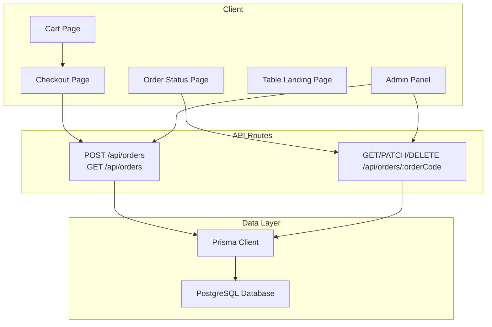
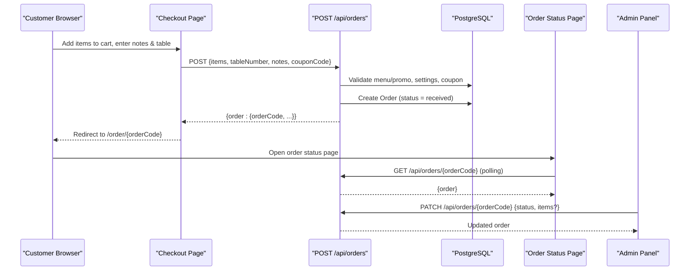
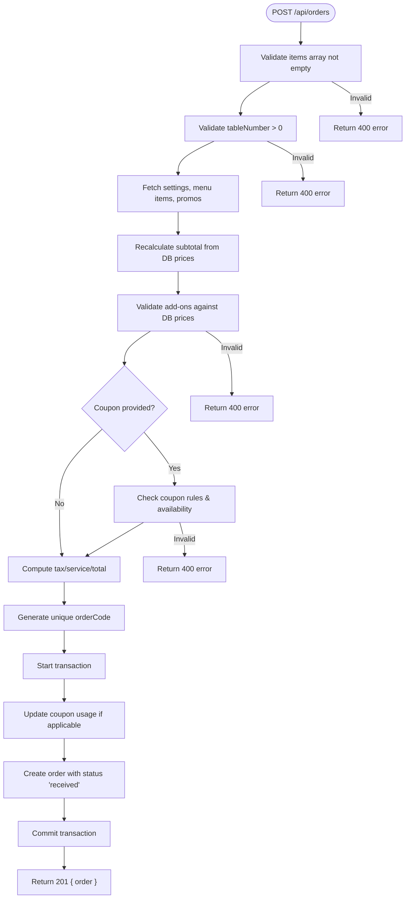
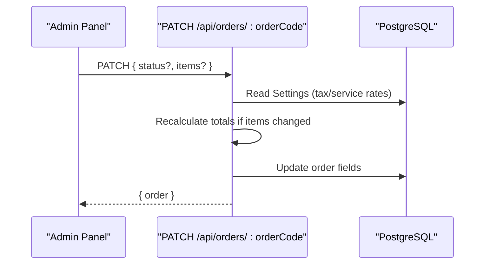
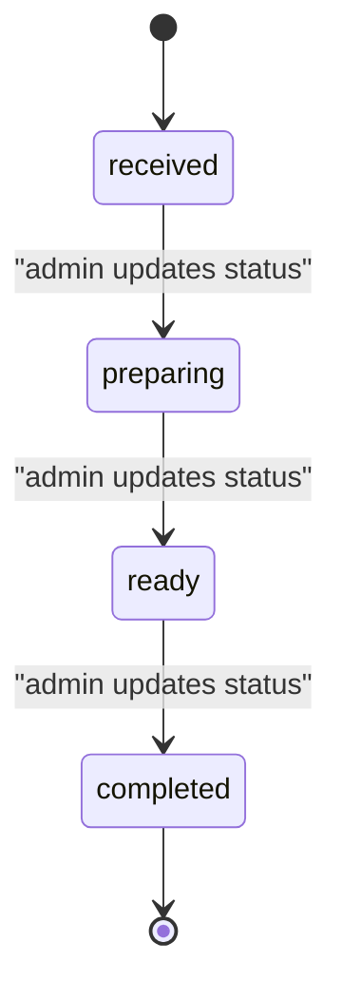
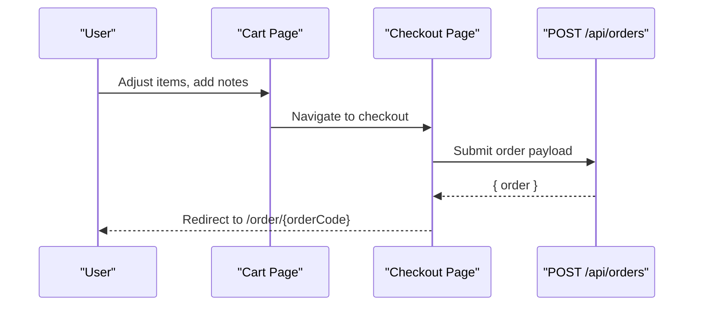
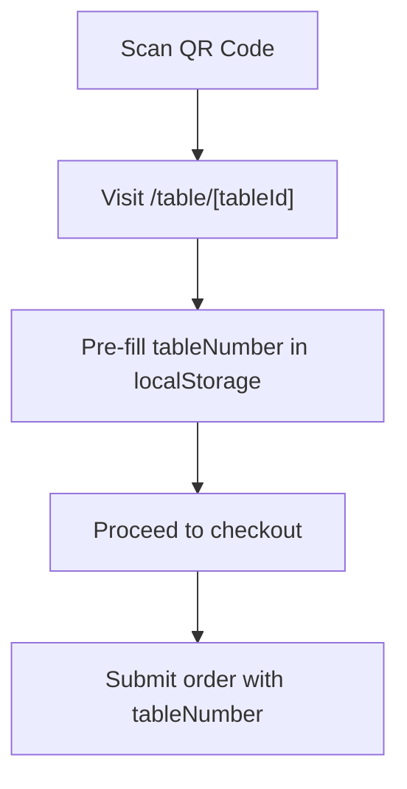
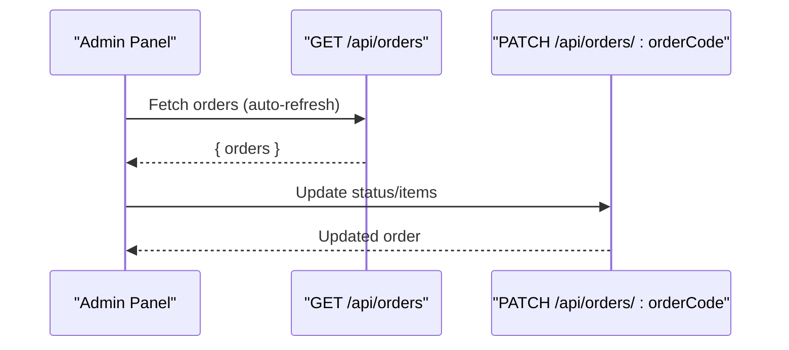
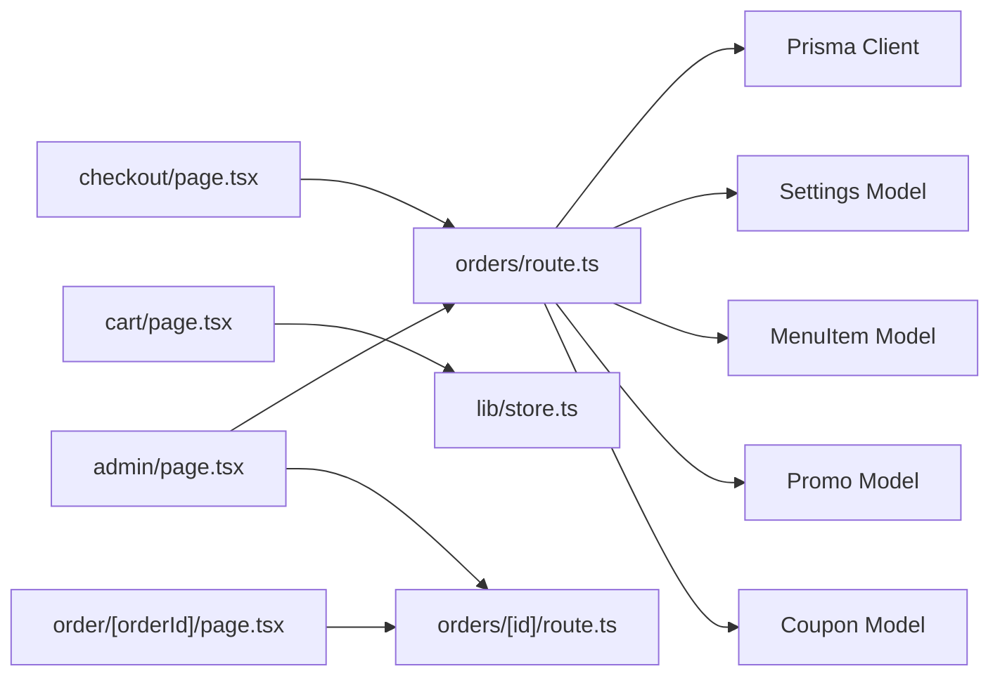

# Orders API Endpoints

<cite>
**Referenced Files in This Document**
- [route.ts](file://app/api/orders/route.ts)
- [route.ts](file://app/api/orders/[id]/route.ts)
- [schema.prisma](file://prisma/schema.prisma)
- [page.tsx](file://app/order/[orderId]/page.tsx)
- [page.tsx](file://app/cart/page.tsx)
- [page.tsx](file://app/checkout/page.tsx)
- [page.tsx](file://app/table/[tableId]/page.tsx)
- [types.ts](file://lib/types.ts)
- [store.ts](file://lib/store.ts)
- [jwt.ts](file://lib/jwt.ts)
- [page.tsx](file://app/admin/page.tsx)
</cite>

## Table of Contents
1. [Introduction](#introduction)
2. [Project Structure](#project-structure)
3. [Core Components](#core-components)
4. [Architecture Overview](#architecture-overview)
5. [Detailed Component Analysis](#detailed-component-analysis)
6. [Dependency Analysis](#dependency-analysis)
7. [Performance Considerations](#performance-considerations)
8. [Troubleshooting Guide](#troubleshooting-guide)
9. [Conclusion](#conclusion)

## Introduction
This document describes the Orders API endpoints and the complete order lifecycle from creation to completion. It covers:
- Order placement via POST /api/orders
- Retrieving orders via GET /api/orders and GET /api/orders/:orderCode
- Updating order status and items via PATCH /api/orders/:orderCode
- Deleting orders via DELETE /api/orders/:orderCode
- Cart integration, table-based ordering workflows, and order history retrieval
- Request/response schemas for orders, cart integration, and related entities
- Authentication and authorization patterns used by the application

The system is a Next.js application with server-side route handlers under app/api, Prisma-managed PostgreSQL data, and client pages that drive the customer and admin flows.

## Project Structure
The Orders API is implemented as Next.js App Router routes:
- app/api/orders/route.ts: List all orders and create new orders
- app/api/orders/[id]/route.ts: Get, update, or delete an order by orderCode
- prisma/schema.prisma: Data models including Order, MenuItem, Promo, Coupon, Settings, etc.
- Client pages:
  - app/cart/page.tsx: Cart management and totals preview
  - app/checkout/page.tsx: Checkout flow and order submission
  - app/order/[orderId]/page.tsx: Real-time order status tracking
  - app/table/[tableId]/page.tsx: Table landing page pre-filling table number
  - app/admin/page.tsx: Admin panel for order management and analytics

**Diagram sources**
- [route.ts:11-21](file://app/api/orders/route.ts#L11-L21)
- [route.ts:23-245](file://app/api/orders/route.ts#L23-L245)
- [route.ts:5-23](file://app/api/orders/[id]/route.ts#L5-L23)
- [route.ts:25-75](file://app/api/orders/[id]/route.ts#L25-L75)
- [route.ts:77-96](file://app/api/orders/[id]/route.ts#L77-L96)

**Section sources**
- [route.ts:11-21](file://app/api/orders/route.ts#L11-L21)
- [route.ts:23-245](file://app/api/orders/route.ts#L23-L245)
- [route.ts:5-23](file://app/api/orders/[id]/route.ts#L5-L23)
- [route.ts:25-75](file://app/api/orders/[id]/route.ts#L25-L75)
- [route.ts:77-96](file://app/api/orders/[id]/route.ts#L77-L96)
- [schema.prisma:58-76](file://prisma/schema.prisma#L58-L76)

## Core Components
- Orders API (server):
  - GET /api/orders: Returns all orders sorted newest first
  - POST /api/orders: Creates a new order with validated items, optional coupon, and server-calculated totals
  - GET /api/orders/:orderCode: Retrieves a single order by orderCode
  - PATCH /api/orders/:orderCode: Updates order status and/or items; recalculates totals when items change
  - DELETE /api/orders/:orderCode: Deletes an order by orderCode
- Data models (Prisma):
  - Order: orderCode, tableNumber, items, notes, subtotal, taxAmount, serviceChargeAmount, couponCode, discountAmount, total, status, timestamps
  - MenuItem, Promo, Coupon, Settings: referenced during order creation and validation
- Client flows:
  - Cart: manage items, notes, and preview totals
  - Checkout: submit order payload to POST /api/orders
  - Order Status: poll GET /api/orders/:orderCode every 5 seconds
  - Table Landing: optionally pre-fill table number for checkout
  - Admin Panel: list orders, search/filter, view details, update status

**Section sources**
- [route.ts:11-21](file://app/api/orders/route.ts#L11-L21)
- [route.ts:23-245](file://app/api/orders/route.ts#L23-L245)
- [route.ts:5-23](file://app/api/orders/[id]/route.ts#L5-L23)
- [route.ts:25-75](file://app/api/orders/[id]/route.ts#L25-L75)
- [route.ts:77-96](file://app/api/orders/[id]/route.ts#L77-L96)
- [schema.prisma:58-76](file://prisma/schema.prisma#L58-L76)
- [page.tsx:19-40](file://app/order/[orderId]/page.tsx#L19-L40)
- [page.tsx:19-227](file://app/cart/page.tsx#L19-L227)
- [page.tsx:22-245](file://app/checkout/page.tsx#L22-L245)
- [page.tsx:18-31](file://app/table/[tableId]/page.tsx#L18-L31)
- [page.tsx:910-949](file://app/admin/page.tsx#L910-L949)

## Architecture Overview
The order lifecycle spans client UIs and server routes:
- Customer places an order from the cart/checkout flow
- Server validates menu/promo items, applies coupons, recalculates totals, and persists the order
- Customer tracks order status via polling
- Admin manages orders and updates statuses

**Diagram sources**
- [page.tsx:22-245](file://app/checkout/page.tsx#L22-L245)
- [route.ts:23-245](file://app/api/orders/route.ts#L23-L245)
- [page.tsx:19-40](file://app/order/[orderId]/page.tsx#L19-L40)
- [route.ts:25-75](file://app/api/orders/[id]/route.ts#L25-L75)

## Detailed Component Analysis

### Orders API: List and Create
- GET /api/orders
  - Purpose: Retrieve all orders, ordered by newest first
  - Response: { orders: Order[] }
  - Error handling: 500 on failure
- POST /api/orders
  - Purpose: Create a new order from customer checkout
  - Security: All monetary values are recalculated server-side; browser-supplied totals are ignored
  - Validation:
    - items must be non-empty array
    - tableNumber must be a positive integer
    - Menu items and promos validated against database
    - Add-ons validated against DB prices
    - Optional coupon validated and applied atomically within transaction
  - Calculations:
    - Subtotal computed from validated items
    - Tax and service charge computed from Settings rates
    - Total = max(0, subtotal - discountAmount + taxAmount + serviceChargeAmount)
  - Persistence:
    - Unique orderCode generated (ARU-XXXX pattern)
    - Order created with status 'received'
    - If coupon used, lastUsedDate and usedToday updated atomically
  - Response: { order: Order }, status 201
  - Errors: 400 for validation failures, 500 for server errors

**Diagram sources**
- [route.ts:23-245](file://app/api/orders/route.ts#L23-L245)

**Section sources**
- [route.ts:11-21](file://app/api/orders/route.ts#L11-L21)
- [route.ts:23-245](file://app/api/orders/route.ts#L23-L245)

### Orders API: Get, Update, Delete by orderCode
- GET /api/orders/:orderCode
  - Purpose: Retrieve a single order by orderCode
  - Response: { order: Order }
  - Not found: 404
  - Error handling: 500 on failure
- PATCH /api/orders/:orderCode
  - Purpose: Update order status and/or items (admin use)
  - Behavior:
    - If status provided, update status
    - If items provided, recalculate subtotal/tax/service/total based on Settings
    - Persist changes
  - Response: { order: Order }
  - Not found: 404
  - Error handling: 500 on failure
- DELETE /api/orders/:orderCode
  - Purpose: Delete an order (admin use)
  - Response: { success: true }
  - Not found: 404
  - Error handling: 500 on failure

**Diagram sources**
- [route.ts:25-75](file://app/api/orders/[id]/route.ts#L25-L75)

**Section sources**
- [route.ts:5-23](file://app/api/orders/[id]/route.ts#L5-L23)
- [route.ts:25-75](file://app/api/orders/[id]/route.ts#L25-L75)
- [route.ts:77-96](file://app/api/orders/[id]/route.ts#L77-L96)

### Order Lifecycle and Status States
- Status progression:
  - received: Initial state upon order creation
  - preparing: Kitchen starts preparing
  - ready: Food ready to be served
  - completed: Order finished; payment at cashier
- Frontend displays a stepper mapping these states and polls the order status endpoint every 5 seconds.

**Diagram sources**
- [page.tsx:55-74](file://app/order/[orderId]/page.tsx#L55-L74)
- [route.ts:197-234](file://app/api/orders/route.ts#L197-L234)

**Section sources**
- [page.tsx:55-74](file://app/order/[orderId]/page.tsx#L55-L74)
- [route.ts:197-234](file://app/api/orders/route.ts#L197-L234)

### Cart Integration and Checkout Flow
- Cart page:
  - Manages cart items, quantities, and order notes
  - Displays subtotal, tax, service charge, and grand total using Settings rates
  - Navigates to checkout
- Checkout page:
  - Builds order payload from cart items and manual table number
  - Sends POST /api/orders with items, tableNumber, notes, and optional couponCode
  - On success, clears cart and redirects to order status page

**Diagram sources**
- [page.tsx:19-227](file://app/cart/page.tsx#L19-L227)
- [page.tsx:22-245](file://app/checkout/page.tsx#L22-L245)
- [route.ts:23-245](file://app/api/orders/route.ts#L23-L245)

**Section sources**
- [page.tsx:19-227](file://app/cart/page.tsx#L19-L227)
- [page.tsx:22-245](file://app/checkout/page.tsx#L22-L245)

### Table-Based Ordering Workflow
- Table landing page:
  - Accepts tableId from URL path
  - Pre-populates table number into local storage for checkout
  - No per-table token validation; table number is self-declared at checkout
- JWT utilities exist for generating/verifying QR tokens, but current table flow does not enforce token validation

**Diagram sources**
- [page.tsx:18-31](file://app/table/[tableId]/page.tsx#L18-L31)
- [page.tsx:22-245](file://app/checkout/page.tsx#L22-L245)
- [jwt.ts:15-27](file://lib/jwt.ts#L15-L27)

**Section sources**
- [page.tsx:18-31](file://app/table/[tableId]/page.tsx#L18-L31)
- [page.tsx:22-245](file://app/checkout/page.tsx#L22-L245)
- [jwt.ts:15-27](file://lib/jwt.ts#L15-L27)

### Order History Retrieval and Admin Management
- Admin panel:
  - Lists all orders via GET /api/orders
  - Supports search by order code/table number and filter by status
  - Auto-refreshes every 10 seconds
  - Opens detail modal to inspect order and potentially update status/items via PATCH
- Analytics:
  - Computes revenue excluding completed orders

**Diagram sources**
- [page.tsx:910-949](file://app/admin/page.tsx#L910-L949)
- [route.ts:11-21](file://app/api/orders/route.ts#L11-L21)
- [route.ts:25-75](file://app/api/orders/[id]/route.ts#L25-L75)

**Section sources**
- [page.tsx:910-949](file://app/admin/page.tsx#L910-L949)
- [route.ts:11-21](file://app/api/orders/route.ts#L11-L21)
- [route.ts:25-75](file://app/api/orders/[id]/route.ts#L25-L75)

## Dependency Analysis
Key dependencies and relationships:
- Orders API depends on:
  - Prisma client for database operations
  - Settings model for tax/service rates
  - MenuItem and Promo models for item validation
  - Coupon model for discount application
- Client pages depend on:
  - lib/types.ts for shared interfaces
  - lib/store.ts for cart state management
  - lib/jwt.ts for QR token utilities (not enforced in current table flow)

**Diagram sources**
- [route.ts:23-245](file://app/api/orders/route.ts#L23-L245)
- [route.ts:25-75](file://app/api/orders/[id]/route.ts#L25-L75)
- [page.tsx:22-245](file://app/checkout/page.tsx#L22-L245)
- [page.tsx:19-227](file://app/cart/page.tsx#L19-L227)
- [page.tsx:19-40](file://app/order/[orderId]/page.tsx#L19-L40)
- [page.tsx:910-949](file://app/admin/page.tsx#L910-L949)

**Section sources**
- [route.ts:23-245](file://app/api/orders/route.ts#L23-L245)
- [route.ts:25-75](file://app/api/orders/[id]/route.ts#L25-L75)
- [page.tsx:22-245](file://app/checkout/page.tsx#L22-L245)
- [page.tsx:19-227](file://app/cart/page.tsx#L19-L227)
- [page.tsx:19-40](file://app/order/[orderId]/page.tsx#L19-L40)
- [page.tsx:910-949](file://app/admin/page.tsx#L910-L949)

## Performance Considerations
- Batch fetching: The order creation handler fetches settings, menu items, and promos in parallel to reduce round-trips
- Server-side calculations: Totals are recalculated on the server to prevent price manipulation and ensure consistency
- Polling interval: Order status page polls every 5 seconds; consider adjusting based on expected load
- Admin auto-refresh: Admin panel refreshes orders every 10 seconds; monitor performance impact in high-volume environments
- Indexing: Prisma schema indexes status and createdAt on orders to optimize queries

[No sources needed since this section provides general guidance]

## Troubleshooting Guide
Common issues and resolutions:
- Invalid items or missing tableNumber: Ensure items array is non-empty and tableNumber is a positive integer
- Menu or promo not available: Verify menuItemId and promo IDs exist and are active in the database
- Add-on price mismatch: Only add-ons defined in the menu item’s add-ons list are accepted; their prices are taken from the database
- Coupon validation failure: Check coupon code validity, date range, minimum order amount, and daily usage limits
- Order not found: When retrieving/updating/deleting by orderCode, confirm the order exists
- Server errors: Check logs for database connectivity or Prisma errors

**Section sources**
- [route.ts:33-48](file://app/api/orders/route.ts#L33-L48)
- [route.ts:95-157](file://app/api/orders/route.ts#L95-L157)
- [route.ts:167-180](file://app/api/orders/route.ts#L167-L180)
- [route.ts:14-22](file://app/api/orders/[id]/route.ts#L14-L22)
- [route.ts:68-74](file://app/api/orders/[id]/route.ts#L68-L74)
- [route.ts:89-95](file://app/api/orders/[id]/route.ts#L89-L95)

## Conclusion
The Orders API provides a secure and robust foundation for managing restaurant orders:
- Creation enforces strict validation and server-side price recalculation
- Status transitions are managed by admin actions and reflected in real-time for customers
- Cart and table-based ordering integrate seamlessly with the API
- Admin tools support efficient order management and analytics

For production hardening, consider adding explicit authentication and authorization checks on the API routes, especially for PATCH and DELETE operations, and implement rate limiting and input sanitization where appropriate.

[No sources needed since this section summarizes without analyzing specific files]