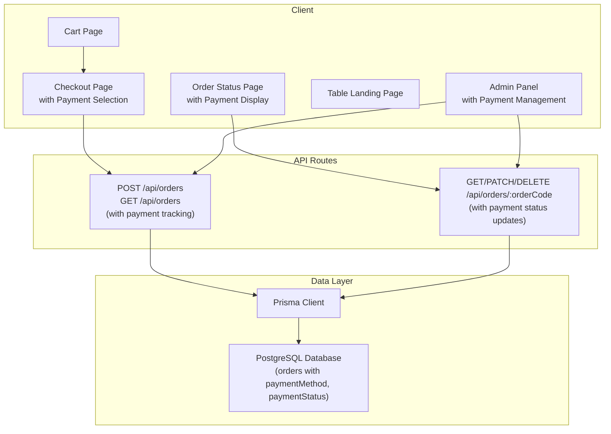
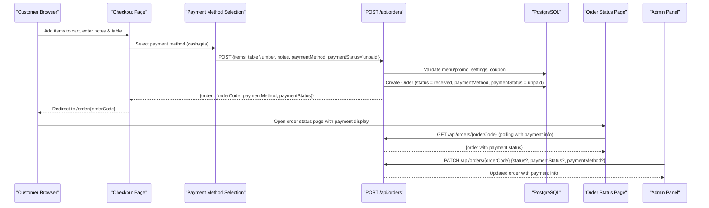
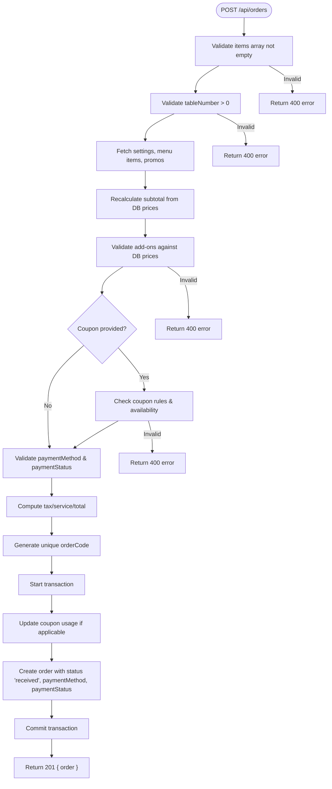
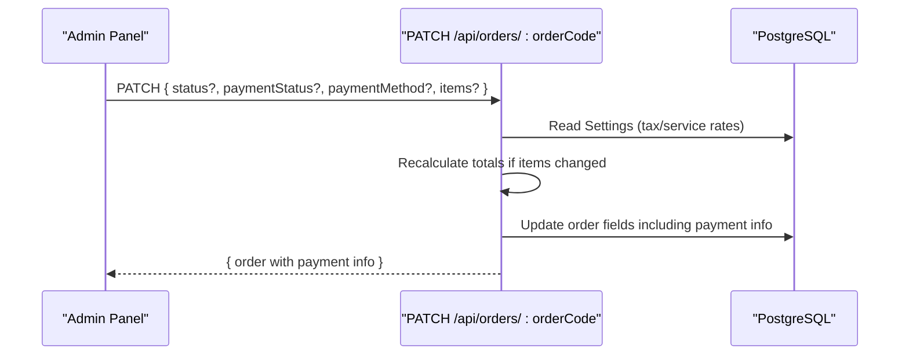
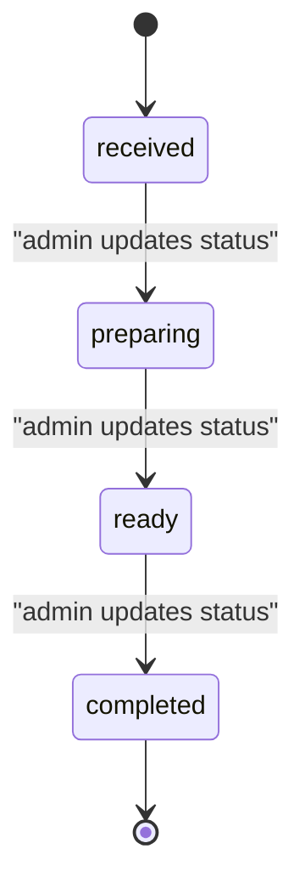
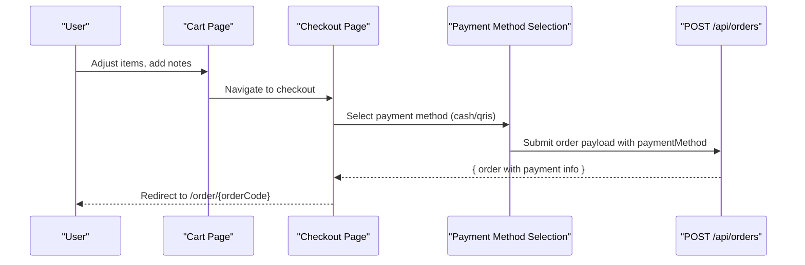
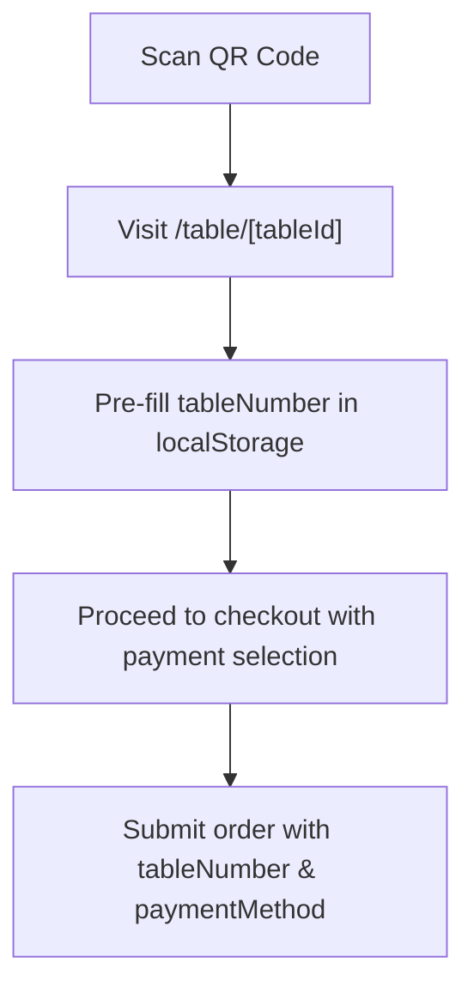
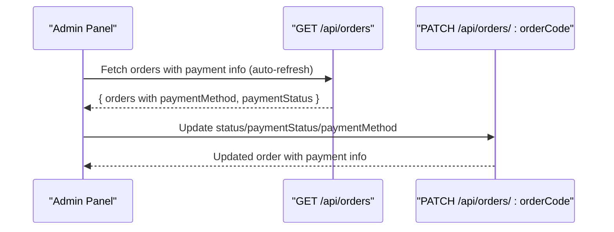
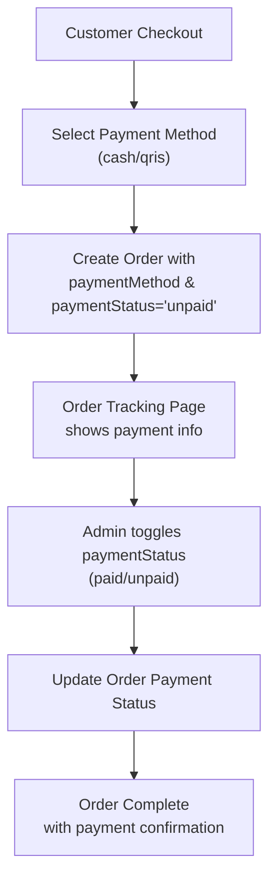
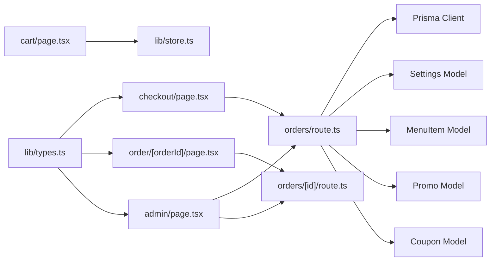

# Orders API Endpoints

<cite>
**Referenced Files in This Document**
- [route.ts](file://app/api/orders/route.ts)
- [route.ts](file://app/api/orders/[id]/route.ts)
- [schema.prisma](file://prisma/schema.prisma)
- [page.tsx](file://app/order/[orderId]/page.tsx)
- [page.tsx](file://app/cart/page.tsx)
- [page.tsx](file://app/checkout/page.tsx)
- [page.tsx](file://app/table/[tableId]/page.tsx)
- [types.ts](file://lib/types.ts)
- [store.ts](file://lib/store.ts)
- [jwt.ts](file://lib/jwt.ts)
- [page.tsx](file://app/admin/page.tsx)
</cite>

## Update Summary
**Changes Made**
- Added comprehensive documentation for the new payment tracking system
- Updated POST /api/orders endpoint to include paymentMethod and paymentStatus fields
- Updated PATCH /api/orders/:orderCode endpoint to support payment status updates
- Enhanced Order model documentation with payment-related fields
- Added payment workflow examples and integration patterns
- Updated client-side integration examples for checkout and order status pages

## Table of Contents
1. [Introduction](#introduction)
2. [Project Structure](#project-structure)
3. [Core Components](#core-components)
4. [Architecture Overview](#architecture-overview)
5. [Detailed Component Analysis](#detailed-component-analysis)
6. [Payment Tracking System](#payment-tracking-system)
7. [Dependency Analysis](#dependency-analysis)
8. [Performance Considerations](#performance-considerations)
9. [Troubleshooting Guide](#troubleshooting-guide)
10. [Conclusion](#conclusion)

## Introduction
This document describes the Orders API endpoints and the complete order lifecycle from creation to completion, including the integrated payment tracking system. It covers:
- Order placement via POST /api/orders with payment method selection
- Retrieving orders via GET /api/orders and GET /api/orders/:orderCode
- Updating order status and payment information via PATCH /api/orders/:orderCode
- Deleting orders via DELETE /api/orders/:orderCode
- Cart integration, table-based ordering workflows, and order history retrieval
- Request/response schemas for orders, cart integration, and related entities
- Authentication and authorization patterns used by the application
- Payment method tracking (cash vs QRIS) and payment status management (paid/unpaid)

The system is a Next.js application with server-side route handlers under app/api, Prisma-managed PostgreSQL data, and client pages that drive the customer and admin flows.

## Project Structure
The Orders API is implemented as Next.js App Router routes:
- app/api/orders/route.ts: List all orders and create new orders with payment tracking
- app/api/orders/[id]/route.ts: Get, update, or delete an order by orderCode with payment status updates
- prisma/schema.prisma: Data models including Order with paymentMethod and paymentStatus fields, MenuItem, Promo, Coupon, Settings, etc.
- Client pages:
  - app/cart/page.tsx: Cart management and totals preview
  - app/checkout/page.tsx: Checkout flow with payment method selection and order submission
  - app/order/[orderId]/page.tsx: Real-time order status tracking with payment status display
  - app/table/[tableId]/page.tsx: Table landing page pre-filling table number
  - app/admin/page.tsx: Admin panel for order management, payment status updates, and analytics

**Diagram sources**
- [route.ts:11-21](file://app/api/orders/route.ts#L11-L21)
- [route.ts:23-294](file://app/api/orders/route.ts#L23-L294)
- [route.ts:5-23](file://app/api/orders/[id]/route.ts#L5-L23)
- [route.ts:25-81](file://app/api/orders/[id]/route.ts#L25-L81)
- [route.ts:83-103](file://app/api/orders/[id]/route.ts#L83-L103)

**Section sources**
- [route.ts:11-21](file://app/api/orders/route.ts#L11-L21)
- [route.ts:23-294](file://app/api/orders/route.ts#L23-L294)
- [route.ts:5-23](file://app/api/orders/[id]/route.ts#L5-L23)
- [route.ts:25-81](file://app/api/orders/[id]/route.ts#L25-L81)
- [route.ts:83-103](file://app/api/orders/[id]/route.ts#L83-L103)
- [schema.prisma:58-79](file://prisma/schema.prisma#L58-L79)

## Core Components
- Orders API (server):
  - GET /api/orders: Returns all orders sorted newest first
  - POST /api/orders: Creates a new order with validated items, optional coupon, payment method selection, and server-calculated totals
  - GET /api/orders/:orderCode: Retrieves a single order by orderCode including payment information
  - PATCH /api/orders/:orderCode: Updates order status, payment status, payment method, and/or items; recalculates totals when items change
  - DELETE /api/orders/:orderCode: Deletes an order by orderCode
- Data models (Prisma):
  - Order: orderCode, tableNumber, items, notes, subtotal, taxAmount, serviceChargeAmount, couponCode, discountAmount, total, status, **paymentMethod**, **paymentStatus**, timestamps
  - MenuItem, Promo, Coupon, Settings: referenced during order creation and validation
- Client flows:
  - Cart: manage items, notes, and preview totals
  - Checkout: submit order payload with payment method selection to POST /api/orders
  - Order Status: poll GET /api/orders/:orderCode every 5 seconds with payment status display
  - Table Landing: optionally pre-fill table number for checkout
  - Admin Panel: list orders, search/filter, view details, update status and payment status

**Section sources**
- [route.ts:11-21](file://app/api/orders/route.ts#L11-L21)
- [route.ts:23-294](file://app/api/orders/route.ts#L23-L294)
- [route.ts:5-23](file://app/api/orders/[id]/route.ts#L5-L23)
- [route.ts:25-81](file://app/api/orders/[id]/route.ts#L25-L81)
- [route.ts:83-103](file://app/api/orders/[id]/route.ts#L83-L103)
- [schema.prisma:58-79](file://prisma/schema.prisma#L58-L79)
- [page.tsx:19-40](file://app/order/[orderId]/page.tsx#L19-L40)
- [page.tsx:19-227](file://app/cart/page.tsx#L19-L227)
- [page.tsx:22-673](file://app/checkout/page.tsx#L22-L673)
- [page.tsx:18-31](file://app/table/[tableId]/page.tsx#L18-L31)
- [page.tsx:958-1055](file://app/admin/page.tsx#L958-L1055)

## Architecture Overview
The order lifecycle spans client UIs and server routes with integrated payment tracking:
- Customer selects payment method (cash or QRIS) during checkout
- Server validates menu/promo items, applies coupons, tracks payment method, recalculates totals, and persists the order with initial payment status 'unpaid'
- Customer tracks order status and payment status via polling
- Admin manages orders, updates kitchen status, and toggles payment status between paid/unpaid

**Diagram sources**
- [page.tsx:22-673](file://app/checkout/page.tsx#L22-L673)
- [route.ts:23-294](file://app/api/orders/route.ts#L23-L294)
- [page.tsx:19-40](file://app/order/[orderId]/page.tsx#L19-L40)
- [route.ts:25-81](file://app/api/orders/[id]/route.ts#L25-L81)

## Detailed Component Analysis

### Orders API: List and Create
- GET /api/orders
  - Purpose: Retrieve all orders, ordered by newest first
  - Response: { orders: Order[] }
  - Error handling: 500 on failure
- POST /api/orders
  - Purpose: Create a new order from customer checkout with payment tracking
  - Security: All monetary values are recalculated server-side; browser-supplied totals are ignored
  - Validation:
    - items must be non-empty array
    - tableNumber must be a positive integer
    - Menu items and promos validated against database
    - Add-ons validated against DB prices
    - Optional coupon validated and applied atomically within transaction
    - **paymentMethod**: validated as 'cash' or 'qris', defaults to 'cash' if invalid
    - **paymentStatus**: validated as 'paid' or 'unpaid', defaults to 'unpaid' if invalid
  - Calculations:
    - Subtotal computed from validated items
    - Tax and service charge computed from Settings rates
    - Total = max(0, subtotal - discountAmount + taxAmount + serviceChargeAmount)
  - Persistence:
    - Unique orderCode generated (ARU-XXXX pattern)
    - Order created with status 'received', paymentMethod, and paymentStatus
    - If coupon used, lastUsedDate and usedToday updated atomically
  - Response: { order: Order }, status 201
  - Errors: 400 for validation failures, 500 for server errors

**Diagram sources**
- [route.ts:23-294](file://app/api/orders/route.ts#L23-L294)

**Section sources**
- [route.ts:11-21](file://app/api/orders/route.ts#L11-L21)
- [route.ts:23-294](file://app/api/orders/route.ts#L23-L294)

### Orders API: Get, Update, Delete by orderCode
- GET /api/orders/:orderCode
  - Purpose: Retrieve a single order by orderCode including payment information
  - Response: { order: Order }
  - Not found: 404
  - Error handling: 500 on failure
- PATCH /api/orders/:orderCode
  - Purpose: Update order status, payment status, payment method, and/or items (admin use)
  - Behavior:
    - If status provided, update status
    - **If paymentStatus provided, update payment status (paid/unpaid)**
    - **If paymentMethod provided, update payment method (cash/qris)**
    - If items provided, recalculate subtotal/tax/service/total based on Settings
    - Persist changes
  - Response: { order: Order }
  - Not found: 404
  - Error handling: 500 on failure
- DELETE /api/orders/:orderCode
  - Purpose: Delete an order (admin use)
  - Response: { success: true }
  - Not found: 404
  - Error handling: 500 on failure

**Diagram sources**
- [route.ts:25-81](file://app/api/orders/[id]/route.ts#L25-L81)

**Section sources**
- [route.ts:5-23](file://app/api/orders/[id]/route.ts#L5-L23)
- [route.ts:25-81](file://app/api/orders/[id]/route.ts#L25-L81)
- [route.ts:83-103](file://app/api/orders/[id]/route.ts#L83-L103)

### Order Lifecycle and Status States
- Status progression:
  - received: Initial state upon order creation
  - preparing: Kitchen starts preparing
  - ready: Food ready to be served
  - completed: Order finished; payment at cashier
- Frontend displays a stepper mapping these states and polls the order status endpoint every 5 seconds.

**Diagram sources**
- [page.tsx:55-74](file://app/order/[orderId]/page.tsx#L55-L74)
- [route.ts:197-234](file://app/api/orders/route.ts#L197-L234)

**Section sources**
- [page.tsx:55-74](file://app/order/[orderId]/page.tsx#L55-L74)
- [route.ts:197-234](file://app/api/orders/route.ts#L197-L234)

### Cart Integration and Checkout Flow
- Cart page:
  - Manages cart items, quantities, and order notes
  - Displays subtotal, tax, service charge, and grand total using Settings rates
  - Navigates to checkout
- Checkout page:
  - Builds order payload from cart items and manual table number
  - **Includes payment method selection (cash or QRIS)**
  - Sends POST /api/orders with items, tableNumber, notes, paymentMethod, paymentStatus='unpaid', and optional couponCode
  - On success, clears cart and redirects to order status page

**Diagram sources**
- [page.tsx:19-227](file://app/cart/page.tsx#L19-L227)
- [page.tsx:22-673](file://app/checkout/page.tsx#L22-L673)
- [route.ts:23-294](file://app/api/orders/route.ts#L23-L294)

**Section sources**
- [page.tsx:19-227](file://app/cart/page.tsx#L19-L227)
- [page.tsx:22-673](file://app/checkout/page.tsx#L22-L673)

### Table-Based Ordering Workflow
- Table landing page:
  - Accepts tableId from URL path
  - Pre-populates table number into local storage for checkout
  - No per-table token validation; table number is self-declared at checkout
- JWT utilities exist for generating/verifying QR tokens, but current table flow does not enforce token validation

**Diagram sources**
- [page.tsx:18-31](file://app/table/[tableId]/page.tsx#L18-L31)
- [page.tsx:22-673](file://app/checkout/page.tsx#L22-L673)
- [jwt.ts:15-27](file://lib/jwt.ts#L15-L27)

**Section sources**
- [page.tsx:18-31](file://app/table/[tableId]/page.tsx#L18-L31)
- [page.tsx:22-673](file://app/checkout/page.tsx#L22-L673)
- [jwt.ts:15-27](file://lib/jwt.ts#L15-L27)

### Order History Retrieval and Admin Management
- Admin panel:
  - Lists all orders via GET /api/orders with payment information
  - Supports search by order code/table number and filter by status and payment status
  - Auto-refreshes every 10 seconds
  - Opens detail modal to inspect order and potentially update status/items/payment via PATCH
  - **Provides toggle button to switch payment status between paid/unpaid**
- Analytics:
  - Computes revenue excluding completed orders

**Diagram sources**
- [page.tsx:958-1055](file://app/admin/page.tsx#L958-L1055)
- [route.ts:11-21](file://app/api/orders/route.ts#L11-L21)
- [route.ts:25-81](file://app/api/orders/[id]/route.ts#L25-L81)

**Section sources**
- [page.tsx:958-1055](file://app/admin/page.tsx#L958-L1055)
- [route.ts:11-21](file://app/api/orders/route.ts#L11-L21)
- [route.ts:25-81](file://app/api/orders/[id]/route.ts#L25-L81)

## Payment Tracking System

### Payment Method Selection
The system supports two payment methods:
- **cash**: Traditional cash payment at the cashier
- **qris**: QRIS (Quick Response Code Indonesian Standard) digital payment

During checkout, customers select their preferred payment method, which is then validated and stored with the order. The default payment method is 'cash' if no valid value is provided.

### Payment Status Management
Each order has a payment status that tracks whether payment has been completed:
- **unpaid**: Initial status when order is created
- **paid**: Status when payment is confirmed by the cashier

The payment status can be toggled by admin users through the admin panel interface.

### Database Schema Updates
The Order model in Prisma schema includes:
- `paymentMethod`: String field with default 'cash'
- `paymentStatus`: String field with default 'unpaid'
- Index on `[paymentStatus, createdAt]` for efficient querying

### Client-Side Integration
- **Checkout Page**: Includes payment method selection UI with visual indicators for cash and QRIS options
- **Order Status Page**: Displays payment method and payment status with appropriate styling (green for paid, amber for unpaid)
- **Admin Panel**: Provides toggle functionality to switch payment status and displays payment information in order listings

**Diagram sources**
- [page.tsx:531-580](file://app/checkout/page.tsx#L531-L580)
- [page.tsx:185-208](file://app/order/[orderId]/page.tsx#L185-L208)
- [page.tsx:983-995](file://app/admin/page.tsx#L983-L995)

**Section sources**
- [route.ts:259-264](file://app/api/orders/route.ts#L259-L264)
- [route.ts:279-280](file://app/api/orders/route.ts#L279-L280)
- [route.ts:35-47](file://app/api/orders/[id]/route.ts#L35-L47)
- [schema.prisma:71-72](file://prisma/schema.prisma#L71-L72)
- [page.tsx:531-580](file://app/checkout/page.tsx#L531-L580)
- [page.tsx:185-208](file://app/order/[orderId]/page.tsx#L185-L208)
- [page.tsx:983-995](file://app/admin/page.tsx#L983-L995)

## Dependency Analysis
Key dependencies and relationships:
- Orders API depends on:
  - Prisma client for database operations
  - Settings model for tax/service rates
  - MenuItem and Promo models for item validation
  - Coupon model for discount application
- Client pages depend on:
  - lib/types.ts for shared interfaces including paymentMethod and paymentStatus
  - lib/store.ts for cart state management
  - lib/jwt.ts for QR token utilities (not enforced in current table flow)

**Diagram sources**
- [route.ts:23-294](file://app/api/orders/route.ts#L23-L294)
- [route.ts:25-81](file://app/api/orders/[id]/route.ts#L25-L81)
- [page.tsx:22-673](file://app/checkout/page.tsx#L22-L673)
- [page.tsx:19-227](file://app/cart/page.tsx#L19-L227)
- [page.tsx:19-40](file://app/order/[orderId]/page.tsx#L19-L40)
- [page.tsx:958-1055](file://app/admin/page.tsx#L958-L1055)
- [types.ts:67-85](file://lib/types.ts#L67-L85)

**Section sources**
- [route.ts:23-294](file://app/api/orders/route.ts#L23-L294)
- [route.ts:25-81](file://app/api/orders/[id]/route.ts#L25-L81)
- [page.tsx:22-673](file://app/checkout/page.tsx#L22-L673)
- [page.tsx:19-227](file://app/cart/page.tsx#L19-L227)
- [page.tsx:19-40](file://app/order/[orderId]/page.tsx#L19-L40)
- [page.tsx:958-1055](file://app/admin/page.tsx#L958-L1055)
- [types.ts:67-85](file://lib/types.ts#L67-L85)

## Performance Considerations
- Batch fetching: The order creation handler fetches settings, menu items, and promos in parallel to reduce round-trips
- Server-side calculations: Totals are recalculated on the server to prevent price manipulation and ensure consistency
- Polling interval: Order status page polls every 5 seconds; consider adjusting based on expected load
- Admin auto-refresh: Admin panel refreshes orders every 10 seconds; monitor performance impact in high-volume environments
- Indexing: Prisma schema indexes status and createdAt on orders, plus paymentStatus and createdAt for payment queries
- Payment status queries: Efficient filtering by payment status in admin panel due to database indexing

[No sources needed since this section provides general guidance]

## Troubleshooting Guide
Common issues and resolutions:
- Invalid items or missing tableNumber: Ensure items array is non-empty and tableNumber is a positive integer
- Menu or promo not available: Verify menuItemId and promo IDs exist and are active in the database
- Add-on price mismatch: Only add-ons defined in the menu item's add-ons list are accepted; their prices are taken from the database
- Coupon validation failure: Check coupon code validity, date range, minimum order amount, and daily usage limits
- **Invalid payment method**: Ensure paymentMethod is either 'cash' or 'qris'; defaults to 'cash' if invalid
- **Invalid payment status**: Ensure paymentStatus is either 'paid' or 'unpaid'; defaults to 'unpaid' if invalid
- Order not found: When retrieving/updating/deleting by orderCode, confirm the order exists
- Server errors: Check logs for database connectivity or Prisma errors

**Section sources**
- [route.ts:33-48](file://app/api/orders/route.ts#L33-L48)
- [route.ts:95-157](file://app/api/orders/route.ts#L95-L157)
- [route.ts:167-180](file://app/api/orders/route.ts#L167-L180)
- [route.ts:259-264](file://app/api/orders/route.ts#L259-L264)
- [route.ts:14-22](file://app/api/orders/[id]/route.ts#L14-L22)
- [route.ts:35-47](file://app/api/orders/[id]/route.ts#L35-L47)
- [route.ts:68-74](file://app/api/orders/[id]/route.ts#L68-L74)
- [route.ts:89-95](file://app/api/orders/[id]/route.ts#L89-L95)

## Conclusion
The Orders API provides a secure and robust foundation for managing restaurant orders with integrated payment tracking:
- Creation enforces strict validation and server-side price recalculation
- **Payment method selection (cash/QRIS) and payment status tracking (paid/unpaid) are fully integrated**
- Status transitions are managed by admin actions and reflected in real-time for customers
- **Admin panel provides comprehensive payment management capabilities**
- Cart and table-based ordering integrate seamlessly with the API
- Admin tools support efficient order management, payment status updates, and analytics

For production hardening, consider adding explicit authentication and authorization checks on the API routes, especially for PATCH and DELETE operations, and implement rate limiting and input sanitization where appropriate.

[No sources needed since this section summarizes without analyzing specific files]