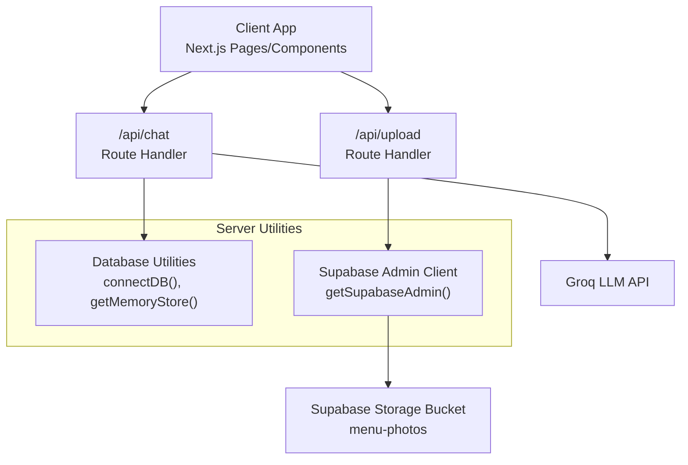
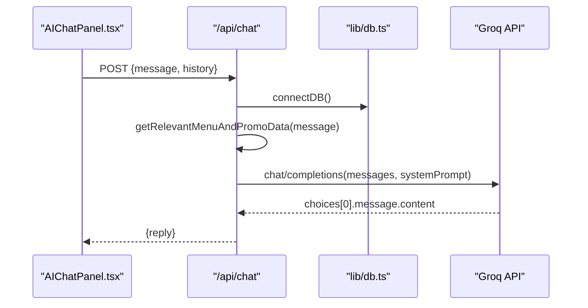
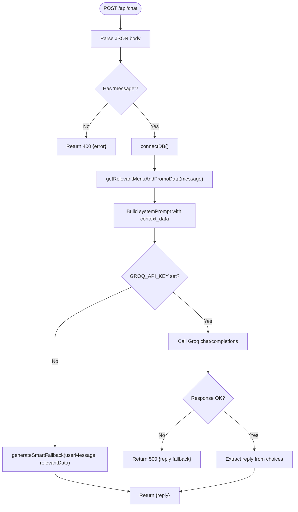
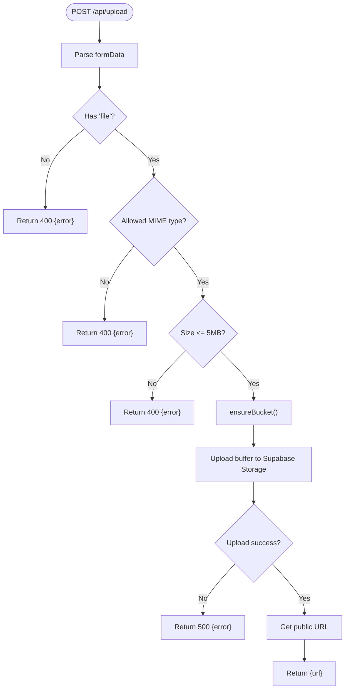
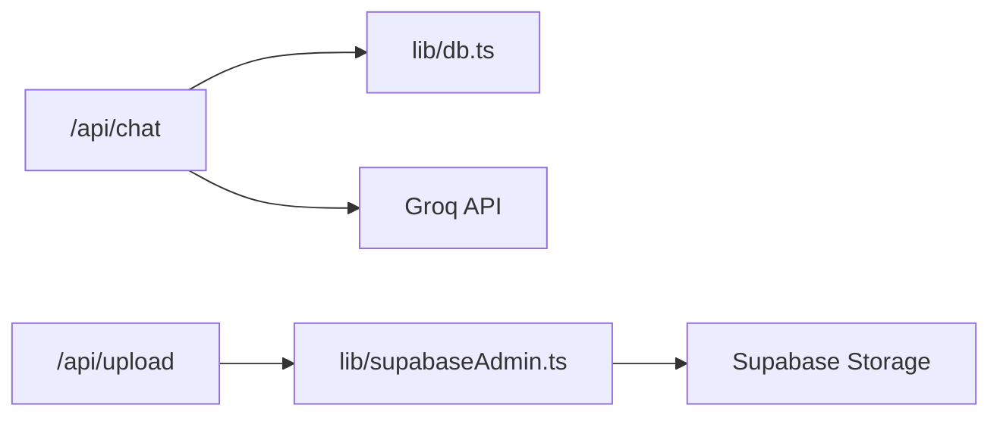

# Utility API Endpoints

<cite>
**Referenced Files in This Document**   
- [route.ts](file://app/api/chat/route.ts)
- [route.ts](file://app/api/upload/route.ts)
- [AIChatPanel.tsx](file://components/AIChatPanel.tsx)
- [db.ts](file://lib/db.ts)
- [supabaseAdmin.ts](file://lib/supabaseAdmin.ts)
</cite>

## Table of Contents
1. [Introduction](#introduction)
2. [Project Structure](#project-structure)
3. [Core Components](#core-components)
4. [Architecture Overview](#architecture-overview)
5. [Detailed Component Analysis](#detailed-component-analysis)
6. [Dependency Analysis](#dependency-analysis)
7. [Performance Considerations](#performance-considerations)
8. [Troubleshooting Guide](#troubleshooting-guide)
9. [Conclusion](#conclusion)

## Introduction
This document explains the Utility API endpoints that power AI-powered customer support and image file uploads:
- Chat endpoint for AI-driven conversation with context-aware menu, promo, and coupon information.
- Upload endpoint for secure image ingestion, validation, storage management, and public URL retrieval.

It also provides integration examples for the chatbot UI and file upload flows, along with error handling strategies and performance guidance.

## Project Structure
The utility features are implemented as Next.js Route Handlers under `app/api`, with a client-side chat panel component and shared server utilities for database and storage access.

**Diagram sources**
- [route.ts:316-409](file://app/api/chat/route.ts#L316-L409)
- [route.ts:33-73](file://app/api/upload/route.ts#L33-L73)
- [db.ts:40-50](file://lib/db.ts#L40-L50)
- [supabaseAdmin.ts:6-21](file://lib/supabaseAdmin.ts#L6-L21)

**Section sources**
- [route.ts:316-409](file://app/api/chat/route.ts#L316-L409)
- [route.ts:33-73](file://app/api/upload/route.ts#L33-L73)
- [db.ts:40-50](file://lib/db.ts#L40-L50)
- [supabaseAdmin.ts:6-21](file://lib/supabaseAdmin.ts#L6-L21)

## Core Components
- Chat API (`/api/chat`): Accepts user messages and optional conversation history, builds a system prompt with relevant menu/promo/coupon data, calls an external LLM provider (Groq), and returns a reply. Includes diagnostics via GET.
- Upload API (`/api/upload`): Validates incoming images, ensures a storage bucket exists, uploads to Supabase Storage, and returns a public URL.
- Chat UI (`AIChatPanel.tsx`): Client component that manages message state, renders assistant/user bubbles, and sends requests to `/api/chat`.

**Section sources**
- [route.ts:316-409](file://app/api/chat/route.ts#L316-L409)
- [route.ts:415-474](file://app/api/chat/route.ts#L415-L474)
- [route.ts:33-73](file://app/api/upload/route.ts#L33-L73)
- [AIChatPanel.tsx:84-128](file://components/AIChatPanel.tsx#L84-L128)

## Architecture Overview
The chat flow integrates contextual data from the application’s database or fallback store, constructs a system prompt, and delegates response generation to an LLM. The upload flow validates and stores images in a managed storage bucket.

**Diagram sources**
- [AIChatPanel.tsx:96-128](file://components/AIChatPanel.tsx#L96-L128)
- [route.ts:316-409](file://app/api/chat/route.ts#L316-L409)
- [db.ts:40-50](file://lib/db.ts#L40-L50)

## Detailed Component Analysis

### Chat Endpoint (`POST /api/chat`)
Responsibilities:
- Parse request body supporting both legacy `{messages}` and current `{message, history}` formats.
- Validate presence of user message.
- Ensure database is seeded before querying context data.
- Build a system prompt with contextual menu, promo, and coupon data.
- Call Groq LLM with OpenAI-compatible payload and timeout protection.
- Return a friendly reply on errors or fallback when environment configuration is missing.

Request format:
- Method: POST
- Content-Type: application/json
- Body fields:
  - message: string (required)
  - history: array of {role, content} (optional; supports up to last 6 turns)

Response format:
- Success: { reply: string }
- Error: { error: string } with appropriate HTTP status codes

Key behaviors:
- Fallback responder if GROQ_API_KEY is not set.
- Timeout handling for network/LLM latency.
- Diagnostics via GET `/api/chat` to check API key and connectivity.

**Diagram sources**
- [route.ts:316-409](file://app/api/chat/route.ts#L316-L409)

Integration example (client-side):
- Use the provided `AIChatPanel.tsx` component which manages local message state and calls `/api/chat` with `{message, history}`.
- Handle loading states and display assistant responses with simple markdown rendering.

Error handling highlights:
- Missing message: 400.
- LLM provider error: 500 with friendly fallback reply.
- Network timeouts: handled with AbortSignal.timeout and specific error paths.

**Section sources**
- [route.ts:316-409](file://app/api/chat/route.ts#L316-L409)
- [route.ts:415-474](file://app/api/chat/route.ts#L415-L474)
- [AIChatPanel.tsx:84-128](file://components/AIChatPanel.tsx#L84-L128)

### Upload Endpoint (`POST /api/upload`)
Responsibilities:
- Accept multipart form data containing a single image file.
- Validate file type against allowed MIME types.
- Enforce maximum file size.
- Ensure storage bucket exists (create if missing).
- Upload file buffer to Supabase Storage and return a public URL.

Request format:
- Method: POST
- Content-Type: multipart/form-data
- Field: file (required)

Allowed types:
- image/jpeg, image/jpg → jpg
- image/png → png
- image/webp → webp
- image/gif → gif

Size limit:
- 5 MB

Response format:
- Success: { url: string } (public URL)
- Error: { error: string } with appropriate HTTP status codes

Validation and security:
- Strict MIME type allowlist prevents unsupported formats.
- Size cap protects storage and bandwidth.
- Bucket creation enforces public visibility and size limits at the storage layer.

**Diagram sources**
- [route.ts:33-73](file://app/api/upload/route.ts#L33-L73)

Storage management:
- Bucket name: menu-photos
- Public URLs enabled for direct asset access
- Automatic bucket creation with constraints

**Section sources**
- [route.ts:33-73](file://app/api/upload/route.ts#L33-L73)
- [supabaseAdmin.ts:6-21](file://lib/supabaseAdmin.ts#L6-L21)

### Chat UI Integration (`AIChatPanel.tsx`)
Responsibilities:
- Manage local chat state (messages, input, loading).
- Render assistant/user bubbles with lightweight markdown support.
- Send messages to `/api/chat` with history context.
- Display typing indicator and handle network errors gracefully.

Usage pattern:
- Import and render `<AIChatPanel isOpen={...} onClose={...} />` in your page/component.
- Control visibility via props; the component handles internal state.

Message lifecycle:
- User submits text → append to local messages → call `/api/chat` → append assistant reply.
- History sent includes previous messages excluding the latest user message to avoid duplication.

Error handling:
- Network failures result in a friendly assistant message prompting users to contact staff.

**Section sources**
- [AIChatPanel.tsx:84-128](file://components/AIChatPanel.tsx#L84-L128)
- [AIChatPanel.tsx:132-235](file://components/AIChatPanel.tsx#L132-L235)

## Dependency Analysis
The chat endpoint depends on:
- Database seeding utilities to ensure initial data availability.
- External LLM provider (Groq) for response generation.
- Environment variables for API keys.

The upload endpoint depends on:
- Supabase admin client for storage operations.
- Environment variables for Supabase URL and secret/service role key.

**Diagram sources**
- [route.ts:316-409](file://app/api/chat/route.ts#L316-L409)
- [route.ts:33-73](file://app/api/upload/route.ts#L33-L73)
- [db.ts:40-50](file://lib/db.ts#L40-L50)
- [supabaseAdmin.ts:6-21](file://lib/supabaseAdmin.ts#L6-L21)

**Section sources**
- [route.ts:316-409](file://app/api/chat/route.ts#L316-L409)
- [route.ts:33-73](file://app/api/upload/route.ts#L33-L73)
- [db.ts:40-50](file://lib/db.ts#L40-L50)
- [supabaseAdmin.ts:6-21](file://lib/supabaseAdmin.ts#L6-L21)

## Performance Considerations
- Chat endpoint:
  - Limit conversation history to recent turns to reduce payload size.
  - Use timeouts to prevent long-running requests.
  - Consider caching frequently accessed menu/promo data if traffic increases.
- Upload endpoint:
  - Enforce strict MIME and size checks to minimize storage bloat.
  - Leverage Supabase Storage’s built-in constraints for consistent behavior.
  - Avoid unnecessary re-checking of bucket existence by caching readiness flag.

## Troubleshooting Guide
Common issues and resolutions:
- Chat endpoint returns fallback replies:
  - Verify GROQ_API_KEY is set in environment variables.
  - Use GET `/api/chat` diagnostics to confirm provider connectivity.
- Upload endpoint returns storage errors:
  - Confirm SUPABASE_URL and SUPABASE_SECRET_KEY/SUPABASE_SERVICE_ROLE_KEY are configured.
  - Ensure the storage bucket exists or can be created automatically.
- Validation errors:
  - For chat: ensure message field is present.
  - For upload: ensure file is present, supported MIME type, and within size limit.

Operational tips:
- Monitor console logs for provider errors and storage exceptions.
- Test endpoints independently using curl or Postman before integrating into the UI.

**Section sources**
- [route.ts:415-474](file://app/api/chat/route.ts#L415-L474)
- [route.ts:33-73](file://app/api/upload/route.ts#L33-L73)

## Conclusion
The Utility API provides robust, secure, and user-friendly endpoints for AI-powered customer support and image uploads. The chat endpoint integrates contextual business data and external LLM capabilities while maintaining graceful fallbacks. The upload endpoint enforces strict validation and leverages managed storage for reliable asset handling. Together, they enable seamless integration into the application’s frontend components with clear error handling and operational diagnostics.