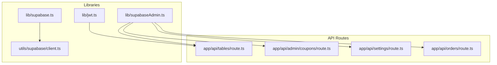
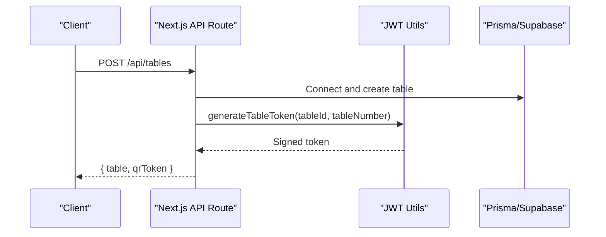
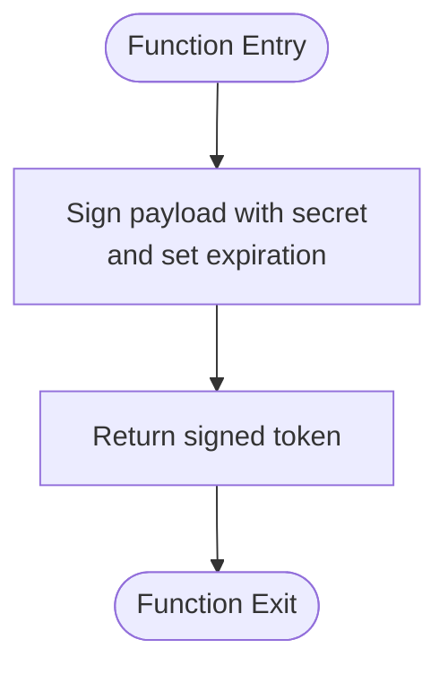
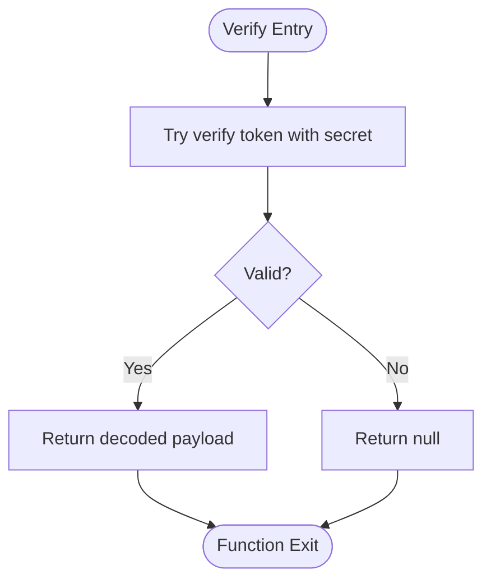
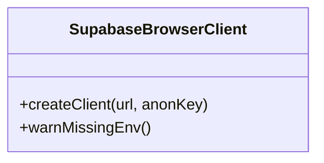
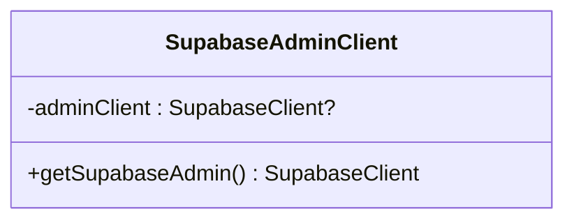
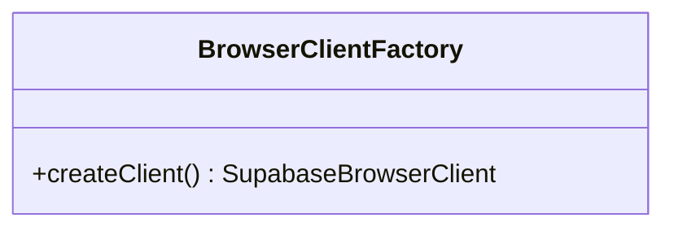
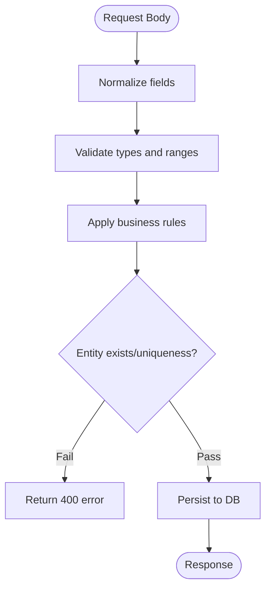
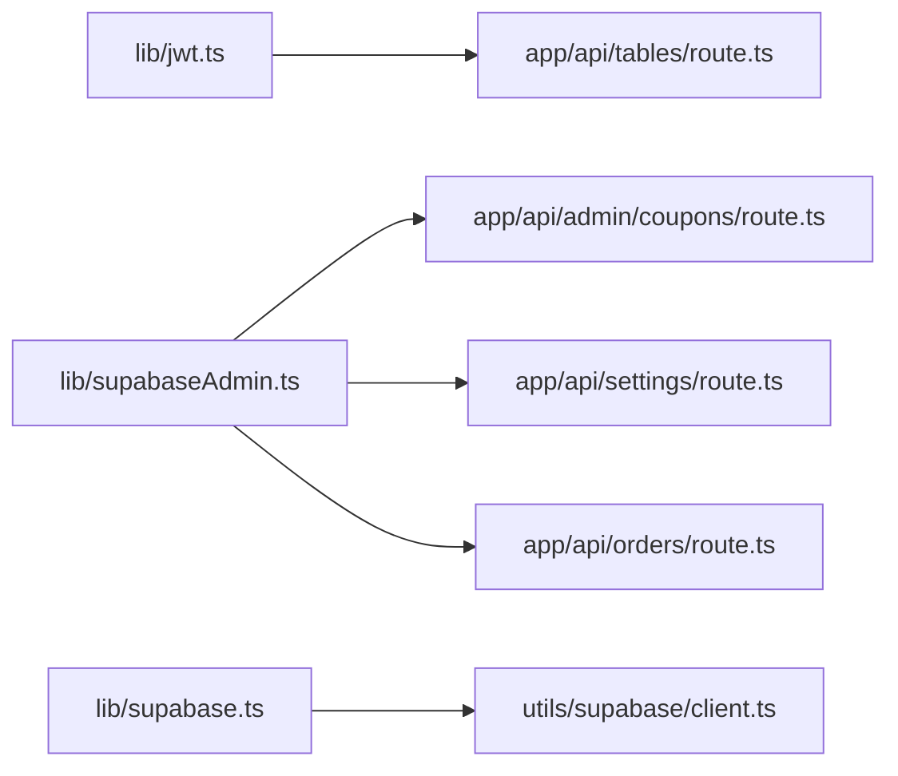

# Authentication & Security

<cite>
**Referenced Files in This Document**
- [lib/jwt.ts](file://lib/jwt.ts)
- [lib/supabase.ts](file://lib/supabase.ts)
- [lib/supabaseAdmin.ts](file://lib/supabaseAdmin.ts)
- [utils/supabase/client.ts](file://utils/supabase/client.ts)
- [app/api/tables/route.ts](file://app/api/tables/route.ts)
- [app/api/admin/coupons/route.ts](file://app/api/admin/coupons/route.ts)
- [app/api/settings/route.ts](file://app/api/settings/route.ts)
- [app/api/orders/route.ts](file://app/api/orders/route.ts)
</cite>

## Table of Contents
1. [Introduction](#introduction)
2. [Project Structure](#project-structure)
3. [Core Components](#core-components)
4. [Architecture Overview](#architecture-overview)
5. [Detailed Component Analysis](#detailed-component-analysis)
6. [Dependency Analysis](#dependency-analysis)
7. [Performance Considerations](#performance-considerations)
8. [Troubleshooting Guide](#troubleshooting-guide)
9. [Conclusion](#conclusion)

## Introduction
This document explains the backend authentication and security mechanisms, focusing on:
- JWT token generation and validation for table QR codes
- Supabase client integration (browser/anon and server/service-role)
- Route protection patterns and middleware usage
- Session management considerations
- Role-based access control guidance
- Security best practices for sensitive endpoints
- Examples of protected routes, token refresh strategies, and input validation patterns

The goal is to make these concepts accessible while providing precise references to the codebase.

## Project Structure
Security-related code is primarily located under lib/ for shared utilities and utils/supabase/ for browser client creation. API route handlers under app/api/ demonstrate how tokens are generated and used, and where additional protections should be applied.

**Diagram sources**
- [lib/jwt.ts:1-29](file://lib/jwt.ts#L1-L29)
- [lib/supabase.ts:1-22](file://lib/supabase.ts#L1-L22)
- [lib/supabaseAdmin.ts:1-22](file://lib/supabaseAdmin.ts#L1-L22)
- [utils/supabase/client.ts:1-11](file://utils/supabase/client.ts#L1-L11)
- [app/api/tables/route.ts:1-34](file://app/api/tables/route.ts#L1-L34)
- [app/api/admin/coupons/route.ts:1-129](file://app/api/admin/coupons/route.ts#L1-L129)
- [app/api/settings/route.ts:1-68](file://app/api/settings/route.ts#L1-L68)
- [app/api/orders/route.ts:34-199](file://app/api/orders/route.ts#L34-L199)

**Section sources**
- [lib/jwt.ts:1-29](file://lib/jwt.ts#L1-L29)
- [lib/supabase.ts:1-22](file://lib/supabase.ts#L1-L22)
- [lib/supabaseAdmin.ts:1-22](file://lib/supabaseAdmin.ts#L1-L22)
- [utils/supabase/client.ts:1-11](file://utils/supabase/client.ts#L1-L11)
- [app/api/tables/route.ts:1-34](file://app/api/tables/route.ts#L1-L34)
- [app/api/admin/coupons/route.ts:1-129](file://app/api/admin/coupons/route.ts#L1-L129)
- [app/api/settings/route.ts:1-68](file://app/api/settings/route.ts#L1-L68)
- [app/api/orders/route.ts:34-199](file://app/api/orders/route.ts#L34-L199)

## Core Components
- JWT Token Utilities: Generate and verify short-lived table QR tokens using a symmetric secret.
- Supabase Clients:
  - Browser/anon client for public or user-scoped operations.
  - Server-only admin client with service-role key for privileged operations.
- API Route Handlers: Demonstrate token generation and data validation; serve as examples for adding authorization checks.

Key responsibilities:
- lib/jwt.ts: Signing and verifying table QR tokens.
- lib/supabase.ts: Creating a browser/anon Supabase client instance.
- lib/supabaseAdmin.ts: Creating a server-only Supabase client with service-role privileges.
- utils/supabase/client.ts: Creating a browser client via @supabase/ssr.
- app/api/*: Route handlers that use Prisma and may integrate auth/middleware.

**Section sources**
- [lib/jwt.ts:1-29](file://lib/jwt.ts#L1-L29)
- [lib/supabase.ts:1-22](file://lib/supabase.ts#L1-L22)
- [lib/supabaseAdmin.ts:1-22](file://lib/supabaseAdmin.ts#L1-L22)
- [utils/supabase/client.ts:1-11](file://utils/supabase/client.ts#L1-L11)
- [app/api/tables/route.ts:1-34](file://app/api/tables/route.ts#L1-L34)
- [app/api/admin/coupons/route.ts:1-129](file://app/api/admin/coupons/route.ts#L1-L129)
- [app/api/settings/route.ts:1-68](file://app/api/settings/route.ts#L1-L68)
- [app/api/orders/route.ts:34-199](file://app/api/orders/route.ts#L34-L199)

## Architecture Overview
The system uses:
- Symmetric JWTs for table QR tokens (short-lived, signed with a secret).
- Supabase clients for database and storage interactions:
  - Anon/browser client for client-side or unauthenticated flows.
  - Service-role/admin client for server-side privileged operations.
- Next.js API routes for business logic, currently without centralized auth middleware.

**Diagram sources**
- [app/api/tables/route.ts:18-28](file://app/api/tables/route.ts#L18-L28)
- [lib/jwt.ts:15-17](file://lib/jwt.ts#L15-L17)

## Detailed Component Analysis

### JWT Token Generation and Validation
- Purpose: Create short-lived QR tokens tied to a table identity.
- Algorithm: Symmetric signing with HS256 via jsonwebtoken.
- Expiration: Tokens expire after a fixed duration.
- Verification: Validates signature and expiration; returns null on failure.

**Diagram sources**
- [lib/jwt.ts:15-17](file://lib/jwt.ts#L15-L17)

**Diagram sources**
- [lib/jwt.ts:22-27](file://lib/jwt.ts#L22-L27)

Security notes:
- The secret is read from environment variables with a fallback default. For production, ensure a strong secret is configured and never committed.
- Tokens include minimal claims (table identity and number), reducing exposure risk.
- Expiration limits the window of misuse if a token leaks.

Usage example:
- Table creation endpoint generates a token and stores it alongside the table record.

**Section sources**
- [lib/jwt.ts:1-29](file://lib/jwt.ts#L1-L29)
- [app/api/tables/route.ts:18-28](file://app/api/tables/route.ts#L18-L28)

### Supabase Client Integration

#### Browser/Anon Client
- Provides a singleton client for client-side or public operations.
- Uses NEXT_PUBLIC environment variables.
- Emits warnings in development when configuration is missing.

**Diagram sources**
- [lib/supabase.ts:1-22](file://lib/supabase.ts#L1-L22)

#### Server/Admin Client
- Creates a server-only client using service-role or secret key.
- Disables session persistence and auto-refresh to avoid browser-specific behavior on the server.
- Throws an error if required environment variables are missing.

**Diagram sources**
- [lib/supabaseAdmin.ts:1-22](file://lib/supabaseAdmin.ts#L1-L22)

#### Browser Client Factory (SSR)
- Wraps @supabase/ssr to create a browser-compatible client.
- Uses publishable keys intended for client-side usage.

**Diagram sources**
- [utils/supabase/client.ts:1-11](file://utils/supabase/client.ts#L1-L11)

Best practices:
- Never import the admin client into client components.
- Keep service-role keys strictly server-side.
- Validate environment variables at startup and fail fast in production.

**Section sources**
- [lib/supabase.ts:1-22](file://lib/supabase.ts#L1-L22)
- [lib/supabaseAdmin.ts:1-22](file://lib/supabaseAdmin.ts#L1-L22)
- [utils/supabase/client.ts:1-11](file://utils/supabase/client.ts#L1-L11)

### Middleware Implementation for Route Protection
Current state:
- No global auth middleware is present in the repository.
- Some routes perform input validation but do not enforce authentication or authorization.

Recommendations:
- Implement a central middleware to:
  - Extract and validate Authorization headers.
  - Verify JWTs (e.g., Supabase JWTs or custom tokens).
  - Attach user context (roles, permissions) to requests.
  - Enforce role-based access control (RBAC) per route.
- Apply middleware selectively to protected routes (e.g., admin endpoints).

Example pattern (conceptual):
- Middleware validates token, decodes claims, sets req.user, and checks roles before calling route handlers.

[No sources needed since this section provides general guidance]

### Session Management
- The server-side admin client disables session persistence and auto-refresh, which is appropriate for serverless/server contexts.
- For browser sessions, rely on Supabase’s built-in session handling via the browser client.
- If implementing custom sessions:
  - Store minimal identifiers server-side.
  - Use secure, HttpOnly cookies for tokens.
  - Rotate secrets periodically and implement token revocation lists if necessary.

[No sources needed since this section provides general guidance]

### Role-Based Access Control (RBAC)
- Not implemented in the current routes.
- Recommended approach:
  - Include roles/permissions in JWT claims.
  - Define role policies (e.g., admin, staff, customer).
  - Guard routes by checking roles in middleware or within handlers.
  - Combine RBAC with Supabase RLS for defense-in-depth at the database layer.

[No sources needed since this section provides general guidance]

### Input Validation Patterns
Routes demonstrate consistent validation patterns:
- Normalize and sanitize inputs (trim, uppercase, type coercion).
- Validate numeric ranges and date constraints.
- Return structured error responses with HTTP status codes.
- Perform existence/duplicate checks before writes.

Examples:
- Admin coupons route validates code uniqueness, discount types/values, and date ranges.
- Settings route validates percentage ranges and merges updates safely.
- Orders route validates items array, table number, promo IDs, add-ons, and coupon rules.

**Diagram sources**
- [app/api/admin/coupons/route.ts:30-129](file://app/api/admin/coupons/route.ts#L30-L129)
- [app/api/settings/route.ts:20-68](file://app/api/settings/route.ts#L20-L68)
- [app/api/orders/route.ts:34-199](file://app/api/orders/route.ts#L34-L199)

**Section sources**
- [app/api/admin/coupons/route.ts:1-129](file://app/api/admin/coupons/route.ts#L1-L129)
- [app/api/settings/route.ts:1-68](file://app/api/settings/route.ts#L1-L68)
- [app/api/orders/route.ts:34-199](file://app/api/orders/route.ts#L34-L199)

### Protected Routes Examples
- Currently unprotected:
  - GET/POST /api/tables
  - GET/PUT /api/settings
  - GET/POST /api/admin/coupons
- To protect:
  - Add middleware to require valid JWT and role checks.
  - Restrict admin endpoints to admin roles only.
  - Validate Authorization header format and reject malformed tokens early.

[No sources needed since this section provides general guidance]

### Token Refresh Strategies
- For short-lived QR tokens:
  - Regenerate upon table creation or periodic refresh if needed.
  - Invalidate old tokens by rotating secrets or maintaining a revocation list.
- For user sessions (Supabase):
  - Let the SDK handle refresh for browser clients.
  - On the server, re-validate tokens per request and cache minimal claims if needed.

[No sources needed since this section provides general guidance]

## Dependency Analysis

**Diagram sources**
- [lib/jwt.ts:1-29](file://lib/jwt.ts#L1-L29)
- [lib/supabaseAdmin.ts:1-22](file://lib/supabaseAdmin.ts#L1-L22)
- [lib/supabase.ts:1-22](file://lib/supabase.ts#L1-L22)
- [utils/supabase/client.ts:1-11](file://utils/supabase/client.ts#L1-L11)
- [app/api/tables/route.ts:1-34](file://app/api/tables/route.ts#L1-L34)
- [app/api/admin/coupons/route.ts:1-129](file://app/api/admin/coupons/route.ts#L1-L129)
- [app/api/settings/route.ts:1-68](file://app/api/settings/route.ts#L1-L68)
- [app/api/orders/route.ts:34-199](file://app/api/orders/route.ts#L34-L199)

**Section sources**
- [lib/jwt.ts:1-29](file://lib/jwt.ts#L1-L29)
- [lib/supabaseAdmin.ts:1-22](file://lib/supabaseAdmin.ts#L1-L22)
- [lib/supabase.ts:1-22](file://lib/supabase.ts#L1-L22)
- [utils/supabase/client.ts:1-11](file://utils/supabase/client.ts#L1-L11)
- [app/api/tables/route.ts:1-34](file://app/api/tables/route.ts#L1-L34)
- [app/api/admin/coupons/route.ts:1-129](file://app/api/admin/coupons/route.ts#L1-L129)
- [app/api/settings/route.ts:1-68](file://app/api/settings/route.ts#L1-L68)
- [app/api/orders/route.ts:34-199](file://app/api/orders/route.ts#L34-L199)

## Performance Considerations
- Prefer server-side validation and computation to reduce client trust assumptions.
- Batch database queries where possible (as seen in orders route).
- Avoid unnecessary token regeneration; cache validated claims briefly if safe.
- Use service-role client sparingly and only on the server to minimize privilege exposure.

[No sources needed since this section provides general guidance]

## Troubleshooting Guide
Common issues and resolutions:
- Missing Supabase environment variables:
  - Ensure NEXT_PUBLIC_SUPABASE_URL and NEXT_PUBLIC_SUPABASE_ANON_KEY are set for browser client.
  - Ensure SUPABASE_URL and SUPABASE_SECRET_KEY/SUPABASE_SERVICE_ROLE_KEY are set for admin client.
- Invalid or expired JWT:
  - Verify secret configuration and token expiration settings.
  - Check that tokens are regenerated appropriately.
- Input validation failures:
  - Review route handlers for strict validation and return meaningful errors.
- Unauthorized access:
  - Implement middleware to validate tokens and roles before processing requests.

**Section sources**
- [lib/supabase.ts:6-12](file://lib/supabase.ts#L6-L12)
- [lib/supabaseAdmin.ts:12-14](file://lib/supabaseAdmin.ts#L12-L14)
- [lib/jwt.ts:22-27](file://lib/jwt.ts#L22-L27)
- [app/api/admin/coupons/route.ts:46-92](file://app/api/admin/coupons/route.ts#L46-L92)
- [app/api/settings/route.ts:25-43](file://app/api/settings/route.ts#L25-L43)
- [app/api/orders/route.ts:34-48](file://app/api/orders/route.ts#L34-L48)

## Conclusion
The backend implements:
- Short-lived symmetric JWTs for table QR tokens.
- Separate Supabase clients for browser/anon and server/admin contexts.
- Consistent input validation across API routes.

To strengthen security:
- Introduce centralized middleware for authentication and authorization.
- Enforce RBAC on sensitive endpoints.
- Harden secret management and consider JWKS-based verification for Supabase JWTs where applicable.
- Maintain strict input validation and least-privilege access patterns.

[No sources needed since this section summarizes without analyzing specific files]