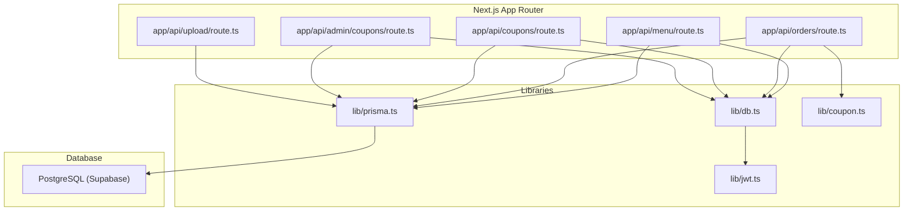
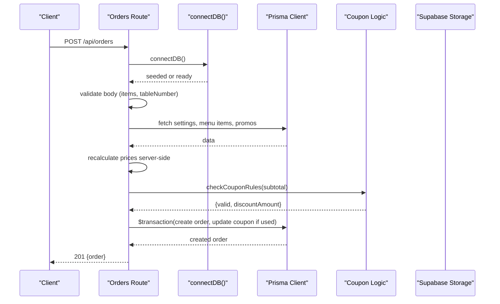
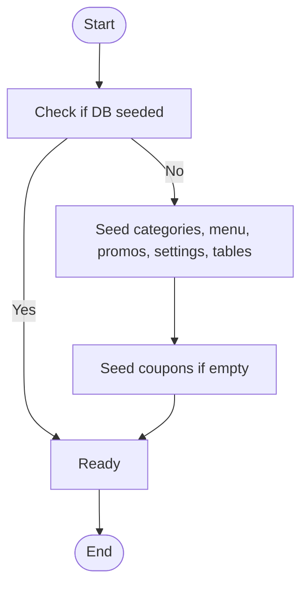
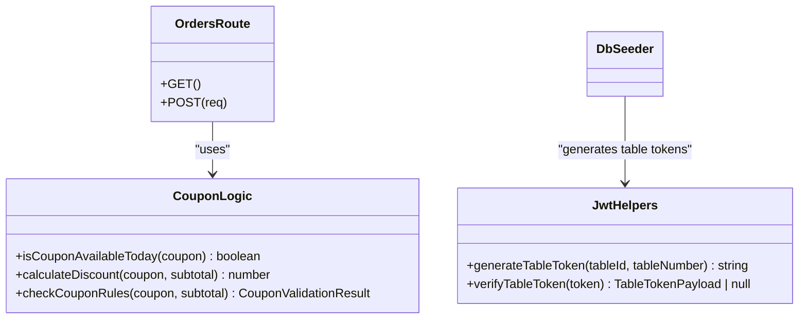
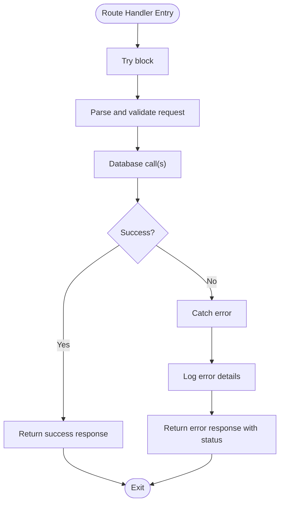
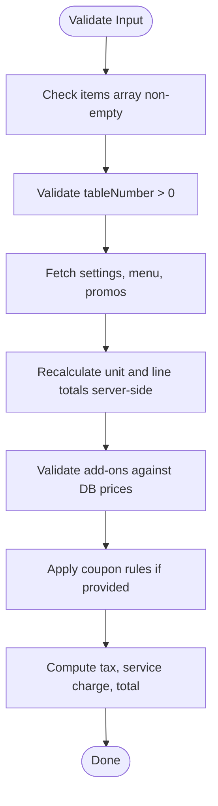
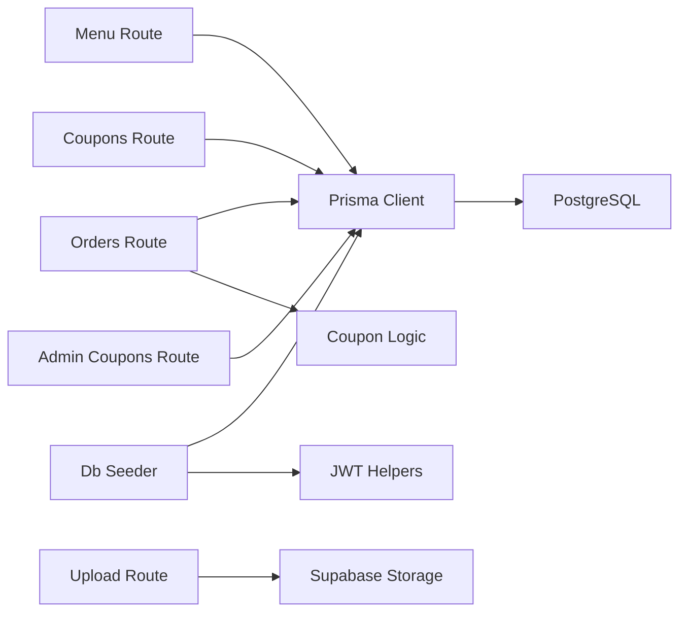

# Backend Architecture

<cite>
**Referenced Files in This Document**
- [schema.prisma](file://prisma/schema.prisma)
- [prisma.ts](file://lib/prisma.ts)
- [db.ts](file://lib/db.ts)
- [jwt.ts](file://lib/jwt.ts)
- [coupon.ts](file://lib/coupon.ts)
- [menu route.ts](file://app\api\menu\route.ts)
- [orders route.ts](file://app\api\orders\route.ts)
- [coupons route.ts](file://app\api\coupons\route.ts)
- [admin coupons route.ts](file://app\api\admin\coupons\route.ts)
- [upload route.ts](file://app\api\upload\route.ts)
</cite>

## Table of Contents
1. [Introduction](#introduction)
2. [Project Structure](#project-structure)
3. [Core Components](#core-components)
4. [Architecture Overview](#architecture-overview)
5. [Detailed Component Analysis](#detailed-component-analysis)
6. [Dependency Analysis](#dependency-analysis)
7. [Performance Considerations](#performance-considerations)
8. [Troubleshooting Guide](#troubleshooting-guide)
9. [Conclusion](#conclusion)

## Introduction
This document describes the backend architecture of the Warkop Betawa system built on Next.js App Router with Prisma ORM and PostgreSQL (via Supabase). It covers API route organization, RESTful endpoint design patterns, request/response handling, database connection management, middleware-like utilities for authentication and validation, and error handling strategies. It also includes examples of data validation patterns and security considerations for protecting sensitive endpoints.

## Project Structure
The backend exposes REST APIs under app/api organized by domain:
- menu: list and create menu items
- orders: list and create orders
- coupons: list active coupons
- admin/coupons: admin-only coupon management
- upload: image upload to storage
- categories, promos, tables, settings, chat: other domain routes present in the project

**Diagram sources**
- [menu route.ts:1-109](file://app\api\menu\route.ts#L1-L109)
- [orders route.ts:1-245](file://app\api\orders\route.ts#L1-L245)
- [coupons route.ts:1-33](file://app\api\coupons\route.ts#L1-L33)
- [admin coupons route.ts:1-129](file://app\api\admin\coupons\route.ts#L1-L129)
- [upload route.ts:1-74](file://app\api\upload\route.ts#L1-L74)
- [prisma.ts:1-40](file://lib/prisma.ts#L1-L40)
- [db.ts:1-161](file://lib/db.ts#L1-L161)
- [jwt.ts:1-29](file://lib/jwt.ts#L1-L29)
- [coupon.ts:1-133](file://lib/coupon.ts#L1-L133)

**Section sources**
- [menu route.ts:1-109](file://app\api\menu\route.ts#L1-L109)
- [orders route.ts:1-245](file://app\api\orders\route.ts#L1-L245)
- [coupons route.ts:1-33](file://app\api\coupons\route.ts#L1-L33)
- [admin coupons route.ts:1-129](file://app\api\admin\coupons\route.ts#L1-L129)
- [upload route.ts:1-74](file://app\api\upload\route.ts#L1-L74)
- [prisma.ts:1-40](file://lib/prisma.ts#L1-L40)
- [db.ts:1-161](file://lib/db.ts#L1-L161)
- [jwt.ts:1-29](file://lib/jwt.ts#L1-L29)
- [coupon.ts:1-133](file://lib/coupon.ts#L1-L133)

## Core Components
- API Routes (Next.js App Router): Domain-scoped handlers for menu, orders, coupons, admin coupons, and uploads. They parse requests, validate inputs, interact with the database via Prisma, and return standardized JSON responses.
- Database Layer: Prisma Client singleton with environment-aware logging; a connectDB utility that seeds initial data once per process lifetime.
- Utilities: JWT helpers for table QR tokens; coupon business logic for availability and discount calculation.
- Data Model: Prisma schema defines entities such as Category, MenuItem, RestaurantTable, Promo, Order, Coupon, Settings.

Key responsibilities:
- Request parsing and validation within route handlers
- Consistent error responses with HTTP status codes
- Secure price recalculation server-side for orders
- Safe file upload with type/size checks and bucket provisioning
- In-memory caching for public menu reads

**Section sources**
- [schema.prisma:1-107](file://prisma/schema.prisma#L1-L107)
- [prisma.ts:1-40](file://lib/prisma.ts#L1-L40)
- [db.ts:1-161](file://lib/db.ts#L1-L161)
- [jwt.ts:1-29](file://lib/jwt.ts#L1-L29)
- [coupon.ts:1-133](file://lib/coupon.ts#L1-L133)

## Architecture Overview
The backend follows a layered approach:
- API layer: Next.js App Router handlers for each domain
- Service/utilities layer: shared logic for coupons, JWT token generation/verification
- Data access layer: Prisma Client interacting with PostgreSQL
- Storage layer: Supabase Storage for images

**Diagram sources**
- [orders route.ts:23-245](file://app\api\orders\route.ts#L23-L245)
- [db.ts:40-50](file://lib/db.ts#L40-L50)
- [coupon.ts:80-133](file://lib/coupon.ts#L80-L133)
- [prisma.ts:14-25](file://lib/prisma.ts#L14-L25)

## Detailed Component Analysis

### API Route Organization and Patterns
- RESTful structure:
  - GET /api/menu: list active menu items and categories; supports ?all=true to include inactive
  - POST /api/menu: create menu item (admin use-case)
  - GET /api/orders: list all orders
  - POST /api/orders: create an order with server-side price recalculation and optional coupon application
  - GET /api/coupons: list active coupons valid today
  - GET /api/admin/coupons: list all coupons for admin
  - POST /api/admin/coupons: create a new coupon with validation
  - POST /api/upload: upload image to storage with type/size validation

- Request/response handling:
  - Use NextRequest/NextResponse for typed requests and responses
  - Validate inputs early and return 400 with descriptive errors
  - Return consistent JSON payloads with appropriate status codes (200, 201, 400, 500)
  - Centralize DB seeding via connectDB before operations

- Example patterns:
  - Menu listing with cache headers and conditional inclusion of inactive items
  - Orders creation with parallel fetching and transactional writes
  - Admin coupon creation with strict validation and duplicate code checks
  - Upload handler with MIME/type allowlist and size limits

**Section sources**
- [menu route.ts:1-109](file://app\api\menu\route.ts#L1-L109)
- [orders route.ts:1-245](file://app\api\orders\route.ts#L1-L245)
- [coupons route.ts:1-33](file://app\api\coupons\route.ts#L1-L33)
- [admin coupons route.ts:1-129](file://app\api\admin\coupons\route.ts#L1-L129)
- [upload route.ts:1-74](file://app\api\upload\route.ts#L1-L74)

### Database Connection Management (Prisma ORM)
- Singleton pattern:
  - lib/prisma.ts exports a single PrismaClient instance to avoid connection pool exhaustion during development hot reloads
  - Development logging emits query events and console logs durations

- Seeding and readiness:
  - lib/db.ts provides connectDB which seeds categories, menu items, promos, settings, and tables once per process lifetime
  - Coupons are seeded if none exist

- Schema model:
  - Entities include Category, MenuItem, RestaurantTable, Promo, Order, Coupon, Settings with indexes and mappings

**Diagram sources**
- [db.ts:40-159](file://lib/db.ts#L40-L159)
- [prisma.ts:14-36](file://lib/prisma.ts#L14-L36)
- [schema.prisma:11-107](file://prisma/schema.prisma#L11-L107)

**Section sources**
- [prisma.ts:1-40](file://lib/prisma.ts#L1-L40)
- [db.ts:1-161](file://lib/db.ts#L1-L161)
- [schema.prisma:1-107](file://prisma/schema.prisma#L1-L107)

### Middleware Implementation for Authentication and Validation
- Authentication:
  - JWT helpers generate and verify table QR tokens for table identification
  - Tokens are signed with a secret and have expiration

- Validation:
  - Input validation is performed inline in route handlers (e.g., required fields, numeric ranges, date validity)
  - Business rule validation for coupons encapsulated in lib/coupon.ts

- Security considerations:
  - Price recalculation server-side prevents client tampering
  - Add-on prices validated against DB values
  - File upload validates MIME types and size limits

**Diagram sources**
- [jwt.ts:1-29](file://lib/jwt.ts#L1-L29)
- [coupon.ts:1-133](file://lib/coupon.ts#L1-L133)
- [orders route.ts:23-245](file://app\api\orders\route.ts#L23-L245)
- [db.ts:146-156](file://lib/db.ts#L146-L156)

**Section sources**
- [jwt.ts:1-29](file://lib/jwt.ts#L1-L29)
- [coupon.ts:1-133](file://lib/coupon.ts#L1-L133)
- [orders route.ts:23-245](file://app\api\orders\route.ts#L23-L245)
- [db.ts:146-156](file://lib/db.ts#L146-L156)

### Error Handling Strategies
- Consistent error responses:
  - Each route catches exceptions and returns JSON with an error message and appropriate status codes
  - Logging uses console.error for diagnostics

- Transactional safety:
  - Orders creation wrapped in prisma.$transaction to ensure atomicity when updating coupon usage

- Graceful degradation:
  - connectDB retries seeding on failure and allows subsequent attempts

**Diagram sources**
- [menu route.ts:61-64](file://app\api\menu\route.ts#L61-L64)
- [orders route.ts:237-243](file://app\api\orders\route.ts#L237-L243)
- [coupons route.ts:25-31](file://app\api\coupons\route.ts#L25-L31)
- [admin coupons route.ts:121-127](file://app\api\admin\coupons\route.ts#L121-L127)
- [upload route.ts:69-72](file://app\api\upload\route.ts#L69-L72)

**Section sources**
- [menu route.ts:61-64](file://app\api\menu\route.ts#L61-L64)
- [orders route.ts:237-243](file://app\api\orders\route.ts#L237-L243)
- [coupons route.ts:25-31](file://app\api\coupons\route.ts#L25-L31)
- [admin coupons route.ts:121-127](file://app\api\admin\coupons\route.ts#L121-L127)
- [upload route.ts:69-72](file://app\api\upload\route.ts#L69-L72)

### Data Validation Patterns
- Required fields and types:
  - Name, category, price validations for menu creation
  - Items array non-empty and tableNumber positive integer for orders
  - Coupon creation requires code, title, discount value, start/end dates

- Business rules:
  - Coupon availability checks (active, date range, daily usage limit)
  - Minimum order amount enforcement
  - Percentage discount capped by maxDiscountAmount

**Diagram sources**
- [orders route.ts:33-185](file://app\api\orders\route.ts#L33-L185)
- [coupon.ts:80-133](file://lib/coupon.ts#L80-L133)

**Section sources**
- [orders route.ts:33-185](file://app\api\orders\route.ts#L33-L185)
- [coupon.ts:80-133](file://lib/coupon.ts#L80-L133)

### Security Considerations for Protecting Sensitive Endpoints
- Server-side price recalculation:
  - Prevents client manipulation of prices and totals
  - Add-on prices validated against DB values

- Transactional integrity:
  - Ensures coupon usage updates and order creation occur atomically

- File upload security:
  - Allowed MIME types enforced
  - Size limits applied
  - Bucket auto-provisioned with constraints

- Token-based identification:
  - Table QR tokens signed with a secret and expiration

**Section sources**
- [orders route.ts:23-245](file://app\api\orders\route.ts#L23-L245)
- [upload route.ts:33-74](file://app\api\upload\route.ts#L33-L74)
- [jwt.ts:1-29](file://lib/jwt.ts#L1-L29)

## Dependency Analysis

**Diagram sources**
- [menu route.ts:1-109](file://app\api\menu\route.ts#L1-L109)
- [orders route.ts:1-245](file://app\api\orders\route.ts#L1-L245)
- [coupons route.ts:1-33](file://app\api\coupons\route.ts#L1-L33)
- [admin coupons route.ts:1-129](file://app\api\admin\coupons\route.ts#L1-L129)
- [upload route.ts:1-74](file://app\api\upload\route.ts#L1-L74)
- [db.ts:1-161](file://lib/db.ts#L1-L161)
- [prisma.ts:1-40](file://lib/prisma.ts#L1-L40)
- [coupon.ts:1-133](file://lib/coupon.ts#L1-L133)
- [jwt.ts:1-29](file://lib/jwt.ts#L1-L29)

**Section sources**
- [menu route.ts:1-109](file://app\api\menu\route.ts#L1-L109)
- [orders route.ts:1-245](file://app\api\orders\route.ts#L1-L245)
- [coupons route.ts:1-33](file://app\api\coupons\route.ts#L1-L33)
- [admin coupons route.ts:1-129](file://app\api\admin\coupons\route.ts#L1-L129)
- [upload route.ts:1-74](file://app\api\upload\route.ts#L1-L74)
- [db.ts:1-161](file://lib/db.ts#L1-L161)
- [prisma.ts:1-40](file://lib/prisma.ts#L1-L40)
- [coupon.ts:1-133](file://lib/coupon.ts#L1-L133)
- [jwt.ts:1-29](file://lib/jwt.ts#L1-L29)

## Performance Considerations
- In-memory caching for public menu reads reduces DB load and latency
- Parallel queries using Promise.all minimize round-trips
- Prisma development logging helps identify slow queries
- Transactions reduce race conditions and improve consistency

[No sources needed since this section provides general guidance]

## Troubleshooting Guide
- Common issues:
  - DB seeding failures: connectDB retries and logs errors; ensure DATABASE_URL/DIRECT_URL configured correctly
  - Upload errors: verify Supabase storage bucket permissions and allowed MIME types
  - Coupon validation errors: check date ranges, minimum order amounts, and daily usage flags

- Diagnostics:
  - Console logs from route handlers and Prisma query events
  - Review error messages returned by handlers for actionable feedback

**Section sources**
- [db.ts:40-50](file://lib/db.ts#L40-L50)
- [upload route.ts:62-72](file://app\api\upload\route.ts#L62-L72)
- [orders route.ts:237-243](file://app\api\orders\route.ts#L237-L243)

## Conclusion
The Warkop Betawa backend leverages Next.js App Router for clean REST endpoints, Prisma ORM for robust database interactions, and well-structured utilities for validation and security. The design emphasizes server-side price recalculation, transactional integrity, and consistent error handling. With caching and parallel queries, it balances performance and reliability while maintaining clear separation of concerns across API, utilities, and data layers.