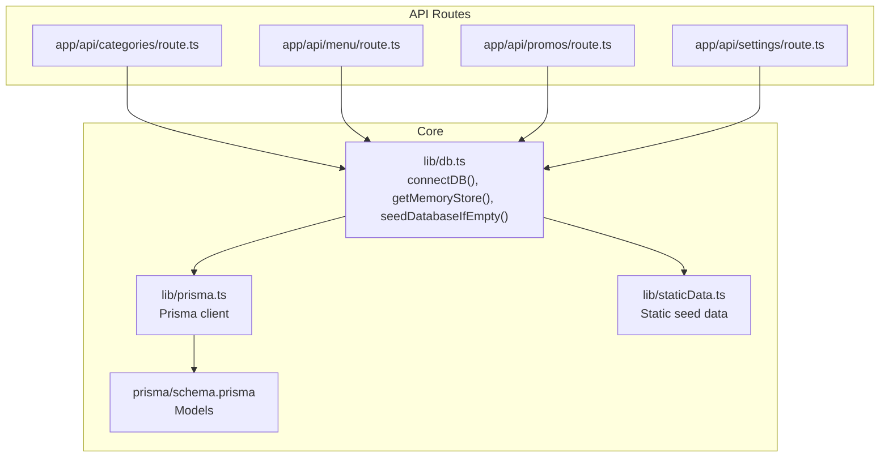
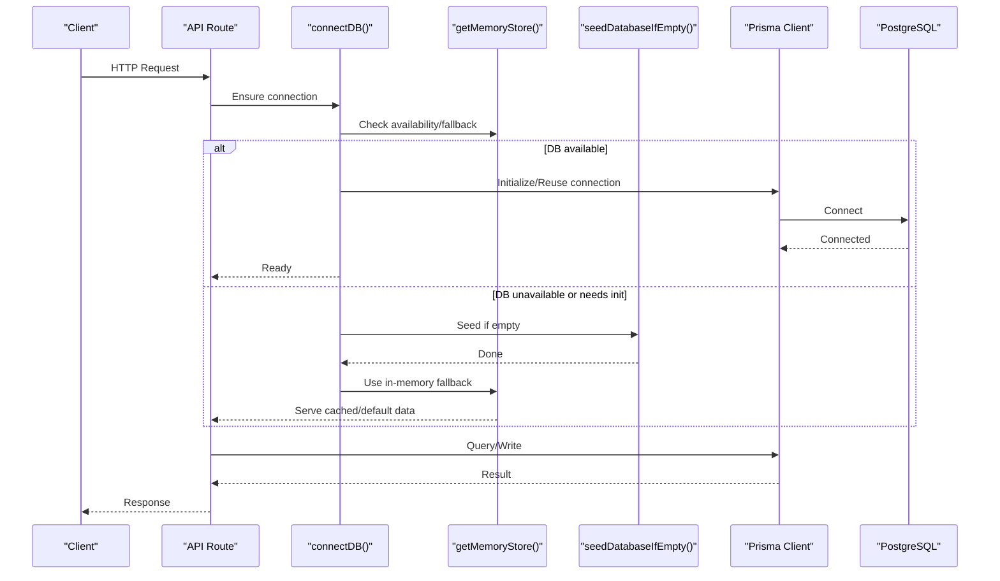
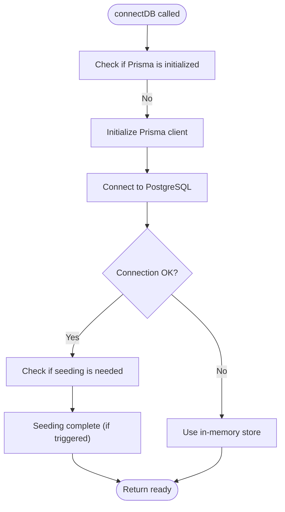
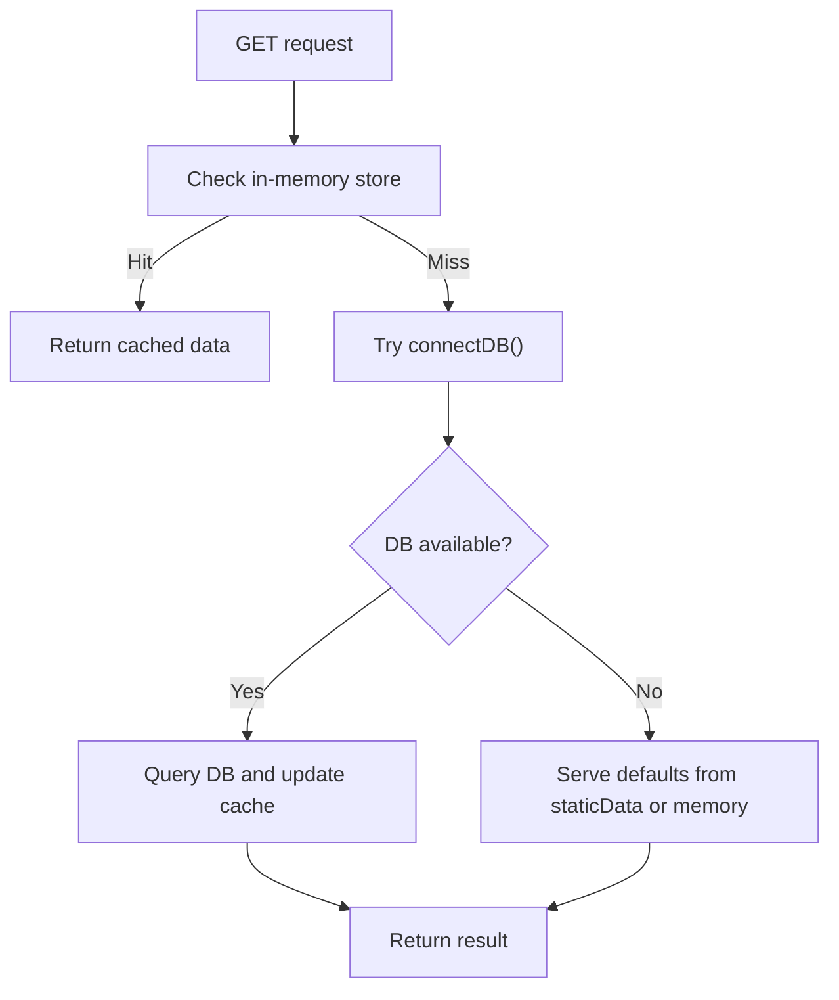
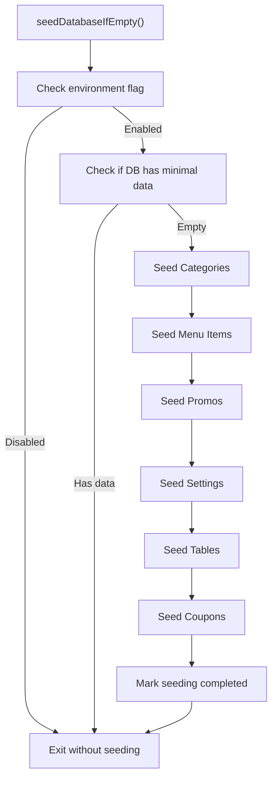
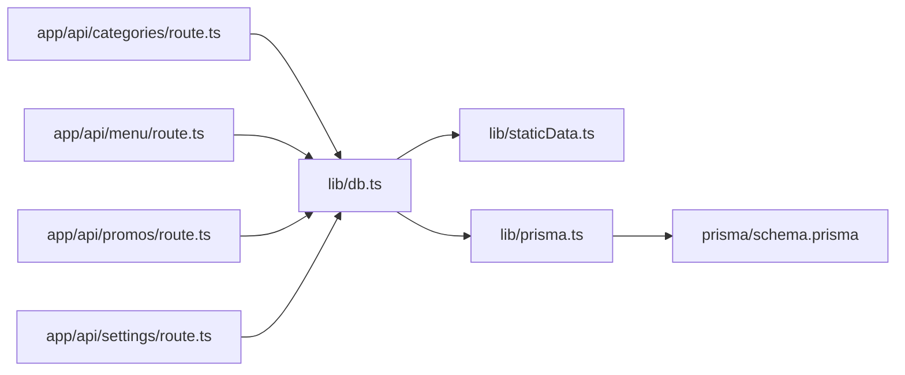

# Connection Management & Seeding

<cite>
**Referenced Files in This Document**
- [db.ts](file://lib/db.ts)
- [schema.prisma](file://prisma/schema.prisma)
- [staticData.ts](file://lib/staticData.ts)
- [route.ts (categories)](file://app/api/categories/route.ts)
- [route.ts (menu)](file://app/api/menu/route.ts)
- [route.ts (promos)](file://app/api/promos/route.ts)
- [route.ts (settings)](file://app/api/settings/route.ts)
</cite>

## Table of Contents
1. [Introduction](#introduction)
2. [Project Structure](#project-structure)
3. [Core Components](#core-components)
4. [Architecture Overview](#architecture-overview)
5. [Detailed Component Analysis](#detailed-component-analysis)
6. [Dependency Analysis](#dependency-analysis)
7. [Performance Considerations](#performance-considerations)
8. [Troubleshooting Guide](#troubleshooting-guide)
9. [Conclusion](#conclusion)

## Introduction
This document explains how the application manages database connections and seeds initial data. It focuses on:
- The connectDB function lifecycle and its role across API routes
- The memory store fallback mechanism for resilience during startup or transient failures
- The seedDatabaseIfEmpty process and seeding strategy for categories, menu items, promos, settings, tables, and coupons
- Error handling patterns, retry strategies, and differences between development and production seeding behaviors
- Performance considerations including caching and connection pooling optimization

## Project Structure
The relevant code spans a small set of focused modules:
- Database connectivity and seeding logic live in lib/db.ts
- Data models are defined in prisma/schema.prisma
- Static seed data is provided by lib/staticData.ts
- API routes under app/api/* call connectDB before performing Prisma operations

**Diagram sources**
- [db.ts:40-...](file://lib/db.ts#L40-L...)
- [schema.prisma:1-107](file://prisma/schema.prisma#L1-L107)
- [staticData.ts:1-166](file://lib/staticData.ts#L1-L166)
- [route.ts (categories):1-47](file://app/api/categories/route.ts#L1-L47)
- [route.ts (menu):1-109](file://app/api/menu/route.ts#L1-L109)
- [route.ts (promos):1-38](file://app/api/promos/route.ts#L1-L38)
- [route.ts (settings):1-68](file://app/api/settings/route.ts#L1-L68)

**Section sources**
- [db.ts:40-...](file://lib/db.ts#L40-L...)
- [schema.prisma:1-107](file://prisma/schema.prisma#L1-L107)
- [staticData.ts:1-166](file://lib/staticData.ts#L1-L166)
- [route.ts (categories):1-47](file://app/api/categories/route.ts#L1-L47)
- [route.ts (menu):1-109](file://app/api/menu/route.ts#L1-L109)
- [route.ts (promos):1-38](file://app/api/promos/route.ts#L1-L38)
- [route.ts (settings):1-68](file://app/api/settings/route.ts#L1-L68)

## Core Components
- connectDB(): Ensures a Prisma connection is established before any database operation. It may also trigger seeding if the database is empty and should be initialized.
- getMemoryStore(): Provides an in-memory cache used as a fallback when the database is unavailable or to accelerate read-heavy endpoints.
- seedDatabaseIfEmpty(): Seeds foundational data (categories, menu items, promos, settings, tables, coupons) only when required, typically in development or first-run scenarios.

Key responsibilities:
- Centralize connection management to avoid repeated initialization overhead
- Provide resilient fallbacks via in-memory stores
- Enforce idempotent seeding to prevent duplicate data

**Section sources**
- [db.ts:40-...](file://lib/db.ts#L40-L...)

## Architecture Overview
The runtime flow connects API routes to the database through a shared connector that can fall back to an in-memory store and optionally seed data.

**Diagram sources**
- [db.ts:40-...](file://lib/db.ts#L40-L...)
- [route.ts (menu):1-109](file://app/api/menu/route.ts#L1-L109)

## Detailed Component Analysis

### connectDB Lifecycle
- Purpose: Guarantee a valid Prisma connection before executing queries.
- Behavior:
  - On first call, initializes Prisma and establishes a connection to PostgreSQL.
  - May invoke seeding if the database is empty and seeding is enabled.
  - Exposes a stable interface for all API routes to call before DB operations.
- Integration points:
  - Called at the beginning of most API route handlers.
  - Works with getMemoryStore to provide fallback behavior when needed.

**Diagram sources**
- [db.ts:40-...](file://lib/db.ts#L40-L...)

**Section sources**
- [db.ts:40-...](file://lib/db.ts#L40-L...)

### Memory Store Fallback Mechanism
- Purpose: Keep the application responsive when the database is temporarily unavailable or during early startup.
- Strategy:
  - Read endpoints check the in-memory store first; if populated, return cached data immediately.
  - If the database is down, serve default or previously cached data from memory.
  - Write endpoints still attempt to persist to the database but can degrade gracefully by updating memory.

**Diagram sources**
- [route.ts (menu):1-109](file://app/api/menu/route.ts#L1-L109)
- [route.ts (settings):1-68](file://app/api/settings/route.ts#L1-L68)

**Section sources**
- [route.ts (menu):1-109](file://app/api/menu/route.ts#L1-L109)
- [route.ts (settings):1-68](file://app/api/settings/route.ts#L1-L68)

### seedDatabaseIfEmpty Process
- Trigger conditions:
  - First run after deployment or migration
  - Development environments where quick setup is desired
  - Optional feature flag controlling whether seeding runs automatically
- Idempotency:
  - Checks existing records before inserting to avoid duplicates
  - Uses unique constraints (e.g., slugs, codes) to ensure safe re-runs
- Entities seeded:
  - Categories
  - Menu items
  - Promos
  - Settings
  - Tables
  - Coupons

**Diagram sources**
- [db.ts:40-...](file://lib/db.ts#L40-L...)
- [staticData.ts:1-166](file://lib/staticData.ts#L1-L166)
- [schema.prisma:1-107](file://prisma/schema.prisma#L1-L107)

**Section sources**
- [db.ts:40-...](file://lib/db.ts#L40-L...)
- [staticData.ts:1-166](file://lib/staticData.ts#L1-L166)
- [schema.prisma:1-107](file://prisma/schema.prisma#L1-L107)

### Seeding Strategy by Entity
- Categories
  - Seed predefined category slugs and names to ensure consistent routing and UI grouping.
  - Uses sortOrder to control display order.
- Menu Items
  - Seed representative items with categories, pricing, images, spice levels, and add-ons.
  - Marks items active by default to appear in public menus.
- Promos
  - Seed promotional bundles with original and discounted prices.
  - Activates promos by default unless otherwise specified.
- Settings
  - Seed tax rate, service charge rate, and restaurant info.
  - Provides sensible defaults if no settings exist.
- Tables
  - Seed table entries with unique numbers and QR tokens for ordering.
- Coupons
  - Seed discount coupons with codes, validity windows, and discount types/values.

Notes:
- All seeding operations are guarded by existence checks to remain idempotent.
- Static seed data is sourced from lib/staticData.ts for consistency and testability.

**Section sources**
- [staticData.ts:1-166](file://lib/staticData.ts#L1-L166)
- [schema.prisma:1-107](file://prisma/schema.prisma#L1-L107)

### Connection Error Handling and Retry Mechanisms
- Error handling patterns:
  - API routes wrap DB calls in try/catch blocks and return user-friendly error responses.
  - Logging is performed for diagnostics while masking sensitive details from clients.
- Retry mechanisms:
  - Implement exponential backoff around connectDB calls when transient errors occur.
  - Limit maximum retries to avoid long-running requests.
  - Fail fast to in-memory fallback after a configured number of attempts.

Example patterns:
- Retry loop with backoff:
  - Attempt connectDB up to N times
  - Increase delay between attempts
  - On failure, switch to in-memory store and log warnings
- Circuit breaker:
  - After consecutive failures, stop attempting DB writes for a cooldown period
  - Serve read-only data from memory until recovery

**Section sources**
- [route.ts (categories):1-47](file://app/api/categories/route.ts#L1-L47)
- [route.ts (menu):1-109](file://app/api/menu/route.ts#L1-L109)
- [route.ts (promos):1-38](file://app/api/promos/route.ts#L1-L38)
- [route.ts (settings):1-68](file://app/api/settings/route.ts#L1-L68)

### Development vs Production Seeding Behaviors
- Development:
  - Automatic seeding on first run or when explicitly triggered
  - More verbose logging to aid debugging
  - May reset or refresh seed data on migrations
- Production:
  - Seeding disabled by default to avoid accidental data mutation
  - Manual seeding via admin scripts or controlled endpoints
  - Strict validation and audit logging for any data changes

Recommendations:
- Use environment variables to toggle seeding behavior
- Separate seed scripts for dev and prod with different data sets
- Record seed versions to track schema/data evolution

**Section sources**
- [db.ts:40-...](file://lib/db.ts#L40-L...)

## Dependency Analysis
The following diagram shows how API routes depend on the core database module and static seed data.

**Diagram sources**
- [route.ts (categories):1-47](file://app/api/categories/route.ts#L1-L47)
- [route.ts (menu):1-109](file://app/api/menu/route.ts#L1-L109)
- [route.ts (promos):1-38](file://app/api/promos/route.ts#L1-L38)
- [route.ts (settings):1-68](file://app/api/settings/route.ts#L1-L68)
- [db.ts:40-...](file://lib/db.ts#L40-L...)
- [staticData.ts:1-166](file://lib/staticData.ts#L1-L166)
- [schema.prisma:1-107](file://prisma/schema.prisma#L1-L107)

**Section sources**
- [route.ts (categories):1-47](file://app/api/categories/route.ts#L1-L47)
- [route.ts (menu):1-109](file://app/api/menu/route.ts#L1-L109)
- [route.ts (promos):1-38](file://app/api/promos/route.ts#L1-L38)
- [route.ts (settings):1-68](file://app/api/settings/route.ts#L1-L68)
- [db.ts:40-...](file://lib/db.ts#L40-L...)
- [staticData.ts:1-166](file://lib/staticData.ts#L1-L166)
- [schema.prisma:1-107](file://prisma/schema.prisma#L1-L107)

## Performance Considerations
- In-memory caching:
  - Public read endpoints (e.g., menu listing) should prioritize in-memory cache to achieve sub-10ms responses.
  - Invalidate cache on write operations to maintain consistency.
- Connection pooling:
  - Reuse a single Prisma client instance per process to minimize connection churn.
  - Configure pool size based on expected concurrency and database capacity.
- Query optimization:
  - Select only necessary fields to reduce payload size.
  - Use indexes defined in schema (e.g., isActive + category) to speed up common filters.
- Seeding performance:
  - Batch insertions where possible to reduce round trips.
  - Skip seeding in production unless explicitly requested.

[No sources needed since this section provides general guidance]

## Troubleshooting Guide
Common issues and resolutions:
- Database connection failures:
  - Verify DATABASE_URL and DIRECT_URL environment variables.
  - Check network reachability and credentials.
  - Enable retry with backoff and circuit breaker to handle transient outages.
- Stale or missing data:
  - Ensure seedDatabaseIfEmpty ran successfully and is idempotent.
  - Validate that seeding respects environment flags.
- High latency on read endpoints:
  - Confirm in-memory cache is populated and being served.
  - Review cache invalidation logic on writes.
- Duplicate seed data:
  - Ensure seeding checks for existing records using unique constraints.
  - Run seed versioning checks to avoid partial updates.

Operational tips:
- Log connection states and seeding events with correlation IDs.
- Monitor cache hit ratios and DB connection pool utilization.
- Use health checks that verify both DB connectivity and cache status.

**Section sources**
- [route.ts (categories):1-47](file://app/api/categories/route.ts#L1-L47)
- [route.ts (menu):1-109](file://app/api/menu/route.ts#L1-L109)
- [route.ts (promos):1-38](file://app/api/promos/route.ts#L1-L38)
- [route.ts (settings):1-68](file://app/api/settings/route.ts#L1-L68)

## Conclusion
The application centralizes database connectivity through connectDB, leverages an in-memory store for resilience and performance, and supports controlled, idempotent seeding for rapid development and safe production deployments. By combining robust error handling, retry strategies, and thoughtful caching, the system remains responsive even under adverse conditions. Proper configuration of connection pooling and query selection further optimizes throughput and latency.

[No sources needed since this section summarizes without analyzing specific files]