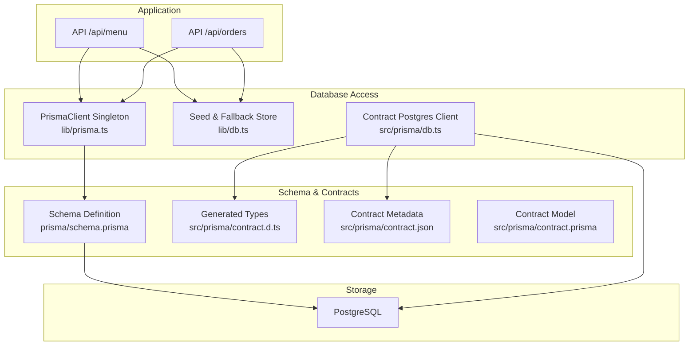
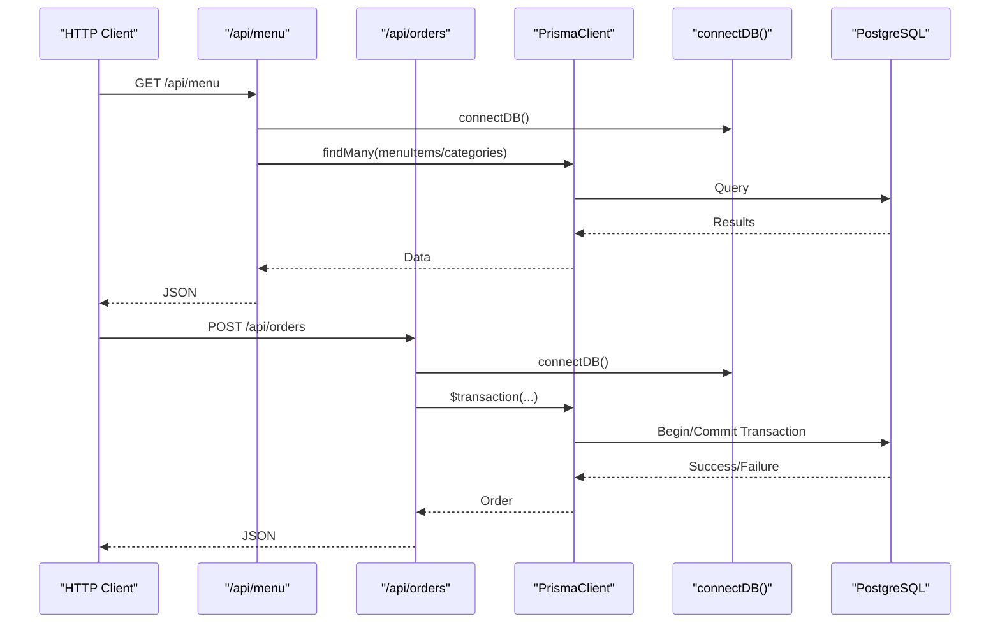
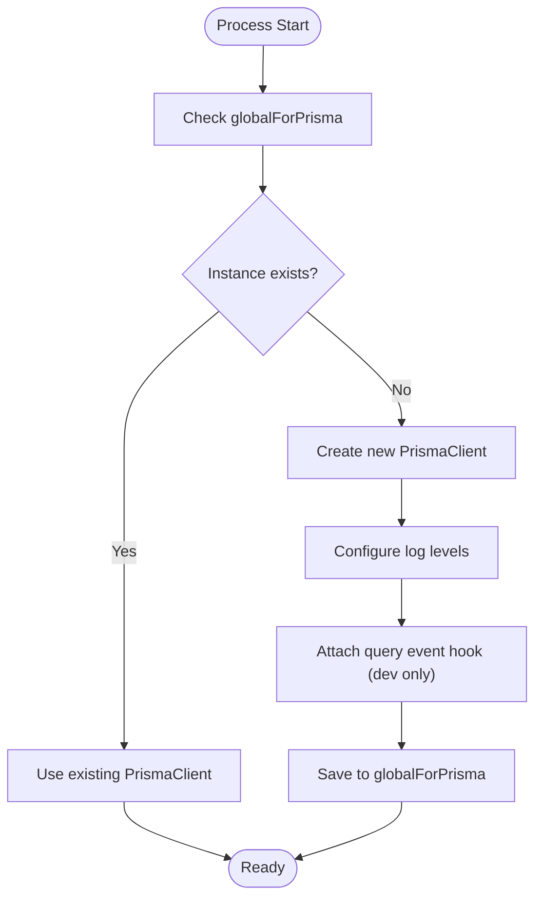
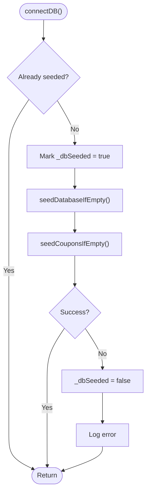
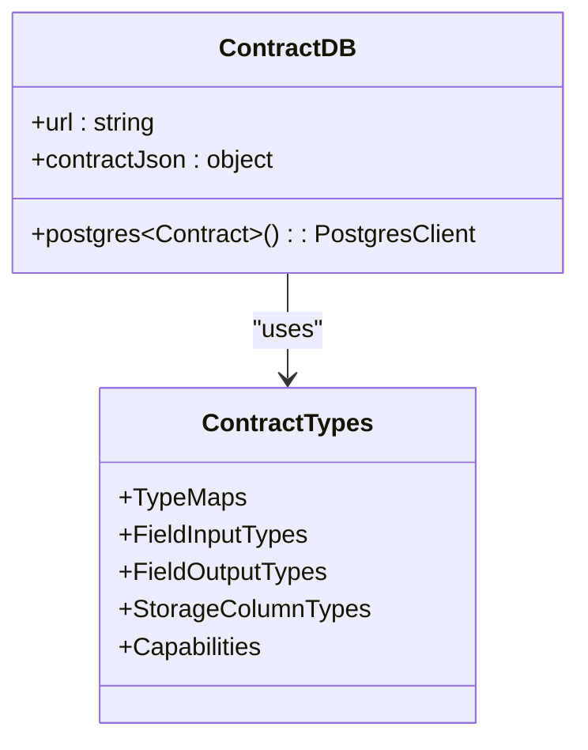
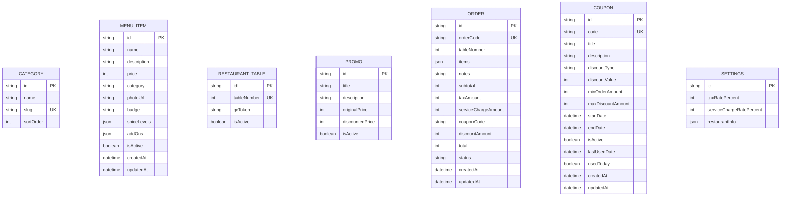
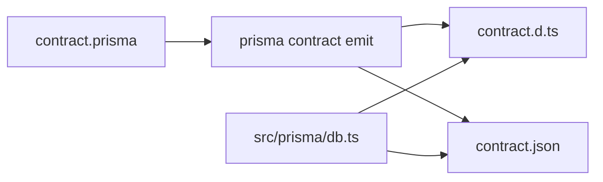
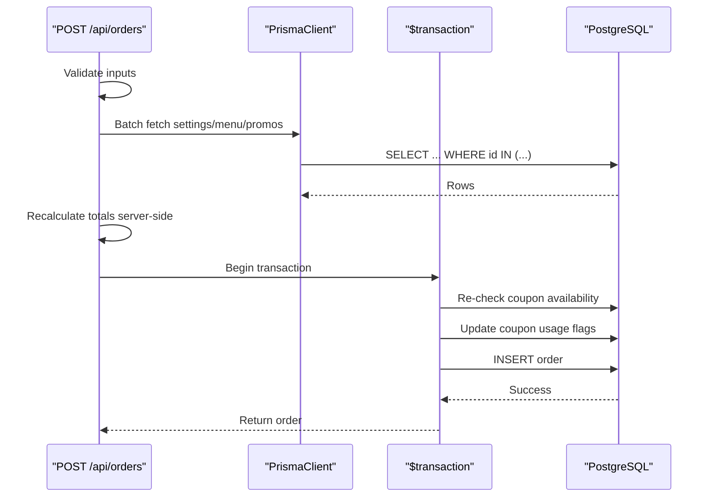
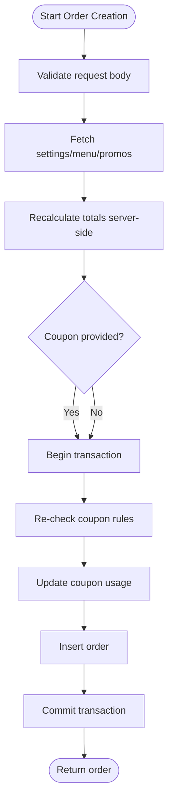
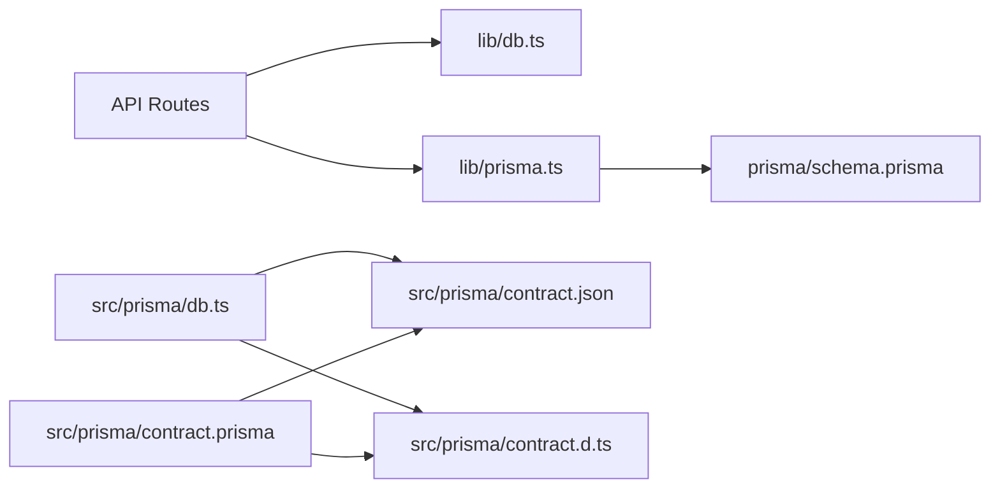

# Database Layer

<cite>
**Referenced Files in This Document**
- [schema.prisma](file://prisma/schema.prisma)
- [lib/prisma.ts](file://lib/prisma.ts)
- [lib/db.ts](file://lib/db.ts)
- [src/prisma/db.ts](file://src/prisma/db.ts)
- [src/prisma/contract.d.ts](file://src/prisma/contract.d.ts)
- [src/prisma/contract.json](file://src/prisma/contract.json)
- [src/prisma/contract.prisma](file://src/prisma/contract.prisma)
- [app/api/menu/route.ts](file://app/api/menu/route.ts)
- [app/api/orders/route.ts](file://app/api/orders/route.ts)
- [package.json](file://package.json)
</cite>

## Table of Contents
1. [Introduction](#introduction)
2. [Project Structure](#project-structure)
3. [Core Components](#core-components)
4. [Architecture Overview](#architecture-overview)
5. [Detailed Component Analysis](#detailed-component-analysis)
6. [Dependency Analysis](#dependency-analysis)
7. [Performance Considerations](#performance-considerations)
8. [Troubleshooting Guide](#troubleshooting-guide)
9. [Conclusion](#conclusion)

## Introduction
This document explains the database layer architecture, focusing on:
- Prisma ORM usage and client lifecycle
- Connection management via lib/db.ts and lib/prisma.ts
- Schema definition in prisma/schema.prisma
- Contract-based approach using src/prisma contract files
- Type safety, migrations, queries, relationships, transactions, and performance optimization techniques

The project uses two complementary database access patterns:
- A traditional Prisma Client instance for application logic (Next.js routes and seeding).
- A contract-driven Postgres runtime for type-safe, schema-constrained operations.

## Project Structure
Key database-related files and responsibilities:
- prisma/schema.prisma: Defines data models, indexes, and table mappings for PostgreSQL.
- lib/prisma.ts: Next.js-safe singleton PrismaClient with logging and connection pooling safeguards.
- lib/db.ts: Seed-on-first-run utilities and a memory fallback store when DB is unavailable.
- src/prisma/db.ts: Contract-based Postgres client initialized from contract metadata.
- src/prisma/contract.*: Generated contract types and JSON describing storage layout and capabilities.
- app/api/*: Route handlers that perform queries, mutations, caching, and transactional workflows.

**Diagram sources**
- [lib/prisma.ts:10-38](file://lib/prisma.ts#L10-L38)
- [lib/db.ts:32-50](file://lib/db.ts#L32-L50)
- [src/prisma/db.ts:1-10](file://src/prisma/db.ts#L1-L10)
- [src/prisma/contract.d.ts:1-44](file://src/prisma/contract.d.ts#L1-L44)
- [src/prisma/contract.json:1-15](file://src/prisma/contract.json#L1-L15)
- [src/prisma/contract.prisma:1-22](file://src/prisma/contract.prisma#L1-L22)
- [prisma/schema.prisma:1-10](file://prisma/schema.prisma#L1-L10)

**Section sources**
- [lib/prisma.ts:1-38](file://lib/prisma.ts#L1-L38)
- [lib/db.ts:1-161](file://lib/db.ts#L1-L161)
- [src/prisma/db.ts:1-10](file://src/prisma/db.ts#L1-L10)
- [src/prisma/contract.d.ts:1-44](file://src/prisma/contract.d.ts#L1-L44)
- [src/prisma/contract.json:1-15](file://src/prisma/contract.json#L1-L15)
- [src/prisma/contract.prisma:1-22](file://src/prisma/contract.prisma#L1-L22)
- [prisma/schema.prisma:1-107](file://prisma/schema.prisma#L1-L107)

## Core Components
- Prisma Client Singleton: Ensures one PrismaClient per process to avoid exhausting the connection pool during development hot reloads. Logs queries in development for diagnostics.
- Seed-and-Fallback Utilities: Provides connectDB() to seed initial data once per process and getMemoryStore() as an in-memory fallback when the database is unreachable.
- Contract-Based Postgres Client: Initializes a typed Postgres client bound to a generated contract describing tables, columns, relations, defaults, and capabilities.
- Schema Definition: Declares domain entities (Category, MenuItem, RestaurantTable, Promo, Order, Coupon, Settings), indexes, and table mappings.

**Section sources**
- [lib/prisma.ts:10-38](file://lib/prisma.ts#L10-L38)
- [lib/db.ts:22-50](file://lib/db.ts#L22-L50)
- [src/prisma/db.ts:1-10](file://src/prisma/db.ts#L1-L10)
- [prisma/schema.prisma:11-107](file://prisma/schema.prisma#L11-L107)

## Architecture Overview
The system combines:
- A Prisma Client instance used by route handlers for standard CRUD and seeding.
- A contract-driven Postgres client for strongly-typed operations aligned with the generated contract.
- A schema file that defines the canonical data model and constraints.

**Diagram sources**
- [app/api/menu/route.ts:7-65](file://app/api/menu/route.ts#L7-L65)
- [app/api/orders/route.ts:28-236](file://app/api/orders/route.ts#L28-L236)
- [lib/db.ts:40-50](file://lib/db.ts#L40-L50)
- [lib/prisma.ts:14-38](file://lib/prisma.ts#L14-L38)

## Detailed Component Analysis

### Prisma Client Lifecycle and Connection Management
- Singleton pattern prevents multiple PrismaClient instances across module re-evaluations in development.
- Logging configuration emits query events in development for performance monitoring.
- The client connects to PostgreSQL using DATABASE_URL; directUrl is also configured in the schema for tooling.

**Diagram sources**
- [lib/prisma.ts:10-38](file://lib/prisma.ts#L10-L38)

**Section sources**
- [lib/prisma.ts:1-38](file://lib/prisma.ts#L1-L38)
- [prisma/schema.prisma:5-9](file://prisma/schema.prisma#L5-L9)

### Seed-and-Fallback Strategy (lib/db.ts)
- connectDB() ensures seeding runs once per process lifetime, guarding against repeated seeds.
- On failure, it resets the seeded flag to allow retries.
- getMemoryStore() returns static data for scenarios where the database is unavailable.

**Diagram sources**
- [lib/db.ts:32-50](file://lib/db.ts#L32-L50)
- [lib/db.ts:52-89](file://lib/db.ts#L52-L89)
- [lib/db.ts:92-159](file://lib/db.ts#L92-L159)

**Section sources**
- [lib/db.ts:1-161](file://lib/db.ts#L1-L161)

### Contract-Based Postgres Client (src/prisma/db.ts)
- Initializes a Postgres client bound to the generated contract JSON and TypeScript types.
- Uses DATABASE_URL from environment variables.
- Provides a strongly-typed interface aligned with the contract’s storage layout and capabilities.

**Diagram sources**
- [src/prisma/db.ts:1-10](file://src/prisma/db.ts#L1-L10)
- [src/prisma/contract.d.ts:242-330](file://src/prisma/contract.d.ts#L242-L330)
- [src/prisma/contract.json:380-397](file://src/prisma/contract.json#L380-L397)

**Section sources**
- [src/prisma/db.ts:1-10](file://src/prisma/db.ts#L1-L10)
- [src/prisma/contract.d.ts:1-44](file://src/prisma/contract.d.ts#L1-L44)
- [src/prisma/contract.json:1-15](file://src/prisma/contract.json#L1-L15)

### Schema Definition and Data Integrity (prisma/schema.prisma)
- Models define primary keys, unique constraints, default values, timestamps, and JSON fields.
- Indexes are declared for common query patterns (e.g., status+createdAt, isActive+category).
- Table names are explicitly mapped to lowercase snake_case.

Key entities:
- Category: name, slug (unique), sortOrder.
- MenuItem: pricing, category reference, JSON arrays for spiceLevels/addOns, isActive, timestamps.
- RestaurantTable: tableNumber (unique), qrToken, isActive.
- Promo: pricing fields, isActive.
- Order: orderCode (unique), items JSON, financial totals, couponCode, status, timestamps.
- Coupon: discount rules, validity window, usage flags, timestamps.
- Settings: tax/service charge rates, restaurantInfo JSON.

**Diagram sources**
- [prisma/schema.prisma:11-107](file://prisma/schema.prisma#L11-L107)

**Section sources**
- [prisma/schema.prisma:1-107](file://prisma/schema.prisma#L1-L107)

### Contract Model and Generated Artifacts
- src/prisma/contract.prisma declares a minimal domain model used to generate the contract artifacts.
- src/prisma/contract.d.ts provides TypeScript types for codecs, field input/output, storage column types, and capability flags.
- src/prisma/contract.json captures the storage layout, foreign keys, indexes, defaults, and execution defaults.

**Diagram sources**
- [src/prisma/contract.prisma:1-22](file://src/prisma/contract.prisma#L1-L22)
- [src/prisma/contract.d.ts:1-44](file://src/prisma/contract.d.ts#L1-L44)
- [src/prisma/contract.json:1-15](file://src/prisma/contract.json#L1-L15)
- [src/prisma/db.ts:1-10](file://src/prisma/db.ts#L1-L10)

**Section sources**
- [src/prisma/contract.prisma:1-22](file://src/prisma/contract.prisma#L1-L22)
- [src/prisma/contract.d.ts:242-330](file://src/prisma/contract.d.ts#L242-L330)
- [src/prisma/contract.json:198-341](file://src/prisma/contract.json#L198-L341)

### Example Queries and Relationship Handling
- Menu listing: Parallel queries for menu items and categories with selective projection and ordering.
- Order creation: Server-side recalculation of prices, validation against DB, optional coupon checks, and atomic transactional writes.

**Diagram sources**
- [app/api/orders/route.ts:28-236](file://app/api/orders/route.ts#L28-L236)

**Section sources**
- [app/api/menu/route.ts:7-65](file://app/api/menu/route.ts#L7-L65)
- [app/api/orders/route.ts:28-236](file://app/api/orders/route.ts#L28-L236)

### Transactions and Data Integrity
- Order creation uses Prisma’s $transaction to ensure atomicity between coupon updates and order insertion.
- Coupon rules are re-checked inside the transaction to prevent race conditions.
- Financial totals are recalculated server-side to prevent manipulation.

**Diagram sources**
- [app/api/orders/route.ts:197-234](file://app/api/orders/route.ts#L197-L234)

**Section sources**
- [app/api/orders/route.ts:160-234](file://app/api/orders/route.ts#L160-L234)

## Dependency Analysis
- Application routes depend on lib/db.ts for seeding and lib/prisma.ts for the PrismaClient.
- The contract-based client depends on generated contract types and JSON metadata.
- The schema drives both Prisma Client generation and the contract artifacts.

**Diagram sources**
- [app/api/menu/route.ts:1-5](file://app/api/menu/route.ts#L1-L5)
- [app/api/orders/route.ts:1-4](file://app/api/orders/route.ts#L1-L4)
- [lib/db.ts:9-16](file://lib/db.ts#L9-L16)
- [lib/prisma.ts:8-9](file://lib/prisma.ts#L8-L9)
- [src/prisma/db.ts:1-5](file://src/prisma/db.ts#L1-L5)
- [src/prisma/contract.prisma:1-22](file://src/prisma/contract.prisma#L1-L22)

**Section sources**
- [app/api/menu/route.ts:1-109](file://app/api/menu/route.ts#L1-L109)
- [app/api/orders/route.ts:1-245](file://app/api/orders/route.ts#L1-L245)
- [lib/db.ts:1-161](file://lib/db.ts#L1-L161)
- [lib/prisma.ts:1-38](file://lib/prisma.ts#L1-L38)
- [src/prisma/db.ts:1-10](file://src/prisma/db.ts#L1-L10)
- [src/prisma/contract.prisma:1-22](file://src/prisma/contract.prisma#L1-L22)

## Performance Considerations
- Connection Pooling: The PrismaClient singleton avoids creating multiple connections per module evaluation, reducing pool exhaustion risk in development. Ensure production environments use appropriate pool sizing and consider a pooler if needed.
- Query Optimization:
  - Use select projections to limit returned columns.
  - Leverage indexes defined in the schema (e.g., orders.status+createdAt, menu_items.isActive+category).
  - Avoid N+1 queries by batching lookups (as seen in order creation fetching multiple IDs at once).
- Caching: Public menu reads use an in-memory cache to reduce database load and latency.
- Transactions: Keep transaction scopes minimal to reduce lock contention and deadlocks.

[No sources needed since this section provides general guidance]

## Troubleshooting Guide
- Seeding Failures: connectDB() resets the seeded flag on error to allow retry. Check logs for seed errors and verify DATABASE_URL connectivity.
- Development Logging: PrismaClient logs query durations and truncated queries in development to aid diagnosis.
- Contract Mismatch: If contract types or JSON are out of sync, regenerate them using the contract emit command referenced in the generated files.

**Section sources**
- [lib/db.ts:40-50](file://lib/db.ts#L40-L50)
- [lib/prisma.ts:30-36](file://lib/prisma.ts#L30-L36)
- [src/prisma/contract.d.ts:1-4](file://src/prisma/contract.d.ts#L1-L4)
- [src/prisma/contract.json:400-404](file://src/prisma/contract.json#L400-L404)

## Conclusion
The database layer combines a robust Prisma Client setup with a contract-driven Postgres client to provide strong typing and schema alignment. The schema defines clear integrity constraints and indexes, while route handlers demonstrate safe querying, caching, and transactional workflows. For optimal performance, maintain proper indexing, minimize transaction scope, and leverage batching and caching strategies.

[No sources needed since this section summarizes without analyzing specific files]