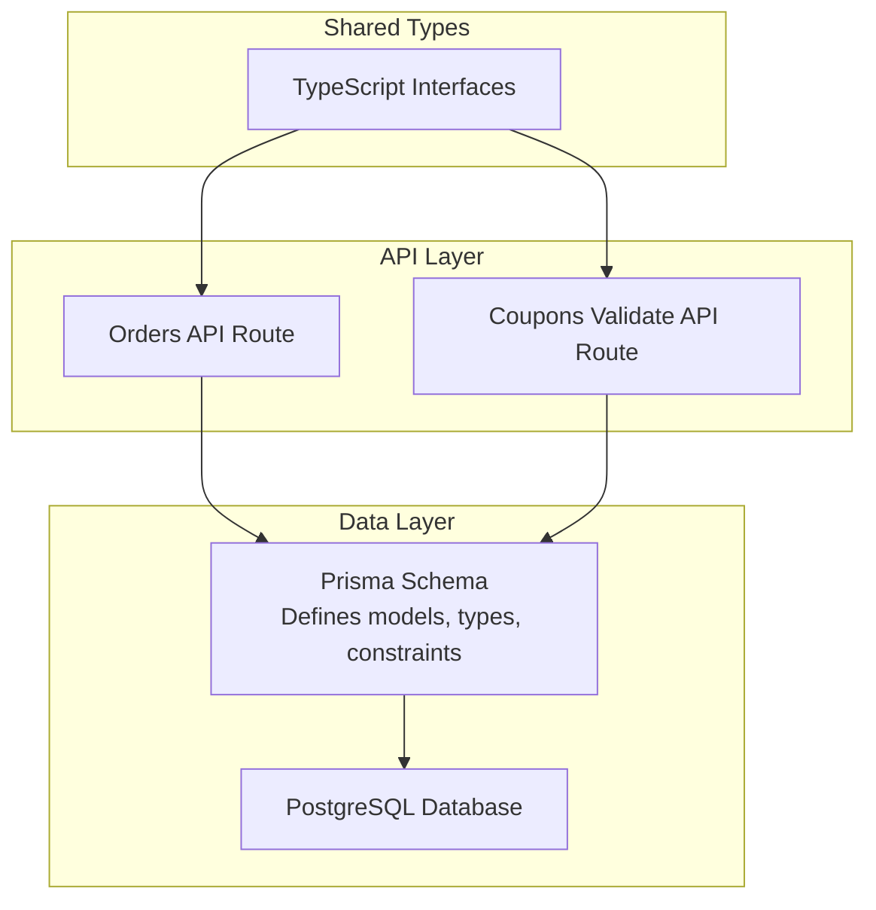
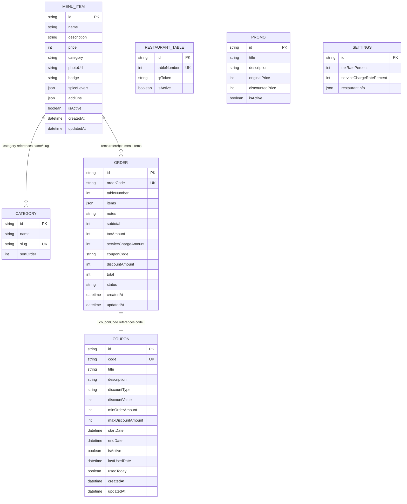
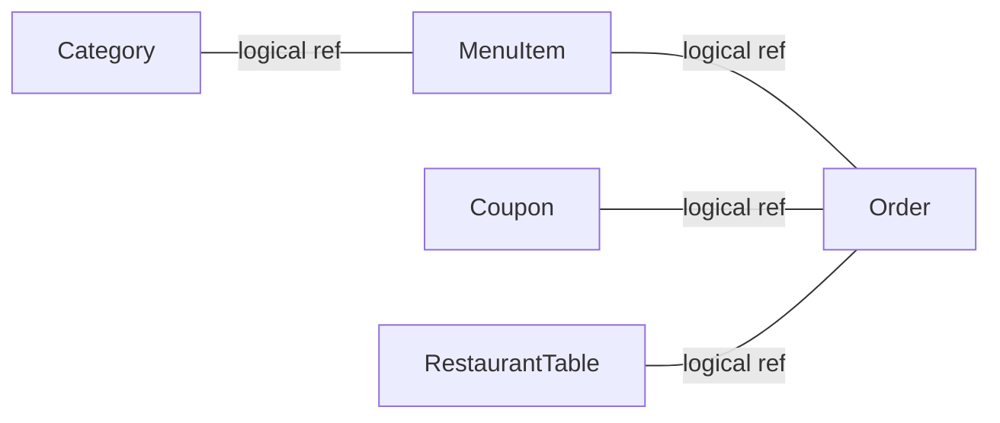

# Database Schema Design

<cite>
**Referenced Files in This Document**
- [schema.prisma](file://prisma/schema.prisma)
- [types.ts](file://lib/types.ts)
- [route.ts (orders)](file://app/api/orders/route.ts)
- [route.ts (coupons validate)](file://app/api/coupons/validate/route.ts)
- [coupon.ts](file://lib/coupon.ts)
- [prisma.ts](file://lib/prisma.ts)
</cite>

## Table of Contents
1. [Introduction](#introduction)
2. [Project Structure](#project-structure)
3. [Core Components](#core-components)
4. [Architecture Overview](#architecture-overview)
5. [Detailed Component Analysis](#detailed-component-analysis)
6. [Dependency Analysis](#dependency-analysis)
7. [Performance Considerations](#performance-considerations)
8. [Troubleshooting Guide](#troubleshooting-guide)
9. [Conclusion](#conclusion)

## Introduction
This document explains the database schema design and entity relationships for the application, focusing on the Prisma data model and how it is used by the API layer. It covers all models present in the schema: Category, MenuItem, RestaurantTable, Promo, Order, Coupon, and Settings. For each model, we describe fields, data types, constraints, indexes, and validation rules enforced at both the schema and application layers. We also provide diagrams to visualize entity relationships and key data flows such as order creation and coupon validation.

## Project Structure
The database contract is defined in a single Prisma schema file. The application uses Next.js API routes to perform CRUD operations against the PostgreSQL database via Prisma Client. Shared TypeScript interfaces mirror the Prisma models for type safety across the app.

**Diagram sources**
- [schema.prisma:1-107](file://prisma/schema.prisma#L1-L107)
- [route.ts (orders):1-245](file://app/api/orders/route.ts#L1-L245)
- [route.ts (coupons validate):1-58](file://app/api/coupons/validate/route.ts#L1-L58)
- [types.ts:1-119](file://lib/types.ts#L1-L119)

**Section sources**
- [schema.prisma:1-107](file://prisma/schema.prisma#L1-L107)
- [types.ts:1-119](file://lib/types.ts#L1-L119)

## Core Components
This section documents each model’s fields, data types, constraints, and indexes.

- Category
  - Fields: id (String, primary key), name (String), slug (String, unique), sortOrder (Int, default 0).
  - Constraints: Primary key on id; unique constraint on slug.
  - Indexes: None explicitly defined beyond PK and unique.
  - Notes: Used to categorize menu items; currently referenced by MenuItem.category as a string rather than a foreign key.

- MenuItem
  - Fields: id (String, PK), name (String), description (String), price (Int), category (String), photoUrl (String), badge (String, default "none"), spiceLevels (Json, default []), addOns (Json, default []), isActive (Boolean, default true), createdAt (DateTime, default now), updatedAt (DateTime, auto-updated).
  - Constraints: Primary key on id; no explicit NOT NULL or check constraints beyond defaults.
  - Indexes: Composite index on [isActive, category].
  - Notes: JSON fields store structured arrays for spice levels and add-ons.

- RestaurantTable
  - Fields: id (String, PK), tableNumber (Int, unique), qrToken (String), isActive (Boolean, default true).
  - Constraints: Primary key on id; unique constraint on tableNumber.
  - Indexes: None beyond PK and unique.

- Promo
  - Fields: id (String, PK), title (String), description (String), originalPrice (Int), discountedPrice (Int), isActive (Boolean, default true).
  - Constraints: Primary key on id.
  - Indexes: None.

- Order
  - Fields: id (String, PK), orderCode (String, unique), tableNumber (Int), items (Json, default []), notes (String, default ""), subtotal (Int), taxAmount (Int), serviceChargeAmount (Int), couponCode (String, nullable), discountAmount (Int, default 0), total (Int), status (String, default "received"), createdAt (DateTime, default now), updatedAt (DateTime, auto-updated).
  - Constraints: Primary key on id; unique constraint on orderCode.
  - Indexes: Composite index on [status, createdAt].
  - Notes: Monetary values are recalculated server-side during order creation.

- Coupon
  - Fields: id (String, PK), code (String, unique), title (String), description (String), discountType (String, enum-like comment), discountValue (Int), minOrderAmount (Int, default 0), maxDiscountAmount (Int, nullable), startDate (DateTime), endDate (DateTime), isActive (Boolean, default true), lastUsedDate (DateTime, nullable), usedToday (Boolean, default false), createdAt (DateTime, default now), updatedAt (DateTime, auto-updated).
  - Constraints: Primary key on id; unique constraint on code.
  - Indexes: Composite index on [code, isActive].
  - Notes: Business logic validates date ranges, daily usage, minimum order amount, and discount caps.

- Settings
  - Fields: id (String, PK), taxRatePercent (Int, default 10), serviceChargeRatePercent (Int, default 5), restaurantInfo (Json, default {}).
  - Constraints: Primary key on id.
  - Indexes: None.

**Section sources**
- [schema.prisma:11-18](file://prisma/schema.prisma#L11-L18)
- [schema.prisma:20-36](file://prisma/schema.prisma#L20-L36)
- [schema.prisma:38-45](file://prisma/schema.prisma#L38-L45)
- [schema.prisma:47-56](file://prisma/schema.prisma#L47-L56)
- [schema.prisma:58-76](file://prisma/schema.prisma#L58-L76)
- [schema.prisma:78-97](file://prisma/schema.prisma#L78-L97)
- [schema.prisma:99-106](file://prisma/schema.prisma#L99-L106)

## Architecture Overview
The system uses Prisma as the ORM over PostgreSQL. Models are defined declaratively in the Prisma schema. Application logic in API routes performs validations and calculations before persisting data. Relationships between entities are mostly logical (e.g., MenuItem.category references Category by string; Order.couponCode references Coupon.code) rather than enforced via foreign keys in the schema.

**Diagram sources**
- [schema.prisma:11-18](file://prisma/schema.prisma#L11-L18)
- [schema.prisma:20-36](file://prisma/schema.prisma#L20-L36)
- [schema.prisma:38-45](file://prisma/schema.prisma#L38-L45)
- [schema.prisma:47-56](file://prisma/schema.prisma#L47-L56)
- [schema.prisma:58-76](file://prisma/schema.prisma#L58-L76)
- [schema.prisma:78-97](file://prisma/schema.prisma#L78-L97)
- [schema.prisma:99-106](file://prisma/schema.prisma#L99-L106)

## Detailed Component Analysis

### Model: Category
- Purpose: Groups menu items into categories.
- Key attributes:
  - id: Unique identifier (cuid).
  - name: Display name.
  - slug: URL-friendly unique identifier.
  - sortOrder: Ordering hint.
- Constraints:
  - Primary key on id.
  - Unique on slug.
- Indexes:
  - None beyond PK and unique.
- Validation:
  - No explicit schema-level validation beyond uniqueness.

**Section sources**
- [schema.prisma:11-18](file://prisma/schema.prisma#L11-L18)

### Model: MenuItem
- Purpose: Represents individual menu products with optional metadata.
- Key attributes:
  - id: Unique identifier (cuid).
  - name, description: Textual details.
  - price: Integer monetary value (cents or smallest currency unit).
  - category: String referencing a category (logical relationship).
  - photoUrl: Image link.
  - badge: Optional label (default "none").
  - spiceLevels: JSON array of spice options.
  - addOns: JSON array of additional options with prices.
  - isActive: Boolean flag for availability.
  - createdAt, updatedAt: Timestamps.
- Constraints:
  - Primary key on id.
- Indexes:
  - Composite index on [isActive, category] to optimize queries filtering by active items and category.
- Validation:
  - Defaults applied for badge, spiceLevels, addOns, isActive, timestamps.
  - No NOT NULL or range checks on numeric fields.

**Section sources**
- [schema.prisma:20-36](file://prisma/schema.prisma#L20-L36)

### Model: RestaurantTable
- Purpose: Represents physical tables with QR tokens for ordering.
- Key attributes:
  - id: Unique identifier (cuid).
  - tableNumber: Unique integer identifier.
  - qrToken: Token associated with QR code.
  - isActive: Availability flag.
- Constraints:
  - Primary key on id.
  - Unique on tableNumber.
- Indexes:
  - None beyond PK and unique.

**Section sources**
- [schema.prisma:38-45](file://prisma/schema.prisma#L38-L45)

### Model: Promo
- Purpose: Stores promotional offers with original and discounted prices.
- Key attributes:
  - id: Unique identifier (cuid).
  - title, description: Promotional text.
  - originalPrice, discountedPrice: Integer monetary values.
  - isActive: Availability flag.
- Constraints:
  - Primary key on id.
- Indexes:
  - None.

**Section sources**
- [schema.prisma:47-56](file://prisma/schema.prisma#L47-L56)

### Model: Order
- Purpose: Captures customer orders with line items and totals.
- Key attributes:
  - id: Unique identifier (cuid).
  - orderCode: Unique human-readable code.
  - tableNumber: Integer linking to RestaurantTable.tableNumber (logical relationship).
  - items: JSON array of order line items.
  - notes: Optional text.
  - subtotal, taxAmount, serviceChargeAmount, discountAmount, total: Integer monetary values.
  - couponCode: Nullable code referencing Coupon.code (logical relationship).
  - status: Default "received".
  - createdAt, updatedAt: Timestamps.
- Constraints:
  - Primary key on id.
  - Unique on orderCode.
- Indexes:
  - Composite index on [status, createdAt] to optimize listing and sorting.
- Validation:
  - Server-side recalculation of monetary values during creation ensures integrity.

**Section sources**
- [schema.prisma:58-76](file://prisma/schema.prisma#L58-L76)
- [route.ts (orders):23-234](file://app/api/orders/route.ts#L23-L234)

### Model: Coupon
- Purpose: Defines discount coupons with business rules.
- Key attributes:
  - id: Unique identifier (cuid).
  - code: Unique code used for redemption.
  - title, description: Metadata.
  - discountType: Enum-like string ("PERCENTAGE" or "FIXED").
  - discountValue: Numeric discount value.
  - minOrderAmount: Minimum subtotal required.
  - maxDiscountAmount: Optional cap on percentage discounts.
  - startDate, endDate: Validity window.
  - isActive: Availability flag.
  - lastUsedDate, usedToday: Daily usage tracking.
  - createdAt, updatedAt: Timestamps.
- Constraints:
  - Primary key on id.
  - Unique on code.
- Indexes:
  - Composite index on [code, isActive] to speed up lookups and filtering.
- Validation:
  - Business logic enforces activation, date range, daily usage, minimum order amount, and discount caps.

**Section sources**
- [schema.prisma:78-97](file://prisma/schema.prisma#L78-L97)
- [coupon.ts:19-132](file://lib/coupon.ts#L19-L132)

### Model: Settings
- Purpose: Holds global configuration such as tax and service charge rates.
- Key attributes:
  - id: Unique identifier (cuid).
  - taxRatePercent: Default 10.
  - serviceChargeRatePercent: Default 5.
  - restaurantInfo: JSON object containing restaurant details.
- Constraints:
  - Primary key on id.
- Indexes:
  - None.

**Section sources**
- [schema.prisma:99-106](file://prisma/schema.prisma#L99-L106)

## Dependency Analysis
Relationships between entities are primarily logical rather than enforced via foreign keys:

- MenuItem.category references Category by string (name or slug). There is no foreign key constraint; referential integrity is maintained by application logic.
- Order.couponCode references Coupon.code. There is no foreign key constraint; uniqueness of code is enforced at the schema level.
- Order.tableNumber references RestaurantTable.tableNumber. There is no foreign key constraint; uniqueness of tableNumber is enforced at the schema level.
- Order.items contains JSON arrays of line items that logically reference MenuItem entries.

**Diagram sources**
- [schema.prisma:11-18](file://prisma/schema.prisma#L11-L18)
- [schema.prisma:20-36](file://prisma/schema.prisma#L20-L36)
- [schema.prisma:38-45](file://prisma/schema.prisma#L38-L45)
- [schema.prisma:58-76](file://prisma/schema.prisma#L58-L76)
- [schema.prisma:78-97](file://prisma/schema.prisma#L78-L97)

**Section sources**
- [schema.prisma:11-18](file://prisma/schema.prisma#L11-L18)
- [schema.prisma:20-36](file://prisma/schema.prisma#L20-L36)
- [schema.prisma:38-45](file://prisma/schema.prisma#L38-L45)
- [schema.prisma:58-76](file://prisma/schema.prisma#L58-L76)
- [schema.prisma:78-97](file://prisma/schema.prisma#L78-L97)

## Performance Considerations
- Indexes:
  - MenuItem has a composite index on [isActive, category], optimizing queries that filter by active items and category.
  - Order has a composite index on [status, createdAt], optimizing listing and sorting by status and time.
  - Coupon has an index on [code, isActive], optimizing lookups by code and filtering by active status.
- JSON fields:
  - spiceLevels, addOns, items, and restaurantInfo are stored as JSON. Querying within JSON may be less efficient; consider adding functional indexes if frequent JSON path queries are needed.
- Monetary values:
  - All monetary values are integers to avoid floating-point precision issues. Ensure consistent units (e.g., cents) across the application.

[No sources needed since this section provides general guidance]

## Troubleshooting Guide
Common issues and their resolutions related to the schema and data integrity:

- Duplicate codes:
  - Coupon.code and Order.orderCode are unique. Attempts to insert duplicates will fail. Ensure generation logic avoids collisions and retries when necessary.
- Invalid coupon usage:
  - Business rules enforce activation, date range, daily usage, and minimum order amount. If validation fails, return appropriate error messages to the client.
- Price manipulation:
  - The Orders API recalculates subtotal, tax, service charge, and total server-side. Do not trust client-supplied totals.
- Missing references:
  - Since relationships are logical, ensure that referenced entities exist before creating dependent records (e.g., valid category names, existing coupon codes, existing table numbers).

**Section sources**
- [route.ts (orders):23-234](file://app/api/orders/route.ts#L23-L234)
- [route.ts (coupons validate):1-58](file://app/api/coupons/validate/route.ts#L1-L58)
- [coupon.ts:19-132](file://lib/coupon.ts#L19-L132)

## Conclusion
The Prisma schema defines a clear set of models supporting a restaurant ordering system. While relationships are logical rather than enforced via foreign keys, the application layer enforces critical integrity rules, especially around pricing and coupon usage. Indexes are strategically placed to support common query patterns. To strengthen data integrity, consider introducing explicit foreign key constraints where appropriate and validating inputs more rigorously at the schema level using check constraints or enums.

[No sources needed since this section summarizes without analyzing specific files]