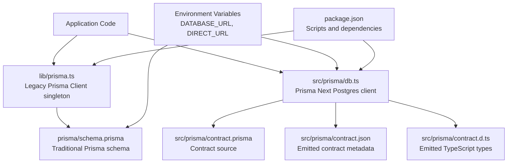
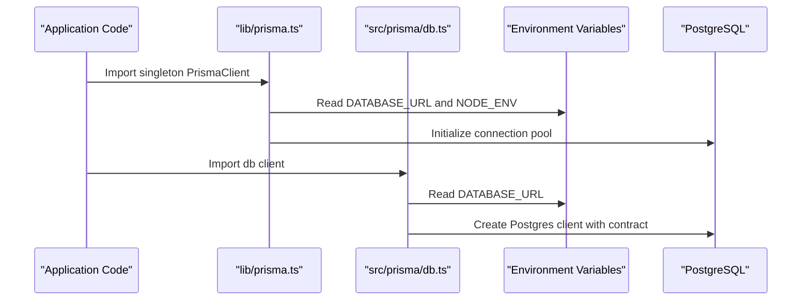
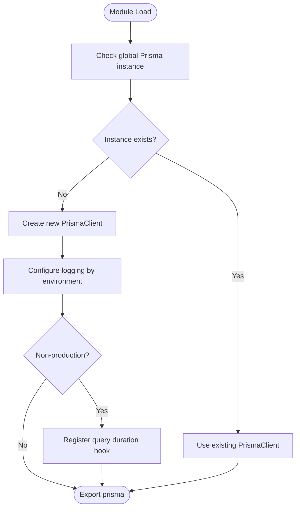
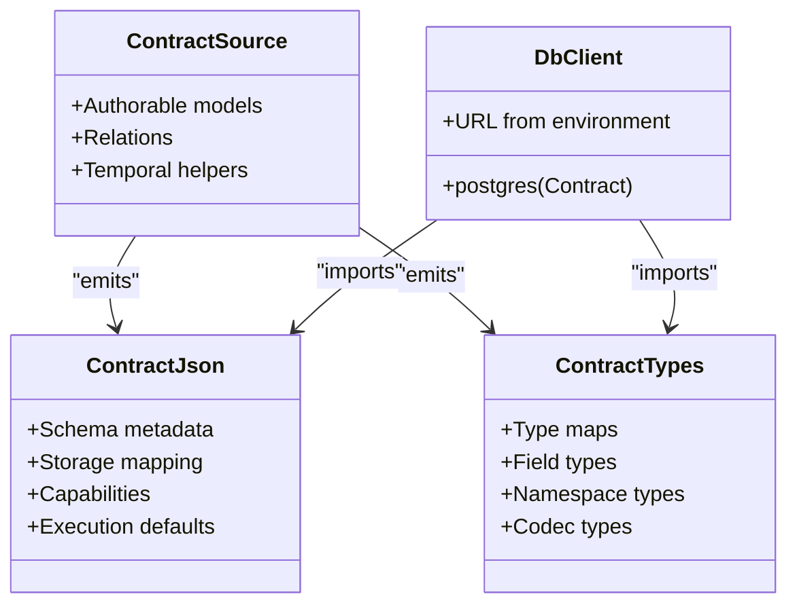
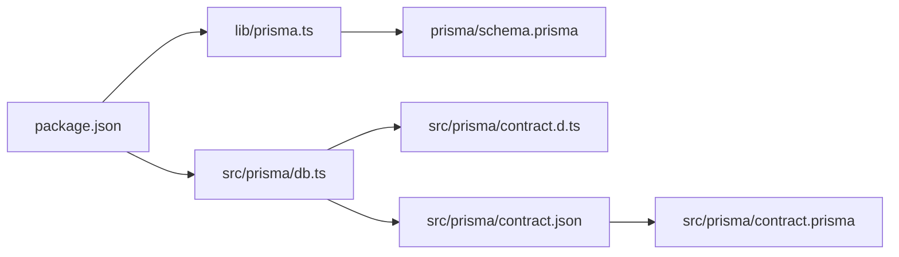

# Prisma Configuration

<cite>
**Referenced Files in This Document**
- [lib/prisma.ts](file://lib/prisma.ts)
- [prisma/schema.prisma](file://prisma/schema.prisma)
- [src/prisma/contract.d.ts](file://src/prisma/contract.d.ts)
- [src/prisma/contract.json](file://src/prisma/contract.json)
- [src/prisma/contract.prisma](file://src/prisma/contract.prisma)
- [src/prisma/db.ts](file://src/prisma/db.ts)
- [package.json](file://package.json)
- [prisma-next.md](file://prisma-next.md)
</cite>

## Table of Contents
1. [Introduction](#introduction)
2. [Project Structure](#project-structure)
3. [Core Components](#core-components)
4. [Architecture Overview](#architecture-overview)
5. [Detailed Component Analysis](#detailed-component-analysis)
6. [Dependency Analysis](#dependency-analysis)
7. [Performance Considerations](#performance-considerations)
8. [Troubleshooting Guide](#troubleshooting-guide)
9. [Conclusion](#conclusion)
10. [Appendices](#appendices)

## Introduction
This document explains how Prisma is configured and used in the project. It covers two complementary layers:

- The legacy Prisma Client layer under `lib/prisma.ts`, which initializes a singleton client for Next.js-safe usage, logs queries in development, and connects to PostgreSQL via environment variables.
- The Prisma Next contract-based layer under `src/prisma/`, where the data model is authored as a contract, emitted into type-safe artifacts, and consumed by a runtime database client that reads `DATABASE_URL` from the environment.

The repository also contains a traditional Prisma schema under `prisma/schema.prisma`. That file defines application models such as categories, menu items, orders, coupons, promos, tables, and settings. These are separate from the Prisma Next contract files under `src/prisma/`, so it is important to understand which layer your code uses.

## Project Structure
The relevant Prisma-related structure is:

- `lib/prisma.ts`: Next.js-safe Prisma Client singleton.
- `prisma/schema.prisma`: Traditional Prisma schema with application models.
- `src/prisma/contract.prisma`: Prisma Next contract source.
- `src/prisma/contract.json`: Emitted contract metadata.
- `src/prisma/contract.d.ts`: Emitted TypeScript types for the contract.
- `src/prisma/db.ts`: Runtime Postgres client wired to the contract and `DATABASE_URL`.
- `package.json`: Scripts and dependencies including Prisma and Prisma Client.
- `prisma-next.md`: Documentation describing Prisma Next configuration, commands, and layout.

**Diagram sources**
- [lib/prisma.ts:1-39](file://lib/prisma.ts#L1-L39)
- [prisma/schema.prisma:1-107](file://prisma/schema.prisma#L1-L107)
- [src/prisma/contract.prisma:1-22](file://src/prisma/contract.prisma#L1-L22)
- [src/prisma/contract.json:1-405](file://src/prisma/contract.json#L1-L405)
- [src/prisma/contract.d.ts:1-632](file://src/prisma/contract.d.ts#L1-L632)
- [src/prisma/db.ts:1-10](file://src/prisma/db.ts#L1-L10)
- [package.json:1-42](file://package.json#L1-L42)

**Section sources**
- [lib/prisma.ts:1-39](file://lib/prisma.ts#L1-L39)
- [prisma/schema.prisma:1-107](file://prisma/schema.prisma#L1-L107)
- [src/prisma/contract.prisma:1-22](file://src/prisma/contract.prisma#L1-L22)
- [src/prisma/contract.json:1-405](file://src/prisma/contract.json#L1-L405)
- [src/prisma/contract.d.ts:1-632](file://src/prisma/contract.d.ts#L1-L632)
- [src/prisma/db.ts:1-10](file://src/prisma/db.ts#L1-L10)
- [package.json:1-42](file://package.json#L1-L42)
- [prisma-next.md:43-92](file://prisma-next.md#L43-L92)

## Core Components
This section summarizes the main pieces involved in Prisma configuration and setup.

### Legacy Prisma Client Singleton
- File: `lib/prisma.ts`
- Purpose: Provides a Next.js-safe singleton instance of `PrismaClient`.
- Key behaviors:
  - Uses a global variable to avoid creating multiple clients during hot reload.
  - Configures logging differently in development versus production.
  - Subscribes to query events in non-production environments to log execution duration and truncated query previews.

**Section sources**
- [lib/prisma.ts:1-39](file://lib/prisma.ts#L1-L39)

### Traditional Prisma Schema
- File: `prisma/schema.prisma`
- Purpose: Defines the traditional Prisma data model for the application.
- Highlights:
  - PostgreSQL datasource using `DATABASE_URL` and `DIRECT_URL`.
  - Models include `Category`, `MenuItem`, `RestaurantTable`, `Promo`, `Order`, `Coupon`, and `Settings`.
  - Uses indexes, unique constraints, JSON fields, timestamps, and table mappings.

**Section sources**
- [prisma/schema.prisma:1-107](file://prisma/schema.prisma#L1-L107)

### Prisma Next Contract Source
- File: `src/prisma/contract.prisma`
- Purpose: Authorable contract for Prisma Next.
- Highlights:
  - Defines `User` and `Post` models.
  - Uses Prisma Next conventions such as temporal updated-at helpers.
  - Is not the same as the traditional schema under `prisma/schema.prisma`.

**Section sources**
- [src/prisma/contract.prisma:1-22](file://src/prisma/contract.prisma#L1-L22)

### Emitted Contract Artifacts
- Files:
  - `src/prisma/contract.json`
  - `src/prisma/contract.d.ts`
- Purpose: Generated artifacts produced by `prisma contract emit`.
- Highlights:
  - `contract.json` stores schema metadata, storage mapping, capabilities, execution defaults, and hashes.
  - `contract.d.ts` exports strongly typed contract definitions, codec types, aggregate types, field input/output types, and namespace information.
  - Both files are generated and should not be edited manually.

**Section sources**
- [src/prisma/contract.json:1-405](file://src/prisma/contract.json#L1-L405)
- [src/prisma/contract.d.ts:1-632](file://src/prisma/contract.d.ts#L1-L632)

### Prisma Next Database Client
- File: `src/prisma/db.ts`
- Purpose: Runtime entry point for the Prisma Next Postgres client.
- Highlights:
  - Imports the contract types from `contract.d.ts`.
  - Loads the emitted contract metadata from `contract.json`.
  - Creates a Postgres client using `DATABASE_URL` from the environment.

**Section sources**
- [src/prisma/db.ts:1-10](file://src/prisma/db.ts#L1-L10)

### Project Scripts and Dependencies
- File: `package.json`
- Purpose: Defines scripts and dependencies related to Prisma.
- Highlights:
  - Includes `@prisma/client` and `prisma`.
  - Runs `prisma skills sync` after install.
  - Does not define explicit migration or studio commands here; those are typically run through `npx prisma ...`.

**Section sources**
- [package.json:1-42](file://package.json#L1-L42)

## Architecture Overview
The project supports two Prisma integration patterns at the same time:

1. **Legacy Prisma Client pattern**:
   - Initialized in `lib/prisma.ts`.
   - Reads connection configuration from environment variables.
   - Uses the traditional schema under `prisma/schema.prisma`.

2. **Prisma Next contract pattern**:
   - Contract authored in `src/prisma/contract.prisma`.
   - Emits `contract.json` and `contract.d.ts`.
   - Runtime client created in `src/prisma/db.ts`.

**Diagram sources**
- [lib/prisma.ts:1-39](file://lib/prisma.ts#L1-L39)
- [src/prisma/db.ts:1-10](file://src/prisma/db.ts#L1-L10)
- [prisma/schema.prisma:5-9](file://prisma/schema.prisma#L5-L9)

## Detailed Component Analysis

### Legacy Prisma Client Initialization
The legacy client initialization focuses on safety in Next.js development and consistent logging behavior.

Key responsibilities:
- Singleton creation to prevent connection pool exhaustion during hot reload.
- Conditional logging based on environment.
- Query event subscription for performance monitoring in development.

**Diagram sources**
- [lib/prisma.ts:10-36](file://lib/prisma.ts#L10-L36)

**Section sources**
- [lib/prisma.ts:1-39](file://lib/prisma.ts#L1-L39)

### Connection Management to Supabase PostgreSQL
The traditional schema declares a PostgreSQL datasource and references environment variables:

- `url` is read from `DATABASE_URL`.
- `directUrl` is read from `DIRECT_URL`.

This means the database connection string must be provided through environment variables. The repository does not contain an `.env` file in the analyzed context, but the schema clearly expects these variables.

Important notes:
- The package dependencies include Supabase packages, but the Prisma schema itself only configures a standard PostgreSQL datasource.
- If you intend to connect directly to Supabase PostgreSQL, ensure `DATABASE_URL` points to the correct Supabase database endpoint.
- If you need role-first or service-role access patterns specific to Supabase, consult the Prisma Next Supabase reference rather than assuming the legacy client handles Supabase-specific authentication.

**Section sources**
- [prisma/schema.prisma:5-9](file://prisma/schema.prisma#L5-L9)
- [package.json:13-28](file://package.json#L13-L28)

### Environment Variable Configuration
Environment variables are central to both layers:

- `DATABASE_URL`: Required by both the traditional schema and the Prisma Next runtime client.
- `DIRECT_URL`: Used by the traditional schema for direct connection scenarios.
- `NODE_ENV`: Controls logging behavior in the legacy client.

Recommended environment variables:
- `DATABASE_URL`: PostgreSQL connection string.
- `DIRECT_URL`: Direct connection URL if required by your deployment.
- `NODE_ENV`: Set to `development` or `production` depending on the environment.

If you use Prisma Next CLI configuration, the documentation indicates that `prisma.config.ts` loads environment variables automatically when configured accordingly.

**Section sources**
- [lib/prisma.ts:16-24](file://lib/prisma.ts#L16-L24)
- [prisma/schema.prisma:5-9](file://prisma/schema.prisma#L5-L9)
- [src/prisma/db.ts:6-9](file://src/prisma/db.ts#L6-L9)
- [prisma-next.md:47-72](file://prisma-next.md#L47-L72)

### Contract-Based Approach Using `src/prisma/contract` Files
The contract-based approach separates the authorable schema from generated artifacts:

- `src/prisma/contract.prisma`: Authorable contract.
- `src/prisma/contract.json`: Emitted contract metadata.
- `src/prisma/contract.d.ts`: Emitted TypeScript types.
- `src/prisma/db.ts`: Runtime client that consumes the contract.

Benefits:
- Strongly typed database operations through emitted types.
- Clear separation between schema definition and generated artifacts.
- Centralized runtime client configuration.

**Diagram sources**
- [src/prisma/contract.prisma:1-22](file://src/prisma/contract.prisma#L1-L22)
- [src/prisma/contract.json:1-405](file://src/prisma/contract.json#L1-L405)
- [src/prisma/contract.d.ts:1-632](file://src/prisma/contract.d.ts#L1-L632)
- [src/prisma/db.ts:1-10](file://src/prisma/db.ts#L1-L10)

**Section sources**
- [src/prisma/contract.prisma:1-22](file://src/prisma/contract.prisma#L1-L22)
- [src/prisma/contract.json:1-405](file://src/prisma/contract.json#L1-L405)
- [src/prisma/contract.d.ts:1-632](file://src/prisma/contract.d.ts#L1-L632)
- [src/prisma/db.ts:1-10](file://src/prisma/db.ts#L1-L10)

### Database Connection Pooling
Connection pooling is handled by the underlying Prisma client implementations:

- The legacy client in `lib/prisma.ts` creates a single `PrismaClient` instance and reuses it globally in development.
- The Prisma Next client in `src/prisma/db.ts` creates a Postgres client using the contract and environment URL.

Recommendations:
- Keep a single client instance per process to avoid exhausting connection pools.
- In serverless or long-running processes, ensure proper teardown if needed.
- Monitor connection limits on your PostgreSQL provider, especially with Supabase.

**Section sources**
- [lib/prisma.ts:10-28](file://lib/prisma.ts#L10-L28)
- [src/prisma/db.ts:6-9](file://src/prisma/db.ts#L6-L9)

### Error Handling
Error handling is present in the following ways:

- The legacy client configures error-level logging in production.
- Development logging includes query events and warning/error output.
- The Prisma Next runtime client relies on the underlying Postgres client for runtime errors.

Best practices:
- Wrap database calls in try/catch blocks in application code.
- Log structured errors without exposing secrets like `DATABASE_URL`.
- Use appropriate HTTP responses for API routes when database operations fail.

**Section sources**
- [lib/prisma.ts:16-24](file://lib/prisma.ts#L16-L24)
- [lib/prisma.ts:27-36](file://lib/prisma.ts#L27-L36)

### Testing Configurations
The repository does not include dedicated test configuration files for Prisma in the analyzed context. However, typical testing considerations include:

- Use a separate test database URL.
- Reset or migrate the test database before running tests.
- Avoid sharing the production client instance across tests.
- For Prisma Next, consider resetting contract artifacts or using isolated databases.

Since no explicit test setup was found, this guidance is conceptual and not tied to specific test files in the repository.

[No sources needed since this section provides general guidance]

### Prisma Schema Generation and Migration Setup
There are two distinct areas:

1. **Traditional Prisma schema generation**:
   - `prisma/schema.prisma` defines models and datasource configuration.
   - Commands such as `prisma generate` and `prisma migrate` are commonly used with this schema.

2. **Prisma Next contract generation and migrations**:
   - `src/prisma/contract.prisma` is the authorable contract.
   - Run `prisma contract emit` to regenerate `contract.json` and `contract.d.ts`.
   - Use Prisma Next migration commands as documented in the Prisma Next reference.

Example workflow:
- Update `src/prisma/contract.prisma`.
- Run `prisma contract emit`.
- Apply migrations using the appropriate Prisma Next command.
- Verify the live schema if needed.

**Section sources**
- [prisma/schema.prisma:1-107](file://prisma/schema.prisma#L1-L107)
- [src/prisma/contract.prisma:1-22](file://src/prisma/contract.prisma#L1-L22)
- [src/prisma/contract.json:400-405](file://src/prisma/contract.json#L400-L405)
- [src/prisma/contract.d.ts:1-3](file://src/prisma/contract.d.ts#L1-L3)
- [prisma-next.md:74-92](file://prisma-next.md#L74-L92)

### Development Workflow with Prisma Studio
The repository does not include a built-in Prisma Studio configuration in the analyzed files. The Prisma Next reference explicitly states that there is no first-party Studio and suggests alternative tools such as third-party GUIs or CLI schema inspection.

Recommendations:
- Use a database GUI tool connected to `DATABASE_URL`.
- Use `prisma db schema` to inspect the live schema via CLI.
- If you require a GUI, choose a supported third-party tool against your PostgreSQL instance.

**Section sources**
- [prisma-next.md:43-92](file://prisma-next.md#L43-L92)

## Dependency Analysis
The following diagram shows how key files depend on each other:

**Diagram sources**
- [package.json:13-39](file://package.json#L13-L39)
- [lib/prisma.ts:8-8](file://lib/prisma.ts#L8-L8)
- [prisma/schema.prisma:1-107](file://prisma/schema.prisma#L1-L107)
- [src/prisma/db.ts:1-10](file://src/prisma/db.ts#L1-L10)
- [src/prisma/contract.d.ts:1-632](file://src/prisma/contract.d.ts#L1-L632)
- [src/prisma/contract.json:1-405](file://src/prisma/contract.json#L1-L405)
- [src/prisma/contract.prisma:1-22](file://src/prisma/contract.prisma#L1-L22)

**Section sources**
- [package.json:1-42](file://package.json#L1-L42)
- [lib/prisma.ts:1-39](file://lib/prisma.ts#L1-L39)
- [prisma/schema.prisma:1-107](file://prisma/schema.prisma#L1-L107)
- [src/prisma/db.ts:1-10](file://src/prisma/db.ts#L1-L10)
- [src/prisma/contract.d.ts:1-632](file://src/prisma/contract.d.ts#L1-L632)
- [src/prisma/contract.json:1-405](file://src/prisma/contract.json#L1-L405)
- [src/prisma/contract.prisma:1-22](file://src/prisma/contract.prisma#L1-L22)

## Performance Considerations
- Avoid creating multiple Prisma clients per request or module evaluation.
- Use the singleton pattern already implemented in `lib/prisma.ts`.
- Monitor query durations in development using the registered query hook.
- Be mindful of large query strings in logs; the implementation truncates long queries.
- Ensure connection limits match your PostgreSQL provider’s capacity.

**Section sources**
- [lib/prisma.ts:1-39](file://lib/prisma.ts#L1-L39)

## Troubleshooting Guide
Common issues and resolutions:

- **Missing `DATABASE_URL`**:
  - Ensure the environment variable is set before starting the application.
  - Verify that both the legacy client and Prisma Next runtime client can read it.

- **Hot-reload connection pool exhaustion**:
  - The singleton pattern in `lib/prisma.ts` prevents repeated client creation in development.
  - Restart the dev server if the pool becomes exhausted.

- **Contract mismatch**:
  - Regenerate contract artifacts using `prisma contract emit`.
  - Do not edit `contract.json` or `contract.d.ts` manually.

- **No Prisma Studio**:
  - Use a third-party database GUI or CLI schema inspection.
  - Connect using `DATABASE_URL`.

- **Migration confusion between legacy schema and contract**:
  - Remember that `prisma/schema.prisma` and `src/prisma/contract.prisma` are different layers.
  - Use the appropriate commands for each layer.

**Section sources**
- [lib/prisma.ts:1-39](file://lib/prisma.ts#L1-L39)
- [src/prisma/contract.json:400-405](file://src/prisma/contract.json#L400-L405)
- [src/prisma/contract.d.ts:1-3](file://src/prisma/contract.d.ts#L1-L3)
- [prisma-next.md:43-92](file://prisma-next.md#L43-L92)

## Conclusion
This project uses two Prisma integration patterns simultaneously:

- A legacy Prisma Client singleton in `lib/prisma.ts` for Next.js-safe database access.
- A Prisma Next contract-based setup under `src/prisma/` for type-safe runtime access.

The traditional schema under `prisma/schema.prisma` defines application models, while the Prisma Next contract under `src/prisma/contract.prisma` defines a separate authorable schema that emits type-safe artifacts. Environment variables, particularly `DATABASE_URL`, are essential for both layers. For migrations and development workflows, follow the Prisma Next documentation and use appropriate CLI commands. For database exploration, use a third-party GUI or CLI tools since no built-in Prisma Studio is configured.

[No sources needed since this section summarizes without analyzing specific files]

## Appendices

### Recommended Environment Variables
- `DATABASE_URL`: PostgreSQL connection string.
- `DIRECT_URL`: Direct connection URL if required.
- `NODE_ENV`: Development or production environment flag.

**Section sources**
- [prisma/schema.prisma:5-9](file://prisma/schema.prisma#L5-L9)
- [lib/prisma.ts:16-24](file://lib/prisma.ts#L16-L24)
- [src/prisma/db.ts:6-9](file://src/prisma/db.ts#L6-L9)
- [prisma-next.md:47-72](file://prisma-next.md#L47-L72)

### Common Commands
- Generate Prisma Client: `npx prisma generate`
- Emit Prisma Next contract: `npx prisma contract emit`
- Inspect live schema: `npx prisma db schema`
- Run migrations: Use the appropriate Prisma Next migration command as documented.

**Section sources**
- [prisma-next.md:74-92](file://prisma-next.md#L74-L92)