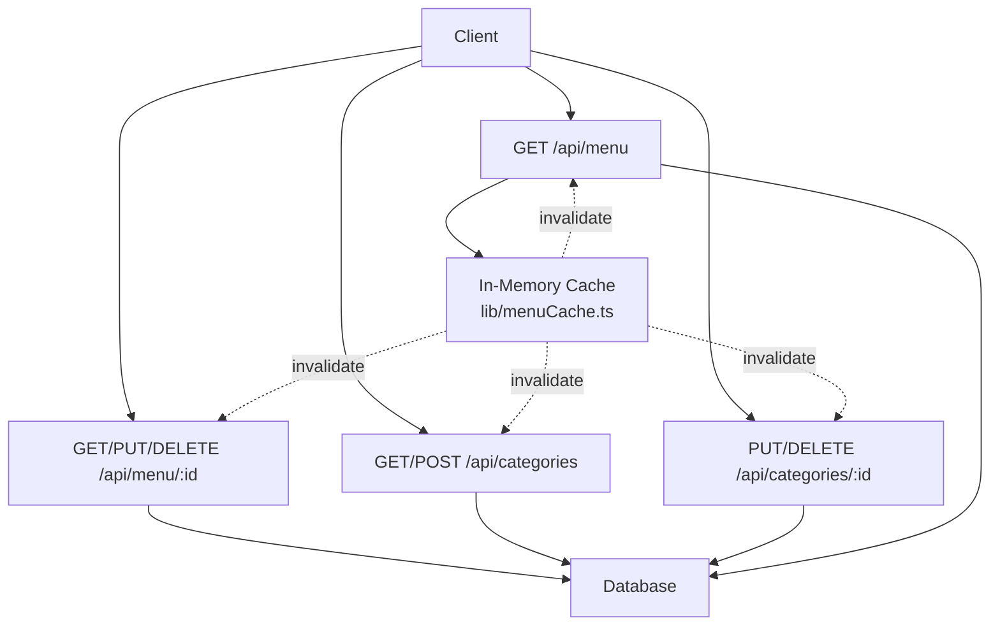
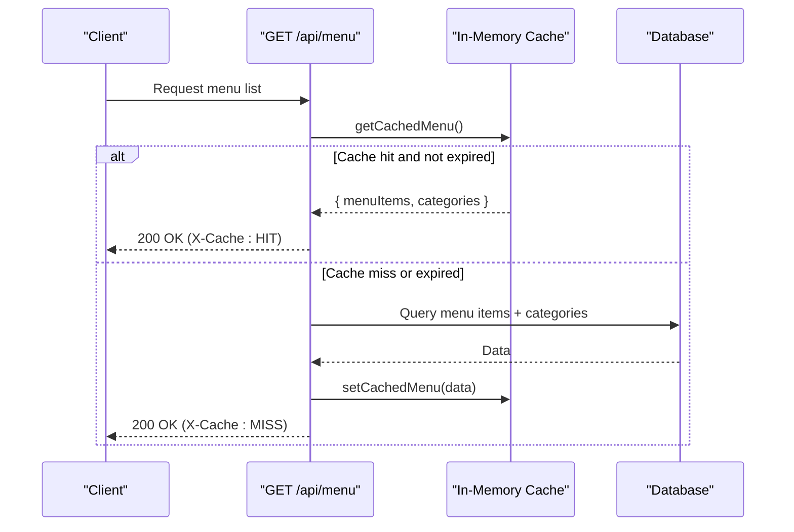
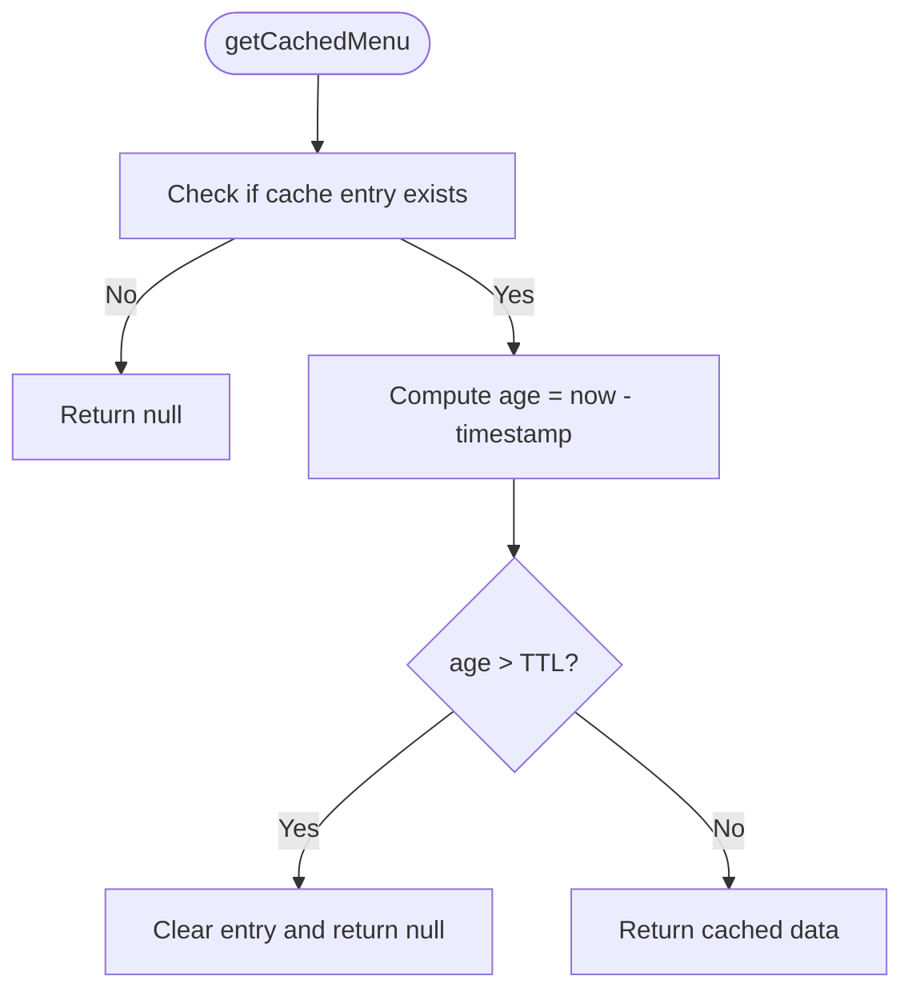
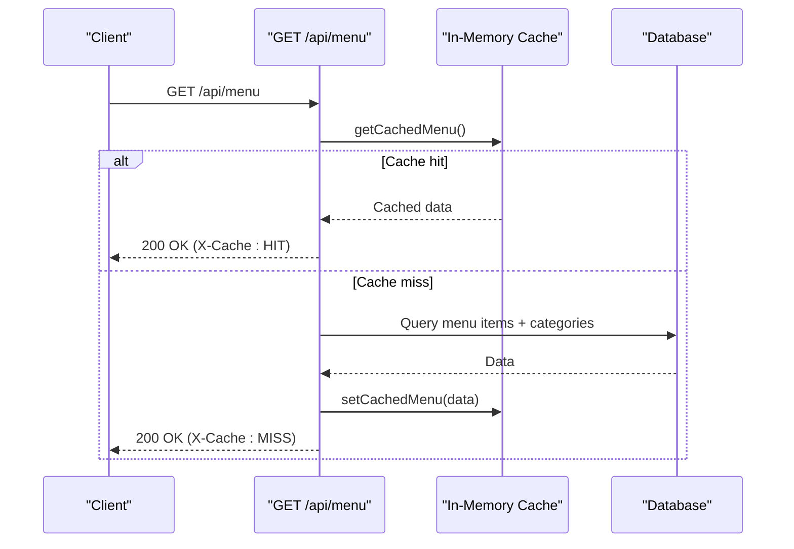
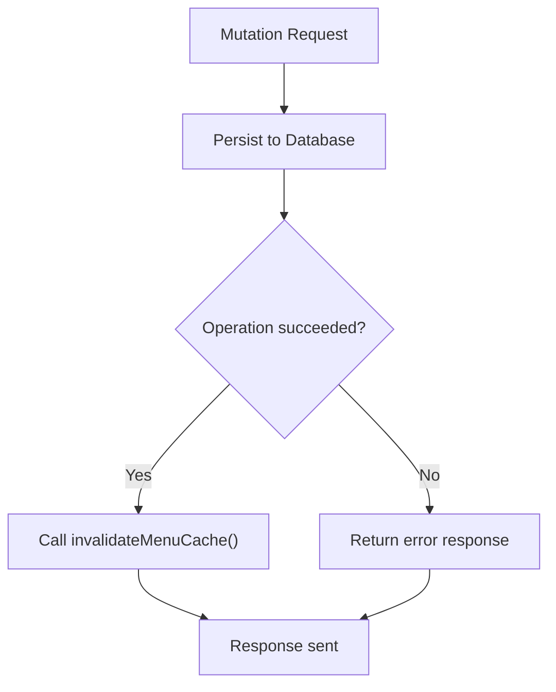
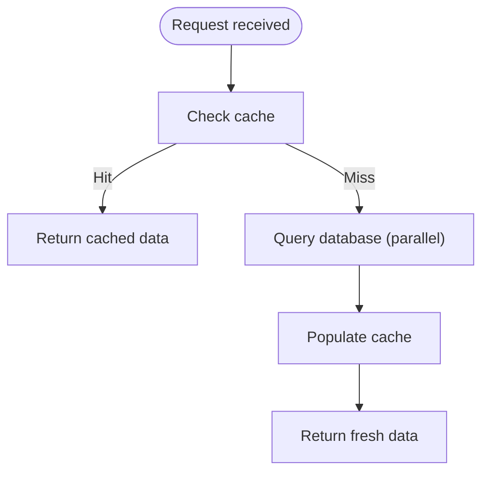
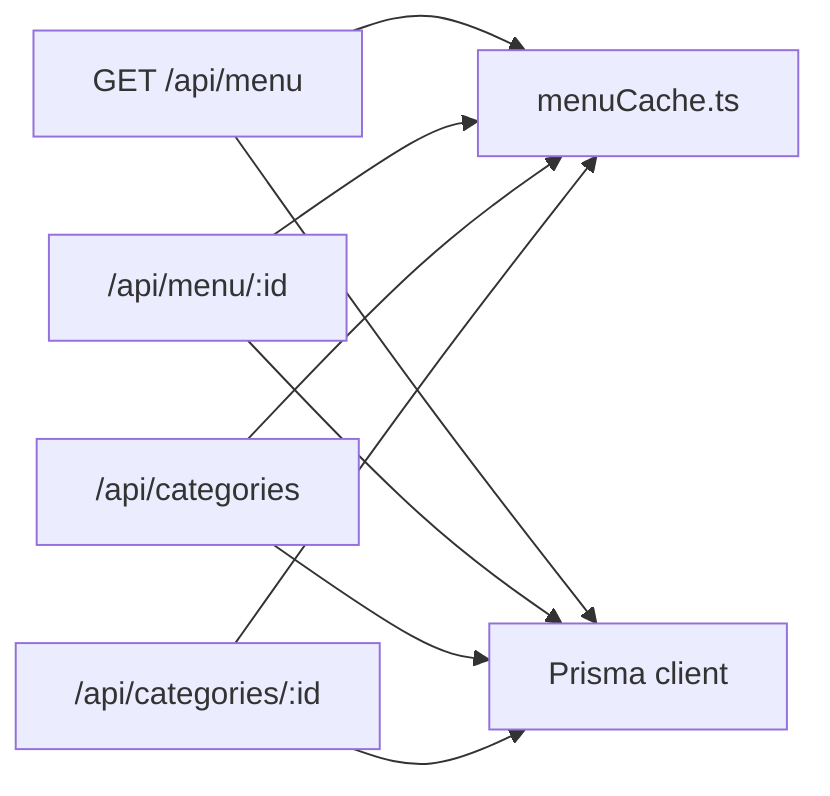

# Caching Strategy

<cite>
**Referenced Files in This Document**
- [menuCache.ts](file://lib/menuCache.ts)
- [route.ts (menu list)](file://app/api/menu/route.ts)
- [route.ts (menu item)](file://app/api/menu/[id]/route.ts)
- [route.ts (categories list)](file://app/api/categories/route.ts)
- [route.ts (category item)](file://app/api/categories/[id]/route.ts)
</cite>

## Table of Contents
1. [Introduction](#introduction)
2. [Project Structure](#project-structure)
3. [Core Components](#core-components)
4. [Architecture Overview](#architecture-overview)
5. [Detailed Component Analysis](#detailed-component-analysis)
6. [Dependency Analysis](#dependency-analysis)
7. [Performance Considerations](#performance-considerations)
8. [Troubleshooting Guide](#troubleshooting-guide)
9. [Conclusion](#conclusion)

## Introduction
This document explains the caching strategy used by the Warkop Betawa system for menu data. The implementation uses a process-scoped in-memory cache to reduce database queries for high-frequency public reads, while ensuring consistency through immediate invalidation on mutations. It also documents TTL behavior, fallback mechanisms on cache misses, and how concurrent requests are handled within a single process.

## Project Structure
The caching layer is implemented as a small module that exposes read, write, and invalidation functions. API route handlers integrate this module to:
- Serve cached responses when available
- Populate the cache after successful reads
- Invalidate the cache on create, update, or delete operations

**Diagram sources**
- [route.ts (menu list):1-109](file://app/api/menu/route.ts#L1-L109)
- [route.ts (menu item):1-81](file://app/api/menu/[id]/route.ts#L1-L81)
- [route.ts (categories list):1-47](file://app/api/categories/route.ts#L1-L47)
- [route.ts (category item):1-53](file://app/api/categories/[id]/route.ts#L1-L53)
- [menuCache.ts:1-47](file://lib/menuCache.ts#L1-L47)

**Section sources**
- [menuCache.ts:1-47](file://lib/menuCache.ts#L1-L47)
- [route.ts (menu list):1-109](file://app/api/menu/route.ts#L1-L109)
- [route.ts (menu item):1-81](file://app/api/menu/[id]/route.ts#L1-L81)
- [route.ts (categories list):1-47](file://app/api/categories/route.ts#L1-L47)
- [route.ts (category item):1-53](file://app/api/categories/[id]/route.ts#L1-L53)

## Core Components
- In-memory cache module: Provides functions to get, set, and invalidate menu data.
- Menu API route: Reads from cache when possible; otherwise queries the database and populates the cache.
- Category APIs: Invalidate the cache on mutation so subsequent reads reflect updates.
- Menu item APIs: Invalidate the cache on mutation to keep the public view consistent.

Key responsibilities:
- Reduce database roundtrips for public menu reads
- Provide fast responses via in-memory access
- Ensure eventual consistency with immediate invalidation on writes

**Section sources**
- [menuCache.ts:1-47](file://lib/menuCache.ts#L1-L47)
- [route.ts (menu list):1-109](file://app/api/menu/route.ts#L1-L109)
- [route.ts (categories list):1-47](file://app/api/categories/route.ts#L1-L47)
- [route.ts (menu item):1-81](file://app/api/menu/[id]/route.ts#L1-L81)
- [route.ts (category item):1-53](file://app/api/categories/[id]/route.ts#L1-L53)

## Architecture Overview
The cache sits between the API layer and the database. Public GET endpoints first check the in-memory cache. If present and not expired, they return immediately. Otherwise, they query the database, populate the cache, and respond. Mutations call an invalidation function to clear the cache.

**Diagram sources**
- [route.ts (menu list):7-60](file://app/api/menu/route.ts#L7-L60)
- [menuCache.ts:24-42](file://lib/menuCache.ts#L24-L42)

## Detailed Component Analysis

### In-Memory Cache Module
The cache stores a snapshot of menu items and categories along with a timestamp. It enforces a time-to-live (TTL) policy and supports explicit invalidation.

- Data model: Stores menu items and categories plus a timestamp.
- TTL policy: Entries older than the configured TTL are treated as expired and cleared.
- Global scope: Uses a global variable scoped to the Node.js process, meaning it is shared across all requests served by the same process instance.
- Functions:
  - Get: Returns cached data if present and not expired; otherwise returns null.
  - Set: Writes new data and records the current timestamp.
  - Invalidate: Clears the cache entry.

**Diagram sources**
- [menuCache.ts:24-35](file://lib/menuCache.ts#L24-L35)

Configuration highlights:
- TTL duration: Configured as a constant representing milliseconds.
- Scope: Process-scoped via a global variable.

Operational notes:
- On cache miss or expiration, callers should fall back to the database and repopulate the cache.
- Explicit invalidation ensures changes propagate quickly to subsequent reads.

**Section sources**
- [menuCache.ts:1-47](file://lib/menuCache.ts#L1-L47)

### Menu List Endpoint Integration
The menu list endpoint integrates the cache to optimize public reads:
- When reading active menu items only, it checks the cache first.
- On cache hit, it responds with a cache header indicating a hit.
- On cache miss, it queries both menu items and categories concurrently, then caches the result before responding.
- The response includes a cache header indicating a miss when the database was queried.

**Diagram sources**
- [route.ts (menu list):7-60](file://app/api/menu/route.ts#L7-L60)
- [menuCache.ts:24-42](file://lib/menuCache.ts#L24-L42)

Behavioral details:
- Optional parameter to include inactive items bypasses the cache path and always queries the database.
- Successful mutations trigger cache invalidation to ensure freshness.

**Section sources**
- [route.ts (menu list):7-109](file://app/api/menu/route.ts#L7-L109)

### Mutation Endpoints and Cache Invalidation
All mutation endpoints that affect menu or category data call the invalidation function to ensure subsequent reads do not serve stale data.

- Create menu item: Invalidates cache after successful creation.
- Update menu item: Invalidates cache after successful update.
- Delete menu item: Invalidates cache after successful deletion.
- Create category: Invalidates cache after successful creation.
- Update category: Invalidates cache after successful update.
- Delete category: Invalidates cache after successful deletion.

**Diagram sources**
- [route.ts (menu list):67-109](file://app/api/menu/route.ts#L67-L109)
- [route.ts (menu item):22-81](file://app/api/menu/[id]/route.ts#L22-L81)
- [route.ts (categories list):20-47](file://app/api/categories/route.ts#L20-L47)
- [route.ts (category item):6-53](file://app/api/categories/[id]/route.ts#L6-L53)
- [menuCache.ts:44-46](file://lib/menuCache.ts#L44-L46)

**Section sources**
- [route.ts (menu list):67-109](file://app/api/menu/route.ts#L67-L109)
- [route.ts (menu item):22-81](file://app/api/menu/[id]/route.ts#L22-L81)
- [route.ts (categories list):20-47](file://app/api/categories/route.ts#L20-L47)
- [route.ts (category item):6-53](file://app/api/categories/[id]/route.ts#L6-L53)
- [menuCache.ts:44-46](file://lib/menuCache.ts#L44-L46)

### Fallback Mechanism on Cache Miss
When the cache does not contain valid data, the menu list endpoint falls back to querying the database:
- It performs parallel queries for menu items and categories to minimize latency.
- After retrieving data, it populates the cache for future requests.
- Responses include headers indicating whether the response came from cache or database.

**Diagram sources**
- [route.ts (menu list):11-60](file://app/api/menu/route.ts#L11-L60)
- [menuCache.ts:24-42](file://lib/menuCache.ts#L24-L42)

**Section sources**
- [route.ts (menu list):11-60](file://app/api/menu/route.ts#L11-L60)

## Dependency Analysis
The following diagram shows how API routes depend on the cache module and database layer.

**Diagram sources**
- [route.ts (menu list):1-109](file://app/api/menu/route.ts#L1-L109)
- [route.ts (menu item):1-81](file://app/api/menu/[id]/route.ts#L1-L81)
- [route.ts (categories list):1-47](file://app/api/categories/route.ts#L1-L47)
- [route.ts (category item):1-53](file://app/api/categories/[id]/route.ts#L1-L53)
- [menuCache.ts:1-47](file://lib/menuCache.ts#L1-L47)

Coupling and cohesion:
- The cache module is cohesive and focused solely on in-memory storage and TTL logic.
- API routes have low coupling to the cache module, calling only three functions: get, set, and invalidate.
- No circular dependencies exist between the cache module and API routes.

External integration points:
- Database access is performed via Prisma within API routes.
- The cache module has no external dependencies beyond the Node.js runtime.

**Section sources**
- [menuCache.ts:1-47](file://lib/menuCache.ts#L1-L47)
- [route.ts (menu list):1-109](file://app/api/menu/route.ts#L1-L109)
- [route.ts (menu item):1-81](file://app/api/menu/[id]/route.ts#L1-L81)
- [route.ts (categories list):1-47](file://app/api/categories/route.ts#L1-L47)
- [route.ts (category item):1-53](file://app/api/categories/[id]/route.ts#L1-L53)

## Performance Considerations
- Latency reduction: In-memory reads avoid network roundtrips and database overhead, significantly reducing response times for public menu reads.
- Parallel queries: The menu list endpoint queries menu items and categories concurrently to minimize total latency.
- TTL safety: A short TTL acts as a safety net against stale data even if invalidation fails.
- Memory usage: The cache holds a snapshot of menu items and categories per process. Keep payload sizes reasonable to control memory footprint.
- Concurrency: Within a single process, the global cache is shared across concurrent requests. Since operations are synchronous and lightweight, contention is minimal. However, note that there is no distributed locking; multiple processes will each maintain their own cache.

Recommendations:
- Monitor cache hit rates to validate effectiveness.
- Adjust TTL based on update frequency and consistency requirements.
- Consider adding metrics around cache hits, misses, and invalidations.

[No sources needed since this section provides general guidance]

## Troubleshooting Guide
Common issues and resolutions:
- Stale data after mutations:
  - Ensure all mutation endpoints call the invalidation function.
  - Verify that mutations succeed before invalidating to avoid unnecessary cache clears.
- Unexpected cache misses:
  - Confirm that the optional parameter to include inactive items bypasses the cache intentionally.
  - Check TTL configuration if entries expire too quickly.
- High memory usage:
  - Review the size of menu items and categories payloads.
  - Consider limiting fields returned to the cache if necessary.
- Multi-process environments:
  - Remember that the cache is process-scoped; separate processes will not share cache state.
  - Use application-level invalidation strategies if cross-process consistency is required.

Operational tips:
- Inspect response headers to determine cache hit vs miss behavior.
- Add logging around cache operations to diagnose performance and correctness issues.

**Section sources**
- [route.ts (menu list):11-60](file://app/api/menu/route.ts#L11-L60)
- [route.ts (menu list):67-109](file://app/api/menu/route.ts#L67-L109)
- [route.ts (menu item):22-81](file://app/api/menu/[id]/route.ts#L22-L81)
- [route.ts (categories list):20-47](file://app/api/categories/route.ts#L20-L47)
- [route.ts (category item):6-53](file://app/api/categories/[id]/route.ts#L6-L53)
- [menuCache.ts:21-46](file://lib/menuCache.ts#L21-L46)

## Conclusion
The Warkop Betawa system employs a simple yet effective in-memory caching strategy for menu data. By serving frequent reads from a process-scoped cache and invalidating on mutations, it achieves low-latency responses while maintaining data consistency. The design is straightforward, easy to extend, and well-suited for single-process deployments. For multi-process scenarios, consider additional coordination mechanisms to synchronize cache invalidation across instances.

[No sources needed since this section summarizes without analyzing specific files]