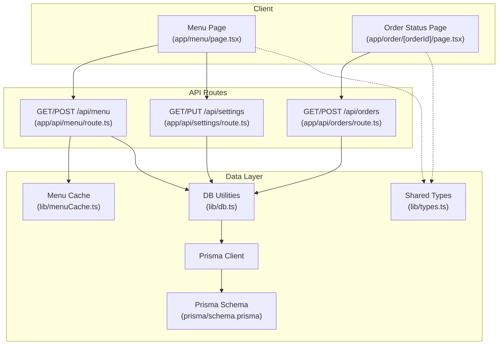
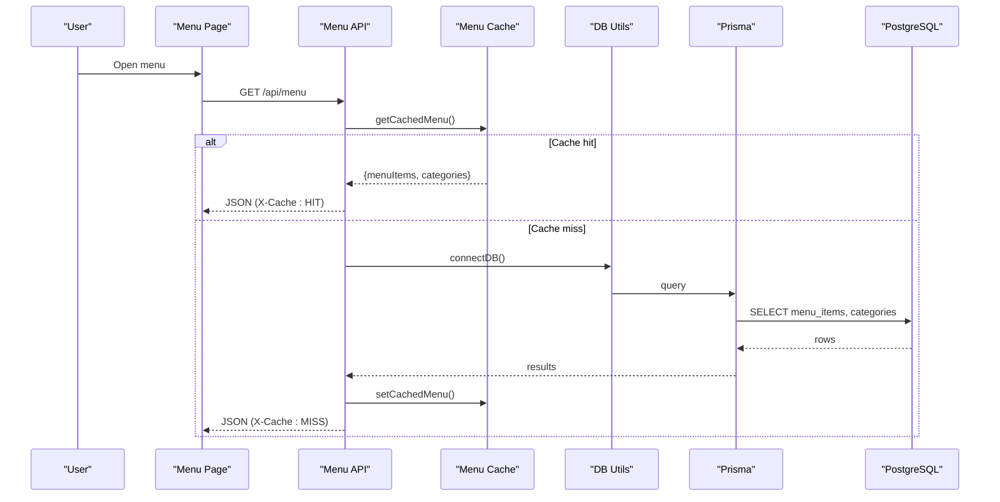
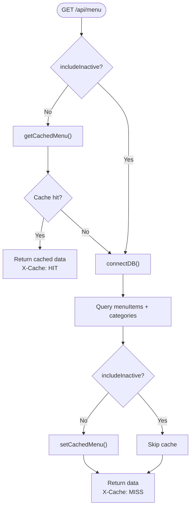
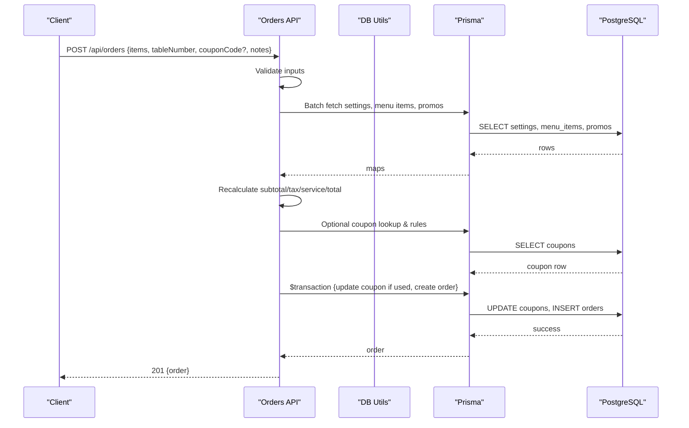
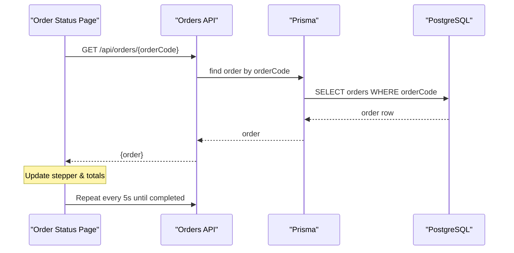
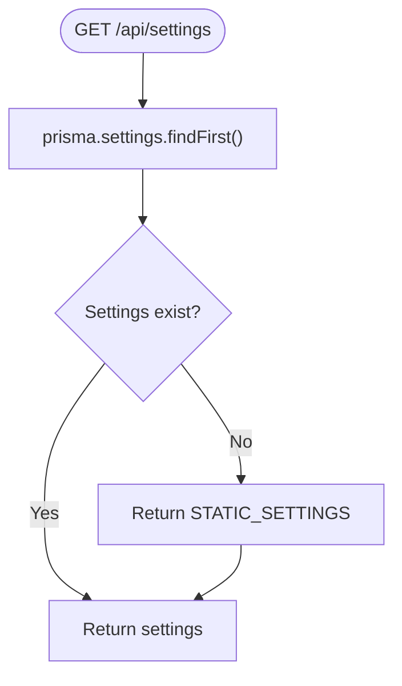
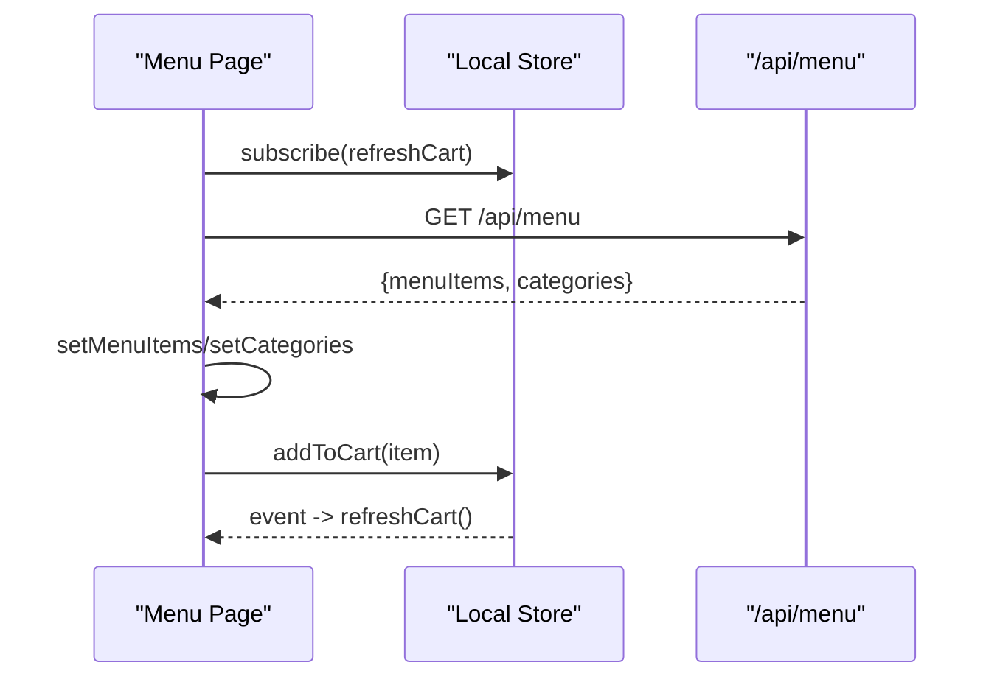
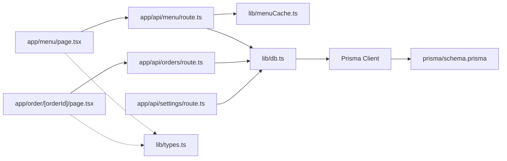

# Data Flow Patterns

<cite>
**Referenced Files in This Document**
- [README.md](file://README.md)
- [package.json](file://package.json)
- [prisma/schema.prisma](file://prisma/schema.prisma)
- [lib/types.ts](file://lib/types.ts)
- [lib/db.ts](file://lib/db.ts)
- [lib/menuCache.ts](file://lib/menuCache.ts)
- [app/api/menu/route.ts](file://app/api/menu/route.ts)
- [app/api/orders/route.ts](file://app/api/orders/route.ts)
- [app/api/settings/route.ts](file://app/api/settings/route.ts)
- [app/menu/page.tsx](file://app/menu/page.tsx)
- [app/order/[orderId]/page.tsx](file://app/order/[orderId]/page.tsx)
</cite>

## Table of Contents
1. [Introduction](#introduction)
2. [Project Structure](#project-structure)
3. [Core Components](#core-components)
4. [Architecture Overview](#architecture-overview)
5. [Detailed Component Analysis](#detailed-component-analysis)
6. [Dependency Analysis](#dependency-analysis)
7. [Performance Considerations](#performance-considerations)
8. [Troubleshooting Guide](#troubleshooting-guide)
9. [Conclusion](#conclusion)

## Introduction
This document explains the data flow patterns in the Warkop Betawa system, covering the complete lifecycle from user interactions to API routes, database operations, and UI updates. It focuses on:
- Menu browsing and caching
- Order creation with server-side price validation
- Real-time order status polling
- Settings-driven tax and service charge calculations
- Cache invalidation policies and performance optimizations for large datasets

The application is a Next.js 14 app backed by PostgreSQL via Prisma, with static fallbacks and an in-memory cache for high-frequency reads.

**Section sources**
- [README.md:1-105](file://README.md#L1-L105)
- [package.json:1-42](file://package.json#L1-L42)

## Project Structure
High-level structure relevant to data flows:
- Client pages: menu listing, item detail, cart, checkout, order status
- API routes: menu, orders, settings, categories, promos, tables, coupons, chat, upload
- Shared libraries: types, DB utilities, menu cache, formatting, JWT, Supabase helpers
- Database schema: Prisma models for categories, menu items, orders, promos, coupons, settings, tables

**Diagram sources**
- [app/menu/page.tsx:1-320](file://app/menu/page.tsx#L1-L320)
- [app/order/[orderId]/page.tsx:1-291](file://app/order/[orderId]/page.tsx#L1-L291)
- [app/api/menu/route.ts:1-109](file://app/api/menu/route.ts#L1-L109)
- [app/api/orders/route.ts:1-245](file://app/api/orders/route.ts#L1-L245)
- [app/api/settings/route.ts:1-68](file://app/api/settings/route.ts#L1-L68)
- [lib/db.ts:1-161](file://lib/db.ts#L1-L161)
- [lib/menuCache.ts:1-47](file://lib/menuCache.ts#L1-L47)
- [lib/types.ts:1-119](file://lib/types.ts#L1-L119)
- [prisma/schema.prisma:1-107](file://prisma/schema.prisma#L1-L107)

**Section sources**
- [README.md:53-81](file://README.md#L53-L81)
- [prisma/schema.prisma:11-107](file://prisma/schema.prisma#L11-L107)

## Core Components
- Menu API route: Serves active menu items and categories; uses in-memory cache for fast responses; invalidates cache on mutations.
- Orders API route: Validates inputs, fetches settings and referenced items/promos in parallel, recalculates prices server-side, applies coupon rules, creates orders atomically.
- Settings API route: Provides restaurant settings (tax/service rates, info); supports update with validation.
- Menu page: Fetches menu and categories, filters/searches locally, syncs cart state via events.
- Order status page: Polls order status every 5 seconds; shows receipt when completed.
- DB utilities: Ensures DB seeding once per process; provides memory store fallback.
- Menu cache: In-process TTL-based cache with explicit invalidation hooks.
- Types: Shared interfaces for domain entities used across client and server.

**Section sources**
- [app/api/menu/route.ts:1-109](file://app/api/menu/route.ts#L1-L109)
- [app/api/orders/route.ts:1-245](file://app/api/orders/route.ts#L1-L245)
- [app/api/settings/route.ts:1-68](file://app/api/settings/route.ts#L1-L68)
- [app/menu/page.tsx:1-320](file://app/menu/page.tsx#L1-L320)
- [app/order/[orderId]/page.tsx:1-291](file://app/order/[orderId]/page.tsx#L1-L291)
- [lib/db.ts:1-161](file://lib/db.ts#L1-L161)
- [lib/menuCache.ts:1-47](file://lib/menuCache.ts#L1-L47)
- [lib/types.ts:1-119](file://lib/types.ts#L1-L119)

## Architecture Overview
End-to-end data flows:

**Diagram sources**
- [app/menu/page.tsx:27-40](file://app/menu/page.tsx#L27-L40)
- [app/api/menu/route.ts:7-65](file://app/api/menu/route.ts#L7-L65)
- [lib/menuCache.ts:24-42](file://lib/menuCache.ts#L24-L42)
- [lib/db.ts:40-50](file://lib/db.ts#L40-L50)

## Detailed Component Analysis

### Menu Browsing and Caching Pipeline
- Client fetches menu and categories from `/api/menu`.
- Server checks in-memory cache; if present, returns immediately with cache headers.
- On cache miss, server connects to DB, queries active menu items and ordered categories, caches result, and responds.
- Admin mutations (create/update/delete) invalidate the cache so subsequent reads reflect changes.

**Diagram sources**
- [app/api/menu/route.ts:7-65](file://app/api/menu/route.ts#L7-L65)
- [lib/menuCache.ts:24-42](file://lib/menuCache.ts#L24-L42)

**Section sources**
- [app/api/menu/route.ts:7-109](file://app/api/menu/route.ts#L7-L109)
- [lib/menuCache.ts:1-47](file://lib/menuCache.ts#L1-L47)
- [app/menu/page.tsx:27-40](file://app/menu/page.tsx#L27-L40)

### Order Creation Pipeline
- Client submits order payload with items, optional coupon code, table number, and notes.
- Server validates input, batches fetches settings, menu items, and promos.
- Prices are recalculated server-side using DB values; add-ons validated against DB prices.
- Coupon rules applied; usage recorded atomically within a transaction alongside order creation.
- Returns created order with human-readable order code.

**Diagram sources**
- [app/api/orders/route.ts:23-245](file://app/api/orders/route.ts#L23-L245)

**Section sources**
- [app/api/orders/route.ts:23-245](file://app/api/orders/route.ts#L23-L245)
- [lib/types.ts:57-83](file://lib/types.ts#L57-L83)

### Real-Time Order Status Updates
- Client polls `/api/orders/{orderCode}` every 5 seconds.
- Server returns current order status and details.
- UI renders a stepper reflecting received → preparing → ready → completed.
- When completed, client optionally fetches restaurant info for receipt display.

**Diagram sources**
- [app/order/[orderId]/page.tsx:19-53](file://app/order/[orderId]/page.tsx#L19-L53)
- [app/api/orders/route.ts:11-21](file://app/api/orders/route.ts#L11-L21)

**Section sources**
- [app/order/[orderId]/page.tsx:19-53](file://app/order/[orderId]/page.tsx#L19-L53)
- [app/api/orders/route.ts:11-21](file://app/api/orders/route.ts#L11-L21)

### Settings-Driven Calculations
- GET /api/settings returns taxRatePercent, serviceChargeRatePercent, and restaurantInfo.
- POST/PUT /api/settings updates these values with validation.
- Order creation uses current settings to compute taxAmount, serviceChargeAmount, and total.

**Diagram sources**
- [app/api/settings/route.ts:7-17](file://app/api/settings/route.ts#L7-L17)

**Section sources**
- [app/api/settings/route.ts:1-68](file://app/api/settings/route.ts#L1-L68)
- [app/api/orders/route.ts:67-85](file://app/api/orders/route.ts#L67-L85)

### State Synchronization Between Client and Server
- Menu page subscribes to cart events and search events to keep local UI state consistent.
- Cart additions trigger immediate UI feedback and persist to local storage-backed store.
- Menu data refreshes from API on mount; falls back to static data if network fails.

**Diagram sources**
- [app/menu/page.tsx:42-55](file://app/menu/page.tsx#L42-L55)
- [app/menu/page.tsx:27-40](file://app/menu/page.tsx#L27-L40)

**Section sources**
- [app/menu/page.tsx:42-55](file://app/menu/page.tsx#L42-L55)
- [app/menu/page.tsx:27-40](file://app/menu/page.tsx#L27-L40)

## Dependency Analysis
Key dependencies and relationships:
- Pages depend on API routes for data.
- API routes depend on Prisma and shared DB utilities.
- Menu API depends on menu cache for performance.
- Types define contracts between client and server payloads.
- Prisma schema defines persistent entities and indexes.

**Diagram sources**
- [app/menu/page.tsx:1-320](file://app/menu/page.tsx#L1-L320)
- [app/order/[orderId]/page.tsx:1-291](file://app/order/[orderId]/page.tsx#L1-L291)
- [app/api/menu/route.ts:1-109](file://app/api/menu/route.ts#L1-L109)
- [app/api/orders/route.ts:1-245](file://app/api/orders/route.ts#L1-L245)
- [app/api/settings/route.ts:1-68](file://app/api/settings/route.ts#L1-L68)
- [lib/menuCache.ts:1-47](file://lib/menuCache.ts#L1-L47)
- [lib/db.ts:1-161](file://lib/db.ts#L1-L161)
- [lib/types.ts:1-119](file://lib/types.ts#L1-L119)
- [prisma/schema.prisma:1-107](file://prisma/schema.prisma#L1-L107)

**Section sources**
- [prisma/schema.prisma:20-36](file://prisma/schema.prisma#L20-L36)
- [prisma/schema.prisma:58-76](file://prisma/schema.prisma#L58-L76)

## Performance Considerations
- In-memory menu cache reduces latency for public reads; TTL of 60 seconds plus mutation-based invalidation ensures freshness.
- Parallel fetching of settings, menu items, and promos minimizes round-trips during order creation.
- Selective field projection in menu queries avoids transferring unnecessary columns.
- Indexes on frequently filtered fields (e.g., isActive+category, status+createdAt) improve query performance.
- Pagination or cursor-based loading should be considered for very large menus or order lists.
- Debouncing search input and filtering on the client side reduces re-renders and improves UX.
- Avoiding client-supplied monetary values prevents tampering and simplifies server-side validation.

[No sources needed since this section provides general guidance]

## Troubleshooting Guide
Common issues and resolutions:
- Menu not updating after admin edits: Ensure cache invalidation is triggered on mutations; verify X-Cache header transitions from HIT to MISS after changes.
- Order totals mismatch: Confirm server-side recalculation path is executed and that settings are fetched before computing totals.
- Coupon not applied: Verify coupon rules validation and atomic transaction behavior; check coupon availability and date constraints.
- Order status not refreshing: Confirm polling interval and endpoint correctness; ensure backend returns updated status promptly.
- DB seeding failures: Check connection string and permissions; seed logic retries on failure and logs errors.

**Section sources**
- [app/api/menu/route.ts:100-101](file://app/api/menu/route.ts#L100-L101)
- [app/api/orders/route.ts:197-234](file://app/api/orders/route.ts#L197-L234)
- [lib/db.ts:40-50](file://lib/db.ts#L40-L50)

## Conclusion
Warkop Betawa’s data flows emphasize speed, safety, and consistency:
- Fast menu reads via in-memory caching with explicit invalidation
- Secure order processing with server-side price recalculation and atomic transactions
- Real-time order status through simple polling
- Centralized settings driving tax and service charges
These patterns provide a solid foundation for scaling and maintaining a responsive restaurant ordering experience.

[No sources needed since this section summarizes without analyzing specific files]