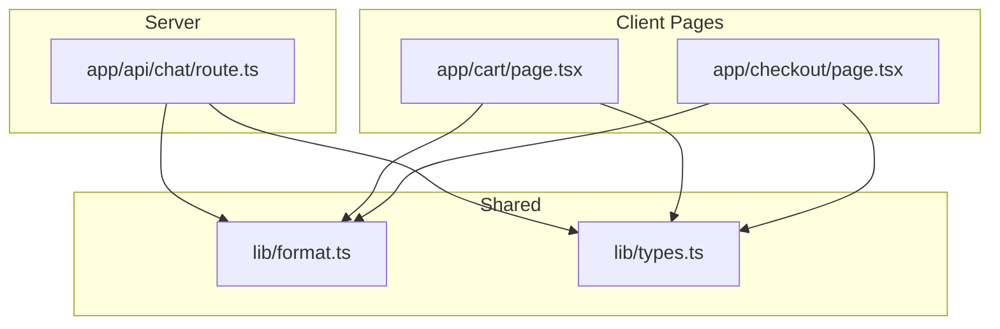
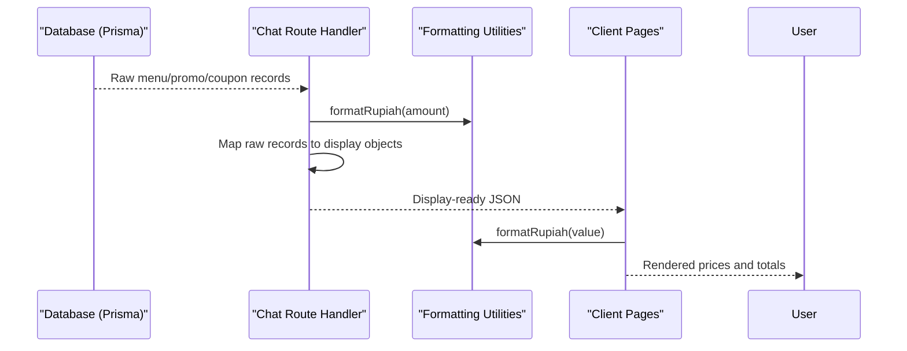
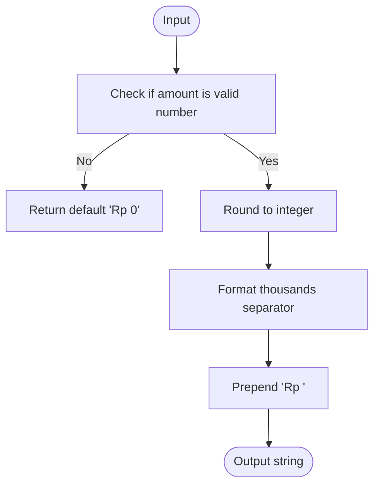
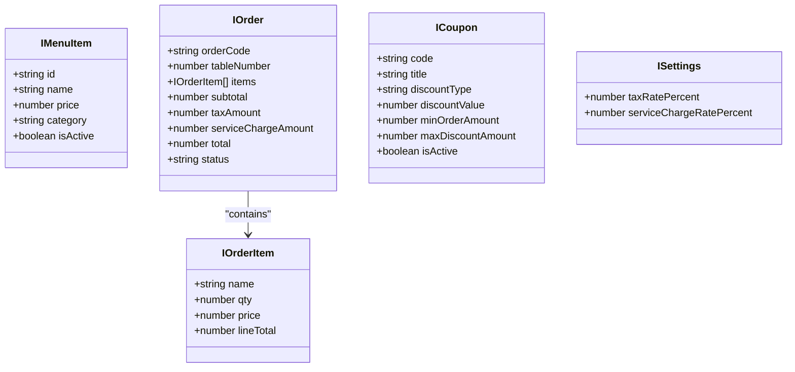
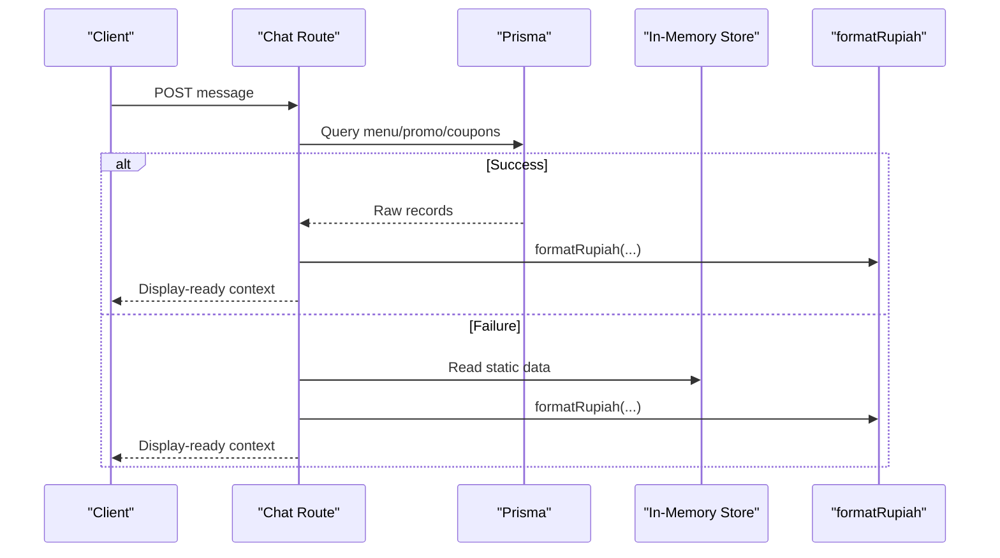
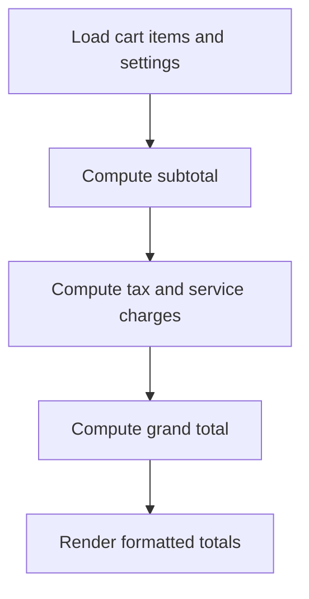
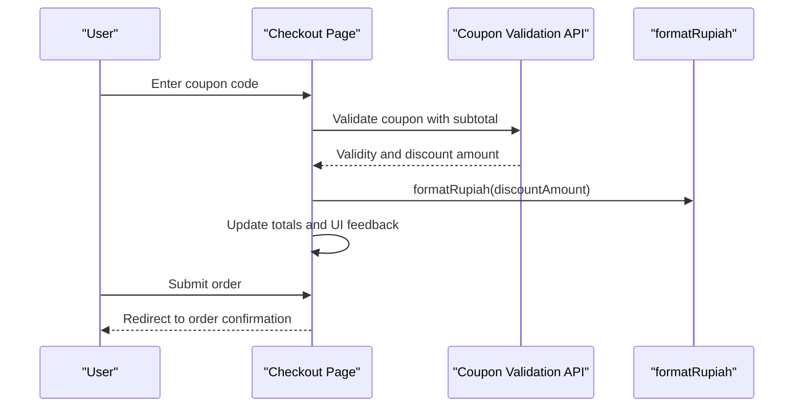
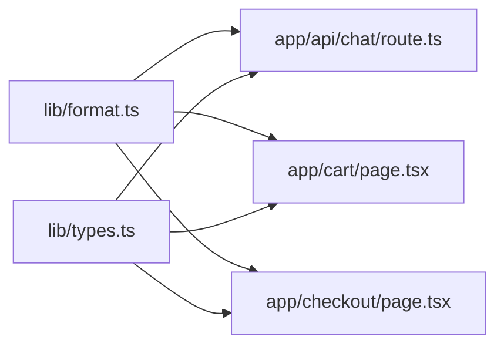

# Data Transformation Pipeline

<cite>
**Referenced Files in This Document**
- [format.ts](file://lib/format.ts)
- [types.ts](file://lib/types.ts)
- [route.ts](file://app/api/chat/route.ts)
- [page.tsx (Cart)](file://app/cart/page.tsx)
- [page.tsx (Checkout)](file://app/checkout/page.tsx)
</cite>

## Table of Contents
1. [Introduction](#introduction)
2. [Project Structure](#project-structure)
3. [Core Components](#core-components)
4. [Architecture Overview](#architecture-overview)
5. [Detailed Component Analysis](#detailed-component-analysis)
6. [Dependency Analysis](#dependency-analysis)
7. [Performance Considerations](#performance-considerations)
8. [Troubleshooting Guide](#troubleshooting-guide)
9. [Conclusion](#conclusion)

## Introduction
This document explains the data transformation pipelines that convert raw database records into UI-friendly formats across the application. It focuses on:
- Currency formatting for Indonesian Rupiah
- Date/time conversions to localized strings
- Data validation and normalization during transformations
- Type safety measures using shared TypeScript interfaces
- Error handling strategies when data is missing or malformed

The goal is to make the pipeline robust, readable, and maintainable while ensuring consistent presentation across client pages and server-side API routes.

## Project Structure
At a high level, the transformation logic is centralized in a small set of utilities and types, then consumed by both server routes and client pages:
- Shared formatting utilities provide currency and date helpers
- Shared type definitions define domain models used throughout the app
- Server routes transform database results into display-ready structures
- Client pages consume formatted values directly for rendering totals and summaries

**Diagram sources**
- [format.ts:1-24](file://lib/format.ts#L1-L24)
- [types.ts:1-119](file://lib/types.ts#L1-L119)
- [route.ts:1-477](file://app/api/chat/route.ts#L1-L477)
- [page.tsx (Cart):1-227](file://app/cart/page.tsx#L1-L227)
- [page.tsx (Checkout):1-542](file://app/checkout/page.tsx#L1-L542)

**Section sources**
- [format.ts:1-24](file://lib/format.ts#L1-L24)
- [types.ts:1-119](file://lib/types.ts#L1-L119)
- [route.ts:1-477](file://app/api/chat/route.ts#L1-L477)
- [page.tsx (Cart):1-227](file://app/cart/page.tsx#L1-L227)
- [page.tsx (Checkout):1-542](file://app/checkout/page.tsx#L1-L542)

## Core Components
- Formatting utilities:
  - Currency formatter for Indonesian Rupiah with safe defaults for invalid inputs
  - Localized date/time formatter for user-facing timestamps
- Shared types:
  - Domain models for menu items, orders, coupons, settings, and related entities
  - Consistent field names and optional compatibility fields for static fallbacks

Key responsibilities:
- Ensure all monetary values are presented consistently as “Rp X.XXX”
- Normalize dates to human-readable strings in the local locale
- Provide strong typing to prevent accidental misuse of numeric vs string fields
- Centralize error-safe formatting to avoid runtime issues in UI

**Section sources**
- [format.ts:1-24](file://lib/format.ts#L1-L24)
- [types.ts:1-119](file://lib/types.ts#L1-L119)

## Architecture Overview
The transformation pipeline spans three layers:
- Data source layer: Prisma queries return raw records from MongoDB
- Transformation layer: Server routes map raw records to display-oriented structures and apply formatting
- Presentation layer: Client pages render formatted values for users

**Diagram sources**
- [route.ts:54-205](file://app/api/chat/route.ts#L54-L205)
- [format.ts:1-24](file://lib/format.ts#L1-L24)
- [page.tsx (Cart):1-227](file://app/cart/page.tsx#L1-L227)
- [page.tsx (Checkout):1-542](file://app/checkout/page.tsx#L1-L542)

## Detailed Component Analysis

### Formatting Utilities
Responsibilities:
- Convert numbers to Indonesian Rupiah strings with thousands separators
- Handle invalid or missing numeric inputs gracefully
- Convert Date or string inputs to localized date-time strings

Type safety:
- Input parameters are strongly typed to reduce conversion errors
- Return types are explicit strings for predictable UI rendering

Error handling:
- Invalid numeric inputs default to a safe placeholder value
- Date parsing uses standard constructors; consumers should ensure valid inputs

**Diagram sources**
- [format.ts:4-12](file://lib/format.ts#L4-L12)

**Section sources**
- [format.ts:1-24](file://lib/format.ts#L1-L24)

### Shared Types and Contracts
Responsibilities:
- Define canonical shapes for domain entities such as menu items, orders, coupons, and settings
- Provide optional compatibility fields for static fallback data
- Enforce consistent naming between server responses and client consumption

Design notes:
- Optional fields allow graceful degradation when data is incomplete
- Enum-like unions constrain status and discount types to known values

**Diagram sources**
- [types.ts:24-83](file://lib/types.ts#L24-L83)
- [types.ts:85-117](file://lib/types.ts#L85-L117)

**Section sources**
- [types.ts:1-119](file://lib/types.ts#L1-L119)

### Server-Side Transformation: Chat Route
Responsibilities:
- Query relevant menu, promo, and coupon data from the database
- Transform raw records into display-oriented structures
- Apply currency formatting to all monetary values
- Provide fallback behavior using in-memory static data when database access fails

Data flow highlights:
- Menu items are mapped to include localized categories and badge labels
- Promos include original, discounted, and savings amounts formatted as currency
- Coupons include discount descriptions and minimum order thresholds formatted as currency

Error handling:
- Database query failures fall back to static store data
- External AI provider errors are handled with friendly messages

**Diagram sources**
- [route.ts:54-205](file://app/api/chat/route.ts#L54-L205)
- [route.ts:316-409](file://app/api/chat/route.ts#L316-L409)
- [format.ts:1-24](file://lib/format.ts#L1-L24)

**Section sources**
- [route.ts:54-205](file://app/api/chat/route.ts#L54-L205)
- [route.ts:316-409](file://app/api/chat/route.ts#L316-L409)

### Client-Side Rendering: Cart Page
Responsibilities:
- Compute subtotal, tax, service charge, and grand total
- Render item line totals and summary totals using the currency formatter
- Fetch tax/service rates from settings and apply them to calculations

Validation and safety:
- Rates are fetched asynchronously with fallback defaults
- Totals are computed from cart state and formatted for display

**Diagram sources**
- [page.tsx (Cart):26-61](file://app/cart/page.tsx#L26-L61)
- [page.tsx (Cart):196-211](file://app/cart/page.tsx#L196-L211)
- [format.ts:1-24](file://lib/format.ts#L1-L24)

**Section sources**
- [page.tsx (Cart):1-227](file://app/cart/page.tsx#L1-L227)

### Client-Side Rendering: Checkout Page
Responsibilities:
- Validate table number input and show advisory messages
- Apply and validate coupons against current subtotal
- Compute preview totals and submit order payload to server

Validation and safety:
- Coupon eligibility enforced based on minimum order amount
- Discount calculation supports percentage and fixed types with caps
- Submission includes hints for totals but server recalculates authoritatively

**Diagram sources**
- [page.tsx (Checkout):138-171](file://app/checkout/page.tsx#L138-L171)
- [page.tsx (Checkout):186-245](file://app/checkout/page.tsx#L186-L245)
- [format.ts:1-24](file://lib/format.ts#L1-L24)

**Section sources**
- [page.tsx (Checkout):1-542](file://app/checkout/page.tsx#L1-L542)

## Dependency Analysis
Coupling and cohesion:
- Formatting utilities are low-coupling and highly reusable
- Server routes depend on formatting utilities and shared types
- Client pages depend on formatting utilities and shared types for consistent rendering

External dependencies:
- Prisma for database access
- Environment variables for external AI provider configuration

Potential risks:
- Over-reliance on client-side totals without server recalculation could lead to inconsistencies
- Static fallback data may diverge from live database content

**Diagram sources**
- [format.ts:1-24](file://lib/format.ts#L1-L24)
- [types.ts:1-119](file://lib/types.ts#L1-L119)
- [route.ts:1-477](file://app/api/chat/route.ts#L1-L477)
- [page.tsx (Cart):1-227](file://app/cart/page.tsx#L1-L227)
- [page.tsx (Checkout):1-542](file://app/checkout/page.tsx#L1-L542)

**Section sources**
- [format.ts:1-24](file://lib/format.ts#L1-L24)
- [types.ts:1-119](file://lib/types.ts#L1-L119)
- [route.ts:1-477](file://app/api/chat/route.ts#L1-L477)
- [page.tsx (Cart):1-227](file://app/cart/page.tsx#L1-L227)
- [page.tsx (Checkout):1-542](file://app/checkout/page.tsx#L1-L542)

## Performance Considerations
- Keep formatting functions pure and lightweight to minimize overhead in tight loops (e.g., rendering lists)
- Avoid redundant formatting calls by computing totals once and reusing formatted strings where appropriate
- Prefer server-side authoritative calculations for financial totals to reduce client-side computation and potential drift
- Use efficient queries and selective field projection to limit payload size before transformation

[No sources needed since this section provides general guidance]

## Troubleshooting Guide
Common issues and resolutions:
- Invalid currency values:
  - Ensure numeric inputs are validated before formatting
  - Use the provided formatter’s safe defaults for missing or NaN values
- Incorrect date formatting:
  - Verify that date inputs are valid Date objects or ISO strings
  - Confirm locale settings match expected output
- Inconsistent totals:
  - Always rely on server-side recalculation for final totals
  - Use client-side previews only for UX feedback
- Coupon validation errors:
  - Check minimum order amount constraints
  - Validate discount type and cap values before applying

**Section sources**
- [format.ts:1-24](file://lib/format.ts#L1-L24)
- [route.ts:316-409](file://app/api/chat/route.ts#L316-L409)
- [page.tsx (Checkout):138-171](file://app/checkout/page.tsx#L138-L171)

## Conclusion
The data transformation pipeline centralizes formatting and type safety to ensure consistent, reliable presentation across the application. By separating concerns—shared utilities, shared types, server-side mapping, and client-side rendering—the system remains maintainable and resilient to edge cases. Following the guidelines here will help keep currency and date formatting correct, validations robust, and error handling graceful.

[No sources needed since this section summarizes without analyzing specific files]