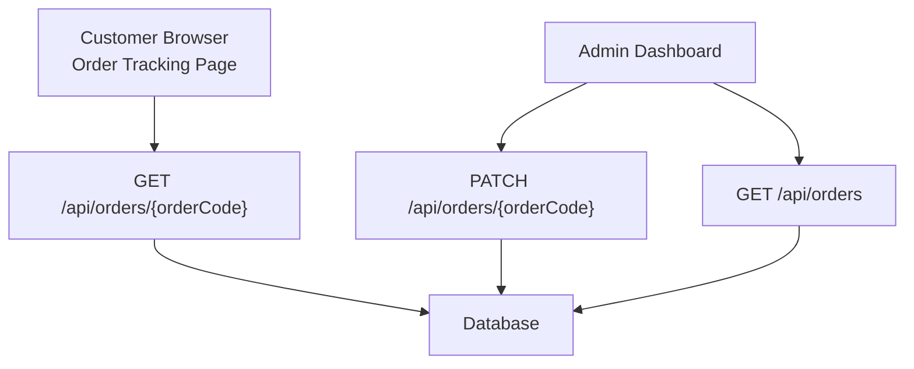
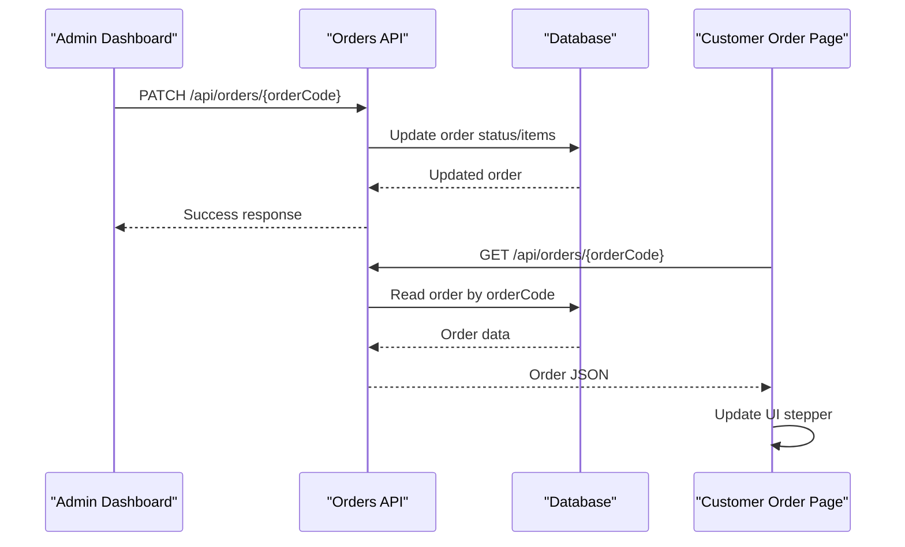
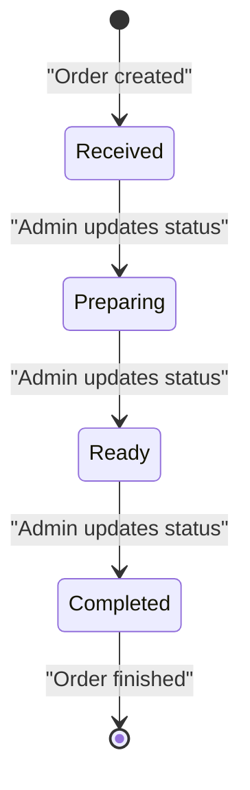
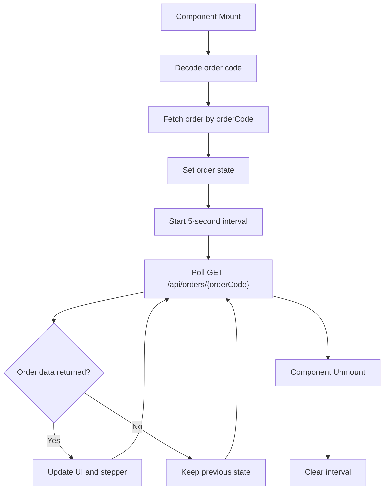
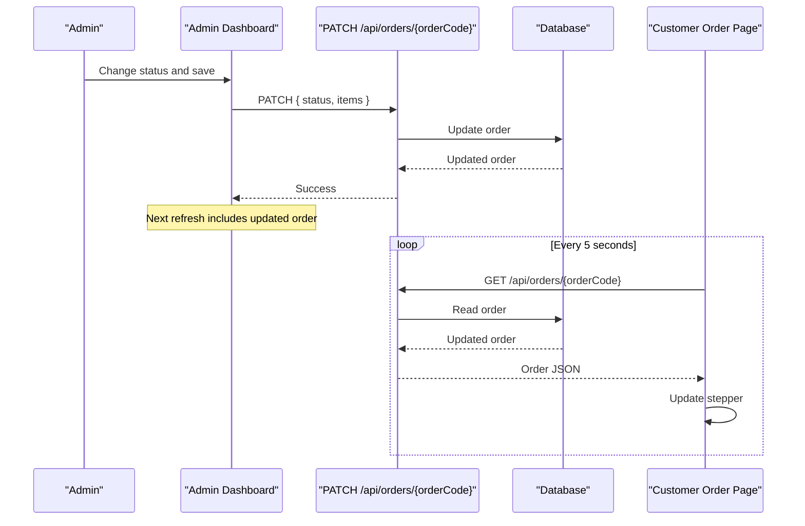
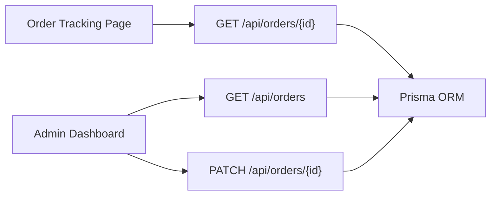

# Real-time Updates

<cite>
**Referenced Files in This Document**
- [app/api/orders/route.ts](file://app/api/orders/route.ts)
- [app/api/orders/[id]/route.ts](file://app/api/orders/[id]/route.ts)
- [app/order/[orderId]/page.tsx](file://app/order/[orderId]/page.tsx)
- [app/admin/page.tsx](file://app/admin/page.tsx)
</cite>

## Table of Contents
1. [Introduction](#introduction)
2. [Project Structure](#project-structure)
3. [Core Components](#core-components)
4. [Architecture Overview](#architecture-overview)
5. [Detailed Component Analysis](#detailed-component-analysis)
6. [Dependency Analysis](#dependency-analysis)
7. [Performance Considerations](#performance-considerations)
8. [Troubleshooting Guide](#troubleshooting-guide)
9. [Conclusion](#conclusion)

## Introduction
This document explains how order status updates work in the application, focusing on real-time synchronization between the admin dashboard and customer-facing pages. The current implementation uses HTTP polling rather than WebSockets or Server-Sent Events:

- Admin users update order status through the admin dashboard.
- Customer order tracking pages poll a dedicated API endpoint to receive updated order data.
- Order lifecycle states are defined as `received`, `preparing`, `ready`, and `completed`.
- Update frequency is controlled by client-side intervals.
- Error handling covers network failures, missing orders, and server errors.

The goal is to make this system predictable, resilient, and easy to evolve toward event-driven patterns if needed.

## Project Structure
The real-time order update flow involves four main areas:

| Area | Responsibility | Key File |
| --- | --- | --- |
| Customer order tracking page | Polls order status and renders progress | [app/order/[orderId]/page.tsx](file://app/order/[orderId]/page.tsx) |
| Admin dashboard | Displays orders, allows status changes, and auto-refreshes | [app/admin/page.tsx](file://app/admin/page.tsx) |
| Order list API | Returns all orders for admin views | [app/api/orders/route.ts](file://app/api/orders/route.ts) |
| Single-order API | Reads, updates, and deletes an order by order code | [app/api/orders/[id]/route.ts](file://app/api/orders/[id]/route.ts) |

**Diagram sources**
- [app/order/[orderId]/page.tsx:19-40](file://app/order/[orderId]/page.tsx#L19-L40)
- [app/api/orders/route.ts:11-21](file://app/api/orders/route.ts#L11-L21)
- [app/api/orders/[id]/route.ts:5-23](file://app/api/orders/[id]/route.ts#L5-L23)
- [app/api/orders/[id]/route.ts:25-75](file://app/api/orders/[id]/route.ts#L25-L75)

**Section sources**
- [app/order/[orderId]/page.tsx:1-40](file://app/order/[orderId]/page.tsx#L1-40)
- [app/api/orders/route.ts:11-21](file://app/api/orders/route.ts#L11-L21)
- [app/api/orders/[id]/route.ts:5-23](file://app/api/orders/[id]/route.ts#L5-L23)
- [app/admin/page.tsx:775-792](file://app/admin/page.tsx#L775-L792)

## Core Components
The real-time behavior is built from these components:

### Customer Order Status Page
- Decodes the order code from the URL.
- Maintains local state for the order, loading state, and restaurant info.
- Polls `/api/orders/{orderCode}` every 5 seconds.
- Renders a step-based progress indicator based on the order status.
- Shows a digital receipt when the order reaches `completed`.

Key behaviors:
- Initial fetch runs immediately.
- Interval starts after the first fetch.
- Cleanup clears the interval on unmount.
- Restaurant info is fetched only when the order becomes completed.

**Section sources**
- [app/order/[orderId]/page.tsx:10-40](file://app/order/[orderId]/page.tsx#L10-L40)
- [app/order/[orderId]/page.tsx:42-53](file://app/order/[orderId]/page.tsx#L42-L53)
- [app/order/[orderId]/page.tsx:55-74](file://app/order/[orderId]/page.tsx#L55-L74)

### Admin Dashboard
- Loads menu items, orders, and categories together.
- Filters active orders and computes summary metrics.
- Auto-refreshes the dashboard every 10 seconds.
- Allows admins to open an order detail modal, change status, edit items, and save updates.

Key behaviors:
- Uses a shared API helper that throws on non-OK responses.
- Calls `PATCH /api/orders/{orderCode}` with status and optional item changes.
- Refreshes the UI after successful operations.

**Section sources**
- [app/admin/page.tsx:775-792](file://app/admin/page.tsx#L775-L792)
- [app/admin/page.tsx:926-932](file://app/admin/page.tsx#L926-L932)
- [app/admin/page.tsx:324-342](file://app/admin/page.tsx#L324-L342)

### Orders API
#### List Orders
- Returns all orders sorted by creation time.
- Used by the admin dashboard to display recent and active orders.

#### Get Single Order
- Finds an order by `orderCode`.
- Returns 404 when not found.
- Used by the customer order tracking page.

#### Update Order
- Accepts `status` and optional `items`.
- Recalculates totals when items change.
- Returns the updated order.

#### Delete Order
- Deletes an order by `orderCode`.
- Returns success or appropriate error.

**Section sources**
- [app/api/orders/route.ts:11-21](file://app/api/orders/route.ts#L11-L21)
- [app/api/orders/[id]/route.ts:5-23](file://app/api/orders/[id]/route.ts#L5-L23)
- [app/api/orders/[id]/route.ts:25-75](file://app/api/orders/[id]/route.ts#L25-L75)
- [app/api/orders/[id]/route.ts:77-96](file://app/api/orders/[id]/route.ts#L77-L96)

## Architecture Overview
The current architecture is request-polling based. There is no WebSocket or event-driven push layer yet.

**Diagram sources**
- [app/admin/page.tsx:324-342](file://app/admin/page.tsx#L324-L342)
- [app/api/orders/[id]/route.ts:25-75](file://app/api/orders/[id]/route.ts#L25-L75)
- [app/order/[orderId]/page.tsx:19-40](file://app/order/[orderId]/page.tsx#L19-L40)
- [app/api/orders/[id]/route.ts:5-23](file://app/api/orders/[id]/route.ts#L5-L23)

## Detailed Component Analysis

### Order Lifecycle States
The order lifecycle has four explicit states:

| State | Meaning | Customer UI Behavior |
| --- | --- | --- |
| `received` | Kitchen received the order | First step active |
| `preparing` | Food is being prepared | Second step active |
| `ready` | Food is ready to be served | Third step active |
| `completed` | Order is finished; payment at cashier | Final step active; receipt shown |

**Diagram sources**
- [app/order/[orderId]/page.tsx:55-74](file://app/order/[orderId]/page.tsx#L55-L74)
- [app/api/orders/route.ts:219-233](file://app/api/orders/route.ts#L219-L233)

**Section sources**
- [app/order/[orderId]/page.tsx:55-74](file://app/order/[orderId]/page.tsx#L55-L74)
- [app/api/orders/route.ts:219-233](file://app/api/orders/route.ts#L219-L233)

### Polling Mechanism for Status Updates
The customer order page implements polling using `setInterval`:

1. Decode the order code from the route parameter.
2. Fetch the latest order data.
3. Update local state when order data exists.
4. Repeat every 5 seconds.
5. Clear the interval when the component unmounts.

**Diagram sources**
- [app/order/[orderId]/page.tsx:10-40](file://app/order/[orderId]/page.tsx#L10-L40)

**Section sources**
- [app/order/[orderId]/page.tsx:10-40](file://app/order/[orderId]/page.tsx#L10-L40)

### Admin-to-Customer Propagation Flow
When an admin updates an order:

1. Admin opens the order detail modal.
2. Admin selects a new status and optionally edits items.
3. Admin saves the order.
4. The dashboard calls `PATCH /api/orders/{orderCode}`.
5. The API updates the database.
6. The next customer poll receives the updated status.
7. The customer UI updates the stepper and may show a receipt.

**Diagram sources**
- [app/admin/page.tsx:324-342](file://app/admin/page.tsx#L324-L342)
- [app/api/orders/[id]/route.ts:25-75](file://app/api/orders/[id]/route.ts#L25-L75)
- [app/order/[orderId]/page.tsx:19-40](file://app/order/[orderId]/page.tsx#L19-L40)

**Section sources**
- [app/admin/page.tsx:324-342](file://app/admin/page.tsx#L324-L342)
- [app/api/orders/[id]/route.ts:25-75](file://app/api/orders/[id]/route.ts#L25-L75)
- [app/order/[orderId]/page.tsx:19-40](file://app/order/[orderId]/page.tsx#L19-L40)

### Event-Driven Communication Patterns
Currently, there is no event-driven layer such as WebSockets, Server-Sent Events, or a message queue. The system relies on:

- REST endpoints for reads and writes.
- Client-side polling for updates.
- Local UI state for rendering.

If event-driven communication is added later, recommended options include:

| Pattern | Use Case | Trade-off |
| --- | --- | --- |
| WebSockets | Low-latency bidirectional updates | More complex server and connection management |
| Server-Sent Events | One-way server-to-client updates | Simpler than WebSockets but limited to push-only |
| Message Queue + Polling | Reliable background processing | Adds infrastructure complexity |
| Database-level notifications | Push-like behavior via triggers | Requires adapter layer |

For now, the safest migration path is to keep polling while adding an optional event channel for faster updates.

[No sources needed since this section provides conceptual guidance]

## Dependency Analysis
The real-time update flow depends on clear contracts between frontend pages and backend routes.

**Diagram sources**
- [app/order/[orderId]/page.tsx:19-40](file://app/order/[orderId]/page.tsx#L19-L40)
- [app/api/orders/route.ts:11-21](file://app/api/orders/route.ts#L11-L21)
- [app/api/orders/[id]/route.ts:5-23](file://app/api/orders/[id]/route.ts#L5-L23)
- [app/api/orders/[id]/route.ts:25-75](file://app/api/orders/[id]/route.ts#L25-L75)

**Section sources**
- [app/order/[orderId]/page.tsx:19-40](file://app/order/[orderId]/page.tsx#L19-L40)
- [app/api/orders/route.ts:11-21](file://app/api/orders/route.ts#L11-L21)
- [app/api/orders/[id]/route.ts:5-23](file://app/api/orders/[id]/route.ts#L5-L23)
- [app/api/orders/[id]/route.ts:25-75](file://app/api/orders/[id]/route.ts#L25-L75)

## Performance Considerations
Current performance characteristics:

- Customer polling interval: 5 seconds per active order page.
- Admin dashboard refresh interval: 10 seconds.
- Each poll performs a database read by `orderCode`.
- Admin dashboard loads menu, orders, and categories together.

Recommendations:

1. **Adjust polling frequency dynamically**
   - Reduce frequency when the order is idle.
   - Increase frequency briefly after an admin update.

2. **Add exponential backoff**
   - Retry failed polls with increasing delays.
   - Stop retrying after a maximum number of attempts.

3. **Avoid unnecessary re-renders**
   - Compare previous order state before updating UI.
   - Debounce rapid status changes.

4. **Consider caching**
   - Cache order data briefly on the client.
   - Invalidate cache on successful admin updates.

5. **Monitor server load**
   - Track request rate per order.
   - Add rate limiting if many customers poll simultaneously.

[No sources needed since this section provides general guidance]

## Troubleshooting Guide

### Common Issues

| Issue | Likely Cause | Resolution |
| --- | --- | --- |
| Customer page never updates | Polling request fails or returns no order | Check network tab, verify order code, inspect API response |
| Admin changes do not appear | Admin did not save or next poll has not run | Save status, wait for next poll, or reload customer page |
| 404 for order | Order code does not exist | Verify order was created and URL contains correct code |
| Server error during update | Database or Prisma error | Check server logs, validate payload, confirm order exists |
| Receipt not shown | Order status is not `completed` | Update order to `completed` in admin dashboard |

### Error Handling Details

#### Customer Order Page
- Catches fetch errors and logs them.
- Sets loading state after each attempt.
- Does not implement retry logic or user-facing error messages.

#### Admin Dashboard
- Uses a shared API helper that throws on non-OK responses.
- Wraps save and delete operations in try/catch.
- Shows alerts for failure cases.

#### Orders API
- Returns structured error objects.
- Handles missing orders with 404 responses.
- Logs server errors and returns generic failure messages.

**Section sources**
- [app/order/[orderId]/page.tsx:23-40](file://app/order/[orderId]/page.tsx#L23-L40)
- [app/admin/page.tsx:67-77](file://app/admin/page.tsx#L67-L77)
- [app/admin/page.tsx:324-351](file://app/admin/page.tsx#L324-L351)
- [app/api/orders/[id]/route.ts:12-23](file://app/api/orders/[id]/route.ts#L12-L23)
- [app/api/orders/[id]/route.ts:68-75](file://app/api/orders/[id]/route.ts#L68-L75)
- [app/api/orders/[id]/route.ts:85-96](file://app/api/orders/[id]/route.ts#L85-L96)

## Conclusion
The application currently implements real-time order status updates using HTTP polling:

- Admin dashboards update order status through REST endpoints.
- Customer pages poll the single-order API every 5 seconds.
- Order lifecycle states are clearly defined and mapped to UI steps.
- Error handling exists but can be improved with retries, clearer user feedback, and better recovery from network failures.

For production systems with high concurrency or strict latency requirements, consider migrating to an event-driven model while preserving polling as a fallback. This would reduce server load, improve responsiveness, and provide more reliable synchronization across clients.

[No sources needed since this section summarizes without analyzing specific files]