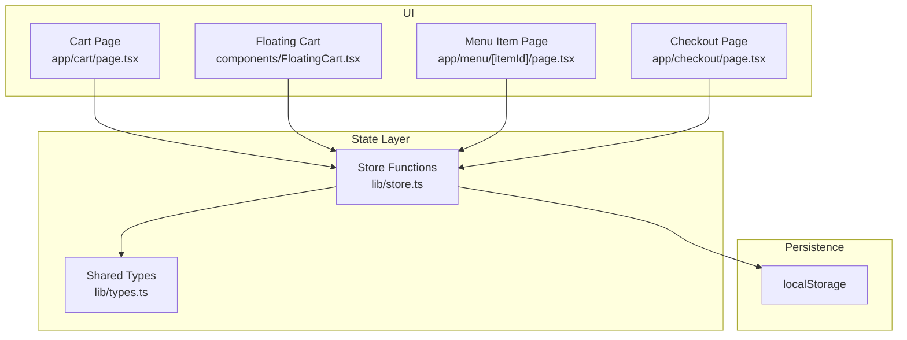
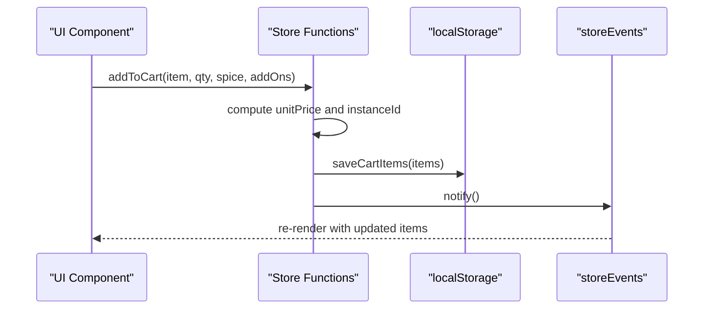
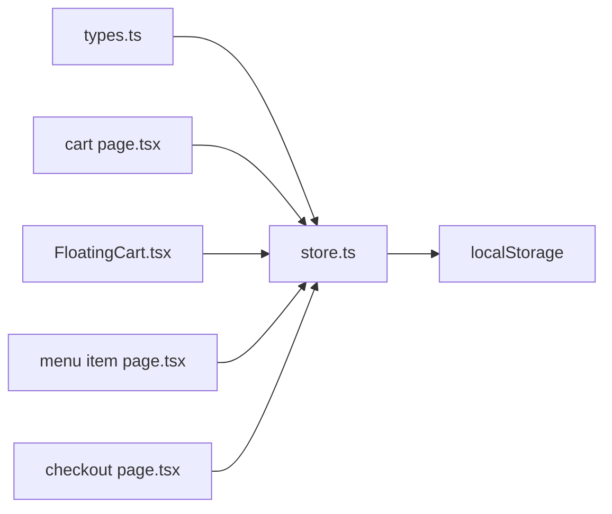

# Cart State Management

<cite>
**Referenced Files in This Document**
- [store.ts](file://lib/store.ts)
- [types.ts](file://lib/types.ts)
- [cart page.tsx](file://app/cart/page.tsx)
- [FloatingCart.tsx](file://components/FloatingCart.tsx)
- [menu item page.tsx](file://app/menu/[itemId]/page.tsx)
- [checkout page.tsx](file://app/checkout/page.tsx)
</cite>

## Table of Contents
1. [Introduction](#introduction)
2. [Project Structure](#project-structure)
3. [Core Components](#core-components)
4. [Architecture Overview](#architecture-overview)
5. [Detailed Component Analysis](#detailed-component-analysis)
6. [Dependency Analysis](#dependency-analysis)
7. [Performance Considerations](#performance-considerations)
8. [Troubleshooting Guide](#troubleshooting-guide)
9. [Conclusion](#conclusion)

## Introduction
This document explains the cart state management implementation used by the application. It focuses on:
- The CartItem interface and related types
- Adding items with spice levels and add-ons
- Updating quantities, removing items, and clearing the cart
- Unique ID generation strategy for cart item instances
- Price calculations including add-ons
- Persistence to localStorage and reactive UI updates
- Integration points with UI components such as the cart page and floating cart panel

The goal is to make these operations clear for both developers and non-technical readers who need to understand how the cart works end-to-end.

## Project Structure
The cart logic is centralized in a small store module that exposes functions for reading, writing, and mutating cart state. UI components subscribe to store events to stay in sync.

**Diagram sources**
- [store.ts:1-217](file://lib/store.ts#L1-L217)
- [types.ts:1-119](file://lib/types.ts#L1-L119)
- [cart page.tsx:1-227](file://app/cart/page.tsx#L1-L227)
- [FloatingCart.tsx:1-326](file://components/FloatingCart.tsx#L1-L326)
- [menu item page.tsx:1-100](file://app/menu/[itemId]/page.tsx#L1-L100)
- [checkout page.tsx:1-120](file://app/checkout/page.tsx#L1-L120)

**Section sources**
- [store.ts:1-217](file://lib/store.ts#L1-L217)
- [types.ts:1-119](file://lib/types.ts#L1-L119)

## Core Components
This section documents the core data model and the primary cart operations.

### Data Model: CartItem and Related Types
- CartItem represents a single line in the cart, including:
  - A unique instance id
  - The base menu item
  - Quantity
  - Optional spice level
  - Selected add-ons
  - Unit price (base + add-ons)
  - Line total (unitPrice × qty)

Related types define menu items, spice levels, and add-ons. These are shared across the app and ensure consistent shapes for cart entries.

Key responsibilities:
- Enforce required fields like name and price
- Provide optional compatibility fields for legacy data
- Define spice level labels and price modifiers
- Define add-on labels and prices

**Section sources**
- [store.ts:3-11](file://lib/store.ts#L3-L11)
- [types.ts:14-38](file://lib/types.ts#L14-L38)

### Store Operations
The store provides the following operations:
- getCartItems(): reads and sanitizes cart from localStorage
- saveCartItems(items): persists cart and notifies listeners
- addToCart(item, qty, spiceLevel?, selectedAddOns?): adds or merges an item
- updateCartQty(id, delta): increments/decrements quantity; removes if qty <= 0
- removeCartItem(id): removes a specific cart item
- clearCart(): clears cart, notes, and manual table number

These functions are pure and safe for client-side usage. They guard against server-side rendering environments and malformed data.

**Section sources**
- [store.ts:67-97](file://lib/store.ts#L67-L97)
- [store.ts:99-168](file://lib/store.ts#L99-L168)

## Architecture Overview
The cart uses a simple event-driven architecture:
- UI components call store functions to mutate state
- Store writes to localStorage and emits events
- Components subscribe to store events to refresh their local state

**Diagram sources**
- [store.ts:99-137](file://lib/store.ts#L99-L137)
- [store.ts:93-97](file://lib/store.ts#L93-L97)

## Detailed Component Analysis

### CartItem Interface and ID Strategy
- CartItem.id is a composite key derived from:
  - Base item identifier (item._id or item.id)
  - Spice level (or 'none' if not set)
  - Add-ons signature (sorted labels joined by comma)
- This ensures that two identical menu items with different spice levels or add-ons are treated as separate lines.
- If an existing line matches this composite key, its quantity increases instead of creating a duplicate line.

Complexity considerations:
- Add-ons signature computation is O(k log k) due to sorting labels, where k is the number of add-ons.
- Finding an existing line is O(n), where n is the number of cart items.

Error handling:
- Malformed add-ons are normalized to arrays and filtered safely.
- Missing or invalid item properties cause early return without mutation.

**Section sources**
- [store.ts:114-137](file://lib/store.ts#L114-L137)

### addToCart Function
Responsibilities:
- Validate input item
- Normalize add-ons
- Compute unit price including add-ons
- Generate unique instance id
- Merge or create cart line
- Persist and notify

Price calculation:
- unitPrice = base item price + sum of selected add-on prices
- lineTotal = unitPrice × qty

Example scenarios:
- Add a new item with no spice and no add-ons
- Add the same item with a different spice level (creates a new line)
- Add the same item with additional add-ons (creates a new line)
- Increase quantity of an existing matching line

**Section sources**
- [store.ts:99-137](file://lib/store.ts#L99-L137)

### Quantity Updates
Behavior:
- updateCartQty(id, delta) adjusts quantity by delta
- If quantity becomes zero or less, the item is removed
- lineTotal is recalculated based on unitPrice

Edge cases:
- Non-existent id is ignored
- Negative deltas can remove items when reaching zero

**Section sources**
- [store.ts:140-154](file://lib/store.ts#L140-L154)

### Item Removal
Behavior:
- removeCartItem(id) filters out the item by id
- Persists the updated list and notifies listeners

Use cases:
- Explicit removal via UI controls
- Cleanup after checkout completion

**Section sources**
- [store.ts:156-160](file://lib/store.ts#L156-L160)

### Cart Clearing
Behavior:
- clearCart() removes cart items, order notes, and manual table number
- Emits store events to refresh UI

Integration:
- Called at checkout completion to reset session state

**Section sources**
- [store.ts:162-168](file://lib/store.ts#L162-L168)

### Persistence Mechanisms
- Cart items are stored under a dedicated key in localStorage
- Reading includes strict sanitization to prevent null pointer exceptions
- Writing triggers store events for reactive UI updates

Sanitization rules:
- Only array-like structures are accepted
- Each item must be an object with required fields
- Quantity must be a positive number

**Section sources**
- [store.ts:67-97](file://lib/store.ts#L67-L97)

### UI Integration Points

#### Cart Page
- Subscribes to store events to refresh items and notes
- Displays item details including spice level and add-ons
- Provides quantity steppers and remove actions
- Computes subtotal, tax, service charge, and grand total

Integration highlights:
- Uses getCartItems, updateCartQty, removeCartItem, getOrderNotes, saveOrderNotes
- Navigates to checkout upon user action

**Section sources**
- [cart page.tsx:1-227](file://app/cart/page.tsx#L1-L227)

#### Floating Cart Panel
- Shows a slide-out panel with current cart items
- Supports inline quantity changes and removal
- Displays unit price and line totals
- Integrates with manual table number display

Integration highlights:
- Uses getCartItems, updateCartQty, removeCartItem, getManualTableNumber
- Subscribes to store events for live updates

**Section sources**
- [FloatingCart.tsx:1-326](file://components/FloatingCart.tsx#L1-L326)

#### Menu Item Page
- Adds items to cart with default spice and empty add-ons when quick adding
- Calls addToCart with item, quantity, spice level, and selected add-ons

**Section sources**
- [menu item page.tsx:1-100](file://app/menu/[itemId]/page.tsx#L1-L100)

#### Checkout Page
- Reads cart items and clears cart after successful order submission
- Can programmatically add promotional items to cart

**Section sources**
- [checkout page.tsx:1-120](file://app/checkout/page.tsx#L1-L120)

### Practical Examples

- Add a dish with medium spice and extra cheese:
  - Call addToCart with the menu item, qty=1, spiceLevel='Sedang', selectedAddOns=[{label:'Extra Cheese', price:...}]
  - The system computes unitPrice including the add-on and creates a unique line id
  - The cart persists and UI updates

- Increase quantity of an existing line:
  - Call updateCartQty with the line id and delta=+1
  - lineTotal is recalculated and persisted

- Remove an item:
  - Call removeCartItem with the line id
  - The item disappears from the cart and UI

- Clear the cart:
  - Call clearCart to reset all cart-related storage and notify UI

**Section sources**
- [store.ts:99-168](file://lib/store.ts#L99-L168)
- [cart page.tsx:39-61](file://app/cart/page.tsx#L39-L61)
- [FloatingCart.tsx:29-61](file://components/FloatingCart.tsx#L29-L61)

## Dependency Analysis
The store depends on shared types and persists to localStorage. UI components depend on the store’s public API and react to events.

**Diagram sources**
- [types.ts:1-119](file://lib/types.ts#L1-L119)
- [store.ts:1-217](file://lib/store.ts#L1-L217)
- [cart page.tsx:1-227](file://app/cart/page.tsx#L1-L227)
- [FloatingCart.tsx:1-326](file://components/FloatingCart.tsx#L1-L326)
- [menu item page.tsx:1-100](file://app/menu/[itemId]/page.tsx#L1-L100)
- [checkout page.tsx:1-120](file://app/checkout/page.tsx#L1-L120)

**Section sources**
- [store.ts:1-217](file://lib/store.ts#L1-L217)
- [types.ts:1-119](file://lib/types.ts#L1-L119)

## Performance Considerations
- Cart read/write operations are lightweight and operate on small arrays typical for a single-user cart.
- Sorting add-on labels for uniqueness is O(k log k); keep add-on lists concise.
- Avoid excessive re-renders by batching UI updates where possible.
- Sanitization prevents expensive error recovery paths during persistence.

[No sources needed since this section provides general guidance]

## Troubleshooting Guide

Common issues and resolutions:
- Cart does not appear:
  - Verify localStorage contains valid JSON under the cart key
  - Check that getCartItems returns sanitized items
- Items disappear unexpectedly:
  - Ensure quantity remains positive; updateCartQty removes items when qty <= 0
- Duplicate lines appear:
  - Confirm spice level and add-ons match exactly; differences create distinct lines
- UI not updating:
  - Ensure components subscribe to storeEvents and refresh on notify
- Malformed data:
  - getCartItems filters out invalid entries; inspect raw localStorage if needed

Operational tips:
- Use clearCart after successful checkout to reset state
- Keep add-on labels stable to avoid unnecessary line duplication
- Validate item inputs before calling addToCart

**Section sources**
- [store.ts:67-97](file://lib/store.ts#L67-L97)
- [store.ts:140-168](file://lib/store.ts#L140-L168)

## Conclusion
The cart state management is implemented with a clear separation between data model, store operations, and UI integration. The unique ID strategy ensures accurate representation of customized items, while robust persistence and event notifications keep the UI synchronized. By following the documented operations and best practices, developers can confidently extend and maintain cart functionality across the application.

[No sources needed since this section summarizes without analyzing specific files]