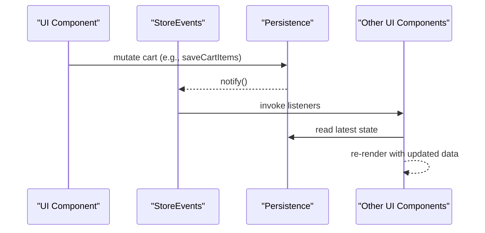
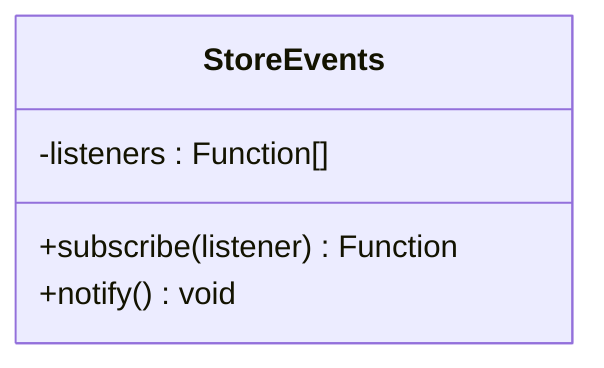
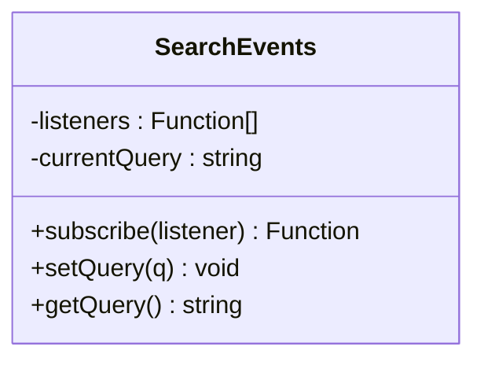
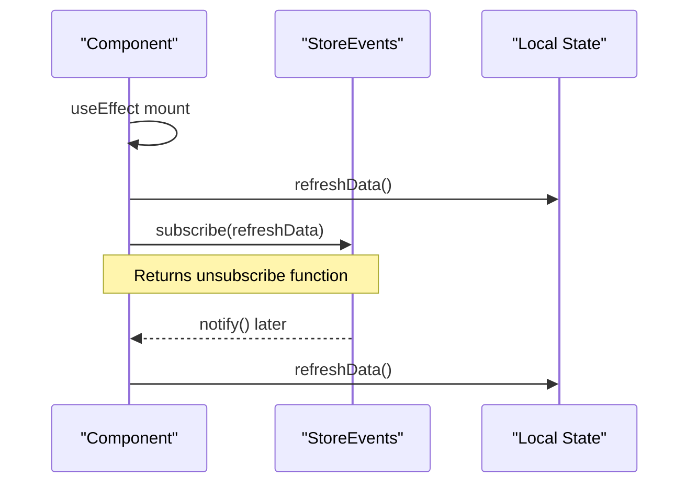
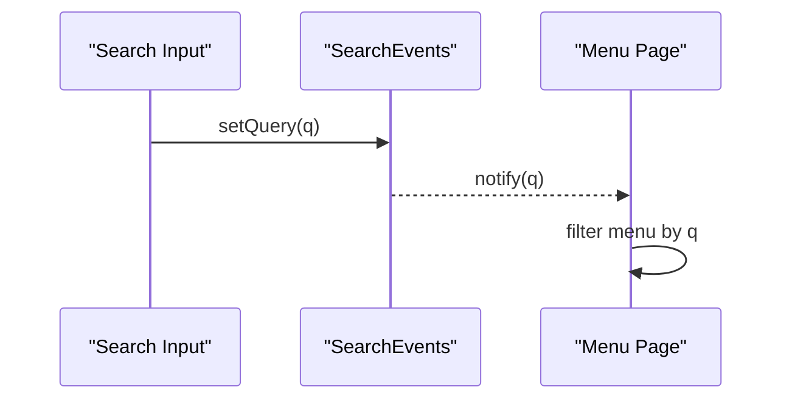
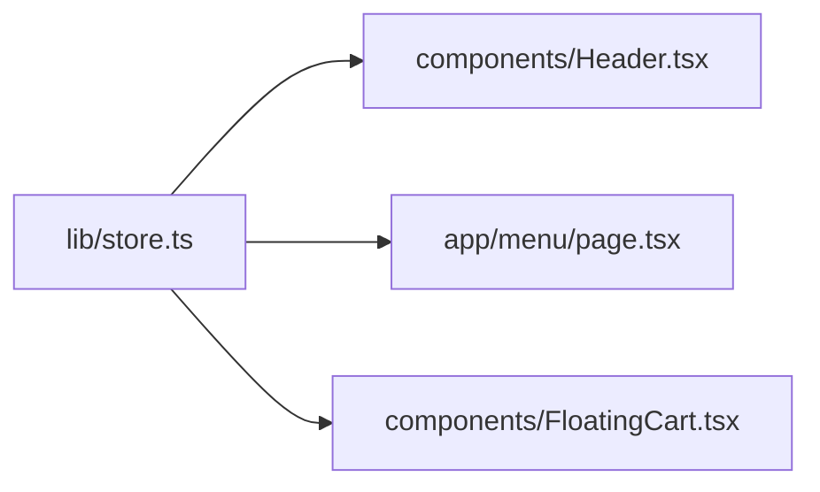

# Event System Architecture

<cite>
**Referenced Files in This Document**
- [store.ts](file://lib/store.ts)
- [Header.tsx](file://components/Header.tsx)
- [menu/page.tsx](file://app/menu/page.tsx)
- [FloatingCart.tsx](file://components/FloatingCart.tsx)
</cite>

## Table of Contents
1. [Introduction](#introduction)
2. [Project Structure](#project-structure)
3. [Core Components](#core-components)
4. [Architecture Overview](#architecture-overview)
5. [Detailed Component Analysis](#detailed-component-analysis)
6. [Dependency Analysis](#dependency-analysis)
7. [Performance Considerations](#performance-considerations)
8. [Troubleshooting Guide](#troubleshooting-guide)
9. [Conclusion](#conclusion)

## Introduction
This document explains the event-driven state management system used to keep UI components synchronized with persistent cart and search state. It focuses on:
- The StoreEvents class implementing a simple subscribe/notify pattern for general store changes.
- The SearchEvents class providing query synchronization across components.
- How components reactively update when state changes occur.
- The event emitter pattern, listener management, memory cleanup via unsubscribe functions, and cross-component communication strategies.
- Practical examples for subscribing to cart updates, search queries, and implementing custom event handlers.

## Project Structure
The event system is implemented as a small module that exposes:
- Two event emitters: one for generic store events (cart, table session, notes), and one for search query synchronization.
- Persistence helpers for cart items, order notes, and table session data.
- A set of domain functions (add/update/remove/clear cart) that persist data and notify listeners.

```mermaid
graph TB
subgraph "State Layer"
Store["Store Events<br/>StoreEvents"]
Search["Search Events<br/>SearchEvents"]
Persist["Persistence Helpers<br/>get/save cart, notes, table"]
end
subgraph "UI Layer"
Header["Header Component"]
MenuPage["Menu Page"]
FloatingCart["Floating Cart"]
end
Store --> |notify()| Header
Store --> |notify()| MenuPage
Store --> |notify()| FloatingCart
Search --> |setQuery()/subscribe()| Header
Search --> |setQuery()/subscribe()| MenuPage
Persist --> Store
Persist --> Search
```

**Diagram sources**
- [store.ts:26-65](file://lib/store.ts#L26-L65)
- [Header.tsx:24-39](file://components/Header.tsx#L24-L39)
- [menu/page.tsx:47-55](file://app/menu/page.tsx#L47-L55)
- [FloatingCart.tsx:34-39](file://components/FloatingCart.tsx#L34-L39)

**Section sources**
- [store.ts:26-65](file://lib/store.ts#L26-L65)
- [Header.tsx:24-39](file://components/Header.tsx#L24-L39)
- [menu/page.tsx:47-55](file://app/menu/page.tsx#L47-L55)
- [FloatingCart.tsx:34-39](file://components/FloatingCart.tsx#L34-L39)

## Core Components
- StoreEvents: A minimal event emitter that maintains an array of listeners and invokes them on notify(). Subscribers receive an unsubscribe function to remove themselves from the listener list.
- SearchEvents: An event emitter specialized for search queries. It holds the current query string, emits it to new subscribers immediately, and notifies all listeners whenever the query changes.

Key responsibilities:
- Decouple state mutation from UI updates.
- Provide a single source of truth for cart and search state.
- Ensure memory-safe subscription lifecycle through unsubscribe functions.

**Section sources**
- [store.ts:26-65](file://lib/store.ts#L26-L65)

## Architecture Overview
The architecture follows a publish-subscribe model:
- Mutators (e.g., addToCart, updateCartQty, clearCart) persist data and call storeEvents.notify().
- Components subscribe to storeEvents to refresh their local state.
- Search input components both emit and consume search queries via SearchEvents.



**Diagram sources**
- [store.ts:93-97](file://lib/store.ts#L93-L97)
- [store.ts:140-153](file://lib/store.ts#L140-L153)
- [store.ts:162-168](file://lib/store.ts#L162-L168)
- [store.ts:212-216](file://lib/store.ts#L212-L216)

## Detailed Component Analysis

### StoreEvents Class
- Purpose: Generic store change notifications.
- API:
  - subscribe(listener): registers a listener and returns an unsubscribe function.
  - notify(): calls all registered listeners synchronously.
- Complexity:
  - subscribe: O(1) append; returns a closure that filters listeners in O(n).
  - notify: O(n) where n is number of listeners.
- Memory management: Unsubscribe removes the exact listener reference, preventing leaks.



**Diagram sources**
- [store.ts:26-39](file://lib/store.ts#L26-L39)

**Section sources**
- [store.ts:26-39](file://lib/store.ts#L26-L39)

### SearchEvents Class
- Purpose: Synchronize search queries across components.
- API:
  - subscribe(listener): registers a listener and immediately invokes it with the current query; returns an unsubscribe function.
  - setQuery(q): updates the current query and notifies all listeners.
  - getQuery(): returns the current query.
- Behavior:
  - New subscribers always receive the latest query value.
  - All subscribers are notified synchronously on setQuery.



**Diagram sources**
- [store.ts:43-63](file://lib/store.ts#L43-L63)

**Section sources**
- [store.ts:43-63](file://lib/store.ts#L43-L63)

### React Integration Examples

#### Subscribing to Cart Updates
Components subscribe to storeEvents to refresh their local state after any cart mutation. Typical flow:
- On mount: call refresh function once, then subscribe to storeEvents.
- On unmount: call the returned unsubscribe function.

Example usage patterns:
- Header component subscribes to storeEvents to compute and display cart count.
- Menu page subscribes to storeEvents to load cart items and derive totals.
- Floating cart subscribes to storeEvents to reflect item changes and manual table number.



**Diagram sources**
- [Header.tsx:24-33](file://components/Header.tsx#L24-L33)
- [menu/page.tsx:47-55](file://app/menu/page.tsx#L47-L55)
- [FloatingCart.tsx:34-39](file://components/FloatingCart.tsx#L34-L39)

**Section sources**
- [Header.tsx:24-33](file://components/Header.tsx#L24-L33)
- [menu/page.tsx:47-55](file://app/menu/page.tsx#L47-L55)
- [FloatingCart.tsx:34-39](file://components/FloatingCart.tsx#L34-L39)

#### Subscribing to Search Queries
Components subscribe to SearchEvents to stay in sync with the global search query.

Typical flow:
- On mount: subscribe to SearchEvents and set local searchQuery state.
- On user input: update local state and call SearchEvents.setQuery(q).
- On unmount: call the returned unsubscribe function.



**Diagram sources**
- [Header.tsx:35-39](file://components/Header.tsx#L35-L39)
- [menu/page.tsx:47-55](file://app/menu/page.tsx#L47-L55)

**Section sources**
- [Header.tsx:35-39](file://components/Header.tsx#L35-L39)
- [menu/page.tsx:47-55](file://app/menu/page.tsx#L47-L55)

#### Implementing Custom Event Handlers
To add a new domain event:
- Extend or create a new event emitter similar to StoreEvents/SearchEvents.
- Expose subscribe and notify methods.
- Call notify() after mutating related state.
- Subscribe in components and clean up with unsubscribe.

Best practices:
- Keep event payloads minimal and stable.
- Avoid heavy work inside notify(); offload expensive operations to components.
- Always return unsubscribe functions and call them in effect cleanup.

[No sources needed since this section provides general guidance]

## Dependency Analysis
The following diagram shows how UI components depend on the event emitters and persistence helpers.



**Diagram sources**
- [store.ts:26-65](file://lib/store.ts#L26-L65)
- [Header.tsx:6-39](file://components/Header.tsx#L6-L39)
- [menu/page.tsx:8-55](file://app/menu/page.tsx#L8-L55)
- [FloatingCart.tsx:7-39](file://components/FloatingCart.tsx#L7-L39)

**Section sources**
- [store.ts:26-65](file://lib/store.ts#L26-L65)
- [Header.tsx:6-39](file://components/Header.tsx#L6-L39)
- [menu/page.tsx:8-55](file://app/menu/page.tsx#L8-L55)
- [FloatingCart.tsx:7-39](file://components/FloatingCart.tsx#L7-L39)

## Performance Considerations
- Listener invocation is synchronous and linear in the number of listeners. Keep listener counts reasonable and avoid heavy computations inside listeners.
- Prefer lightweight state refreshers (e.g., reading persisted data and updating local state) rather than performing network requests in notify callbacks.
- Use memoization for derived values (e.g., cart totals) to minimize re-renders.
- Ensure unsubscribe functions are called to prevent memory leaks and unnecessary re-renders after component unmount.

[No sources needed since this section provides general guidance]

## Troubleshooting Guide
Common issues and resolutions:
- Listeners not firing:
  - Verify that the mutator calls notify() after persisting state.
  - Confirm that the component subscribed before expecting updates.
- Stale state after navigation:
  - Ensure components subscribe on mount and refresh initial state.
- Memory leaks:
  - Always call the unsubscribe function returned by subscribe in effect cleanup.
- Duplicate subscriptions:
  - Avoid subscribing multiple times without cleaning up previous subscriptions.

**Section sources**
- [store.ts:93-97](file://lib/store.ts#L93-L97)
- [store.ts:162-168](file://lib/store.ts#L162-L168)
- [Header.tsx:24-33](file://components/Header.tsx#L24-L33)
- [menu/page.tsx:47-55](file://app/menu/page.tsx#L47-L55)
- [FloatingCart.tsx:34-39](file://components/FloatingCart.tsx#L34-L39)

## Conclusion
The event-driven state management system uses two focused emitters:
- StoreEvents for general store mutations (cart, notes, table session).
- SearchEvents for cross-component search query synchronization.

By adhering to the subscribe/notify pattern and properly managing unsubscribe functions, components remain reactive, decoupled, and memory-safe. This approach enables scalable cross-component communication while keeping state logic centralized and testable.

[No sources needed since this section summarizes without analyzing specific files]