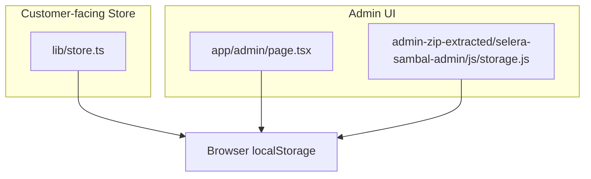
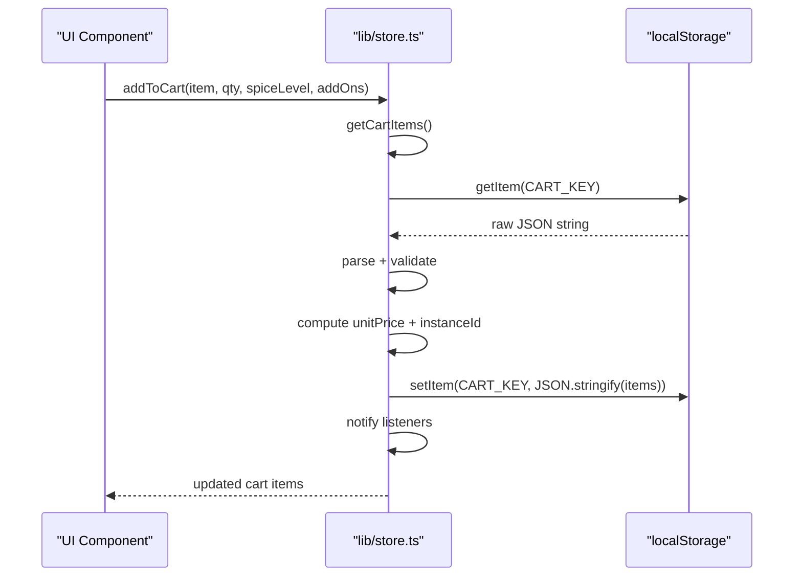
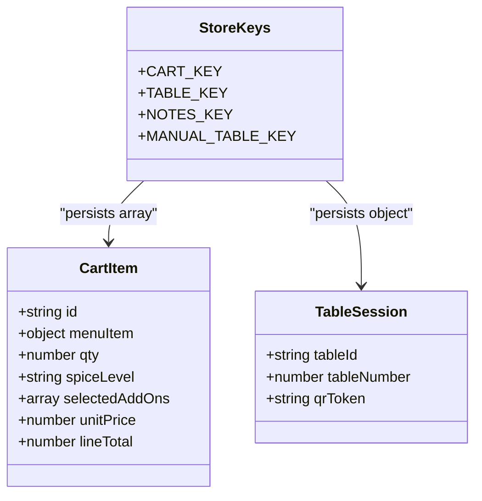
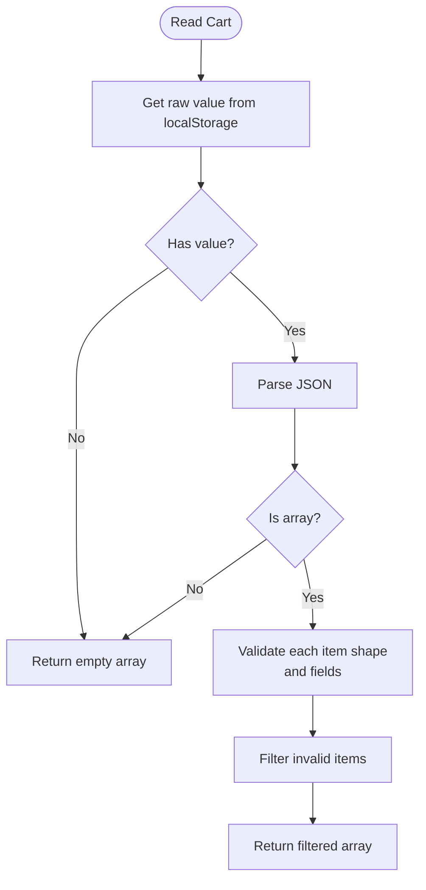
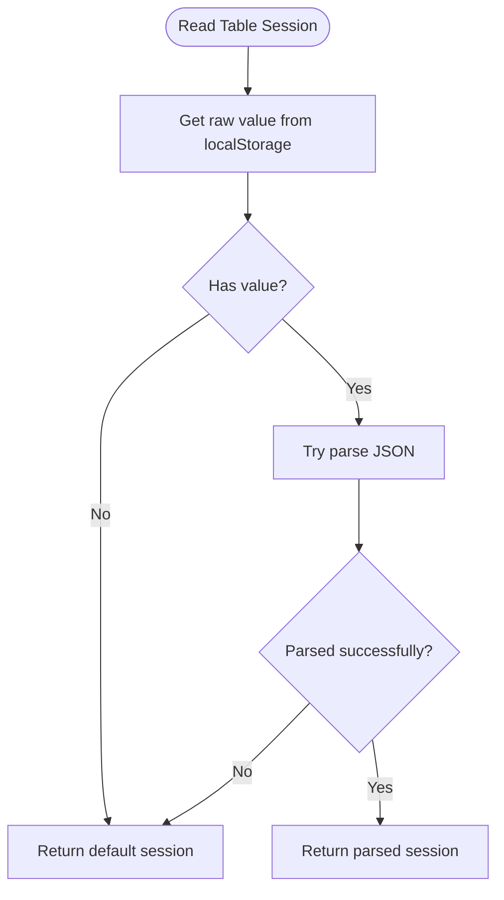
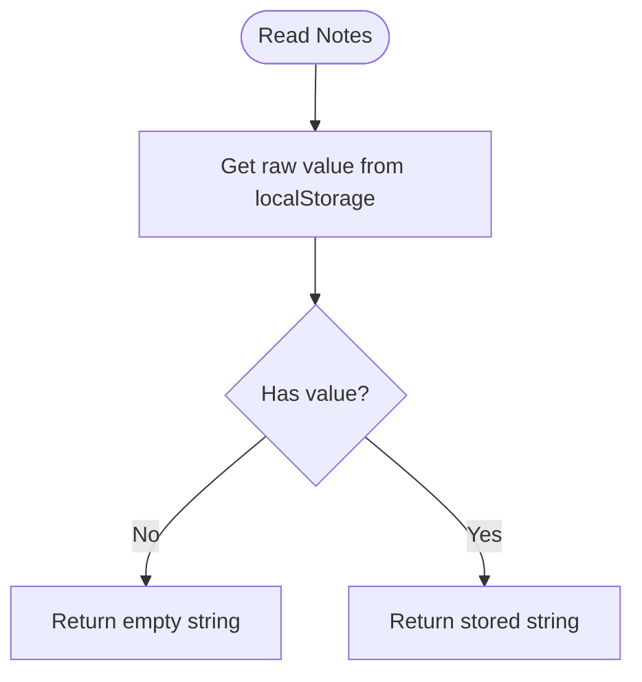
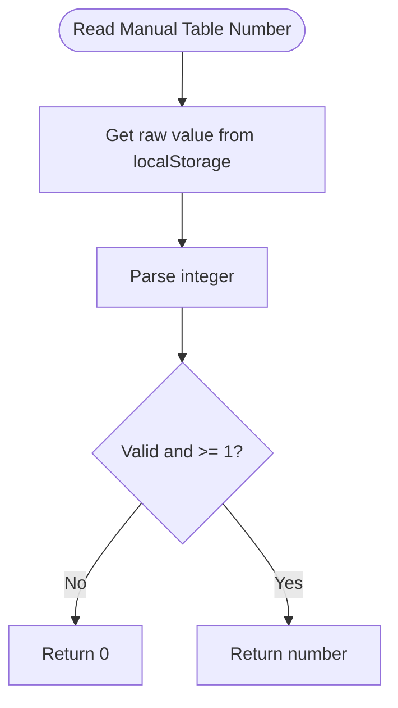
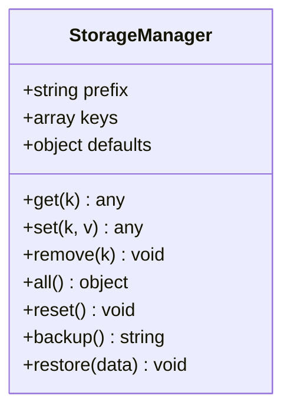
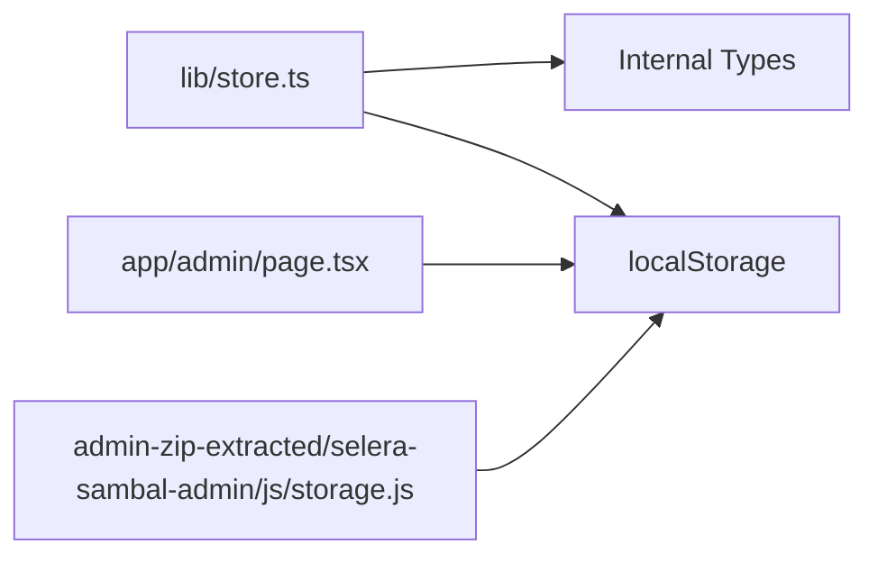

# Local Storage Persistence

<cite>
**Referenced Files in This Document**
- [store.ts](file://lib/store.ts)
- [storage.js](file://admin-zip-extracted/selera-sambal-admin/js/storage.js)
- [page.tsx](file://app/admin/page.tsx)
</cite>

## Table of Contents
1. [Introduction](#introduction)
2. [Project Structure](#project-structure)
3. [Core Components](#core-components)
4. [Architecture Overview](#architecture-overview)
5. [Detailed Component Analysis](#detailed-component-analysis)
6. [Dependency Analysis](#dependency-analysis)
7. [Performance Considerations](#performance-considerations)
8. [Troubleshooting Guide](#troubleshooting-guide)
9. [Conclusion](#conclusion)

## Introduction
This document explains how the application persists state using browser localStorage. It focuses on:
- Keys for cart items, table sessions, order notes, and manual table numbers
- Data serialization and deserialization patterns
- Error handling for corrupted or missing data
- Browser compatibility considerations
- Security implications
- Examples of reading/writing persistent data
- Handling storage quotas
- Migrating data between versions

The implementation is primarily located in a shared store module that exposes typed helpers for client-side persistence, with additional admin-local storage utilities used by the admin interface.

## Project Structure
The relevant persistence logic spans three files:
- A shared store module defining keys, types, and persistence helpers for cart, table session, notes, and manual table number
- An admin-only storage utility for local admin data
- The Next.js admin page using lightweight wrappers around localStorage for admin settings and authentication

**Diagram sources**
- [store.ts:19-23](file://lib/store.ts#L19-L23)
- [page.tsx:54-60](file://app/admin/page.tsx#L54-L60)
- [storage.js:1-13](file://admin-zip-extracted/selera-sambal-admin/js/storage.js#L1-L13)

**Section sources**
- [store.ts:1-217](file://lib/store.ts#L1-L217)
- [storage.js:1-98](file://admin-zip-extracted/selera-sambal-admin/js/storage.js#L1-L98)
- [page.tsx:54-60](file://app/admin/page.tsx#L54-L60)

## Core Components
- Cart persistence: stores an array of cart items keyed under a dedicated key; includes strict validation when reading to prevent runtime errors from malformed entries.
- Table session persistence: stores a small object representing the active table context.
- Order notes persistence: stores free-text notes associated with the current order flow.
- Manual table number persistence: stores a numeric table number entered by the user for the current order session.
- Admin storage helpers: provide prefixing, defaults, and event dispatching for admin-local data.

Key responsibilities:
- Serialization via JSON.stringify/JSON.parse
- Deserialization with try/catch and structural validation
- Event notifications to update UI components after changes
- Safe guards against server-side execution where window is undefined

**Section sources**
- [store.ts:3-23](file://lib/store.ts#L3-L23)
- [store.ts:67-97](file://lib/store.ts#L67-L97)
- [store.ts:162-178](file://lib/store.ts#L162-L178)
- [store.ts:180-216](file://lib/store.ts#L180-L216)
- [storage.js:1-98](file://admin-zip-extracted/selera-sambal-admin/js/storage.js#L1-L98)
- [page.tsx:54-60](file://app/admin/page.tsx#L54-L60)

## Architecture Overview
The persistence layer is thin and centralized:
- All reads and writes go through helper functions
- Helpers guard against non-browser environments
- On successful write, a simple event emitter notifies subscribers (e.g., UI components)
- Admin pages use their own prefixed keys and default values

**Diagram sources**
- [store.ts:99-138](file://lib/store.ts#L99-L138)
- [store.ts:67-97](file://lib/store.ts#L67-L97)

## Detailed Component Analysis

### Storage Keys and Data Models
- Cart items key: a dedicated key storing an array of cart item objects
- Table session key: a dedicated key storing a small object with table identifiers
- Order notes key: a dedicated key storing a plain text note
- Manual table number key: a dedicated key storing a positive integer string

Data models:
- Cart item: contains menu reference, quantity, optional spice level, selected add-ons, unit price, and line total
- Table session: contains table id, table number, and optional QR token

**Diagram sources**
- [store.ts:3-23](file://lib/store.ts#L3-L23)

**Section sources**
- [store.ts:3-23](file://lib/store.ts#L3-L23)

### Reading and Writing Persistent Data

#### Cart Items
- Reading: retrieves the raw value, parses JSON, validates structure, filters out invalid entries, and returns a safe array
- Writing: serializes the full cart array and notifies listeners

**Diagram sources**
- [store.ts:67-91](file://lib/store.ts#L67-L91)

Writing cart items follows a straightforward path: serialize the array and notify subscribers.

**Section sources**
- [store.ts:67-97](file://lib/store.ts#L67-L97)

#### Table Session
- Reading: attempts to parse stored JSON; on error, returns a default empty session
- Writing: serializes the session object and notifies subscribers

**Diagram sources**
- [store.ts:180-188](file://lib/store.ts#L180-L188)

**Section sources**
- [store.ts:180-216](file://lib/store.ts#L180-L216)

#### Order Notes
- Reading: returns the stored string or empty string if absent
- Writing: stores the provided string

**Diagram sources**
- [store.ts:170-178](file://lib/store.ts#L170-L178)

**Section sources**
- [store.ts:170-178](file://lib/store.ts#L170-L178)

#### Manual Table Number
- Reading: parses the stored string as an integer; returns zero if not present or invalid
- Writing: stores the number as a string if greater than zero; otherwise removes the key

**Diagram sources**
- [store.ts:194-199](file://lib/store.ts#L194-L199)

**Section sources**
- [store.ts:194-210](file://lib/store.ts#L194-L210)

### Admin Local Storage Utilities
The admin interface uses its own storage helpers:
- Prefix-based keys to avoid collisions
- Default values for settings and admin credentials
- Simple wrappers for get/set/remove
- Custom events to notify UI about data changes

**Diagram sources**
- [storage.js:1-98](file://admin-zip-extracted/selera-sambal-admin/js/storage.js#L1-L98)

Additionally, the Next.js admin page defines lightweight wrappers around localStorage with a common prefix and default values.

**Section sources**
- [storage.js:1-98](file://admin-zip-extracted/selera-sambal-admin/js/storage.js#L1-L98)
- [page.tsx:54-60](file://app/admin/page.tsx#L54-L60)

## Dependency Analysis
- The store module depends only on browser APIs and internal types
- Admin storage is independent and scoped to the admin UI
- Both layers rely on localStorage without external libraries

**Diagram sources**
- [store.ts:1-2](file://lib/store.ts#L1-L2)
- [page.tsx:54-60](file://app/admin/page.tsx#L54-L60)
- [storage.js:1-13](file://admin-zip-extracted/selera-sambal-admin/js/storage.js#L1-L13)

**Section sources**
- [store.ts:1-2](file://lib/store.ts#L1-L2)
- [page.tsx:54-60](file://app/admin/page.tsx#L54-L60)
- [storage.js:1-13](file://admin-zip-extracted/selera-sambal-admin/js/storage.js#L1-L13)

## Performance Considerations
- All operations are synchronous and operate on small payloads (cart array, small session object, short strings). This keeps latency minimal.
- Frequent writes trigger event notifications; ensure UI subscriptions are efficient to avoid unnecessary re-renders.
- Avoid storing large images or heavy datasets in localStorage; prefer IndexedDB or server storage for larger payloads.

[No sources needed since this section provides general guidance]

## Troubleshooting Guide

### Corrupted or Malformed Data
- Cart items: parsing failures return an empty array; additionally, invalid item shapes are filtered out during read. This prevents crashes but may result in an empty cart if data is severely corrupted.
- Table session: parsing failures return a default empty session.
- Admin storage: get methods catch parse errors and fall back to defaults.

Recommended actions:
- Clear the affected key(s) to reset to defaults
- Validate new writes before persisting
- Add migration routines to normalize legacy formats

**Section sources**
- [store.ts:67-91](file://lib/store.ts#L67-L91)
- [store.ts:180-188](file://lib/store.ts#L180-L188)
- [storage.js:46-52](file://admin-zip-extracted/selera-sambal-admin/js/storage.js#L46-L52)

### Storage Quota Exceeded
Symptoms:
- Write operations fail silently or throw quota errors depending on the environment
- UI may not reflect recent changes

Mitigations:
- Check quota availability before writing large payloads
- Implement fallback strategies (e.g., reduce payload size, clear old data)
- Provide user feedback when storage is unavailable or full

[No sources needed since this section provides general guidance]

### Browser Compatibility
- localStorage is available in all modern browsers and WebViews
- In server-side rendering contexts, code checks for window presence before accessing localStorage
- Some privacy modes or restrictive policies may block localStorage access

Recommendations:
- Always wrap localStorage calls in environment checks
- Gracefully handle exceptions and provide fallback behavior
- Test in private/incognito modes and restricted environments

**Section sources**
- [store.ts:67-69](file://lib/store.ts#L67-L69)
- [store.ts:93-95](file://lib/store.ts#L93-L95)
- [store.ts:162-168](file://lib/store.ts#L162-L168)
- [store.ts:170-178](file://lib/store.ts#L170-L178)
- [store.ts:180-188](file://lib/store.ts#L180-L188)
- [store.ts:194-210](file://lib/store.ts#L194-L210)
- [store.ts:212-216](file://lib/store.ts#L212-L216)

### Security Implications
- localStorage is accessible to JavaScript running in the same origin; it is not encrypted
- Do not store sensitive data (passwords, tokens, PII) in localStorage
- Sanitize inputs before writing and validate outputs before reading
- Be aware of XSS risks: malicious scripts can read/write localStorage

Best practices:
- Use secure HTTP-only cookies for sensitive tokens
- Validate and sanitize all persisted data
- Limit the scope and lifetime of stored data

[No sources needed since this section provides general guidance]

### Examples: Reading/Writing Persistent Data
- Read cart items: call the getter function which safely parses and validates the stored array
- Write cart items: call the setter function which serializes the array and notifies listeners
- Read table session: call the getter function which returns a default if parsing fails
- Write table session: call the setter function which serializes the session object
- Read order notes: call the getter function which returns a string or empty value
- Write order notes: call the setter function which stores the string
- Read manual table number: call the getter function which returns a validated integer or zero
- Write manual table number: call the setter function which stores a positive integer or removes the key

For admin data:
- Use the admin storage manager’s get/set/remove methods or the page-level wrappers with the common prefix

**Section sources**
- [store.ts:67-97](file://lib/store.ts#L67-L97)
- [store.ts:162-178](file://lib/store.ts#L162-L178)
- [store.ts:180-216](file://lib/store.ts#L180-L216)
- [storage.js:46-69](file://admin-zip-extracted/selera-sambal-admin/js/storage.js#L46-L69)
- [page.tsx:54-60](file://app/admin/page.tsx#L54-L60)

### Migration Between Versions
To migrate data across versions:
- Introduce a version marker in localStorage (e.g., a separate key)
- On app startup, compare stored version with current version
- Run migration functions to transform legacy structures into the current schema
- After migration, update the version marker

Example approach:
- Define migration functions per feature (cart, table session, notes, manual table number)
- Apply migrations sequentially based on version deltas
- Log migration outcomes for debugging

[No sources needed since this section provides general guidance]

## Conclusion
The application uses a simple, robust localStorage-based persistence layer:
- Centralized helpers define keys and manage serialization/deserialization
- Strong validation protects against corrupted data
- Event notifications keep UI in sync
- Admin utilities provide isolated, prefixed storage with defaults

Adopt the recommended best practices for security, quota management, and migration to maintain reliability and performance over time.