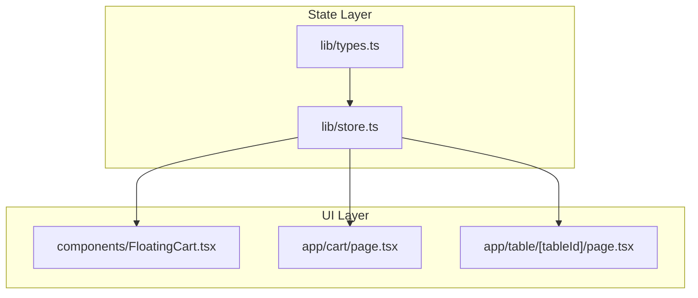
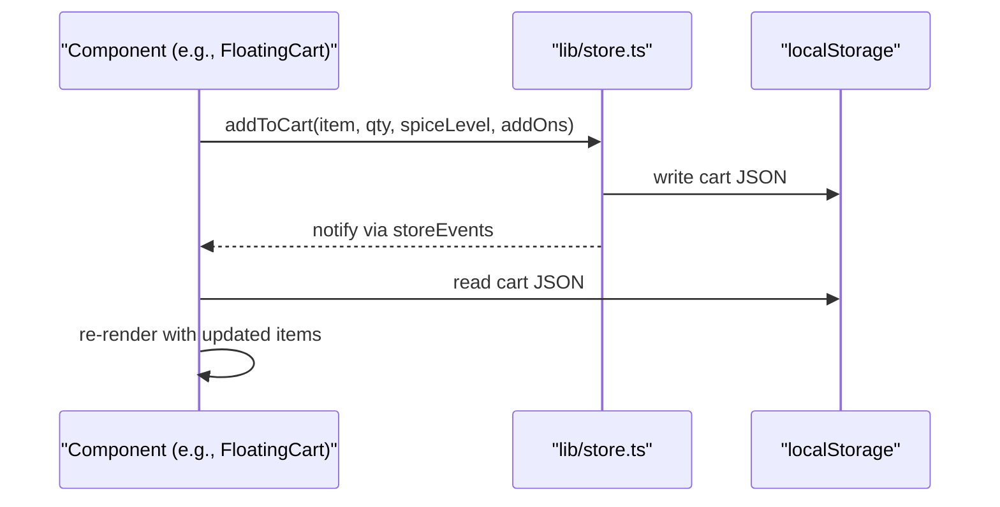
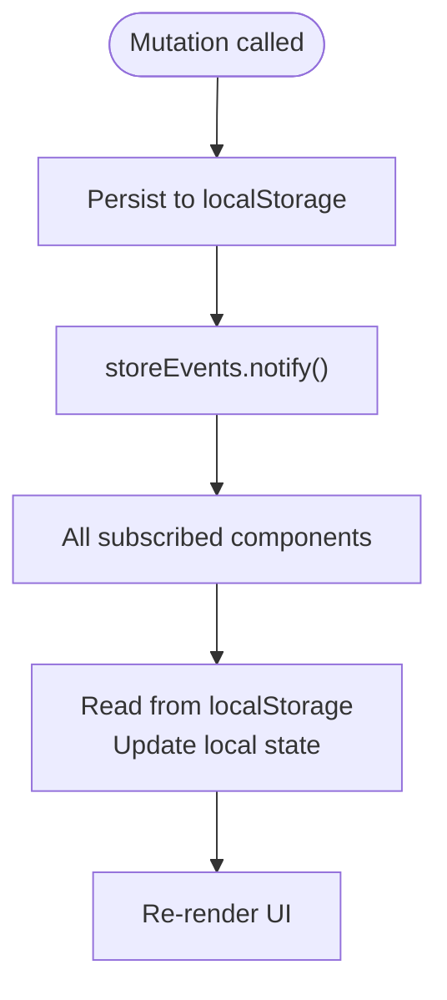
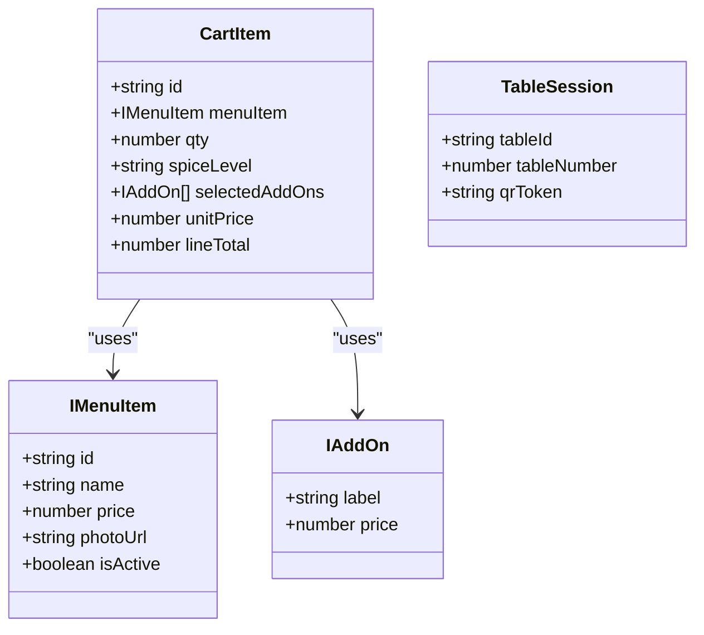
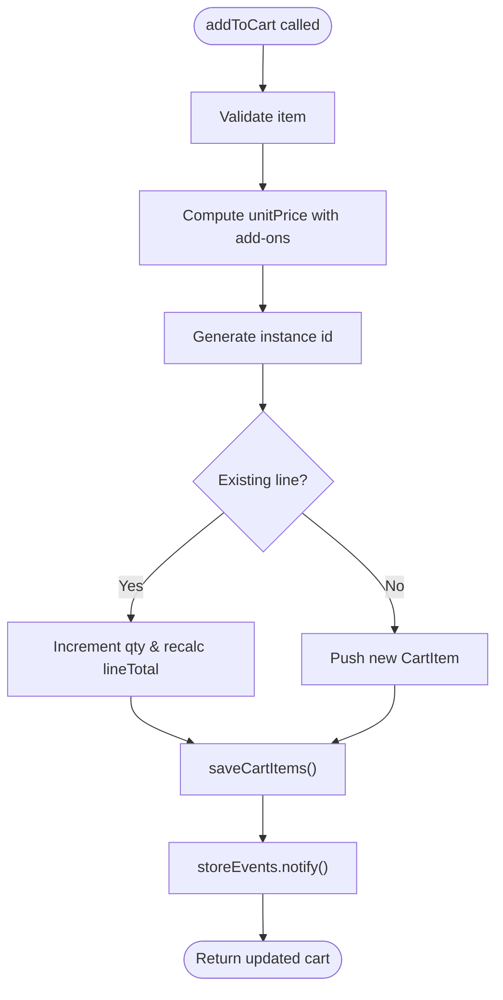
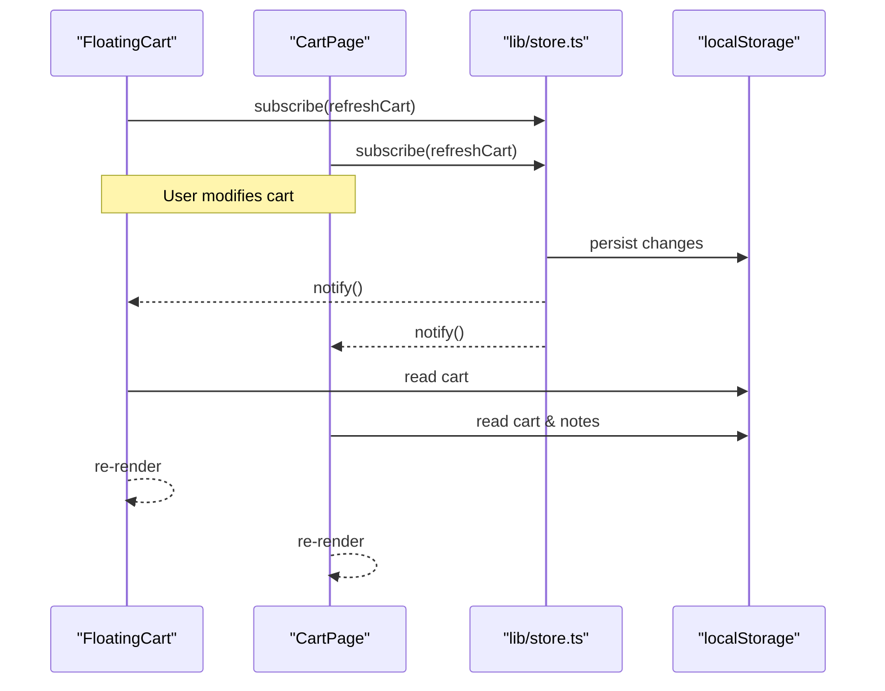
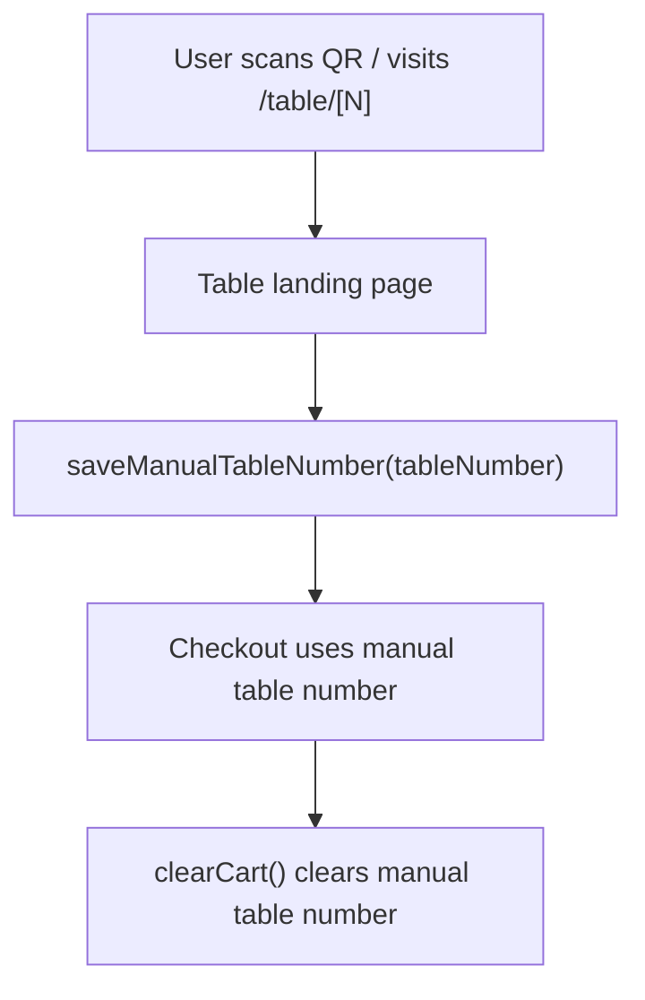
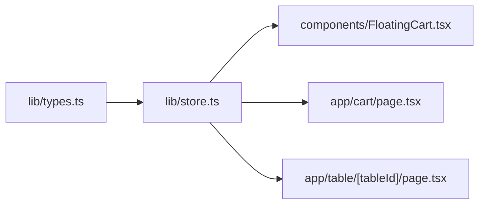

# State Management

<cite>
**Referenced Files in This Document**
- [store.ts](file://lib/store.ts)
- [types.ts](file://lib/types.ts)
- [FloatingCart.tsx](file://components/FloatingCart.tsx)
- [page.tsx (cart)](file://app/cart/page.tsx)
- [page.tsx (table landing)](file://app/table/[tableId]/page.tsx)
</cite>

## Table of Contents
1. [Introduction](#introduction)
2. [Project Structure](#project-structure)
3. [Core Components](#core-components)
4. [Architecture Overview](#architecture-overview)
5. [Detailed Component Analysis](#detailed-component-analysis)
6. [Dependency Analysis](#dependency-analysis)
7. [Performance Considerations](#performance-considerations)
8. [Troubleshooting Guide](#troubleshooting-guide)
9. [Conclusion](#conclusion)

## Introduction
This document explains the client-side state management system for cart and table session data. It focuses on:
- Event-driven architecture using StoreEvents to keep UI components reactive
- Cart persistence with localStorage across browser sessions
- Table session and manual table number handling
- The CartItem interface and related types
- Synchronization patterns between components and storage
- Examples of cart operations, event handling, and persistence strategies

## Project Structure
The state management is centered around a small set of modules:
- lib/store.ts: Core store logic, event emitter, and localStorage helpers
- lib/types.ts: Shared domain interfaces used by the store and UI
- components/FloatingCart.tsx: React component that subscribes to store events and renders cart items
- app/cart/page.tsx: Cart page that reads/writes cart and order notes
- app/table/[tableId]/page.tsx: Table landing page that pre-fills the manual table number

**Diagram sources**
- [store.ts:1-217](file://lib/store.ts#L1-L217)
- [types.ts:1-119](file://lib/types.ts#L1-L119)
- [FloatingCart.tsx:1-326](file://components/FloatingCart.tsx#L1-L326)
- [page.tsx (cart):1-227](file://app/cart/page.tsx#L1-L227)
- [page.tsx (table landing):1-104](file://app/table/[tableId]/page.tsx#L1-L104)

**Section sources**
- [store.ts:1-217](file://lib/store.ts#L1-L217)
- [types.ts:1-119](file://lib/types.ts#L1-L119)
- [FloatingCart.tsx:1-326](file://components/FloatingCart.tsx#L1-L326)
- [page.tsx (cart):1-227](file://app/cart/page.tsx#L1-L227)
- [page.tsx (table landing):1-104](file://app/table/[tableId]/page.tsx#L1-L104)

## Core Components
- StoreEvents: A simple event emitter used to notify subscribers when state changes occur.
- SearchEvents: An additional event bus for search query propagation (not central to cart).
- Cart persistence functions: getCartItems, saveCartItems, addToCart, updateCartQty, removeCartItem, clearCart.
- Order notes persistence: getOrderNotes, saveOrderNotes.
- Table session management: getTableSession, saveTableSession, getManualTableNumber, saveManualTableNumber.

Key responsibilities:
- Read/write cart and notes from/to localStorage safely
- Emit events via storeEvents.notify() after mutations
- Provide typed interfaces for cart items and table sessions

**Section sources**
- [store.ts:25-41](file://lib/store.ts#L25-L41)
- [store.ts:67-97](file://lib/store.ts#L67-L97)
- [store.ts:99-168](file://lib/store.ts#L99-L168)
- [store.ts:170-216](file://lib/store.ts#L170-L216)

## Architecture Overview
The system follows an event-driven pattern:
- Components subscribe to storeEvents to react to state changes
- Mutations persist to localStorage and then emit notifications
- Components refresh their local state by reading from localStorage upon notification

**Diagram sources**
- [store.ts:99-138](file://lib/store.ts#L99-L138)
- [store.ts:93-97](file://lib/store.ts#L93-L97)
- [FloatingCart.tsx:29-39](file://components/FloatingCart.tsx#L29-L39)

## Detailed Component Analysis

### Store Events and Persistence
- StoreEvents provides subscribe(listener) returning an unsubscribe function and notify() to call all listeners.
- All cart mutation functions call saveCartItems or clearCart, which persist to localStorage and then call storeEvents.notify().
- Table session and manual table number setters also call storeEvents.notify() to keep UI in sync.

**Diagram sources**
- [store.ts:25-41](file://lib/store.ts#L25-L41)
- [store.ts:93-97](file://lib/store.ts#L93-L97)
- [store.ts:162-168](file://lib/store.ts#L162-L168)
- [store.ts:201-216](file://lib/store.ts#L201-L216)

**Section sources**
- [store.ts:25-41](file://lib/store.ts#L25-L41)
- [store.ts:93-97](file://lib/store.ts#L93-L97)
- [store.ts:162-168](file://lib/store.ts#L162-L168)
- [store.ts:201-216](file://lib/store.ts#L201-L216)

### CartItem Interface and Data Model
- CartItem represents a single line item in the cart, including:
  - id: unique instance key combining menu item ID, spice level, and add-ons signature
  - menuItem: reference to the menu item
  - qty: quantity
  - spiceLevel: optional spice selection
  - selectedAddOns: array of add-on selections
  - unitPrice: price per unit including add-ons
  - lineTotal: total for this line (qty * unitPrice)

- Related types:
  - IMenuItem, IAddOn define menu item structure and add-on options
  - TableSession defines current table context

**Diagram sources**
- [store.ts:3-17](file://lib/store.ts#L3-L17)
- [types.ts:24-38](file://lib/types.ts#L24-L38)
- [types.ts:19-22](file://lib/types.ts#L19-L22)

**Section sources**
- [store.ts:3-17](file://lib/store.ts#L3-L17)
- [types.ts:24-38](file://lib/types.ts#L24-L38)
- [types.ts:19-22](file://lib/types.ts#L19-L22)

### Cart Operations and Synchronization
- addToCart:
  - Validates input
  - Computes unitPrice including add-ons
  - Generates a stable instance id based on menu item id, spice level, and sorted add-ons signature
  - Updates existing line if present or creates new one
  - Persists and notifies

- updateCartQty:
  - Adjusts quantity and recalculates lineTotal
  - Removes item if quantity drops to zero or below

- removeCartItem:
  - Filters out the specified item

- clearCart:
  - Clears cart, notes, and manual table number
  - Notifies subscribers

**Diagram sources**
- [store.ts:99-138](file://lib/store.ts#L99-L138)
- [store.ts:93-97](file://lib/store.ts#L93-L97)

**Section sources**
- [store.ts:99-138](file://lib/store.ts#L99-L138)
- [store.ts:140-160](file://lib/store.ts#L140-L160)
- [store.ts:162-168](file://lib/store.ts#L162-L168)

### Components Subscribing to State Changes
- FloatingCart:
  - Subscribes to storeEvents on mount
  - On change, refreshes items and manual table number from localStorage
  - Renders cart items, handles quantity changes and removals

- CartPage:
  - Subscribes to storeEvents on mount
  - Reads cart items and order notes
  - Persists notes on change

**Diagram sources**
- [FloatingCart.tsx:29-39](file://components/FloatingCart.tsx#L29-L39)
- [page.tsx (cart):39-48](file://app/cart/page.tsx#L39-L48)
- [store.ts:93-97](file://lib/store.ts#L93-L97)

**Section sources**
- [FloatingCart.tsx:29-39](file://components/FloatingCart.tsx#L29-L39)
- [page.tsx (cart):39-48](file://app/cart/page.tsx#L39-L48)

### Table Session and Manual Table Number
- Table session:
  - getTableSession/saveTableSession manage persistent table context (id, number, token)
- Manual table number:
  - getManualTableNumber/saveManualTableNumber allow customers to self-declare table number at checkout
  - Table landing page pre-fills manual table number from URL path if present

**Diagram sources**
- [page.tsx (table landing):26-31](file://app/table/[tableId]/page.tsx#L26-L31)
- [store.ts:194-210](file://lib/store.ts#L194-L210)
- [store.ts:162-168](file://lib/store.ts#L162-L168)

**Section sources**
- [store.ts:180-216](file://lib/store.ts#L180-L216)
- [page.tsx (table landing):26-31](file://app/table/[tableId]/page.tsx#L26-L31)

## Dependency Analysis
- lib/store.ts depends on lib/types.ts for shared interfaces
- UI components depend on lib/store.ts for state access and event subscription
- No circular dependencies observed; store is a leaf module for state logic

**Diagram sources**
- [types.ts:1-119](file://lib/types.ts#L1-L119)
- [store.ts:1-217](file://lib/store.ts#L1-L217)
- [FloatingCart.tsx:1-326](file://components/FloatingCart.tsx#L1-L326)
- [page.tsx (cart):1-227](file://app/cart/page.tsx#L1-L227)
- [page.tsx (table landing):1-104](file://app/table/[tableId]/page.tsx#L1-L104)

**Section sources**
- [types.ts:1-119](file://lib/types.ts#L1-L119)
- [store.ts:1-217](file://lib/store.ts#L1-L217)
- [FloatingCart.tsx:1-326](file://components/FloatingCart.tsx#L1-L326)
- [page.tsx (cart):1-227](file://app/cart/page.tsx#L1-L227)
- [page.tsx (table landing):1-104](file://app/table/[tableId]/page.tsx#L1-L104)

## Performance Considerations
- LocalStorage reads are synchronous and can block rendering if performed frequently; components should minimize redundant reads by relying on event-driven updates.
- Filtering and sanitization in getCartItems protect against malformed data but add overhead; ensure cart payloads remain well-formed.
- Avoid excessive subscriptions; each component should subscribe once and unsubscribe on unmount.
- Debouncing rapid quantity changes may reduce repeated localStorage writes and notifications.

[No sources needed since this section provides general guidance]

## Troubleshooting Guide
- Cart not updating in UI:
  - Ensure components subscribe to storeEvents and call refreshCart on notify
  - Verify that mutations call saveCartItems/clearTable which trigger notify

- Corrupted cart data:
  - getCartItems includes strict sanitization; if issues persist, clear localStorage manually and restart the app

- Table number not persisted:
  - Confirm saveManualTableNumber is called with a positive integer
  - Check that clearCart removes the manual table number when appropriate

**Section sources**
- [store.ts:67-91](file://lib/store.ts#L67-L91)
- [store.ts:93-97](file://lib/store.ts#L93-L97)
- [store.ts:162-168](file://lib/store.ts#L162-L168)
- [store.ts:194-210](file://lib/store.ts#L194-L210)

## Conclusion
The state management system leverages a lightweight event emitter to keep UI components synchronized with localStorage-backed cart and table session data. By centralizing persistence and mutation logic in lib/store.ts and subscribing components to storeEvents, the application achieves consistent, reactive behavior across pages like the floating cart and cart page. The design supports robust cart operations, safe data parsing, and flexible table session handling suitable for both QR-based and manual table entry flows.