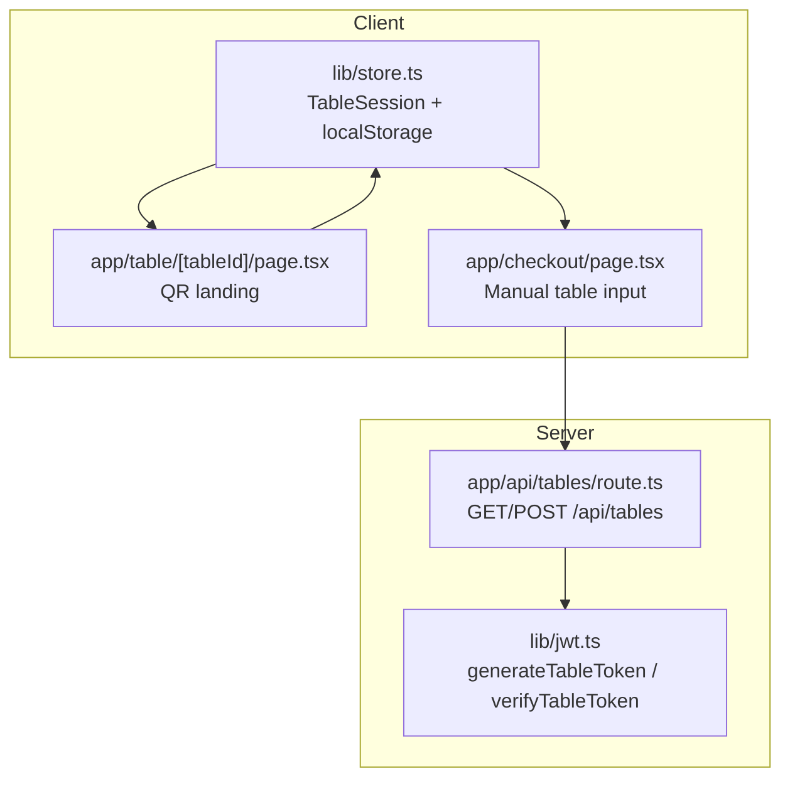
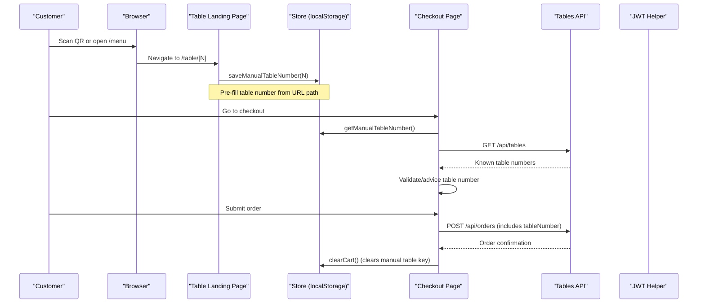
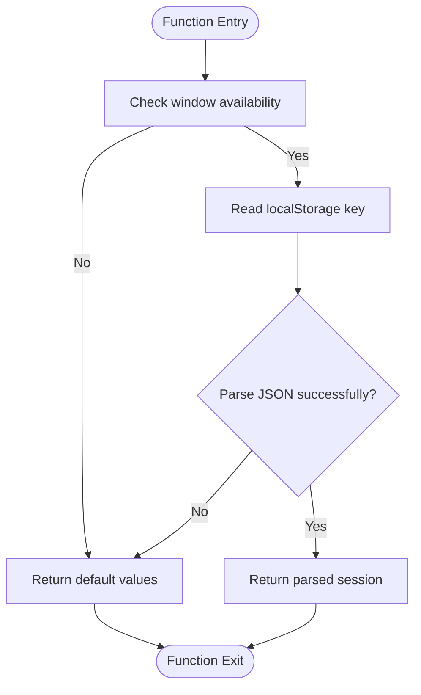
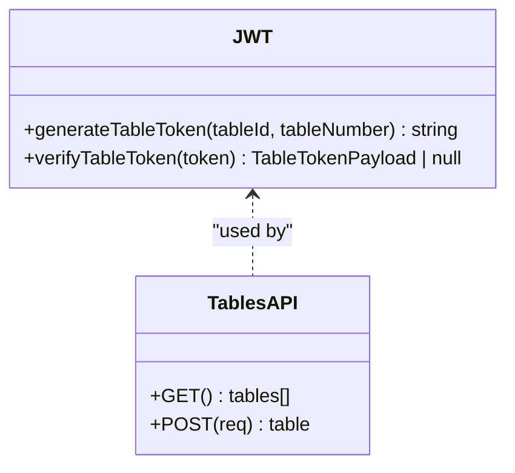
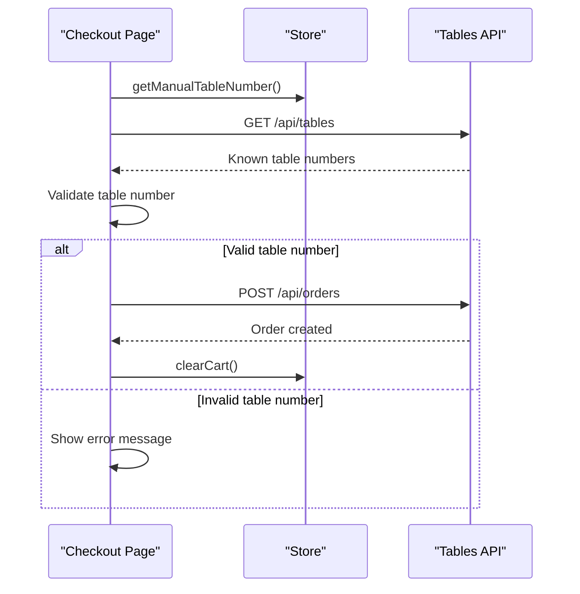
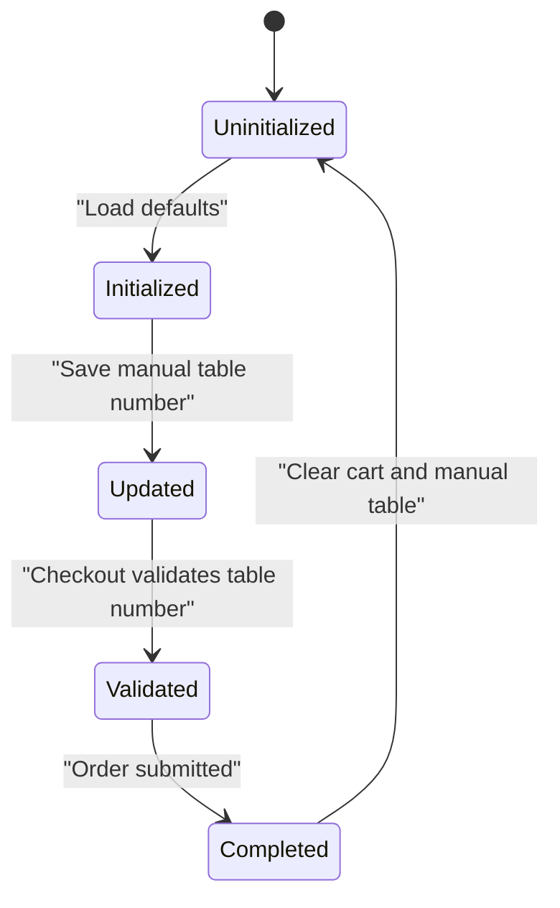
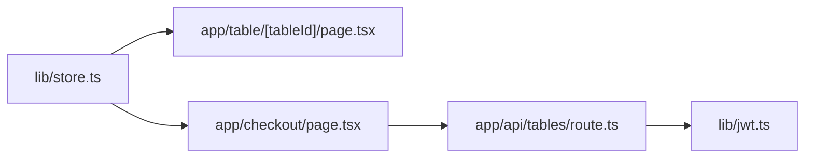

# Table Session Management

<cite>
**Referenced Files in This Document**
- [store.ts](file://lib/store.ts)
- [page.tsx (table landing)](file://app/table/[tableId]/page.tsx)
- [page.tsx (checkout)](file://app/checkout/page.tsx)
- [route.ts (tables API)](file://app/api/tables/route.ts)
- [jwt.ts](file://lib/jwt.ts)
</cite>

## Table of Contents
1. [Introduction](#introduction)
2. [Project Structure](#project-structure)
3. [Core Components](#core-components)
4. [Architecture Overview](#architecture-overview)
5. [Detailed Component Analysis](#detailed-component-analysis)
6. [Dependency Analysis](#dependency-analysis)
7. [Performance Considerations](#performance-considerations)
8. [Troubleshooting Guide](#troubleshooting-guide)
9. [Conclusion](#conclusion)

## Introduction
This document explains the table session management system used by the ordering application. It covers:
- The `TableSession` interface and how it represents a customer’s table context.
- QR code integration for generating and storing signed tokens per table.
- Manual table number entry at checkout, including validation and advisory feedback.
- Session lifecycle across page reloads using local storage.
- Integration with the ordering workflow so that orders are associated with the correct table.

The implementation uses a client-side store for persistence, a Next.js route for table entry, a checkout page for manual input, an API endpoint to manage tables and generate QR tokens, and a JWT helper for token signing and verification.

## Project Structure
The table session feature spans several files:
- Client-side state and persistence: `lib/store.ts`
- Table landing page (QR scan entry): `app/table/[tableId]/page.tsx`
- Checkout page (manual table input and order submission): `app/checkout/page.tsx`
- Tables API (list/create tables, generate QR tokens): `app/api/tables/route.ts`
- JWT utilities (generate/verify QR tokens): `lib/jwt.ts`

**Diagram sources**
- [store.ts:13-23](file://lib/store.ts#L13-L23)
- [page.tsx (table landing):1-31](file://app/table/[tableId]/page.tsx#L1-L31)
- [page.tsx (checkout):1-73](file://app/checkout/page.tsx#L1-L73)
- [route.ts (tables API):1-34](file://app/api/tables/route.ts#L1-L34)
- [jwt.ts:1-29](file://lib/jwt.ts#L1-L29)

**Section sources**
- [store.ts:13-23](file://lib/store.ts#L13-L23)
- [page.tsx (table landing):1-31](file://app/table/[tableId]/page.tsx#L1-L31)
- [page.tsx (checkout):1-73](file://app/checkout/page.tsx#L1-L73)
- [route.ts (tables API):1-34](file://app/api/tables/route.ts#L1-L34)
- [jwt.ts:1-29](file://lib/jwt.ts#L1-L29)

## Core Components
- `TableSession` interface: Represents the active table context with fields for `tableId`, `tableNumber`, and optional `qrToken`.
- Local storage keys: Separate keys persist the full table session and the manually entered table number.
- Event emitter: Notifies components when store data changes, enabling reactive UI updates.
- Persistence functions: Read/write helpers for table sessions and manual table numbers.

Key responsibilities:
- Provide default values when no session exists.
- Persist and retrieve table session and manual table number safely.
- Notify subscribers on changes to keep UI consistent.

**Section sources**
- [store.ts:13-23](file://lib/store.ts#L13-L23)
- [store.ts:25-41](file://lib/store.ts#L25-L41)
- [store.ts:180-216](file://lib/store.ts#L180-L216)

## Architecture Overview
The table session architecture combines client-side persistence with server-side table management and QR token generation.

**Diagram sources**
- [page.tsx (table landing):26-31](file://app/table/[tableId]/page.tsx#L26-L31)
- [page.tsx (checkout):50-73](file://app/checkout/page.tsx#L50-L73)
- [page.tsx (checkout):186-245](file://app/checkout/page.tsx#L186-L245)
- [route.ts (tables API):7-16](file://app/api/tables/route.ts#L7-L16)
- [route.ts (tables API):19-33](file://app/api/tables/route.ts#L19-L33)

## Detailed Component Analysis

### TableSession Interface and Persistence
The `TableSession` interface defines the shape of the active table context. It includes:
- `tableId`: Unique identifier for the table.
- `tableNumber`: Numeric table number.
- `qrToken`: Optional signed token generated for QR-based flows.

Persistence is handled via local storage:
- `getTableSession()` returns the current session or defaults to empty values.
- `saveTableSession(session)` persists the session and notifies listeners.
- Separate keys store the manual table number (`getManualTableNumber`, `saveManualTableNumber`).
- `clearCart()` clears cart, notes, and the manual table number after order completion.

**Diagram sources**
- [store.ts:180-188](file://lib/store.ts#L180-L188)

**Section sources**
- [store.ts:13-17](file://lib/store.ts#L13-L17)
- [store.ts:180-216](file://lib/store.ts#L180-L216)

### QR Code Integration
QR codes point to a shared URL pattern. The backend generates a signed token per table using JWT:
- `generateTableToken(tableId, tableNumber)` creates a token valid for a limited time.
- `verifyTableToken(token)` verifies and decodes the token payload.
- The tables API stores the generated token alongside the table record.

Note: The current table landing page does not enforce token validation; the table number is self-declared at checkout.

**Diagram sources**
- [jwt.ts:15-28](file://lib/jwt.ts#L15-L28)
- [route.ts (tables API):19-33](file://app/api/tables/route.ts#L19-L33)

**Section sources**
- [jwt.ts:1-29](file://lib/jwt.ts#L1-L29)
- [route.ts (tables API):19-33](file://app/api/tables/route.ts#L19-L33)

### Manual Table Number Entry
At checkout, customers can enter their table number manually:
- The checkout page reads the previously saved manual table number.
- It fetches known table numbers from the server to provide advisory feedback if the entered number is not registered.
- Validation ensures a positive integer is provided before submitting an order.
- On successful order creation, the manual table number is cleared along with the cart.

**Diagram sources**
- [page.tsx (checkout):50-73](file://app/checkout/page.tsx#L50-L73)
- [page.tsx (checkout):186-245](file://app/checkout/page.tsx#L186-L245)

**Section sources**
- [page.tsx (checkout):50-73](file://app/checkout/page.tsx#L50-L73)
- [page.tsx (checkout):186-245](file://app/checkout/page.tsx#L186-L245)

### Session Lifecycle
The lifecycle of a table session involves:
- Initialization: Default values are returned if no session exists.
- Update: When a user scans a QR code or enters a table number, the manual table number is persisted.
- Usage: Checkout reads the manual table number and validates it against known tables.
- Completion: After order submission, the manual table number is cleared to avoid cross-order contamination.

**Diagram sources**
- [store.ts:180-216](file://lib/store.ts#L180-L216)
- [page.tsx (checkout):186-245](file://app/checkout/page.tsx#L186-L245)

**Section sources**
- [store.ts:180-216](file://lib/store.ts#L180-L216)
- [page.tsx (checkout):186-245](file://app/checkout/page.tsx#L186-L245)

## Dependency Analysis
The table session feature has clear dependencies:
- Client components depend on the store for persistence and reactivity.
- The checkout page depends on the tables API to fetch known table numbers.
- The tables API depends on the JWT helper to generate tokens.
- The table landing page depends on the store to pre-fill the manual table number.

**Diagram sources**
- [store.ts:13-23](file://lib/store.ts#L13-L23)
- [page.tsx (table landing):1-31](file://app/table/[tableId]/page.tsx#L1-L31)
- [page.tsx (checkout):1-73](file://app/checkout/page.tsx#L1-L73)
- [route.ts (tables API):1-34](file://app/api/tables/route.ts#L1-L34)
- [jwt.ts:1-29](file://lib/jwt.ts#L1-L29)

**Section sources**
- [store.ts:13-23](file://lib/store.ts#L13-L23)
- [page.tsx (table landing):1-31](file://app/table/[tableId]/page.tsx#L1-L31)
- [page.tsx (checkout):1-73](file://app/checkout/page.tsx#L1-L73)
- [route.ts (tables API):1-34](file://app/api/tables/route.ts#L1-L34)
- [jwt.ts:1-29](file://lib/jwt.ts#L1-L29)

## Performance Considerations
- Local storage operations are synchronous and lightweight but should be used judiciously to avoid blocking UI updates.
- Fetching known table numbers occurs once during checkout initialization; consider caching this data if the list is large or frequently accessed.
- JWT token generation is server-side and fast; ensure environment variables are configured correctly to avoid runtime errors.

[No sources needed since this section provides general guidance]

## Troubleshooting Guide
Common issues and resolutions:
- **Table session not persisting**: Verify that local storage is available and not blocked by browser settings. Check that `saveTableSession` and `saveManualTableNumber` are called correctly.
- **Manual table number not pre-filled**: Ensure the table landing page calls `saveManualTableNumber` with the correct value extracted from the URL.
- **Validation errors at checkout**: Confirm that the table number is a positive integer and matches expected ranges. Advisory messages indicate unregistered table numbers.
- **QR token verification failures**: Ensure the JWT secret is configured and tokens are generated with the same secret.

**Section sources**
- [store.ts:180-216](file://lib/store.ts#L180-L216)
- [page.tsx (table landing):26-31](file://app/table/[tableId]/page.tsx#L26-L31)
- [page.tsx (checkout):186-245](file://app/checkout/page.tsx#L186-L245)
- [jwt.ts:1-29](file://lib/jwt.ts#L1-L29)

## Conclusion
The table session management system provides a robust foundation for associating orders with specific tables. It combines client-side persistence with server-side table management and QR token generation. The manual table number entry ensures flexibility for customers who may not scan QR codes, while validation and advisory feedback improve user experience. The modular design allows for easy extension and maintenance.

[No sources needed since this section summarizes without analyzing specific files]