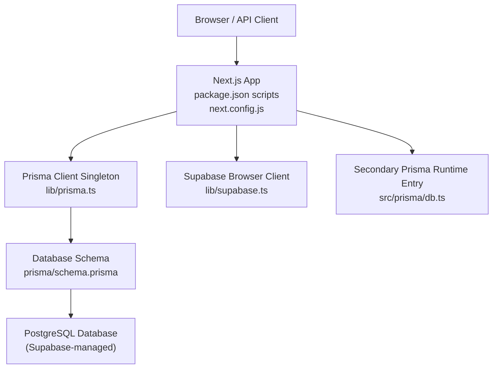
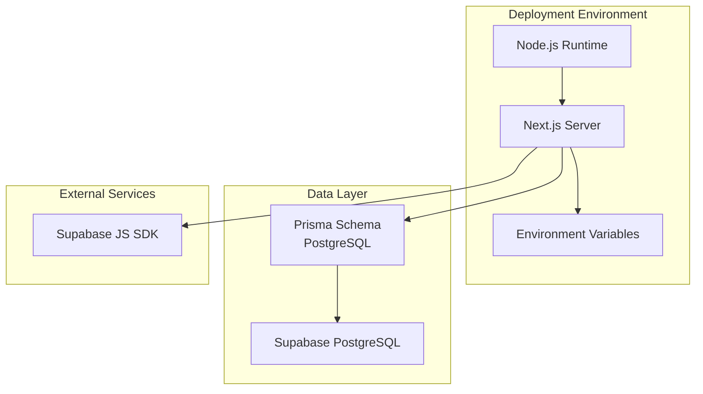
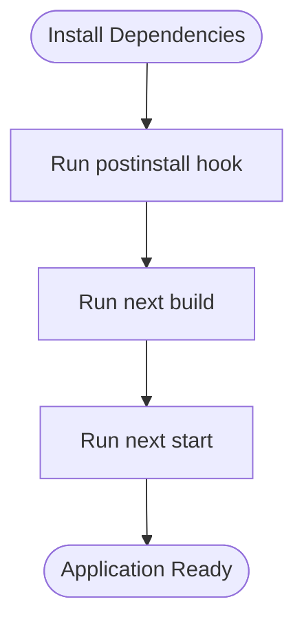
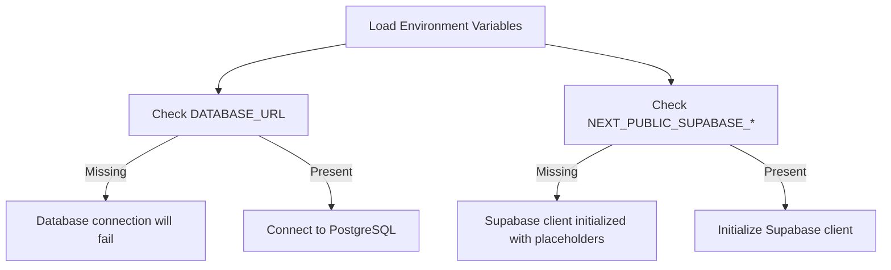
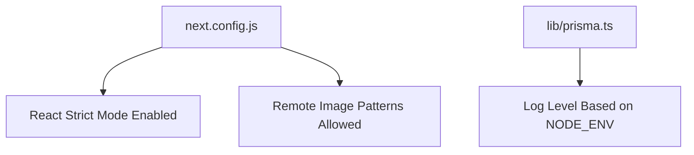
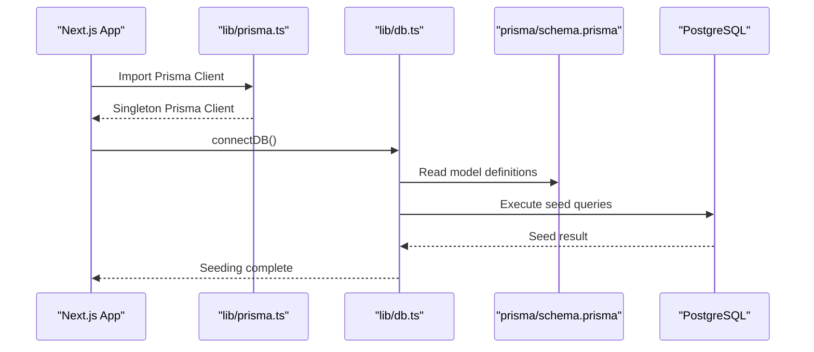
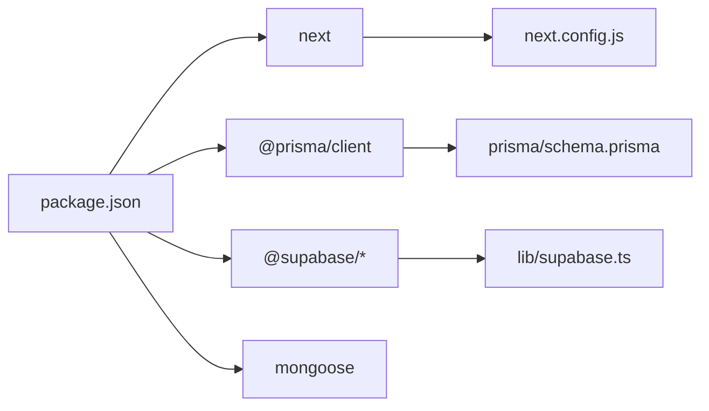

# Deployment Topology

<cite>
**Referenced Files in This Document**
- [package.json](file://package.json)
- [next.config.js](file://next.config.js)
- [prisma/schema.prisma](file://prisma/schema.prisma)
- [lib/prisma.ts](file://lib/prisma.ts)
- [lib/db.ts](file://lib/db.ts)
- [lib/supabase.ts](file://lib/supabase.ts)
- [src/prisma/db.ts](file://src/prisma/db.ts)
</cite>

## Table of Contents
1. [Introduction](#introduction)
2. [Project Structure](#project-structure)
3. [Core Components](#core-components)
4. [Architecture Overview](#architecture-overview)
5. [Detailed Component Analysis](#detailed-component-analysis)
6. [Dependency Analysis](#dependency-analysis)
7. [Performance Considerations](#performance-considerations)
8. [Troubleshooting Guide](#troubleshooting-guide)
9. [Conclusion](#conclusion)

## Introduction
This document describes the deployment topology and infrastructure configuration for the Warkop Betawa system. It focuses on how the Next.js application is built, how environment variables are managed, how database connectivity works, and what production considerations apply. The project uses:
- Next.js as the web framework
- Prisma with PostgreSQL (configured via Supabase) as the primary data layer
- Supabase client SDKs for browser-side interactions
- A secondary Prisma ORM runtime entry under `src/prisma` that reads `DATABASE_URL` from the environment

The repository does not include a `.env` file or explicit MongoDB connection code. Therefore, this document explains the existing PostgreSQL-based setup and clarifies where MongoDB-related dependencies exist without implying they are configured for production use.

## Project Structure
At a high level, the deployment-relevant parts of the repository are:
- Application build and runtime scripts live in `package.json`.
- Next.js runtime behavior is defined in `next.config.js`.
- Database schema and connection metadata are declared in `prisma/schema.prisma`.
- Application-level Prisma client initialization and seeding logic live in `lib/prisma.ts` and `lib/db.ts`.
- Supabase client configuration lives in `lib/supabase.ts`.
- A secondary Prisma ORM runtime entry exists in `src/prisma/db.ts`.

**Diagram sources**
- [package.json:6-11](file://package.json#L6-L11)
- [next.config.js:1-15](file://next.config.js#L1-L15)
- [lib/prisma.ts:1-40](file://lib/prisma.ts#L1-L40)
- [prisma/schema.prisma:1-10](file://prisma/schema.prisma#L1-L10)
- [lib/supabase.ts:1-22](file://lib/supabase.ts#L1-L22)
- [src/prisma/db.ts:1-10](file://src/prisma/db.ts#L1-L10)

**Section sources**
- [package.json:1-42](file://package.json#L1-L42)
- [next.config.js:1-15](file://next.config.js#L1-L15)
- [prisma/schema.prisma:1-107](file://prisma/schema.prisma#L1-L107)
- [lib/prisma.ts:1-40](file://lib/prisma.ts#L1-L40)
- [lib/db.ts:1-161](file://lib/db.ts#L1-L161)
- [lib/supabase.ts:1-22](file://lib/supabase.ts#L1-L22)
- [src/prisma/db.ts:1-10](file://src/prisma/db.ts#L1-L10)

## Core Components
This section summarizes the deployment-critical components and their responsibilities.

- Build and runtime scripts
  - Development server: `next dev`
  - Production build: `next build`
  - Production start: `next start`
  - Postinstall hook runs Prisma skills sync to keep generated artifacts in sync.

- Next.js configuration
  - React Strict Mode is enabled.
  - Remote image loading is allowed for HTTPS hosts.

- Database schema and provider
  - Prisma datasource points to PostgreSQL.
  - Connection URL and direct URL are read from environment variables.

- Application Prisma client
  - Provides a singleton Prisma Client instance.
  - Adjusts logging based on environment.
  - In development, logs query execution times.

- Database seeding and fallback store
  - Ensures initial data is present when the database is empty.
  - Provides an in-memory fallback store when no database connection is available.

- Supabase client
  - Initializes the Supabase browser client using environment variables.
  - Warns in development if required variables are missing.

- Secondary Prisma runtime entry
  - Loads environment variables and creates a Prisma ORM runtime instance using `DATABASE_URL`.

**Section sources**
- [package.json:6-11](file://package.json#L6-L11)
- [next.config.js:1-15](file://next.config.js#L1-L15)
- [prisma/schema.prisma:5-9](file://prisma/schema.prisma#L5-L9)
- [lib/prisma.ts:1-40](file://lib/prisma.ts#L1-L40)
- [lib/db.ts:1-161](file://lib/db.ts#L1-L161)
- [lib/supabase.ts:1-22](file://lib/supabase.ts#L1-L22)
- [src/prisma/db.ts:1-10](file://src/prisma/db.ts#L1-L10)

## Architecture Overview
The deployment architecture centers around a Next.js application running in a Node.js environment. The app connects to a PostgreSQL database through Prisma and optionally interacts with Supabase services from the browser.

**Diagram sources**
- [package.json:6-11](file://package.json#L6-L11)
- [next.config.js:1-15](file://next.config.js#L1-L15)
- [prisma/schema.prisma:5-9](file://prisma/schema.prisma#L5-L9)
- [lib/supabase.ts:1-22](file://lib/supabase.ts#L1-L22)

## Detailed Component Analysis

### Build Process Configuration
The build process is driven by Next.js scripts:
- `dev`: Starts the development server.
- `build`: Produces the production build.
- `start`: Runs the production server.
- `postinstall`: Runs Prisma skills synchronization after dependency installation.

Production optimization notes derived from the repository:
- React Strict Mode is enabled.
- Remote images are allowed over HTTPS.
- No custom output directory or standalone output mode is configured in `next.config.js`.

**Diagram sources**
- [package.json:6-11](file://package.json#L6-L11)
- [next.config.js:1-15](file://next.config.js#L1-L15)

**Section sources**
- [package.json:6-11](file://package.json#L6-L11)
- [next.config.js:1-15](file://next.config.js#L1-L15)

### Environment Variable Management
Environment variables are used in several places:

- Database connection
  - `DATABASE_URL` is required by both the Prisma schema and the secondary runtime entry.
  - `DIRECT_URL` is referenced in the Prisma schema.

- Supabase client
  - `NEXT_PUBLIC_SUPABASE_URL`
  - `NEXT_PUBLIC_SUPABASE_ANON_KEY`

- Logging and behavior
  - `NODE_ENV` controls Prisma logging verbosity.

Recommended environment variable set for production:
- `DATABASE_URL`: PostgreSQL connection string for Prisma.
- `DIRECT_URL`: Direct database URL for Prisma operations.
- `NEXT_PUBLIC_SUPABASE_URL`: Public Supabase project URL.
- `NEXT_PUBLIC_SUPABASE_ANON_KEY`: Public anonymous key for Supabase.
- `NODE_ENV`: Set to `production` in production environments.

**Diagram sources**
- [prisma/schema.prisma:5-9](file://prisma/schema.prisma#L5-L9)
- [src/prisma/db.ts:1-10](file://src/prisma/db.ts#L1-L10)
- [lib/supabase.ts:1-22](file://lib/supabase.ts#L1-L22)
- [lib/prisma.ts:17-24](file://lib/prisma.ts#L17-L24)

**Section sources**
- [prisma/schema.prisma:5-9](file://prisma/schema.prisma#L5-L9)
- [src/prisma/db.ts:1-10](file://src/prisma/db.ts#L1-L10)
- [lib/supabase.ts:1-22](file://lib/supabase.ts#L1-L22)
- [lib/prisma.ts:17-24](file://lib/prisma.ts#L17-L24)

### Production Optimization Settings
Current production optimizations visible in the repository:
- React Strict Mode is enabled.
- Remote image patterns allow HTTPS hosts.
- Prisma client logging is reduced to errors in non-development environments.

Areas that may need attention for hardened production deployments:
- No explicit Next.js standalone output configuration is present.
- No custom health check endpoints are defined in the provided files.
- No CDN or caching headers are configured in `next.config.js`.

**Diagram sources**
- [next.config.js:1-15](file://next.config.js#L1-L15)
- [lib/prisma.ts:17-24](file://lib/prisma.ts#L17-L24)

**Section sources**
- [next.config.js:1-15](file://next.config.js#L1-L15)
- [lib/prisma.ts:17-24](file://lib/prisma.ts#L17-L24)

### Hosting Requirements for Next.js Applications
Based on the repository:
- The application uses Next.js with Node.js runtime scripts (`dev`, `build`, `start`).
- The runtime depends on environment variables being present at boot time.
- The Prisma client requires a valid PostgreSQL connection string.

Hosting requirements:
- A Node.js-compatible hosting platform that supports Next.js applications.
- Environment variables must be configured before starting the application.
- Outbound network access must be allowed to reach the PostgreSQL database and Supabase services.

[No sources needed since this section provides general guidance]

### Database Connectivity for PostgreSQL
The application uses Prisma with PostgreSQL:
- The datasource provider is PostgreSQL.
- `DATABASE_URL` and `DIRECT_URL` are read from environment variables.
- The application initializes a Prisma Client singleton and performs seeding on first run.

**Diagram sources**
- [lib/prisma.ts:1-40](file://lib/prisma.ts#L1-L40)
- [lib/db.ts:32-50](file://lib/db.ts#L32-L50)
- [prisma/schema.prisma:11-106](file://prisma/schema.prisma#L11-L106)

**Section sources**
- [prisma/schema.prisma:5-106](file://prisma/schema.prisma#L5-L106)
- [lib/prisma.ts:1-40](file://lib/prisma.ts#L1-L40)
- [lib/db.ts:32-50](file://lib/db.ts#L32-L50)

### MongoDB Considerations
The repository includes Mongoose as a dependency but does not contain MongoDB connection configuration or usage in the analyzed files. The active data layer is PostgreSQL via Prisma. If MongoDB is intended for future use:
- Add environment variables such as `MONGODB_URI`.
- Create a dedicated module for MongoDB connection management.
- Avoid mixing unmanaged MongoDB state with Prisma-managed PostgreSQL state unless clearly separated.

[No sources needed since this section provides general guidance]

### Scaling Considerations
Scaling considerations derived from the current codebase:
- Use a managed PostgreSQL service with connection pooling.
- Ensure environment variables are injected securely at runtime.
- Monitor database query performance; Prisma logs can help in development.
- Consider horizontal scaling of Next.js instances behind a load balancer if traffic grows.

[No sources needed since this section provides general guidance]

### Deployment Strategies
Recommended strategies based on the repository’s structure:
- CI/CD pipeline should:
  - Install dependencies.
  - Run `next build`.
  - Deploy the built artifact.
  - Inject environment variables into the runtime.
- Keep database migrations separate from application deployments when possible.
- Use health checks to verify readiness before routing traffic.

[No sources needed since this section provides general guidance]

### Monitoring Setup
Current monitoring hooks:
- Prisma client logs errors in production and detailed query information in development.
- Database seeding logs success or failure messages.

Recommended additions:
- Centralized logging for application events.
- Metrics collection for request latency and error rates.
- Database connection pool metrics.

**Section sources**
- [lib/prisma.ts:17-36](file://lib/prisma.ts#L17-L36)
- [lib/db.ts:43-49](file://lib/db.ts#L43-L49)

### Maintenance Procedures
Maintenance tasks implied by the codebase:
- Seed initial data on first run or when the database is empty.
- Update Prisma schema and regenerate clients when models change.
- Rotate Supabase keys and database credentials through environment variables.
- Review and adjust Prisma logging levels per environment.

**Section sources**
- [lib/db.ts:92-159](file://lib/db.ts#L92-L159)
- [lib/prisma.ts:17-36](file://lib/prisma.ts#L17-L36)

## Dependency Analysis
The deployment-related dependencies are:
- Next.js for application runtime and build.
- Prisma Client for PostgreSQL access.
- Supabase SDKs for browser-side interactions.
- Mongoose as a dependency, though not configured for MongoDB in the analyzed files.

**Diagram sources**
- [package.json:13-28](file://package.json#L13-L28)
- [next.config.js:1-15](file://next.config.js#L1-L15)
- [prisma/schema.prisma:5-9](file://prisma/schema.prisma#L5-L9)
- [lib/supabase.ts:1-22](file://lib/supabase.ts#L1-L22)

**Section sources**
- [package.json:13-28](file://package.json#L13-L28)

## Performance Considerations
- Enable production logging only for errors to reduce overhead.
- Use connection pooling through the managed PostgreSQL provider.
- Cache static assets and leverage CDN capabilities provided by the hosting platform.
- Avoid heavy synchronous operations during request handling.

[No sources needed since this section provides general guidance]

## Troubleshooting Guide
Common issues and where to look:
- Missing database connection
  - Verify `DATABASE_URL` is set.
  - Confirm PostgreSQL is reachable from the deployment environment.
- Supabase client warnings
  - Ensure `NEXT_PUBLIC_SUPABASE_URL` and `NEXT_PUBLIC_SUPABASE_ANON_KEY` are set.
- Seeding failures
  - Check database permissions and schema state.
  - Review seeding logs in the application output.

**Section sources**
- [lib/supabase.ts:3-12](file://lib/supabase.ts#L3-L12)
- [lib/db.ts:43-49](file://lib/db.ts#L43-L49)

## Conclusion
Warkop Betawa is a Next.js application backed by PostgreSQL through Prisma, with Supabase client integration for browser-side features. Production deployment relies on correct environment variable configuration, a healthy PostgreSQL connection, and proper Next.js build and start procedures. MongoDB is present as a dependency but is not configured in the analyzed files. For robust production operations, focus on secure environment management, observability, and scalable database hosting.