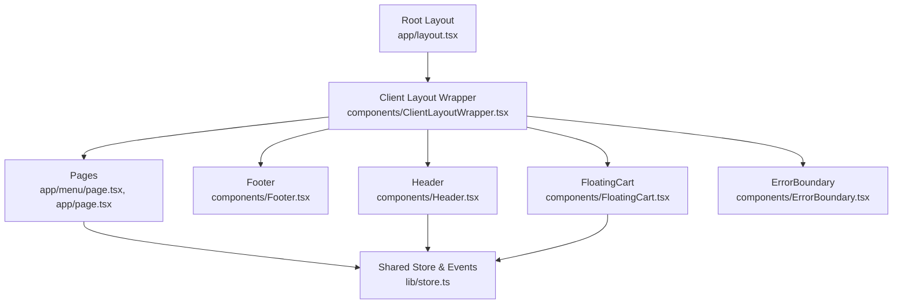
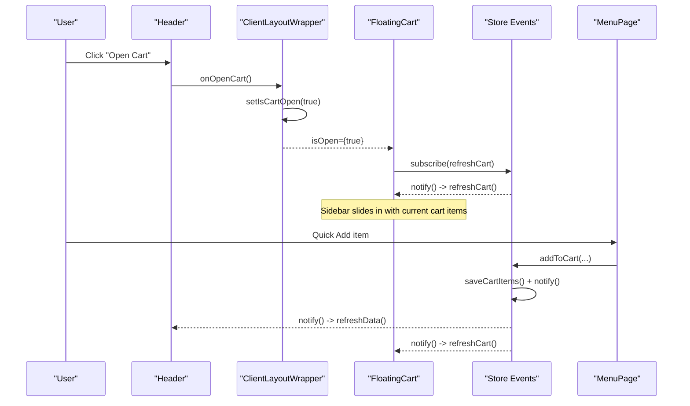
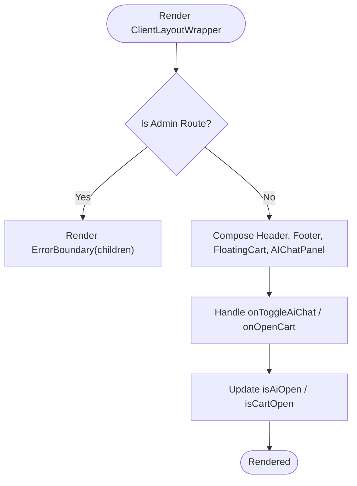
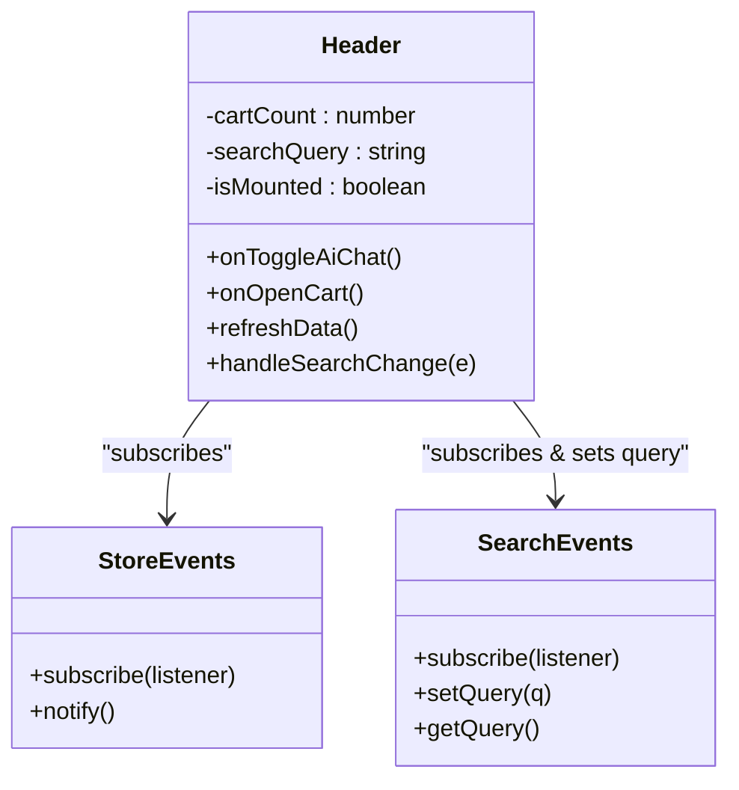
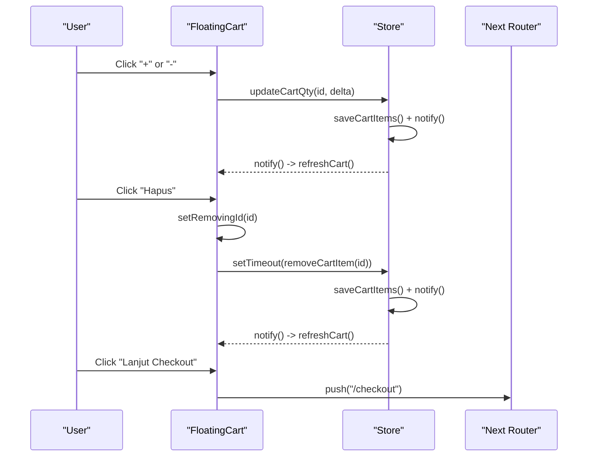
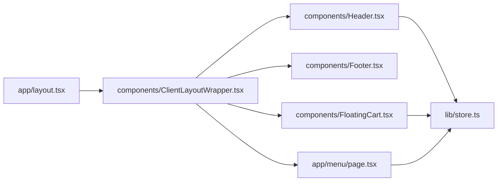

# Component System

<cite>
**Referenced Files in This Document**
- [layout.tsx](file://app/layout.tsx)
- [ClientLayoutWrapper.tsx](file://components/ClientLayoutWrapper.tsx)
- [Header.tsx](file://components/Header.tsx)
- [FloatingCart.tsx](file://components/FloatingCart.tsx)
- [Footer.tsx](file://components/Footer.tsx)
- [ErrorBoundary.tsx](file://components/ErrorBoundary.tsx)
- [page.tsx](file://app/page.tsx)
- [menu/page.tsx](file://app/menu/page.tsx)
- [store.ts](file://lib/store.ts)
- [tailwind.config.ts](file://tailwind.config.ts)
</cite>

## Table of Contents
1. [Introduction](#introduction)
2. [Project Structure](#project-structure)
3. [Core Components](#core-components)
4. [Architecture Overview](#architecture-overview)
5. [Detailed Component Analysis](#detailed-component-analysis)
6. [Dependency Analysis](#dependency-analysis)
7. [Performance Considerations](#performance-considerations)
8. [Troubleshooting Guide](#troubleshooting-guide)
9. [Conclusion](#conclusion)

## Introduction
This document explains the React component system architecture for the Warkop Betawa application. It focuses on the client-side layout, reusable UI components such as Header, FloatingCart, and Footer, their props and interfaces, event handling between parent and child components, state management patterns, styling with Tailwind CSS, lifecycle considerations, error boundaries, and accessibility practices.

The app uses Next.js App Router with a root server layout that delegates to a client layout wrapper. The wrapper composes global UI (Header, Footer, AI chat panel, FloatingCart) and wraps page content with an ErrorBoundary. Shared cart state is persisted in localStorage and synchronized across components via a lightweight event emitter.

## Project Structure
At a high level:
- Root layout defines metadata, viewport, and mounts the client layout wrapper.
- Client layout wrapper manages global UI state (AI chat visibility, cart drawer visibility), renders Header, Footer, FloatingCart, and AIChatPanel, and wraps page content with ErrorBoundary.
- Page-level components like MenuPage compose business logic, local state, and interact with shared store events.
- Reusable components are located under components/.
- Shared state and utilities live under lib/.

**Diagram sources**
- [layout.tsx:15-23](file://app/layout.tsx#L15-L23)
- [ClientLayoutWrapper.tsx:11-44](file://components/ClientLayoutWrapper.tsx#L11-L44)
- [Header.tsx:1-121](file://components/Header.tsx#L1-L121)
- [FloatingCart.tsx:1-326](file://components/FloatingCart.tsx#L1-L326)
- [Footer.tsx:1-74](file://components/Footer.tsx#L1-L74)
- [ErrorBoundary.tsx:1-60](file://components/ErrorBoundary.tsx#L1-L60)
- [menu/page.tsx:1-320](file://app/menu/page.tsx#L1-L320)
- [store.ts:1-217](file://lib/store.ts#L1-L217)

**Section sources**
- [layout.tsx:1-24](file://app/layout.tsx#L1-L24)
- [ClientLayoutWrapper.tsx:1-45](file://components/ClientLayoutWrapper.tsx#L1-L45)
- [page.tsx:1-6](file://app/page.tsx#L1-L6)

## Core Components
- Root Layout: Provides metadata, viewport settings, and mounts the client layout wrapper.
- Client Layout Wrapper: Manages global UI state, composes Header, Footer, FloatingCart, and AIChatPanel, and wraps pages with ErrorBoundary.
- Header: Displays brand, navigation links, search input, AI assistant toggle, and cart icon with badge. Subscribes to store events to reflect cart count and search query.
- FloatingCart: A slide-in sidebar showing cart items, quantity controls, removal animations, totals, and checkout CTA. Subscribes to store events to stay in sync.
- Footer: Static informational footer with links and branding.
- ErrorBoundary: Class-based React error boundary that catches render errors and shows a recovery UI.

Key responsibilities:
- Global UI composition and state (wrapper).
- Cross-component synchronization via store events (Header, FloatingCart, MenuPage).
- Persistent cart state in localStorage with strict validation.
- Accessibility attributes for interactive elements.
- Styling through Tailwind utility classes and theme extensions.

**Section sources**
- [layout.tsx:15-23](file://app/layout.tsx#L15-L23)
- [ClientLayoutWrapper.tsx:11-44](file://components/ClientLayoutWrapper.tsx#L11-L44)
- [Header.tsx:8-121](file://components/Header.tsx#L8-L121)
- [FloatingCart.tsx:16-326](file://components/FloatingCart.tsx#L16-L326)
- [Footer.tsx:4-74](file://components/Footer.tsx#L4-L74)
- [ErrorBoundary.tsx:14-59](file://components/ErrorBoundary.tsx#L14-L59)
- [store.ts:26-65](file://lib/store.ts#L26-L65)
- [store.ts:67-217](file://lib/store.ts#L67-L217)

## Architecture Overview
The component architecture follows a clear separation:
- Layout layer: Root layout and client wrapper orchestrate global UI and error handling.
- Presentation layer: Header, Footer, FloatingCart provide reusable UI.
- Page layer: MenuPage handles menu display, filtering, and quick-add interactions.
- State layer: lib/store.ts provides cart operations, table session helpers, and event emitters for reactive updates.

**Diagram sources**
- [Header.tsx:13-39](file://components/Header.tsx#L13-L39)
- [ClientLayoutWrapper.tsx:11-44](file://components/ClientLayoutWrapper.tsx#L11-L44)
- [FloatingCart.tsx:22-46](file://components/FloatingCart.tsx#L22-L46)
- [store.ts:93-138](file://lib/store.ts#L93-L138)
- [menu/page.tsx:71-82](file://app/menu/page.tsx#L71-L82)

## Detailed Component Analysis

### Client Layout Wrapper
Responsibilities:
- Manage global UI state: AI chat open/close, cart drawer open/close, mount guard.
- Detect admin routes and bypass public UI.
- Compose Header, Footer, FloatingCart, and AIChatPanel.
- Wrap page content with ErrorBoundary.

Props:
- children: React.ReactNode

State:
- isAiOpen: boolean
- isCartOpen: boolean
- isMounted: boolean

Effects:
- Sets isMounted after first render.
- Uses usePathname to conditionally hide public UI for admin routes.

Event Handling:
- Passes callbacks to Header for toggling AI chat and opening cart.
- Controls FloatingCart visibility based on isCartOpen.

Accessibility:
- Wraps page content with ErrorBoundary for resilience.

Styling:
- Uses Tailwind classes for layout and spacing.

**Diagram sources**
- [ClientLayoutWrapper.tsx:11-44](file://components/ClientLayoutWrapper.tsx#L11-L44)

**Section sources**
- [ClientLayoutWrapper.tsx:1-45](file://components/ClientLayoutWrapper.tsx#L1-L45)

### Header
Props:
- onToggleAiChat?: () => void
- onOpenCart?: () => void

State:
- cartCount: number
- searchQuery: string
- isMounted: boolean

Lifecycle:
- On mount, sets isMounted, loads initial cart count, subscribes to storeEvents and searchEvents.
- Cleanup unsubscribes from both event emitters.

Event Handling:
- handleSearchChange updates local searchQuery and pushes to searchEvents.setQuery.
- onToggleAiChat and onOpenCart are forwarded to parent wrapper.

Accessibility:
- Buttons include aria-labels for screen readers.
- Title attribute for AI assistant button.

Styling:
- Sticky header with Tailwind utilities and brand colors.
- Responsive layout using flexbox and breakpoints.

**Diagram sources**
- [Header.tsx:8-39](file://components/Header.tsx#L8-L39)
- [store.ts:26-65](file://lib/store.ts#L26-L65)

**Section sources**
- [Header.tsx:1-121](file://components/Header.tsx#L1-L121)
- [store.ts:26-65](file://lib/store.ts#L26-L65)

### FloatingCart
Props:
- isOpen: boolean
- onClose: () => void

State:
- items: CartItem[]
- isMounted: boolean
- removingId: string | null
- tableNumber: number

Lifecycle:
- On mount, loads cart items and manual table number, subscribes to storeEvents.
- Adds keyboard listener to close on Escape when open.

Event Handling:
- handleQtyChange calls updateCartQty(id, delta).
- handleRemove delays removal for animation, then calls removeCartItem.
- Checkout button closes drawer and navigates to /checkout.

Accessibility:
- Drawer has role="dialog", aria-modal="false", aria-label.
- Buttons have descriptive aria-labels.

Styling:
- Slide-in sidebar with transform transitions.
- Gradient header, badges, and responsive widths.

**Diagram sources**
- [FloatingCart.tsx:22-58](file://components/FloatingCart.tsx#L22-L58)
- [FloatingCart.tsx:304-312](file://components/FloatingCart.tsx#L304-L312)
- [store.ts:140-160](file://lib/store.ts#L140-L160)

**Section sources**
- [FloatingCart.tsx:1-326](file://components/FloatingCart.tsx#L1-L326)
- [store.ts:140-160](file://lib/store.ts#L140-L160)

### Footer
Responsibilities:
- Display brand info, services, contact links, and admin portal link.
- Use semantic HTML structure and accessible links.

Props:
- None

Styling:
- Dark background with Tailwind utilities and brand colors.
- Grid layout for columns and responsive spacing.

**Section sources**
- [Footer.tsx:1-74](file://components/Footer.tsx#L1-L74)

### ErrorBoundary
Responsibilities:
- Catch rendering errors within wrapped components.
- Provide a user-friendly fallback UI with a recovery action.

Implementation:
- Class component with getDerivedStateFromError and componentDidCatch.
- Recovery button clears problematic localStorage key and redirects to /menu.

Accessibility:
- Fallback UI includes readable text and a clear call-to-action.

**Section sources**
- [ErrorBoundary.tsx:1-60](file://components/ErrorBoundary.tsx#L1-L60)

### MenuPage Integration
Responsibilities:
- Fetch menu data from API or fall back to static data.
- Maintain local state for categories, search, and cart synchronization.
- Provide quick-add functionality and visual feedback.

State:
- categories, menuItems, selectedCategory, searchQuery, cartItems, isMounted, justAddedId.

Lifecycle:
- useEffect fetches menu data and initializes mounted state.
- Subscribes to storeEvents and searchEvents to keep UI in sync.

Event Handling:
- handleQuickAdd adds item to cart with default spice level if available.
- Derived values computed with useMemo for performance.

Styling:
- Hero banner, circular category filters, responsive grid, mobile bottom cart bar.

**Section sources**
- [menu/page.tsx:1-320](file://app/menu/page.tsx#L1-L320)
- [store.ts:93-138](file://lib/store.ts#L93-L138)

## Dependency Analysis
Component relationships and dependencies:
- ClientLayoutWrapper depends on Header, Footer, FloatingCart, AIChatPanel, and ErrorBoundary.
- Header and FloatingCart depend on lib/store.ts for cart state and events.
- MenuPage depends on lib/store.ts for cart operations and events.
- Root layout depends on ClientLayoutWrapper.

**Diagram sources**
- [layout.tsx:15-23](file://app/layout.tsx#L15-L23)
- [ClientLayoutWrapper.tsx:11-44](file://components/ClientLayoutWrapper.tsx#L11-L44)
- [Header.tsx:1-121](file://components/Header.tsx#L1-L121)
- [FloatingCart.tsx:1-326](file://components/FloatingCart.tsx#L1-L326)
- [menu/page.tsx:1-320](file://app/menu/page.tsx#L1-L320)
- [store.ts:1-217](file://lib/store.ts#L1-L217)

**Section sources**
- [layout.tsx:1-24](file://app/layout.tsx#L1-L24)
- [ClientLayoutWrapper.tsx:1-45](file://components/ClientLayoutWrapper.tsx#L1-L45)
- [store.ts:1-217](file://lib/store.ts#L1-L217)

## Performance Considerations
- Event-driven updates: Components subscribe to storeEvents/searchEvents to avoid prop drilling and reduce unnecessary re-renders.
- Memoization: MenuPage uses useMemo for derived cart values to minimize recalculations.
- Mount guards: isMounted flags prevent hydration mismatches and ensure safe DOM access.
- Lightweight event emitters: StoreEvents and SearchEvents are simple and efficient for cross-component communication.
- Image optimization: MenuPage uses next/image for optimized image loading.

Recommendations:
- Consider debouncing search input updates to reduce event spam.
- Use React.memo for pure presentational components if they receive stable props.
- Keep store operations minimal and batched where possible.

[No sources needed since this section provides general guidance]

## Troubleshooting Guide
Common issues and resolutions:
- Cart not updating: Ensure components subscribe to storeEvents and that store.saveCartItems is called after mutations.
- Hydration mismatch: Verify isMounted guards around client-only logic and avoid accessing window during SSR.
- Error boundary triggered: Check console logs in componentDidCatch; the fallback UI offers a recovery action to reset cart and navigate to /menu.
- Keyboard accessibility: FloatingCart supports Escape to close; ensure focus management is considered for modal-like behavior.

**Section sources**
- [ErrorBoundary.tsx:23-59](file://components/ErrorBoundary.tsx#L23-L59)
- [FloatingCart.tsx:41-46](file://components/FloatingCart.tsx#L41-L46)
- [store.ts:93-138](file://lib/store.ts#L93-L138)

## Conclusion
The Warkop Betawa component system emphasizes clean composition, event-driven state synchronization, and accessible, responsive UI. The client layout wrapper orchestrates global UI, while Header, FloatingCart, and Footer provide reusable building blocks. Shared state is managed through a lightweight event emitter backed by localStorage, ensuring consistency across components. Error boundaries protect the UI from runtime failures, and Tailwind CSS enables consistent styling with a cohesive design system.

[No sources needed since this section summarizes without analyzing specific files]