# Frontend Architecture

<cite>
**Referenced Files in This Document**
- [README.md](file://README.md)
- [next.config.js](file://next.config.js)
- [tailwind.config.ts](file://tailwind.config.ts)
- [app/layout.tsx](file://app/layout.tsx)
- [app/admin/layout.tsx](file://app/admin/layout.tsx)
- [components/ClientLayoutWrapper.tsx](file://components/ClientLayoutWrapper.tsx)
- [components/Header.tsx](file://components/Header.tsx)
- [components/FloatingCart.tsx](file://components/FloatingCart.tsx)
- [lib/store.ts](file://lib/store.ts)
- [app/page.tsx](file://app/page.tsx)
- [app/menu/page.tsx](file://app/menu/page.tsx)
- [app/cart/page.tsx](file://app/cart/page.tsx)
- [app/checkout/page.tsx](file://app/checkout/page.tsx)
- [app/admin/page.tsx](file://app/admin/page.tsx)
</cite>

## Table of Contents
1. [Introduction](#introduction)
2. [Project Structure](#project-structure)
3. [Core Components](#core-components)
4. [Architecture Overview](#architecture-overview)
5. [Detailed Component Analysis](#detailed-component-analysis)
6. [Dependency Analysis](#dependency-analysis)
7. [Performance Considerations](#performance-considerations)
8. [Troubleshooting Guide](#troubleshooting-guide)
9. [Conclusion](#conclusion)

## Introduction
This document explains the frontend architecture of the Warkop Betawa system, a Next.js 14 restaurant ordering application with a MongoDB backend. It focuses on:

- App Router structure and server-side rendering boundaries
- Separation between customer-facing pages and the admin dashboard
- Client component patterns for cart state, search, and checkout flows
- Local storage-based cart persistence and event-driven communication
- Responsive design using Tailwind CSS
- Performance techniques such as code splitting, lazy loading, and image optimization

The project’s README describes the routes, API endpoints, data model decisions, and admin panel behavior, which this document maps to the actual frontend implementation.

**Section sources**
- [README.md:53-104](file://README.md#L53-L104)

## Project Structure
The frontend follows the Next.js App Router layout:

- Root layout defines metadata, viewport, global styles, and wraps all routes with a client-side layout wrapper.
- Customer-facing routes live under `app/`:
  - `/` redirects to the menu page.
  - `/menu`, `/menu/[itemId]`, `/cart`, `/checkout`, `/order/[orderId]`, `/promo`, `/table/[tableId]`, `/tentang`.
- Admin dashboard lives under `app/admin/` with its own layout that excludes public header/footer/AI chat.
- Shared UI components live under `components/`.
- State and persistence logic live under `lib/store.ts`.
- Styling is configured through Tailwind CSS.

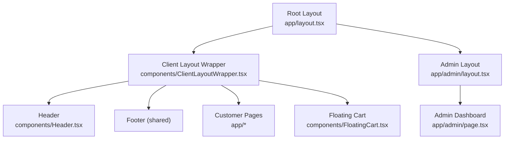

**Diagram sources**
- [app/layout.tsx:1-24](file://app/layout.tsx#L1-L24)
- [components/ClientLayoutWrapper.tsx:1-45](file://components/ClientLayoutWrapper.tsx#L1-L45)
- [app/admin/layout.tsx:1-12](file://app/admin/layout.tsx#L1-L12)

**Section sources**
- [app/layout.tsx:1-24](file://app/layout.tsx#L1-L24)
- [app/admin/layout.tsx:1-12](file://app/admin/layout.tsx#L1-L12)
- [components/ClientLayoutWrapper.tsx:1-45](file://components/ClientLayoutWrapper.tsx#L1-L45)
- [tailwind.config.ts:1-45](file://tailwind.config.ts#L1-L45)

## Core Components
The core frontend building blocks are:

- **Root Layout**: Defines site-wide metadata, viewport settings, and global body classes. It injects `ClientLayoutWrapper` to manage shared UI for non-admin routes.
- **Client Layout Wrapper**: A client component that conditionally renders the public header, footer, AI chat panel, and floating cart based on the current route. It also wraps content in an error boundary.
- **Header**: Displays branding, navigation links, search input, AI assistant toggle, and cart icon with a live badge count. It subscribes to store events to stay in sync with cart changes.
- **Floating Cart**: A slide-in sidebar showing cart items, quantity controls, subtotal, and checkout navigation. It reads from local storage via the store module and updates reactively.
- **Store Module**: Implements cart persistence in `localStorage`, order notes, manual table number, and simple event emitters for cross-component synchronization.

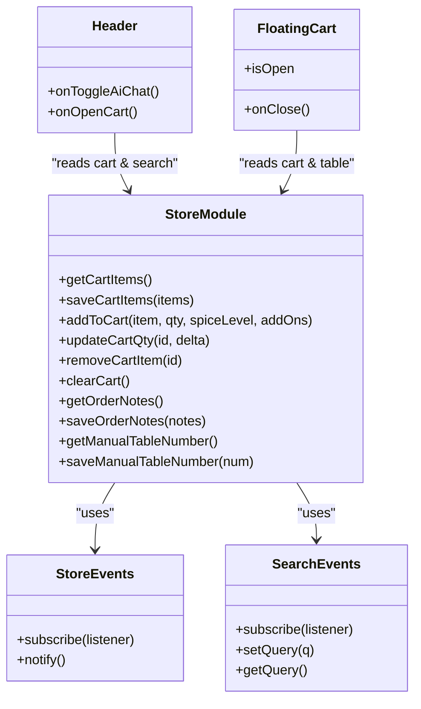

**Diagram sources**
- [lib/store.ts:25-65](file://lib/store.ts#L25-L65)
- [lib/store.ts:67-217](file://lib/store.ts#L67-L217)
- [components/Header.tsx:1-121](file://components/Header.tsx#L1-L121)
- [components/FloatingCart.tsx:1-326](file://components/FloatingCart.tsx#L1-L326)

**Section sources**
- [app/layout.tsx:1-24](file://app/layout.tsx#L1-L24)
- [components/ClientLayoutWrapper.tsx:1-45](file://components/ClientLayoutWrapper.tsx#L1-L45)
- [components/Header.tsx:1-121](file://components/Header.tsx#L1-L121)
- [components/FloatingCart.tsx:1-326](file://components/FloatingCart.tsx#L1-L326)
- [lib/store.ts:1-217](file://lib/store.ts#L1-L217)

## Architecture Overview
The frontend uses Next.js App Router with:

- Server-rendered root layout and static metadata.
- Client components for interactive features like cart, search, and checkout.
- Route-based separation between customer experience and admin dashboard.
- Event-driven state synchronization across components using a lightweight emitter pattern.
- Local storage as the source of truth for cart persistence and session-related values.

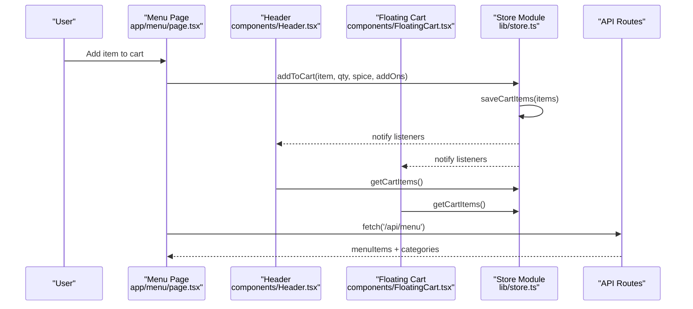

**Diagram sources**
- [app/menu/page.tsx:1-320](file://app/menu/page.tsx#L1-L320)
- [components/Header.tsx:1-121](file://components/Header.tsx#L1-L121)
- [components/FloatingCart.tsx:1-326](file://components/FloatingCart.tsx#L1-L326)
- [lib/store.ts:67-138](file://lib/store.ts#L67-L138)

## Detailed Component Analysis

### Root Layout and Client Layout Wrapper
The root layout sets up global metadata and viewport, then delegates shared UI concerns to `ClientLayoutWrapper`. The wrapper:

- Detects admin routes and bypasses public header/footer/AI chat.
- Renders the public header and footer for customer routes.
- Conditionally mounts AI chat and floating cart after mount to avoid hydration mismatches.
- Wraps page content in an error boundary.

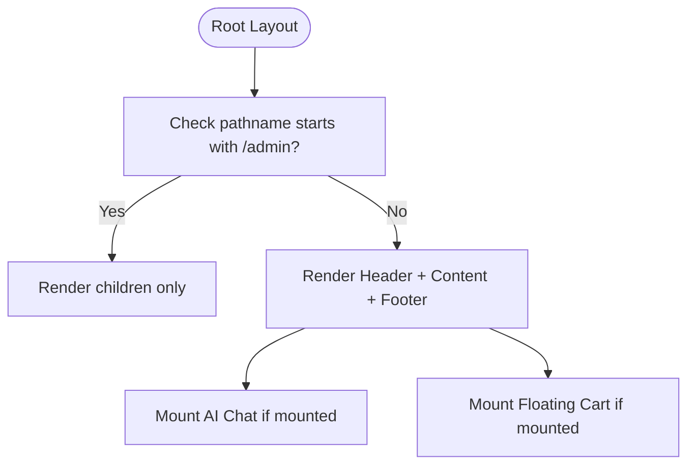

**Diagram sources**
- [app/layout.tsx:1-24](file://app/layout.tsx#L1-L24)
- [components/ClientLayoutWrapper.tsx:1-45](file://components/ClientLayoutWrapper.tsx#L1-L45)

**Section sources**
- [app/layout.tsx:1-24](file://app/layout.tsx#L1-L24)
- [components/ClientLayoutWrapper.tsx:1-45](file://components/ClientLayoutWrapper.tsx#L1-L45)

### Header and Search Integration
The header:

- Shows brand logo, navigation links, and a search input.
- Subscribes to search events to reflect the current query.
- Subscribes to store events to update the cart badge count.
- Provides callbacks to open the floating cart and toggle AI chat.

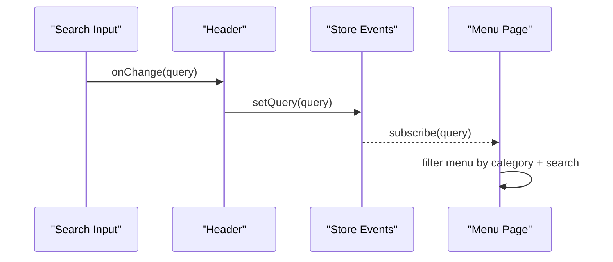

**Diagram sources**
- [components/Header.tsx:1-121](file://components/Header.tsx#L1-L121)
- [lib/store.ts:43-65](file://lib/store.ts#L43-L65)
- [app/menu/page.tsx:1-320](file://app/menu/page.tsx#L1-L320)

**Section sources**
- [components/Header.tsx:1-121](file://components/Header.tsx#L1-L121)
- [lib/store.ts:43-65](file://lib/store.ts#L43-L65)

### Floating Cart and Checkout Navigation
The floating cart:

- Reads cart items and manual table number from the store.
- Updates quantities and removes items, triggering store persistence and notifications.
- Navigates to `/checkout` when the user proceeds.
- Uses keyboard handling to close on Escape.

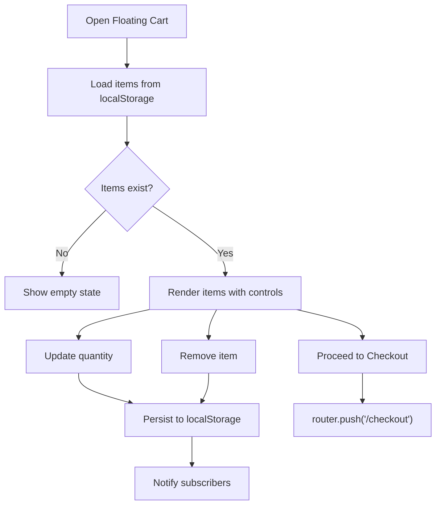

**Diagram sources**
- [components/FloatingCart.tsx:1-326](file://components/FloatingCart.tsx#L1-L326)
- [lib/store.ts:67-168](file://lib/store.ts#L67-L168)

**Section sources**
- [components/FloatingCart.tsx:1-326](file://components/FloatingCart.tsx#L1-L326)
- [lib/store.ts:67-168](file://lib/store.ts#L67-L168)

### Menu Page: Filtering, Quick Add, and Live Data
The menu page:

- Loads menu items and categories from `/api/menu`, falling back to static data.
- Filters items by selected category and search query.
- Supports quick add to cart with spice level defaults and visual feedback.
- Computes derived cart totals and counts using memoization.
- Shows a mobile bottom bar when items are present.

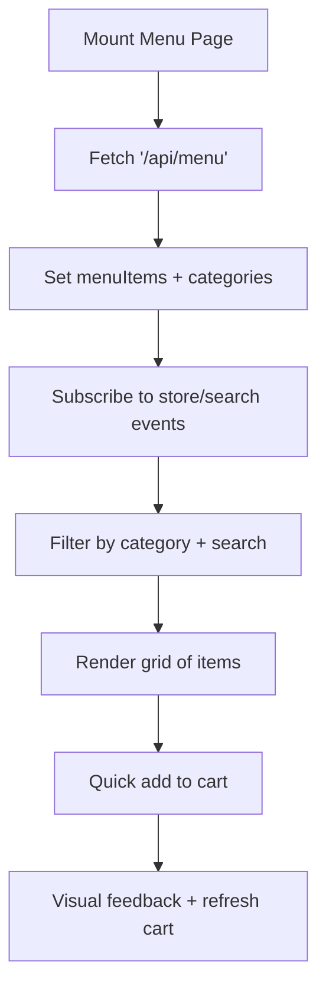

**Diagram sources**
- [app/menu/page.tsx:1-320](file://app/menu/page.tsx#L1-L320)
- [lib/store.ts:99-138](file://lib/store.ts#L99-L138)

**Section sources**
- [app/menu/page.tsx:1-320](file://app/menu/page.tsx#L1-L320)
- [lib/store.ts:99-138](file://lib/store.ts#L99-L138)

### Cart Page: Review, Notes, and Totals
The cart page:

- Reads cart items and order notes from the store.
- Fetches tax and service rates from `/api/settings`.
- Calculates subtotal, combined tax/service, and grand total.
- Allows updating quantities and removing items.
- Navigates to checkout.

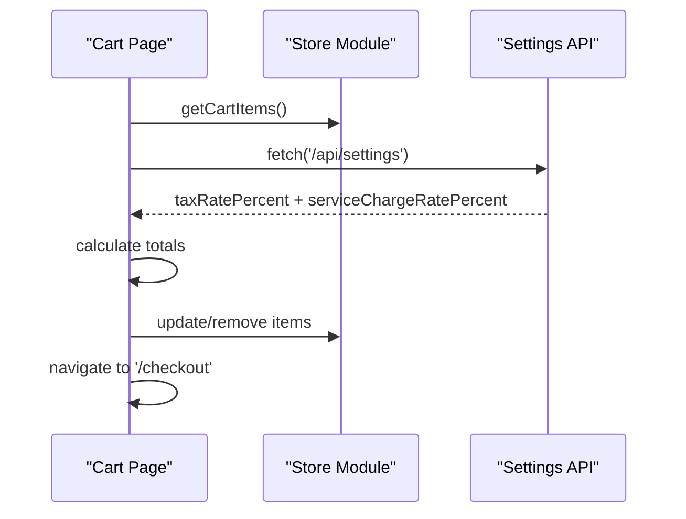

**Diagram sources**
- [app/cart/page.tsx:1-227](file://app/cart/page.tsx#L1-L227)
- [lib/store.ts:67-168](file://lib/store.ts#L67-L168)

**Section sources**
- [app/cart/page.tsx:1-227](file://app/cart/page.tsx#L1-L227)
- [lib/store.ts:67-168](file://lib/store.ts#L67-L168)

### Checkout Page: Order Submission and Coupon Validation
The checkout page:

- Loads cart items, manual table number, order notes, promos, settings, and known tables.
- Validates coupon codes against `/api/coupons/validate`.
- Computes preview totals including discount, tax, and service charges.
- Submits orders to `/api/orders`, clears cart, and navigates to order status page.

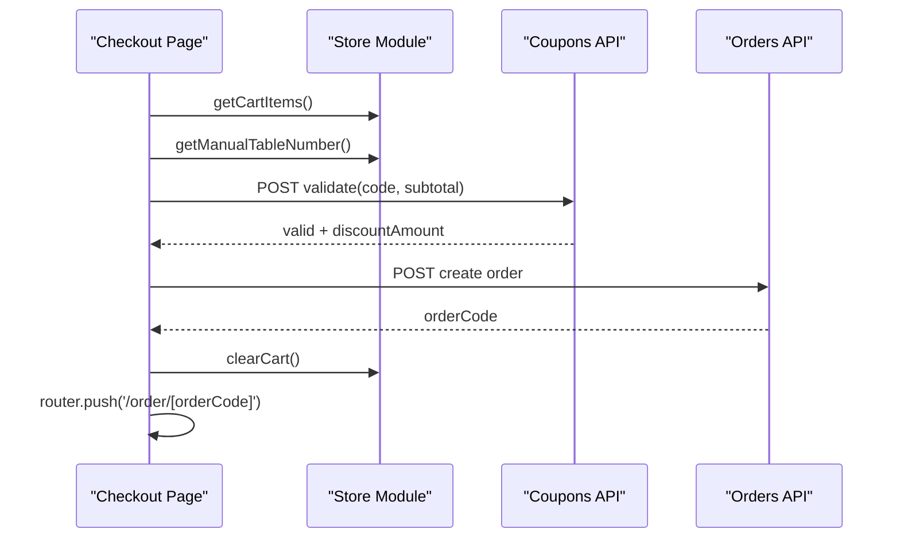

**Diagram sources**
- [app/checkout/page.tsx:1-542](file://app/checkout/page.tsx#L1-L542)
- [lib/store.ts:194-217](file://lib/store.ts#L194-L217)

**Section sources**
- [app/checkout/page.tsx:1-542](file://app/checkout/page.tsx#L1-L542)
- [lib/store.ts:194-217](file://lib/store.ts#L194-L217)

### Admin Dashboard: Management UI and API Interactions
The admin dashboard:

- Is a large client component containing forms and modals for products, categories, promotions, coupons, orders, and settings.
- Uses a shared API helper to call REST endpoints with error handling.
- Persists some admin-only state locally while mutating server data via API routes.
- Operates independently from the public header/footer/AI chat due to the admin layout.

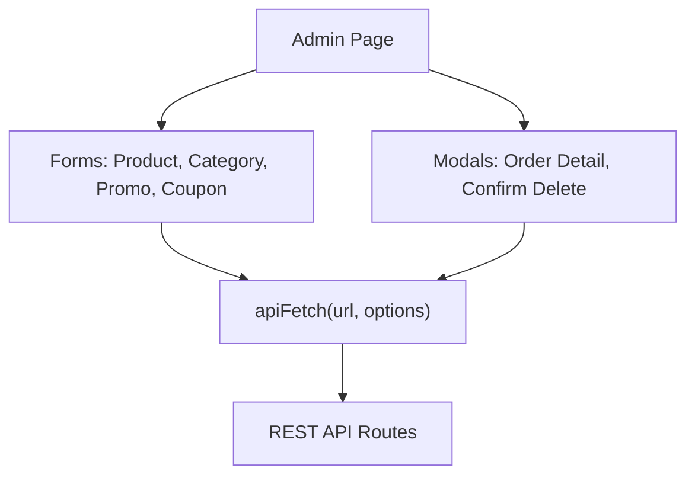

**Diagram sources**
- [app/admin/page.tsx:1-800](file://app/admin/page.tsx#L1-L800)

**Section sources**
- [app/admin/page.tsx:1-800](file://app/admin/page.tsx#L1-L800)

## Dependency Analysis
Key dependencies and relationships:

- Pages depend on `lib/store.ts` for cart persistence and event-driven updates.
- Header and Floating Cart depend on store events to stay synchronized.
- Menu page depends on `/api/menu` for dynamic data and falls back to static data.
- Cart and checkout pages depend on `/api/settings` for tax/service rates.
- Checkout page depends on `/api/coupons/validate` and `/api/orders`.
- Admin page depends on multiple API routes for CRUD operations.

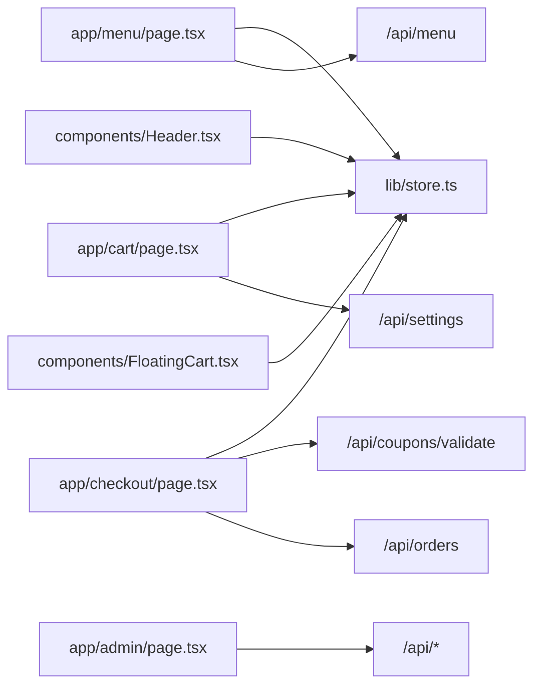

**Diagram sources**
- [app/menu/page.tsx:1-320](file://app/menu/page.tsx#L1-L320)
- [app/cart/page.tsx:1-227](file://app/cart/page.tsx#L1-L227)
- [app/checkout/page.tsx:1-542](file://app/checkout/page.tsx#L1-L542)
- [components/Header.tsx:1-121](file://components/Header.tsx#L1-L121)
- [components/FloatingCart.tsx:1-326](file://components/FloatingCart.tsx#L1-L326)
- [app/admin/page.tsx:1-800](file://app/admin/page.tsx#L1-L800)

**Section sources**
- [app/menu/page.tsx:1-320](file://app/menu/page.tsx#L1-L320)
- [app/cart/page.tsx:1-227](file://app/cart/page.tsx#L1-L227)
- [app/checkout/page.tsx:1-542](file://app/checkout/page.tsx#L1-L542)
- [components/Header.tsx:1-121](file://components/Header.tsx#L1-L121)
- [components/FloatingCart.tsx:1-326](file://components/FloatingCart.tsx#L1-L326)
- [app/admin/page.tsx:1-800](file://app/admin/page.tsx#L1-L800)

## Performance Considerations
The frontend applies several performance techniques:

- **Server-Side Rendering Boundaries**: The root layout is server-rendered; interactive UI is isolated in client components marked with `'use client'`.
- **Code Splitting**: Each page file is a separate route entry point, enabling Next.js to split bundles per route.
- **Lazy Loading**: Components like AI chat and floating cart are conditionally mounted after client mount to avoid unnecessary initial work.
- **Image Optimization**: The Next.js config allows remote images, and pages use optimized image rendering where applicable.
- **Memoization**: Derived cart totals and counts are computed with `useMemo` to reduce re-renders.
- **Event-Driven Updates**: Store events minimize prop drilling and redundant state propagation.

Recommendations:

- Prefer server actions or server components for data fetching where possible to reduce client bundle size.
- Use Next.js `next/dynamic` for heavy modals or panels not needed on initial render.
- Debounce search input before filtering to improve responsiveness on large datasets.
- Cache API responses using SWR or React Query if interactivity increases.

[No sources needed since this section provides general guidance]

## Troubleshooting Guide
Common issues and resolutions:

- **Cart Not Persisting**: Ensure the browser has `localStorage` enabled and that store functions are called from client components.
- **Cart Badge Not Updating**: Verify that store events are subscribed to in both Header and Floating Cart.
- **Checkout Fails to Submit**: Check network requests to `/api/orders` and ensure required fields like table number are provided.
- **Coupon Validation Errors**: Validate coupon code format and minimum subtotal requirements before calling `/api/coupons/validate`.
- **Admin API Errors**: Inspect HTTP status and error payloads returned by the shared API helper.

**Section sources**
- [lib/store.ts:67-217](file://lib/store.ts#L67-L217)
- [app/checkout/page.tsx:138-245](file://app/checkout/page.tsx#L138-L245)
- [app/admin/page.tsx:67-77](file://app/admin/page.tsx#L67-L77)

## Conclusion
The Warkop Betawa frontend leverages Next.js App Router to separate server-rendered layouts from interactive client components. Customer-facing pages handle menu browsing, cart management, and checkout, while the admin dashboard provides comprehensive operational controls. State is persisted in local storage and synchronized across components through a lightweight event system. Responsive design is achieved with Tailwind CSS, and performance is improved through code splitting, conditional mounting, and memoization.

[No sources needed since this section summarizes without analyzing specific files]