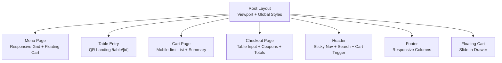
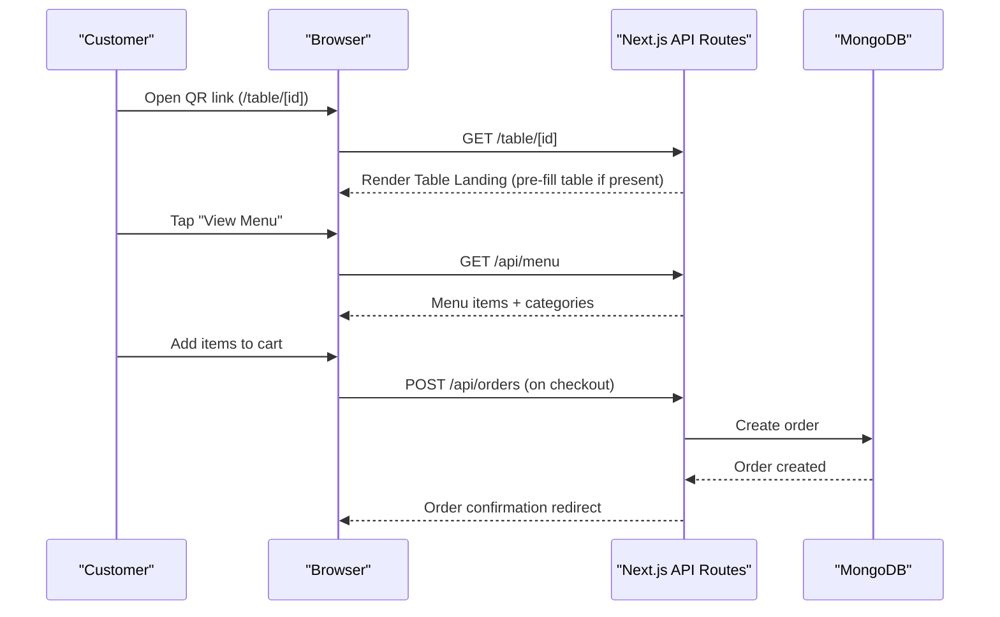
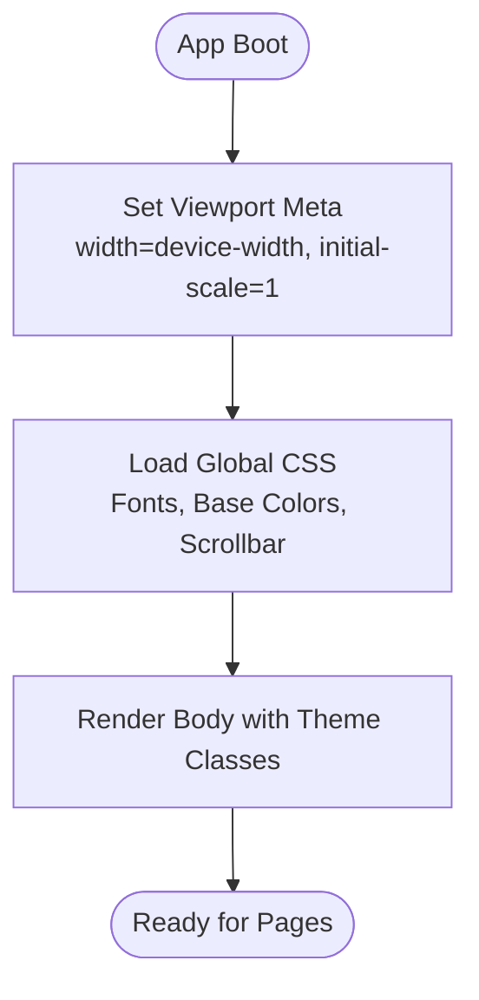
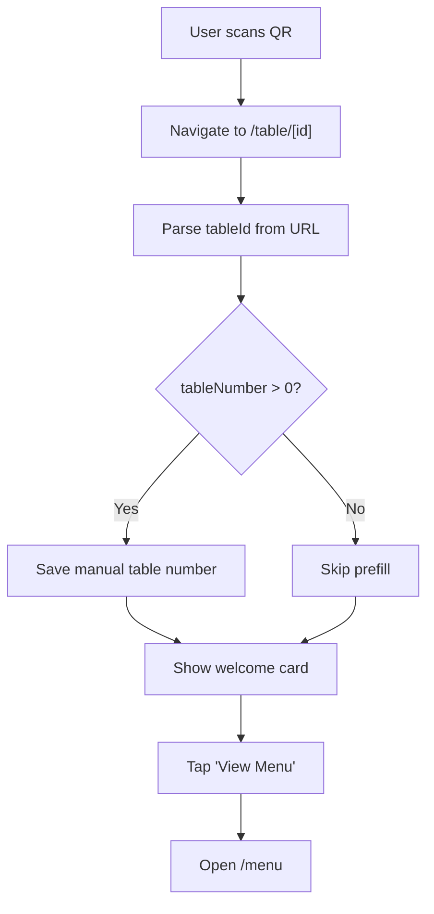
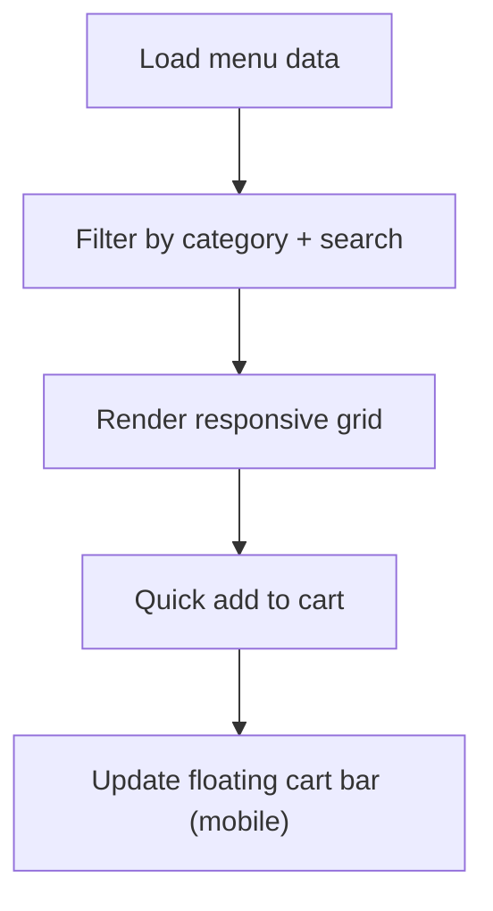
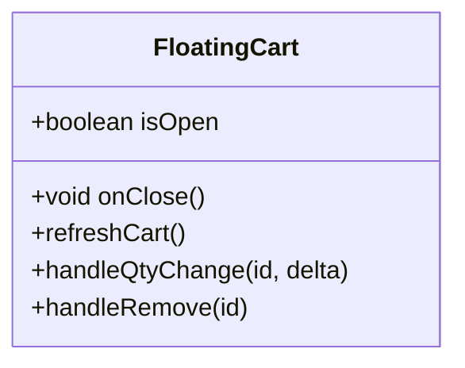
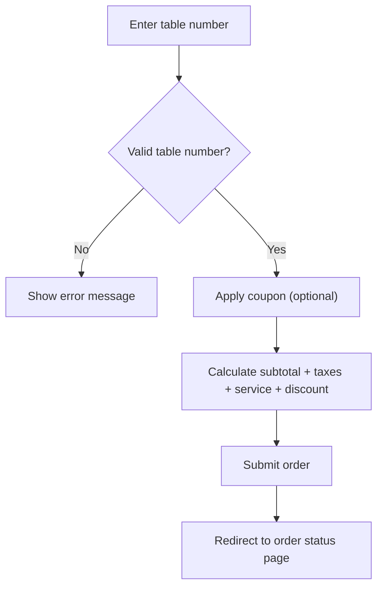
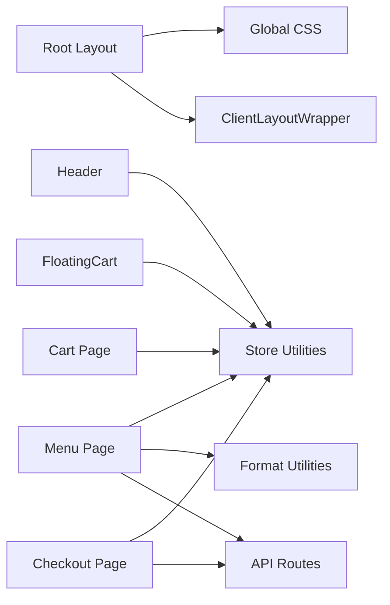

# Responsive Design & Mobile Optimization

<cite>
**Referenced Files in This Document**
- [README.md](file://README.md)
- [tailwind.config.ts](file://tailwind.config.ts)
- [postcss.config.js](file://postcss.config.js)
- [app/layout.tsx](file://app/layout.tsx)
- [app/globals.css](file://app/globals.css)
- [app/page.tsx](file://app/page.tsx)
- [app/table/[tableId]/page.tsx](file://app/table/[tableId]/page.tsx)
- [app/menu/page.tsx](file://app/menu/page.tsx)
- [components/Header.tsx](file://components/Header.tsx)
- [components/FloatingCart.tsx](file://components/FloatingCart.tsx)
- [components/Footer.tsx](file://components/Footer.tsx)
- [app/cart/page.tsx](file://app/cart/page.tsx)
- [app/checkout/page.tsx](file://app/checkout/page.tsx)
</cite>

## Table of Contents
1. [Introduction](#introduction)
2. [Project Structure](#project-structure)
3. [Core Components](#core-components)
4. [Architecture Overview](#architecture-overview)
5. [Detailed Component Analysis](#detailed-component-analysis)
6. [Dependency Analysis](#dependency-analysis)
7. [Performance Considerations](#performance-considerations)
8. [Troubleshooting Guide](#troubleshooting-guide)
9. [Conclusion](#conclusion)

## Introduction
This document explains the responsive design approach and mobile optimization strategies used in the Warkop Betawa application. It covers the mobile-first philosophy, Tailwind CSS utility classes for responsive layouts, adaptive components across devices, QR code scanning entry flow, touch-friendly interactions, performance considerations for mobile, examples of responsive breakpoints, and testing approaches for different screen sizes.

The app is a Next.js 14 restaurant ordering system with routes optimized for QR-based table entry and mobile-first customer flows.

**Section sources**
- [README.md:53-64](file://README.md#L53-L64)

## Project Structure
The application uses a modern Next.js App Router structure with client-side components for interactive UIs. The root layout sets up viewport metadata and global styles, while pages implement responsive layouts using Tailwind CSS utilities.

**Diagram sources**
- [app/layout.tsx:10-23](file://app/layout.tsx#L10-L23)
- [app/menu/page.tsx:108-317](file://app/menu/page.tsx#L108-L317)
- [app/table/[tableId]/page.tsx:18-103](file://app/table/[tableId]/page.tsx#L18-L103)
- [app/cart/page.tsx:85-224](file://app/cart/page.tsx#L85-L224)
- [app/checkout/page.tsx:260-537](file://app/checkout/page.tsx#L260-L537)
- [components/Header.tsx:41-118](file://components/Header.tsx#L41-L118)
- [components/Footer.tsx:5-71](file://components/Footer.tsx#L5-L71)
- [components/FloatingCart.tsx:65-322](file://components/FloatingCart.tsx#L65-L322)

**Section sources**
- [app/layout.tsx:1-23](file://app/layout.tsx#L1-L23)
- [app/page.tsx:1-6](file://app/page.tsx#L1-L6)

## Core Components
- Root layout configures the viewport for mobile devices and applies global styles and fonts.
- Tailwind configuration extends brand colors, typography, border radius, and shadows to ensure consistent visual language across devices.
- PostCSS integrates Tailwind and Autoprefixer for cross-browser compatibility.

Key points:
- Viewport meta ensures correct scaling on mobile browsers.
- Global CSS defines base font families, background color, and custom scrollbar styling.
- Tailwind theme provides reusable tokens (colors, fonts, radii, shadows).

**Section sources**
- [app/layout.tsx:10-23](file://app/layout.tsx#L10-L23)
- [app/globals.css:1-19](file://app/globals.css#L1-L19)
- [tailwind.config.ts:3-41](file://tailwind.config.ts#L3-L41)
- [postcss.config.js:1-6](file://postcss.config.js#L1-L6)

## Architecture Overview
The user journey begins with a QR scan landing page that optionally pre-fills the table number, then navigates to the menu where customers browse, filter, search, and add items to the cart. A floating cart drawer and bottom bar provide quick access to checkout. The checkout page collects table number, optional coupons, notes, and submits orders.

**Diagram sources**
- [app/table/[tableId]/page.tsx:18-103](file://app/table/[tableId]/page.tsx#L18-L103)
- [app/menu/page.tsx:26-40](file://app/menu/page.tsx#L26-L40)
- [app/checkout/page.tsx:186-245](file://app/checkout/page.tsx#L186-L245)

## Detailed Component Analysis

### Root Layout and Viewport Configuration
- Sets viewport width to device-width and initial scale to 1 for proper mobile rendering.
- Applies global body styles and imports global CSS.

**Diagram sources**
- [app/layout.tsx:10-23](file://app/layout.tsx#L10-L23)
- [app/globals.css:1-19](file://app/globals.css#L1-L19)

**Section sources**
- [app/layout.tsx:1-23](file://app/layout.tsx#L1-L23)
- [app/globals.css:1-19](file://app/globals.css#L1-L19)

### QR Code Scanning Experience Optimization
- The table landing page acts as a universal entry point for QR scans.
- It extracts the numeric table ID from the URL path and pre-populates the table number in local storage for later checkout use.
- Provides a welcoming card with clear call-to-action to proceed to the menu.

**Diagram sources**
- [app/table/[tableId]/page.tsx:18-103](file://app/table/[tableId]/page.tsx#L18-L103)

**Section sources**
- [app/table/[tableId]/page.tsx:18-103](file://app/table/[tableId]/page.tsx#L18-L103)

### Menu Page: Responsive Grid and Touch-Friendly Interactions
- Uses Tailwind responsive grid breakpoints to adapt columns based on screen size.
- Implements category filters with circular icons and active states.
- Adds a floating bottom cart bar visible only on smaller screens for quick checkout access.
- Image cards use aspect ratios and responsive sizing attributes for optimal loading.

Responsive highlights:
- Grid adapts from single column on small screens to multiple columns on larger screens.
- Category filter container scrolls horizontally on narrow devices.
- Bottom cart bar appears only below large screens to reduce clutter on desktop.

**Diagram sources**
- [app/menu/page.tsx:108-317](file://app/menu/page.tsx#L108-L317)

**Section sources**
- [app/menu/page.tsx:108-317](file://app/menu/page.tsx#L108-L317)

### Header: Sticky Navigation and Cart Trigger
- Sticky header remains accessible during scrolling.
- Includes a compact search input sized for mobile and expands on larger screens.
- Desktop navigation links are hidden on small screens; cart icon triggers the floating cart drawer.

Touch-friendly aspects:
- Large tap targets for cart button and AI assistant button.
- Badge animation draws attention to cart count changes.

**Section sources**
- [components/Header.tsx:41-118](file://components/Header.tsx#L41-L118)

### Floating Cart: Slide-in Drawer and Touch Gestures
- Renders a slide-in drawer from the right with smooth transitions.
- Width adapts across screen sizes (full width on very small screens, fixed widths on larger ones).
- Contains item list with quantity controls, remove actions, and summary totals.
- Keyboard accessibility includes Escape key to close.

**Diagram sources**
- [components/FloatingCart.tsx:65-322](file://components/FloatingCart.tsx#L65-L322)

**Section sources**
- [components/FloatingCart.tsx:65-322](file://components/FloatingCart.tsx#L65-L322)

### Cart Page: Mobile-first List and Summary
- Displays cart items in a stacked layout on mobile and switches to a two-column layout on larger screens.
- Shows inline price on mobile rows and hides it on desktop where it’s shown in a dedicated column.
- Includes order notes textarea and payment summary with tax/service rates fetched from settings.

Responsive highlights:
- Single-column layout on mobile, multi-column on desktop.
- Price visibility toggled via responsive classes.

**Section sources**
- [app/cart/page.tsx:85-224](file://app/cart/page.tsx#L85-L224)

### Checkout Page: Table Input, Coupons, and Totals
- Requires table number input before submission; shows advisory when the table number is not found in known tables.
- Supports coupon validation and discount calculation with real-time feedback.
- Presents order summary with subtotal, discounts, taxes, service charges, and grand total.

**Diagram sources**
- [app/checkout/page.tsx:75-88](file://app/checkout/page.tsx#L75-L88)
- [app/checkout/page.tsx:138-171](file://app/checkout/page.tsx#L138-L171)
- [app/checkout/page.tsx:186-245](file://app/checkout/page.tsx#L186-L245)

**Section sources**
- [app/checkout/page.tsx:260-537](file://app/checkout/page.tsx#L260-L537)

### Footer: Responsive Columns
- Uses a responsive grid to stack content on mobile and display multiple columns on larger screens.
- Links and contact information remain accessible and readable across devices.

**Section sources**
- [components/Footer.tsx:5-71](file://components/Footer.tsx#L5-L71)

## Dependency Analysis
The following diagram maps how pages and components depend on each other and on shared utilities.

**Diagram sources**
- [app/layout.tsx:1-23](file://app/layout.tsx#L1-L23)
- [app/menu/page.tsx:1-40](file://app/menu/page.tsx#L1-L40)
- [components/Header.tsx:1-33](file://components/Header.tsx#L1-L33)
- [components/FloatingCart.tsx:1-39](file://components/FloatingCart.tsx#L1-L39)
- [app/cart/page.tsx:1-48](file://app/cart/page.tsx#L1-L48)
- [app/checkout/page.tsx:1-73](file://app/checkout/page.tsx#L1-L73)

**Section sources**
- [app/menu/page.tsx:1-40](file://app/menu/page.tsx#L1-L40)
- [components/Header.tsx:1-33](file://components/Header.tsx#L1-L33)
- [components/FloatingCart.tsx:1-39](file://components/FloatingCart.tsx#L1-L39)
- [app/cart/page.tsx:1-48](file://app/cart/page.tsx#L1-L48)
- [app/checkout/page.tsx:1-73](file://app/checkout/page.tsx#L1-L73)

## Performance Considerations
- Use Next.js Image component with appropriate sizes and fill to optimize image loading on mobile networks.
- Avoid heavy animations on low-end devices; prefer subtle transitions and hardware-accelerated transforms.
- Keep the floating cart drawer lightweight; lazy-load non-critical assets within drawers.
- Minimize re-renders by memoizing derived values (e.g., cart totals) and using event subscriptions efficiently.
- Ensure images have fallbacks and handle errors gracefully to prevent layout shifts.

[No sources needed since this section provides general guidance]

## Troubleshooting Guide
Common issues and resolutions:
- Images not loading or showing broken placeholders:
  - Verify image URLs and fallback logic in menu cards and cart items.
  - Check network requests and CORS policies if images are hosted externally.
- Floating cart not closing on Escape key:
  - Confirm keyboard event listeners are attached when the drawer is open.
- Table number advisory vs error:
  - Advisory indicates unknown table but allows proceeding; error blocks submission until valid table number is entered.
- Coupon validation failures:
  - Ensure server endpoint returns valid responses and handles edge cases like missing codes or insufficient subtotals.

**Section sources**
- [app/checkout/page.tsx:75-88](file://app/checkout/page.tsx#L75-L88)
- [app/checkout/page.tsx:138-171](file://app/checkout/page.tsx#L138-L171)
- [components/FloatingCart.tsx:41-46](file://components/FloatingCart.tsx#L41-L46)

## Conclusion
Warkop Betawa implements a robust mobile-first responsive design using Tailwind CSS utilities, adaptive components, and thoughtful UX patterns tailored for mobile devices. The QR-driven entry flow streamlines table association, while touch-friendly interfaces and performance optimizations ensure a smooth experience across devices. Testing across breakpoints and devices helps maintain consistency and usability.

[No sources needed since this section summarizes without analyzing specific files]