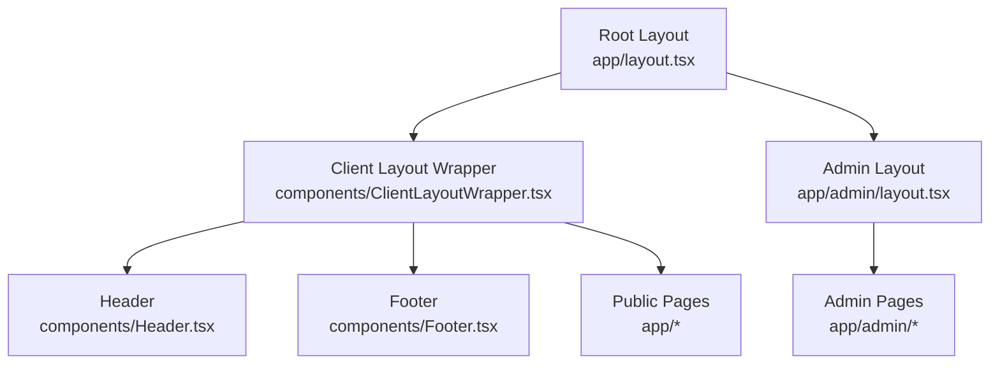
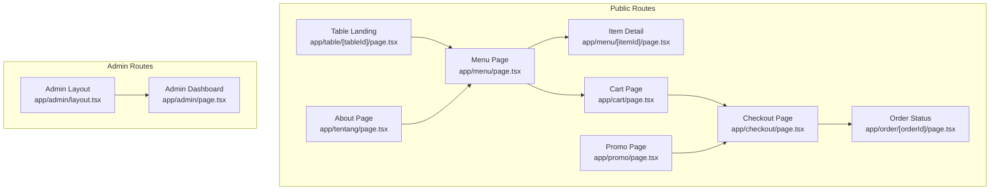
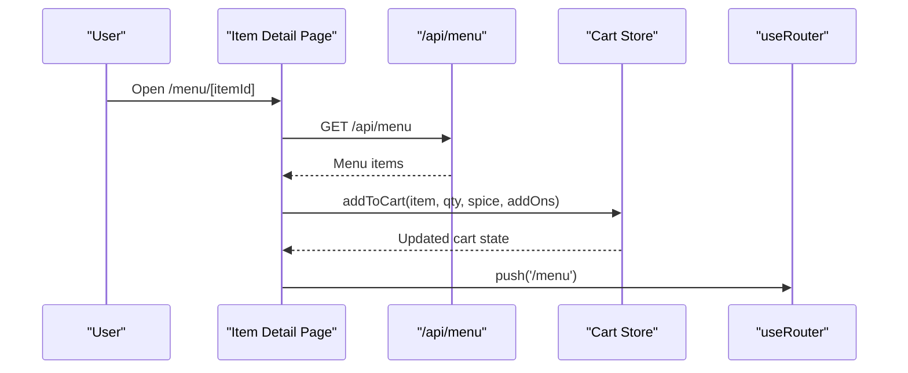
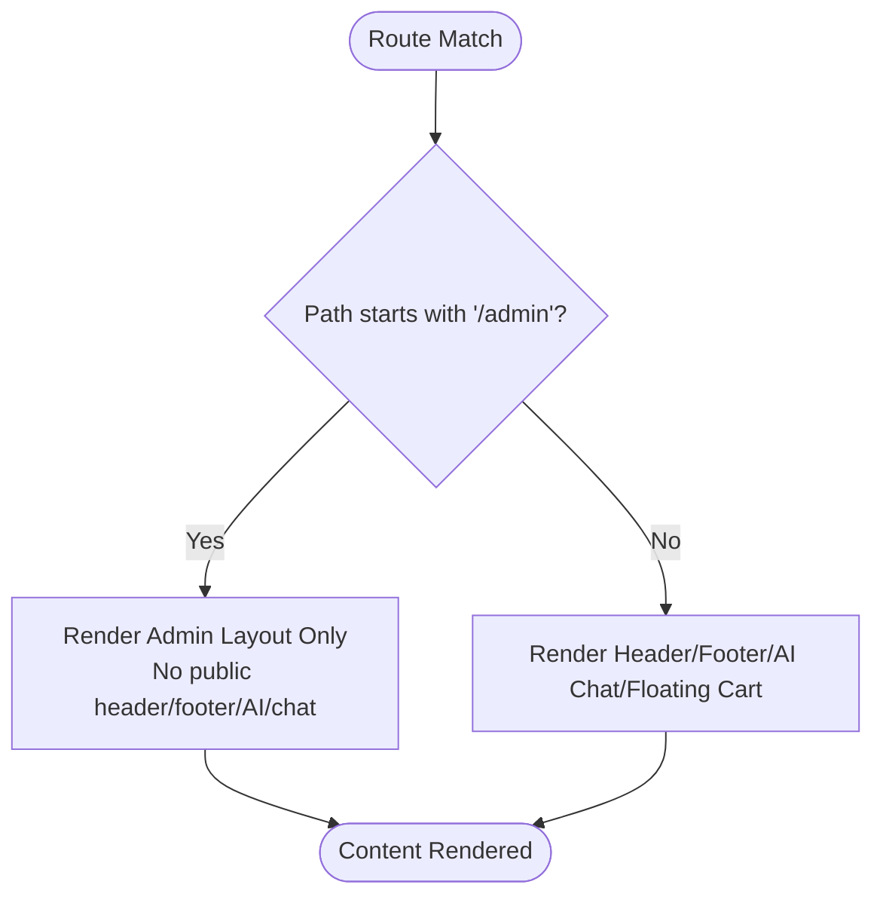
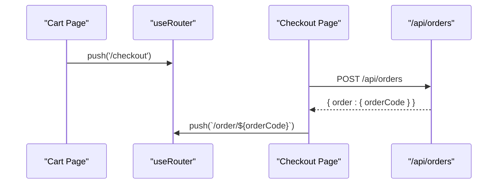
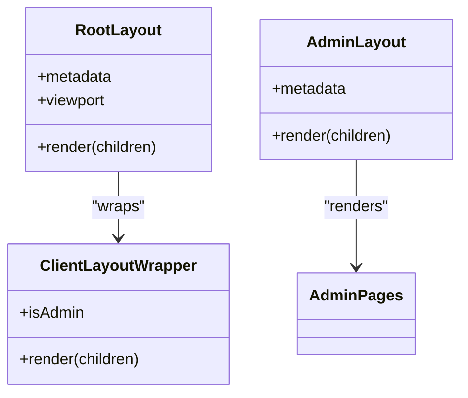

# Routing & Navigation

<cite>
**Referenced Files in This Document**
- [layout.tsx](file://app/layout.tsx)
- [page.tsx](file://app/page.tsx)
- [admin-layout.tsx](file://app/admin/layout.tsx)
- [menu-page.tsx](file://app/menu/page.tsx)
- [menu-item-detail.tsx](file://app/menu/[itemId]/page.tsx)
- [cart-page.tsx](file://app/cart/page.tsx)
- [checkout-page.tsx](file://app/checkout/page.tsx)
- [order-status-page.tsx](file://app/order/[orderId]/page.tsx)
- [table-landing-page.tsx](file://app/table/[tableId]/page.tsx)
- [promo-page.tsx](file://app/promo/page.tsx)
- [tentang-page.tsx](file://app/tentang/page.tsx)
- [client-layout-wrapper.tsx](file://components/ClientLayoutWrapper.tsx)
- [header.tsx](file://components/Header.tsx)
- [footer.tsx](file://components/Footer.tsx)
- [floating-cart.tsx](file://components/FloatingCart.tsx)
</cite>

## Table of Contents
1. [Introduction](#introduction)
2. [Project Structure](#project-structure)
3. [Core Components](#core-components)
4. [Architecture Overview](#architecture-overview)
5. [Detailed Component Analysis](#detailed-component-analysis)
6. [Dependency Analysis](#dependency-analysis)
7. [Performance Considerations](#performance-considerations)
8. [Troubleshooting Guide](#troubleshooting-guide)
9. [Conclusion](#conclusion)

## Introduction
This document explains the Next.js App Router routing and navigation implementation for the Warkop Betawa system. It covers:
- File-based routing structure and route organization
- Customer-facing pages (menu, cart, checkout, order status, table landing, promo, about)
- Admin routes and layout separation
- Server-side rendering vs client components
- Dynamic routing for menu items and orders
- Programmatic navigation, route parameters, and layout composition
- Route protection patterns used across the application

## Project Structure
The application uses the Next.js App Router with a clear separation between public customer flows and admin functionality:
- Root layout provides global metadata, viewport settings, and wraps content with a client-side layout wrapper that injects header, footer, AI chat panel, floating cart, and error boundary.
- Public routes live under `app/` and include menu browsing, item details, cart, checkout, order tracking, table landing, promo, and about pages.
- Admin routes are isolated under `app/admin/` with their own layout and metadata.



**Diagram sources**
- [layout.tsx:1-24](file://app/layout.tsx#L1-L24)
- [client-layout-wrapper.tsx:1-45](file://components/ClientLayoutWrapper.tsx#L1-L45)
- [admin-layout.tsx:1-12](file://app/admin/layout.tsx#L1-L12)

**Section sources**
- [layout.tsx:1-24](file://app/layout.tsx#L1-L24)
- [client-layout-wrapper.tsx:1-45](file://components/ClientLayoutWrapper.tsx#L1-L45)
- [admin-layout.tsx:1-12](file://app/admin/layout.tsx#L1-L12)

## Core Components
- Root layout defines site-wide metadata and viewport, then delegates UI composition to a client-side wrapper.
- Client layout wrapper conditionally renders public chrome (header, footer, AI chat, floating cart) and hides them for admin routes.
- Header provides global search, navigation links, and cart access; it also broadcasts search queries to other pages via a shared event bus.
- Footer includes service links and an admin portal link.
- Floating cart is a slide-out drawer for quick cart review and checkout navigation.

Key responsibilities:
- Global UI composition and route-aware chrome toggling
- Shared state synchronization for cart and search
- Consistent navigation anchors and programmatic routing

**Section sources**
- [layout.tsx:1-24](file://app/layout.tsx#L1-L24)
- [client-layout-wrapper.tsx:1-45](file://components/ClientLayoutWrapper.tsx#L1-L45)
- [header.tsx:1-121](file://components/Header.tsx#L1-L121)
- [footer.tsx:1-74](file://components/Footer.tsx#L1-L74)
- [floating-cart.tsx:1-326](file://components/FloatingCart.tsx#L1-L326)

## Architecture Overview
The routing architecture separates concerns by feature and environment:
- Public routes render interactive user experiences using client components.
- Admin routes use a minimal layout without public chrome.
- Data fetching occurs on the client side within page components, calling REST endpoints under `app/api/`.
- Navigation is implemented both declaratively (Next.js Link) and programmatically (useRouter).



**Diagram sources**
- [menu-page.tsx:1-320](file://app/menu/page.tsx#L1-L320)
- [menu-item-detail.tsx:1-232](file://app/menu/[itemId]/page.tsx#L1-L232)
- [cart-page.tsx:1-227](file://app/cart/page.tsx#L1-L227)
- [checkout-page.tsx:1-542](file://app/checkout/page.tsx#L1-L542)
- [order-status-page.tsx:1-291](file://app/order/[orderId]/page.tsx#L1-L291)
- [table-landing-page.tsx:1-104](file://app/table/[tableId]/page.tsx#L1-L104)
- [promo-page.tsx:1-288](file://app/promo/page.tsx#L1-L288)
- [tentang-page.tsx:1-59](file://app/tentang/page.tsx#L1-L59)
- [admin-layout.tsx:1-12](file://app/admin/layout.tsx#L1-L12)

## Detailed Component Analysis

### File-Based Routing and Route Organization
- Root entry redirects to the menu page, establishing menu as the default landing experience.
- Public routes:
  - `/menu`: Browse categories and menu items, quick add to cart, navigate to item detail.
  - `/menu/[itemId]`: Dynamic item detail with spice levels and add-ons.
  - `/cart`: Review cart items, adjust quantities, view totals, proceed to checkout.
  - `/checkout`: Confirm order, apply coupons, select table number, submit order.
  - `/order/[orderId]`: Real-time order status polling and digital receipt when completed.
  - `/table/[tableId]`: Optional QR landing that pre-fills table number.
  - `/promo`: View and copy coupons, add promotional items to cart.
  - `/tentang`: About page with branding and call-to-action.
- Admin routes:
  - `/admin`: Isolated dashboard with its own layout and metadata.

Navigation patterns:
- Declarative navigation via `<Link>` for SEO-friendly routes and smooth transitions.
- Programmatic navigation via `useRouter().push()` for post-action flows (e.g., after adding to cart or creating an order).

**Section sources**
- [page.tsx:1-6](file://app/page.tsx#L1-L6)
- [menu-page.tsx:1-320](file://app/menu/page.tsx#L1-L320)
- [menu-item-detail.tsx:1-232](file://app/menu/[itemId]/page.tsx#L1-L232)
- [cart-page.tsx:1-227](file://app/cart/page.tsx#L1-L227)
- [checkout-page.tsx:1-542](file://app/checkout/page.tsx#L1-L542)
- [order-status-page.tsx:1-291](file://app/order/[orderId]/page.tsx#L1-L291)
- [table-landing-page.tsx:1-104](file://app/table/[tableId]/page.tsx#L1-L104)
- [promo-page.tsx:1-288](file://app/promo/page.tsx#L1-L288)
- [tentang-page.tsx:1-59](file://app/tentang/page.tsx#L1-L59)
- [admin-layout.tsx:1-12](file://app/admin/layout.tsx#L1-L12)

### Server-Side Rendering vs Client Components
All visible route components are marked as client components using the `'use client'` directive at the top of each file. This enables:
- Interactive state management (cart, filters, modals)
- Event handling (clicks, form submissions)
- Browser APIs (clipboard, timers, keyboard events)
- Programmatic navigation and dynamic data fetching

Implications:
- No server-rendered HTML for these pages; hydration occurs on the client.
- Data fetching happens in `useEffect` hooks after mount.
- Static assets and images are loaded client-side.

**Section sources**
- [menu-page.tsx:1-320](file://app/menu/page.tsx#L1-L320)
- [menu-item-detail.tsx:1-232](file://app/menu/[itemId]/page.tsx#L1-L232)
- [cart-page.tsx:1-227](file://app/cart/page.tsx#L1-L227)
- [checkout-page.tsx:1-542](file://app/checkout/page.tsx#L1-L542)
- [order-status-page.tsx:1-291](file://app/order/[orderId]/page.tsx#L1-L291)
- [table-landing-page.tsx:1-104](file://app/table/[tableId]/page.tsx#L1-L104)
- [promo-page.tsx:1-288](file://app/promo/page.tsx#L1-L288)

### Dynamic Routing for Menu Items and Orders
- Menu item detail uses a dynamic segment `[itemId]` to resolve the selected product. The component reads the parameter via `useParams`, fetches menu data from the API, and falls back to static data if needed.
- Order status uses a dynamic segment `[orderId]` to poll order updates every few seconds and display a real-time stepper. When the order completes, it fetches restaurant info to render a digital receipt.



**Diagram sources**
- [menu-item-detail.tsx:1-232](file://app/menu/[itemId]/page.tsx#L1-L232)

**Section sources**
- [menu-item-detail.tsx:1-232](file://app/menu/[itemId]/page.tsx#L1-L232)
- [order-status-page.tsx:1-291](file://app/order/[orderId]/page.tsx#L1-L291)

### Route Protection Mechanisms
- Admin layout is isolated from public chrome. The client layout wrapper detects admin paths and omits header/footer/AI chat/floating cart, effectively hiding public navigation elements for admin routes.
- There is no explicit authentication middleware in the referenced files; protection relies on layout isolation and absence of public UI in admin sections.



**Diagram sources**
- [client-layout-wrapper.tsx:1-45](file://components/ClientLayoutWrapper.tsx#L1-L45)
- [admin-layout.tsx:1-12](file://app/admin/layout.tsx#L1-L12)

**Section sources**
- [client-layout-wrapper.tsx:1-45](file://components/ClientLayoutWrapper.tsx#L1-L45)
- [admin-layout.tsx:1-12](file://app/admin/layout.tsx#L1-L12)

### Programmatic Navigation and Route Parameters
- Programmatic navigation examples:
  - After adding an item to cart, the item detail page navigates back to the menu.
  - From the cart page, users proceed to checkout using `router.push('/checkout')`.
  - After successful order creation, the checkout page clears the cart and navigates to `/order/{orderCode}`.
  - Table landing pre-populates the manual table number and navigates to `/menu`.
- Route parameters:
  - `params.itemId` in `/menu/[itemId]` resolves the selected menu item.
  - `params.orderId` in `/order/[orderId]` resolves the order code for status polling.
  - `params.tableId` in `/table/[tableId]` extracts a numeric table number to pre-fill checkout.



**Diagram sources**
- [cart-page.tsx:1-227](file://app/cart/page.tsx#L1-L227)
- [checkout-page.tsx:1-542](file://app/checkout/page.tsx#L1-L542)

**Section sources**
- [menu-item-detail.tsx:1-232](file://app/menu/[itemId]/page.tsx#L1-L232)
- [cart-page.tsx:1-227](file://app/cart/page.tsx#L1-L227)
- [checkout-page.tsx:1-542](file://app/checkout/page.tsx#L1-L542)
- [table-landing-page.tsx:1-104](file://app/table/[tableId]/page.tsx#L1-L104)

### Layout Composition Across Sections
- Root layout sets site metadata and viewport, then delegates to the client layout wrapper.
- Client layout wrapper composes public chrome and conditionally hides it for admin routes.
- Admin layout provides separate metadata and a minimal shell without public chrome.



**Diagram sources**
- [layout.tsx:1-24](file://app/layout.tsx#L1-L24)
- [client-layout-wrapper.tsx:1-45](file://components/ClientLayoutWrapper.tsx#L1-L45)
- [admin-layout.tsx:1-12](file://app/admin/layout.tsx#L1-L12)

**Section sources**
- [layout.tsx:1-24](file://app/layout.tsx#L1-L24)
- [client-layout-wrapper.tsx:1-45](file://components/ClientLayoutWrapper.tsx#L1-L45)
- [admin-layout.tsx:1-12](file://app/admin/layout.tsx#L1-L12)

## Dependency Analysis
- Public pages depend on:
  - Shared store utilities for cart operations and events
  - Formatting utilities for currency and dates
  - Static data fallbacks for menus and promos
  - API endpoints for menu, orders, coupons, promos, settings, tables
- Navigation depends on:
  - Next.js Link for declarative routing
  - useRouter for programmatic routing
- Layout dependencies:
  - Root layout depends on client layout wrapper
  - Client layout wrapper depends on header, footer, AI chat panel, floating cart, and error boundary
  - Admin layout is independent of public chrome

```mermaid
graph LR
MenuPage --> Store["lib/store"]
MenuPage --> Format["lib/format"]
MenuPage --> StaticData["lib/staticData"]
MenuPage --> API["/api/menu"]
CartPage --> Store
CartPage --> Format
CartPage --> API["/api/settings"]
CheckoutPage --> Store
CheckoutPage --> Format
CheckoutPage --> API["/api/promos","/api/settings","/api/tables","/api/coupons/validate","/api/orders"]
OrderStatusPage --> Format
OrderStatusPage --> API["/api/orders/[id]","/api/settings"]
TableLandingPage --> Store
TableLandingPage --> API["/api/tables"]
PromoPage --> Store
PromoPage --> Format
PromoPage --> API["/api/promos","/api/coupons"]
RootLayout --> ClientLayoutWrapper
ClientLayoutWrapper --> Header
ClientLayoutWrapper --> Footer
ClientLayoutWrapper --> FloatingCart
```

**Diagram sources**
- [menu-page.tsx:1-320](file://app/menu/page.tsx#L1-L320)
- [cart-page.tsx:1-227](file://app/cart/page.tsx#L1-L227)
- [checkout-page.tsx:1-542](file://app/checkout/page.tsx#L1-L542)
- [order-status-page.tsx:1-291](file://app/order/[orderId]/page.tsx#L1-L291)
- [table-landing-page.tsx:1-104](file://app/table/[tableId]/page.tsx#L1-L104)
- [promo-page.tsx:1-288](file://app/promo/page.tsx#L1-L288)
- [layout.tsx:1-24](file://app/layout.tsx#L1-L24)
- [client-layout-wrapper.tsx:1-45](file://components/ClientLayoutWrapper.tsx#L1-L45)
- [header.tsx:1-121](file://components/Header.tsx#L1-L121)
- [footer.tsx:1-74](file://components/Footer.tsx#L1-L74)
- [floating-cart.tsx:1-326](file://components/FloatingCart.tsx#L1-L326)

**Section sources**
- [menu-page.tsx:1-320](file://app/menu/page.tsx#L1-L320)
- [cart-page.tsx:1-227](file://app/cart/page.tsx#L1-L227)
- [checkout-page.tsx:1-542](file://app/checkout/page.tsx#L1-L542)
- [order-status-page.tsx:1-291](file://app/order/[orderId]/page.tsx#L1-L291)
- [table-landing-page.tsx:1-104](file://app/table/[tableId]/page.tsx#L1-L104)
- [promo-page.tsx:1-288](file://app/promo/page.tsx#L1-L288)
- [layout.tsx:1-24](file://app/layout.tsx#L1-L24)
- [client-layout-wrapper.tsx:1-45](file://components/ClientLayoutWrapper.tsx#L1-L45)
- [header.tsx:1-121](file://components/Header.tsx#L1-L121)
- [footer.tsx:1-74](file://components/Footer.tsx#L1-L74)
- [floating-cart.tsx:1-326](file://components/FloatingCart.tsx#L1-L326)

## Performance Considerations
- All route components are client components; consider moving heavy computations or data fetching to server components where appropriate to reduce client bundle size and improve initial load performance.
- Image loading uses Next.js Image component with unoptimized flags in several places; ensure proper image optimization configuration and consider enabling automatic optimization for production.
- Polling for order status occurs every 5 seconds; implement debouncing or exponential backoff to reduce unnecessary network requests.
- Use React.memo or useMemo for expensive derived calculations (e.g., cart totals) to avoid re-renders.
- Avoid unnecessary re-fetching by caching responses or using SWR/React Query patterns.

[No sources needed since this section provides general guidance]

## Troubleshooting Guide
Common issues and resolutions:
- Empty cart state on first render: Ensure store subscriptions are initialized and refresh functions are called in useEffect.
- Coupon validation errors: Validate input trimming and uppercase normalization; handle API errors gracefully and reset coupon state.
- Table number advisory: If the entered table number is not in the known list, show a soft advisory but allow proceeding.
- Order status not updating: Verify polling interval and error handling; check network connectivity and API availability.
- Admin layout missing public chrome: Confirm path detection logic excludes admin routes from public UI.

**Section sources**
- [cart-page.tsx:1-227](file://app/cart/page.tsx#L1-L227)
- [checkout-page.tsx:1-542](file://app/checkout/page.tsx#L1-L542)
- [order-status-page.tsx:1-291](file://app/order/[orderId]/page.tsx#L1-L291)
- [table-landing-page.tsx:1-104](file://app/table/[tableId]/page.tsx#L1-L104)
- [client-layout-wrapper.tsx:1-45](file://components/ClientLayoutWrapper.tsx#L1-L45)

## Conclusion
The Warkop Betawa system implements a clean, modular routing structure using the Next.js App Router. Public routes provide rich interactive experiences through client components, while admin routes remain isolated with a dedicated layout. Navigation combines declarative and programmatic approaches, and dynamic segments enable flexible routing for menu items and orders. Route protection relies on layout composition rather than explicit middleware. Future improvements can include server components for data-heavy pages, optimized image handling, and robust caching strategies.

[No sources needed since this section summarizes without analyzing specific files]