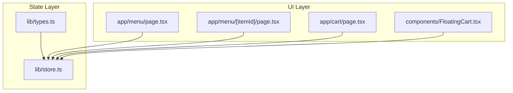
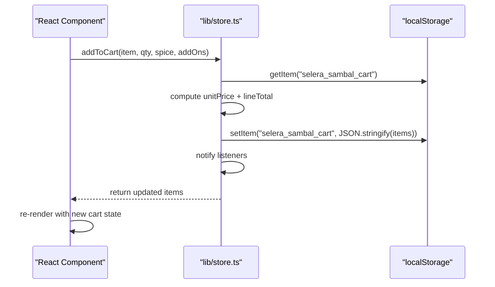
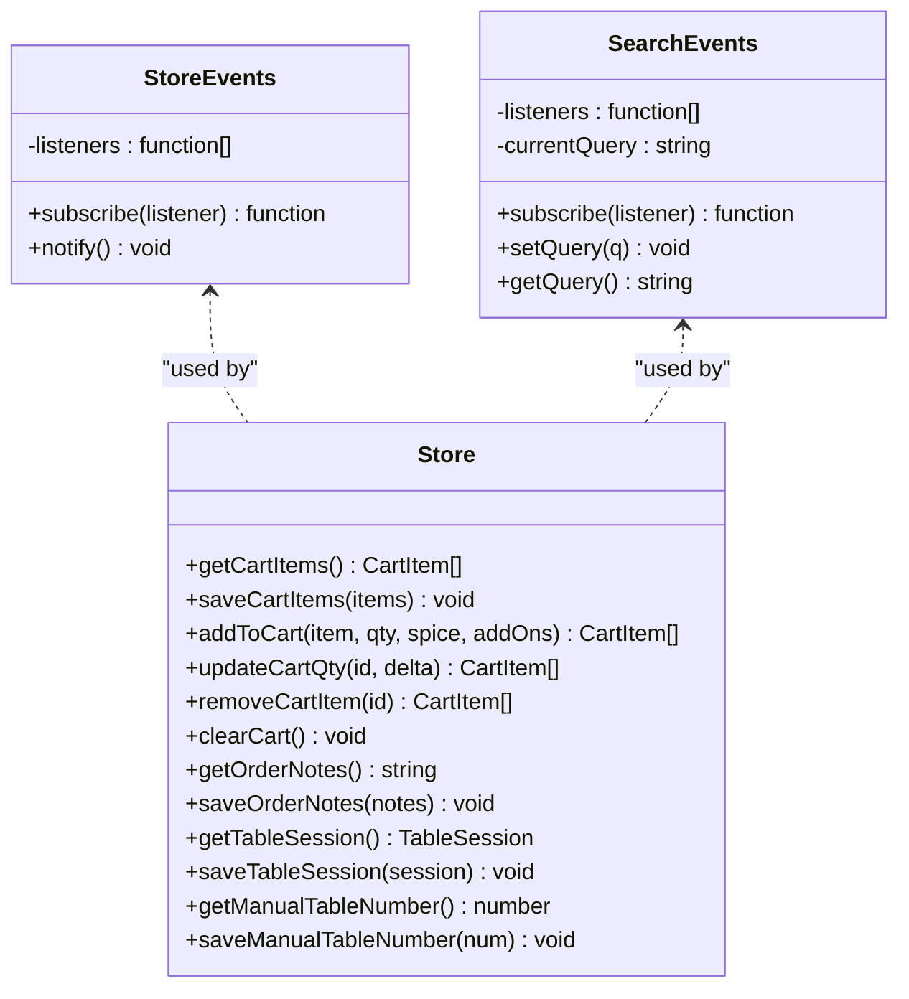
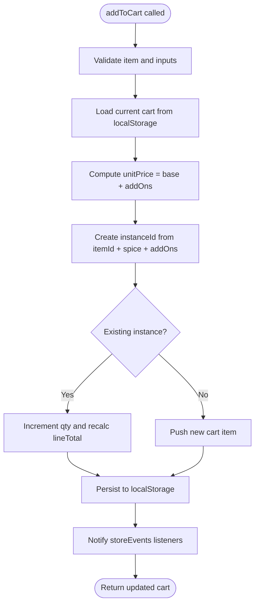
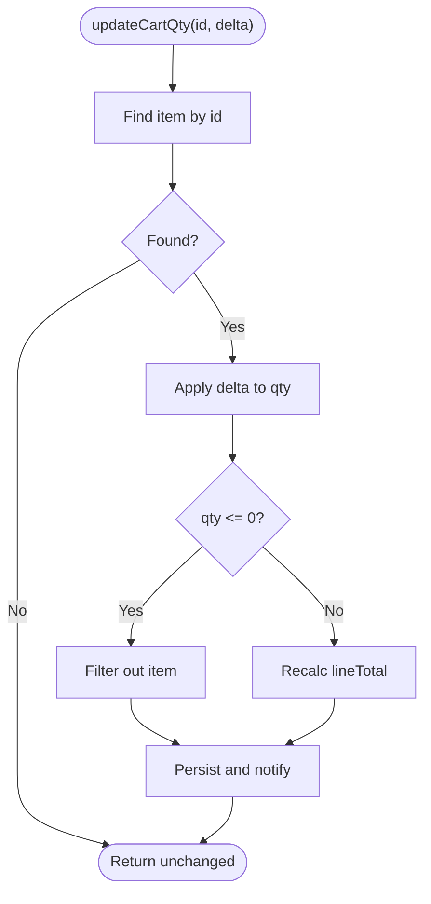
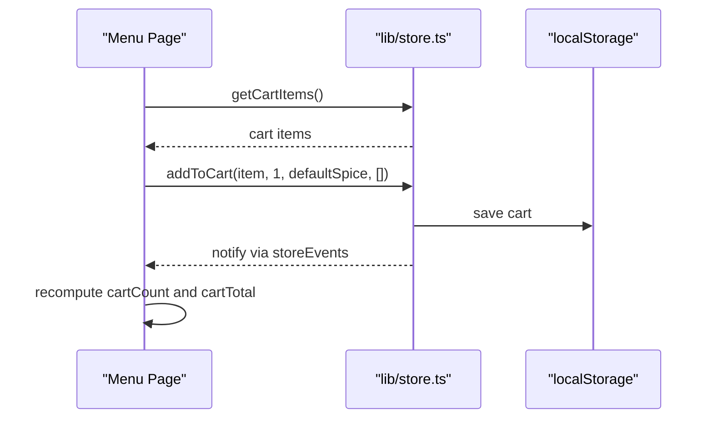
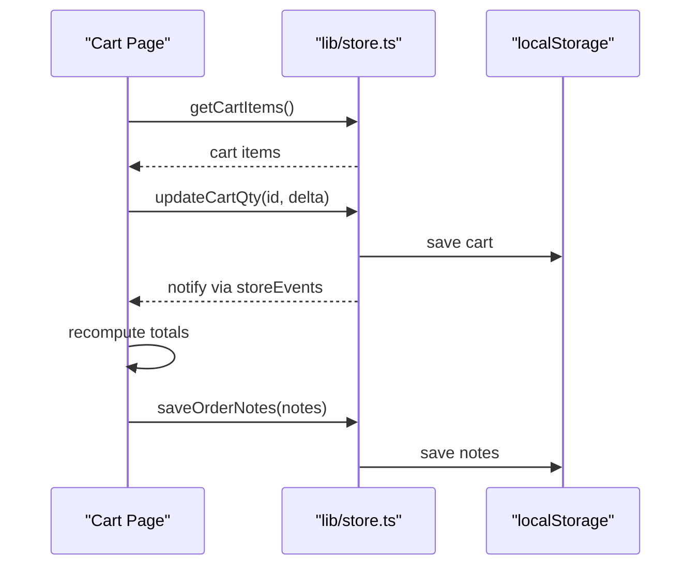
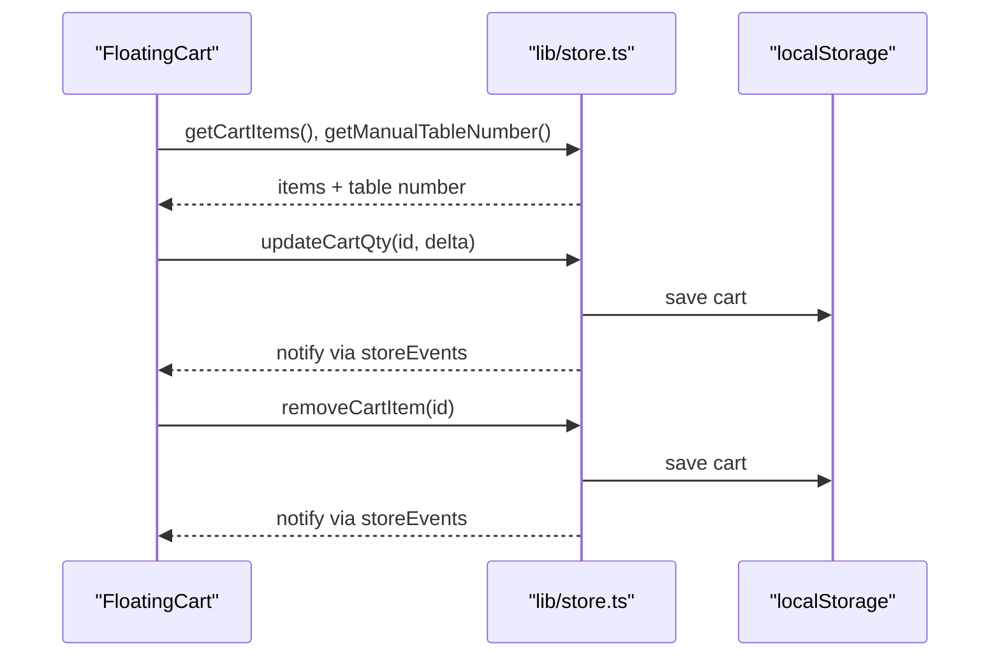
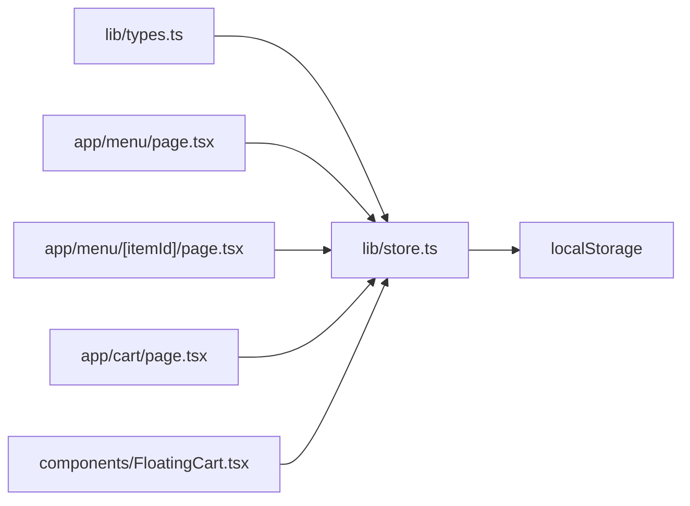

# State Management

<cite>
**Referenced Files in This Document**
- [store.ts](file://lib/store.ts)
- [types.ts](file://lib/types.ts)
- [FloatingCart.tsx](file://components/FloatingCart.tsx)
- [cart page.tsx](file://app/cart/page.tsx)
- [menu page.tsx](file://app/menu/page.tsx)
- [item detail page.tsx](file://app/menu/[itemId]/page.tsx)
</cite>

## Table of Contents
1. [Introduction](#introduction)
2. [Project Structure](#project-structure)
3. [Core Components](#core-components)
4. [Architecture Overview](#architecture-overview)
5. [Detailed Component Analysis](#detailed-component-analysis)
6. [Dependency Analysis](#dependency-analysis)
7. [Performance Considerations](#performance-considerations)
8. [Troubleshooting Guide](#troubleshooting-guide)
9. [Conclusion](#conclusion)

## Introduction
This document explains the state management architecture for the Warkop Betawa application, focusing on local storage patterns and a custom store implementation used to persist cart data across components and sessions. It covers:

- The custom store that persists cart items, order notes, table session, and manual table number to localStorage.
- Event-driven communication between React components using a lightweight event emitter.
- Cart state structure, operations (add, update quantity, remove, clear), and total calculations.
- How state is shared across pages and UI components during a user session.
- Performance considerations and recommended state update patterns.

## Project Structure
The state management logic is centralized in a small library module, while React components subscribe to store events and call store functions to mutate state.

**Diagram sources**
- [store.ts:1-217](file://lib/store.ts#L1-L217)
- [types.ts:1-119](file://lib/types.ts#L1-L119)
- [menu page.tsx:1-65](file://app/menu/page.tsx#L1-L65)
- [item detail page.tsx:1-33](file://app/menu/[itemId]/page.tsx#L1-L33)
- [cart page.tsx:1-46](file://app/cart/page.tsx#L1-L46)
- [FloatingCart.tsx:1-40](file://components/FloatingCart.tsx#L1-L40)

**Section sources**
- [store.ts:1-217](file://lib/store.ts#L1-L217)
- [types.ts:1-119](file://lib/types.ts#L1-L119)
- [menu page.tsx:1-65](file://app/menu/page.tsx#L1-L65)
- [item detail page.tsx:1-33](file://app/menu/[itemId]/page.tsx#L1-L33)
- [cart page.tsx:1-46](file://app/cart/page.tsx#L1-L46)
- [FloatingCart.tsx:1-40](file://components/FloatingCart.tsx#L1-L40)

## Core Components
The core state layer is implemented in a single module that provides:

- Data models for cart items, menu items, add-ons, spice levels, and table session.
- A simple event emitter for reactive updates across components.
- Functions to read/write cart items, order notes, table session, and manual table number from/to localStorage.
- High-level cart operations: add item, update quantity, remove item, clear cart.

Key responsibilities:
- Persistence: All cart mutations write to localStorage under stable keys.
- Reactivity: After persistence, the store emits an event so subscribed components refresh their local state.
- Safety: Reads sanitize stored data to avoid runtime errors when localStorage contains malformed entries.

**Section sources**
- [store.ts:1-217](file://lib/store.ts#L1-L217)
- [types.ts:1-119](file://lib/types.ts#L1-L119)

## Architecture Overview
The application uses a unidirectional data flow with a central store:

- Components call store functions to mutate state.
- Store writes to localStorage and notifies subscribers.
- Components subscribe to store events to refresh their local state.

**Diagram sources**
- [store.ts:99-138](file://lib/store.ts#L99-L138)
- [store.ts:93-97](file://lib/store.ts#L93-L97)

## Detailed Component Analysis

### Store Module: Data Model and Events
The store defines the cart item model and a minimal event emitter.

- Cart item includes:
  - Unique instance id based on menu item id, spice level, and add-on signature.
  - Menu item reference, quantity, spice level, selected add-ons, unit price, and line total.
- Event emitters:
  - `storeEvents`: generic listener list for cart/session changes.
  - `searchEvents`: query bus for search across components.

**Diagram sources**
- [store.ts:26-65](file://lib/store.ts#L26-L65)
- [store.ts:67-217](file://lib/store.ts#L67-L217)

**Section sources**
- [store.ts:1-65](file://lib/store.ts#L1-L65)

### Cart State Structure
The cart state is an array of cart items. Each item carries enough information to render and calculate totals without additional lookups.

- Fields:
  - id: unique instance key combining menu id, spice level, and add-ons.
  - menuItem: full menu item object.
  - qty: quantity.
  - spiceLevel: optional spice selection.
  - selectedAddOns: array of add-ons with label and price.
  - unitPrice: base price plus add-on prices.
  - lineTotal: unitPrice multiplied by qty.

Derived values are computed in UI components:
- Total items: sum of all quantities.
- Subtotal: sum of all line totals.
- Grand total: subtotal plus tax and service charges (on cart page).

**Section sources**
- [store.ts:3-11](file://lib/store.ts#L3-L11)
- [cart page.tsx:56-61](file://app/cart/page.tsx#L56-L61)
- [FloatingCart.tsx:60-61](file://components/FloatingCart.tsx#L60-L61)

### Adding Items to Cart
Adding an item performs these steps:

1. Validate input.
2. Load current cart from localStorage.
3. Compute unit price including add-ons.
4. Generate a unique instance id based on menu id, spice level, and add-on labels.
5. If an identical instance exists, increment its quantity and recalculate line total.
6. Otherwise, push a new cart item.
7. Persist the updated cart to localStorage.
8. Notify listeners so other components refresh.

**Diagram sources**
- [store.ts:99-138](file://lib/store.ts#L99-L138)
- [store.ts:93-97](file://lib/store.ts#L93-L97)

**Section sources**
- [store.ts:99-138](file://lib/store.ts#L99-L138)

### Updating Quantity and Removing Items
Quantity updates:

- Find the cart item by id.
- Apply delta to quantity.
- If quantity becomes zero or less, remove the item.
- Otherwise, recalculate line total.
- Persist and notify.

Remove item:

- Filter out the item by id.
- Persist and notify.

**Diagram sources**
- [store.ts:140-154](file://lib/store.ts#L140-L154)

**Section sources**
- [store.ts:140-160](file://lib/store.ts#L140-L160)

### Clearing Cart and Order Notes
Clearing the cart removes:

- Cart items.
- Order notes.
- Manual table number.

It also notifies listeners to refresh UI.

Order notes are persisted separately and can be edited on the cart page.

**Section sources**
- [store.ts:162-178](file://lib/store.ts#L162-L178)

### Table Session and Manual Table Number
The store manages:

- Table session: table id, table number, and optional QR token.
- Manual table number: customer-entered table number for the current order session.

Both are persisted to localStorage and trigger store events when changed.

**Section sources**
- [store.ts:180-217](file://lib/store.ts#L180-L217)

### React Components: Subscription and Rendering

#### Menu Page
- Loads menu data from API or static fallback.
- Subscribes to store events to keep cart count and total in sync.
- Calls addToCart when adding items.

**Diagram sources**
- [menu page.tsx:42-55](file://app/menu/page.tsx#L42-L55)
- [menu page.tsx:75-75](file://app/menu/page.tsx#L75-L75)
- [store.ts:99-138](file://lib/store.ts#L99-L138)

**Section sources**
- [menu page.tsx:1-65](file://app/menu/page.tsx#L1-L65)

#### Item Detail Page
- Fetches menu item details.
- Allows selecting spice level and add-ons.
- Calls addToCart with selected options.

**Section sources**
- [item detail page.tsx:1-33](file://app/menu/[itemId]/page.tsx#L1-L33)

#### Cart Page
- Displays cart items, allows quantity changes and removal.
- Persists order notes.
- Computes subtotal, tax, service charge, and grand total.

**Diagram sources**
- [cart page.tsx:39-48](file://app/cart/page.tsx#L39-L48)
- [cart page.tsx:50-54](file://app/cart/page.tsx#L50-L54)
- [store.ts:140-178](file://lib/store.ts#L140-L178)

**Section sources**
- [cart page.tsx:1-227](file://app/cart/page.tsx#L1-L227)

#### Floating Cart Sidebar
- Shows a slide-out sidebar with cart items, quantity controls, and totals.
- Subscribes to store events to refresh items and manual table number.
- Uses animations for removing items.

**Diagram sources**
- [FloatingCart.tsx:29-39](file://components/FloatingCart.tsx#L29-L39)
- [FloatingCart.tsx:48-58](file://components/FloatingCart.tsx#L48-L58)
- [store.ts:140-160](file://lib/store.ts#L140-L160)

**Section sources**
- [FloatingCart.tsx:1-326](file://components/FloatingCart.tsx#L1-L326)

## Dependency Analysis
The store is the single source of truth for cart-related state. Components import store functions and events but do not directly access localStorage except through the store.

**Diagram sources**
- [types.ts:1-119](file://lib/types.ts#L1-L119)
- [store.ts:1-217](file://lib/store.ts#L1-L217)
- [menu page.tsx:1-65](file://app/menu/page.tsx#L1-L65)
- [item detail page.tsx:1-33](file://app/menu/[itemId]/page.tsx#L1-L33)
- [cart page.tsx:1-46](file://app/cart/page.tsx#L1-L46)
- [FloatingCart.tsx:1-40](file://components/FloatingCart.tsx#L1-L40)

**Section sources**
- [store.ts:1-217](file://lib/store.ts#L1-L217)
- [types.ts:1-119](file://lib/types.ts#L1-L119)

## Performance Considerations
- LocalStorage I/O:
  - All reads and writes go through the store, which centralizes error handling and sanitization.
  - Avoid excessive writes by batching logical updates; the store already coalesces mutation into a single save per operation.
- Event-driven updates:
  - Components subscribe once and receive updates only when state changes.
  - Ensure subscriptions are cleaned up in component teardown to prevent memory leaks.
- Derived computations:
  - Use memoization for derived values like cart count and total where appropriate.
- Data validation:
  - The store filters invalid cart entries to prevent rendering errors.
- SSR safety:
  - Store functions guard against server-side execution by checking for window availability.

[No sources needed since this section provides general guidance]

## Troubleshooting Guide
Common issues and resolutions:

- Corrupted localStorage:
  - The store’s read functions parse and sanitize data, returning safe defaults if parsing fails.
- Missing fields in cart items:
  - Sanitization filters out incomplete or malformed items.
- Stale UI state:
  - Ensure components subscribe to storeEvents and unsubscribe on cleanup.
- Table number not persisting:
  - Verify manual table number functions are called and that storeEvents.notify is triggered after saving.

**Section sources**
- [store.ts:67-97](file://lib/store.ts#L67-L97)
- [store.ts:162-178](file://lib/store.ts#L162-L178)
- [store.ts:194-217](file://lib/store.ts#L194-L217)

## Conclusion
The Warkop Betawa application implements a focused, reliable state management approach centered around a custom store that persists cart data to localStorage and communicates updates to React components via a lightweight event emitter. This design keeps UI components decoupled from storage details, ensures consistent state across pages, and supports robust operations for adding, updating, and removing cart items. By following the documented patterns—calling store functions for mutations and subscribing to store events for updates—the application maintains predictable behavior and good performance characteristics.

[No sources needed since this section summarizes without analyzing specific files]