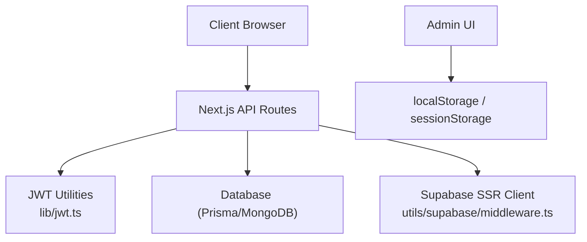
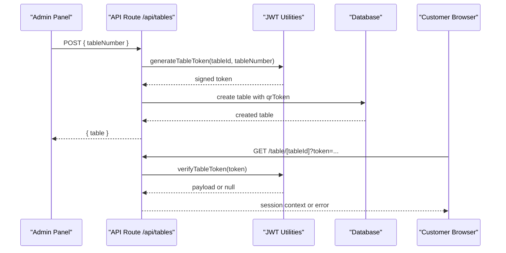
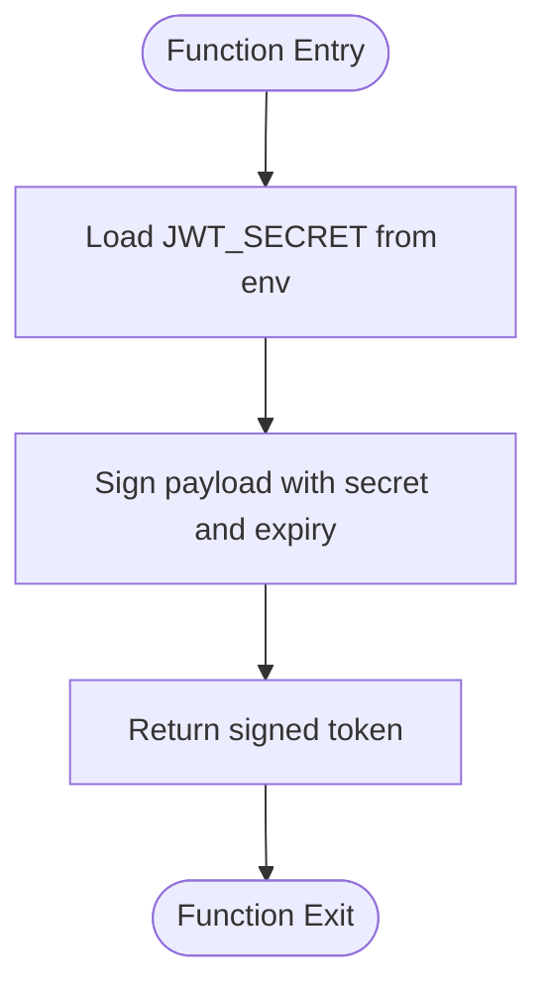
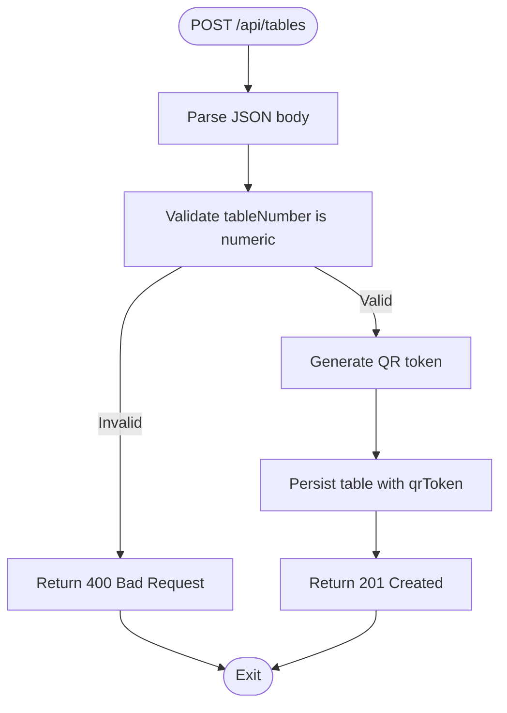
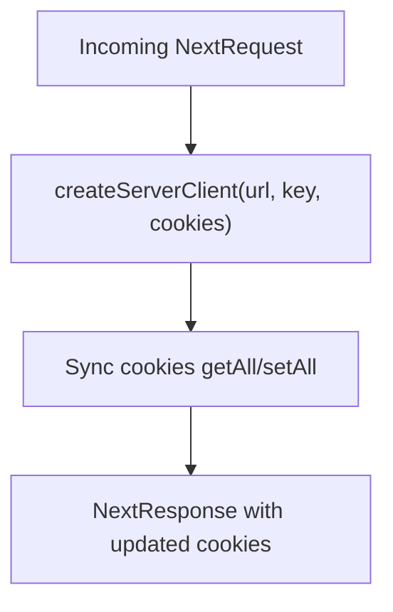
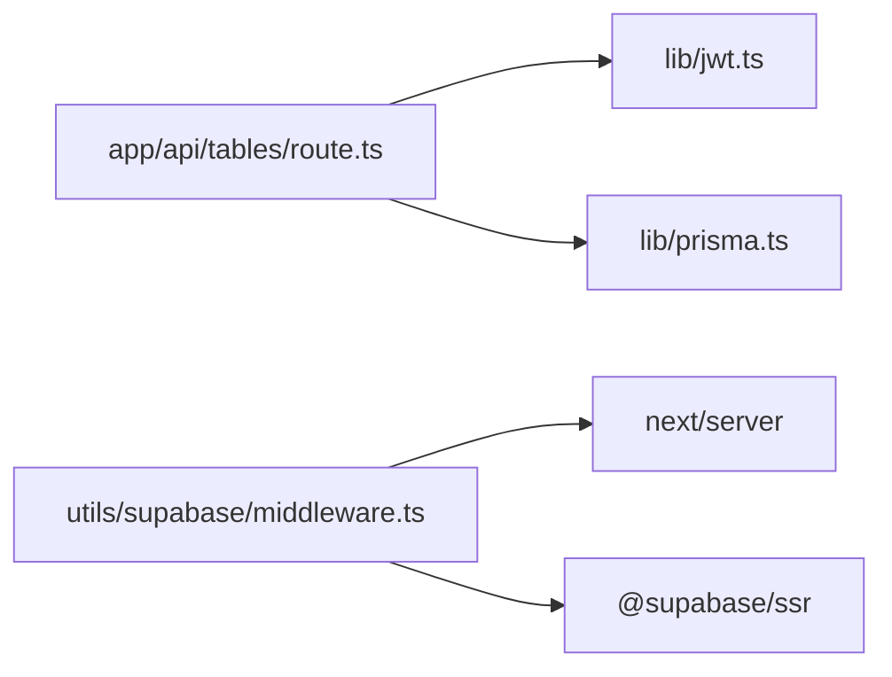

# Authentication & Security

<cite>
**Referenced Files in This Document**
- [README.md](file://README.md)
- [jwt.ts](file://lib/jwt.ts)
- [route.ts](file://app/api/tables/route.ts)
- [middleware.ts](file://utils/supabase/middleware.ts)
</cite>

## Table of Contents
1. [Introduction](#introduction)
2. [Project Structure](#project-structure)
3. [Core Components](#core-components)
4. [Architecture Overview](#architecture-overview)
5. [Detailed Component Analysis](#detailed-component-analysis)
6. [Dependency Analysis](#dependency-analysis)
7. [Performance Considerations](#performance-considerations)
8. [Troubleshooting Guide](#troubleshooting-guide)
9. [Conclusion](#conclusion)

## Introduction
This document explains the authentication and security implementation for the Warkop Betawa system, focusing on:
- JWT token generation and validation for table sessions
- Local admin authentication using localStorage/sessionStorage
- Supabase middleware integration
- Security considerations including input validation, XSS prevention, CSRF protection, and data sanitization
- Session management, token expiration handling, and production best practices

The system is a Next.js application with server-side API routes and client-side storage for local admin sessions.

## Project Structure
Key files involved in authentication and security:
- lib/jwt.ts: JWT utilities for generating and verifying table tokens
- app/api/tables/route.ts: API route that creates tables and issues QR tokens
- utils/supabase/middleware.ts: Supabase SSR client helper for request/response cookie handling
- README.md: High-level overview of routes and admin login behavior

**Diagram sources**
- [jwt.ts:1-29](file://lib/jwt.ts#L1-L29)
- [route.ts:1-34](file://app/api/tables/route.ts#L1-L34)
- [middleware.ts:1-38](file://utils/supabase/middleware.ts#L1-L38)

**Section sources**
- [README.md:53-105](file://README.md#L53-L105)

## Core Components
- JWT Token Utilities: Generate and verify short-lived tokens for table sessions.
- Tables API Route: Creates tables and persists signed QR tokens.
- Supabase Middleware: Provides a server-side Supabase client with cookie synchronization for authenticated requests.
- Local Admin Auth: Simple client-side auth stored in browser storage for the admin panel.

**Section sources**
- [jwt.ts:1-29](file://lib/jwt.ts#L1-L29)
- [route.ts:1-34](file://app/api/tables/route.ts#L1-L34)
- [middleware.ts:1-38](file://utils/supabase/middleware.ts#L1-L38)
- [README.md:98-105](file://README.md#L98-L105)

## Architecture Overview
End-to-end flow for table session token issuance and verification:

**Diagram sources**
- [route.ts:18-33](file://app/api/tables/route.ts#L18-L33)
- [jwt.ts:15-27](file://lib/jwt.ts#L15-L27)

## Detailed Component Analysis

### JWT Token Generation and Validation
Responsibilities:
- Sign a token containing table identity and number with an expiration window.
- Verify tokens and return typed payloads or null on failure.

Security notes:
- Secret key is read from environment; fallback value exists in code.
- Expiration is set to a limited duration to reduce risk if leaked.
- Verification catches errors and returns null to avoid leaking internals.

Recommendations:
- Enforce a strong secret via environment variables only (no fallback).
- Rotate secrets periodically and support multi-environment configs.
- Validate token audience/issuer if integrating multiple services.

**Diagram sources**
- [jwt.ts:1-17](file://lib/jwt.ts#L1-L17)

**Section sources**
- [jwt.ts:1-29](file://lib/jwt.ts#L1-L29)

### Tables API Route (QR Token Issuance)
Responsibilities:
- List tables and create new tables.
- On creation, generate a signed QR token and persist it alongside the table record.

Input validation:
- Reads tableNumber from JSON body; ensure numeric validation before use.
- Constructs deterministic table id based on tableNumber.

Error handling:
- Catches database errors and returns user-friendly messages with appropriate status codes.

Best practices:
- Add explicit input validation and sanitization for tableNumber.
- Avoid returning internal stack traces to clients.
- Rate-limit table creation endpoints to prevent abuse.

**Diagram sources**
- [route.ts:18-33](file://app/api/tables/route.ts#L18-L33)

**Section sources**
- [route.ts:1-34](file://app/api/tables/route.ts#L1-L34)

### Supabase Middleware Integration
Responsibilities:
- Create a server-side Supabase client bound to the current request.
- Synchronize cookies between the incoming request and outgoing response.

Usage pattern:
- Use this helper in middleware or server components to access Supabase with proper session cookies.

Security notes:
- Ensure NEXT_PUBLIC_SUPABASE_URL and NEXT_PUBLIC_SUPABASE_PUBLISHABLE_KEY are configured.
- Prefer RLS policies on the Supabase side to enforce row-level security.
- Keep non-public keys out of the client bundle.

**Diagram sources**
- [middleware.ts:1-38](file://utils/supabase/middleware.ts#L1-L38)

**Section sources**
- [middleware.ts:1-38](file://utils/supabase/middleware.ts#L1-L38)

### Local Admin Authentication (localStorage/sessionStorage)
Behavior:
- Admin login is local-only and stores credentials or session state in localStorage/sessionStorage.
- Not intended as a production-grade authentication mechanism.

Security implications:
- Credentials stored in browser storage are vulnerable to XSS and theft if not properly sanitized.
- No server-side session validation for admin routes shown here.

Recommendations:
- Migrate to server-side sessions or secure HTTP-only cookies.
- Implement role-based authorization checks on protected routes.
- Enforce password policies and consider hashing stored admin credentials.

**Section sources**
- [README.md:98-105](file://README.md#L98-L105)

## Dependency Analysis
High-level dependencies among authentication-related modules:

**Diagram sources**
- [route.ts:1-5](file://app/api/tables/route.ts#L1-L5)
- [jwt.ts:1-2](file://lib/jwt.ts#L1-L2)
- [middleware.ts:1-3](file://utils/supabase/middleware.ts#L1-L3)

**Section sources**
- [route.ts:1-34](file://app/api/tables/route.ts#L1-L34)
- [jwt.ts:1-29](file://lib/jwt.ts#L1-L29)
- [middleware.ts:1-38](file://utils/supabase/middleware.ts#L1-L38)

## Performance Considerations
- JWT signing/verification is lightweight; keep token payloads minimal.
- Avoid repeated DB calls by caching table lists where appropriate.
- For high traffic, consider rate limiting table creation and token verification endpoints.
- Use connection pooling and efficient queries in the database layer.

[No sources needed since this section provides general guidance]

## Troubleshooting Guide
Common issues and resolutions:
- Invalid or expired table token:
  - Cause: Token expired or secret mismatch.
  - Resolution: Regenerate QR token; ensure JWT_SECRET is consistent across environments.
- Supabase client not receiving cookies:
  - Cause: Cookie sync not configured or misconfigured environment variables.
  - Resolution: Verify NEXT_PUBLIC_SUPABASE_URL and NEXT_PUBLIC_SUPABASE_PUBLISHABLE_KEY; confirm cookie sync in middleware.
- Admin panel not persisting session:
  - Cause: Using sessionStorage vs localStorage inconsistently or clearing storage.
  - Resolution: Standardize storage strategy and add persistence checks.

Operational tips:
- Log verification failures without exposing sensitive details.
- Monitor token generation rates to detect abuse.
- Validate all inputs at API boundaries and sanitize outputs.

**Section sources**
- [jwt.ts:22-27](file://lib/jwt.ts#L22-L27)
- [route.ts:29-32](file://app/api/tables/route.ts#L29-L32)
- [middleware.ts:4-6](file://utils/supabase/middleware.ts#L4-L6)

## Conclusion
The Warkop Betawa system implements:
- Short-lived JWT tokens for table sessions, generated and verified securely.
- A simple local admin authentication model suitable for development but requiring hardening for production.
- Supabase middleware for server-side client initialization with cookie synchronization.

For production readiness:
- Enforce strict environment configuration for secrets and keys.
- Add robust input validation and output sanitization across all APIs.
- Implement CSRF protections and XSS prevention measures.
- Migrate admin auth to server-side sessions or secure HTTP-only cookies with role-based access control.
- Apply rate limiting, logging, and monitoring to protect against abuse and facilitate incident response.

[No sources needed since this section summarizes without analyzing specific files]