# Admin Dashboard

<cite>
**Referenced Files in This Document**
- [README.md](file://README.md)
- [app/admin/page.tsx](file://app/admin/page.tsx)
- [components/admin/AnalyticsDashboard.tsx](file://components/admin/AnalyticsDashboard.tsx)
- [app/api/menu/route.ts](file://app/api/menu/route.ts)
- [app/api/menu/[id]/route.ts](file://app/api/menu/[id]/route.ts)
- [app/api/categories/route.ts](file://app/api/categories/route.ts)
- [app/api/categories/[id]/route.ts](file://app/api/categories/[id]/route.ts)
- [app/api/orders/route.ts](file://app/api/orders/route.ts)
- [app/api/orders/[id]/route.ts](file://app/api/orders/[id]/route.ts)
- [app/api/promos/route.ts](file://app/api/promos/route.ts)
- [app/api/promos/[id]/route.ts](file://app/api/promos/[id]/route.ts)
- [app/order/[orderId]/page.tsx](file://app/order/[orderId]/page.tsx)
</cite>

## Update Summary
**Changes Made**
- Enhanced OrderDetailModal component with comprehensive payment management interface
- Added separate controls for kitchen order status and payment status management
- Implemented visual indicators for payment states with color-coded badges
- Integrated payment method selection (cash/QRIS) with real-time status updates
- Added toggle functionality for quick payment status changes in order list
- Enhanced order monitoring with dual-status tracking (kitchen + payment)

## Table of Contents
1. [Introduction](#introduction)
2. [Project Structure](#project-structure)
3. [Core Components](#core-components)
4. [Architecture Overview](#architecture-overview)
5. [Detailed Component Analysis](#detailed-component-analysis)
6. [Dependency Analysis](#dependency-analysis)
7. [Performance Considerations](#performance-considerations)
8. [Security and Validation](#security-and-validation)
9. [Bulk Operations](#bulk-operations)
10. [Troubleshooting Guide](#troubleshooting-guide)
11. [Conclusion](#conclusion)

## Introduction
This document describes the Admin Dashboard for a Next.js 14 restaurant ordering system. It covers:
- Restaurant management: menu items, categories, orders, promotions, coupons, inventory, analytics, notifications, and settings.
- Advanced analytics dashboard with real-time business intelligence and comprehensive reporting.
- Authentication and session handling (local-only).
- Real-time order status updates via polling with enhanced monitoring capabilities.
- **Enhanced**: Comprehensive payment management interface with separate kitchen and payment status controls.
- Dashboard layout, navigation patterns, and data visualization components.
- Security considerations, input validation, and bulk operation capabilities.

The admin panel is accessible at `/admin` and uses local credentials stored in browser storage for demonstration purposes.

**Section sources**
- [README.md:53-105](file://README.md#L53-L105)

## Project Structure
The admin dashboard is implemented as a single-page client component with multiple feature pages rendered conditionally. API routes under `app/api` provide CRUD operations for menu, categories, orders, promos, and more. The new AnalyticsDashboard component provides comprehensive business intelligence capabilities.

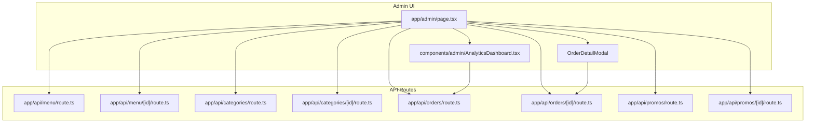

**Diagram sources**
- [app/admin/page.tsx:1381-1499](file://app/admin/page.tsx#L1381-L1499)
- [components/admin/AnalyticsDashboard.tsx:100-172](file://components/admin/AnalyticsDashboard.tsx#L100-L172)
- [app/api/menu/route.ts:1-109](file://app/api/menu/route.ts#L1-L109)
- [app/api/menu/[id]/route.ts:1-81](file://app/api/menu/[id]/route.ts#L1-L81)
- [app/api/categories/route.ts:1-47](file://app/api/categories/route.ts#L1-L47)
- [app/api/categories/[id]/route.ts:1-53](file://app/api/categories/[id]/route.ts#L1-L53)
- [app/api/orders/route.ts:1-245](file://app/api/orders/route.ts#L1-L245)
- [app/api/orders/[id]/route.ts:1-97](file://app/api/orders/[id]/route.ts#L1-L97)
- [app/api/promos/route.ts:1-38](file://app/api/promos/route.ts#L1-L38)
- [app/api/promos/[id]/route.ts:1-52](file://app/api/promos/[id]/route.ts#L1-L52)

**Section sources**
- [app/admin/page.tsx:1381-1499](file://app/admin/page.tsx#L1381-L1499)
- [README.md:53-105](file://README.md#L53-L105)

## Core Components
- Dashboard overview: KPIs (menu count, sold items, revenue, orders), recent orders table, and quick stats.
- Menu management: Create, edit, delete menu items; image upload; add-ons and spice levels; category selection by slug.
- Category management: Create, update, delete categories; auto-generated slugs; sort order.
- **Enhanced Order Monitoring**: List orders, search/filter by code/table/status/payment, open detail modal with comprehensive payment management interface.
- **NEW**: Advanced Analytics Dashboard with real-time business intelligence, interactive charts, and comprehensive reporting.
- Promotions administration: Create, edit, toggle active/inactive, delete promos.
- Coupons administration: Create/edit coupons with percentage or fixed discount, min order amount, max discount cap, date range, daily availability.
- Inventory view: Read-only list of menu items with status.
- Notifications: Local-only notification center with read/unread states.
- Settings: Restaurant info, tax/service rates, local admin credentials.

Key UI primitives:
- Modal/ConfirmModal for dialogs.
- DataTable for tabular data.
- Badge for status labels.
- Toast for transient messages.

**Section sources**
- [app/admin/page.tsx:79-116](file://app/admin/page.tsx#L79-L116)
- [app/admin/page.tsx:118-269](file://app/admin/page.tsx#L118-L269)
- [app/admin/page.tsx:271-505](file://app/admin/page.tsx#L271-L505)
- [app/admin/page.tsx:507-553](file://app/admin/page.tsx#L507-L553)
- [app/admin/page.tsx:555-727](file://app/admin/page.tsx#L555-L727)
- [app/admin/page.tsx:729-765](file://app/admin/page.tsx#L729-L765)
- [app/admin/page.tsx:767-812](file://app/admin/page.tsx#L767-L812)
- [app/admin/page.tsx:814-865](file://app/admin/page.tsx#L814-L865)
- [app/admin/page.tsx:867-908](file://app/admin/page.tsx#L867-L908)
- [app/admin/page.tsx:910-949](file://app/admin/page.tsx#L910-L949)
- [app/admin/page.tsx:951-969](file://app/admin/page.tsx#L951-L969)
- [app/admin/page.tsx:971-1008](file://app/admin/page.tsx#L971-L1008)
- [app/admin/page.tsx:1010-1184](file://app/admin/page.tsx#L1010-L1184)
- [app/admin/page.tsx:1186-1203](file://app/admin/page.tsx#L1186-L1203)
- [app/admin/page.tsx:1205-1251](file://app/admin/page.tsx#L1205-L1251)
- [app/admin/page.tsx:1253-1322](file://app/admin/page.tsx#L1253-L1322)

## Architecture Overview
The admin dashboard follows a client-side SPA pattern within a Next.js app. The root page renders different views based on state, while API routes handle persistence and business logic. The new AnalyticsDashboard component integrates seamlessly with the existing architecture while providing enhanced real-time capabilities.

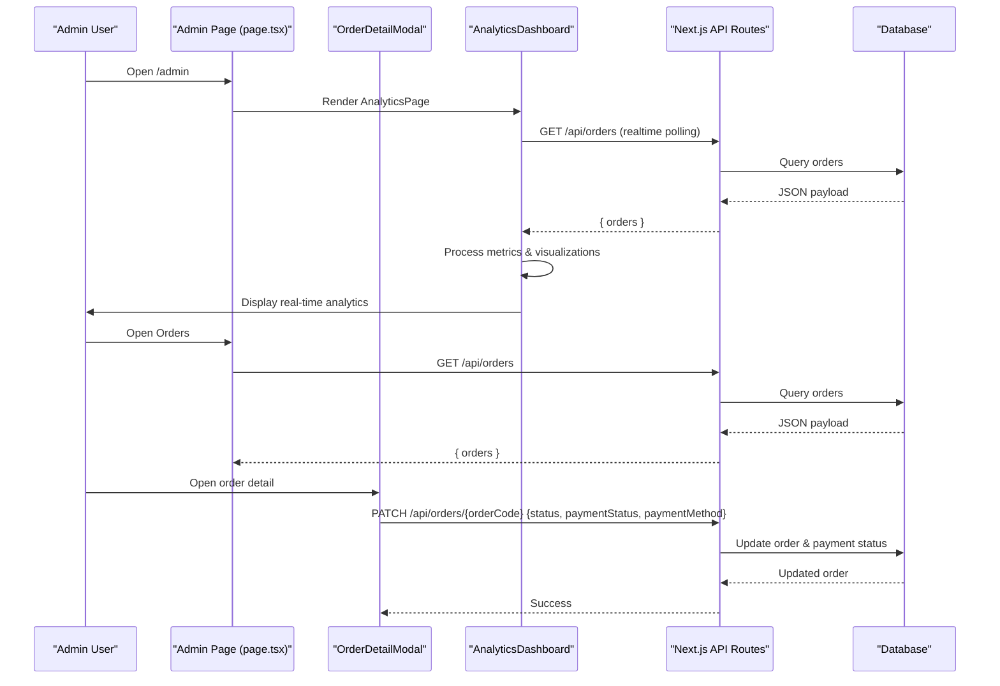

**Diagram sources**
- [app/admin/page.tsx:767-812](file://app/admin/page.tsx#L767-L812)
- [app/admin/page.tsx:910-949](file://app/admin/page.tsx#L910-L949)
- [components/admin/AnalyticsDashboard.tsx:130-172](file://components/admin/AnalyticsDashboard.tsx#L130-L172)
- [app/api/menu/route.ts:7-65](file://app/api/menu/route.ts#L7-L65)
- [app/api/orders/route.ts:12-21](file://app/api/orders/route.ts#L12-L21)
- [app/api/orders/[id]/route.ts:25-75](file://app/api/orders/[id]/route.ts#L25-L75)

## Detailed Component Analysis

### Authentication and Session Handling
- Local login form validates username/password against locally stored admin credentials.
- Session is maintained via sessionStorage and optional localStorage remember-me flag.
- Credentials can be updated in Settings; changes persist to local storage only.

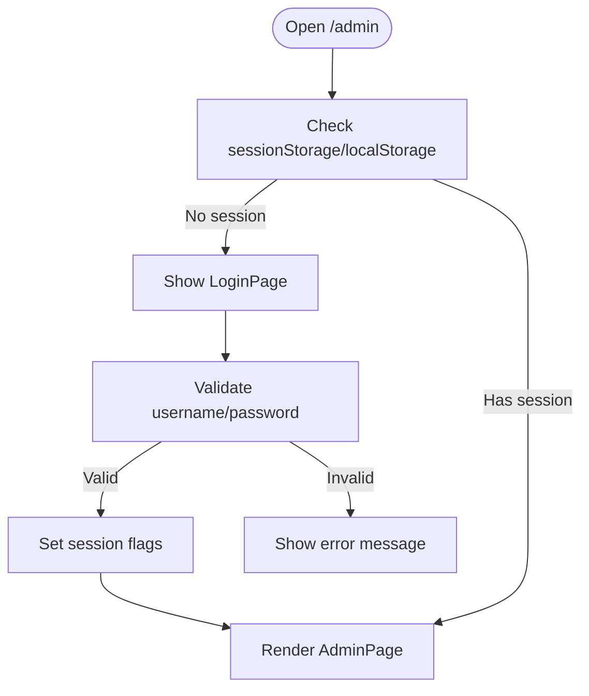

**Diagram sources**
- [app/admin/page.tsx:1324-1356](file://app/admin/page.tsx#L1324-L1356)
- [app/admin/page.tsx:1381-1408](file://app/admin/page.tsx#L1381-L1408)
- [app/admin/page.tsx:1253-1322](file://app/admin/page.tsx#L1253-L1322)

**Section sources**
- [app/admin/page.tsx:1324-1356](file://app/admin/page.tsx#L1324-L1356)
- [app/admin/page.tsx:1381-1408](file://app/admin/page.tsx#L1381-L1408)
- [app/admin/page.tsx:1253-1322](file://app/admin/page.tsx#L1253-L1322)

### Menu Item CRUD
- Create/Edit/Delete menu items via `/api/menu` and `/api/menu/[id]`.
- Image upload handled through a dedicated upload endpoint; preview shown in form.
- Supports add-ons and spice levels; category selected by slug.

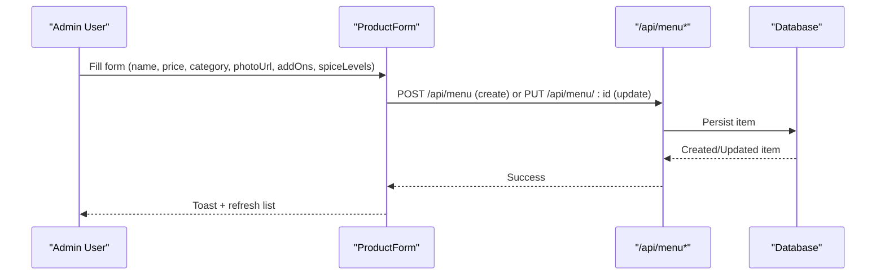

**Diagram sources**
- [app/admin/page.tsx:118-269](file://app/admin/page.tsx#L118-L269)
- [app/api/menu/route.ts:67-109](file://app/api/menu/route.ts#L67-L109)
- [app/api/menu/[id]/route.ts:22-63](file://app/api/menu/[id]/route.ts#L22-L63)

**Section sources**
- [app/admin/page.tsx:118-269](file://app/admin/page.tsx#L118-L269)
- [app/api/menu/route.ts:67-109](file://app/api/menu/route.ts#L67-L109)
- [app/api/menu/[id]/route.ts:22-63](file://app/api/menu/[id]/route.ts#L22-L63)

### Category Management
- Create/update/delete categories via `/api/categories` and `/api/categories/[id]`.
- Auto-generates slug if not provided; invalidates menu cache on mutation.

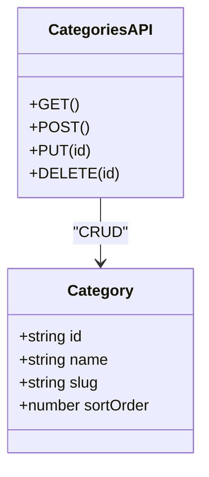

**Diagram sources**
- [app/api/categories/route.ts:1-47](file://app/api/categories/route.ts#L1-L47)
- [app/api/categories/[id]/route.ts:1-53](file://app/api/categories/[id]/route.ts#L1-L53)

**Section sources**
- [app/admin/page.tsx:729-765](file://app/admin/page.tsx#L729-L765)
- [app/api/categories/route.ts:1-47](file://app/api/categories/route.ts#L1-L47)
- [app/api/categories/[id]/route.ts:1-53](file://app/api/categories/[id]/route.ts#L1-L53)

### Enhanced Order Monitoring and Payment Management
**Updated**: The order monitoring system now features comprehensive payment management with separate controls for kitchen order status and payment status.

#### Key Features:
- **Dual Status Tracking**: Separate controls for kitchen progress (received → preparing → ready → completed) and payment status (unpaid → paid)
- **Payment Method Selection**: Support for cash payments and QRIS digital payments
- **Visual Payment Indicators**: Color-coded badges showing payment status (green for paid, red for unpaid)
- **Quick Toggle Functionality**: One-click payment status changes directly from the order list
- **Comprehensive Order Detail Modal**: Full-featured modal with item editing, payment management, and invoice printing

#### Payment Management Interface:
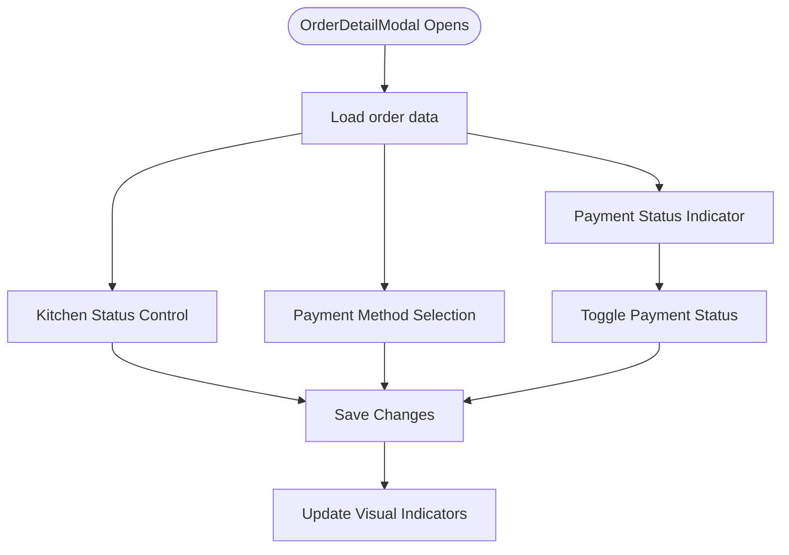

**Diagram sources**
- [app/admin/page.tsx:272-500](file://app/admin/page.tsx#L272-L500)
- [app/admin/page.tsx:983-995](file://app/admin/page.tsx#L983-L995)

#### Visual Payment Indicators:
- **Green Badge**: ✓ Lunas (Paid) - indicates successful payment completion
- **Red Badge**: ● Belum Lunas (Unpaid) - indicates pending payment
- **Color-coded Sections**: Background colors change based on payment state
- **Interactive Controls**: Buttons change appearance based on current payment status

**Section sources**
- [app/admin/page.tsx:272-500](file://app/admin/page.tsx#L272-L500)
- [app/admin/page.tsx:983-995](file://app/admin/page.tsx#L983-L995)
- [app/admin/page.tsx:1020-1055](file://app/admin/page.tsx#L1020-L1055)

### Advanced Analytics Dashboard
**NEW**: Comprehensive business intelligence dashboard with real-time monitoring and advanced analytics capabilities.

#### Key Features:
- **Real-time Order Monitoring**: Polls orders every 6 seconds with automatic detection of new orders
- **Interactive Data Visualization**: Custom SVG charts with hover tooltips and responsive design
- **Advanced Filtering**: Date ranges (today, 7 days, 30 days, monthly, custom), status filters, and search
- **Business Metrics**: Revenue tracking, average order value (AOV), peak hour analysis, best sellers
- **Export Capabilities**: Excel (CSV) and PDF report generation with comprehensive business data
- **Audio Notifications**: Pleasant chime sounds when new orders arrive
- **Peak Hour Analysis**: Identifies busiest operational hours with revenue breakdown
- **Best Seller Tracking**: Top-performing menu items with volume and revenue metrics

#### Real-time Processing:
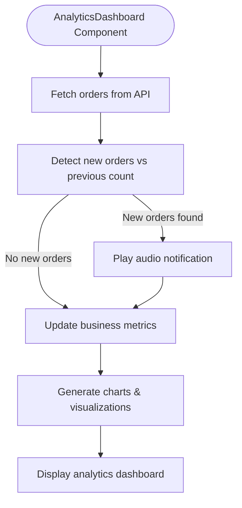

**Diagram sources**
- [components/admin/AnalyticsDashboard.tsx:130-172](file://components/admin/AnalyticsDashboard.tsx#L130-L172)
- [components/admin/AnalyticsDashboard.tsx:223-258](file://components/admin/AnalyticsDashboard.tsx#L223-L258)

**Section sources**
- [components/admin/AnalyticsDashboard.tsx:100-172](file://components/admin/AnalyticsDashboard.tsx#L100-L172)
- [components/admin/AnalyticsDashboard.tsx:223-258](file://components/admin/AnalyticsDashboard.tsx#L223-L258)
- [components/admin/AnalyticsDashboard.tsx:260-352](file://components/admin/AnalyticsDashboard.tsx#L260-L352)
- [components/admin/AnalyticsDashboard.tsx:358-429](file://components/admin/AnalyticsDashboard.tsx#L358-L429)
- [components/admin/AnalyticsDashboard.tsx:431-501](file://components/admin/AnalyticsDashboard.tsx#L431-L501)
- [components/admin/AnalyticsDashboard.tsx:503-731](file://components/admin/AnalyticsDashboard.tsx#L503-L731)

### Promotions Administration
- Create/update/delete promos via `/api/promos` and `/api/promos/[id]`.
- Toggle active/inactive status; fetch includes inactive promos for admin view.

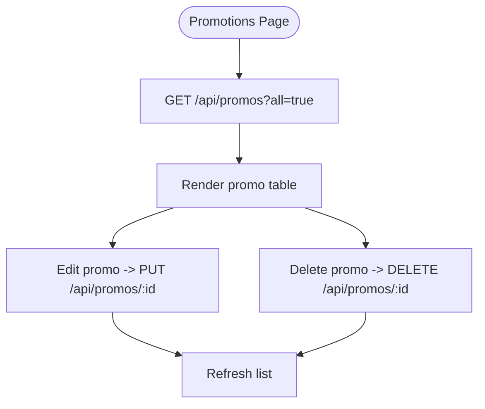

**Diagram sources**
- [app/admin/page.tsx:971-1008](file://app/admin/page.tsx#L971-L1008)
- [app/api/promos/route.ts:1-38](file://app/api/promos/route.ts#L1-L38)
- [app/api/promos/[id]/route.ts:1-52](file://app/api/promos/[id]/route.ts#L1-L52)

**Section sources**
- [app/admin/page.tsx:971-1008](file://app/admin/page.tsx#L971-L1008)
- [app/api/promos/route.ts:1-38](file://app/api/promos/route.ts#L1-L38)
- [app/api/promos/[id]/route.ts:1-52](file://app/api/promos/[id]/route.ts#L1-L52)

### Coupons Administration
- Create/edit coupons with discount type (percentage/fixed), min order amount, optional max discount cap, start/end dates, and daily availability.
- Toggle active/inactive; soft-delete deactivates rather than removes.

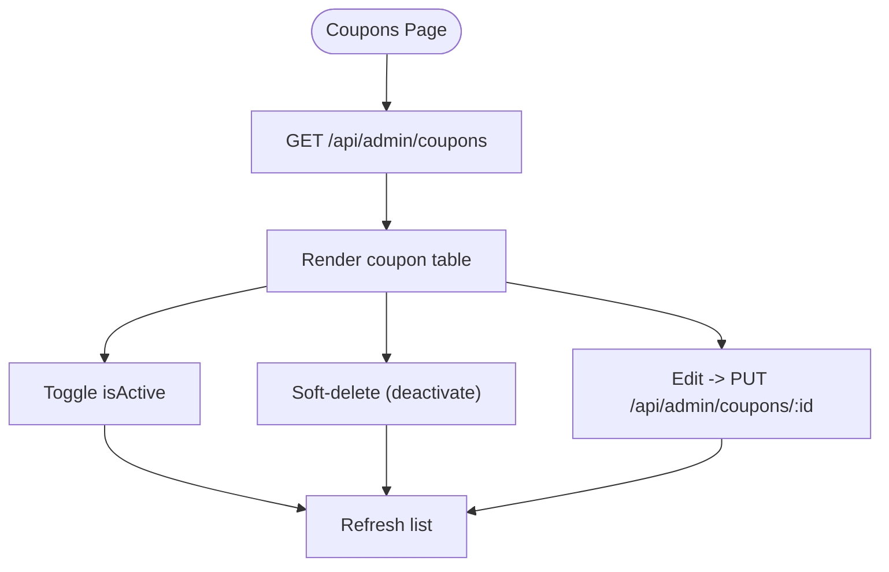

**Diagram sources**
- [app/admin/page.tsx:1010-1184](file://app/admin/page.tsx#L1010-L1184)

**Section sources**
- [app/admin/page.tsx:1010-1184](file://app/admin/page.tsx#L1010-L1184)

### Dashboard Layout and Navigation
- Collapsible sidebar with grouped navigation entries including the new Analytics section.
- Top header with breadcrumb-like labels, global search placeholder, notifications badge, and quick-add button.
- Pages render inside a main content area with consistent spacing and typography.

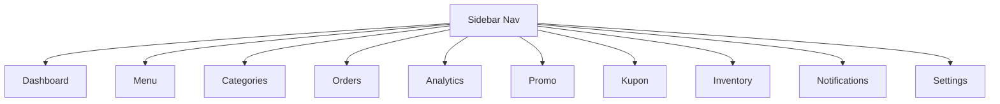

**Diagram sources**
- [app/admin/page.tsx:1358-1379](file://app/admin/page.tsx#L1358-L1379)
- [app/admin/page.tsx:1433-1491](file://app/admin/page.tsx#L1433-L1491)

**Section sources**
- [app/admin/page.tsx:1358-1379](file://app/admin/page.tsx#L1358-L1379)
- [app/admin/page.tsx:1433-1491](file://app/admin/page.tsx#L1433-L1491)

### Data Visualization Components
- StatCard for KPIs (counts, currency values).
- DataTable for structured lists (orders, menu, categories, coupons).
- Badge for status indicators across entities.
- EmptyState for empty datasets.
- **NEW**: Interactive SVG charts with custom tooltips and responsive design.

**Section sources**
- [app/admin/page.tsx:79-116](file://app/admin/page.tsx#L79-L116)
- [app/admin/page.tsx:767-812](file://app/admin/page.tsx#L767-L812)

## Dependency Analysis
The admin UI depends on several API endpoints for data retrieval and mutations. Mutations typically invalidate an in-memory menu cache to ensure consistency. The new AnalyticsDashboard component primarily depends on the orders API for real-time data processing.

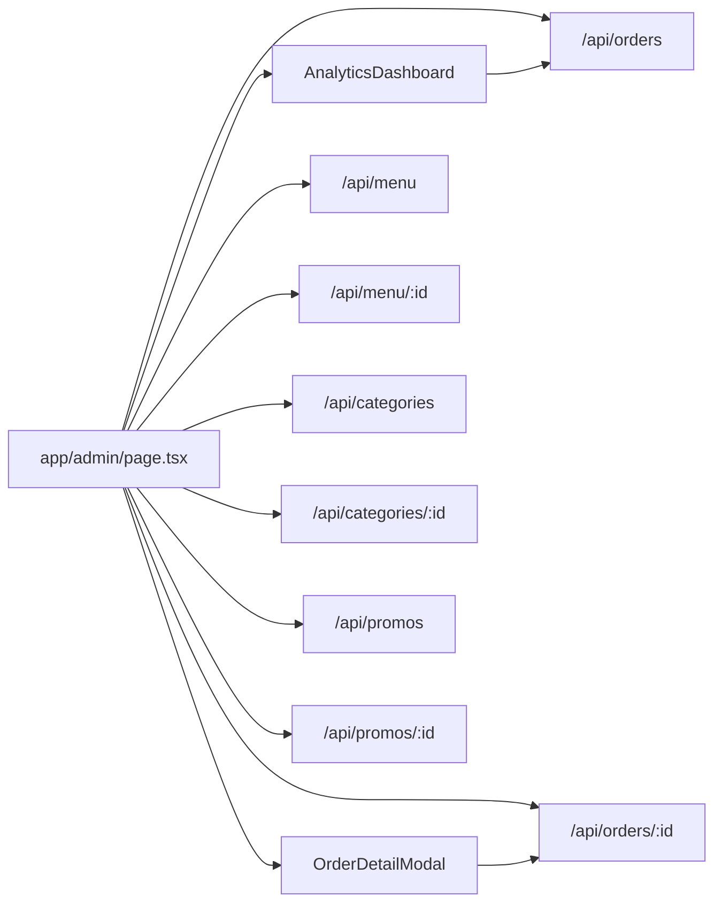

**Diagram sources**
- [app/admin/page.tsx:767-812](file://app/admin/page.tsx#L767-L812)
- [app/admin/page.tsx:814-865](file://app/admin/page.tsx#L814-L865)
- [app/admin/page.tsx:910-949](file://app/admin/page.tsx#L910-L949)
- [app/admin/page.tsx:971-1008](file://app/admin/page.tsx#L971-L1008)
- [app/admin/page.tsx:1010-1184](file://app/admin/page.tsx#L1010-L1184)
- [components/admin/AnalyticsDashboard.tsx:130-172](file://components/admin/AnalyticsDashboard.tsx#L130-L172)

**Section sources**
- [app/admin/page.tsx:767-812](file://app/admin/page.tsx#L767-L812)
- [app/admin/page.tsx:814-865](file://app/admin/page.tsx#L814-L865)
- [app/admin/page.tsx:910-949](file://app/admin/page.tsx#L910-L949)
- [app/admin/page.tsx:971-1008](file://app/admin/page.tsx#L971-L1008)
- [app/admin/page.tsx:1010-1184](file://app/admin/page.tsx#L1010-L1184)

## Performance Considerations
- Menu listing caches results in memory for public-facing reads; admin reads bypass cache when requesting inactive items.
- Orders page polls every 10 seconds to surface new orders without requiring WebSockets.
- **Enhanced**: OrderDetailModal implements efficient state management for dual-status tracking (kitchen + payment) with minimal re-renders.
- Parallel fetching of menu, orders, and categories reduces initial load time on dashboard and feature pages.
- **NEW**: AnalyticsDashboard implements efficient 6-second polling with smart change detection to minimize unnecessary re-renders.
- **NEW**: Custom SVG charts are optimized for performance with minimal DOM manipulation and efficient re-rendering.
- **NEW**: Audio notifications use Web Audio API with graceful fallbacks for browsers that don't support it.

## Security and Validation
- Order creation enforces server-side recalculation of prices, taxes, service charges, and totals; browser-supplied monetary values are ignored.
- Add-on prices are validated against database definitions to prevent tampering.
- Coupon rules are validated both before and inside a transaction to avoid race conditions.
- Input validation exists for menu names, prices, categories, and order payloads.
- **Enhanced**: Payment status changes are validated and logged for audit trail purposes.

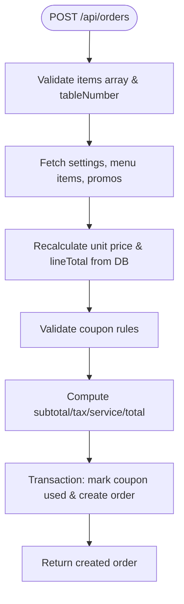

**Diagram sources**
- [app/api/orders/route.ts:23-245](file://app/api/orders/route.ts#L23-L245)

**Section sources**
- [app/api/orders/route.ts:23-245](file://app/api/orders/route.ts#L23-L245)
- [app/api/menu/route.ts:67-109](file://app/api/menu/route.ts#L67-L109)
- [app/api/menu/[id]/route.ts:22-63](file://app/api/menu/[id]/route.ts#L22-L63)

## Bulk Operations
- No explicit bulk endpoints are implemented in the referenced files.
- Common patterns available:
  - Toggle coupon active/inactive per row.
  - Quick toggle payment status per order row.
  - Soft-delete coupons (deactivation) instead of hard deletes.
- For future bulk operations, consider adding batch endpoints (e.g., PATCH /api/coupons/bulk, PATCH /api/orders/bulk-payment) and multi-select UI.

## Troubleshooting Guide
- If menu/category changes do not appear immediately, verify that the menu cache is invalidated after mutations.
- If order totals seem incorrect, confirm that the PATCH route recalculates totals using current settings.
- If login fails, check local admin credentials in Settings and ensure session flags are set correctly.
- **Enhanced**: If payment status doesn't update, verify that the togglePayment function is calling the correct API endpoint and check browser console for errors.
- **Enhanced**: If visual payment indicators aren't displaying correctly, check that the paymentStatus field is properly populated in the order data.
- **NEW**: If analytics data doesn't update, check browser console for audio permission errors and verify network connectivity to orders API.
- **NEW**: If real-time notifications aren't working, ensure browser allows audio playback and check for any JavaScript errors in the console.

**Section sources**
- [app/api/menu/route.ts:100-102](file://app/api/menu/route.ts#L100-L102)
- [app/api/orders/[id]/route.ts:43-61](file://app/api/orders/[id]/route.ts#L43-L61)
- [app/admin/page.tsx:1324-1356](file://app/admin/page.tsx#L1324-L1356)

## Conclusion
The Admin Dashboard provides a comprehensive interface for managing restaurant operations, including menu and category CRUD, enhanced order monitoring with comprehensive payment management, and promotion/coupon administration. **Significantly enhanced with the OrderDetailModal component**, the system now offers sophisticated payment management capabilities including separate kitchen and payment status controls, visual payment indicators, and real-time payment status updates. The new AnalyticsDashboard component adds advanced business intelligence capabilities including real-time order monitoring, interactive data visualization, comprehensive reporting, and audio notifications for new orders. The architecture emphasizes secure, server-side calculations for pricing and robust input validation. While authentication is local-only for demo purposes, the architecture supports extension to production-grade identity systems. Future enhancements may include bulk operations, richer analytics visualizations, WebSocket-based live updates, and advanced machine learning insights for predictive analytics.