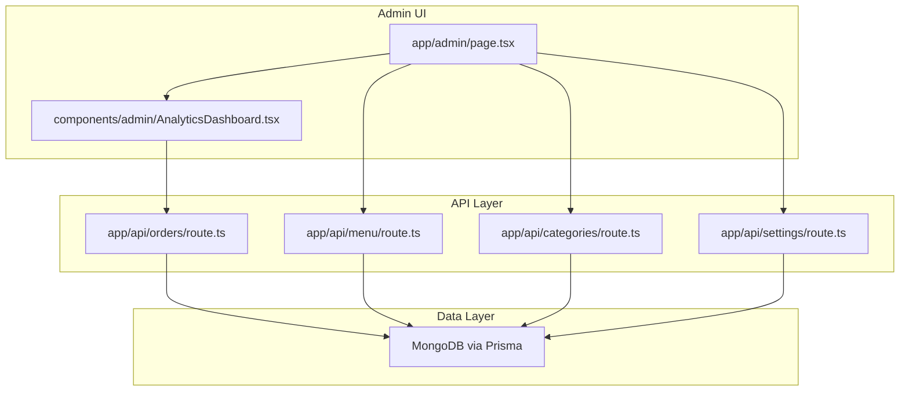
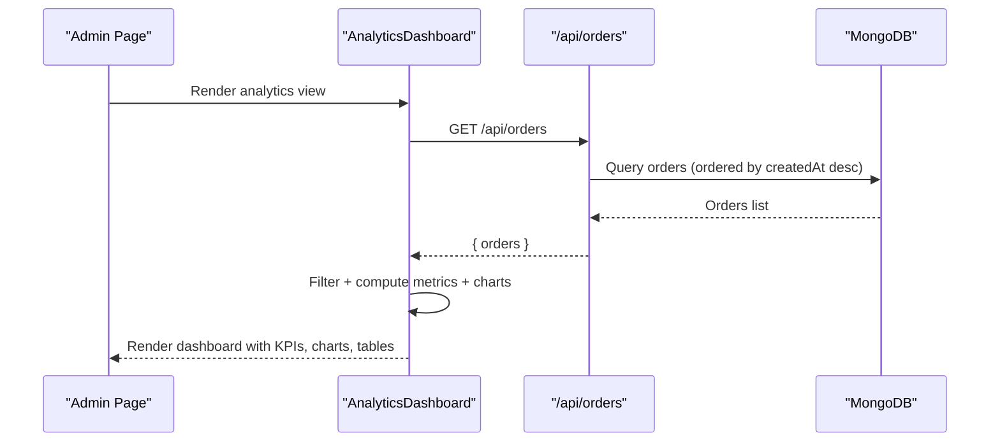
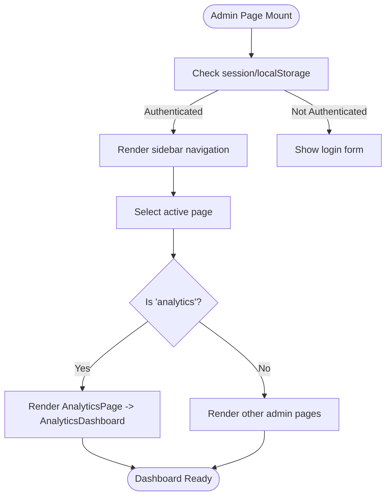
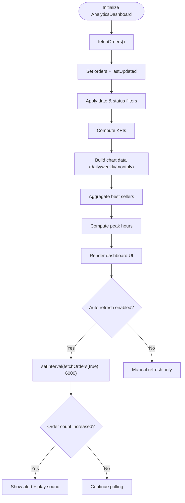
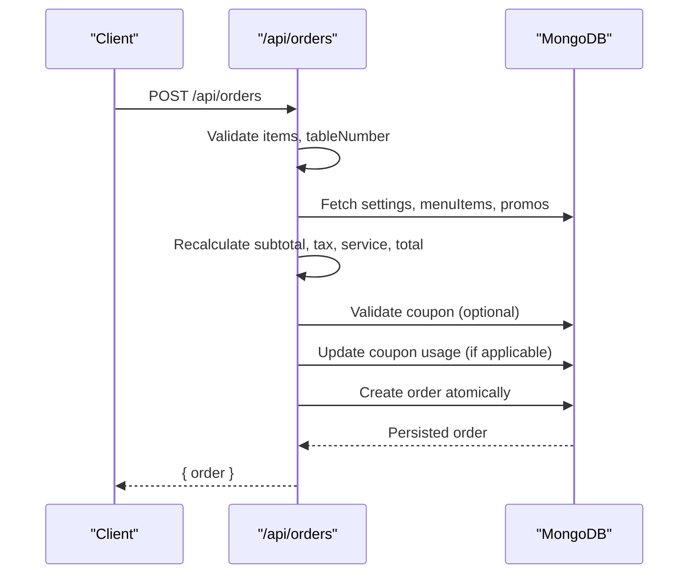
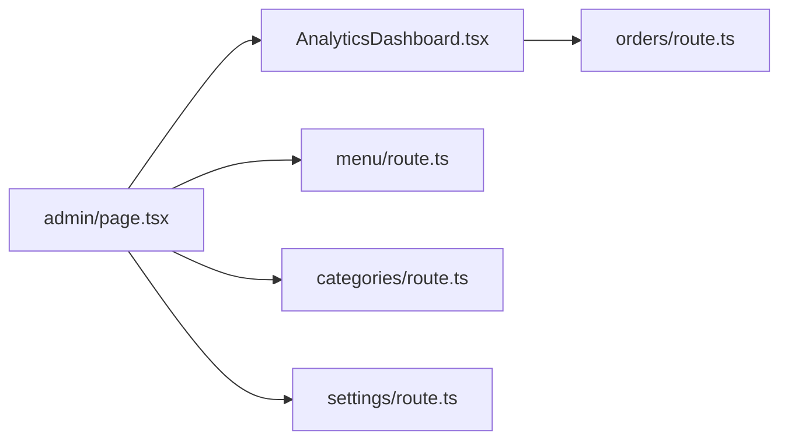

# Analytics Dashboard

<cite>
**Referenced Files in This Document**   
- [README.md](file://README.md)
- [package.json](file://package.json)
- [app/admin/page.tsx](file://app/admin/page.tsx)
- [components/admin/AnalyticsDashboard.tsx](file://components/admin/AnalyticsDashboard.tsx)
- [app/api/orders/route.ts](file://app/api/orders/route.ts)
- [app/api/menu/route.ts](file://app/api/menu/route.ts)
- [app/api/categories/route.ts](file://app/api/categories/route.ts)
- [app/api/settings/route.ts](file://app/api/settings/route.ts)
</cite>

## Table of Contents
1. [Introduction](#introduction)
2. [Project Structure](#project-structure)
3. [Core Components](#core-components)
4. [Architecture Overview](#architecture-overview)
5. [Detailed Component Analysis](#detailed-component-analysis)
6. [Dependency Analysis](#dependency-analysis)
7. [Performance Considerations](#performance-considerations)
8. [Troubleshooting Guide](#troubleshooting-guide)
9. [Conclusion](#conclusion)

## Introduction
This document explains the analytics dashboard for the Warkop Betawa restaurant ordering system. The analytics feature is part of the Next.js admin panel and focuses on real-time order monitoring, revenue visualization, best-seller analysis, peak-hour insights, and report export capabilities. It reads order data from a MongoDB-backed API and computes metrics client-side while supporting optional automatic polling and sound alerts for new orders.

The project uses:
- Next.js application routes for the admin UI and API endpoints
- Prisma with MongoDB as the database layer
- Client-side React components for analytics computation and visualization
- Optional CSV and PDF-style printable reports generated in the browser

**Section sources**
- [README.md:1-105](file://README.md#L1-L105)
- [package.json:1-42](file://package.json#L1-L42)

## Project Structure
The analytics dashboard lives under the admin section of the Next.js app:
- Admin page shell and routing logic are implemented in `app/admin/page.tsx`
- The analytics view itself is a dedicated component in `components/admin/AnalyticsDashboard.tsx`
- Order data is served by `app/api/orders/route.ts`
- Supporting menu and category data come from `app/api/menu/route.ts` and `app/api/categories/route.ts`
- Settings endpoint is at `app/api/settings/route.ts`

**Diagram sources**
- [app/admin/page.tsx:1-1495](file://app/admin/page.tsx#L1-L1495)
- [components/admin/AnalyticsDashboard.tsx:1-1505](file://components/admin/AnalyticsDashboard.tsx#L1-L1505)
- [app/api/orders/route.ts:1-245](file://app/api/orders/route.ts#L1-L245)
- [app/api/menu/route.ts:1-109](file://app/api/menu/route.ts#L1-L109)
- [app/api/categories/route.ts:1-47](file://app/api/categories/route.ts#L1-L47)
- [app/api/settings/route.ts:1-68](file://app/api/settings/route.ts#L1-L68)

**Section sources**
- [app/admin/page.tsx:1-1495](file://app/admin/page.tsx#L1-L1495)
- [components/admin/AnalyticsDashboard.tsx:1-1505](file://components/admin/AnalyticsDashboard.tsx#L1-L1505)
- [app/api/orders/route.ts:1-245](file://app/api/orders/route.ts#L1-L245)
- [app/api/menu/route.ts:1-109](file://app/api/menu/route.ts#L1-L109)
- [app/api/categories/route.ts:1-47](file://app/api/categories/route.ts#L1-L47)
- [app/api/settings/route.ts:1-68](file://app/api/settings/route.ts#L1-L68)

## Core Components
- Admin Page Shell (`app/admin/page.tsx`)
  - Provides authentication state, navigation, toast notifications, and renders analytics through an analytics page wrapper.
  - Defines shared types for products, categories, orders, promotions, coupons, settings, and admin users.
  - Exposes a simple API helper to fetch JSON from Next.js API routes and handle errors.

- Analytics Dashboard Component (`components/admin/AnalyticsDashboard.tsx`)
  - Fetches orders from `/api/orders`.
  - Supports date range filters, status filters, timeframe switching (daily/weekly/monthly), best-seller sorting, and transaction search.
  - Computes KPIs: total net revenue, order count, average order value (AOV), subtotal, tax totals, service charge totals, discount totals, and total items sold.
  - Builds chart data for daily, weekly, and monthly revenue buckets.
  - Calculates best sellers by quantity or revenue and shows volume share.
  - Computes peak hours distribution and highlights the busiest hour.
  - Offers CSV export and printable PDF-style report generation.
  - Supports auto-refresh polling and optional audio chime when new orders arrive.

**Section sources**
- [app/admin/page.tsx:1-1495](file://app/admin/page.tsx#L1-L1495)
- [components/admin/AnalyticsDashboard.tsx:1-1505](file://components/admin/AnalyticsDashboard.tsx#L1-L1505)

## Architecture Overview
The analytics dashboard follows a client-driven architecture:
- The admin page renders the analytics component.
- The analytics component polls `/api/orders` to get fresh order data.
- All analytics computations happen in the browser using React hooks and memoization.
- Data persistence and business rules live in the API layer backed by Prisma and MongoDB.

**Diagram sources**
- [app/admin/page.tsx:1374-1416](file://app/admin/page.tsx#L1374-L1416)
- [components/admin/AnalyticsDashboard.tsx:100-172](file://components/admin/AnalyticsDashboard.tsx#L100-L172)
- [app/api/orders/route.ts:11-21](file://app/api/orders/route.ts#L11-L21)

**Section sources**
- [app/admin/page.tsx:1374-1416](file://app/admin/page.tsx#L1374-L1416)
- [components/admin/AnalyticsDashboard.tsx:100-172](file://components/admin/AnalyticsDashboard.tsx#L100-L172)
- [app/api/orders/route.ts:11-21](file://app/api/orders/route.ts#L11-L21)

## Detailed Component Analysis

### Admin Page Shell
Responsibilities:
- Authentication state management for local session-based login.
- Navigation configuration and page rendering.
- Toast notification integration.
- Routing to analytics page which delegates to the analytics component.

Key behaviors:
- Renders analytics via `AnalyticsPage`, which returns `<AnalyticsDashboard onToast={onToast} />`.
- Uses shared helpers like `apiFetch` for API calls across admin pages.
- Maintains UI micro-components such as modals, badges, and stat cards reused by analytics and other admin views.

**Diagram sources**
- [app/admin/page.tsx:1374-1416](file://app/admin/page.tsx#L1374-L1416)
- [app/admin/page.tsx:1351-1371](file://app/admin/page.tsx#L1351-L1371)

**Section sources**
- [app/admin/page.tsx:1374-1416](file://app/admin/page.tsx#L1374-L1416)
- [app/admin/page.tsx:1351-1371](file://app/admin/page.tsx#L1351-L1371)

### Analytics Dashboard Component
Responsibilities:
- Fetching and maintaining order state.
- Filtering orders by date range and status.
- Computing key performance indicators.
- Building time-series chart data.
- Calculating best sellers and peak hours.
- Exporting reports to CSV and printable PDF.
- Realtime polling and optional sound alert.

Core data structures:
- Order and OrderItem interfaces define the shape of order data used throughout the dashboard.
- Metrics object aggregates totals for revenue, taxes, service charges, discounts, order count, AOV, and items sold.
- Chart data arrays contain label, revenue, and count per bucket (daily/weekly/monthly).
- Best sellers map accumulates name, qty, revenue, and orderCount, then sorts and slices top entries.
- Peak hours array tracks hourly counts and revenue, highlighting the peak hour.

Processing logic:
- Date filtering supports presets (today, 7 days, 30 days, this month, all, custom).
- Status filtering supports all non-cancelled, completed only, or all statuses.
- Timeframe switching recalculates chart buckets accordingly.
- Best seller sorting toggles between quantity and revenue.
- CSV export includes executive summary, best sellers, peak hours, and detailed transactions.
- PDF export opens a print window with structured HTML content and triggers printing.

Realtime behavior:
- Initial load fetches orders without background sync indicator.
- Auto-refresh interval polls every 6 seconds unless disabled.
- New order detection compares previous order count; if increased, shows alert banner and optionally plays a sound.

**Diagram sources**
- [components/admin/AnalyticsDashboard.tsx:100-172](file://components/admin/AnalyticsDashboard.tsx#L100-L172)
- [components/admin/AnalyticsDashboard.tsx:174-220](file://components/admin/AnalyticsDashboard.tsx#L174-L220)
- [components/admin/AnalyticsDashboard.tsx:223-258](file://components/admin/AnalyticsDashboard.tsx#L223-L258)
- [components/admin/AnalyticsDashboard.tsx:260-352](file://components/admin/AnalyticsDashboard.tsx#L260-L352)
- [components/admin/AnalyticsDashboard.tsx:358-388](file://components/admin/AnalyticsDashboard.tsx#L358-L388)
- [components/admin/AnalyticsDashboard.tsx:390-429](file://components/admin/AnalyticsDashboard.tsx#L390-L429)

**Section sources**
- [components/admin/AnalyticsDashboard.tsx:1-1505](file://components/admin/AnalyticsDashboard.tsx#L1-L1505)

### API Layer for Orders
Responsibilities:
- List orders ordered by creation time descending.
- Create orders with server-side price recalculation and coupon validation.
- Ensure security by ignoring client-supplied monetary values and validating add-ons against database prices.
- Generate human-readable order codes and persist orders atomically with coupon usage updates.

Key behaviors:
- GET returns all orders sorted newest first.
- POST validates items, table number, menu/promo references, add-ons, and coupon rules.
- Computes subtotal, tax, service charge, and total based on database settings and validated items.
- Creates order within a transaction to ensure consistency when marking coupon as used.

**Diagram sources**
- [app/api/orders/route.ts:28-245](file://app/api/orders/route.ts#L28-L245)

**Section sources**
- [app/api/orders/route.ts:1-245](file://app/api/orders/route.ts#L1-L245)

### Supporting APIs
- Menu API (`app/api/menu/route.ts`)
  - Lists active menu items and categories, with optional inclusion of inactive items for admin.
  - Caches public menu responses for performance.
  - Creates new menu items and invalidates cache on mutation.

- Categories API (`app/api/categories/route.ts`)
  - Lists categories sorted by sortOrder.
  - Creates new categories and invalidates menu cache.

- Settings API (`app/api/settings/route.ts`)
  - Retrieves settings with fallback to static defaults.
  - Updates tax rate and service charge percentages, plus restaurant info.

**Section sources**
- [app/api/menu/route.ts:1-109](file://app/api/menu/route.ts#L1-L109)
- [app/api/categories/route.ts:1-47](file://app/api/categories/route.ts#L1-L47)
- [app/api/settings/route.ts:1-68](file://app/api/settings/route.ts#L1-L68)

## Dependency Analysis
The analytics dashboard depends on:
- Admin page shell for navigation and context.
- Orders API for order data.
- Menu and categories APIs for related admin features.
- Settings API for tax/service rates affecting order totals.

**Diagram sources**
- [components/admin/AnalyticsDashboard.tsx:1-1505](file://components/admin/AnalyticsDashboard.tsx#L1-L1505)
- [app/admin/page.tsx:1-1495](file://app/admin/page.tsx#L1-L1495)
- [app/api/orders/route.ts:1-245](file://app/api/orders/route.ts#L1-L245)
- [app/api/menu/route.ts:1-109](file://app/api/menu/route.ts#L1-L109)
- [app/api/categories/route.ts:1-47](file://app/api/categories/route.ts#L1-L47)
- [app/api/settings/route.ts:1-68](file://app/api/settings/route.ts#L1-L68)

**Section sources**
- [components/admin/AnalyticsDashboard.tsx:1-1505](file://components/admin/AnalyticsDashboard.tsx#L1-L1505)
- [app/admin/page.tsx:1-1495](file://app/admin/page.tsx#L1-L1495)
- [app/api/orders/route.ts:1-245](file://app/api/orders/route.ts#L1-L245)
- [app/api/menu/route.ts:1-109](file://app/api/menu/route.ts#L1-L109)
- [app/api/categories/route.ts:1-47](file://app/api/categories/route.ts#L1-L47)
- [app/api/settings/route.ts:1-68](file://app/api/settings/route.ts#L1-L68)

## Performance Considerations
- Client-side computation:
  - Metrics, chart data, best sellers, and peak hours are computed using `useMemo` to avoid unnecessary recalculations.
  - Filtering and aggregation run in-memory after fetching orders, reducing server load for analytics queries.

- API caching:
  - Public menu data is cached in memory to reduce database hits and improve response times.
  - Cache invalidation occurs on menu/category mutations.

- Realtime polling:
  - Automatic polling runs every 6 seconds; can be disabled to reduce network traffic.
  - New order detection avoids redundant UI updates by comparing order counts.

- Export operations:
  - CSV export builds a Blob and triggers download in the browser.
  - PDF export opens a new window with styled HTML and invokes print; consider user pop-up permissions.

[No sources needed since this section provides general guidance]

## Troubleshooting Guide
Common issues and resolutions:
- Orders not loading:
  - Verify `/api/orders` returns a valid JSON response.
  - Check browser console for fetch errors and network tab for HTTP status codes.

- Realtime alerts not appearing:
  - Ensure auto-refresh is enabled.
  - Confirm that order count increases between polls.
  - Check browser audio permissions if sound alerts are expected.

- Export failures:
  - CSV export may fail due to Blob URL handling; verify browser compatibility.
  - PDF export requires pop-ups to be allowed; instruct users to enable pop-ups if blocked.

- Incorrect metrics:
  - Validate date range and status filters.
  - Confirm order timestamps exist and are correctly parsed.
  - Ensure order totals, taxes, and service charges are calculated server-side.

**Section sources**
- [components/admin/AnalyticsDashboard.tsx:130-172](file://components/admin/AnalyticsDashboard.tsx#L130-L172)
- [components/admin/AnalyticsDashboard.tsx:431-501](file://components/admin/AnalyticsDashboard.tsx#L431-L501)
- [components/admin/AnalyticsDashboard.tsx:503-731](file://components/admin/AnalyticsDashboard.tsx#L503-L731)
- [app/api/orders/route.ts:11-21](file://app/api/orders/route.ts#L11-L21)

## Conclusion
The analytics dashboard provides a comprehensive, client-driven view of restaurant performance. It integrates seamlessly with the Next.js admin shell, pulls order data from a secure API layer, and computes actionable insights locally. Features include real-time polling, flexible filtering, interactive charts, best-seller rankings, peak-hour analysis, and exportable reports. With careful attention to performance and error handling, it offers a robust foundation for operational decision-making.

[No sources needed since this section summarizes without analyzing specific files]