Based on my analysis of the codebase, I can now update the documentation to reflect the enhanced checkout flow with payment method selection interface supporting cash and QRIS options, and improved order status display with payment information. Here's the updated documentation:

# Cart & Ordering System

<cite>
**Referenced Files in This Document**
- [page.tsx](file://app/cart/page.tsx)
- [page.tsx](file://app/checkout/page.tsx)
- [FloatingCart.tsx](file://components/FloatingCart.tsx)
- [store.ts](file://lib/store.ts)
- [types.ts](file://lib/types.ts)
- [route.ts](file://app/api/orders/route.ts)
- [route.ts](file://app/api/coupons/validate/route.ts)
- [coupon.ts](file://lib/coupon.ts)
- [page.tsx](file://app/order/[orderId]/page.tsx)
- [route.ts](file://app/api/orders/[id]/route.ts)
</cite>

## Update Summary
**Changes Made**
- Enhanced checkout flow with payment method selection interface supporting cash and QRIS options
- Improved order status display with payment information including payment method and payment status
- Updated API routes to handle payment method validation and storage
- Enhanced order confirmation page with payment status tracking and digital receipt improvements
- Added comprehensive payment method handling throughout the ordering workflow

## Table of Contents
1. [Introduction](#introduction)
2. [Project Structure](#project-structure)
3. [Core Components](#core-components)
4. [Architecture Overview](#architecture-overview)
5. [Detailed Component Analysis](#detailed-component-analysis)
6. [Dependency Analysis](#dependency-analysis)
7. [Performance Considerations](#performance-considerations)
8. [Troubleshooting Guide](#troubleshooting-guide)
9. [Conclusion](#conclusion)

## Introduction
This document explains the shopping cart and ordering workflow implemented in the application. It covers how cart state is managed using local storage, how item quantities are controlled, how prices are calculated, and how real-time updates are synchronized across components through an event-driven store. The system now includes a comprehensive order history feature that persists order data locally, provides real-time status monitoring, and offers seamless navigation between cart and order history views. It also documents the enhanced checkout process with payment method selection (cash and QRIS), order validation, robust coupon handling with business rule validation, parallel data fetching optimization, server-side price recalculation, and the order confirmation flow with live status polling and payment status tracking. Finally, it describes the enhanced floating cart component behavior with integrated order history, cross-component communication patterns, error handling, validation rules, and enhanced user experience considerations.

## Project Structure
The cart and ordering system spans client pages, a shared store, API routes, and types:

- Client pages:
  - Cart page for reviewing items, adjusting quantities, viewing totals, and accessing order history.
  - Checkout page for table number input, coupon application with parallel data fetching, upsell promos, payment method selection, order submission, and automatic order history persistence.
  - Order status page for live order tracking, payment status monitoring, and digital receipt generation.
- Shared store:
  - Local storage-backed cart state, notes, manual table number, order history (up to 50 entries), and an event emitter for reactive updates.
- API routes:
  - Order creation endpoint that validates inputs, verifies menu/promo items, applies coupons with transaction safety, recalculates totals, handles payment methods, and persists orders atomically.
  - Order retrieval endpoint for individual order details and status updates including payment information.
  - Coupon validation endpoint used during checkout to preview discounts with comprehensive business rule validation.
- Types:
  - Shared TypeScript interfaces for menu items, add-ons, orders with payment fields, coupons, settings, order history entries, and related entities.

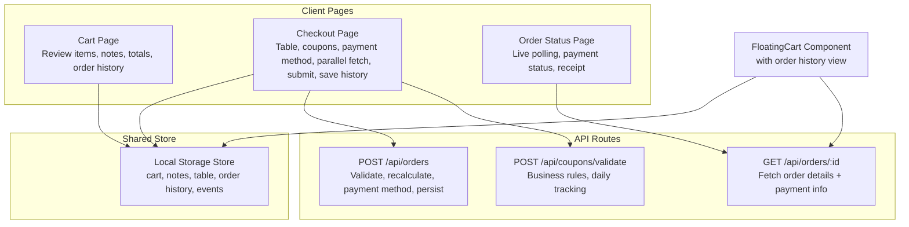

**Diagram sources**
- [page.tsx:19-48](file://app/cart/page.tsx#L19-L48)
- [page.tsx:22-73](file://app/checkout/page.tsx#L22-L73)
- [FloatingCart.tsx:22-39](file://components/FloatingCart.tsx#L22-L39)
- [store.ts:67-97](file://lib/store.ts#L67-L97)
- [route.ts:23-236](file://app/api/orders/route.ts#L23-L236)
- [route.ts:6-58](file://app/api/coupons/validate/route.ts#L6-L58)
- [page.tsx:10-53](file://app/order/[orderId]/page.tsx#L10-L53)
- [route.ts:6-23](file://app/api/orders/[id]/route.ts#L6-L23)

**Section sources**
- [page.tsx:19-48](file://app/cart/page.tsx#L19-L48)
- [page.tsx:22-73](file://app/checkout/page.tsx#L22-L73)
- [FloatingCart.tsx:22-39](file://components/FloatingCart.tsx#L22-L39)
- [store.ts:67-97](file://lib/store.ts#L67-L97)
- [route.ts:23-236](file://app/api/orders/route.ts#L23-L236)
- [route.ts:6-58](file://app/api/coupons/validate/route.ts#L6-L58)
- [page.tsx:10-53](file://app/order/[orderId]/page.tsx#L10-L53)
- [route.ts:6-23](file://app/api/orders/[id]/route.ts#L6-L23)

## Core Components
- Cart page:
  - Loads tax/service rates from settings, reads cart items and notes from the store, subscribes to store events for real-time updates, computes subtotal/tax/service/total, displays order history count, and navigates to checkout or specific orders.
- Checkout page:
  - Reads cart items, manual table number, and notes; fetches promos, settings, known tables, and active coupons in parallel using Promise.all(); supports comprehensive coupon validation with business rules; **includes payment method selection interface with cash and QRIS options**; calculates preview totals; submits order via API with payment method; automatically saves order to local history; clears cart on success and redirects to order confirmation.
- Floating cart:
  - Slides in/out as a sidebar; displays current cart items, quantity controls, remove actions, subtotal, and navigation to checkout; shows manual table badge when available; includes integrated order history view with real-time status monitoring and beautiful UI with status badges and item previews.
- Store:
  - Persists cart items, order notes, manual table number, table session, and order history (up to 50 entries) to local storage; provides functions to add/update/remove items; emits events to notify subscribers of changes; includes order history management functions.
- API routes:
  - Order creation validates inputs, verifies menu/promo items against database, validates add-ons, applies coupons with transaction safety, **handles payment method validation (cash/qris)**, recalculates all monetary values, and creates orders atomically within a transaction.
  - Order detail retrieval provides individual order information for status monitoring and history display including payment information.
  - Coupon validation returns discount details based on current subtotal with comprehensive business rule enforcement.
- Types:
  - Defines shared data models for menu items, add-ons, orders with payment fields (paymentMethod, paymentStatus), coupons, settings, promotions, and order history entries.

**Section sources**
- [page.tsx:19-61](file://app/cart/page.tsx#L19-L61)
- [page.tsx:22-245](file://app/checkout/page.tsx#L22-L245)
- [FloatingCart.tsx:22-63](file://components/FloatingCart.tsx#L22-L63)
- [store.ts:67-216](file://lib/store.ts#L67-L216)
- [route.ts:23-236](file://app/api/orders/route.ts#L23-L236)
- [route.ts:6-58](file://app/api/coupons/validate/route.ts#L6-L58)
- [types.ts:1-119](file://lib/types.ts#L1-L119)

## Architecture Overview
The system uses a client-side store backed by local storage for cart and order history persistence and an event emitter for reactive UI updates. The checkout flow integrates with backend APIs for coupon validation and order creation with parallel data fetching optimization. All monetary calculations are authoritative on the server to prevent manipulation. The enhanced order history system provides persistent tracking of completed orders with real-time status monitoring and seamless navigation between different views. **The enhanced payment system supports both cash and QRIS payment methods with proper validation and status tracking throughout the order lifecycle.**

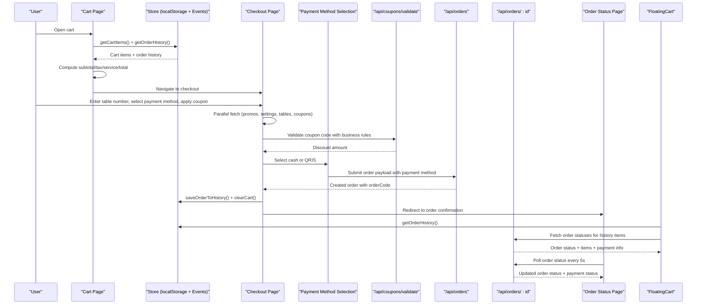

**Diagram sources**
- [page.tsx:19-61](file://app/cart/page.tsx#L19-L61)
- [page.tsx:22-245](file://app/checkout/page.tsx#L22-L245)
- [FloatingCart.tsx:47-71](file://components/FloatingCart.tsx#L47-L71)
- [route.ts:23-236](file://app/api/orders/route.ts#L23-L236)
- [route.ts:6-58](file://app/api/coupons/validate/route.ts#L6-L58)
- [page.tsx:10-53](file://app/order/[orderId]/page.tsx#L10-L53)
- [route.ts:6-23](file://app/api/orders/[id]/route.ts#L6-L23)

## Detailed Component Analysis

### Enhanced Order History System
**Updated** Added comprehensive order history functionality with persistent local storage tracking and real-time status monitoring.

- Persistence keys:
  - Order history stored under `selera_sambal_order_history` key in local storage.
  - Each entry contains order code, table number, total amount, item count, and creation timestamp.
  - Maximum 50 entries maintained with newest first sorting.
- Reading and writing:
  - Functions read from local storage safely, parse JSON, sort by creation date, and return typed arrays.
  - Writes add new entries, avoid duplicates, trim to maximum limit, and notify subscribers.
- Integration points:
  - Automatically saves orders after successful checkout completion.
  - Displays order count in cart page and floating cart header.
  - Provides navigation to specific orders and order history view.

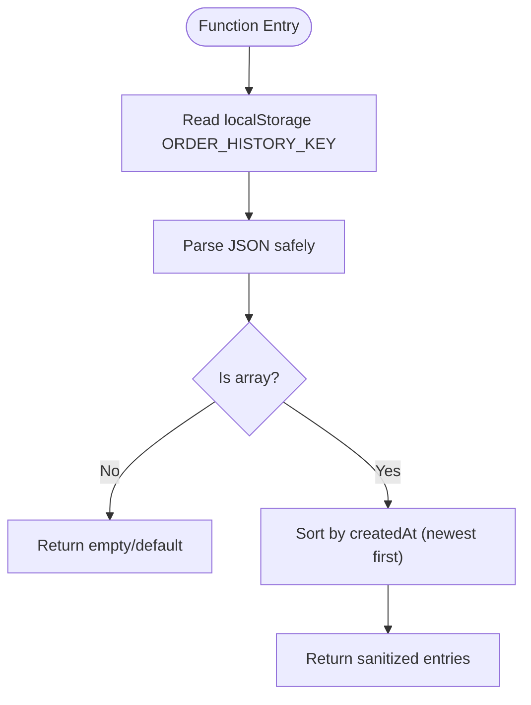

**Diagram sources**
- [store.ts:231-245](file://lib/store.ts#L231-L245)

**Section sources**
- [store.ts:24-33](file://lib/store.ts#L24-L33)
- [store.ts:231-265](file://lib/store.ts#L231-L265)

### Cart State Management Using Local Storage
- Persistence keys:
  - Cart items, order notes, manual table number, table session, and order history are stored under distinct keys.
- Reading and writing:
  - Functions read from local storage safely, parse JSON, sanitize entries, and return typed arrays or defaults.
  - Writes stringify objects and notify subscribers via the event emitter.
- Sanitization:
  - Cart items are filtered to ensure required fields exist and quantities are positive, preventing runtime errors.

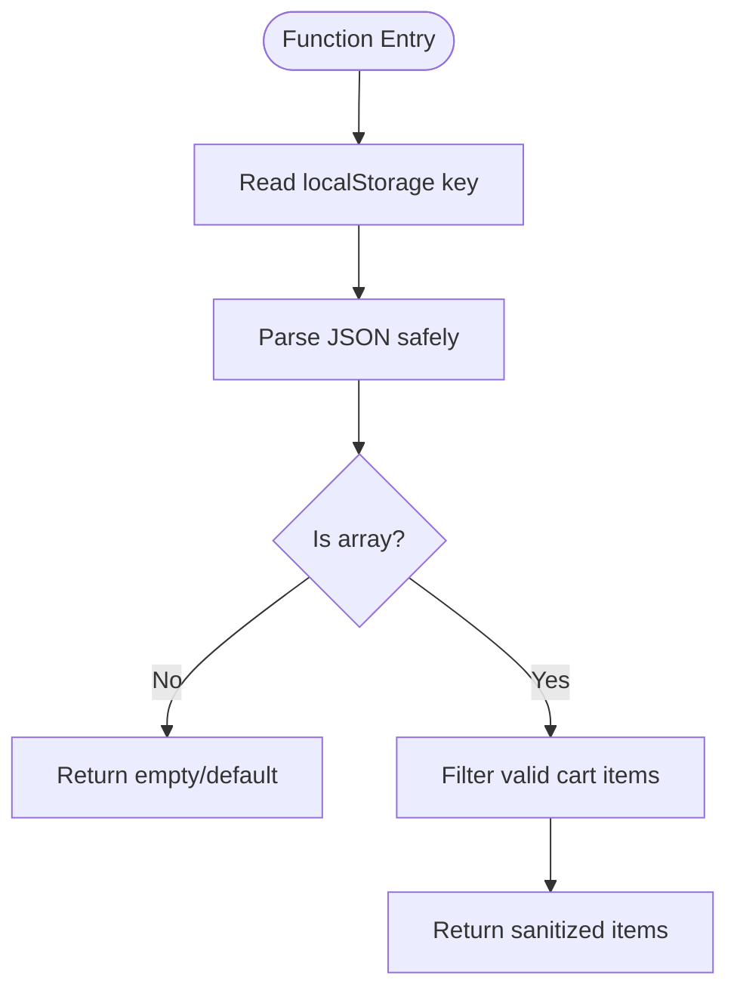

**Diagram sources**
- [store.ts:67-91](file://lib/store.ts#L67-L91)

**Section sources**
- [store.ts:19-24](file://lib/store.ts#L19-L24)
- [store.ts:67-97](file://lib/store.ts#L67-L97)

### Item Quantity Controls
- Add to cart:
  - Computes unit price including add-ons, generates a unique instance ID based on item ID, spice level, and add-on signature, then either increments existing quantity or adds a new entry.
- Update quantity:
  - Adjusts quantity by delta; removes item if quantity drops to zero or below; recalculates line total.
- Remove item:
  - Filters out the specified item ID and persists updated cart.

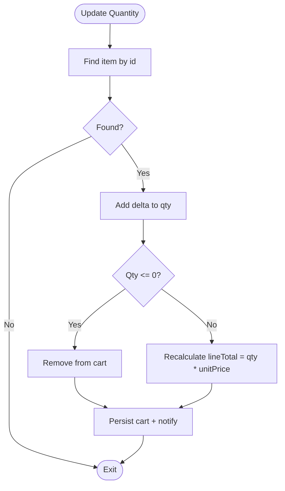

**Diagram sources**
- [store.ts:140-154](file://lib/store.ts#L140-L154)

**Section sources**
- [store.ts:99-138](file://lib/store.ts#L99-L138)
- [store.ts:140-160](file://lib/store.ts#L140-L160)

### Price Calculations
- Client-side previews:
  - Subtotal is sum of line totals.
  - Tax and service charge are computed from configured percentages fetched from settings.
  - Grand total includes subtotal plus combined tax and service charges, minus any applied coupon discount.
- Server-side authority:
  - Order creation endpoint ignores client-supplied totals and recalculates everything from database prices, add-on prices, and settings.
  - Coupon discount is validated and applied server-side; final total is computed after discount, tax, and service charge.

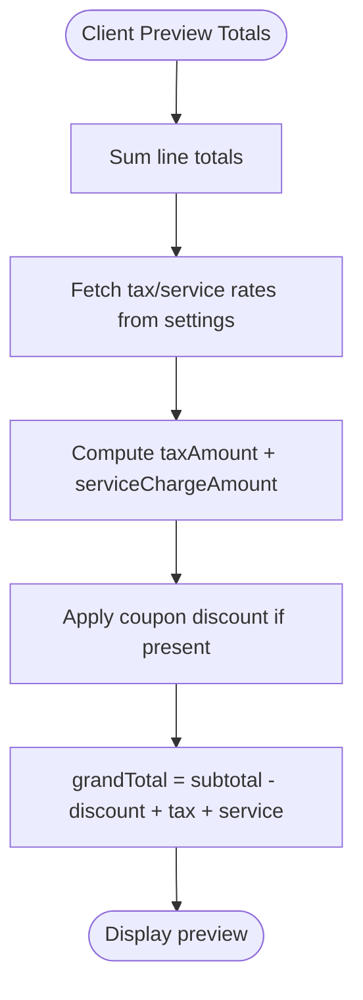

**Diagram sources**
- [page.tsx:56-61](file://app/cart/page.tsx#L56-L61)
- [page.tsx:108-184](file://app/checkout/page.tsx#L108-L184)
- [route.ts:80-185](file://app/api/orders/route.ts#L80-L185)

**Section sources**
- [page.tsx:56-61](file://app/cart/page.tsx#L56-L61)
- [page.tsx:108-184](file://app/checkout/page.tsx#L108-L184)
- [route.ts:80-185](file://app/api/orders/route.ts#L80-L185)

### Real-Time Cart Updates Across Components
- Event-driven synchronization:
  - The store exposes an event emitter that notifies subscribers whenever cart state changes.
  - Cart page, checkout page, and floating cart subscribe to these events and refresh their local state accordingly.
- Benefits:
  - Consistent UI across multiple tabs/components without polling.
  - Immediate feedback when items are added, removed, or quantities change.

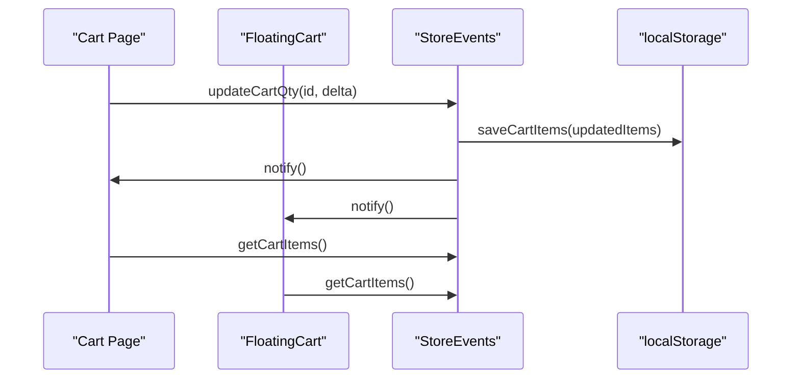

**Diagram sources**
- [store.ts:25-41](file://lib/store.ts#L25-L41)
- [store.ts:93-97](file://lib/store.ts#L93-L97)
- [page.tsx:44-48](file://app/cart/page.tsx#L44-L48)
- [page.tsx:71-73](file://app/checkout/page.tsx#L71-L73)
- [FloatingCart.tsx:34-39](file://components/FloatingCart.tsx#L34-L39)

**Section sources**
- [store.ts:25-41](file://lib/store.ts#L25-L41)
- [page.tsx:44-48](file://app/cart/page.tsx#L44-L48)
- [page.tsx:71-73](file://app/checkout/page.tsx#L71-L73)
- [FloatingCart.tsx:34-39](file://components/FloatingCart.tsx#L34-L39)

### Enhanced Checkout Process: Validation, Parallel Data Fetching, Payment Method Selection, Confirmation Flow
**Updated** Enhanced with comprehensive payment method selection interface supporting cash and QRIS options.

- Validation:
  - Client ensures table number is provided and non-zero before submission.
  - Server validates items array, table number, menu/promo availability, add-ons, and coupon rules.
- Parallel Data Fetching Optimization:
  - Uses `Promise.all()` to simultaneously fetch promos, settings, known tables, and active coupons, reducing initial load time significantly.
  - Each fetch operation has error handling with fallback defaults to ensure graceful degradation.
- Robust Coupon Handling:
  - Comprehensive business rule validation including date range checks, daily usage limits, minimum order amounts, and discount caps.
  - Real-time coupon validation with immediate user feedback and automatic coupon release when conditions change.
  - Transaction-safe coupon application prevents race conditions and double usage.
- **Payment Method Selection Interface:**
  - **Beautiful dual-option interface with visual cards for Cash and QRIS payment methods.**
  - **Cash option: "Bayar di Kasir" (Pay at Counter) - Traditional cash payment at cashier.**
  - **QRIS option: Digital QR code scanning payment method for modern transactions.**
  - **Visual feedback with selected state highlighting and descriptive text for each payment method.**
  - **Payment method is validated and stored with the order for later processing.**
- Payment processing integration points:
  - The current implementation does not integrate a payment gateway; orders are created with status "received" and payment is handled at the cashier later.
  - The order confirmation page indicates manual payment at the counter with payment method display.
- Order confirmation:
  - On successful order creation, the client automatically saves order to local history, clears cart, and navigates to the order status page.
  - The order status page polls the order endpoint every five seconds to display live progress and eventually shows a digital receipt when completed.

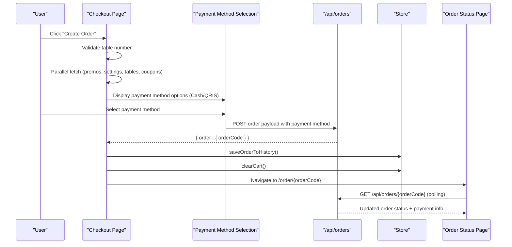

**Diagram sources**
- [page.tsx:186-245](file://app/checkout/page.tsx#L186-L245)
- [route.ts:23-236](file://app/api/orders/route.ts#L23-L236)
- [page.tsx:10-53](file://app/order/[orderId]/page.tsx#L10-L53)

**Section sources**
- [page.tsx:186-245](file://app/checkout/page.tsx#L186-L245)
- [route.ts:23-236](file://app/api/orders/route.ts#L23-L236)
- [page.tsx:10-53](file://app/order/[orderId]/page.tsx#L10-L53)

### Enhanced Coupon Handling System
- Business Rule Validation:
  - Date range validation ensures coupons are only valid within specified periods.
  - Daily usage tracking prevents coupon reuse on the same calendar day.
  - Minimum order amount requirements enforced with clear error messaging.
  - Maximum discount caps prevent excessive discounts on percentage-based coupons.
- Client-Side Experience:
  - Real-time validation feedback with loading states and error/success messages.
  - Automatic coupon release when subtotal falls below minimum requirements.
  - Visual indicators showing applied coupon benefits and remaining discount value.
- Server-Side Security:
  - Transaction-safe coupon application prevents race conditions.
  - Re-validation within database transactions ensures consistency.
  - Comprehensive error handling with structured responses.

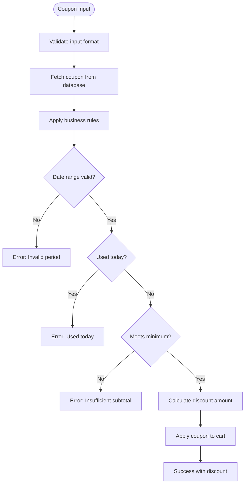

**Diagram sources**
- [coupon.ts:80-132](file://lib/coupon.ts#L80-L132)
- [route.ts:160-180](file://app/api/orders/route.ts#L160-L180)

**Section sources**
- [coupon.ts:1-133](file://lib/coupon.ts#L1-L133)
- [route.ts:160-180](file://app/api/orders/route.ts#L160-L180)
- [page.tsx:152-193](file://app/checkout/page.tsx#L152-L193)

### Enhanced Floating Cart Component with Order History
**Updated** Significantly enhanced with integrated order history view, real-time status monitoring, and improved user interface.

- Presentation:
  - Slides in from the right with a fixed header showing cart title, item count, manual table badge, close button, and order history toggle.
  - Displays list of cart items with images, spice/add-on tags, per-item price, and quantity stepper.
  - Footer shows subtotal and grand total, with CTA buttons to proceed to checkout or continue shopping.
  - Includes beautiful order history view with status badges, item previews, and navigation to order details.
- Order History Features:
  - Toggle between cart and order history views with smooth transitions.
  - Real-time status fetching for each order in history using background polling.
  - Status badges with color coding (received, preparing, ready, completed).
  - Item previews showing order contents and quantities.
  - Navigation to individual order detail pages.
- Interactions:
  - Quantity changes call store update functions which persist and notify subscribers.
  - Remove action animates removal briefly before updating store.
  - Keyboard accessibility: Escape closes the panel.
  - Order history panel auto-fetches status updates when opened.

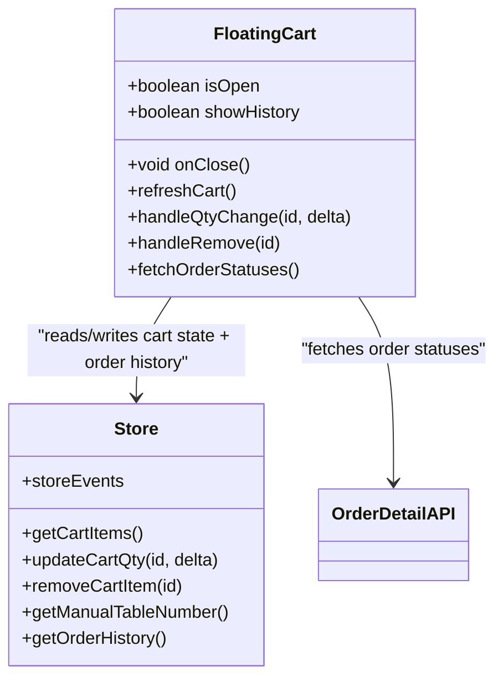

**Diagram sources**
- [FloatingCart.tsx:22-63](file://components/FloatingCart.tsx#L22-L63)
- [store.ts:67-97](file://lib/store.ts#L67-L97)
- [route.ts:6-23](file://app/api/orders/[id]/route.ts#L6-L23)

**Section sources**
- [FloatingCart.tsx:22-63](file://components/FloatingCart.tsx#L22-L63)
- [FloatingCart.tsx:47-71](file://components/FloatingCart.tsx#L47-L71)
- [FloatingCart.tsx:193-271](file://components/FloatingCart.tsx#L193-L271)

### Cross-Component Communication Patterns
- Event emitter:
  - Centralized pub/sub mechanism for cart-related updates and order history changes.
- Local storage:
  - Single source of truth for cart persistence, order history, and browser sessions.
- Props and routing:
  - Floating cart receives open/close props and uses Next.js router for navigation between cart, checkout, and order history views.
- Data fetching:
  - Checkout and cart pages fetch settings, promos, and tables to compute accurate previews and validations.
  - Floating cart fetches order statuses for history items when history panel is opened.

**Section sources**
- [store.ts:25-41](file://lib/store.ts#L25-L41)
- [page.tsx:27-37](file://app/cart/page.tsx#L27-L37)
- [page.tsx:50-73](file://app/checkout/page.tsx#L50-L73)
- [FloatingCart.tsx:34-46](file://components/FloatingCart.tsx#L34-L46)
- [FloatingCart.tsx:47-71](file://components/FloatingCart.tsx#L47-L71)

## Dependency Analysis
The following diagram maps dependencies between core files involved in the cart and ordering workflow, including the enhanced order history system and payment method handling.

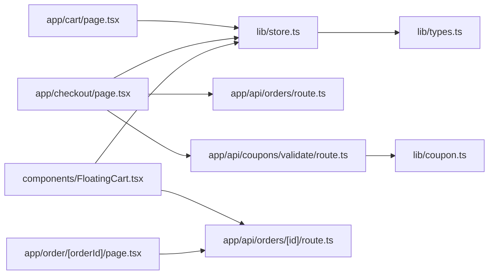

**Diagram sources**
- [page.tsx:9-17](file://app/cart/page.tsx#L9-L17)
- [page.tsx:9-20](file://app/checkout/page.tsx#L9-L20)
- [FloatingCart.tsx:7-14](file://components/FloatingCart.tsx#L7-L14)
- [store.ts:1-11](file://lib/store.ts#L1-L11)
- [route.ts:1-4](file://app/api/orders/route.ts#L1-L4)
- [route.ts:1-4](file://app/api/coupons/validate/route.ts#L1-L4)
- [page.tsx:7-8](file://app/order/[orderId]/page.tsx#L7-L8)
- [coupon.ts:1-2](file://lib/coupon.ts#L1-L2)
- [route.ts:1-4](file://app/api/orders/[id]/route.ts#L1-L4)

**Section sources**
- [page.tsx:9-17](file://app/cart/page.tsx#L9-L17)
- [page.tsx:9-20](file://app/checkout/page.tsx#L9-L20)
- [FloatingCart.tsx:7-14](file://components/FloatingCart.tsx#L7-L14)
- [store.ts:1-11](file://lib/store.ts#L1-L11)
- [route.ts:1-4](file://app/api/orders/route.ts#L1-L4)
- [route.ts:1-4](file://app/api/coupons/validate/route.ts#L1-L4)
- [page.tsx:7-8](file://app/order/[orderId]/page.tsx#L7-L8)
- [coupon.ts:1-2](file://lib/coupon.ts#L1-L2)
- [route.ts:1-4](file://app/api/orders/[id]/route.ts#L1-L4)

## Performance Considerations
- Local storage operations:
  - Keep cart payloads minimal; avoid storing large images directly in cart items.
  - Order history limited to 50 entries to prevent excessive storage usage.
- Event notifications:
  - Batch updates where possible to reduce unnecessary re-renders.
- API calls:
  - Fetch settings, promos, and tables in parallel using Promise.all() to minimize latency.
  - Implement proper error handling with fallbacks for each parallel fetch operation.
  - Order status polling in floating cart is optimized to fetch only when history panel is opened.
- Image loading:
  - Use optimized image sizes and fallback placeholders to improve perceived performance.
- Polling:
  - Order status polling interval should be balanced between responsiveness and network load.
  - Background status fetching for order history avoids blocking UI interactions.
- Database queries:
  - Use batch loading and Promise.all() for concurrent database operations to eliminate N+1 query problems.

[No sources needed since this section provides general guidance]

## Troubleshooting Guide
- Empty cart scenarios:
  - Both cart and checkout pages handle empty states gracefully and guide users back to the menu.
- Invalid table number:
  - Client shows advisory or error messages; server rejects invalid table numbers with HTTP 400.
- Coupon issues:
  - Client displays validation errors and success messages; server enforces coupon rules and prevents misuse.
  - Common coupon errors include expired dates, daily usage limits, insufficient subtotals, and inactive coupons.
- **Payment method issues:**
  - **Invalid payment methods are automatically defaulted to 'cash' on the server side.**
  - **Payment method validation ensures only 'cash' or 'qris' values are accepted.**
  - **Payment status tracking helps identify orders that need payment processing.**
- Network errors:
  - API endpoints return structured error responses; clients surface user-friendly messages.
  - Parallel fetch operations have individual error handling to prevent complete failure.
- Data integrity:
  - Store sanitizes cart items to prevent null pointer exceptions and inconsistent state.
  - Order history entries are validated and sorted properly to maintain chronological order.
- Performance issues:
  - Monitor parallel fetch completion times and implement proper loading states.
  - Ensure database queries use batch operations to avoid N+1 problems.
  - Order history status fetching is optimized to avoid unnecessary API calls.
- Order history issues:
  - Local storage quota exceeded may cause order history to fail; consider clearing old entries.
  - Duplicate order codes are automatically filtered to prevent history corruption.
  - Order status fetching failures are handled gracefully without breaking the UI.

**Section sources**
- [page.tsx:63-83](file://app/cart/page.tsx#L63-L83)
- [page.tsx:247-258](file://app/checkout/page.tsx#L247-L258)
- [route.ts:33-48](file://app/api/orders/route.ts#L33-L48)
- [route.ts:160-180](file://app/api/orders/route.ts#L160-L180)
- [route.ts:237-243](file://app/api/orders/route.ts#L237-L243)
- [store.ts:75-90](file://lib/store.ts#L75-L90)
- [store.ts:248-258](file://lib/store.ts#L248-L258)

## Conclusion
The cart and ordering system combines a robust client-side store with secure server-side validation and calculation. Local storage ensures persistence for both cart and order history, while event-driven updates keep the UI consistent across components. The enhanced order history system provides persistent tracking of completed orders with real-time status monitoring and seamless navigation between different views. **The enhanced payment system now supports both cash and QRIS payment methods with a beautiful selection interface, proper validation, and comprehensive payment status tracking throughout the order lifecycle.** The checkout flow emphasizes safety by ignoring client-provided totals and recomputing them server-side, with enhanced coupon validation integrated both for preview and final order creation. **Payment method selection provides customers with flexible payment options while maintaining security through server-side validation.** The parallel data fetching optimization significantly improves initial load performance, while the enhanced floating cart with integrated order history enhances usability by providing quick access to cart management, order tracking, and checkout. Comprehensive error handling, validation rules, and enhanced user feedback mechanisms protect data integrity and provide clear user feedback throughout the workflow. The order history system seamlessly integrates with the existing cart functionality, providing customers with a complete ordering experience from browsing to order tracking and payment management.