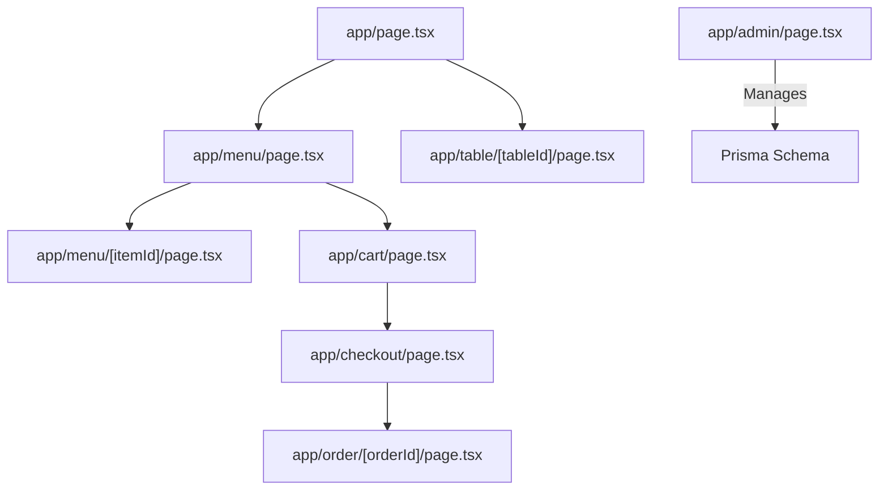
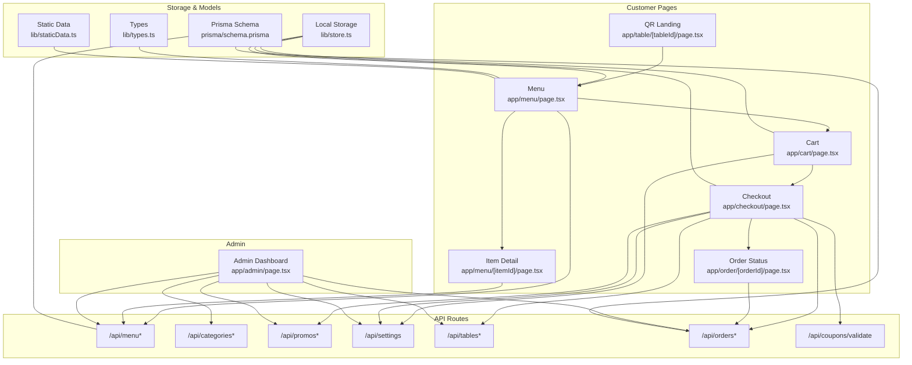
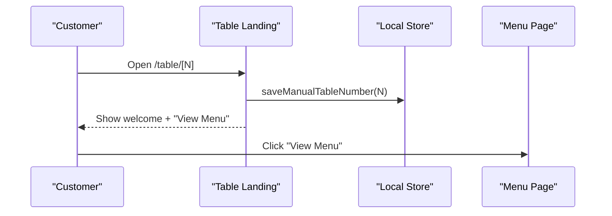
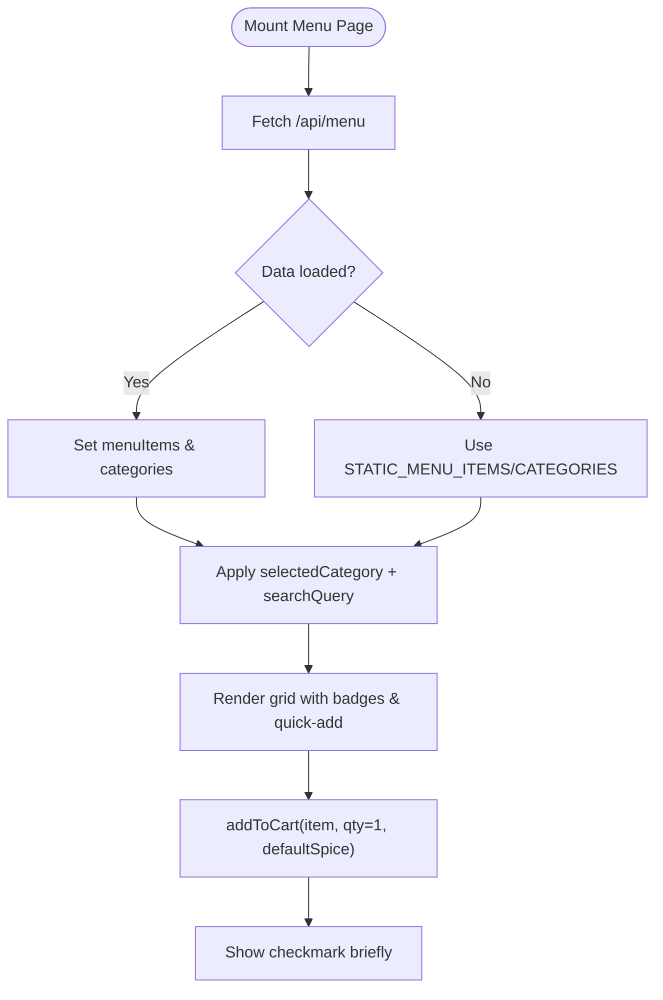
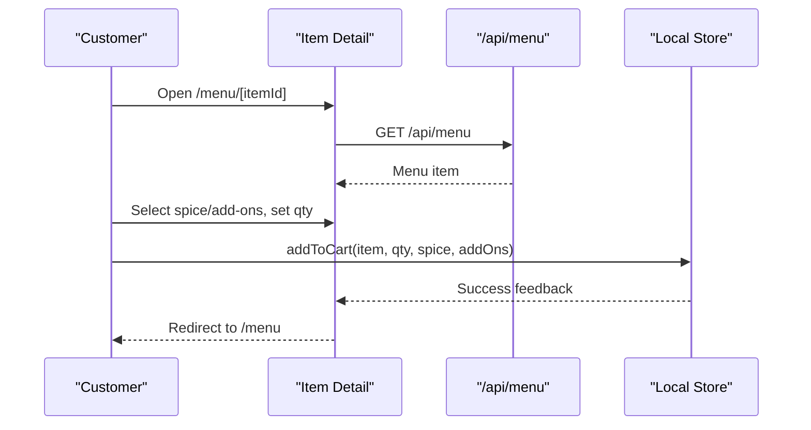
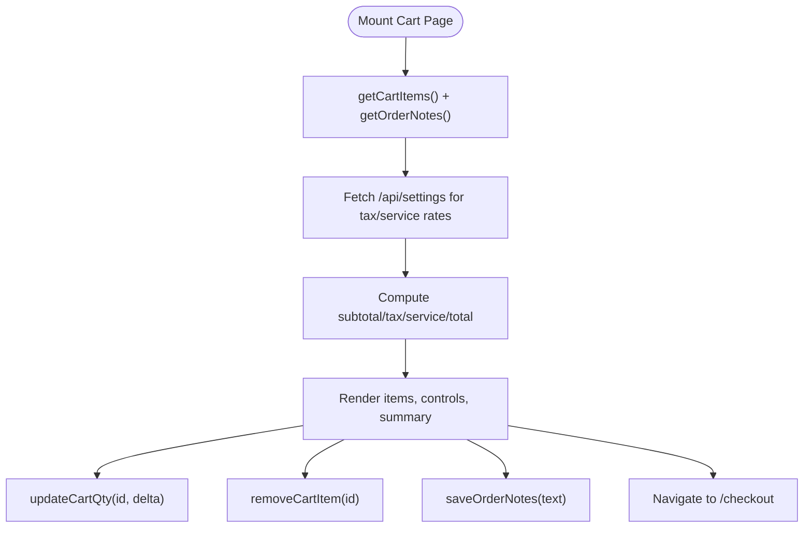
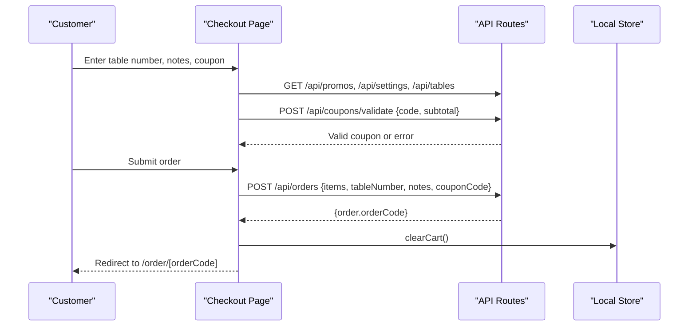
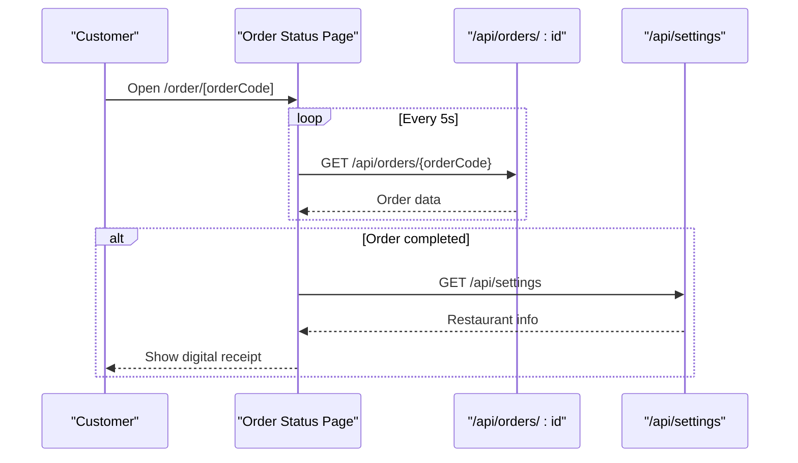
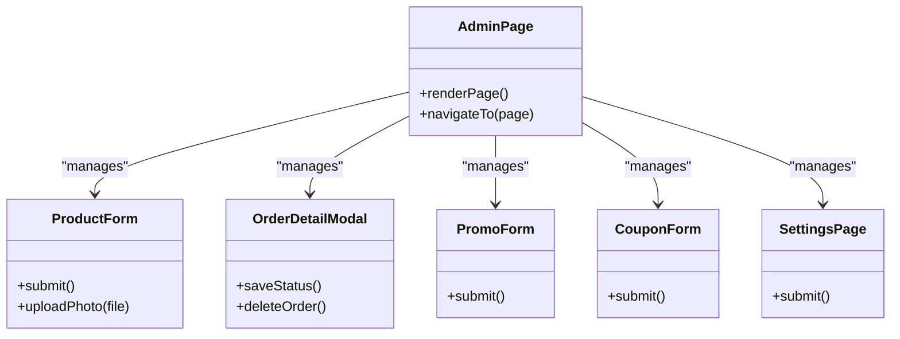
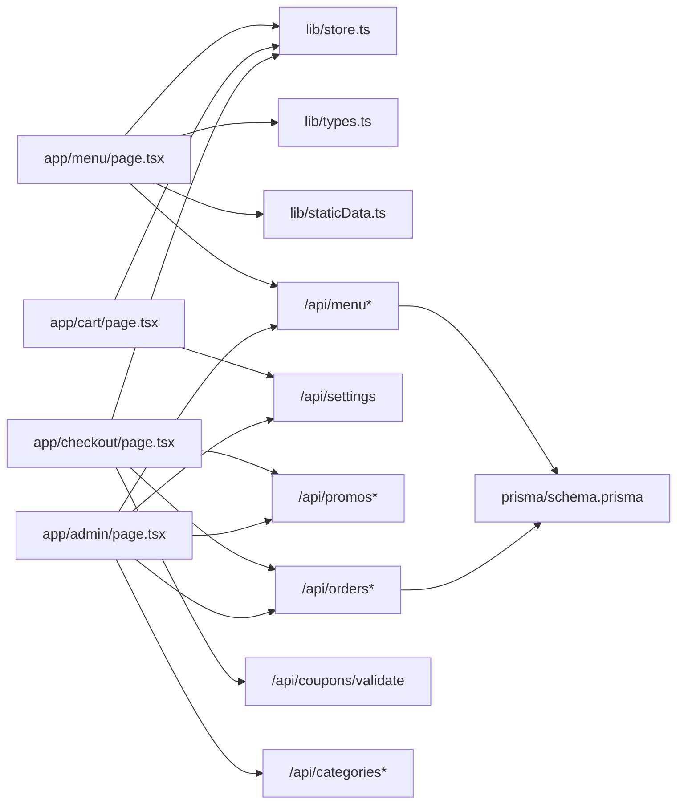

# Core Features

<cite>
**Referenced Files in This Document**
- [README.md](file://README.md)
- [package.json](file://package.json)
- [app/page.tsx](file://app/page.tsx)
- [app/table/[tableId]/page.tsx](file://app/table/[tableId]/page.tsx)
- [app/menu/page.tsx](file://app/menu/page.tsx)
- [app/menu/[itemId]/page.tsx](file://app/menu/[itemId]/page.tsx)
- [app/cart/page.tsx](file://app/cart/page.tsx)
- [app/checkout/page.tsx](file://app/checkout/page.tsx)
- [app/order/[orderId]/page.tsx](file://app/order/[orderId]/page.tsx)
- [app/admin/page.tsx](file://app/admin/page.tsx)
- [lib/store.ts](file://lib/store.ts)
- [lib/types.ts](file://lib/types.ts)
- [lib/staticData.ts](file://lib/staticData.ts)
- [prisma/schema.prisma](file://prisma/schema.prisma)
</cite>

## Table of Contents
1. Introduction
2. Project Structure
3. Core Components
4. Architecture Overview
5. Detailed Component Analysis
6. Dependency Analysis
7. Performance Considerations
8. Troubleshooting Guide
9. Conclusion

## Introduction
This document explains the core features of the Warkop Betawa restaurant ordering system, covering the complete customer journey from QR code scanning to order completion and the admin dashboard for managing menu items, categories, orders, promotions, coupons, and settings. It includes implementation details, user workflows, and integration patterns between Next.js pages, API routes, local storage state, and the database schema.

Key highlights:
- Customer flow: QR landing → menu browsing with category filtering → item detail with spice/add-ons → cart review → checkout with table number, coupon validation, promo upsell → order confirmation and live status tracking.
- Admin flow: login → dashboard → manage menu, categories, orders (with status updates), promos, coupons, inventory, notifications, and settings (tax/service rates and restaurant info).
- Data model: Prisma schema defines entities such as MenuItem, Category, Order, Promo, Coupon, Settings, and RestaurantTable.

**Section sources**
- [README.md:53-105](file://README.md#L53-L105)

## Project Structure
The application is a Next.js 14 app with client-side pages under `app/`, shared logic in `lib/`, and a Prisma schema in `prisma/`. The root page redirects to the menu, while `/table/[tableId]` serves as the QR entry point that pre-fills the table number.

**Diagram sources**
- [app/page.tsx:1-6](file://app/page.tsx#L1-L6)
- [app/table/[tableId]/page.tsx:1-104](file://app/table/[tableId]/page.tsx#L1-L104)
- [app/menu/page.tsx:1-320](file://app/menu/page.tsx#L1-L320)
- [app/menu/[itemId]/page.tsx:1-232](file://app/menu/[itemId]/page.tsx#L1-L232)
- [app/cart/page.tsx:1-227](file://app/cart/page.tsx#L1-L227)
- [app/checkout/page.tsx:1-542](file://app/checkout/page.tsx#L1-L542)
- [app/order/[orderId]/page.tsx:1-291](file://app/order/[orderId]/page.tsx#L1-L291)
- [app/admin/page.tsx:1-1499](file://app/admin/page.tsx#L1-L1499)
- [prisma/schema.prisma:1-107](file://prisma/schema.prisma#L1-L107)

**Section sources**
- [app/page.tsx:1-6](file://app/page.tsx#L1-L6)
- [app/table/[tableId]/page.tsx:1-104](file://app/table/[tableId]/page.tsx#L1-L104)
- [package.json:1-42](file://package.json#L1-L42)

## Core Components
- QR Landing Page: Accepts optional table ID from URL and pre-fills manual table number for checkout.
- Menu Browsing: Loads menu and categories via API; supports category filtering and search; quick-add to cart.
- Item Detail: Spice level selection, multi-select add-ons, quantity stepper, dynamic price calculation, add-to-cart.
- Cart Review: Edit quantities, remove items, order notes, tax/service totals based on settings.
- Checkout: Table number input, coupon validation, promo upsell, order submission, redirect to order status.
- Order Status: Polls order endpoint every 5 seconds; displays progress steps and digital receipt when completed.
- Admin Dashboard: Login, dashboard overview, CRUD for menu/categories/promos/coupons, order management with status updates, inventory view, notifications, and settings.

**Section sources**
- [app/table/[tableId]/page.tsx:1-104](file://app/table/[tableId]/page.tsx#L1-L104)
- [app/menu/page.tsx:1-320](file://app/menu/page.tsx#L1-L320)
- [app/menu/[itemId]/page.tsx:1-232](file://app/menu/[itemId]/page.tsx#L1-L232)
- [app/cart/page.tsx:1-227](file://app/cart/page.tsx#L1-L227)
- [app/checkout/page.tsx:1-542](file://app/checkout/page.tsx#L1-L542)
- [app/order/[orderId]/page.tsx:1-291](file://app/order/[orderId]/page.tsx#L1-L291)
- [app/admin/page.tsx:1-1499](file://app/admin/page.tsx#L1-L1499)

## Architecture Overview
The system uses a client-driven UI with serverless API routes and a PostgreSQL-backed data layer defined by Prisma. Local storage manages cart state and session preferences.

**Diagram sources**
- [app/table/[tableId]/page.tsx:1-104](file://app/table/[tableId]/page.tsx#L1-L104)
- [app/menu/page.tsx:1-320](file://app/menu/page.tsx#L1-L320)
- [app/menu/[itemId]/page.tsx:1-232](file://app/menu/[itemId]/page.tsx#L1-L232)
- [app/cart/page.tsx:1-227](file://app/cart/page.tsx#L1-L227)
- [app/checkout/page.tsx:1-542](file://app/checkout/page.tsx#L1-L542)
- [app/order/[orderId]/page.tsx:1-291](file://app/order/[orderId]/page.tsx#L1-L291)
- [app/admin/page.tsx:1-1499](file://app/admin/page.tsx#L1-L1499)
- [lib/store.ts:1-217](file://lib/store.ts#L1-L217)
- [lib/types.ts:1-119](file://lib/types.ts#L1-L119)
- [lib/staticData.ts:1-166](file://lib/staticData.ts#L1-L166)
- [prisma/schema.prisma:1-107](file://prisma/schema.prisma#L1-L107)

## Detailed Component Analysis

### QR Landing Flow
- Purpose: Provide a welcome screen and optionally pre-fill the table number from the URL path.
- Behavior: Extracts numeric table ID, saves it to local storage, and navigates to the menu.
- Integration: Uses `saveManualTableNumber` from store; no per-table token validation.

**Diagram sources**
- [app/table/[tableId]/page.tsx:1-104](file://app/table/[tableId]/page.tsx#L1-L104)
- [lib/store.ts:190-210](file://lib/store.ts#L190-L210)

**Section sources**
- [app/table/[tableId]/page.tsx:1-104](file://app/table/[tableId]/page.tsx#L1-L104)
- [lib/store.ts:190-210](file://lib/store.ts#L190-L210)

### Menu Browsing and Category Filtering
- Data loading: Fetches menu and categories from `/api/menu`; falls back to static data if unavailable.
- Filtering: Supports category selection and text search across name/description.
- Quick Add: Adds item to cart with default spice level if available; shows feedback animation.

**Diagram sources**
- [app/menu/page.tsx:1-320](file://app/menu/page.tsx#L1-L320)
- [lib/staticData.ts:1-166](file://lib/staticData.ts#L1-L166)
- [lib/store.ts:99-138](file://lib/store.ts#L99-L138)

**Section sources**
- [app/menu/page.tsx:1-320](file://app/menu/page.tsx#L1-L320)
- [lib/staticData.ts:1-166](file://lib/staticData.ts#L1-L166)
- [lib/store.ts:99-138](file://lib/store.ts#L99-L138)

### Item Detail and Add-Ons
- Data loading: Fetches single item by ID from `/api/menu`; fallback to static dataset.
- Options: Spice level selector; multi-select add-ons with price impact.
- Pricing: Computes unit price including add-ons; live total = unitPrice × qty.
- Interaction: Add to cart with selected options; brief success message then navigate back.

**Diagram sources**
- [app/menu/[itemId]/page.tsx:1-232](file://app/menu/[itemId]/page.tsx#L1-L232)
- [lib/store.ts:99-138](file://lib/store.ts#L99-L138)

**Section sources**
- [app/menu/[itemId]/page.tsx:1-232](file://app/menu/[itemId]/page.tsx#L1-L232)
- [lib/store.ts:99-138](file://lib/store.ts#L99-L138)

### Cart Management
- State: Reads cart items and order notes from local storage; subscribes to store events for reactive updates.
- Totals: Subtotal computed from line totals; tax and service charge fetched from `/api/settings`.
- Actions: Update quantity, remove item, edit notes; proceed to checkout.

**Diagram sources**
- [app/cart/page.tsx:1-227](file://app/cart/page.tsx#L1-L227)
- [lib/store.ts:67-97](file://lib/store.ts#L67-L97)
- [lib/store.ts:140-168](file://lib/store.ts#L140-L168)

**Section sources**
- [app/cart/page.tsx:1-227](file://app/cart/page.tsx#L1-L227)
- [lib/store.ts:67-97](file://lib/store.ts#L67-L97)
- [lib/store.ts:140-168](file://lib/store.ts#L140-L168)

### Checkout Process
- Inputs: Manual table number (validated), order notes, extra notes, coupon code.
- Promos: Displays active promos; allows adding promo as an upsell item to cart.
- Coupon Validation: Calls `/api/coupons/validate` with code and subtotal; applies discount rules.
- Submission: Sends order payload to `/api/orders`; clears cart and navigates to order status.

**Diagram sources**
- [app/checkout/page.tsx:1-542](file://app/checkout/page.tsx#L1-L542)
- [lib/store.ts:162-168](file://lib/store.ts#L162-L168)

**Section sources**
- [app/checkout/page.tsx:1-542](file://app/checkout/page.tsx#L1-L542)
- [lib/store.ts:162-168](file://lib/store.ts#L162-L168)

### Real-Time Order Status Tracking
- Polling: Fetches order by code every 5 seconds until completed.
- Display: Shows step-by-step progress (received → preparing → ready → completed).
- Receipt: When completed, fetches restaurant info and renders a digital receipt.

**Diagram sources**
- [app/order/[orderId]/page.tsx:1-291](file://app/order/[orderId]/page.tsx#L1-L291)

**Section sources**
- [app/order/[orderId]/page.tsx:1-291](file://app/order/[orderId]/page.tsx#L1-L291)

### Admin Dashboard Functionality
- Authentication: Local-only login using stored credentials; session persisted in sessionStorage/localStorage.
- Dashboard: Aggregates menu count, sold items, revenue, recent orders, and operational stats.
- Menu Management: Create/edit/delete menu items with image upload, spice levels, add-ons, badge, and category slug.
- Categories: Create/edit/delete categories; used as slugs for menu items.
- Orders: View all orders; open detail modal to update status, adjust items, print invoice, delete order.
- Promotions: Create/edit/delete promos displayed to customers.
- Coupons: Create/edit/delete coupons; toggle active; soft-delete deactivates rather than removes.
- Inventory: View menu availability.
- Notifications: Local-only notification center.
- Settings: Update tax/service rates and restaurant info; changes propagate to customer-facing totals and receipts.

**Diagram sources**
- [app/admin/page.tsx:1-1499](file://app/admin/page.tsx#L1-L1499)

**Section sources**
- [app/admin/page.tsx:1-1499](file://app/admin/page.tsx#L1-L1499)

## Dependency Analysis
- Client components depend on:
  - `lib/store.ts` for cart/session state and event emitters.
  - `lib/types.ts` for shared interfaces.
  - `lib/staticData.ts` for initial menu/category/promo data.
- Pages call API routes:
  - `/api/menu*`, `/api/categories*`, `/api/promos*`, `/api/settings`, `/api/tables*`, `/api/orders*`, `/api/coupons/validate`.
- Admin UI calls the same APIs for CRUD operations.
- Database schema in Prisma defines persistent models consumed by API routes.

**Diagram sources**
- [app/menu/page.tsx:1-320](file://app/menu/page.tsx#L1-L320)
- [app/cart/page.tsx:1-227](file://app/cart/page.tsx#L1-L227)
- [app/checkout/page.tsx:1-542](file://app/checkout/page.tsx#L1-L542)
- [app/admin/page.tsx:1-1499](file://app/admin/page.tsx#L1-L1499)
- [lib/store.ts:1-217](file://lib/store.ts#L1-L217)
- [lib/types.ts:1-119](file://lib/types.ts#L1-L119)
- [lib/staticData.ts:1-166](file://lib/staticData.ts#L1-L166)
- [prisma/schema.prisma:1-107](file://prisma/schema.prisma#L1-L107)

**Section sources**
- [app/menu/page.tsx:1-320](file://app/menu/page.tsx#L1-L320)
- [app/cart/page.tsx:1-227](file://app/cart/page.tsx#L1-L227)
- [app/checkout/page.tsx:1-542](file://app/checkout/page.tsx#L1-L542)
- [app/admin/page.tsx:1-1499](file://app/admin/page.tsx#L1-L1499)
- [lib/store.ts:1-217](file://lib/store.ts#L1-L217)
- [lib/types.ts:1-119](file://lib/types.ts#L1-L119)
- [lib/staticData.ts:1-166](file://lib/staticData.ts#L1-L166)
- [prisma/schema.prisma:1-107](file://prisma/schema.prisma#L1-L107)

## Performance Considerations
- Menu caching: The README indicates a menu cache utility exists; consider leveraging it to reduce repeated network requests for menu data.
- Polling intervals: Order status polling at 5 seconds balances responsiveness and load; ensure backend can handle frequent reads.
- Image optimization: Images are marked unoptimized in several places; consider enabling Next.js image optimization for production.
- Batched API calls: Checkout fetches promos, settings, and tables in parallel to minimize latency.
- Local storage efficiency: Cart state is serialized to localStorage; keep payloads minimal and sanitize on read.

[No sources needed since this section provides general guidance]

## Troubleshooting Guide
- Menu not loading: Check `/api/menu` response; verify Prisma schema and database connectivity; confirm static fallback usage.
- Cart not updating: Ensure store events are subscribed and localStorage keys are intact; validate cart item structure against types.
- Coupon validation fails: Verify coupon code format, date range, min order amount, and discount type; check `/api/coupons/validate` response.
- Order status not changing: Confirm admin updated order status via `/api/orders/[id] PATCH`; verify polling interval and network errors.
- Tax/service totals incorrect: Validate `/api/settings` returns correct percentages; ensure cart/checkout fetches settings on mount.

**Section sources**
- [app/menu/page.tsx:26-40](file://app/menu/page.tsx#L26-L40)
- [lib/store.ts:67-97](file://lib/store.ts#L67-L97)
- [app/checkout/page.tsx:138-171](file://app/checkout/page.tsx#L138-L171)
- [app/order/[orderId]/page.tsx:19-40](file://app/order/[orderId]/page.tsx#L19-L40)
- [app/cart/page.tsx:26-37](file://app/cart/page.tsx#L26-L37)

## Conclusion
The Warkop Betawa ordering system delivers a seamless customer experience from QR entry to real-time order tracking, backed by a robust admin dashboard for comprehensive restaurant operations. The architecture leverages Next.js client components, API routes, local storage state, and a Prisma-defined data model to provide scalable, maintainable functionality. By following the documented workflows and integration points, teams can extend features, optimize performance, and troubleshoot effectively.

[No sources needed since this section summarizes without analyzing specific files]