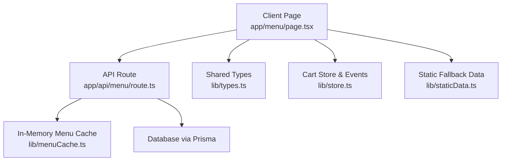
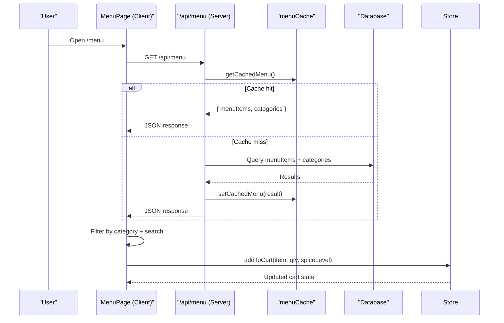
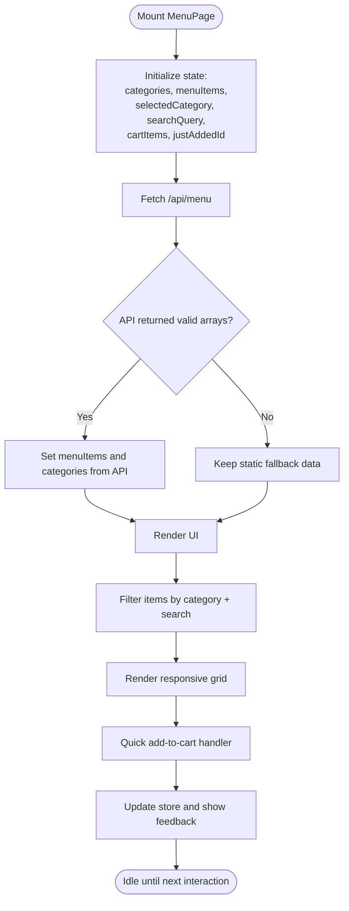
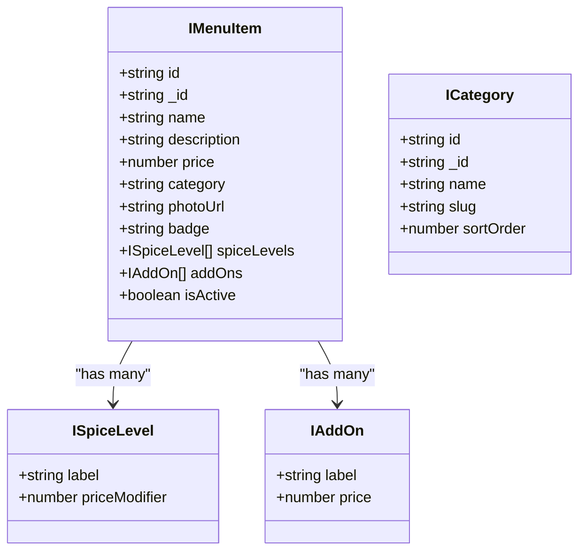
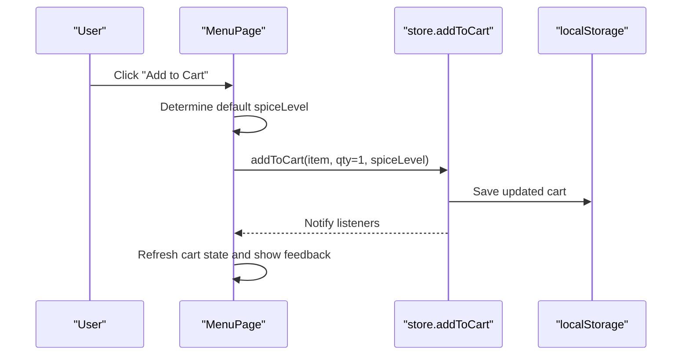
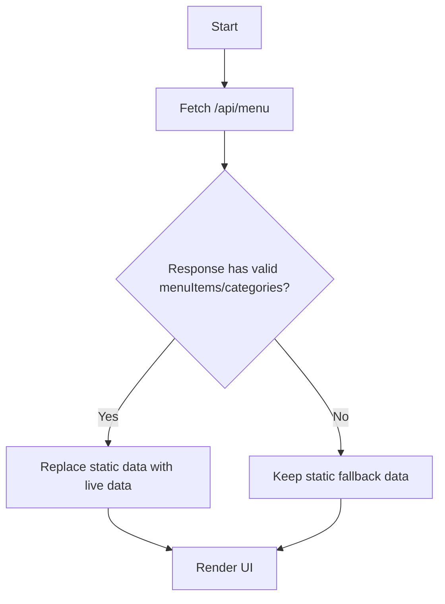
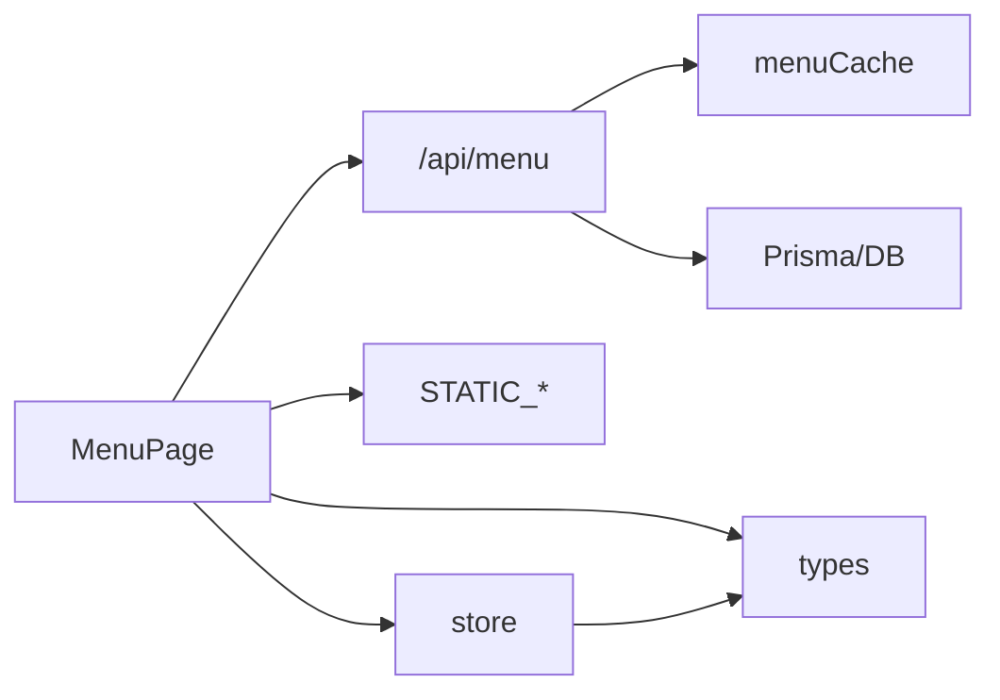

# Menu System

<cite>
**Referenced Files in This Document**
- [app/menu/page.tsx](file://app/menu/page.tsx)
- [app/api/menu/route.ts](file://app/api/menu/route.ts)
- [lib/staticData.ts](file://lib/staticData.ts)
- [lib/types.ts](file://lib/types.ts)
- [lib/store.ts](file://lib/store.ts)
- [lib/menuCache.ts](file://lib/menuCache.ts)
</cite>

## Table of Contents
1. [Introduction](#introduction)
2. [Project Structure](#project-structure)
3. [Core Components](#core-components)
4. [Architecture Overview](#architecture-overview)
5. [Detailed Component Analysis](#detailed-component-analysis)
6. [Dependency Analysis](#dependency-analysis)
7. [Performance Considerations](#performance-considerations)
8. [Troubleshooting Guide](#troubleshooting-guide)
9. [Conclusion](#conclusion)

## Introduction
This document explains the menu system component that powers the customer-facing menu browsing experience. It covers:
- Interactive category filtering and search
- Responsive grid layout for menu items
- Badge system (Best Seller, Chef's Choice, Vegan Friendly)
- Quick add-to-cart functionality with spice level defaults
- Integration between static data fallbacks and API endpoints for dynamic loading
- Category icons, image optimization, and mobile-responsive design patterns

The implementation is a Next.js client component backed by an API route and an in-memory cache layer, with local storage used for cart state.

## Project Structure
The menu system spans a few focused files:
- A client-side page component for rendering the interactive menu UI
- An API route to serve menu items and categories from the database
- Static data for initial/fallback content
- Shared types for menu items and categories
- Store utilities for cart state and cross-component events
- In-memory cache for fast public reads

**Diagram sources**
- [app/menu/page.tsx:1-320](file://app/menu/page.tsx#L1-L320)
- [app/api/menu/route.ts:1-109](file://app/api/menu/route.ts#L1-L109)
- [lib/staticData.ts:1-166](file://lib/staticData.ts#L1-L166)
- [lib/types.ts:1-119](file://lib/types.ts#L1-L119)
- [lib/store.ts:1-217](file://lib/store.ts#L1-L217)
- [lib/menuCache.ts:1-47](file://lib/menuCache.ts#L1-L47)

**Section sources**
- [app/menu/page.tsx:1-320](file://app/menu/page.tsx#L1-L320)
- [app/api/menu/route.ts:1-109](file://app/api/menu/route.ts#L1-L109)
- [lib/staticData.ts:1-166](file://lib/staticData.ts#L1-L166)
- [lib/types.ts:1-119](file://lib/types.ts#L1-L119)
- [lib/store.ts:1-217](file://lib/store.ts#L1-L217)
- [lib/menuCache.ts:1-47](file://lib/menuCache.ts#L1-L47)

## Core Components
- MenuPage (client component): Renders the hero banner, circular category filter bar, responsive menu grid, badges, quick add-to-cart button, and a mobile bottom cart summary.
- API /api/menu: Serves active menu items and categories, with in-memory caching for high-frequency reads.
- Static data: Provides initial categories and sample menu items as fallbacks when the API is unavailable or returns empty results.
- Types: Defines shared interfaces for categories, menu items, spice levels, add-ons, and related entities.
- Store: Manages cart persistence, quantity updates, and event-driven synchronization across components.
- Menu cache: Provides an in-process cache for menu and categories to reduce database load.

Key responsibilities:
- Fetching and merging live data with static fallbacks
- Filtering by category slug and text search
- Rendering badges and images with optimized sizing
- Adding items to cart with optional default spice level
- Reactively updating cart totals and counts

**Section sources**
- [app/menu/page.tsx:12-319](file://app/menu/page.tsx#L12-L319)
- [app/api/menu/route.ts:7-65](file://app/api/menu/route.ts#L7-L65)
- [lib/staticData.ts:9-141](file://lib/staticData.ts#L9-L141)
- [lib/types.ts:6-38](file://lib/types.ts#L6-L38)
- [lib/store.ts:67-138](file://lib/store.ts#L67-L138)
- [lib/menuCache.ts:24-46](file://lib/menuCache.ts#L24-L46)

## Architecture Overview
The menu system uses a layered approach:
- Presentation layer (MenuPage) handles user interactions and renders the UI
- Data layer (API route) queries the database and serves structured JSON
- Caching layer (menuCache) reduces latency for repeated requests
- State layer (store) persists cart state and coordinates cross-component updates
- Fallback layer (staticData) ensures the UI works even without network access

**Diagram sources**
- [app/menu/page.tsx:27-40](file://app/menu/page.tsx#L27-L40)
- [app/api/menu/route.ts:11-60](file://app/api/menu/route.ts#L11-L60)
- [lib/menuCache.ts:24-46](file://lib/menuCache.ts#L24-L46)
- [lib/store.ts:99-138](file://lib/store.ts#L99-L138)

## Detailed Component Analysis

### MenuPage: Interactive Browsing Interface
Responsibilities:
- Load categories and menu items from API; fall back to static data if needed
- Maintain selected category and search query
- Compute filtered items based on category slug and search text
- Render responsive grid with badges and quick add-to-cart
- Show mobile bottom cart bar when items are present

Interactive features:
- Circular category filter bar with emoji icons and active states
- Real-time search filtering against item name and description
- Quick add-to-cart with visual feedback (check icon briefly shown)
- Cart count and total computed via memoization

Responsive behavior:
- Grid adapts from single column on small screens to multiple columns on larger screens
- Hero banner scales typography and spacing
- Mobile-only floating cart bar appears at the bottom

**Diagram sources**
- [app/menu/page.tsx:27-40](file://app/menu/page.tsx#L27-L40)
- [app/menu/page.tsx:57-82](file://app/menu/page.tsx#L57-L82)
- [app/menu/page.tsx:221-295](file://app/menu/page.tsx#L221-L295)

**Section sources**
- [app/menu/page.tsx:12-319](file://app/menu/page.tsx#L12-L319)

### Category Filtering and Search
- Categories are rendered as circular buttons with emoji icons and labels. The active category highlights with a ring and background color.
- The selected category slug filters menu items by exact match.
- Search input synchronizes with a global search event bus; the page listens to updates and filters items by name and description.

Implementation details:
- Category mapping includes a default icon for unknown slugs
- Filtering logic normalizes strings and checks both category and search terms
- Resetting filters clears both category and search query

**Section sources**
- [app/menu/page.tsx:99-106](file://app/menu/page.tsx#L99-L106)
- [app/menu/page.tsx:159-199](file://app/menu/page.tsx#L159-L199)
- [app/menu/page.tsx:57-69](file://app/menu/page.tsx#L57-L69)

### Menu Item Display Logic and Badges
Each menu item card shows:
- Image with aspect ratio and hover scale effect
- Optional badge overlay (Best Seller, Chef's Choice, Vegan Friendly)
- Title and truncated description
- Price formatted in Rupiah
- Quick add-to-cart button with success feedback

Badge system:
- Normalizes badge values to display friendly labels
- Applies distinct colors per badge type
- Supports variants like best_seller, chefs_choice, vegan_friendly and aliases

Image handling:
- Uses Next.js Image component with fill and sizes for responsive delivery
- Falls back to a placeholder URL if photoUrl is missing
- Disables automatic optimization for external URLs

**Diagram sources**
- [lib/types.ts:14-38](file://lib/types.ts#L14-L38)
- [lib/types.ts:6-12](file://lib/types.ts#L6-L12)

**Section sources**
- [app/menu/page.tsx:84-97](file://app/menu/page.tsx#L84-L97)
- [app/menu/page.tsx:221-295](file://app/menu/page.tsx#L221-L295)
- [lib/types.ts:14-38](file://lib/types.ts#L14-L38)

### Quick Add-to-Cart Functionality
Behavior:
- Adds one unit of the selected menu item to the cart
- Defaults spice level to "Sedang" if the item defines spice levels
- Shows a brief checkmark indicator after adding
- Updates cart state and triggers UI refreshes via event listeners

Cart integration:
- Uses addToCart from store, which computes unit price including add-ons
- Persists cart to localStorage and notifies subscribers
- Computes cartCount and cartTotal using memoized reducers

**Diagram sources**
- [app/menu/page.tsx:71-82](file://app/menu/page.tsx#L71-L82)
- [lib/store.ts:99-138](file://lib/store.ts#L99-L138)

**Section sources**
- [app/menu/page.tsx:71-82](file://app/menu/page.tsx#L71-L82)
- [lib/store.ts:67-138](file://lib/store.ts#L67-L138)

### Static Data Fallbacks and API Integration
- On mount, MenuPage attempts to fetch /api/menu. If the response contains valid arrays, it replaces the initial static data.
- If the fetch fails or returns invalid data, the page continues with STATIC_CATEGORIES and STATIC_MENU_ITEMS.
- The API route serves active menu items and all categories, optionally including inactive items via a query parameter.

**Diagram sources**
- [app/menu/page.tsx:27-40](file://app/menu/page.tsx#L27-L40)
- [app/api/menu/route.ts:7-65](file://app/api/menu/route.ts#L7-L65)
- [lib/staticData.ts:9-141](file://lib/staticData.ts#L9-L141)

**Section sources**
- [app/menu/page.tsx:27-40](file://app/menu/page.tsx#L27-L40)
- [app/api/menu/route.ts:7-65](file://app/api/menu/route.ts#L7-L65)
- [lib/staticData.ts:9-141](file://lib/staticData.ts#L9-L141)

### Category Icons and Image Optimization
- Category icons use emoji mapped by slug, with a fallback icon for unknown slugs.
- Images use Next.js Image with fill and sizes attributes to optimize loading across breakpoints.
- External image URLs disable automatic optimization to avoid build-time resolution issues.

**Section sources**
- [app/menu/page.tsx:99-106](file://app/menu/page.tsx#L99-L106)
- [app/menu/page.tsx:232-243](file://app/menu/page.tsx#L232-L243)

### Mobile-Responsive Design Patterns
- Grid layout transitions from 1 column on small screens to 2/3/4 columns on larger screens.
- Hero banner scales typography and padding.
- Floating cart bar appears only on non-desktop viewports, showing item count and total price.

**Section sources**
- [app/menu/page.tsx:201-295](file://app/menu/page.tsx#L201-L295)
- [app/menu/page.tsx:299-316](file://app/menu/page.tsx#L299-L316)

## Dependency Analysis
The menu system’s dependencies form a clear separation of concerns:
- MenuPage depends on:
  - API route for live data
  - Static data for fallbacks
  - Store for cart operations and events
  - Types for consistent data shapes
- API route depends on:
  - Database via Prisma
  - Menu cache for performance
- Store depends on:
  - Types for cart item structure
  - LocalStorage for persistence

**Diagram sources**
- [app/menu/page.tsx:1-320](file://app/menu/page.tsx#L1-L320)
- [app/api/menu/route.ts:1-109](file://app/api/menu/route.ts#L1-L109)
- [lib/staticData.ts:1-166](file://lib/staticData.ts#L1-L166)
- [lib/types.ts:1-119](file://lib/types.ts#L1-L119)
- [lib/store.ts:1-217](file://lib/store.ts#L1-L217)
- [lib/menuCache.ts:1-47](file://lib/menuCache.ts#L1-L47)

**Section sources**
- [app/menu/page.tsx:1-320](file://app/menu/page.tsx#L1-L320)
- [app/api/menu/route.ts:1-109](file://app/api/menu/route.ts#L1-L109)
- [lib/staticData.ts:1-166](file://lib/staticData.ts#L1-L166)
- [lib/types.ts:1-119](file://lib/types.ts#L1-L119)
- [lib/store.ts:1-217](file://lib/store.ts#L1-L217)
- [lib/menuCache.ts:1-47](file://lib/menuCache.ts#L1-L47)

## Performance Considerations
- In-memory cache: The API route caches menu and categories for up to 60 seconds, reducing database roundtrips and improving response times for public reads.
- Memoization: Cart count and total are computed with useMemo to avoid unnecessary recalculations.
- Image optimization: Using Next.js Image with fill and sizes improves perceived performance on varied screen sizes.
- Event-driven updates: Store events notify subscribers only when cart state changes, minimizing re-renders.

Recommendations:
- Ensure external image URLs are reliable; consider hosting images within the app for better control over optimization.
- Monitor cache invalidation after mutations to keep data fresh.
- Debounce search input if server-side search becomes necessary.

[No sources needed since this section provides general guidance]

## Troubleshooting Guide
Common issues and resolutions:
- Menu not loading:
  - Check network request to /api/menu and ensure the API route returns valid arrays.
  - Verify static fallback data is present so the UI remains functional offline.
- Badges not displaying:
  - Confirm the badge field matches supported values (best_seller, chefs_choice, vegan_friendly).
  - Normalize badge strings in the backend to avoid mismatches.
- Cart not updating:
  - Ensure addToCart is called with a valid item and that storeEvents subscribers are registered.
  - Validate localStorage availability and permissions.
- Images not optimizing:
  - For external URLs, automatic optimization is disabled; verify CDN availability and CORS settings.

**Section sources**
- [app/menu/page.tsx:27-40](file://app/menu/page.tsx#L27-L40)
- [app/menu/page.tsx:84-97](file://app/menu/page.tsx#L84-L97)
- [lib/store.ts:67-138](file://lib/store.ts#L67-L138)
- [app/api/menu/route.ts:7-65](file://app/api/menu/route.ts#L7-L65)

## Conclusion
The menu system delivers a responsive, interactive browsing experience with robust fallbacks and efficient data handling. It combines client-side interactivity with server-side data fetching and caching, while maintaining clean separation through shared types and event-driven state management. The badge system, quick add-to-cart, and mobile-first design patterns provide a polished user experience suitable for restaurant ordering workflows.

[No sources needed since this section summarizes without analyzing specific files]