# Promotions & Coupons

<cite>
**Referenced Files in This Document**
- [schema.prisma](file://prisma/schema.prisma)
- [coupon.ts](file://lib/coupon.ts)
- [store.ts](file://lib/store.ts)
- [route.ts (coupons list)](file://app/api/coupons/route.ts)
- [route.ts (coupon validation)](file://app/api/coupons/validate/route.ts)
- [route.ts (admin coupons list and create)](file://app/api/admin/coupons/route.ts)
- [route.ts (admin coupon update/delete)](file://app/api/admin/coupons/[id]/route.ts)
- [route.ts (promos list/create)](file://app/api/promos/route.ts)
- [route.ts (promo update/delete)](file://app/api/promos/[id]/route.ts)
- [page.tsx (checkout)](file://app/checkout/page.tsx)
- [page.tsx (promo)](file://app/promo/page.tsx)
- [route.ts (orders)](file://app/api/orders/route.ts)
- [route.ts (order status/update)](file://app/api/orders/[id]/route.ts)
- [page.tsx (order status)](file://app/order/[orderId]/page.tsx)
</cite>

## Update Summary
**Changes Made**
- Enhanced promotional system UI with modern ticket-style coupon cards and improved user experience
- Integrated comprehensive payment tracking system with real-time order status monitoring
- Added QRIS payment method support alongside traditional cash payments
- Implemented real-time order polling with 5-second intervals for live status updates
- Enhanced checkout flow with quick coupon selection interface and toast notifications
- Added digital receipt generation upon order completion
- Improved session storage integration for seamless navigation between promo and checkout pages

## Table of Contents
1. [Introduction](#introduction)
2. [Project Structure](#project-structure)
3. [Core Components](#core-components)
4. [Architecture Overview](#architecture-overview)
5. [Detailed Component Analysis](#detailed-component-analysis)
6. [Enhanced Payment Tracking System](#enhanced-payment-tracking-system)
7. [Real-Time Order Status Monitoring](#real-time-order-status-monitoring)
8. [Session Storage Integration](#session-storage-integration)
9. [Enhanced User Interface](#enhanced-user-interface)
10. [Dependency Analysis](#dependency-analysis)
11. [Performance Considerations](#performance-considerations)
12. [Security and Fraud Prevention](#security-and-fraud-prevention)
13. [Troubleshooting Guide](#troubleshooting-guide)
14. [Conclusion](#conclusion)

## Introduction
This document explains the enhanced promotions and coupon management system with integrated payment tracking capabilities, including discount calculation, coupon validation rules, promotional pricing display, cart discount application, order total computation, usage tracking, expiration handling, security measures, and performance optimization strategies.

The system now features:
- Modern ticket-style coupon UI with copy-to-clipboard functionality and toast notifications
- Comprehensive payment tracking with QRIS and cash payment methods
- Real-time order status monitoring with automatic polling every 5 seconds
- Digital receipt generation upon order completion
- Session storage integration for seamless navigation between promo and checkout pages
- Quick coupon selection interface directly on the checkout page
- Enhanced promotional menu items with original and discounted prices
- Server-side authoritative calculations for tax, service charge, and final totals
- Admin APIs to manage coupons, promos, and order status updates
- Usage tracking via per-day availability and atomic order creation

## Project Structure
Promotions, coupons, and payment tracking are implemented across API routes, a shared discount engine, session storage utilities, and data models:

- Data model definitions live in the Prisma schema with enhanced order tracking fields
- The discount engine is centralized in a reusable library module
- Session storage utilities handle cross-page state management
- Public and admin API routes expose CRUD and validation endpoints
- Enhanced UI components integrate coupon validation, promo item selection, and payment tracking
- Order creation recomputes totals server-side and records coupon usage atomically
- Real-time order status polling provides live updates to customers

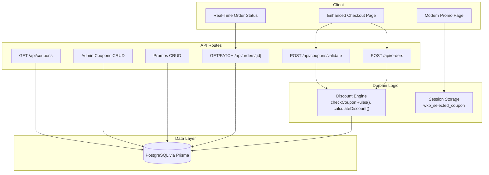

**Diagram sources**
- [page.tsx (checkout):1-673](file://app/checkout/page.tsx#L1-L673)
- [page.tsx (promo):1-567](file://app/promo/page.tsx#L1-L567)
- [page.tsx (order status):1-313](file://app/order/[orderId]/page.tsx#L1-L313)
- [route.ts (coupons list):1-33](file://app/api/coupons/route.ts#L1-L33)
- [route.ts (coupon validation):1-58](file://app/api/coupons/validate/route.ts#L1-L58)
- [route.ts (admin coupons list and create):1-129](file://app/api/admin/coupons/route.ts#L1-L129)
- [route.ts (admin coupon update/delete):1-102](file://app/api/admin/coupons/[id]/route.ts#L1-L102)
- [route.ts (promos list/create):1-38](file://app/api/promos/route.ts#L1-L38)
- [route.ts (promo update/delete):1-52](file://app/api/promos/[id]/route.ts#L1-L52)
- [route.ts (orders):1-294](file://app/api/orders/route.ts#L1-L294)
- [route.ts (order status/update):1-103](file://app/api/orders/[id]/route.ts#L1-L103)
- [coupon.ts:1-133](file://lib/coupon.ts#L1-L133)

**Section sources**
- [schema.prisma:47-110](file://prisma/schema.prisma#L47-L110)
- [coupon.ts:1-133](file://lib/coupon.ts#L1-L133)
- [store.ts:1-217](file://lib/store.ts#L1-L217)
- [route.ts (coupons list):1-33](file://app/api/coupons/route.ts#L1-L33)
- [route.ts (coupon validation):1-58](file://app/api/coupons/validate/route.ts#L1-L58)
- [route.ts (admin coupons list and create):1-129](file://app/api/admin/coupons/route.ts#L1-L129)
- [route.ts (admin coupon update/delete):1-102](file://app/api/admin/coupons/[id]/route.ts#L1-L102)
- [route.ts (promos list/create):1-38](file://app/api/promos/route.ts#L1-L38)
- [route.ts (promo update/delete):1-52](file://app/api/promos/[id]/route.ts#L1-L52)
- [page.tsx (checkout):1-673](file://app/checkout/page.tsx#L1-L673)
- [page.tsx (promo):1-567](file://app/promo/page.tsx#L1-L567)
- [page.tsx (order status):1-313](file://app/order/[orderId]/page.tsx#L1-L313)
- [route.ts (orders):1-294](file://app/api/orders/route.ts#L1-L294)
- [route.ts (order status/update):1-103](file://app/api/orders/[id]/route.ts#L1-L103)

## Core Components
- Discount engine: Centralized logic for coupon validation and discount calculation
- Session storage utilities: Cross-page state management for coupon codes
- Coupon data model: Stores code, discount type/value, min order amount, max discount cap, validity period, active state, and usage metadata
- Promo data model: Stores promotional menu items with original and discounted prices
- Enhanced UI components: Modern ticket-style coupon cards with copy functionality and toast notifications
- Payment tracking system: Real-time order status monitoring with QRIS and cash payment support
- API layer: Endpoints for listing, validating, creating, updating, and deleting coupons and promos; order creation applies coupons and computes totals; order status updates
- Checkout UI: Applies coupons, shows promo items, previews totals before submission with quick selection interface and payment method selection

Key responsibilities:
- Validation: Enforce active status, date range, daily usage limit, and minimum order amount
- Calculation: Compute discount based on percentage or fixed value, capped by maximum discount and subtotal
- Persistence: Store orders with coupon code and discount amount; track last used date for daily limits
- Session Management: Maintain coupon state across page navigation using sessionStorage
- Payment Tracking: Monitor order status changes and payment confirmation in real-time
- User Experience: Provide intuitive UI with copy-to-clipboard, toast notifications, auto-navigation, and live order status updates

**Section sources**
- [coupon.ts:3-17](file://lib/coupon.ts#L3-L17)
- [store.ts:1-217](file://lib/store.ts#L1-L217)
- [schema.prisma:47-110](file://prisma/schema.prisma#L47-L110)
- [route.ts (coupon validation):1-58](file://app/api/coupons/validate/route.ts#L1-L58)
- [route.ts (orders):1-294](file://app/api/orders/route.ts#L1-L294)
- [route.ts (order status/update):1-103](file://app/api/orders/[id]/route.ts#L1-L103)

## Architecture Overview
The system follows a layered architecture with enhanced session management and real-time payment tracking:
- Client layer: Enhanced checkout and promo pages interact with public coupon validation and promo endpoints; order status page polls for real-time updates
- Session layer: Manages cross-page state for coupon codes using browser sessionStorage
- API layer: Next.js route handlers validate inputs, call domain logic, persist data, and provide real-time order status updates
- Domain layer: Reusable functions encapsulate business rules for coupon validation and discount calculation
- Data layer: Prisma client queries PostgreSQL tables for coupons, promos, orders, and settings

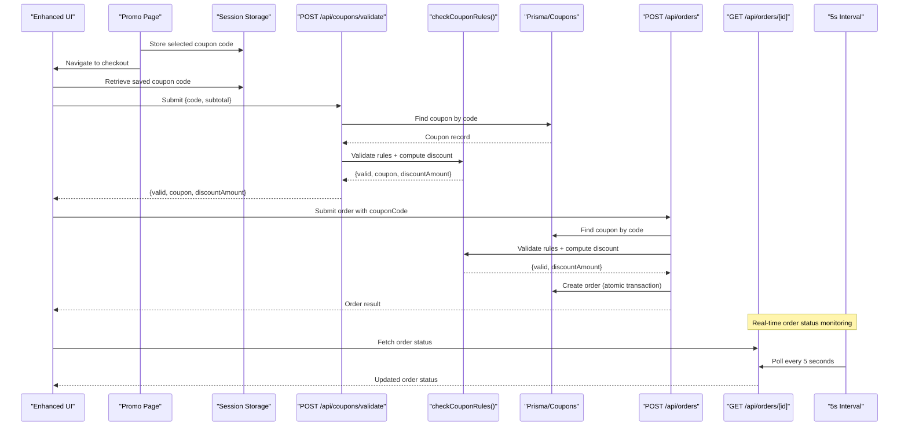

**Diagram sources**
- [page.tsx (promo):59-99](file://app/promo/page.tsx#L59-L99)
- [page.tsx (checkout):76-83](file://app/checkout/page.tsx#L76-L83)
- [page.tsx (order status):19-40](file://app/order/[orderId]/page.tsx#L19-L40)
- [route.ts (coupon validation):1-58](file://app/api/coupons/validate/route.ts#L1-L58)
- [coupon.ts:80-132](file://lib/coupon.ts#L80-L132)
- [route.ts (orders):1-294](file://app/api/orders/route.ts#L1-L294)
- [route.ts (order status/update):1-103](file://app/api/orders/[id]/route.ts#L1-L103)

## Detailed Component Analysis

### Enhanced Session Storage Integration
The system now uses browser sessionStorage to maintain coupon state across page navigation:

**Session Storage Flow:**
- When users copy or use a coupon on the promo page, the code is stored in `wkb_selected_coupon`
- On checkout page load, the system automatically retrieves and populates the coupon input field
- The session data is cleared after successful retrieval to prevent reuse

**Implementation Details:**
- Promo page stores coupon codes when copied or used
- Checkout page reads and auto-populates the coupon input field
- Automatic cleanup prevents stale session data from interfering with new sessions

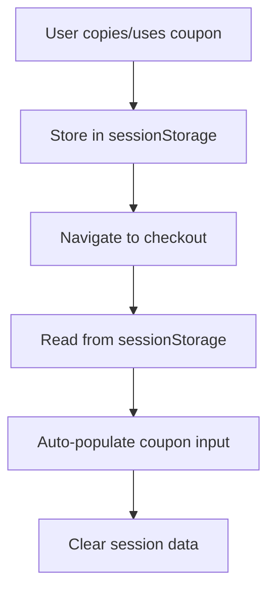

**Diagram sources**
- [page.tsx (promo):59-89](file://app/promo/page.tsx#L59-L89)
- [page.tsx (checkout):87-94](file://app/checkout/page.tsx#L87-L94)

**Section sources**
- [page.tsx (promo):59-89](file://app/promo/page.tsx#L59-L89)
- [page.tsx (checkout):87-94](file://app/checkout/page.tsx#L87-L94)

### Enhanced User Interface Design
The coupon system now features a modern, ticket-style UI design with comprehensive payment tracking:

**Promo Page Features:**
- Ticket-style coupon cards with perforated edges and vintage styling
- Copy-to-clipboard functionality with visual feedback
- Toast notifications guiding users to next steps
- Quick navigation to checkout or menu based on cart state
- Visual indicators for discount types (percentage vs fixed amount)

**Checkout Page Enhancements:**
- Quick coupon selection interface showing available coupons
- Real-time validation with immediate feedback
- Applied coupon display with removal option
- Enhanced visual hierarchy with color-coded status indicators
- Payment method selection (QRIS and Cash)
- Improved form validation and error messaging

**Section sources**
- [page.tsx (promo):121-567](file://app/promo/page.tsx#L121-L567)
- [page.tsx (checkout):328-580](file://app/checkout/page.tsx#L328-L580)

### Discount Calculation Engine
Responsibilities remain consistent with enhanced integration:
- Determine if a coupon is available today using lastUsedDate
- Calculate discount amount based on discountType (PERCENTAGE or FIXED), discountValue, optional maxDiscountAmount, and subtotal
- Provide a unified validation function that checks active status, date range, daily usage, and minimum order amount

Complexity:
- Time complexity: O(1) per validation and discount calculation
- Space complexity: O(1)

Optimization opportunities:
- Cache frequently validated coupons in memory for short-lived sessions
- Precompute discount ranges for common subtotal buckets if needed

Error handling:
- Returns structured results indicating validity and error messages
- Ensures discount never exceeds subtotal and is non-negative

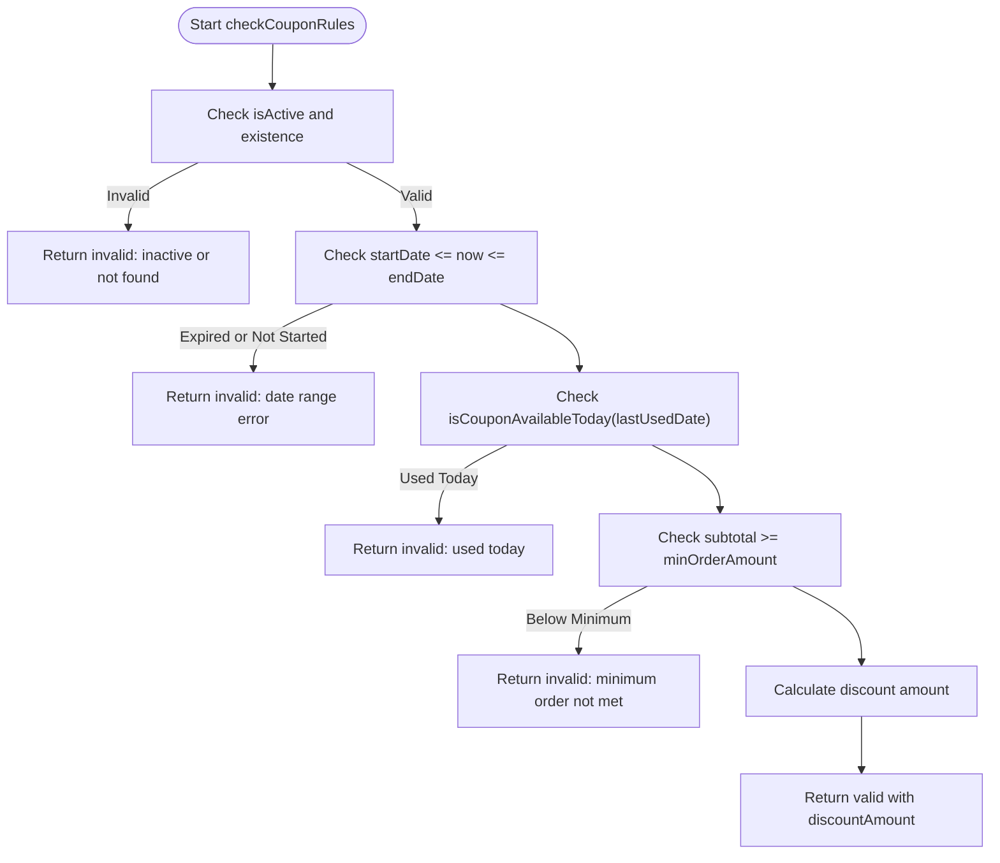

**Diagram sources**
- [coupon.ts:23-61](file://lib/coupon.ts#L23-L61)
- [coupon.ts:80-132](file://lib/coupon.ts#L80-L132)

**Section sources**
- [coupon.ts:1-133](file://lib/coupon.ts#L1-L133)

### Coupon Validation Rules
Rules enforced remain consistent with enhanced UI integration:
- Coupon must exist and be active
- Current time must be within the start and end dates
- Coupon can be used only once per calendar day (based on lastUsedDate)
- Subtotal must meet the minimum order amount
- Discount calculation respects percentage/fixed types and optional maximum discount cap

Validation flow:
- Input normalization: Trim and uppercase coupon code
- Database lookup: Retrieve coupon by unique code
- Rule evaluation: Apply all business rules
- Result: Return structured response with coupon details and computed discount when valid

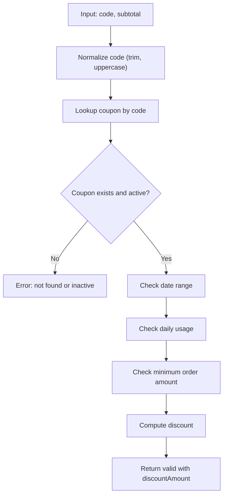

**Diagram sources**
- [route.ts (coupon validation):1-58](file://app/api/coupons/validate/route.ts#L1-L58)
- [coupon.ts:80-132](file://lib/coupon.ts#L80-L132)

**Section sources**
- [route.ts (coupon validation):1-58](file://app/api/coupons/validate/route.ts#L1-L58)
- [coupon.ts:80-132](file://lib/coupon.ts#L80-L132)

### Promotional Pricing Logic
Promo items are stored with original and discounted prices and displayed as enhanced menu items. The checkout page converts a selected promo into a cart item using its discounted price.

Display behavior:
- List active promos via GET /api/promos
- Optionally include inactive promos for admin purposes
- Add promo as a cart item with name, description, and discounted price

Creation and updates:
- Admin endpoints support creating, updating, and deleting promos
- Fields include title, description, originalPrice, discountedPrice, and isActive

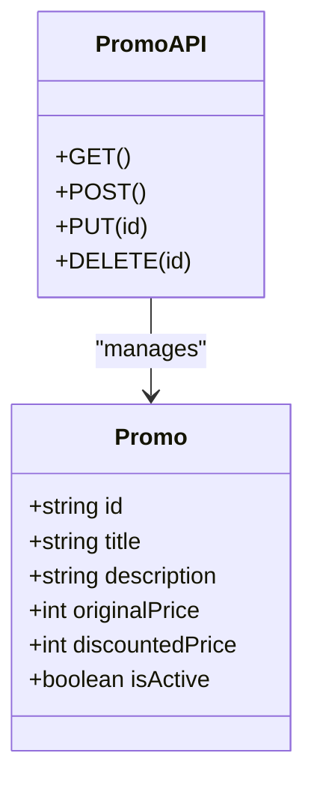

**Diagram sources**
- [schema.prisma:47-56](file://prisma/schema.prisma#L47-L56)
- [route.ts (promos list/create):1-38](file://app/api/promos/route.ts#L1-L38)
- [route.ts (promo update/delete):1-52](file://app/api/promos/[id]/route.ts#L1-L52)

**Section sources**
- [schema.prisma:47-56](file://prisma/schema.prisma#L47-L56)
- [route.ts (promos list/create):1-38](file://app/api/promos/route.ts#L1-L38)
- [route.ts (promo update/delete):1-52](file://app/api/promos/[id]/route.ts#L1-L52)
- [page.tsx (checkout):116-132](file://app/checkout/page.tsx#L116-L132)

### Enhanced Coupon Creation Workflow
Admin workflow remains consistent with enhanced integration:
- Validate required fields: code, title, discountType, discountValue, minOrderAmount, startDate, endDate
- Enforce business constraints: positive discount values, percentage <= 100%, valid date ranges, no duplicate codes
- Persist coupon with default active state unless specified otherwise

Enrichment:
- Admin list endpoint enriches coupons with isAvailableToday flag using the same daily availability logic

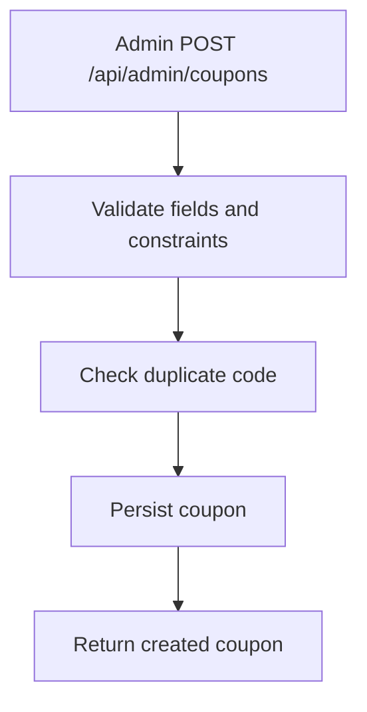

**Diagram sources**
- [route.ts (admin coupons list and create):29-129](file://app/api/admin/coupons/route.ts#L29-L129)

**Section sources**
- [route.ts (admin coupons list and create):1-129](file://app/api/admin/coupons/route.ts#L1-L129)

### Usage Tracking and Expiration Handling
Usage tracking remains consistent with enhanced UI integration:
- Daily usage is tracked via lastUsedDate field
- isCouponAvailableToday compares lastUsedDate with current date to determine availability
- On successful order creation, the system updates usage metadata atomically within a transaction

Expiration handling:
- Validation rejects coupons outside their startDate and endDate
- Listing endpoints filter by active status and date range

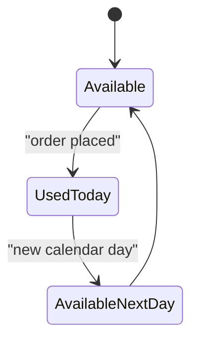

**Diagram sources**
- [coupon.ts:23-33](file://lib/coupon.ts#L23-L33)
- [route.ts (orders):237-257](file://app/api/orders/route.ts#L237-L257)

**Section sources**
- [coupon.ts:23-33](file://lib/coupon.ts#L23-L33)
- [route.ts (orders):237-257](file://app/api/orders/route.ts#L237-L257)

### Enhanced Menu Item Promotion Display
Promo items are presented as enhanced menu entries with discounted prices. The checkout page adds selected promos to the cart as regular items using the discounted price.

Behavior:
- Fetch active promos from API
- Convert promo to a cart item with name, description, and discounted price
- Show promo selection in enhanced checkout UI

**Section sources**
- [route.ts (promos list/create):1-38](file://app/api/promos/route.ts#L1-L38)
- [page.tsx (checkout):116-132](file://app/checkout/page.tsx#L116-L132)

### Enhanced Cart Discount Application
On the enhanced checkout page:
- User enters a coupon code or selects from quick selection interface
- Frontend calls POST /api/coupons/validate with code and subtotal
- If valid, frontend displays applied coupon and discount amount with enhanced styling
- Frontend recalculates preview discount when subtotal changes, ensuring consistency with server-side rules

Important note:
- Final totals are recomputed server-side during order creation; frontend preview is for display only

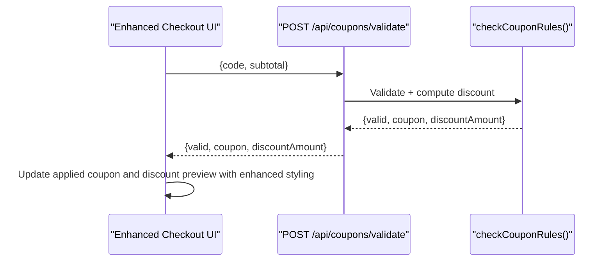

**Diagram sources**
- [page.tsx (checkout):164-197](file://app/checkout/page.tsx#L164-L197)
- [route.ts (coupon validation):1-58](file://app/api/coupons/validate/route.ts#L1-L58)
- [coupon.ts:80-132](file://lib/coupon.ts#L80-L132)

**Section sources**
- [page.tsx (checkout):164-197](file://app/checkout/page.tsx#L164-L197)
- [route.ts (coupon validation):1-58](file://app/api/coupons/validate/route.ts#L1-L58)

### Order Total Calculations
Server-side order creation remains consistent with enhanced integration:
- Validates items and add-ons
- Computes subtotal from validated items
- Optionally validates coupon and computes discount
- Calculates tax and service charge based on configured rates
- Computes final total: subtotal - discount + tax + service charge
- Creates order atomically within a transaction, recording coupon usage and payment information

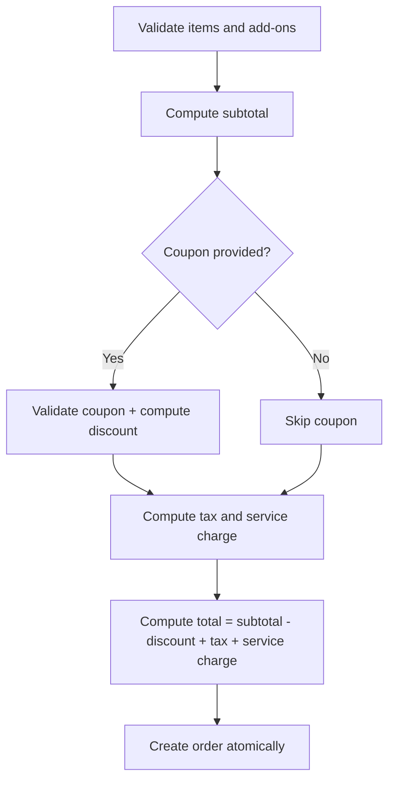

**Diagram sources**
- [route.ts (orders):123-283](file://app/api/orders/route.ts#L123-L283)

**Section sources**
- [route.ts (orders):123-283](file://app/api/orders/route.ts#L123-L283)

## Enhanced Payment Tracking System

The system now includes comprehensive payment tracking with support for multiple payment methods and real-time status monitoring:

**Payment Methods Supported:**
- **Cash**: Traditional cash payment at the cashier
- **QRIS**: Quick Response Indonesian Standard for digital payments

**Order Status Lifecycle:**
- `received`: Order received by kitchen
- `preparing`: Food being prepared
- `ready`: Food ready to be served
- `completed`: Order completed, ready for payment

**Payment Status Tracking:**
- `unpaid`: Payment pending
- `paid`: Payment confirmed by cashier

**Implementation Details:**
- Order creation captures payment method and initial payment status
- Admin endpoints allow updating order status and payment information
- Real-time polling provides live updates to customer-facing order status page
- Digital receipts generated upon order completion with full payment details

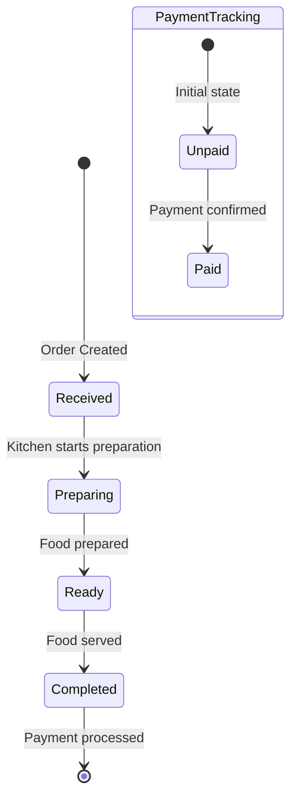

**Diagram sources**
- [page.tsx (order status):56-71](file://app/order/[orderId]/page.tsx#L56-L71)
- [route.ts (order status/update):25-81](file://app/api/orders/[id]/route.ts#L25-L81)

**Section sources**
- [schema.prisma:58-79](file://prisma/schema.prisma#L58-L79)
- [route.ts (orders):259-281](file://app/api/orders/route.ts#L259-L281)
- [route.ts (order status/update):25-81](file://app/api/orders/[id]/route.ts#L25-L81)
- [page.tsx (order status):185-208](file://app/order/[orderId]/page.tsx#L185-L208)

## Real-Time Order Status Monitoring

The order status page implements real-time monitoring with automatic polling to provide customers with live updates on their order progress:

**Polling Mechanism:**
- Automatic polling every 5 seconds using setInterval
- Graceful error handling for network failures
- Cleanup of polling timers on component unmount
- Optimistic UI updates without requiring manual refresh

**Visual Progress Indicators:**
- Step-by-step progress tracker showing current order stage
- Color-coded status indicators (green for completed, amber for pending)
- Estimated wait time display
- Live payment status with confirmation badges

**Digital Receipt Generation:**
- Automatically appears when order reaches "completed" status
- Includes restaurant information, order details, and payment confirmation
- Shows payment method and status for reference
- Provides contact information for customer support

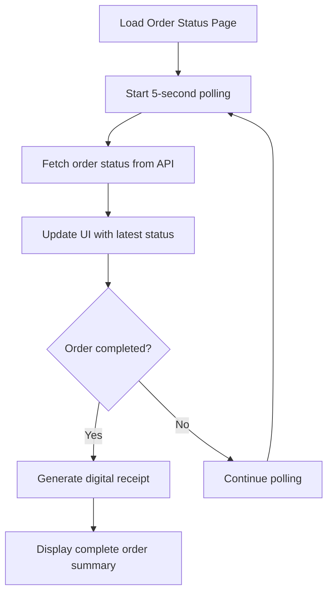

**Diagram sources**
- [page.tsx (order status):19-40](file://app/order/[orderId]/page.tsx#L19-L40)
- [page.tsx (order status):212-298](file://app/order/[orderId]/page.tsx#L212-L298)

**Section sources**
- [page.tsx (order status):19-40](file://app/order/[orderId]/page.tsx#L19-L40)
- [page.tsx (order status):212-298](file://app/order/[orderId]/page.tsx#L212-L298)
- [route.ts (order status/update):1-23](file://app/api/orders/[id]/route.ts#L1-L23)

## Dependency Analysis
Coupling and cohesion remain consistent with enhanced integration:
- The discount engine is decoupled from API routes, promoting reuse and testability
- Session storage utilities provide cross-page state management without tight coupling
- API routes depend on Prisma for data access and on the discount engine for business logic
- Enhanced UI components depend on public coupon validation and promo endpoints
- Order status monitoring depends on real-time API endpoints for live updates

External dependencies:
- PostgreSQL database accessed via Prisma
- Browser sessionStorage for cross-page state management
- Next.js runtime for API routes
- Real-time polling for order status updates

Potential circular dependencies:
- None observed; domain logic is isolated in the library module

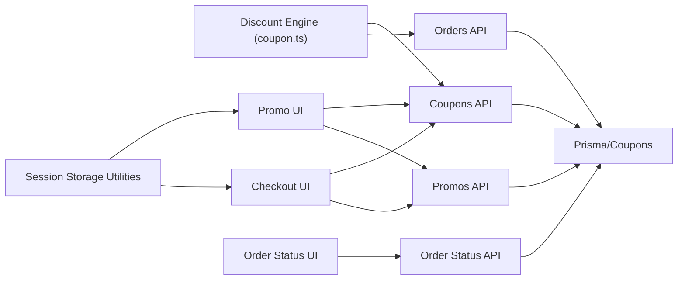

**Diagram sources**
- [coupon.ts:1-133](file://lib/coupon.ts#L1-L133)
- [store.ts:1-217](file://lib/store.ts#L1-L217)
- [route.ts (coupons list):1-33](file://app/api/coupons/route.ts#L1-L33)
- [route.ts (coupon validation):1-58](file://app/api/coupons/validate/route.ts#L1-L58)
- [route.ts (orders):1-294](file://app/api/orders/route.ts#L1-L294)
- [route.ts (promos list/create):1-38](file://app/api/promos/route.ts#L1-L38)
- [route.ts (order status/update):1-103](file://app/api/orders/[id]/route.ts#L1-L103)

**Section sources**
- [coupon.ts:1-133](file://lib/coupon.ts#L1-L133)
- [store.ts:1-217](file://lib/store.ts#L1-L217)
- [route.ts (coupons list):1-33](file://app/api/coupons/route.ts#L1-L33)
- [route.ts (coupon validation):1-58](file://app/api/coupons/validate/route.ts#L1-L58)
- [route.ts (orders):1-294](file://app/api/orders/route.ts#L1-L294)
- [route.ts (promos list/create):1-38](file://app/api/promos/route.ts#L1-L38)
- [route.ts (order status/update):1-103](file://app/api/orders/[id]/route.ts#L1-L103)

## Performance Considerations
- Indexing: Ensure indexes on coupon.code and coupon.isActive to speed up lookups and filtering
- Query optimization: Use server-side filters for active and date-range-valid coupons to reduce payload size
- Caching: Consider short-term in-memory caching for frequently accessed coupons and promos to reduce database load
- Transaction efficiency: Keep order creation transactions minimal and focused on essential writes
- Frontend preview: Avoid redundant recalculations by debouncing subtotal changes in the checkout UI
- Session storage: Leverage browser sessionStorage for lightweight cross-page state management without server overhead
- Polling optimization: 5-second polling interval balances real-time updates with server load
- Connection pooling: Efficient database connections through Prisma connection pooling

## Security and Fraud Prevention
Measures implemented remain consistent with enhanced integration:
- Server-side authoritative validation: All coupon validations and discount computations occur on the server
- Strict input validation: Admin endpoints enforce field constraints, positive values, percentage limits, and valid date ranges
- Unique code enforcement: Duplicate coupon codes are rejected at creation and update
- Soft delete for coupons: Deactivation sets isActive to false rather than deleting records, preserving audit trails
- Atomic operations: Order creation and coupon usage updates occur within a transaction to prevent race conditions
- Session storage security: Uses browser sessionStorage which is more secure than localStorage for temporary state
- Payment method validation: Only accepts predefined payment methods (cash, qris)
- Order status protection: Admin-only endpoints for order status updates with proper validation

Recommended enhancements:
- Rate limiting on coupon validation endpoints to mitigate abuse
- Request signing or CSRF protection for sensitive admin operations
- Audit logging for coupon usage and modifications
- IP-based throttling and anomaly detection for repeated failed validations
- Session storage validation to prevent tampering with coupon codes
- WebSocket implementation for true real-time updates instead of polling
- Payment gateway integration for automated QRIS payment confirmation

**Section sources**
- [route.ts (admin coupons list and create):29-129](file://app/api/admin/coupons/route.ts#L29-L129)
- [route.ts (admin coupon update/delete):1-102](file://app/api/admin/coupons/[id]/route.ts#L1-L102)
- [route.ts (orders):237-281](file://app/api/orders/route.ts#L237-L281)
- [route.ts (order status/update):25-81](file://app/api/orders/[id]/route.ts#L25-L81)

## Troubleshooting Guide
Common issues and resolutions remain consistent with enhanced integration:
- Coupon not found or inactive: Verify isActive and existence in the database; ensure correct code casing
- Coupon expired or not started: Check startDate and endDate against current time
- Daily usage limit reached: Confirm lastUsedDate is not on the current calendar day
- Minimum order amount not met: Increase subtotal or adjust coupon minOrderAmount
- Invalid discount configuration: Ensure discountValue is positive and percentage <= 100%; verify maxDiscountAmount logic
- Order creation errors: Inspect server logs for transaction failures and ensure coupon validation passes before submission
- Session storage issues: Check browser console for sessionStorage errors and verify cross-page navigation flow
- Payment tracking issues: Verify order status API endpoints are accessible and returning correct data
- Real-time polling problems: Check network connectivity and API response times for order status updates

Operational tips:
- Use admin endpoints to list coupons with isAvailableToday flags for quick diagnostics
- Validate coupon responses from POST /api/coupons/validate before applying them in the UI
- Monitor order creation logs to confirm atomic updates and correct total calculations
- Test session storage flow between promo and checkout pages to ensure smooth user experience
- Monitor order status polling performance and adjust polling intervals as needed
- Verify payment method validation and status updates through admin endpoints

**Section sources**
- [route.ts (coupon validation):1-58](file://app/api/coupons/validate/route.ts#L1-L58)
- [route.ts (admin coupons list and create):1-129](file://app/api/admin/coupons/route.ts#L1-L129)
- [route.ts (orders):1-294](file://app/api/orders/route.ts#L1-L294)
- [route.ts (order status/update):1-103](file://app/api/orders/[id]/route.ts#L1-L103)

## Conclusion
The enhanced promotions and coupons system with integrated payment tracking provides a robust foundation for managing promotional pricing and coupon-based discounts with significantly improved user experience. It enforces strict validation rules, calculates discounts accurately, ensures order totals are computed authoritatively on the server, and provides real-time payment tracking capabilities. The modern ticket-style UI design, session storage integration, enhanced user interface features, and comprehensive payment tracking create a seamless shopping experience. Admin APIs facilitate safe management of coupons, promos, and order status updates, while usage tracking and atomic transactions maintain data integrity. With additional security and performance enhancements, the system can scale effectively to handle high-volume promotions and coupon usage while providing an intuitive and engaging user interface with real-time order status monitoring.